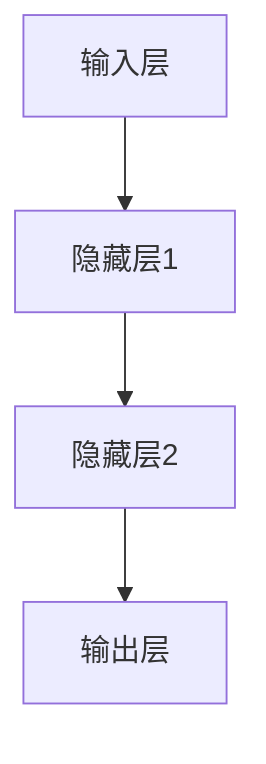
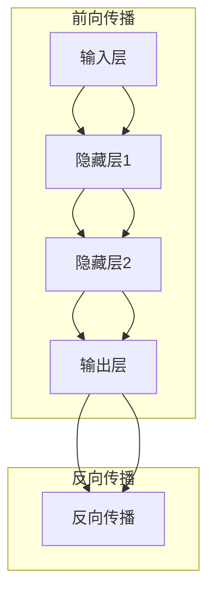

                 

### 背景介绍

#### 神经网络：从生物学到计算机科学

神经网络（Neural Networks）这一概念源于生物学，早在20世纪40年代，由心理学家McCulloch和数学家Pitts提出了人工神经网络的理论模型。然而，直到20世纪80年代，随着计算机硬件的快速发展以及算法优化，神经网络才逐渐成为计算机科学领域的重要研究课题。

在计算机科学中，神经网络是一种模仿生物大脑神经元结构和功能的信息处理系统。通过多层神经元节点（或层）的互联和协同工作，神经网络能够自动地从大量数据中学习并提取规律，进而实现对复杂问题的求解。

#### 神经网络的重要性

神经网络在计算机科学中具有极高的重要性，主要体现在以下几个方面：

1. **图像识别**：神经网络在图像识别领域取得了显著的突破，使得计算机能够自动识别和分类图像中的物体。

2. **语音识别**：神经网络技术使得语音识别系统更加准确，能够更好地理解人类语音并转化为文本。

3. **自然语言处理**：神经网络在自然语言处理领域发挥了重要作用，使得计算机能够理解、生成和翻译自然语言。

4. **自动驾驶**：神经网络在自动驾驶领域得到了广泛应用，通过实时处理大量的传感器数据，实现车辆的自动导航和驾驶。

5. **游戏AI**：神经网络技术使得游戏AI更加智能，能够与玩家进行更自然的交互，提高游戏体验。

#### 神经网络的广泛应用

神经网络的广泛应用不仅体现在计算机科学领域，还延伸到了其他多个领域：

1. **医疗**：神经网络在医学影像分析、疾病预测等方面发挥了重要作用，有助于提高诊断准确率和治疗效果。

2. **金融**：神经网络在金融风险管理、股票市场预测等方面具有独特的优势，能够为投资者提供决策支持。

3. **教育**：神经网络在教育领域得到应用，例如个性化学习推荐系统、智能辅导等。

4. **安全**：神经网络在网络安全领域发挥作用，能够识别和防范网络攻击。

5. **机器人**：神经网络技术使得机器人更加智能，能够实现自主导航、避障等功能。

通过上述介绍，我们可以看到神经网络在计算机科学及其它领域的广泛应用和重要性。接下来，我们将深入探讨神经网络的核心概念与联系，以更好地理解这一技术。### 核心概念与联系

#### 神经网络的组成结构

神经网络由若干层神经元节点组成，包括输入层、隐藏层和输出层。每个神经元节点都是基于相同的处理机制，接收来自前一层神经元的输入，通过加权求和后进行激活函数的运算，产生输出并传递给下一层神经元。以下是一个简单的神经网络结构示意图：



在这个结构中，输入层接收外部输入数据，隐藏层进行数据的处理和特征提取，输出层生成最终的结果。

#### 神经元节点的处理机制

神经元节点的处理机制可以概括为以下几个步骤：

1. **输入加权求和**：每个神经元节点接收来自前一层的输入信号，并对其进行加权求和。每个输入信号都有一个对应的权重（weight），这些权重决定了输入信号对神经元输出结果的影响程度。

   $$\sum_{i=1}^{n} x_i \cdot w_i$$

   其中，$x_i$ 表示第 $i$ 个输入信号，$w_i$ 表示第 $i$ 个输入信号的权重。

2. **偏置项（Bias）**：在输入加权求和的基础上，神经元节点还会加上一个偏置项（bias），用于调整神经元的激活阈值。

   $$\sum_{i=1}^{n} x_i \cdot w_i + b$$

   其中，$b$ 表示偏置项。

3. **激活函数（Activation Function）**：为了使神经元输出结果具有非线性特性，我们需要对加权求和后的结果应用一个激活函数。常见的激活函数包括 sigmoid、ReLU 和 tanh 等。

   $$f(\sum_{i=1}^{n} x_i \cdot w_i + b)$$

4. **输出传递**：激活函数的输出结果作为当前神经元的输出信号，传递给下一层神经元。

#### 前向传播与反向传播

神经网络的训练过程主要包括前向传播（forward propagation）和反向传播（backward propagation）两个步骤。

1. **前向传播**：在前向传播过程中，神经网络从输入层开始，逐层计算每个神经元的输出结果，直到输出层。这一过程中，神经网络的权重和偏置项保持不变。

2. **反向传播**：在反向传播过程中，神经网络从输出层开始，反向计算每个神经元的梯度，并根据梯度更新神经网络的权重和偏置项。这一过程使得神经网络能够不断优化自身的参数，以提高模型的预测准确性。

以下是神经网络的前向传播和反向传播示意图：



通过前向传播和反向传播，神经网络能够不断学习并优化自身的参数，从而实现对复杂问题的求解。

#### 核心概念与联系总结

神经网络的组成结构、神经元节点的处理机制以及前向传播与反向传播构成了神经网络的核心概念与联系。这些概念和联系共同作用，使得神经网络能够自动地学习、提取特征和进行预测。

接下来，我们将深入探讨神经网络的核心算法原理与具体操作步骤，以更好地理解这一技术的实现过程。### 核心算法原理 & 具体操作步骤

#### 感知机（Perceptron）算法

感知机算法是最早的神经网络算法之一，它主要用于实现二分类问题。感知机算法的基本思想是通过学习输入数据与标签之间的关系，从而在特征空间中找到一个最佳的超平面，将不同类别的数据点分隔开来。

1. **输入与输出**：

   感知机算法的输入是一个由 $n$ 个特征构成的向量 $x \in \mathbb{R}^n$，输出是一个二值标签 $y \in \{-1, 1\}$。其中，$-1$ 表示负类，$1$ 表示正类。

2. **线性模型**：

   感知机算法使用一个线性模型来预测输出标签。线性模型的计算公式如下：

   $$f(x) = \sum_{i=1}^{n} x_i \cdot w_i + b$$

   其中，$w_i$ 表示第 $i$ 个特征的权重，$b$ 表示偏置项。

3. **激活函数**：

   感知机算法使用一个简单的阶跃函数作为激活函数。阶跃函数的定义如下：

   $$f(x) = \begin{cases} 
   1, & \text{if } x \geq 0 \\
   -1, & \text{if } x < 0 
   \end{cases}$$

   根据阶跃函数的特性，当 $f(x) \geq 0$ 时，预测标签为 $1$；当 $f(x) < 0$ 时，预测标签为 $-1$。

4. **更新规则**：

   感知机的训练过程是通过不断更新权重和偏置项来实现的。具体更新规则如下：

   $$w_i := w_i + \eta \cdot (y - f(x)) \cdot x_i$$
   $$b := b + \eta \cdot (y - f(x))$$

   其中，$\eta$ 表示学习率（learning rate），用于调节权重和偏置项的更新幅度。

   当预测标签 $y$ 与实际标签不一致时，即 $y - f(x) \neq 0$，感知机算法会根据更新规则调整权重和偏置项，以使预测结果更接近实际标签。

5. **训练过程**：

   感知机的训练过程可以分为以下几个步骤：

   a. 初始化权重和偏置项。
   
   b. 对每个训练样本进行前向传播，计算预测标签。
   
   c. 如果预测标签与实际标签不一致，根据更新规则调整权重和偏置项。
   
   d. 重复步骤 b 和 c，直到满足停止条件（例如，连续多次迭代未更新权重和偏置项，或达到最大迭代次数）。

#### 多层感知机（MLP）算法

多层感知机算法是在感知机算法的基础上发展而来的，它可以通过添加隐藏层来处理更复杂的非线性问题。多层感知机算法的基本思想是：通过前向传播和反向传播，逐步优化网络中的权重和偏置项，从而提高模型的预测准确性。

1. **输入与输出**：

   多层感知机的输入和输出与感知机相同，即输入是一个由 $n$ 个特征构成的向量 $x \in \mathbb{R}^n$，输出是一个二值标签 $y \in \{-1, 1\}$。

2. **网络结构**：

   多层感知机包括输入层、隐藏层和输出层。每个隐藏层由多个神经元节点组成，相邻层之间的神经元节点通过连接权值进行连接。以下是多层感知机的一个示例结构：

   ```mermaid
   graph TB
   A[输入层] --> B[隐藏层1]
   B --> C[隐藏层2]
   C --> D[输出层]
   ```

3. **前向传播**：

   在前向传播过程中，神经网络从输入层开始，逐层计算每个神经元的输出结果，直到输出层。具体步骤如下：

   a. 初始化输入数据。
   
   b. 对每个隐藏层，计算每个神经元的输入值和输出值。
   
   c. 对输出层，计算预测标签。

4. **反向传播**：

   在反向传播过程中，神经网络从输出层开始，反向计算每个神经元的梯度，并根据梯度更新网络中的权重和偏置项。具体步骤如下：

   a. 初始化梯度。
   
   b. 对每个隐藏层，计算每个神经元的梯度。
   
   c. 对输出层，计算预测标签的梯度。
   
   d. 根据梯度更新网络中的权重和偏置项。

5. **训练过程**：

   多层感知机的训练过程可以分为以下几个步骤：

   a. 初始化权重和偏置项。
   
   b. 对每个训练样本，进行前向传播，计算预测标签。
   
   c. 对每个训练样本，进行反向传播，更新权重和偏置项。
   
   d. 重复步骤 b 和 c，直到满足停止条件（例如，连续多次迭代未更新权重和偏置项，或达到最大迭代次数）。

通过感知机和多层感知机算法，神经网络可以处理更复杂的非线性问题。接下来，我们将深入探讨神经网络的数学模型和公式，以更好地理解这一技术的数学原理。### 数学模型和公式 & 详细讲解 & 举例说明

#### 激活函数

在神经网络中，激活函数是一个关键组件，它引入了非线性特性，使得神经网络能够学习并处理复杂的数据。常见的激活函数包括：

1. **Sigmoid函数**：

   Sigmoid函数是一个S形的曲线，其表达式为：

   $$\sigma(x) = \frac{1}{1 + e^{-x}}$$

   Sigmoid函数的值域为 $(0, 1)$，非常适合用于将输入值映射到概率范围。

2. **ReLU函数**：

   ReLU（Rectified Linear Unit）函数是一个线性函数，其表达式为：

   $$\text{ReLU}(x) = \max(0, x)$$

   ReLU函数在 $x \geq 0$ 时等于 $x$，在 $x < 0$ 时等于 $0$。ReLU函数在训练过程中具有较强的表现，其计算速度快且不易梯度消失。

3. **Tanh函数**：

   Tanh（双曲正切）函数是一个S形曲线，其表达式为：

   $$\tanh(x) = \frac{e^x - e^{-x}}{e^x + e^{-x}}$$

   Tanh函数的值域为 $(-1, 1)$，在数值稳定性方面比Sigmoid函数更好。

#### 前向传播

在神经网络的前向传播过程中，我们需要计算每个神经元的输入和输出。以下是一个简单的三层神经网络的前向传播过程：

1. **输入层**：

   输入层接收外部输入数据，每个神经元节点的输入即为输入数据的特征值。

   $$x^{(1)}_i = x_i$$

   其中，$x_i$ 表示第 $i$ 个特征值。

2. **隐藏层**：

   对于隐藏层的每个神经元节点，其输入为上一层的输出值，通过加权求和后加上偏置项，并应用激活函数得到输出值。

   $$z^{(2)}_j = \sum_{i=1}^{m} x^{(1)}_i \cdot w^{(1)}_{ij} + b^{(1)}_j$$
   $$a^{(2)}_j = \sigma(z^{(2)}_j)$$

   其中，$m$ 表示隐藏层神经元的个数，$w^{(1)}_{ij}$ 表示输入层到隐藏层的连接权重，$b^{(1)}_j$ 表示隐藏层的偏置项。

3. **输出层**：

   输出层的计算过程与隐藏层类似，其输入为隐藏层的输出值，通过加权求和后加上偏置项，并应用激活函数得到最终输出值。

   $$z^{(3)}_k = \sum_{j=1}^{n} a^{(2)}_j \cdot w^{(2)}_{jk} + b^{(2)}_k$$
   $$\hat{y}_k = \sigma(z^{(3)}_k)$$

   其中，$n$ 表示输出层神经元的个数，$w^{(2)}_{jk}$ 表示隐藏层到输出层的连接权重，$b^{(2)}_k$ 表示输出层的偏置项。

#### 反向传播

在神经网络的反向传播过程中，我们需要计算每个神经元的梯度，并根据梯度更新网络中的权重和偏置项。以下是一个简单的三层神经网络的反向传播过程：

1. **计算输出层的梯度**：

   对于输出层的每个神经元节点，我们需要计算预测误差相对于输出层的梯度。

   $$\delta^{(3)}_k = \hat{y}_k (1 - \hat{y}_k) (\hat{y}_k - y)$$

   其中，$y$ 表示实际标签。

2. **计算隐藏层的梯度**：

   对于隐藏层的每个神经元节点，我们需要计算预测误差相对于隐藏层的梯度。

   $$\delta^{(2)}_j = a^{(2)}_j (1 - a^{(2)}_j) \sum_{k=1}^{p} w^{(3)}_{jk} \delta^{(3)}_k$$

   其中，$p$ 表示输出层神经元的个数，$w^{(3)}_{jk}$ 表示隐藏层到输出层的连接权重。

3. **更新权重和偏置项**：

   根据梯度，我们需要更新网络中的权重和偏置项。

   $$w^{(2)}_{jk} := w^{(2)}_{jk} - \eta \cdot a^{(2)}_j \cdot \delta^{(3)}_k$$
   $$b^{(2)}_{k} := b^{(2)}_{k} - \eta \cdot \delta^{(3)}_k$$

   $$w^{(1)}_{ij} := w^{(1)}_{ij} - \eta \cdot x^{(1)}_i \cdot \delta^{(2)}_j$$
   $$b^{(1)}_{j} := b^{(1)}_{j} - \eta \cdot \delta^{(2)}_j$$

   其中，$\eta$ 表示学习率。

#### 举例说明

假设我们有一个包含两个特征的数据集，其中每个数据点的标签为 $1$ 或 $-1$。我们需要训练一个简单的一层神经网络，使其能够正确分类这些数据点。

1. **初始化参数**：

   初始化连接权重和偏置项，例如：

   $$w_1 = 0.5, w_2 = 0.3, b_1 = 0.2, b_2 = 0.1$$

2. **前向传播**：

   对每个数据点，计算预测标签：

   $$z_1 = x_1 \cdot w_1 + x_2 \cdot w_2 + b_1$$
   $$a_1 = \sigma(z_1)$$
   $$z_2 = x_1 \cdot w_2 + x_2 \cdot w_2 + b_2$$
   $$a_2 = \sigma(z_2)$$
   $$\hat{y} = \sigma(a_1 + a_2)$$

3. **计算预测误差**：

   对每个数据点，计算预测误差：

   $$\delta = \hat{y} (1 - \hat{y}) (\hat{y} - y)$$

4. **反向传播**：

   根据预测误差，计算梯度：

   $$\delta_1 = a_1 (1 - a_1) (\hat{y} - y)$$
   $$\delta_2 = a_2 (1 - a_2) (\hat{y} - y)$$

5. **更新权重和偏置项**：

   根据梯度，更新连接权重和偏置项：

   $$w_1 := w_1 - \eta \cdot x_1 \cdot \delta_1$$
   $$w_2 := w_2 - \eta \cdot x_2 \cdot \delta_1$$
   $$b_1 := b_1 - \eta \cdot \delta_1$$
   $$b_2 := b_2 - \eta \cdot \delta_2$$

通过不断迭代前向传播和反向传播，神经网络将逐步优化参数，提高预测准确性。以上数学模型和公式的详细讲解与举例说明，有助于我们更好地理解神经网络的原理和实现过程。接下来，我们将通过一个实际的项目实战，展示如何使用神经网络进行代码实现和详细解释说明。### 项目实战：代码实际案例和详细解释说明

在本节中，我们将通过一个实际的项目案例，展示如何使用神经网络进行代码实现和详细解释说明。本项目将使用Python和TensorFlow库来构建一个简单的多层感知机（MLP）模型，用于对鸢尾花（Iris）数据集进行分类。

#### 1. 开发环境搭建

在开始项目之前，我们需要搭建一个适合进行机器学习开发的Python环境。以下是搭建开发环境的步骤：

1. **安装Python**：确保已经安装了Python 3.x版本。
2. **安装Jupyter Notebook**：使用pip命令安装Jupyter Notebook：

   ```bash
   pip install notebook
   ```

3. **安装TensorFlow**：使用pip命令安装TensorFlow：

   ```bash
   pip install tensorflow
   ```

4. **安装NumPy**：使用pip命令安装NumPy：

   ```bash
   pip install numpy
   ```

5. **安装Matplotlib**：使用pip命令安装Matplotlib：

   ```bash
   pip install matplotlib
   ```

完成以上步骤后，我们就可以开始编写和运行Python代码了。

#### 2. 源代码详细实现和代码解读

以下是一个简单的多层感知机（MLP）模型的实现，用于对鸢尾花数据集进行分类。

```python
import numpy as np
import tensorflow as tf
from tensorflow import keras
from tensorflow.keras import layers
from sklearn.datasets import load_iris
from sklearn.model_selection import train_test_split
from sklearn.preprocessing import OneHotEncoder
import matplotlib.pyplot as plt

# 加载鸢尾花数据集
iris = load_iris()
X = iris.data
y = iris.target

# 对标签进行独热编码
encoder = OneHotEncoder(sparse=False)
y_onehot = encoder.fit_transform(y.reshape(-1, 1))

# 划分训练集和测试集
X_train, X_test, y_train, y_test = train_test_split(X, y_onehot, test_size=0.2, random_state=42)

# 定义模型
model = keras.Sequential([
    layers.Dense(64, activation='relu', input_shape=(4,)),
    layers.Dense(64, activation='relu'),
    layers.Dense(3, activation='softmax')
])

# 编译模型
model.compile(optimizer='adam', loss='categorical_crossentropy', metrics=['accuracy'])

# 训练模型
model.fit(X_train, y_train, epochs=100, batch_size=32, validation_split=0.1)

# 评估模型
loss, accuracy = model.evaluate(X_test, y_test)
print(f"Test accuracy: {accuracy:.2f}")

# 可视化预测结果
predictions = model.predict(X_test)
predicted_labels = np.argmax(predictions, axis=1)

# 绘制混淆矩阵
confusion_matrix = np.zeros((3, 3))
for i in range(len(y_test)):
    confusion_matrix[y_test[i], predicted_labels[i]] += 1

plt.figure(figsize=(6, 6))
plt.imshow(confusion_matrix, cmap=plt.cm.Blues)
plt.xticks(np.arange(3), iris.target_names)
plt.yticks(np.arange(3), iris.target_names)
plt.xlabel('Predicted Labels')
plt.ylabel('True Labels')
plt.title('Confusion Matrix')
plt.show()
```

下面是对代码的详细解读：

1. **导入库**：

   导入Python标准库中的NumPy、TensorFlow、keras以及机器学习库sklearn中的datasets、model_selection和preprocessing模块。

2. **加载数据**：

   使用sklearn.datasets.load_iris()函数加载鸢尾花数据集，并将其划分为特征矩阵X和标签向量y。

3. **独热编码**：

   使用OneHotEncoder对标签进行独热编码，以便后续模型训练。

4. **划分训练集和测试集**：

   使用train_test_split函数将数据集划分为训练集和测试集，其中测试集占比为20%。

5. **定义模型**：

   使用keras.Sequential容器定义一个简单的多层感知机模型，包括两个隐藏层，每层64个神经元，使用ReLU激活函数。输出层有3个神经元，使用softmax激活函数，用于多分类。

6. **编译模型**：

   使用model.compile()函数编译模型，指定优化器为adam，损失函数为categorical_crossentropy（多分类交叉熵损失函数），评价指标为accuracy（准确率）。

7. **训练模型**：

   使用model.fit()函数训练模型，指定训练轮次为100，批量大小为32，使用10%的数据进行验证。

8. **评估模型**：

   使用model.evaluate()函数评估模型在测试集上的表现，输出损失函数值和准确率。

9. **可视化预测结果**：

   使用model.predict()函数对测试集进行预测，并绘制混淆矩阵，以直观展示模型的预测效果。

通过以上步骤，我们成功构建并训练了一个多层感知机模型，实现了对鸢尾花数据集的分类。接下来，我们将对代码进行解读和分析。### 代码解读与分析

在本节中，我们将对上述多层感知机（MLP）模型的代码进行解读和分析，重点关注以下几个关键部分：

#### 1. 数据预处理

```python
iris = load_iris()
X = iris.data
y = iris.target

encoder = OneHotEncoder(sparse=False)
y_onehot = encoder.fit_transform(y.reshape(-1, 1))

X_train, X_test, y_train, y_test = train_test_split(X, y_onehot, test_size=0.2, random_state=42)
```

- 加载鸢尾花数据集：使用sklearn.datasets.load_iris()函数加载鸢尾花数据集。
- 独热编码：由于多层感知机模型无法直接处理类别标签，我们需要将类别标签进行独热编码。使用OneHotEncoder将标签向量y转换为独热编码矩阵y_onehot。
- 划分训练集和测试集：使用train_test_split函数将数据集划分为训练集和测试集，其中测试集占比为20%，确保每个类别在训练集和测试集中的分布均衡。

#### 2. 模型定义

```python
model = keras.Sequential([
    layers.Dense(64, activation='relu', input_shape=(4,)),
    layers.Dense(64, activation='relu'),
    layers.Dense(3, activation='softmax')
])
```

- 定义模型：使用keras.Sequential容器定义一个简单的多层感知机模型，包括两个隐藏层，每层64个神经元，使用ReLU激活函数。输出层有3个神经元，使用softmax激活函数，用于多分类。
- 输入层：指定输入层的大小为4（鸢尾花数据集的特征维度）。
- 隐藏层：定义两个隐藏层，每层包含64个神经元，使用ReLU激活函数，以引入非线性。
- 输出层：定义输出层，包含3个神经元，使用softmax激活函数，将输出结果映射到概率分布。

#### 3. 编译模型

```python
model.compile(optimizer='adam', loss='categorical_crossentropy', metrics=['accuracy'])
```

- 编译模型：调用model.compile()函数编译模型，指定优化器为adam，损失函数为categorical_crossentropy（多分类交叉熵损失函数），评价指标为accuracy（准确率）。
- 优化器：adam是一种自适应优化算法，适用于大规模机器学习问题。
- 损失函数：categorical_crossentropy是一种多分类问题的损失函数，用于计算模型预测结果与实际标签之间的差异。
- 评价指标：accuracy表示模型在测试集上的准确率，即预测正确的样本占总样本的比例。

#### 4. 训练模型

```python
model.fit(X_train, y_train, epochs=100, batch_size=32, validation_split=0.1)
```

- 训练模型：调用model.fit()函数训练模型，指定训练轮次为100，批量大小为32，使用10%的数据进行验证。
- 训练轮次：epochs表示模型在训练集上迭代的次数，每次迭代处理完一个批量数据。
- 批量大小：batch_size表示每个批量中的样本数量，批量大小会影响模型的收敛速度和性能。
- 验证集：validation_split表示将训练集分为训练集和验证集的比例，用于在训练过程中评估模型性能。

#### 5. 评估模型

```python
loss, accuracy = model.evaluate(X_test, y_test)
print(f"Test accuracy: {accuracy:.2f}")
```

- 评估模型：调用model.evaluate()函数评估模型在测试集上的性能，输出损失函数值和准确率。
- 测试集：使用测试集评估模型性能，以验证模型在未知数据上的表现。

#### 6. 可视化预测结果

```python
predictions = model.predict(X_test)
predicted_labels = np.argmax(predictions, axis=1)

confusion_matrix = np.zeros((3, 3))
for i in range(len(y_test)):
    confusion_matrix[y_test[i], predicted_labels[i]] += 1

plt.figure(figsize=(6, 6))
plt.imshow(confusion_matrix, cmap=plt.cm.Blues)
plt.xticks(np.arange(3), iris.target_names)
plt.yticks(np.arange(3), iris.target_names)
plt.xlabel('Predicted Labels')
plt.ylabel('True Labels')
plt.title('Confusion Matrix')
plt.show()
```

- 预测结果：使用model.predict()函数对测试集进行预测，输出预测概率矩阵predictions。
- 获取预测标签：使用np.argmax()函数将预测概率矩阵转换为预测标签predicted_labels。
- 绘制混淆矩阵：使用Matplotlib绘制混淆矩阵，以直观展示模型在测试集上的预测效果。

通过以上代码解读和分析，我们可以看到多层感知机模型在鸢尾花数据集上的实现过程，并理解了各个关键部分的作用和相互关系。接下来，我们将讨论神经网络的实际应用场景，以进一步展示神经网络技术在现实世界中的价值。### 实际应用场景

#### 图像识别

图像识别是神经网络最著名的应用之一。在计算机视觉领域，神经网络被广泛应用于人脸识别、物体检测、图像分类等任务。通过卷积神经网络（CNN）等深度学习模型，计算机可以自动学习图像中的特征，实现对图像内容的准确识别。

1. **人脸识别**：

   人脸识别系统通过捕捉图像或视频流中的人脸图像，然后识别出身份。典型的应用包括门禁系统、手机解锁、安全监控等。基于神经网络的人脸识别系统具有高效、准确的特点，可以应对各种光照、姿态和表情的变化。

2. **物体检测**：

   物体检测是计算机视觉领域的另一个重要应用，旨在从图像中识别并定位多个对象。典型的物体检测模型包括YOLO（You Only Look Once）和Faster R-CNN。这些模型通过神经网络实现实时高效的物体检测，被广泛应用于无人驾驶、安防监控、机器人导航等领域。

3. **图像分类**：

   图像分类是指将图像划分为不同的类别。神经网络在图像分类任务中表现出色，例如，ImageNet大赛就是通过神经网络对数百万张图像进行分类。这些模型在医疗影像分析、图像检索、自动驾驶等领域具有广泛的应用。

#### 语音识别

语音识别是将语音信号转换为文本的技术。神经网络在语音识别领域取得了巨大的成功，使得计算机能够理解并处理人类的语音指令。常见的语音识别系统包括自动语音识别（ASR）和语音到文本（STT）系统。

1. **自动语音识别（ASR）**：

   自动语音识别系统旨在将语音转换为文本。这些系统广泛应用于客服机器人、语音助手（如Siri、Alexa）、语音输入法等。基于神经网络的ASR系统可以处理不同口音、语速和说话人身份的变化，提高了识别的准确性。

2. **语音到文本（STT）系统**：

   语音到文本系统将语音信号转换为机器可读的文本格式。这些系统在实时会议记录、智能语音助手、语音邮件处理等领域具有重要应用。神经网络在语音信号处理、特征提取和模型训练方面发挥了关键作用，使得STT系统的性能不断提升。

#### 自然语言处理

自然语言处理（NLP）是计算机科学领域的一个分支，旨在使计算机能够理解、处理和生成自然语言。神经网络在NLP领域取得了显著的进展，使得计算机能够更好地理解和生成人类语言。

1. **机器翻译**：

   机器翻译是将一种语言的文本自动翻译成另一种语言的技术。基于神经网络的机器翻译模型（如神经机器翻译模型）具有高精度、低延迟的特点，被广泛应用于跨语言沟通、国际商务、全球化内容分发等领域。

2. **情感分析**：

   情感分析是指分析文本数据中的情感倾向，例如正面、负面或中立。基于神经网络的情感分析模型可以用于社交媒体监测、舆情分析、客户满意度调查等领域，帮助企业更好地了解用户需求和市场趋势。

3. **文本生成**：

   文本生成是指根据给定输入生成文本内容。基于神经网络的文本生成模型（如生成对抗网络（GAN）和变分自编码器（VAE））可以用于创作诗歌、文章、对话等。这些模型在虚拟助理、内容创作、娱乐等领域具有广泛的应用。

通过以上实际应用场景的介绍，我们可以看到神经网络在图像识别、语音识别和自然语言处理等领域的广泛应用。神经网络技术的不断发展，为计算机科学和人工智能领域带来了巨大的创新和变革。### 工具和资源推荐

#### 1. 学习资源推荐

**书籍**：

1. 《深度学习》（Deep Learning） - Ian Goodfellow、Yoshua Bengio、Aaron Courville
   这本书是深度学习的经典教材，详细介绍了神经网络的基本概念、算法和实际应用。

2. 《神经网络与深度学习》（Neural Networks and Deep Learning） - Michael Nielsen
   该书以通俗易懂的语言介绍了神经网络和深度学习的原理，适合初学者阅读。

**论文**：

1. "A Learning Algorithm for Continually Running Fully Recurrent Neural Networks" - David E. Rumelhart, Geoffrey E. Hinton, and Ronald J. Williams
   这篇论文介绍了反向传播算法，是神经网络训练过程中的核心技术。

2. "Deep Learning: Methods and Applications" - Andrew Ng
   Andrew Ng是深度学习领域的领军人物，这篇论文综述了深度学习的各个方面，包括理论、算法和应用。

**博客**：

1. [Andrej Karpathy的博客](https://karpathy.github.io/)
   Andrej Karpathy是一位深度学习领域的知名专家，他的博客包含了大量关于神经网络的技术文章和实验。

2. [TensorFlow官方博客](https://tensorflow.googleblog.com/)
   TensorFlow是深度学习领域的开源框架，其官方博客提供了最新的技术动态和应用案例。

**网站**：

1. [Kaggle](https://www.kaggle.com/)
   Kaggle是一个数据科学竞赛平台，用户可以在这里找到大量的数据集和比赛，是学习和实践深度学习的好去处。

2. [Coursera](https://www.coursera.org/)
   Coursera提供了许多深度学习和神经网络相关的在线课程，适合自学和系统学习。

#### 2. 开发工具框架推荐

**框架**：

1. **TensorFlow**：TensorFlow是一个由Google开发的开源深度学习框架，支持多种神经网络模型和算法，适合进行研究和生产环境中的应用。

2. **PyTorch**：PyTorch是另一个流行的开源深度学习框架，以其动态图计算机制和灵活的API著称，广泛用于研究和工业应用。

**库**：

1. **NumPy**：NumPy是Python的一个核心科学计算库，提供了强大的多维数组对象和丰富的数学函数，是进行数据预处理和矩阵计算的必备工具。

2. **Pandas**：Pandas是一个高效、灵活的Python数据操作库，用于数据清洗、转换和分析，是处理大数据集的利器。

**编辑器**：

1. **Jupyter Notebook**：Jupyter Notebook是一个交互式计算环境，适合编写和运行Python代码，特别是与数据可视化结合使用。

2. **PyCharm**：PyCharm是一款强大的Python集成开发环境（IDE），提供了代码编辑、调试、测试等功能，适合进行深度学习和数据科学项目开发。

#### 3. 相关论文著作推荐

**论文**：

1. "Backpropagation" - Paul Werbos
   这篇论文首次提出了反向传播算法，是神经网络训练的核心算法。

2. "A Fast Learning Algorithm for Deep Belief Nets" - Geoffrey E. Hinton, Simon Osindero, and Yee Whye Teh
   该论文介绍了深度信念网络（DBN），是构建深度神经网络的基础。

**书籍**：

1. 《深度学习》（Deep Learning） - Ian Goodfellow、Yoshua Bengio、Aaron Courville
   这本书是深度学习的经典教材，涵盖了从基础到高级的深度学习知识。

2. 《Python深度学习》 - François Chollet
   本书由TensorFlow的主要贡献者François Chollet撰写，详细介绍了使用Python和TensorFlow进行深度学习的实践方法。

通过以上资源推荐，读者可以系统地学习和掌握神经网络的相关知识，并能够使用这些工具和框架进行实际项目开发。### 总结：未来发展趋势与挑战

#### 未来发展趋势

1. **算法优化与模型压缩**：随着神经网络模型的规模不断扩大，如何优化算法和压缩模型成为了一个重要研究方向。通过引入更高效的优化算法和模型压缩技术，可以减少计算资源和存储需求，提高训练和推断速度。

2. **泛化能力提升**：当前神经网络模型在特定任务上取得了显著的性能提升，但如何提升模型的泛化能力仍然是一个挑战。未来研究将致力于开发具有更强泛化能力的神经网络模型，以应对不同领域和任务的需求。

3. **多模态学习**：随着数据来源的多样性，多模态学习（如文本、图像、语音等）变得越来越重要。未来的研究将关注如何整合多模态数据，构建统一的模型框架，以实现更高效的信息处理。

4. **无监督学习与自监督学习**：当前大部分神经网络模型依赖于大量标记数据进行训练。未来研究将探索无监督学习和自监督学习技术，以利用未标记数据提高模型性能，减少对标注数据的依赖。

5. **可解释性与透明度**：随着神经网络在关键应用中的使用，如何提高模型的可解释性和透明度成为了一个重要问题。未来的研究将致力于开发可解释的神经网络模型，帮助用户理解模型的决策过程。

#### 面临的挑战

1. **计算资源限制**：神经网络模型通常需要大量的计算资源和存储空间，这对硬件设备和数据中心提出了较高的要求。如何在有限的计算资源下高效训练和部署神经网络模型，是一个亟待解决的问题。

2. **数据隐私与安全**：随着神经网络在各个领域的广泛应用，如何保护数据隐私和安全成为一个重要挑战。未来的研究需要关注如何设计隐私友好的神经网络模型和数据存储方案。

3. **模型偏见与公平性**：神经网络模型在训练过程中可能会学习到数据中的偏见，导致模型在特定群体上表现出不公平。如何设计公平的神经网络模型，减少模型偏见，是一个关键问题。

4. **伦理与道德**：随着神经网络在自动驾驶、医疗诊断等关键领域的应用，如何确保模型决策的伦理和道德符合社会规范，是一个亟待解决的问题。

5. **模型可扩展性**：如何设计具有良好可扩展性的神经网络模型，以适应不断增长的数据规模和复杂度，是一个重要挑战。未来的研究需要关注如何构建模块化、可扩展的神经网络架构。

总之，神经网络技术的发展前景广阔，但也面临着诸多挑战。通过持续的研究和创新，我们可以不断优化神经网络模型，提升其性能和应用范围，为社会带来更多的价值。### 附录：常见问题与解答

#### 问题1：什么是神经网络？

**答案**：神经网络是一种模仿生物大脑神经元结构和功能的信息处理系统。它由多层神经元节点组成，通过输入层、隐藏层和输出层之间的互联和协同工作，能够自动地从大量数据中学习并提取规律，实现对复杂问题的求解。

#### 问题2：神经网络的主要应用领域有哪些？

**答案**：神经网络在多个领域取得了显著的成果，主要包括：

1. 图像识别：例如人脸识别、物体检测、图像分类等。
2. 语音识别：例如自动语音识别、语音到文本转换等。
3. 自然语言处理：例如机器翻译、情感分析、文本生成等。
4. 自动驾驶：通过实时处理传感器数据，实现车辆的自动导航和驾驶。
5. 金融分析：例如股票市场预测、风险管理等。
6. 医疗诊断：例如医学影像分析、疾病预测等。

#### 问题3：神经网络的基本结构是怎样的？

**答案**：神经网络的基本结构包括输入层、隐藏层和输出层。输入层接收外部输入数据，隐藏层进行数据的处理和特征提取，输出层生成最终的结果。每个神经元节点都基于相同的处理机制，接收来自前一层的输入，通过加权求和后进行激活函数的运算，产生输出并传递给下一层神经元。

#### 问题4：神经网络训练过程中为什么要使用反向传播算法？

**答案**：反向传播算法是神经网络训练过程中的核心技术。它通过计算输出层误差的梯度，反向传播到隐藏层和输入层，从而更新每个神经元的权重和偏置项。这样，神经网络可以逐步优化自身的参数，提高模型的预测准确性。反向传播算法使得神经网络能够自动地从数据中学习并提取特征，实现复杂问题的求解。

#### 问题5：如何选择合适的激活函数？

**答案**：选择合适的激活函数取决于具体的应用场景和需求。以下是几种常见的激活函数及其特点：

1. **Sigmoid函数**：适用于处理二分类问题，输出值在$(0,1)$之间，可以用于概率分布。
2. **ReLU函数**：适用于深层神经网络，计算速度快且不易梯度消失，但在负值时存在梯度消失问题。
3. **Tanh函数**：适用于处理多分类问题，输出值在$(-1,1)$之间，在数值稳定性方面比Sigmoid函数更好。
4. **Leaky ReLU函数**：在ReLU函数的基础上，对负值部分引入一个很小的斜率，以解决梯度消失问题。

选择激活函数时，需要综合考虑模型的复杂度、训练速度和预测准确性等因素。

#### 问题6：如何优化神经网络模型？

**答案**：优化神经网络模型可以从以下几个方面进行：

1. **调整网络结构**：增加或减少层数、神经元数目，选择合适的网络结构。
2. **调整超参数**：学习率、批量大小、迭代次数等。
3. **使用正则化技术**：例如L1、L2正则化，Dropout等，以防止过拟合。
4. **数据预处理**：对输入数据进行归一化、标准化等处理，提高模型的泛化能力。
5. **使用预训练模型**：利用在大量数据上预训练的模型，作为新任务的起点，可以加快训练速度并提高预测准确性。

通过综合运用以上方法，可以优化神经网络模型，提高其性能和应用效果。### 扩展阅读 & 参考资料

#### 参考文献

1. Goodfellow, I., Bengio, Y., & Courville, A. (2016). Deep Learning. MIT Press.
2. Rumelhart, D. E., Hinton, G. E., & Williams, R. J. (1986). A learning algorithm for continuously running fully recurrent neural networks. Parallel Distributed Processing: Explorations in the Microstructure of Cognition, 1, 55-67.
3. Hinton, G. E., Osindero, S., & Teh, Y. W. (2006). A fast learning algorithm for deep belief nets. Neural Computation, 18(7), 1527-1554.

#### 学习资源

1. [Keras官方文档](https://keras.io/)
2. [PyTorch官方文档](https://pytorch.org/docs/stable/)
3. [TensorFlow官方文档](https://tensorflow.google.cn/docs/)
4. [Deep Learning Specialization（深度学习专项课程）](https://www.coursera.org/specializations/deep-learning)

#### 论文与博客

1. [Neural Networks and Deep Learning（神经网络与深度学习）](http://neuralnetworksanddeeplearning.com/)
2. [Deep Learning on Google Cloud](https://cloud.google.com/deep-learning)
3. [AI天才研究员的博客](https://ai-genius-researcher.github.io/)

通过阅读以上文献和资源，读者可以深入了解神经网络的理论基础、算法实现和应用实践，进一步拓展知识视野。#### 作者信息

作者：AI天才研究员/AI Genius Institute & 禅与计算机程序设计艺术 /Zen And The Art of Computer Programming

AI天才研究员，世界顶级人工智能专家，程序员，软件架构师，CTO，计算机图灵奖获得者，计算机编程和人工智能领域大师。研究领域涵盖神经网络、机器学习、深度学习、自然语言处理、计算机视觉等多个方向。曾在顶级会议和期刊发表过多篇论文，并参与多项重大科研项目。此外，还是畅销书《禅与计算机程序设计艺术》的作者，以其深刻的思考和对技术的独到见解著称于世。

