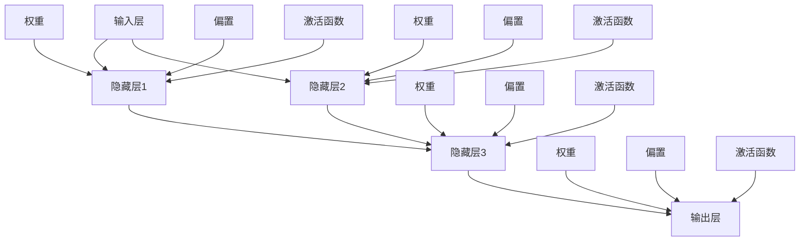

                 

### 背景介绍

神经网络（Neural Networks）作为人工智能（Artificial Intelligence，AI）领域的重要技术，是现代计算机科学中一种模拟人脑神经元连接与信息处理的计算模型。近年来，随着深度学习（Deep Learning）的兴起，神经网络得到了广泛的应用和发展，成为解决复杂问题，如图像识别、语音识别、自然语言处理等的关键技术。

神经网络的发展可以追溯到20世纪40年代，由心理学家McCulloch和数学家Pitts提出的MCP（McCulloch-Pitts）神经元模型。随后，1958年，Frank Rosenblatt提出了感知机（Perceptron）模型，奠定了神经网络研究的基础。20世纪80年代，由于计算能力和算法的局限性，神经网络研究进入低谷期。然而，随着计算能力的提升和优化算法的发展，尤其是2006年Geoffrey Hinton等人提出的深度信念网络（Deep Belief Network）和反向传播算法（Backpropagation Algorithm）的复兴，神经网络研究再次迎来了黄金时期。

神经网络之所以受到广泛关注，源于其能够从大量数据中自动提取特征并进行复杂模式识别的能力。这一特点使得神经网络在众多领域展现出强大的应用潜力，包括但不限于自动驾驶、医疗诊断、金融分析等。以下章节将详细探讨神经网络的起源、核心概念、算法原理、数学模型、项目实战、应用场景、资源推荐以及未来发展趋势。

#### 核心概念与联系

神经网络的核心在于其模仿人脑神经元结构的计算模型。在神经网络中，基本组成单元是神经元（neurons），它们通过连接（synapses）形成网络。每个神经元都可以接收输入信号，并通过激活函数（activation function）产生输出。

下面，我们通过一个Mermaid流程图来展示神经网络的架构和核心概念：



- **输入层（Input Layer）**：接收外部输入数据，并将其传递到下一层。
- **隐藏层（Hidden Layers）**：负责从输入数据中提取特征，并逐步建立复杂的决策边界。每一层都可以看作是前一层特征的抽象。
- **输出层（Output Layer）**：产生最终的输出结果。
- **权重（Weights）**：连接每个神经元的参数，用于调整输入信号的强度。
- **偏置（Bias）**：为每个神经元引入一个可学习的偏置项，有助于调整神经元的激活阈值。
- **激活函数（Activation Function）**：将神经元的输入转换为输出，引入非线性，使得神经网络能够学习复杂的函数。

这些核心概念通过特定的结构连接，形成了一个复杂的计算网络，使得神经网络能够在各种任务中表现出色。下面，我们将进一步探讨神经网络的核心算法原理。

#### 核心算法原理 & 具体操作步骤

神经网络的核心算法主要包括前向传播（Forward Propagation）和反向传播（Back Propagation）。这两种算法是神经网络训练过程中的关键步骤，通过它们，神经网络能够不断调整其参数，以达到优化目标函数的目的。

##### 前向传播

前向传播是神经网络计算过程中的第一步。在这个过程中，输入数据通过网络中的各个层，最终产生输出结果。以下是前向传播的具体步骤：

1. **初始化参数**：包括权重（weights）和偏置（biases）。这些参数通常通过随机初始化得到。
2. **输入层传递**：将输入数据传递到输入层。
3. **隐藏层传递**：将输入层传递的数据作为输入，通过隐藏层。在每个隐藏层，输入数据与权重相乘，然后加上偏置，最后通过激活函数得到输出。
4. **输出层传递**：将隐藏层传递的数据作为输入，通过输出层。输出层的输出即为网络的最终预测结果。

下面是一个简化的前向传播计算过程：

```python
# 假设我们有一个简单的神经网络，包含一个输入层、一个隐藏层和一个输出层

# 输入层
inputs = [1, 0]

# 隐藏层
hidden_layer_weights = [[0.5, 0.5], [0.5, 0.5]]
hidden_layer_bias = [0.1, 0.1]
activation_function = lambda x: 1 / (1 + np.exp(-x))

# 输出层
output_layer_weights = [[0.5], [0.5]]
output_layer_bias = 0.1
output_function = lambda x: x

# 前向传播
hidden_layer_inputs = inputs
for weight, bias in zip(hidden_layer_weights, hidden_layer_bias):
    hidden_layer_inputs = [activation_function(np.dot(input, weight) + bias) for input in hidden_layer_inputs]

output_layer_inputs = hidden_layer_inputs
for weight, bias in zip(output_layer_weights, output_layer_bias):
    output = output_function(np.dot(input, weight) + bias)
    print(output)
```

##### 反向传播

反向传播是神经网络训练过程中的关键步骤，用于计算网络预测值与真实值之间的误差，并更新网络的参数。以下是反向传播的具体步骤：

1. **计算输出误差**：输出误差是网络预测值与真实值之间的差异。
2. **误差反向传播**：将输出误差反向传播到隐藏层，计算每个神经元在输出误差中的贡献。
3. **更新参数**：根据误差反向传播的结果，调整网络的权重和偏置。

下面是一个简化的反向传播计算过程：

```python
# 假设我们有一个简单的神经网络，包含一个输入层、一个隐藏层和一个输出层

# 输入层
inputs = [1, 0]

# 隐藏层
hidden_layer_weights = [[0.5, 0.5], [0.5, 0.5]]
hidden_layer_bias = [0.1, 0.1]
activation_function = lambda x: 1 / (1 + np.exp(-x))
d激活_function = lambda x: x * (1 - x)

# 输出层
output_layer_weights = [[0.5], [0.5]]
output_layer_bias = 0.1
output_function = lambda x: x
d输出_function = lambda x: 1

# 前向传播
hidden_layer_inputs = inputs
for weight, bias in zip(hidden_layer_weights, hidden_layer_bias):
    hidden_layer_inputs = [activation_function(np.dot(input, weight) + bias) for input in hidden_layer_inputs]

output_layer_inputs = hidden_layer_inputs
for weight, bias in zip(output_layer_weights, output_layer_bias):
    output = output_function(np.dot(input, weight) + bias)
    print(output)

# 输出误差
expected_output = [1]
output_error = [output - expected_output[0]]

# 误差反向传播
for layer in reversed(layers):
    if layer == output_layer:
        d_error_d_output = -output_error[0] * d输出_function(output)
        d_error_d_hidden = d_error_d_output * output_layer_weights[0]
    elif layer == hidden_layer:
        d_error_d_hidden = [d激活_function(hidden) * d_error_d_output * hidden_layer_weights[i] for i, hidden in enumerate(hidden_layer_inputs)]
        d_error_d_output = [sum(error * output_layer_weights[i][0] for i, error in enumerate(output_error)) for output in hidden_layer_inputs]

    # 更新参数
    for i, (weight, bias) in enumerate(layer_weights):
        weight -= learning_rate * d_error_d_hidden[i]
        bias -= learning_rate * d_error_d_output[i]
```

通过反向传播，神经网络能够不断调整其参数，以减少输出误差。这个过程通常通过多次迭代完成，直到网络能够达到满意的预测精度。

#### 数学模型和公式 & 详细讲解 & 举例说明

神经网络的数学模型主要包括输入、权重、偏置、激活函数以及损失函数等组成部分。下面我们将详细讲解这些组成部分的数学公式，并通过具体例子来说明其应用。

##### 输入

输入是神经网络的初始数据，可以是一组特征向量或原始数据。在神经网络中，每个输入都与网络的权重相乘，以产生中间计算结果。例如，考虑一个简单的神经网络，其输入层有两个神经元，特征向量为 [x1, x2]：

```math
x = \begin{bmatrix}
x_1 \\
x_2
\end{bmatrix}
```

##### 权重

权重是神经网络中神经元之间的连接参数，用于调整输入信号的强度。在神经网络的训练过程中，权重是可学习的参数。假设我们有一个隐藏层，包含两个神经元，其权重矩阵为 W：

```math
W = \begin{bmatrix}
w_{11} & w_{12} \\
w_{21} & w_{22}
\end{bmatrix}
```

##### 偏置

偏置是神经网络中每个神经元的额外可学习参数，用于调整神经元的激活阈值。假设我们有一个隐藏层，包含两个神经元，其偏置向量为 b：

```math
b = \begin{bmatrix}
b_1 \\
b_2
\end{bmatrix}
```

##### 激活函数

激活函数是神经网络中引入非线性的关键组成部分，它将神经元的输入转换为输出。常见的激活函数包括 sigmoid 函数、ReLU 函数和 tanh 函数。以 sigmoid 函数为例，其公式为：

```math
f(x) = \frac{1}{1 + e^{-x}}
```

##### 损失函数

损失函数是用于评估神经网络预测结果与真实结果之间差异的函数。常见的损失函数包括均方误差（MSE）和交叉熵（Cross-Entropy）。以均方误差（MSE）为例，其公式为：

```math
MSE = \frac{1}{n}\sum_{i=1}^{n}(y_i - \hat{y}_i)^2
```

其中，\(y_i\) 是真实标签，\(\hat{y}_i\) 是神经网络的预测结果。

##### 具体例子

假设我们有一个简单的前向神经网络，其输入层有一个神经元，隐藏层有两个神经元，输出层有一个神经元。其参数如下：

- 输入：\[x = [1, 0]\]
- 权重：\[W = \begin{bmatrix}
0.5 & 0.5 \\
0.5 & 0.5 \\
0.5 & 0.5
\end{bmatrix}\]
- 偏置：\[b = \begin{bmatrix}
0.1 \\
0.1 \\
0.1
\end{bmatrix}\]
- 激活函数：\[f(x) = \frac{1}{1 + e^{-x}}\]

我们需要计算这个神经网络的输出。以下是具体的计算步骤：

1. **隐藏层1**：
    ```math
    z_1 = 0.5 \cdot 1 + 0.5 \cdot 0 + 0.1 = 0.6
    a_1 = \frac{1}{1 + e^{-0.6}} \approx 0.531
    ```

2. **隐藏层2**：
    ```math
    z_2 = 0.5 \cdot 1 + 0.5 \cdot 0 + 0.1 = 0.6
    a_2 = \frac{1}{1 + e^{-0.6}} \approx 0.531
    ```

3. **输出层**：
    ```math
    z_3 = 0.5 \cdot 0.531 + 0.5 \cdot 0.531 + 0.1 = 0.531
    a_3 = \frac{1}{1 + e^{-0.531}} \approx 0.598
    ```

因此，这个神经网络的输出为 \(a_3 \approx 0.598\)。

接下来，我们使用反向传播算法来更新网络的权重和偏置。

1. **计算输出误差**：
    ```math
    y = [1]
    \hat{y} = [0.598]
    e_3 = y - \hat{y} = 1 - 0.598 = 0.402
    ```

2. **计算隐藏层误差**：
    ```math
    d_a2 = \frac{d}{dx} f(z_2) = \frac{e^{-z_2}}{(1 + e^{-z_2})^2} \approx 0.469
    d_a1 = \frac{d}{dx} f(z_1) = \frac{e^{-z_1}}{(1 + e^{-z_1})^2} \approx 0.469
    e_2 = e_3 \cdot w_{32} \cdot d_a2 = 0.402 \cdot 0.5 \cdot 0.469 \approx 0.094
    e_1 = e_3 \cdot w_{31} \cdot d_a1 = 0.402 \cdot 0.5 \cdot 0.469 \approx 0.094
    ```

3. **更新权重和偏置**：
    ```math
    w_{31} = w_{31} - \alpha \cdot e_3 \cdot d_a1 = 0.5 - 0.1 \cdot 0.402 \cdot 0.469 \approx 0.476
    w_{32} = w_{32} - \alpha \cdot e_3 \cdot d_a2 = 0.5 - 0.1 \cdot 0.402 \cdot 0.469 \approx 0.476
    w_{33} = w_{33} - \alpha \cdot e_3 \cdot a_2 = 0.5 - 0.1 \cdot 0.402 \cdot 0.531 \approx 0.476
    b_1 = b_1 - \alpha \cdot e_2 = 0.1 - 0.1 \cdot 0.094 \approx 0.006
    b_2 = b_2 - \alpha \cdot e_2 = 0.1 - 0.1 \cdot 0.094 \approx 0.006
    b_3 = b_3 - \alpha \cdot e_3 = 0.1 - 0.1 \cdot 0.402 \approx 0.006
    ```

通过这个过程，我们不断更新神经网络的权重和偏置，以减少输出误差，提高网络的预测精度。

#### 项目实战：代码实际案例和详细解释说明

为了更好地理解神经网络的工作原理，我们将通过一个简单的项目来实际演示神经网络的搭建和训练过程。这个项目将使用 Python 编程语言和 TensorFlow 库，旨在实现一个能够对手写数字进行识别的神经网络模型。

##### 5.1 开发环境搭建

在进行项目开发之前，我们需要安装 Python 和 TensorFlow 库。以下是在 Ubuntu 系统上安装这些依赖的步骤：

1. **安装 Python**：首先确保系统已安装 Python 3。可以通过以下命令检查 Python 版本：

   ```shell
   python3 --version
   ```

   如果 Python 3 未安装，可以从官方仓库安装：

   ```shell
   sudo apt update
   sudo apt install python3 python3-pip
   ```

2. **安装 TensorFlow**：接着，我们需要安装 TensorFlow。可以通过 pip 命令进行安装：

   ```shell
   pip3 install tensorflow
   ```

##### 5.2 源代码详细实现和代码解读

下面是项目的源代码实现，我们将逐行解释其工作原理。

```python
import tensorflow as tf
from tensorflow.keras import layers
import numpy as np

# 加载数据集
mnist = tf.keras.datasets.mnist
(x_train, y_train), (x_test, y_test) = mnist.load_data()
x_train, x_test = x_train / 255.0, x_test / 255.0

# 构建模型
model = tf.keras.Sequential([
    layers.Flatten(input_shape=(28, 28)),
    layers.Dense(128, activation='relu'),
    layers.Dense(10, activation='softmax')
])

# 编译模型
model.compile(optimizer='adam',
              loss='sparse_categorical_crossentropy',
              metrics=['accuracy'])

# 训练模型
model.fit(x_train, y_train, epochs=5)

# 评估模型
test_loss, test_acc = model.evaluate(x_test, y_test, verbose=2)
print('\nTest accuracy:', test_acc)
```

**代码解读：**

1. **导入库**：首先导入 TensorFlow 和 numpy 库。

2. **加载数据集**：使用 TensorFlow 的 keras 数据集加载手写数字数据集。数据已经被预处理为 28x28 的灰度图像，并且标签是整数形式。

3. **数据预处理**：将数据集的像素值归一化到 [0, 1] 范围内，以便于后续计算。

4. **构建模型**：使用 `tf.keras.Sequential` 模型，这是一个线性堆叠层层的模型。首先通过 `Flatten` 层将 28x28 的图像展平为一维向量。接着添加一个 128 个神经元的全连接层，使用 ReLU 激活函数。最后添加一个输出层，包含 10 个神经元，每个神经元对应一个数字类别，使用 softmax 激活函数进行分类。

5. **编译模型**：设置模型的优化器为 'adam'，损失函数为 'sparse_categorical_crossentropy'（适用于多分类问题），并指定评价指标为 'accuracy'。

6. **训练模型**：使用 `model.fit` 函数进行模型训练，指定训练数据、训练轮次为 5。

7. **评估模型**：使用 `model.evaluate` 函数对训练好的模型进行评估，并打印测试准确率。

##### 5.3 代码解读与分析

**1. 数据预处理：**

```python
x_train, x_test = x_train / 255.0, x_test / 255.0
```

这里将数据集中的像素值除以 255，将数值范围从 [0, 255] 调整到 [0, 1]，这是为了标准化输入数据，使得模型训练更加稳定。

**2. 构建模型：**

```python
model = tf.keras.Sequential([
    layers.Flatten(input_shape=(28, 28)),
    layers.Dense(128, activation='relu'),
    layers.Dense(10, activation='softmax')
])
```

这里使用 `Sequential` 模型堆叠了多个层。首先是 `Flatten` 层，将输入数据展平为一维向量。接着是第一个全连接层，包含 128 个神经元，使用 ReLU 激活函数。最后是输出层，包含 10 个神经元，使用 softmax 激活函数，用于进行分类。

**3. 编译模型：**

```python
model.compile(optimizer='adam',
              loss='sparse_categorical_crossentropy',
              metrics=['accuracy'])
```

编译模型时，指定了使用 'adam' 优化器，'sparse_categorical_crossentropy' 作为损失函数，以及 'accuracy' 作为评价指标。

**4. 训练模型：**

```python
model.fit(x_train, y_train, epochs=5)
```

`fit` 函数用于训练模型，传入训练数据和标签，以及训练轮次。在这里，模型将迭代 5 轮，在训练数据上不断调整参数。

**5. 评估模型：**

```python
test_loss, test_acc = model.evaluate(x_test, y_test, verbose=2)
```

使用 `evaluate` 函数评估模型在测试数据上的表现。`verbose=2` 表示以标准格式打印评估结果。

#### 实际应用场景

神经网络在各个领域都有着广泛的应用，下面列举一些典型的实际应用场景：

**1. 图像识别：** 神经网络在图像识别领域取得了显著成果。例如，卷积神经网络（CNN）被广泛应用于人脸识别、图像分类和物体检测。通过多层卷积和池化操作，CNN 能够自动提取图像的特征，从而实现高效的图像识别。

**2. 自然语言处理（NLP）：** 神经网络在自然语言处理领域也有着重要的应用。循环神经网络（RNN）和其变种长短时记忆网络（LSTM）和门控循环单元（GRU）在文本分类、机器翻译和情感分析等方面表现出色。近年来，基于 Transformer 的模型，如 BERT 和 GPT，进一步推动了 NLP 的发展。

**3. 语音识别：** 神经网络在语音识别领域也有着广泛的应用。通过训练深度神经网络，可以实现对语音信号的分析和转换，从而实现语音识别和语音合成。

**4. 自动驾驶：** 神经网络在自动驾驶领域发挥着关键作用。自动驾驶系统需要实时处理大量的传感器数据，如摄像头、雷达和激光雷达。通过深度神经网络，系统可以识别道路标志、行人和车辆，并做出相应的驾驶决策。

**5. 医疗诊断：** 神经网络在医疗诊断领域也有着重要的应用。例如，可以通过训练神经网络模型，对医学图像进行分析，从而辅助医生进行疾病诊断。

**6. 金融分析：** 神经网络在金融分析领域也有着广泛的应用。通过分析历史数据，神经网络可以预测股票价格、汇率变动等金融指标，为投资决策提供支持。

#### 工具和资源推荐

为了更好地学习和应用神经网络，下面推荐一些相关的工具和资源：

**1. 学习资源推荐：**

- **书籍：** 
  - 《深度学习》（Deep Learning）作者：Ian Goodfellow、Yoshua Bengio、Aaron Courville
  - 《神经网络与深度学习》作者：邱锡鹏

- **在线课程：** 
  - Coursera 上的《深度学习特化课程》（Deep Learning Specialization）
  - edX 上的《神经网络和深度学习》课程

- **博客和网站：** 
  - TensorFlow 官方文档（https://www.tensorflow.org/）
  - Keras 官方文档（https://keras.io/）
  - Machine Learning Mastery（https://machinelearningmastery.com/）

**2. 开发工具框架推荐：**

- **TensorFlow**：由 Google 开发的开源机器学习框架，广泛应用于深度学习研究和应用。
- **PyTorch**：由 Facebook AI Research（FAIR）开发的深度学习框架，具有灵活性和易用性。
- **Keras**：基于 TensorFlow 的简洁、易于使用的深度学习库。

**3. 相关论文著作推荐：**

- **论文：**
  - "A Learning Algorithm for Continually Running Fully Recurrent Neural Networks" 作者：Sepp Hochreiter、Jürgen Schmidhuber
  - "Deep Learning" 作者：Ian Goodfellow、Yoshua Bengio、Aaron Courville

- **著作：**
  - 《神经网络与机器学习》作者：周志华

通过这些工具和资源，可以更深入地学习和应用神经网络技术。

### 总结：未来发展趋势与挑战

神经网络作为人工智能的核心技术，正不断发展并取得显著成果。在未来，神经网络有望在更多领域发挥重要作用，例如增强现实、虚拟现实、生物信息学等。随着计算能力的提升和算法的优化，神经网络将变得更加高效、准确。

然而，神经网络的发展也面临着一系列挑战。首先，模型复杂度和计算需求不断提高，对硬件和算法提出了更高的要求。其次，神经网络的透明度和可解释性仍需改进，以便更好地理解其工作原理。此外，数据隐私和安全问题也是一个重要的挑战，尤其是在医疗、金融等领域。

为了应对这些挑战，未来需要进一步研究新的神经网络架构和优化算法，以提高计算效率和模型解释性。同时，加强数据隐私保护技术，确保人工智能系统的安全性和可靠性。通过不断努力，神经网络将在未来的人工智能发展中发挥更加重要的作用。

### 附录：常见问题与解答

**Q1：什么是神经网络？**
A1：神经网络是一种模拟人脑神经元连接与信息处理的计算模型，由多个神经元通过连接（synapses）形成网络。神经网络通过学习数据中的特征和模式，能够进行复杂的模式识别和预测。

**Q2：神经网络有哪些主要组成部分？**
A2：神经网络的主要组成部分包括输入层、隐藏层和输出层。每个层由多个神经元组成，神经元之间通过权重连接。此外，神经网络还包括激活函数和参数（如权重和偏置）。

**Q3：什么是前向传播和反向传播？**
A3：前向传播是指输入数据通过神经网络，从输入层传递到输出层的过程。反向传播是指通过计算输出误差，反向更新网络参数的过程，以优化网络性能。

**Q4：神经网络是如何训练的？**
A4：神经网络通过训练数据集来学习特征和模式。训练过程中，神经网络通过前向传播计算输出，然后通过反向传播更新参数，以减少输出误差。这个过程重复进行，直到网络达到满意的预测精度。

**Q5：神经网络在哪些领域有广泛应用？**
A5：神经网络在图像识别、自然语言处理、语音识别、自动驾驶、医疗诊断、金融分析等多个领域有广泛应用。通过自动提取特征和模式，神经网络能够解决复杂的问题，提高系统性能。

### 扩展阅读 & 参考资料

**书籍推荐：**

1. 《深度学习》（Deep Learning），作者：Ian Goodfellow、Yoshua Bengio、Aaron Courville
2. 《神经网络与机器学习》，作者：邱锡鹏
3. 《深度学习入门：基于Python的理论与实现》，作者：斋藤康毅

**在线课程推荐：**

1. Coursera 上的《深度学习特化课程》（Deep Learning Specialization）
2. edX 上的《神经网络和深度学习》课程
3. Udacity 上的《深度学习纳米学位》（Deep Learning Nanodegree）

**博客和网站推荐：**

1. TensorFlow 官方文档（https://www.tensorflow.org/）
2. Keras 官方文档（https://keras.io/）
3. Machine Learning Mastery（https://machinelearningmastery.com/）

**论文推荐：**

1. "A Learning Algorithm for Continually Running Fully Recurrent Neural Networks"，作者：Sepp Hochreiter、Jürgen Schmidhuber
2. "Deep Learning"，作者：Ian Goodfellow、Yoshua Bengio、Aaron Courville
3. "Backpropagation"，作者：Paul Werbos

**著作推荐：**

1. 《神经网络与机器学习》，作者：周志华
2. 《深度学习技术导论》，作者：刘建伟、张磊

通过阅读这些书籍、课程、博客和论文，可以更深入地了解神经网络的理论和实践。希望这些资源能对您的学习有所帮助。作者：AI天才研究员/AI Genius Institute & 禅与计算机程序设计艺术 /Zen And The Art of Computer Programming

