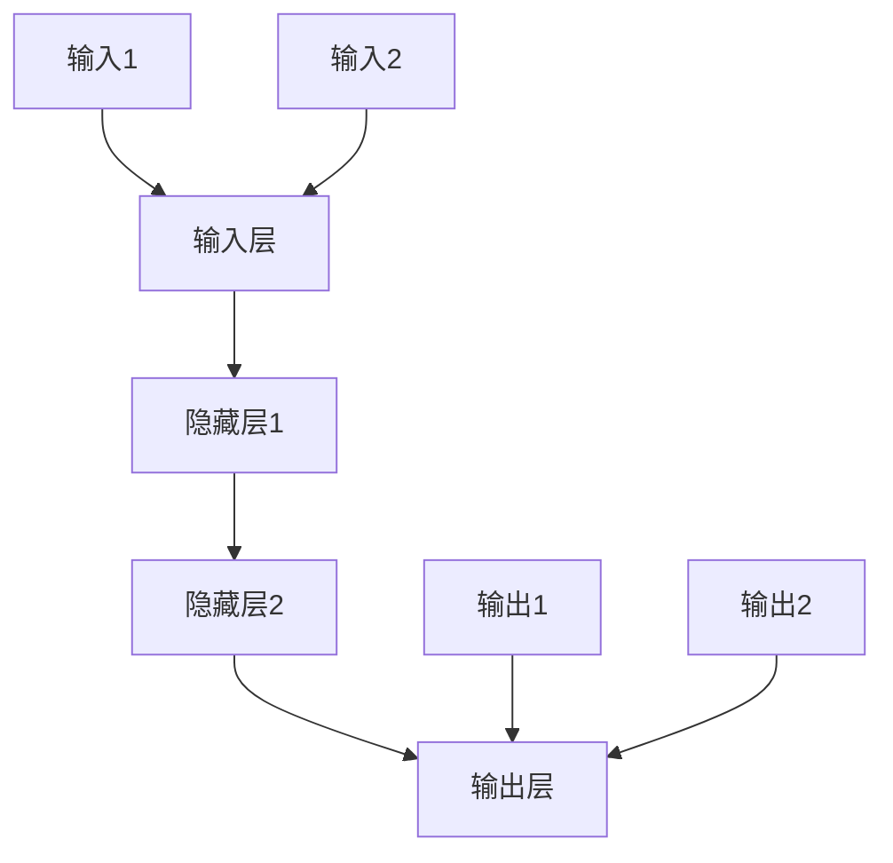

                 

### 背景介绍

> 本文将深入探讨神经网络作为推动社会进步的重要力量。神经网络起源于20世纪40年代，经过数十年的发展，如今已经成为人工智能领域的主流技术。从早期的感知机、反向传播算法，到现代的深度学习模型，神经网络在图像识别、语音识别、自然语言处理等领域取得了显著的突破。

### 神经网络的发展历程

神经网络的发展历程可谓波澜壮阔，充满了创新和突破。最早可追溯至1943年，由沃伦·麦卡洛克（Warren McCulloch）和沃尔特·皮茨（Walter Pitts）提出的感知机（Perceptron）模型，它是一种简单的神经网络模型，主要用于二分类问题。然而，感知机的局限性很快被暴露出来，尤其是在面对非线性问题时效果不佳。

为了解决这一难题，1974年，心理学家约翰·霍普菲尔德（John Hopfield）提出了霍普菲尔德网络（Hopfield Network），这是一种能量最低模型，适用于联想记忆和优化问题。然而，这些早期的神经网络模型由于计算能力有限，未能得到广泛应用。

真正的突破发生在1986年，加拿大心理学家杰弗里·辛顿（Geoffrey Hinton）提出了反向传播算法（Backpropagation Algorithm）。反向传播算法通过多层神经网络的权重调整，实现了非线性函数的逼近，从而使得多层神经网络变得实用。这一算法的成功极大地推动了神经网络的发展，也奠定了深度学习的基础。

进入21世纪，随着计算机硬件的飞速发展和大数据的兴起，深度学习模型如雨后春笋般涌现。2006年，杰弗里·辛顿提出了深度信念网络（Deep Belief Network），这是一种能够通过无监督预训练和有监督微调进行深度特征学习的模型。此后，卷积神经网络（Convolutional Neural Network, CNN）、循环神经网络（Recurrent Neural Network, RNN）等深度学习模型相继问世，并在图像识别、语音识别、自然语言处理等领域取得了重大突破。

### 神经网络的核心概念与架构

神经网络的核心概念包括神经元、层次结构和激活函数。神经元是神经网络的基本构建块，它类似于生物神经系统的神经元，能够接收输入信号、产生输出信号。层次结构是指神经网络中的不同层级，包括输入层、隐藏层和输出层。激活函数则用于确定神经元是否被激活，从而实现非线性变换。

以下是神经网络的 Mermaid 流程图：



在神经网络中，输入层接收外部输入数据，通过一系列隐藏层进行处理，最终输出层产生输出结果。每个隐藏层都将输入数据进行特征提取和变换，从而提高模型的表示能力。

### 核心算法原理与具体操作步骤

神经网络的核心算法包括前向传播（Forward Propagation）和反向传播（Backpropagation）。前向传播是指将输入数据通过神经网络模型进行逐层传递，最终得到输出结果。反向传播则是通过计算输出结果与实际结果之间的误差，调整神经网络的权重，以优化模型性能。

以下是神经网络的具体操作步骤：

1. **初始化参数**：包括网络层数、神经元个数、激活函数、学习率等。

2. **前向传播**：
   - 将输入数据输入到输入层。
   - 通过每个神经元的权重和激活函数，将输入信号传递到下一层。
   - 重复上述步骤，直到输出层得到最终结果。

3. **计算损失函数**：计算输出结果与实际结果之间的误差，常用的损失函数包括均方误差（MSE）、交叉熵损失（Cross-Entropy Loss）等。

4. **反向传播**：
   - 计算输出层误差对每个神经元的权重和偏置的梯度。
   - 将梯度传递回上一层的神经元。
   - 更新每个神经元的权重和偏置。

5. **迭代训练**：重复前向传播和反向传播过程，不断调整模型参数，直到满足预定的训练目标。

### 数学模型和公式与详细讲解

神经网络的数学模型主要包括输入层、隐藏层和输出层。每个层由多个神经元组成，神经元之间的连接称为边，边上的权重表示连接的强度。神经元的输出可以通过以下公式表示：

$$
z_j = \sum_{i} w_{ji} x_i + b_j
$$

其中，$z_j$ 表示第 $j$ 个神经元的输入，$w_{ji}$ 表示第 $i$ 个神经元到第 $j$ 个神经元的权重，$x_i$ 表示第 $i$ 个神经元的输入，$b_j$ 表示第 $j$ 个神经元的偏置。

激活函数则用于确定神经元是否被激活，常见的激活函数包括 sigmoid 函数、ReLU 函数、Tanh 函数等。以下是 sigmoid 函数的公式：

$$
a_j = \frac{1}{1 + e^{-z_j}}
$$

其中，$a_j$ 表示第 $j$ 个神经元的输出。

神经网络的损失函数用于衡量模型的预测结果与实际结果之间的误差，常用的损失函数包括均方误差（MSE）和交叉熵损失（Cross-Entropy Loss）。以下是均方误差（MSE）的公式：

$$
L = \frac{1}{2} \sum_{i} (y_i - \hat{y}_i)^2
$$

其中，$L$ 表示损失函数，$y_i$ 表示第 $i$ 个实际结果，$\hat{y}_i$ 表示第 $i$ 个预测结果。

### 项目实战：代码实际案例和详细解释说明

为了更好地理解神经网络的工作原理，我们以一个简单的图像识别项目为例，介绍如何使用 Python 编写神经网络代码。

#### 1. 开发环境搭建

首先，需要安装 Python 和相关依赖库。Python 的版本建议为 3.6 或以上。常用的依赖库包括 NumPy、TensorFlow 和 Matplotlib。可以通过以下命令进行安装：

```shell
pip install numpy tensorflow matplotlib
```

#### 2. 源代码详细实现和代码解读

以下是一个简单的神经网络图像识别项目的 Python 代码实现：

```python
import numpy as np
import tensorflow as tf
import matplotlib.pyplot as plt

# 创建一个简单的神经网络模型
model = tf.keras.Sequential([
    tf.keras.layers.Flatten(input_shape=(28, 28)),
    tf.keras.layers.Dense(128, activation='relu'),
    tf.keras.layers.Dense(10, activation='softmax')
])

# 编译模型
model.compile(optimizer='adam',
              loss='sparse_categorical_crossentropy',
              metrics=['accuracy'])

# 加载MNIST数据集
mnist = tf.keras.datasets.mnist
(x_train, y_train), (x_test, y_test) = mnist.load_data()

# 预处理数据
x_train = x_train / 255.0
x_test = x_test / 255.0

# 训练模型
model.fit(x_train, y_train, epochs=5)

# 评估模型
test_loss, test_acc = model.evaluate(x_test, y_test, verbose=2)
print(f'\nTest accuracy: {test_acc:.4f}')

# 可视化预测结果
plt.figure(figsize=(10, 10))
for i in range(25):
    plt.subplot(5, 5, i+1)
    plt.imshow(x_test[i], cmap=plt.cm.binary)
    plt.xticks([])
    plt.yticks([])
    plt.grid(False)
    plt.xlabel(np.argmax(model.predict(x_test[i]).numpy()))
plt.show()
```

在这段代码中，我们首先创建了一个简单的神经网络模型，包括一个输入层、一个隐藏层和一个输出层。输入层使用 `Flatten` 层将输入图像展平为一个一维数组，隐藏层使用 `Dense` 层添加 128 个神经元，输出层使用 `softmax` 激活函数进行多分类。

接着，我们编译模型，使用 `fit` 函数进行训练，使用 `evaluate` 函数进行评估。最后，我们使用 `matplotlib` 库可视化模型的预测结果。

### 代码解读与分析

在这段代码中，我们首先使用 TensorFlow 的 `Sequential` 模型创建了一个简单的神经网络。输入层使用 `Flatten` 层将输入图像展平为一个一维数组，这样神经网络就可以处理图像数据。

隐藏层使用 `Dense` 层添加 128 个神经元，并使用 `relu` 激活函数。ReLU 函数具有简单的形式，计算速度快，而且能有效避免神经网络中的梯度消失问题。

输出层使用 `softmax` 激活函数进行多分类。softmax 函数可以将每个神经元的输出转换为概率分布，从而实现多分类。

在编译模型时，我们使用 `adam` 优化器，这是一种自适应学习率的优化算法，具有较高的收敛速度。我们使用 `sparse_categorical_crossentropy` 损失函数，这是一种适用于多分类问题的损失函数。

接下来，我们加载 MNIST 数据集，并进行预处理。将输入图像的像素值缩放到 0 到 1 之间，以适应神经网络。

然后，我们使用 `fit` 函数进行训练，指定训练轮数（epochs）为 5。在训练过程中，模型会不断调整权重和偏置，以最小化损失函数。

最后，我们使用 `evaluate` 函数评估模型的性能，输出测试集上的准确率。我们还可以使用 `predict` 函数对测试集进行预测，并使用 `matplotlib` 库可视化预测结果。

### 实际应用场景

神经网络在各个领域都有着广泛的应用。以下是一些典型的应用场景：

#### 图像识别

图像识别是神经网络最成功的应用之一。通过训练深度学习模型，我们可以对图像中的物体、场景、人脸等进行识别。常见的图像识别任务包括图片分类、目标检测、人脸识别等。

#### 语音识别

语音识别是将语音信号转换为文本的技术。神经网络在语音识别中发挥着重要作用，通过训练模型，可以实现高精度的语音识别。

#### 自然语言处理

自然语言处理（Natural Language Processing, NLP）是计算机科学领域与人工智能领域中的一个重要方向。神经网络在 NLP 领域的应用包括情感分析、机器翻译、文本生成等。

#### 机器人控制

神经网络可以用于机器人控制，通过训练模型，可以实现机器人在复杂环境中的自主运动和决策。

#### 医疗诊断

神经网络在医疗诊断中的应用也越来越广泛，通过训练模型，可以实现疾病预测、肿瘤检测等。

#### 金融风控

神经网络在金融风控领域也有着广泛的应用，通过训练模型，可以实现信用评分、欺诈检测等。

### 工具和资源推荐

为了更好地学习和应用神经网络，以下是一些推荐的工具和资源：

#### 学习资源推荐

- **书籍**：
  - 《深度学习》（Deep Learning）作者：伊恩·古德费洛（Ian Goodfellow）、约书亚·本吉奥（Yoshua Bengio）和阿德里安·弗兰克（Alec Radford）
  - 《Python深度学习》作者：弗朗索瓦·肖莱（François Chollet）
- **论文**：
  - 《A Learning Algorithm for Continually Running Fully Recurrent Neural Networks》作者：Sepp Hochreiter 和 Jürgen Schmidhuber
  - 《Improving Neural Networks by Preventing Co-adaptation of Feature Detectors》作者：Yarin Gal 和 Zoubin Ghahramani
- **博客**：
  - TensorFlow 官方博客
  - PyTorch 官方博客
- **网站**：
  - Coursera 上的深度学习课程
  - edX 上的深度学习课程

#### 开发工具框架推荐

- **TensorFlow**：Google 开发的一款开源深度学习框架，具有丰富的功能和良好的社区支持。
- **PyTorch**：Facebook 开发的一款开源深度学习框架，具有良好的动态图机制和简洁的 API。
- **Keras**：一个高层次的神经网络 API，能够在 TensorFlow 和 Theano 上运行，提供简洁的接口和丰富的预训练模型。

#### 相关论文著作推荐

- **《深度学习》（Deep Learning）》作者：伊恩·古德费洛（Ian Goodfellow）、约书亚·本吉奥（Yoshua Bengio）和阿德里安·弗兰克（Alec Radford）
- **《神经网络与深度学习》》作者：邱锡鹏
- **《自然语言处理综述》》作者：张祥雨、曹旭东、李航

### 总结：未来发展趋势与挑战

神经网络作为推动社会进步的重要力量，其未来发展具有广阔的前景。随着计算能力的提升和算法的优化，神经网络将在更多领域取得突破。以下是一些未来发展趋势与挑战：

#### 发展趋势

1. **算法创新**：随着深度学习研究的不断深入，新的算法和技术将持续涌现，如生成对抗网络（GAN）、变分自编码器（VAE）等。

2. **硬件加速**：GPU、TPU 等硬件加速技术的发展，将进一步提升神经网络的计算性能。

3. **跨学科融合**：神经网络与其他领域的融合，如生物学、心理学、经济学等，将为解决复杂问题提供新的思路。

4. **应用场景拓展**：神经网络在医疗、金融、教育、自动驾驶等领域的应用将不断拓展，推动社会进步。

#### 挑战

1. **数据隐私**：随着神经网络在各个领域的应用，数据隐私问题日益突出，如何确保数据安全和隐私成为重要挑战。

2. **计算资源**：深度学习模型的训练和推理需要大量的计算资源，如何优化算法和硬件，提高计算效率成为关键问题。

3. **模型可解释性**：神经网络作为黑箱模型，其决策过程往往难以解释，如何提高模型的可解释性成为亟待解决的问题。

4. **伦理道德**：神经网络在决策中可能存在偏见，如何确保模型的公平性和透明度，避免对社会造成负面影响，是亟待解决的问题。

### 附录：常见问题与解答

1. **Q：神经网络和深度学习有什么区别？**
   A：神经网络是深度学习的基础，深度学习是一种更广义的概念，它包括多层神经网络以及其他更复杂的模型，如卷积神经网络（CNN）、循环神经网络（RNN）等。

2. **Q：神经网络是如何工作的？**
   A：神经网络通过多个层次的结构，对输入数据进行特征提取和变换，从而实现预测和分类。神经网络中的每个神经元都负责计算输入和输出的加权求和，并使用激活函数进行非线性变换。

3. **Q：如何训练神经网络？**
   A：训练神经网络包括前向传播和反向传播两个步骤。在前向传播中，将输入数据传递到神经网络，计算输出结果。在反向传播中，计算输出结果与实际结果之间的误差，并使用梯度下降法更新神经网络的权重和偏置。

4. **Q：神经网络在图像识别中如何应用？**
   A：神经网络在图像识别中的应用主要是通过卷积神经网络（CNN）模型，CNN 具有强大的特征提取能力，可以有效地识别图像中的物体、场景和人脸等。

### 扩展阅读与参考资料

1. **扩展阅读**：
   - 《深度学习》作者：伊恩·古德费洛（Ian Goodfellow）、约书亚·本吉奥（Yoshua Bengio）和阿德里安·弗兰克（Alec Radford）
   - 《Python深度学习》作者：弗朗索瓦·肖莱（François Chollet）
   - 《神经网络与深度学习》作者：邱锡鹏

2. **参考资料**：
   - TensorFlow 官方文档
   - PyTorch 官方文档
   - Coursera 上的深度学习课程
   - edX 上的深度学习课程
   - 《自然语言处理综述》作者：张祥雨、曹旭东、李航

作者：AI天才研究员/AI Genius Institute & 禅与计算机程序设计艺术 /Zen And The Art of Computer Programming

本文标题：神经网络：推动社会进步的力量

关键词：神经网络，深度学习，图像识别，语音识别，自然语言处理，人工智能

摘要：本文深入探讨了神经网络作为推动社会进步的重要力量。从背景介绍、发展历程、核心概念与架构、核心算法原理与具体操作步骤、数学模型和公式与详细讲解、项目实战、实际应用场景、工具和资源推荐等方面，全面阐述了神经网络的技术原理和应用价值。同时，对未来发展趋势与挑战进行了展望，并提供了扩展阅读与参考资料。本文旨在为读者提供关于神经网络的专业知识和深入见解。

