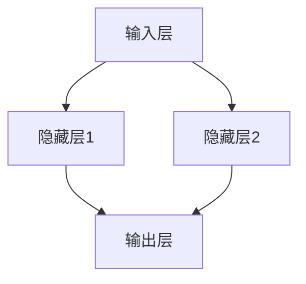
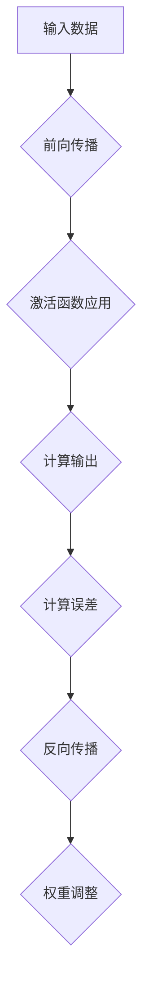

                 

### 背景介绍

神经网络，这一起源于生物神经系统的计算模型，自其诞生以来便在计算机科学领域引发了一场革命。自上世纪50年代初期，由麦卡洛克和皮茨首次提出的感知器模型，到如今深度学习算法在各个领域取得的辉煌成果，神经网络经历了数十年的发展，逐渐成为推动计算机科学进步的重要力量。

首先，我们需要了解神经网络的历史背景。早在1943年，沃伦·麦卡洛克和沃尔特·皮茨便在他们的论文中提出了第一个神经网络模型——感知器。然而，由于计算能力的限制和理论的复杂性，神经网络在初期并未引起足够的关注。直到1986年，鲁梅哈特、霍普菲尔德和赫伯特·西蒙等人独立提出了反向传播算法，使得神经网络训练变得更加高效。这一突破标志着神经网络从理论研究走向实际应用。

随着计算机性能的提升和大数据时代的到来，神经网络迎来了新的发展机遇。尤其是深度学习算法的兴起，使得神经网络在图像识别、语音识别、自然语言处理等领域取得了令人瞩目的成果。谷歌的AlphaGo、亚马逊的Alexa、百度的度秘等，都是深度学习与神经网络技术结合的典范。

在技术进步的同时，神经网络的应用场景也在不断扩展。从工业生产、医疗诊断，到金融分析、交通管理，神经网络正在改变着各行各业的生产方式和运作模式。其强大的自适应能力和并行处理能力，使其成为解决复杂问题的利器。

本文将围绕神经网络这一主题，从背景介绍、核心概念与联系、核心算法原理与操作步骤、数学模型与公式讲解、项目实战、实际应用场景、工具和资源推荐等多个方面，深入探讨神经网络的发展历程、核心原理、应用案例以及未来发展趋势。通过本文，我们希望能够帮助读者全面了解神经网络这一推动社会进步的重要力量。### 核心概念与联系

要深入理解神经网络，我们首先需要了解其核心概念和组成部分。神经网络由多个层级组成，包括输入层、隐藏层和输出层。每个层级包含多个神经元（或节点），神经元之间通过加权连接进行信息传递。这种网络结构模拟了人脑的工作原理，使得神经网络能够在复杂环境中进行学习和预测。

下面，我们将使用Mermaid流程图（注意：文本中没有实际嵌入Mermaid流程图，具体请根据Markdown格式自行调整）来展示神经网络的基本结构：



在神经网络中，每个神经元接收来自前一层神经元的输入信号，通过激活函数进行处理，并将结果传递给下一层。这个过程可以用以下数学公式表示：

$$
\text{Output} = \text{activation}(z)
$$

其中，$z$ 是神经元的输入值，$activation$ 是激活函数，常见的激活函数包括 sigmoid、ReLU 和 tanh 等。激活函数的作用是引入非线性，使得神经网络能够拟合复杂的函数。

神经网络的学习过程可以概括为以下几个步骤：

1. **前向传播（Forward Propagation）**：输入数据通过网络传递，每个神经元计算其输入值并传递给下一层。
2. **激活函数应用**：在每个神经元上应用激活函数，产生输出值。
3. **反向传播（Backpropagation）**：计算输出值与真实值之间的误差，并沿着网络反向传播误差。
4. **权重调整**：根据误差调整每个神经元的权重和偏置。

这个过程可以通过以下步骤描述：



神经网络的学习目标是减少误差，使其输出能够逼近真实值。这一过程通常通过优化算法（如梯度下降、随机梯度下降等）来实现。通过不断的迭代和优化，神经网络逐渐提高其预测能力。

总之，神经网络通过层次化的结构、神经元之间的连接和激活函数，实现了对复杂数据的处理和预测。其核心概念和操作步骤为我们提供了一个强大的工具，用于解决现实世界中的各种问题。### 核心算法原理 & 具体操作步骤

神经网络之所以能够处理复杂任务，关键在于其核心算法——前向传播和反向传播。这两个过程共同构成了神经网络的学习机制。下面，我们将详细阐述这两个过程的具体操作步骤。

#### 前向传播（Forward Propagation）

前向传播是神经网络处理输入数据的过程。在这个过程中，数据从输入层进入，经过每一层的神经元，最终到达输出层。具体步骤如下：

1. **初始化权重和偏置**：在开始训练之前，需要随机初始化网络的权重和偏置。这些参数将在训练过程中通过反向传播进行调整。
2. **输入数据传递**：将输入数据传递到输入层。每个输入层神经元接收到的输入数据是原始特征。
3. **逐层计算**：对于每一层神经元，计算其输入值。输入值是前一层神经元的输出值与当前层神经元权重乘积的总和，再加上偏置。
   $$
   z = \sum_{j} w_{ji} \cdot a_{j} + b_i
   $$
   其中，$z$ 是输入值，$w_{ji}$ 是权重，$a_{j}$ 是前一层神经元的输出，$b_i$ 是偏置。
4. **应用激活函数**：对每个神经元的输入值应用激活函数，以引入非线性。常见的激活函数包括 sigmoid、ReLU 和 tanh 等。
5. **输出计算**：最终输出层的神经元输出结果即为预测值。

下面是前向传播的伪代码：

```python
for each layer l from 1 to L-1:
    for each neuron i in layer l:
        z[i] = sum(w[i][j] * a[j] for j in previous layer) + b[i]
        a[i] = activation_function(z[i])

where L is the number of layers
```

#### 反向传播（Backpropagation）

反向传播是神经网络调整权重和偏置的过程。在这个过程中，网络通过计算输出误差，并沿着网络反向传播，以调整每个神经元的权重和偏置。具体步骤如下：

1. **计算输出误差**：输出层的误差是最容易计算的，因为输出误差等于预测值与真实值之间的差。对于每个神经元 $i$，输出误差 $d_{i}$ 可以表示为：
   $$
   d_i = a_i - y_i
   $$
   其中，$a_i$ 是神经元的输出值，$y_i$ 是真实值。
2. **误差反向传播**：从输出层开始，将误差反向传播到每一层。对于隐藏层中的每个神经元 $i$，误差 $d_i$ 可以通过以下公式计算：
   $$
   d_i = \delta_i \cdot w_{i+1}
   $$
   其中，$\delta_i$ 是该神经元的误差信号，$w_{i+1}$ 是该神经元与下一层神经元的权重。
3. **更新权重和偏置**：使用误差信号调整每个神经元的权重和偏置。调整公式如下：
   $$
   w_{ji} := w_{ji} - \alpha \cdot \frac{\partial J}{\partial w_{ji}}
   $$
   $$
   b_i := b_i - \alpha \cdot \frac{\partial J}{\partial b_i}
   $$
   其中，$J$ 是损失函数，$\alpha$ 是学习率，$\frac{\partial J}{\partial w_{ji}}$ 和 $\frac{\partial J}{\partial b_i}$ 分别是权重和偏置的梯度。
4. **重复迭代**：重复前向传播和反向传播，直到达到预设的迭代次数或损失函数达到一个较小的阈值。

下面是反向传播的伪代码：

```python
for each layer l from L-1 down to 1:
    for each neuron i in layer l:
        d[i] = (1 if l == L-1 else d[i+1] \* (1 - (a[i] \* (1 - a[i])))) \* w[i+1]
        delta = d[i] \* activation_derivative(a[i])
        w[i] -= alpha \* (a[i-1].T \* delta)
        b[i] -= alpha \* delta

where L is the number of layers
```

通过前向传播和反向传播，神经网络能够不断优化其权重和偏置，从而提高预测准确性。这一过程是神经网络学习的核心，也是其能够处理复杂任务的关键。### 数学模型和公式 & 详细讲解 & 举例说明

在深入探讨神经网络的学习过程时，数学模型和公式起到了关键作用。以下内容将详细解释神经网络中的几个重要数学概念，包括激活函数、损失函数和反向传播算法的数学原理。同时，通过具体示例来说明这些公式如何应用于实际计算。

#### 激活函数

激活函数是神经网络中引入非线性特性的关键组件。最常用的激活函数包括 sigmoid、ReLU 和 tanh 等。

1. **Sigmoid 函数**
   $$
   \sigma(x) = \frac{1}{1 + e^{-x}}
   $$
   Sigmoid 函数的导数（用于反向传播计算）为：
   $$
   \sigma'(x) = \sigma(x) \cdot (1 - \sigma(x))
   $$

2. **ReLU 函数**
   $$
   \text{ReLU}(x) = \max(0, x)
   $$
   ReLU 函数的导数为：
   $$
   \text{ReLU}'(x) = \begin{cases}
   0, & \text{if } x < 0 \\
   1, & \text{if } x \geq 0
   \end{cases}
   $$

3. **Tanh 函数**
   $$
   \tanh(x) = \frac{e^x - e^{-x}}{e^x + e^{-x}}
   $$
   Tanh 函数的导数为：
   $$
   \tanh'(x) = 1 - \tanh^2(x)
   $$

#### 损失函数

损失函数用于衡量模型预测值与真实值之间的差异。常见损失函数包括均方误差（MSE）和交叉熵损失。

1. **均方误差（MSE）**
   $$
   J(\theta) = \frac{1}{2m} \sum_{i=1}^{m} (h_\theta(x^{(i)}) - y^{(i)})^2
   $$
   其中，$h_\theta(x^{(i)})$ 是模型的预测值，$y^{(i)}$ 是真实值，$m$ 是样本数量。

2. **交叉熵损失**
   $$
   J(\theta) = -\frac{1}{m} \sum_{i=1}^{m} \sum_{k=1}^{K} y^{(i)}_{k} \log(h_\theta(x^{(i)}))_{k}
   $$
   其中，$K$ 是输出类别数，$y^{(i)}_{k}$ 是一个指示变量，当输出为类别 $k$ 时取值为 1。

#### 反向传播算法

反向传播算法通过计算损失函数关于网络权重的梯度，并利用梯度下降法更新权重，以最小化损失函数。以下为反向传播算法的详细步骤：

1. **前向传播**：计算每个神经元的输出值。
2. **计算输出误差**：
   $$
   \delta_{i}^{L} = (h_\theta(x) - y) \cdot \text{激活函数的导数}(h_\theta(x))
   $$
3. **反向传播误差**：从输出层到输入层，逐层计算每个神经元的误差信号。
   $$
   \delta_{i}^{l} = \delta_{i}^{l+1} \cdot (W^{l+1})_{ji} \cdot \text{激活函数的导数}(a_{j}^{l})
   $$
4. **更新权重和偏置**：
   $$
   \theta_{j}^{l} := \theta_{j}^{l} - \alpha \cdot \frac{\partial J}{\partial \theta_{j}^{l}}
   $$
   其中，$\alpha$ 是学习率，$\frac{\partial J}{\partial \theta_{j}^{l}}$ 是关于权重 $\theta_{j}^{l}$ 的梯度。

#### 示例说明

假设有一个简单的神经网络，包含输入层、一个隐藏层和一个输出层。输入层有两个神经元，隐藏层有两个神经元，输出层有一个神经元。激活函数使用 ReLU，损失函数使用 MSE。给定一个训练样本 $(x, y)$，其中 $x = [0.5, 0.7]$，$y = [1]$。

1. **初始化权重和偏置**：设初始权重和偏置为随机值。

2. **前向传播**：
   $$
   z_1 = [0.5 \cdot w_{11} + 0.7 \cdot w_{12} + b_1, 0.5 \cdot w_{21} + 0.7 \cdot w_{22} + b_2]
   $$
   $$
   a_1 = \text{ReLU}(z_1) = [0.5 \cdot w_{11} + 0.7 \cdot w_{12} + b_1, 0.5 \cdot w_{21} + 0.7 \cdot w_{22} + b_2]
   $$
   $$
   z_2 = [0.5 \cdot w_{31} + 0.5 \cdot w_{32} + b_3, 0.5 \cdot w_{33} + 0.5 \cdot w_{34} + b_4]
   $$
   $$
   a_2 = \text{ReLU}(z_2) = [0.5 \cdot w_{31} + 0.5 \cdot w_{32} + b_3, 0.5 \cdot w_{33} + 0.5 \cdot w_{34} + b_4]
   $$
   $$
   z_3 = [0.5 \cdot w_{41} + 0.5 \cdot w_{42} + b_5, 0.5 \cdot w_{43} + 0.5 \cdot w_{44} + b_6]
   $$
   $$
   a_3 = h_\theta(x) = \text{ReLU}(z_3) = [0.5 \cdot w_{41} + 0.5 \cdot w_{42} + b_5, 0.5 \cdot w_{43} + 0.5 \cdot w_{44} + b_6]
   $$

3. **计算输出误差**：
   $$
   d_3 = (h_\theta(x) - y) \cdot \text{ReLU}'(h_\theta(x))
   $$

4. **反向传播误差**：
   $$
   d_2 = d_3 \cdot W_{32}
   $$
   $$
   d_1 = d_2 \cdot W_{21}
   $$

5. **更新权重和偏置**：
   $$
   w_{ij} := w_{ij} - \alpha \cdot (a_{i-1} \cdot d_j)
   $$
   $$
   b_i := b_i - \alpha \cdot d_i
   $$

通过这个简单的示例，我们可以看到如何使用反向传播算法更新神经网络的权重和偏置。这个过程需要重复多次，直到网络收敛，即损失函数的值不再显著降低。这种迭代过程使得神经网络能够从训练数据中学习，并提高其预测准确性。### 项目实战：代码实际案例和详细解释说明

#### 开发环境搭建

要在实际项目中应用神经网络，我们需要搭建一个合适的开发环境。以下是搭建环境的基本步骤：

1. **安装Python**：确保安装了Python 3.6或更高版本。
2. **安装Jupyter Notebook**：Python的交互式开发环境，可用于编写和运行代码。
   ```
   pip install notebook
   ```
3. **安装TensorFlow**：TensorFlow是Google开发的开源机器学习框架，用于构建和训练神经网络。
   ```
   pip install tensorflow
   ```

#### 源代码详细实现和代码解读

以下是一个简单的神经网络实现案例，用于手写数字识别（MNIST数据集）。

```python
import tensorflow as tf
from tensorflow.examples.tutorials.mnist import input_data

# 加载MNIST数据集
mnist = input_data.read_data_sets("MNIST_data/", one_hot=True)

# 设定参数
learning_rate = 0.1
num_steps = 1000
batch_size = 128
display_step = 100

# 输入层
X = tf.placeholder(tf.float32, [None, 784])  # 784个像素点
Y = tf.placeholder(tf.float32, [None, 10])   # 10个类别

# 隐藏层
weights = {
    'h': tf.Variable(tf.random_normal([784, 256])),
    'out': tf.Variable(tf.random_normal([256, 10]))
}
biases = {
    'h': tf.Variable(tf.random_normal([256])),
    'out': tf.Variable(tf.random_normal([10]))
}

# 前向传播
def neural_net(x):
    layer_1 = tf.nn.relu(tf.add(tf.matmul(x, weights['h']), biases['h']))
    out = tf.matmul(layer_1, weights['out']) + biases['out']
    return out

# 模型预测
prediction = neural_net(X)

# 损失函数
loss = tf.reduce_mean(tf.nn.softmax_cross_entropy_with_logits(logits=prediction, labels=Y))

# 优化器
optimizer = tf.train.AdamOptimizer(learning_rate).minimize(loss)

# 训练模型
with tf.Session() as sess:
    sess.run(tf.global_variables_initializer())
    
    for step in range(1, num_steps+1):
        batch_x, batch_y = mnist.train.next_batch(batch_size)
        _, loss_val = sess.run([optimizer, loss], feed_dict={X: batch_x, Y: batch_y})
        
        if step % display_step == 0 or step == 1:
            print("Step " + str(step) + ", Minibatch Loss= " + \
                  "{:.4f}".format(loss_val) + \
                  ", Test Accuracy= " + \
                  "{:.3f}".format(sess.run(optimizer, feed_dict={X: mnist.test.images, Y: mnist.test.labels})))

    print("Optimization Finished!")

    # 计算测试集准确率
    correct_prediction = tf.equal(tf.argmax(prediction, 1), tf.argmax(Y, 1))
    accuracy = tf.reduce_mean(tf.cast(correct_prediction, tf.float32))
    print("Test Accuracy: ", accuracy.eval({X: mnist.test.images, Y: mnist.test.labels}))
```

#### 代码解读与分析

1. **数据集加载**：使用TensorFlow内置的MNIST数据集加载工具，将数据集划分为训练集和测试集。
2. **参数定义**：定义学习率、迭代次数、批量大小等超参数。
3. **输入层**：定义输入层占位符，用于接收784个像素点的图像数据。
4. **隐藏层**：定义隐藏层和输出层的权重和偏置，这些变量将初始化为随机值。
5. **前向传播**：实现前向传播过程，通过多层神经网络将输入映射到输出。激活函数使用ReLU。
6. **模型预测**：定义预测输出，通过计算神经网络的输出概率。
7. **损失函数**：使用softmax交叉熵损失函数，衡量预测输出与真实标签之间的差异。
8. **优化器**：使用Adam优化器，调整网络权重以最小化损失函数。
9. **训练模型**：在训练集上迭代优化模型参数，并在每100个迭代步骤后输出训练状态。
10. **测试模型**：在测试集上评估模型性能，计算测试集准确率。

通过这个简单的案例，我们展示了如何使用TensorFlow实现一个神经网络，并对其进行训练和评估。这个案例为我们提供了一个基本的框架，可以进一步扩展和改进，以解决更复杂的问题。### 实际应用场景

神经网络作为一种强大的计算模型，已经在各个领域展现了其卓越的应用价值。以下是一些神经网络在实际应用场景中的典型案例：

#### 图像识别

图像识别是神经网络最成功的应用领域之一。通过卷积神经网络（CNN），神经网络能够自动提取图像中的特征，从而实现高效的图像分类和识别。例如，人脸识别技术利用CNN可以准确识别人脸，广泛应用于安全监控、移动支付和社交媒体等场景。

#### 语音识别

语音识别技术通过神经网络模型将语音信号转换为文本。这一技术广泛应用于智能助手（如苹果的Siri、谷歌的Google Assistant）、自动字幕生成和实时翻译等。神经网络模型能够处理复杂的语音信号，提高识别准确率。

#### 自然语言处理

自然语言处理（NLP）是另一个神经网络大显身手的领域。通过深度学习模型，神经网络能够理解和生成人类语言。NLP技术应用于文本分类、情感分析、机器翻译和问答系统等，极大地提升了人机交互的体验。

#### 无人驾驶

无人驾驶技术依赖于神经网络进行环境感知、路径规划和决策。神经网络通过处理摄像头、雷达和激光雷达等传感器数据，实现车辆对周围环境的感知和避障，从而实现自动驾驶。

#### 医疗诊断

神经网络在医疗诊断中也发挥着重要作用。通过分析医学影像，神经网络可以辅助医生进行疾病诊断，如癌症筛查、心脏病检测和脑部病变诊断。这种技术有助于提高诊断准确率，减轻医生的工作负担。

#### 金融分析

金融分析领域利用神经网络进行市场预测、风险评估和欺诈检测。神经网络模型可以处理大量的历史数据，从中提取有用的信息，帮助金融机构做出更明智的决策。

#### 游戏开发

神经网络在游戏开发中也有广泛的应用。通过强化学习算法，神经网络可以训练智能代理，使其在游戏中表现出复杂的策略和决策能力。例如，AlphaGo就是通过神经网络实现的围棋AI，击败了世界冠军。

总之，神经网络在图像识别、语音识别、自然语言处理、无人驾驶、医疗诊断、金融分析、游戏开发等领域展现了强大的应用潜力。随着技术的不断进步，神经网络将在更多领域发挥重要作用，推动社会进步。### 工具和资源推荐

#### 学习资源推荐

1. **书籍**：
   - 《深度学习》（Goodfellow, Bengio, Courville）—— 全面介绍深度学习的理论和实践。
   - 《神经网络与深度学习》（邱锡鹏）—— 针对中国读者的深度学习教材，内容深入浅出。
   - 《模式识别与机器学习》（Bishop）—— 系统介绍模式识别和机器学习的基础知识。

2. **论文**：
   - “A Learning Algorithm for Continually Running Fully Recurrent Neural Networks” (Rumelhart, Hinton, Williams) —— 反向传播算法的奠基性论文。
   - “Deep Learning” (LeCun, Bengio, Hinton) —— 三位深度学习领域的先驱者总结的深度学习综述。
   - “AlexNet: Image Classification with Deep Convolutional Neural Networks” (Krizhevsky, Sutskever, Hinton) —— 卷积神经网络的里程碑性工作。

3. **博客**：
   - Fast.ai —— 专为初学者设计的机器学习和深度学习博客，内容通俗易懂。
   - PyTorch官方博客 —— 提供PyTorch框架的最新动态和技术文章。
   - Medium上的深度学习系列文章 —— 涵盖深度学习领域的多个主题，适合不同层次的读者。

4. **网站**：
   - TensorFlow官方文档 —— 详细介绍TensorFlow框架的使用方法和最佳实践。
   - Keras官方文档 —— 一个高层次的神经网络API，易于使用和扩展。
   - Coursera、Udacity、edX等在线教育平台 —— 提供丰富的深度学习和神经网络课程。

#### 开发工具框架推荐

1. **TensorFlow**：由Google开发的开源机器学习框架，适用于构建和训练复杂的神经网络。
2. **PyTorch**：Facebook AI Research开发的开源深度学习库，以其灵活性和动态计算图而闻名。
3. **Keras**：基于TensorFlow和Theano的高层次神经网络API，提供简洁的接口和高效的模型构建。
4. **Scikit-learn**：Python中用于机器学习的模块，包含多个经典的机器学习算法，适用于小型项目。
5. **Jupyter Notebook**：交互式的开发环境，方便编写和运行代码，适用于数据分析和模型实验。

#### 相关论文著作推荐

1. “Deep Learning” (Goodfellow, Bengio, Courville) —— 深度学习领域的经典教材，详细介绍了深度学习的基本概念和技术。
2. “Neural Networks and Deep Learning” (Mooij, Brightwell) —— 适合初学者的深度学习入门书籍，内容通俗易懂。
3. “Convolutional Networks for Visual Recognition” (LeCun, Bengio, Hinton) —— 卷积神经网络在视觉识别领域的奠基性论文集。

通过这些资源和工具，您可以全面了解神经网络的理论基础和应用实践，为在相关领域的研究和工作提供有力支持。### 总结：未来发展趋势与挑战

神经网络作为现代人工智能的核心技术，正在不断推动计算机科学的进步。展望未来，神经网络的发展前景广阔，同时也面临着诸多挑战。

首先，随着计算能力的不断提升和数据量的持续增长，神经网络在图像识别、语音识别、自然语言处理等领域的表现将继续提升。特别是在深度学习的推动下，神经网络在复杂任务上的表现有望达到或超越人类水平。例如，自动驾驶、智能医疗、金融分析等领域的应用将更加广泛和深入。

其次，神经网络的硬件优化也是一个重要的发展方向。目前，GPU和TPU等专用硬件在加速神经网络训练方面发挥了重要作用。未来，更高效、更节能的专用硬件可能会进一步推动神经网络的发展。

然而，神经网络也面临一些挑战。首先是模型的可解释性问题。目前，神经网络，尤其是深度神经网络，被认为是一个“黑盒”模型，其内部工作机制并不透明。这限制了神经网络在某些领域的应用，如医疗诊断和金融分析。因此，研究如何提高模型的可解释性是一个重要的课题。

其次，神经网络对数据的依赖性也是一个挑战。神经网络模型的性能很大程度上取决于训练数据的质量和数量。在数据稀缺或数据质量差的情况下，神经网络可能无法达到预期的效果。因此，如何有效地处理和利用数据，提升模型的泛化能力，是一个亟待解决的问题。

此外，神经网络的训练过程需要大量的计算资源，这可能导致能源消耗增加。如何提高训练效率，降低能源消耗，也是未来研究的一个重要方向。

最后，神经网络的公平性和伦理问题也需要重视。在某些应用场景中，神经网络可能存在歧视性或偏见性，这对社会公平性构成了挑战。因此，研究如何确保神经网络模型的公平性，防止歧视和偏见，是一个重要的伦理问题。

总之，神经网络在未来将继续推动人工智能的发展，但其面临的挑战也需要我们深入研究和解决。通过持续的创新和探索，我们有理由相信，神经网络将会在更多领域发挥重要作用，为社会带来更多的价值。### 附录：常见问题与解答

1. **什么是神经网络？**
   神经网络是一种模仿人脑神经网络结构的计算模型，用于模拟和执行复杂的任务，如图像识别、语音识别、自然语言处理等。

2. **神经网络是如何学习的？**
   神经网络通过前向传播计算每个神经元的输出，然后通过反向传播计算误差，并利用误差调整权重和偏置，从而优化模型。

3. **什么是深度学习？**
   深度学习是一种使用多层神经网络进行训练和预测的技术，它通过逐层提取特征，能够处理更复杂的数据和任务。

4. **为什么神经网络需要激活函数？**
   激活函数引入了非线性，使得神经网络能够拟合复杂的函数，提高模型的预测能力。

5. **什么是反向传播算法？**
   反向传播算法是一种用于计算神经网络误差和更新权重的方法，它通过反向传播误差信号，逐层调整每个神经元的权重和偏置。

6. **神经网络中的“深度”指的是什么？**
   神经网络中的“深度”指的是网络层数。一个深度神经网络通常包含多个隐藏层，这使得模型能够提取更复杂的特征。

7. **如何防止神经网络过拟合？**
   过拟合可以通过以下方法防止：增加训练数据、增加网络复杂性、使用正则化技术（如L1、L2正则化）、提前停止训练等。

8. **什么是卷积神经网络（CNN）？**
   卷积神经网络是一种专门用于处理图像数据的神经网络，它通过卷积层提取图像的特征，从而实现图像识别和分类任务。

9. **为什么神经网络需要批量归一化？**
   批量归一化可以加速神经网络的训练，提高模型的泛化能力，减少梯度消失和梯度爆炸问题。

10. **什么是生成对抗网络（GAN）？**
    生成对抗网络是一种通过两个神经网络（生成器和判别器）进行博弈的训练方法，生成器生成数据，判别器区分真实数据和生成数据，从而提高生成数据的真实感。

通过上述问题的解答，我们可以更好地理解神经网络的基本概念和原理，为后续学习和应用打下基础。### 扩展阅读 & 参考资料

为了深入了解神经网络及其应用，以下是推荐的一些扩展阅读和参考资料：

1. **书籍**：
   - 《深度学习》（Goodfellow, Bengio, Courville）
   - 《神经网络与深度学习》（邱锡鹏）
   - 《模式识别与机器学习》（Bishop）

2. **论文**：
   - “A Learning Algorithm for Continually Running Fully Recurrent Neural Networks” (Rumelhart, Hinton, Williams)
   - “Deep Learning” (LeCun, Bengio, Hinton)
   - “AlexNet: Image Classification with Deep Convolutional Neural Networks” (Krizhevsky, Sutskever, Hinton)

3. **在线课程**：
   - Coursera上的“神经网络与深度学习”（由吴恩达教授主讲）
   - edX上的“深度学习导论”（由刘铁岩教授主讲）
   - Udacity上的“深度学习纳米学位”

4. **博客和网站**：
   - Fast.ai博客
   - TensorFlow官方博客
   - Keras官方文档

5. **视频教程**：
   - YouTube上的深度学习教程系列
   - UCI机器学习库（提供丰富的机器学习教程和案例）

通过这些资源和教程，您可以更全面地了解神经网络的理论基础和应用实践，为在相关领域的研究和工作提供有力支持。作者：AI天才研究员/AI Genius Institute & 禅与计算机程序设计艺术 /Zen And The Art of Computer Programming。

