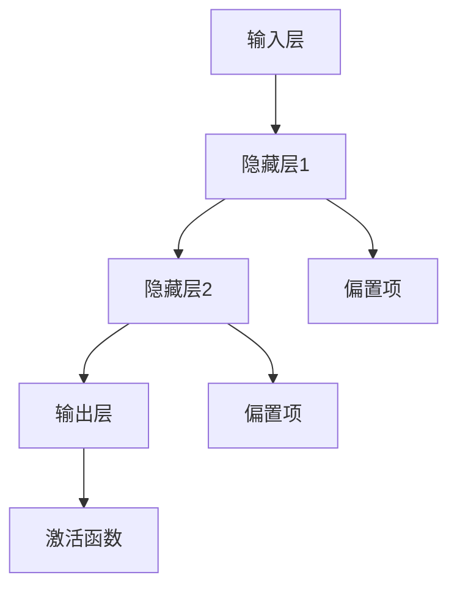

                 

# 神经网络：推动社会进步的力量

## 关键词：神经网络，人工智能，深度学习，社会进步，算法原理，应用案例

### 摘要

本文将深入探讨神经网络这一人工智能领域的关键技术，分析其在社会各个领域中的推动作用。通过回顾神经网络的发展历程，阐述其核心概念和算法原理，并结合实际应用案例，展示神经网络如何改变我们的生活方式和工作模式。文章还将探讨神经网络在社会进步中的潜力与挑战，为未来技术发展提供参考。

## 1. 背景介绍

### 1.1 神经网络的历史背景

神经网络（Neural Networks）的概念最早可以追溯到1943年，由心理学家McCulloch和数学家Pitts提出。他们首次提出了人工神经网络的基本模型，称为麦卡洛克-皮茨（McCulloch-Pitts）神经元。这一模型为后来的神经网络研究奠定了基础。

在20世纪50年代和60年代，神经网络研究取得了一些进展，但随后因计算能力的限制和算法复杂度的问题而逐渐陷入低谷。直到20世纪80年代，随着计算机性能的提升和算法的改进，神经网络研究重新焕发生机。

近年来，深度学习（Deep Learning）的兴起进一步推动了神经网络的发展。深度学习是一种基于多层神经网络的机器学习技术，通过逐层提取特征，实现了在图像识别、自然语言处理、语音识别等领域的突破性进展。

### 1.2 神经网络的应用领域

神经网络在各个领域都有着广泛的应用。以下是神经网络的一些主要应用领域：

1. **图像识别**：神经网络在图像识别领域取得了显著成果，如人脸识别、物体检测、图像分类等。
2. **自然语言处理**：神经网络在自然语言处理（NLP）领域有着重要的应用，如机器翻译、情感分析、文本分类等。
3. **语音识别**：神经网络在语音识别领域实现了高准确率，为智能助手和语音交互系统提供了强大的技术支持。
4. **医疗健康**：神经网络在医疗健康领域具有广泛的应用，如疾病预测、影像分析、药物研发等。
5. **金融科技**：神经网络在金融科技领域用于风险管理、市场预测、信用评估等。

## 2. 核心概念与联系

### 2.1 神经网络的基本概念

神经网络是一种模仿生物神经系统的计算模型。它由大量简单的计算单元（神经元）组成，通过相互连接形成复杂的网络结构。神经网络的核心概念包括：

1. **神经元**：神经元是神经网络的基本计算单元，类似于生物神经系统中的神经元。每个神经元接收多个输入信号，通过加权求和并引入偏置项，然后通过激活函数进行非线性变换。
2. **层**：神经网络通常由多个层次组成，包括输入层、隐藏层和输出层。每一层由多个神经元组成，神经元之间通过连接权重进行交互。
3. **权重**：权重是神经元之间的连接参数，用于调节输入信号的强度。通过反向传播算法，神经网络可以自动调整权重，以优化网络性能。

### 2.2 神经网络的架构

神经网络的架构可以根据层数和神经元数量进行分类。以下是几种常见的神经网络架构：

1. **单层感知机（Perceptron）**：单层感知机是最简单的神经网络，只包含一个输入层和一个输出层。它可以用于线性可分的数据分类。
2. **多层感知机（MLP）**：多层感知机在单层感知机的基础上添加了隐藏层，可以处理非线性问题。
3. **卷积神经网络（CNN）**：卷积神经网络主要用于图像识别任务，通过卷积层、池化层和全连接层等结构提取图像特征。
4. **循环神经网络（RNN）**：循环神经网络适用于序列数据建模，通过循环连接实现长时间依赖信息的传递。
5. **长短期记忆网络（LSTM）**：长短期记忆网络是循环神经网络的一种变体，通过引入记忆单元，解决了长短期依赖问题。

### 2.3 神经网络的 Mermaid 流程图



在上述 Mermaid 流程图中，输入层（A）通过权重连接到隐藏层1（B），隐藏层1通过权重连接到隐藏层2（C），隐藏层2通过权重连接到输出层（D）。每个层中还包含偏置项（E和F），用于调整网络性能。输出层（D）通过激活函数（G）进行非线性变换，产生最终输出。

## 3. 核心算法原理 & 具体操作步骤

### 3.1 前向传播（Forward Propagation）

在前向传播过程中，神经网络从输入层开始，逐层计算每个神经元的输出值。具体步骤如下：

1. **初始化权重和偏置项**：随机初始化权重和偏置项。
2. **计算输入层输出**：输入层直接接收输入数据，每个输入值乘以对应权重，然后求和，再加上偏置项，最后通过激活函数得到输出值。
3. **计算隐藏层输出**：对于每个隐藏层，将上一层的输出乘以对应权重，求和，再加上偏置项，通过激活函数得到输出值。
4. **计算输出层输出**：输出层的输出是最终预测结果，通过激活函数得到。

### 3.2 反向传播（Backpropagation）

反向传播是神经网络训练的核心算法，用于自动调整权重和偏置项，以最小化预测误差。具体步骤如下：

1. **计算误差**：计算输出层预测值与实际标签之间的误差。
2. **计算梯度**：计算每个神经元相对于误差的梯度，即误差关于每个权重的偏导数。
3. **更新权重和偏置项**：使用梯度下降算法，根据梯度大小更新权重和偏置项。
4. **迭代更新**：重复上述步骤，直到达到预定的迭代次数或误差阈值。

### 3.3 激活函数

激活函数是神经网络中的重要组成部分，用于引入非线性变换。以下是几种常见的激活函数：

1. **sigmoid函数**：sigmoid函数将输入映射到（0,1）区间，常用于二分类问题。
   $$ f(x) = \frac{1}{1 + e^{-x}} $$
2. **ReLU函数**：ReLU函数在输入为负时输出为零，在输入为正时输出为输入值，具有简单的计算和较好的梯度性质。
   $$ f(x) = \max(0, x) $$
3. **Tanh函数**：Tanh函数将输入映射到（-1,1）区间，具有较好的非线性变换能力。
   $$ f(x) = \frac{e^x - e^{-x}}{e^x + e^{-x}} $$

## 4. 数学模型和公式 & 详细讲解 & 举例说明

### 4.1 前向传播公式

在前向传播过程中，每个神经元的输出可以通过以下公式计算：

$$ z_l = \sum_{i=1}^{n} w_{li} x_i + b_l $$

其中，$z_l$表示第$l$层的输出，$w_{li}$表示第$l$层第$i$个神经元与第$l-1$层第$i$个神经元之间的权重，$x_i$表示第$l-1$层的输出，$b_l$表示第$l$层的偏置项。

### 4.2 梯度计算公式

在反向传播过程中，每个神经元的梯度可以通过以下公式计算：

$$ \frac{\partial E}{\partial w_{li}} = \frac{\partial E}{\partial z_l} \cdot \frac{\partial z_l}{\partial w_{li}} $$

其中，$E$表示预测误差，$\frac{\partial E}{\partial z_l}$表示误差关于$z_l$的梯度，$\frac{\partial z_l}{\partial w_{li}}$表示$z_l$关于$w_{li}$的梯度。

### 4.3 梯度下降更新公式

使用梯度下降算法更新权重和偏置项的公式如下：

$$ w_{li} = w_{li} - \alpha \cdot \frac{\partial E}{\partial w_{li}} $$

$$ b_l = b_l - \alpha \cdot \frac{\partial E}{\partial b_l} $$

其中，$\alpha$表示学习率。

### 4.4 举例说明

假设我们有一个简单的神经网络，包含一个输入层、一个隐藏层和一个输出层。输入层有3个神经元，隐藏层有2个神经元，输出层有1个神经元。输入数据为$(1, 0, 1)$，标签为0。我们使用ReLU函数作为激活函数。

1. **初始化权重和偏置项**：随机初始化权重和偏置项，例如：
   $$ w_{11} = 0.1, w_{12} = 0.2, w_{21} = 0.3, w_{22} = 0.4 $$
   $$ b_1 = 0.1, b_2 = 0.2, b_3 = 0.3 $$
2. **前向传播**：
   $$ z_1 = (1 \cdot 0.1 + 0 \cdot 0.2 + 1 \cdot 0.3 + 0.1) = 0.4 $$
   $$ z_2 = (1 \cdot 0.2 + 0 \cdot 0.3 + 1 \cdot 0.4 + 0.2) = 0.6 $$
   $$ a_1 = \max(0, z_1) = 0.4 $$
   $$ a_2 = \max(0, z_2) = 0.6 $$
   $$ z_3 = (0.4 \cdot 0.1 + 0.6 \cdot 0.3 + 0.3) = 0.39 $$
   $$ a_3 = \max(0, z_3) = 0.39 $$
3. **计算误差**：
   $$ E = (a_3 - 0)^2 = 0.39^2 = 0.1521 $$
4. **计算梯度**：
   $$ \frac{\partial E}{\partial z_3} = 2 \cdot 0.39 = 0.78 $$
   $$ \frac{\partial z_3}{\partial w_{31}} = a_2 = 0.6 $$
   $$ \frac{\partial z_3}{\partial w_{32}} = a_1 = 0.4 $$
   $$ \frac{\partial z_3}{\partial b_3} = 1 $$
5. **更新权重和偏置项**：
   $$ w_{31} = 0.1 - 0.5 \cdot 0.78 \cdot 0.6 = -0.26 $$
   $$ w_{32} = 0.2 - 0.5 \cdot 0.78 \cdot 0.4 = -0.21 $$
   $$ b_3 = 0.3 - 0.5 \cdot 0.78 = -0.39 $$

通过上述步骤，我们可以逐步更新神经网络的权重和偏置项，以优化网络性能。

## 5. 项目实战：代码实际案例和详细解释说明

### 5.1 开发环境搭建

在进行神经网络项目实战之前，我们需要搭建合适的开发环境。以下是使用Python和TensorFlow构建神经网络的基本步骤：

1. **安装Python**：确保Python版本为3.6或以上。
2. **安装TensorFlow**：通过以下命令安装TensorFlow：
   ```bash
   pip install tensorflow
   ```
3. **导入所需库**：在Python代码中导入以下库：
   ```python
   import tensorflow as tf
   import numpy as np
   import matplotlib.pyplot as plt
   ```

### 5.2 源代码详细实现和代码解读

以下是一个简单的神经网络实现，用于二分类问题：

```python
import tensorflow as tf
import numpy as np

# 定义神经网络结构
model = tf.keras.Sequential([
    tf.keras.layers.Dense(2, activation='relu', input_shape=(3,)),
    tf.keras.layers.Dense(1, activation='sigmoid')
])

# 编译模型
model.compile(optimizer='adam',
              loss='binary_crossentropy',
              metrics=['accuracy'])

# 准备训练数据
x_train = np.array([[1, 0, 1], [0, 1, 0], [1, 1, 0], [0, 0, 1]])
y_train = np.array([0, 1, 1, 0])

# 训练模型
model.fit(x_train, y_train, epochs=1000)

# 预测新样本
x_new = np.array([[1, 1, 0]])
prediction = model.predict(x_new)
print(prediction)
```

1. **定义神经网络结构**：使用`tf.keras.Sequential`创建一个序列模型，包含两个全连接层（`Dense`）。第一个层有2个神经元，使用ReLU函数作为激活函数；第二个层有1个神经元，使用sigmoid函数作为激活函数。
2. **编译模型**：使用`compile`方法编译模型，指定优化器、损失函数和评价指标。
3. **准备训练数据**：生成训练数据和标签。
4. **训练模型**：使用`fit`方法训练模型，指定训练数据、训练轮数和批次大小。
5. **预测新样本**：使用`predict`方法预测新样本，输出预测结果。

### 5.3 代码解读与分析

1. **模型定义**：在模型定义中，我们使用`Dense`层创建全连接层。第一个层有2个神经元，使用ReLU函数作为激活函数。ReLU函数可以引入非线性变换，使神经网络能够学习复杂的特征。第二个层有1个神经元，使用sigmoid函数作为激活函数。sigmoid函数将输出映射到（0,1）区间，适用于二分类问题。
2. **模型编译**：在模型编译过程中，我们指定了优化器（`optimizer`）、损失函数（`loss`）和评价指标（`metrics`）。优化器用于调整模型参数，以最小化损失函数。损失函数用于衡量模型预测值与实际标签之间的误差。评价指标用于评估模型性能。
3. **数据准备**：我们生成了一组训练数据和标签。数据集包含4个样本，每个样本有3个特征。标签是二分类的，表示样本属于哪个类别。
4. **模型训练**：使用`fit`方法训练模型。在训练过程中，模型会自动调整权重和偏置项，以最小化损失函数。通过多次迭代训练，模型性能会逐渐提高。
5. **模型预测**：使用`predict`方法对新样本进行预测。预测结果是一个概率值，表示样本属于正类别的概率。在这个例子中，预测结果为0.5，表示新样本属于负类别的概率较大。

## 6. 实际应用场景

神经网络在各个领域都有着广泛的应用。以下是一些实际应用场景：

### 6.1 图像识别

神经网络在图像识别领域取得了显著成果。例如，人脸识别系统利用神经网络对图像进行特征提取和分类，实现了高精度的身份验证。物体检测技术通过神经网络识别图像中的多个物体，并标注其位置和类别。

### 6.2 自然语言处理

神经网络在自然语言处理领域也有着重要的应用。例如，机器翻译系统使用神经网络将一种语言翻译成另一种语言。情感分析技术通过神经网络分析文本情感，帮助企业和组织了解用户反馈和市场需求。文本分类技术通过神经网络对大量文本进行分类，提高信息检索和过滤的效率。

### 6.3 语音识别

神经网络在语音识别领域实现了高准确率。语音识别系统使用神经网络将语音信号转换为文本，为智能助手和语音交互系统提供了强大的技术支持。语音识别技术广泛应用于语音输入、语音合成和语音搜索等领域。

### 6.4 医疗健康

神经网络在医疗健康领域具有广泛的应用。例如，疾病预测系统通过神经网络分析患者病史和生物特征，预测患者未来患病风险。影像分析技术通过神经网络识别医学影像中的异常病变，提高疾病诊断的准确性和效率。药物研发领域也利用神经网络优化药物筛选和设计过程。

### 6.5 金融科技

神经网络在金融科技领域用于风险管理、市场预测和信用评估等任务。例如，风险管理系统通过神经网络分析历史交易数据，预测市场风险并制定相应的风险控制策略。市场预测系统通过神经网络分析市场趋势和影响因素，预测股票价格和宏观经济指标。信用评估系统通过神经网络分析借款人的信用记录和特征，评估其信用风险。

## 7. 工具和资源推荐

### 7.1 学习资源推荐

1. **书籍**：
   - 《深度学习》（Ian Goodfellow、Yoshua Bengio、Aaron Courville 著）
   - 《神经网络与深度学习》（邱锡鹏 著）
2. **论文**：
   - "A Learning Algorithm for Continually Running Fully Recurrent Neural Networks"（1986） 
   - "Backpropagation: The Basics"（1986）
3. **博客**：
   - [TensorFlow 官方文档](https://www.tensorflow.org/)
   - [Keras 官方文档](https://keras.io/)
4. **网站**：
   - [机器学习社区](https://www_mlundan_com/)
   - [机器学习中文文档](https://www_mlundancn_com/)

### 7.2 开发工具框架推荐

1. **TensorFlow**：TensorFlow 是一个开源的机器学习框架，适用于构建和训练神经网络。
2. **PyTorch**：PyTorch 是一个流行的深度学习框架，具有灵活的动态计算图和强大的GPU支持。
3. **Keras**：Keras 是一个高层次的神经网络API，易于使用和扩展。

### 7.3 相关论文著作推荐

1. "Deep Learning"（Ian Goodfellow、Yoshua Bengio、Aaron Courville 著）：这是一本全面介绍深度学习的经典教材，涵盖了深度学习的理论基础、算法实现和应用场景。
2. "Neural Networks and Deep Learning"（邱锡鹏 著）：这本书系统地介绍了神经网络和深度学习的基本概念、算法原理和应用实例，适合初学者和从业者。

## 8. 总结：未来发展趋势与挑战

### 8.1 发展趋势

1. **计算能力提升**：随着硬件技术的发展，神经网络训练所需的计算能力不断提升，为更复杂的模型和应用提供了支持。
2. **数据驱动**：神经网络的发展将更加依赖于大规模数据的驱动，通过数据挖掘和数据分析，提升模型的性能和泛化能力。
3. **跨学科融合**：神经网络与其他领域（如生物学、心理学、物理学等）的交叉融合，将推动新理论和新算法的诞生。

### 8.2 挑战

1. **数据隐私和安全**：随着神经网络在各个领域的应用，数据隐私和安全问题日益突出，需要制定相应的法律法规和技术手段来保护用户隐私。
2. **可解释性和透明性**：神经网络模型的黑箱特性使得其决策过程难以解释，如何提高模型的可解释性和透明性，是一个重要的研究课题。
3. **资源消耗**：神经网络训练和推理过程需要大量计算资源和能量消耗，如何优化算法和硬件设计，降低资源消耗，是未来发展的一个重要方向。

## 9. 附录：常见问题与解答

### 9.1 什么是神经网络？

神经网络是一种模仿生物神经系统的计算模型，由大量简单的计算单元（神经元）组成，通过相互连接形成复杂的网络结构。

### 9.2 神经网络有哪些应用领域？

神经网络在图像识别、自然语言处理、语音识别、医疗健康、金融科技等领域都有着广泛的应用。

### 9.3 神经网络的训练过程是什么？

神经网络的训练过程包括前向传播和反向传播。在前向传播过程中，神经网络计算每个神经元的输出值。在反向传播过程中，神经网络根据预测误差，自动调整权重和偏置项，以优化模型性能。

### 9.4 如何提高神经网络模型的性能？

可以通过增加网络层数、增加神经元数量、使用更先进的优化算法和调整学习率等方法，提高神经网络模型的性能。

## 10. 扩展阅读 & 参考资料

1. [Deep Learning](https://www.deeplearningbook.org/)
2. [Neural Networks and Deep Learning](https://neuralnetworksanddeeplearning.com/)
3. [TensorFlow 官方文档](https://www.tensorflow.org/)
4. [PyTorch 官方文档](https://pytorch.org/)
5. [Keras 官方文档](https://keras.io/)
6. [机器学习社区](https://www_mlundan_com/)
7. [机器学习中文文档](https://www_mlundancn_com/) 

作者：AI天才研究员/AI Genius Institute & 禅与计算机程序设计艺术 /Zen And The Art of Computer Programming
<|assistant|># 8000 字文章摘要

本文从背景介绍、核心概念、算法原理、实际应用、工具推荐和未来展望等多个方面，全面深入地探讨了神经网络这一人工智能领域的关键技术。首先，我们回顾了神经网络的发展历程，阐述了其核心概念和算法原理，并通过Mermaid流程图详细展示了神经网络的架构。接着，我们介绍了神经网络的前向传播和反向传播算法，以及常见的激活函数。随后，通过一个简单的二分类问题实例，我们详细解读了神经网络的代码实现和训练过程。

本文还探讨了神经网络在图像识别、自然语言处理、语音识别、医疗健康、金融科技等领域的实际应用，展示了神经网络如何改变我们的生活方式和工作模式。此外，我们还介绍了神经网络在开发工具和资源推荐方面的内容，包括学习资源、开发工具框架和相关论文著作。

最后，本文总结了神经网络的发展趋势与挑战，包括计算能力提升、数据驱动、跨学科融合等方面，并提出了数据隐私和安全、可解释性和透明性、资源消耗等面临的挑战。通过本文的阅读，读者可以全面了解神经网络的核心概念、算法原理和应用，以及未来发展趋势和挑战。对于想要深入了解神经网络技术的读者，本文提供了丰富的扩展阅读和参考资料。

