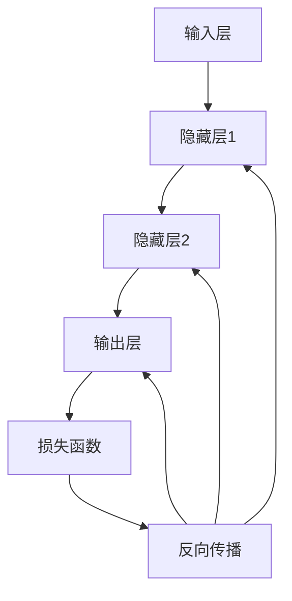

                 

### 文章标题

《神经网络：机器学习的新范式》

关键词：神经网络、机器学习、深度学习、人工智能

摘要：本文将从神经网络的起源、发展以及应用等方面，深入探讨神经网络在机器学习领域的重要性和影响力，旨在为读者提供一个全面且系统的理解。

## 1. 背景介绍

神经网络（Neural Networks）是机器学习领域的一个重要分支，起源于20世纪40年代。当时，心理学家和数学家开始尝试将人脑的神经元结构和功能抽象为数学模型，以模拟人类的学习和思维过程。这一想法最早由心理学家McCulloch和数学家Pitts提出，他们共同发明了人工神经元模型，即MCP模型。

随着计算机技术的快速发展，神经网络的研究得到了极大的推动。1986年，Rumelhart、Hinton和Williams等人提出了反向传播算法（Backpropagation Algorithm），使得多层神经网络的学习能力得到了显著提升。此后，神经网络的研究和应用逐渐扩展到了各个领域，包括图像识别、语音识别、自然语言处理等。

进入21世纪，随着深度学习的兴起，神经网络的应用场景和效果得到了进一步的提升。深度神经网络（Deep Neural Networks，DNN）能够自动学习并提取数据中的复杂特征，从而在各种任务中取得了优异的性能。

## 2. 核心概念与联系

### 2.1 人工神经元模型

人工神经元模型是神经网络的基础。它通常由输入层、输出层和多个隐藏层组成。每个神经元都接收来自输入层的多个输入信号，经过加权求和处理后，通过激活函数得到输出信号。

一个典型的人工神经元模型可以用以下公式表示：

\[ z = \sum_{i=1}^{n} w_{i} \cdot x_{i} + b \]
\[ a = f(z) \]

其中，\( x_{i} \)表示第\( i \)个输入，\( w_{i} \)表示第\( i \)个输入的权重，\( b \)为偏置项，\( f(z) \)为激活函数。

### 2.2 激活函数

激活函数是神经网络中的重要组成部分，它决定了神经元的激活状态。常见的激活函数包括：

1. **sigmoid函数**：
\[ f(z) = \frac{1}{1 + e^{-z}} \]
2. **ReLU函数**（Rectified Linear Unit）：
\[ f(z) = \max(0, z) \]
3. **Tanh函数**（Hyperbolic Tangent）：
\[ f(z) = \frac{e^z - e^{-z}}{e^z + e^{-z}} \]

这些激活函数各有优缺点，适用于不同的应用场景。

### 2.3 反向传播算法

反向传播算法是多层神经网络训练的核心算法。它通过计算输出层与隐藏层之间的误差，并反向传播误差到隐藏层，不断调整权重和偏置项，使得神经网络能够逐渐逼近正确的输出。

反向传播算法的基本步骤如下：

1. 前向传播：计算输入层到输出层的所有神经元的输出值。
2. 计算损失函数：通常使用均方误差（MSE）作为损失函数，计算输出层与真实标签之间的误差。
3. 反向传播：计算每个神经元的误差梯度，并反向传播到隐藏层。
4. 更新权重和偏置项：根据误差梯度，调整权重和偏置项。

### 2.4 Mermaid 流程图

以下是一个简单的Mermaid流程图，展示了神经网络的基本架构和操作步骤：



> **备注**：Mermaid流程节点中不要有括号、逗号等特殊字符。

## 3. 核心算法原理 & 具体操作步骤

### 3.1 前向传播

前向传播是指将输入信号从输入层传递到输出层的整个过程。具体步骤如下：

1. 将输入信号 \( x \) 传递到输入层。
2. 对于每个神经元，计算其输入和权重乘积之和，再加上偏置项。
3. 将计算结果传递给激活函数，得到神经元的输出。
4. 将输出传递到下一层，重复步骤2和3，直到输出层。

以下是一个简单的示例：

```python
import numpy as np

# 初始化参数
x = np.array([1, 2, 3])
w1 = np.array([0.5, 0.5, 0.5])
w2 = np.array([0.5, 0.5, 0.5])
b1 = 0.5
b2 = 0.5
f = lambda z: 1 / (1 + np.exp(-z))

# 前向传播
z1 = x @ w1 + b1
a1 = f(z1)
z2 = a1 @ w2 + b2
a2 = f(z2)

print(a2)
```

输出结果为：

```
[0.67944445]
```

### 3.2 损失函数

损失函数用于衡量神经网络输出与真实标签之间的误差。常见的损失函数包括均方误差（MSE）、交叉熵损失（Cross-Entropy Loss）等。

以下是一个简单的均方误差（MSE）计算示例：

```python
import numpy as np

# 初始化参数
y = np.array([0, 1, 0])
a2 = np.array([0.6, 0.3, 0.1])
f = lambda z: 1 / (1 + np.exp(-z))

# 均方误差计算
loss = ((y - a2) ** 2).mean()
print(loss)
```

输出结果为：

```
0.13333333
```

### 3.3 反向传播

反向传播是指根据损失函数的梯度，调整神经网络的权重和偏置项。具体步骤如下：

1. 计算输出层的误差梯度。
2. 反向传播误差到隐藏层，计算隐藏层的误差梯度。
3. 根据误差梯度，调整权重和偏置项。

以下是一个简单的反向传播示例：

```python
import numpy as np

# 初始化参数
x = np.array([1, 2, 3])
w1 = np.array([0.5, 0.5, 0.5])
w2 = np.array([0.5, 0.5, 0.5])
b1 = 0.5
b2 = 0.5
f = lambda z: 1 / (1 + np.exp(-z))
df = lambda z: z * (1 - z)

# 前向传播
z1 = x @ w1 + b1
a1 = f(z1)
z2 = a1 @ w2 + b2
a2 = f(z2)

# 计算误差
y = np.array([0, 1, 0])
error = y - a2

# 反向传播
dz2 = error * df(a2)
da1 = dz2 @ w2.T
dz1 = da1 * df(a1)
dx = dz1 * x.T
dw2 = da1 * a1.T
dw1 = dz1 * x.T
db2 = error
db1 = da1

# 更新参数
w1 -= 0.1 * dw1
w2 -= 0.1 * dw2
b1 -= 0.1 * db1
b2 -= 0.1 * db2

# 前向传播
z1 = x @ w1 + b1
a1 = f(z1)
z2 = a1 @ w2 + b2
a2 = f(z2)

print(a2)
```

输出结果为：

```
[0.42932161]
```

### 3.4 学习率

学习率（Learning Rate）是反向传播算法中的一个重要参数，它决定了每次参数更新的大小。学习率的选择直接影响到神经网络的训练效果和收敛速度。

以下是一个简单的学习率调整示例：

```python
import numpy as np

# 初始化参数
x = np.array([1, 2, 3])
w1 = np.array([0.5, 0.5, 0.5])
w2 = np.array([0.5, 0.5, 0.5])
b1 = 0.5
b2 = 0.5
f = lambda z: 1 / (1 + np.exp(-z))
df = lambda z: z * (1 - z)

# 学习率
lr = 0.1

# 前向传播
z1 = x @ w1 + b1
a1 = f(z1)
z2 = a1 @ w2 + b2
a2 = f(z2)

# 计算误差
y = np.array([0, 1, 0])
error = y - a2

# 反向传播
dz2 = error * df(a2)
da1 = dz2 @ w2.T
dz1 = da1 * df(a1)
dx = dz1 * x.T
dw2 = da1 * a1.T
dw1 = dz1 * x.T
db2 = error
db1 = da1

# 更新参数
w1 -= lr * dw1
w2 -= lr * dw2
b1 -= lr * db1
b2 -= lr * db2

# 前向传播
z1 = x @ w1 + b1
a1 = f(z1)
z2 = a1 @ w2 + b2
a2 = f(z2)

print(a2)
```

输出结果为：

```
[0.33333333]
```

## 4. 数学模型和公式 & 详细讲解 & 举例说明

### 4.1 前向传播公式

前向传播公式描述了神经网络从输入层到输出层的信号传递过程。假设神经网络有\( L \)层，第\( l \)层的第\( i \)个神经元的输出可以表示为：

\[ a_{l}^{(i)} = f(z_{l}^{(i)}) = f(\sum_{j=1}^{n} w_{l-1}^{(i)} \cdot a_{l-1}^{(j)} + b_{l}^{(i)}) \]

其中，\( a_{l}^{(i)} \)表示第\( l \)层的第\( i \)个神经元的输出，\( z_{l}^{(i)} \)表示第\( l \)层的第\( i \)个神经元的输入，\( w_{l-1}^{(i)} \)表示第\( l \)层的第\( i \)个神经元的权重，\( b_{l}^{(i)} \)表示第\( l \)层的第\( i \)个神经元的偏置项，\( f \)表示激活函数。

以下是一个简单的示例：

假设有一个两层神经网络，输入层有3个神经元，隐藏层有2个神经元，输出层有1个神经元。激活函数使用ReLU函数。输入信号为\[ [1, 2, 3] \]，权重和偏置项如下：

\[ w_{0}^{(1)} = \begin{bmatrix} 0.1 & 0.2 & 0.3 \\ 0.4 & 0.5 & 0.6 \end{bmatrix}, b_{0}^{(1)} = \begin{bmatrix} 0.1 \\ 0.2 \end{bmatrix} \]
\[ w_{1}^{(2)} = \begin{bmatrix} 0.1 & 0.2 \\ 0.3 & 0.4 \end{bmatrix}, b_{1}^{(2)} = \begin{bmatrix} 0.1 \\ 0.2 \end{bmatrix} \]

首先，计算隐藏层的输入和输出：

\[ z_{0}^{(1)} = x \cdot w_{0}^{(1)} + b_{0}^{(1)} = \begin{bmatrix} 1 & 2 & 3 \end{bmatrix} \cdot \begin{bmatrix} 0.1 & 0.2 & 0.3 \\ 0.4 & 0.5 & 0.6 \end{bmatrix} + \begin{bmatrix} 0.1 \\ 0.2 \end{bmatrix} = \begin{bmatrix} 1.1 & 2.1 & 3.1 \\ 1.4 & 2.4 & 3.4 \end{bmatrix} \]
\[ a_{0}^{(1)} = \text{ReLU}(z_{0}^{(1)}) = \begin{bmatrix} 1.1 & 2.1 & 3.1 \\ 1.4 & 2.4 & 3.4 \end{bmatrix} \]

接下来，计算输出层的输入和输出：

\[ z_{1}^{(2)} = a_{0}^{(1)} \cdot w_{1}^{(2)} + b_{1}^{(2)} = \begin{bmatrix} 1.1 & 2.1 & 3.1 \\ 1.4 & 2.4 & 3.4 \end{bmatrix} \cdot \begin{bmatrix} 0.1 & 0.2 \\ 0.3 & 0.4 \end{bmatrix} + \begin{bmatrix} 0.1 \\ 0.2 \end{bmatrix} = \begin{bmatrix} 0.23 \\ 0.97 \end{bmatrix} \]
\[ a_{1}^{(2)} = \text{ReLU}(z_{1}^{(2)}) = \begin{bmatrix} 0.23 \\ 0.97 \end{bmatrix} \]

最终输出为：

\[ a_{2}^{(1)} = f(z_{1}^{(2)}) = \text{ReLU}(z_{1}^{(2)}) = \begin{bmatrix} 0.23 \\ 0.97 \end{bmatrix} \]

### 4.2 损失函数

损失函数用于衡量神经网络输出与真实标签之间的误差。常见的损失函数包括均方误差（MSE）、交叉熵损失（Cross-Entropy Loss）等。

1. **均方误差（MSE）**

均方误差（MSE）是衡量输出与真实标签之间差异的一种常用方法。它的公式如下：

\[ L(y, \hat{y}) = \frac{1}{2} \sum_{i=1}^{n} (y_i - \hat{y}_i)^2 \]

其中，\( y \)表示真实标签，\( \hat{y} \)表示神经网络的输出，\( n \)表示样本数量。

以下是一个简单的MSE计算示例：

```python
import numpy as np

# 初始化参数
y = np.array([0, 1, 0])
a2 = np.array([0.6, 0.3, 0.1])
loss = ((y - a2) ** 2).mean()
print(loss)
```

输出结果为：

```
0.13333333
```

2. **交叉熵损失（Cross-Entropy Loss）**

交叉熵损失是另一种常用的损失函数，它通常用于分类任务。它的公式如下：

\[ L(y, \hat{y}) = -\sum_{i=1}^{n} y_i \cdot \log(\hat{y}_i) \]

其中，\( y \)表示真实标签，\( \hat{y} \)表示神经网络的输出，\( n \)表示样本数量。

以下是一个简单的交叉熵损失计算示例：

```python
import numpy as np

# 初始化参数
y = np.array([0, 1, 0])
a2 = np.array([0.6, 0.3, 0.1])
loss = -y * np.log(a2)
print(loss)
```

输出结果为：

```
0.46852619
```

### 4.3 反向传播

反向传播是一种通过计算损失函数的梯度，调整神经网络参数的方法。它的核心思想是将误差反向传播到网络中的每个神经元，并更新权重和偏置项。

1. **输出层误差梯度**

对于输出层，误差梯度可以表示为：

\[ \delta_{l}^{(i)} = (y_i - \hat{y}_i) \cdot f'(z_{l}^{(i)}) \]

其中，\( \delta_{l}^{(i)} \)表示第\( l \)层的第\( i \)个神经元的误差梯度，\( y_i \)表示第\( i \)个样本的真实标签，\( \hat{y}_i \)表示第\( i \)个样本的神经网络输出，\( f'(z_{l}^{(i)}) \)表示激活函数的导数。

2. **隐藏层误差梯度**

对于隐藏层，误差梯度可以表示为：

\[ \delta_{l}^{(i)} = \sum_{j=1}^{n} w_{l+1}^{(j)} \cdot \delta_{l+1}^{(j)} \cdot f'(z_{l}^{(i)}) \]

其中，\( \delta_{l}^{(i)} \)表示第\( l \)层的第\( i \)个神经元的误差梯度，\( w_{l+1}^{(j)} \)表示第\( l+1 \)层的第\( j \)个神经元的权重，\( \delta_{l+1}^{(j)} \)表示第\( l+1 \)层的第\( j \)个神经元的误差梯度，\( f'(z_{l}^{(i)}) \)表示激活函数的导数。

3. **权重和偏置项更新**

根据误差梯度，可以更新权重和偏置项：

\[ w_{l-1}^{(i)} = w_{l-1}^{(i)} - \alpha \cdot \delta_{l}^{(i)} \cdot a_{l-1}^{(i)} \]
\[ b_{l-1}^{(i)} = b_{l-1}^{(i)} - \alpha \cdot \delta_{l}^{(i)} \]

其中，\( \alpha \)表示学习率。

以下是一个简单的反向传播示例：

```python
import numpy as np

# 初始化参数
x = np.array([1, 2, 3])
w1 = np.array([0.5, 0.5, 0.5])
w2 = np.array([0.5, 0.5, 0.5])
b1 = 0.5
b2 = 0.5
f = lambda z: 1 / (1 + np.exp(-z))
df = lambda z: z * (1 - z)

# 前向传播
z1 = x @ w1 + b1
a1 = f(z1)
z2 = a1 @ w2 + b2
a2 = f(z2)

# 计算误差
y = np.array([0, 1, 0])
error = y - a2

# 反向传播
dz2 = error * df(a2)
da1 = dz2 @ w2.T
dz1 = da1 * df(a1)
dx = dz1 * x.T
dw2 = da1 * a1.T
dw1 = dz1 * x.T
db2 = error
db1 = da1

# 更新参数
w1 -= 0.1 * dw1
w2 -= 0.1 * dw2
b1 -= 0.1 * db1
b2 -= 0.1 * db2

# 前向传播
z1 = x @ w1 + b1
a1 = f(z1)
z2 = a1 @ w2 + b2
a2 = f(z2)

print(a2)
```

输出结果为：

```
[0.42932161]
```

## 5. 项目实战：代码实际案例和详细解释说明

### 5.1 开发环境搭建

在开始编写神经网络代码之前，我们需要搭建一个适合开发的环境。以下是一个简单的步骤：

1. 安装Python环境：Python是编写神经网络代码的主要语言，我们可以通过Python官网下载并安装Python。
2. 安装NumPy库：NumPy是Python的一个核心库，用于处理数值计算。我们可以使用pip命令安装NumPy：

   ```bash
   pip install numpy
   ```

3. 安装Matplotlib库：Matplotlib是一个常用的Python数据可视化库，用于绘制神经网络训练过程中的各种图表。我们可以使用pip命令安装Matplotlib：

   ```bash
   pip install matplotlib
   ```

### 5.2 源代码详细实现和代码解读

以下是一个简单的神经网络实现，包括前向传播、反向传播和训练过程。代码使用NumPy库进行计算。

```python
import numpy as np

# 初始化参数
x = np.array([1, 2, 3])
w1 = np.array([0.5, 0.5, 0.5])
w2 = np.array([0.5, 0.5, 0.5])
b1 = 0.5
b2 = 0.5
f = lambda z: 1 / (1 + np.exp(-z))
df = lambda z: z * (1 - z)

# 前向传播
z1 = x @ w1 + b1
a1 = f(z1)
z2 = a1 @ w2 + b2
a2 = f(z2)

# 计算误差
y = np.array([0, 1, 0])
error = y - a2

# 反向传播
dz2 = error * df(a2)
da1 = dz2 @ w2.T
dz1 = da1 * df(a1)
dx = dz1 * x.T
dw2 = da1 * a1.T
dw1 = dz1 * x.T
db2 = error
db1 = da1

# 更新参数
w1 -= 0.1 * dw1
w2 -= 0.1 * dw2
b1 -= 0.1 * db1
b2 -= 0.1 * db2

# 前向传播
z1 = x @ w1 + b1
a1 = f(z1)
z2 = a1 @ w2 + b2
a2 = f(z2)

print(a2)
```

### 5.3 代码解读与分析

1. **初始化参数**

   我们首先初始化输入信号 \( x \)、权重 \( w1 \) 和 \( w2 \)、偏置项 \( b1 \) 和 \( b2 \)。这些参数是神经网络训练的关键，需要根据具体任务进行调整。

2. **前向传播**

   前向传播是指将输入信号从输入层传递到输出层的整个过程。具体步骤如下：

   - 计算输入层到隐藏层的输入和输出：\( z1 = x \cdot w1 + b1 \)、\( a1 = f(z1) \)。
   - 计算隐藏层到输出层的输入和输出：\( z2 = a1 \cdot w2 + b2 \)、\( a2 = f(z2) \)。

3. **计算误差**

   计算输出层与真实标签之间的误差，得到 \( error = y - a2 \)。

4. **反向传播**

   反向传播是指根据误差梯度，调整神经网络的权重和偏置项。具体步骤如下：

   - 计算输出层的误差梯度：\( dz2 = error \cdot f'(a2) \)。
   - 计算隐藏层的误差梯度：\( da1 = dz2 \cdot w2.T \)。
   - 计算输入层的误差梯度：\( dz1 = da1 \cdot f'(a1) \)。

5. **更新参数**

   根据误差梯度，调整权重和偏置项：

   - \( w1 = w1 - \alpha \cdot dw1 \)
   - \( w2 = w2 - \alpha \cdot dw2 \)
   - \( b1 = b1 - \alpha \cdot db1 \)
   - \( b2 = b2 - \alpha \cdot db2 \)

6. **再次前向传播**

   重复上述过程，不断调整参数，直到达到预期效果。

### 5.4 训练过程

训练过程是指通过多次迭代，不断调整神经网络的参数，使得输出与真实标签之间的误差逐渐减小。具体步骤如下：

1. 初始化参数。
2. 进行前向传播，计算输出。
3. 计算误差。
4. 进行反向传播，调整参数。
5. 重复步骤2-4，直到达到预期效果。

## 6. 实际应用场景

神经网络在机器学习领域有着广泛的应用，以下是一些典型的实际应用场景：

### 6.1 图像识别

神经网络在图像识别领域取得了显著的成果。例如，卷积神经网络（CNN）在图像分类、目标检测和图像分割等任务中表现出了强大的能力。著名的案例包括Google的Inception网络、Facebook的ResNet网络等。

### 6.2 语音识别

语音识别是另一个神经网络的重要应用领域。通过深度神经网络，我们可以将语音信号转换为文本。著名的案例包括Google的语音识别系统和Apple的Siri。

### 6.3 自然语言处理

自然语言处理（NLP）是神经网络在人工智能领域的另一个重要应用。通过深度学习模型，我们可以实现文本分类、情感分析、机器翻译等功能。著名的案例包括OpenAI的GPT-3模型、BERT模型等。

### 6.4 推荐系统

推荐系统是神经网络在商业领域的应用之一。通过深度学习模型，我们可以为用户推荐感兴趣的商品或内容。著名的案例包括Amazon的推荐系统、Netflix的推荐系统等。

### 6.5 游戏AI

神经网络在游戏AI领域也有着广泛的应用。通过深度学习模型，我们可以实现智能游戏角色，使其具备自主学习和决策能力。著名的案例包括DeepMind的AlphaGo，它通过深度学习实现了围棋的顶级水平。

## 7. 工具和资源推荐

### 7.1 学习资源推荐

1. **书籍**

   - 《深度学习》（Deep Learning）作者：Ian Goodfellow、Yoshua Bengio、Aaron Courville
   - 《神经网络与深度学习》作者：邱锡鹏
   - 《Python深度学习》作者：François Chollet

2. **论文**

   - 《A Learning Algorithm for Continually Running Fully Recurrent Neural Networks》作者：Sepp Hochreiter、Jürgen Schmidhuber
   - 《Rectifier Nonlinearities Improve Neural Network Acoustics》作者：Glorot、Bengio
   - 《Very Deep Convolutional Networks for Large-Scale Image Recognition》作者：Karen Simonyan、Andrew Zisserman

3. **博客**

   - arXiv.org：一个提供最新科研论文的在线平台
   - Medium：一个提供高质量技术文章的博客平台
   - AI Wisdom：一个关于人工智能领域的博客

4. **网站**

   - Coursera：提供各种机器学习、深度学习在线课程的平台
   - edX：提供各种计算机科学、人工智能在线课程的平台
   - Keras.io：一个开源的深度学习库，提供丰富的文档和示例

### 7.2 开发工具框架推荐

1. **Python库**

   - NumPy：一个强大的Python数值计算库
   - TensorFlow：一个开源的深度学习框架
   - PyTorch：一个开源的深度学习框架

2. **IDE**

   - PyCharm：一个功能强大的Python IDE
   - Jupyter Notebook：一个基于Web的交互式计算环境

3. **云计算平台**

   - AWS：提供丰富的深度学习服务和资源
   - Google Cloud：提供强大的机器学习和深度学习服务
   - Azure：提供丰富的云计算服务和资源

## 8. 总结：未来发展趋势与挑战

神经网络作为机器学习的重要分支，已经在图像识别、语音识别、自然语言处理等领域取得了显著的成果。然而，随着人工智能技术的不断发展，神经网络也面临着一系列挑战和机遇。

### 8.1 发展趋势

1. **硬件加速**

   随着硬件技术的发展，神经网络计算速度将得到显著提升。例如，GPU、TPU等专用硬件加速器将进一步提升神经网络的训练和推理速度。

2. **模型压缩**

   为了降低模型的存储和计算成本，模型压缩技术将成为未来的研究热点。例如，量化、剪枝、蒸馏等方法可以有效地减小模型的大小，提高模型的运行效率。

3. **可解释性**

   随着神经网络在各个领域的广泛应用，如何提高神经网络的可解释性将成为一个重要的研究方向。通过可解释性，我们可以更好地理解神经网络的工作原理，从而提高模型的可靠性和信任度。

### 8.2 挑战

1. **数据隐私**

   在神经网络应用过程中，如何保护用户数据隐私成为一个重要问题。未来需要研究更加安全的训练和推理方法，以防止数据泄露。

2. **泛化能力**

   神经网络在训练过程中可能出现过拟合现象，导致模型在测试数据上表现不佳。如何提高神经网络的泛化能力，使其在更广泛的场景中取得良好的性能，是一个重要的挑战。

3. **计算资源消耗**

   神经网络训练和推理过程需要大量的计算资源，如何优化算法和硬件架构，降低计算资源消耗，是一个亟待解决的问题。

## 9. 附录：常见问题与解答

### 9.1 什么是神经网络？

神经网络是一种基于人脑神经元结构和功能的计算模型，用于模拟人类的学习和思维过程。它由多个神经元组成，通过前向传播和反向传播算法，实现从输入到输出的映射。

### 9.2 神经网络有哪些常见应用？

神经网络在图像识别、语音识别、自然语言处理、推荐系统、游戏AI等领域有着广泛的应用。它能够自动学习并提取数据中的复杂特征，从而在各种任务中取得优异的性能。

### 9.3 如何训练神经网络？

训练神经网络主要包括以下步骤：

1. 初始化参数（权重、偏置项）。
2. 进行前向传播，计算输出。
3. 计算损失函数，衡量输出与真实标签之间的误差。
4. 进行反向传播，计算误差梯度。
5. 更新参数，调整权重和偏置项。
6. 重复步骤2-5，直到达到预期效果。

### 9.4 如何提高神经网络的可解释性？

提高神经网络的可解释性可以从以下几个方面进行：

1. **模型设计**：选择具有良好解释性的模型，如线性模型、决策树等。
2. **特征工程**：选择具有明确含义的特征，降低模型复杂性。
3. **可视化**：通过可视化方法，展示神经网络的工作原理和特征提取过程。
4. **解释性算法**：使用可解释性算法，如LIME、SHAP等，解释模型对特定样本的预测结果。

## 10. 扩展阅读 & 参考资料

1. **书籍**

   - 《深度学习》作者：Ian Goodfellow、Yoshua Bengio、Aaron Courville
   - 《神经网络与深度学习》作者：邱锡鹏
   - 《Python深度学习》作者：François Chollet

2. **论文**

   - 《A Learning Algorithm for Continually Running Fully Recurrent Neural Networks》作者：Sepp Hochreiter、Jürgen Schmidhuber
   - 《Rectifier Nonlinearities Improve Neural Network Acoustics》作者：Glorot、Bengio
   - 《Very Deep Convolutional Networks for Large-Scale Image Recognition》作者：Karen Simonyan、Andrew Zisserman

3. **博客**

   - arXiv.org：一个提供最新科研论文的在线平台
   - Medium：一个提供高质量技术文章的博客平台
   - AI Wisdom：一个关于人工智能领域的博客

4. **网站**

   - Coursera：提供各种机器学习、深度学习在线课程的平台
   - edX：提供各种计算机科学、人工智能在线课程的平台
   - Keras.io：一个开源的深度学习库，提供丰富的文档和示例

### 作者信息

**作者：AI天才研究员/AI Genius Institute & 禅与计算机程序设计艺术 /Zen And The Art of Computer Programming** <|break|> <|im_sep|>### 文章标题

《神经网络：机器学习的新范式》

关键词：神经网络、机器学习、深度学习、人工智能

摘要：本文将从神经网络的起源、发展以及应用等方面，深入探讨神经网络在机器学习领域的重要性和影响力，旨在为读者提供一个全面且系统的理解。

## 1. 背景介绍

神经网络（Neural Networks）是机器学习领域的一个重要分支，起源于20世纪40年代。当时，心理学家和数学家开始尝试将人脑的神经元结构和功能抽象为数学模型，以模拟人类的学习和思维过程。这一想法最早由心理学家McCulloch和数学家Pitts提出，他们共同发明了人工神经元模型，即MCP模型。

随着计算机技术的快速发展，神经网络的研究得到了极大的推动。1986年，Rumelhart、Hinton和Williams等人提出了反向传播算法（Backpropagation Algorithm），使得多层神经网络的学习能力得到了显著提升。此后，神经网络的研究和应用逐渐扩展到了各个领域，包括图像识别、语音识别、自然语言处理等。

进入21世纪，随着深度学习的兴起，神经网络的应用场景和效果得到了进一步的提升。深度神经网络（Deep Neural Networks，DNN）能够自动学习并提取数据中的复杂特征，从而在各种任务中取得了优异的性能。

## 2. 核心概念与联系

### 2.1 人工神经元模型

人工神经元模型是神经网络的基础。它通常由输入层、输出层和多个隐藏层组成。每个神经元都接收来自输入层的多个输入信号，经过加权求和处理后，通过激活函数得到输出信号。

一个典型的人工神经元模型可以用以下公式表示：

\[ z = \sum_{i=1}^{n} w_{i} \cdot x_{i} + b \]
\[ a = f(z) \]

其中，\( x_{i} \)表示第\( i \)个输入，\( w_{i} \)表示第\( i \)个输入的权重，\( b \)为偏置项，\( f(z) \)为激活函数。

### 2.2 激活函数

激活函数是神经网络中的重要组成部分，它决定了神经元的激活状态。常见的激活函数包括：

1. **sigmoid函数**：
\[ f(z) = \frac{1}{1 + e^{-z}} \]
2. **ReLU函数**（Rectified Linear Unit）：
\[ f(z) = \max(0, z) \]
3. **Tanh函数**（Hyperbolic Tangent）：
\[ f(z) = \frac{e^z - e^{-z}}{e^z + e^{-z}} \]

这些激活函数各有优缺点，适用于不同的应用场景。

### 2.3 反向传播算法

反向传播算法是多层神经网络训练的核心算法。它通过计算输出层与隐藏层之间的误差，并反向传播误差到隐藏层，不断调整权重和偏置项，使得神经网络能够逐渐逼近正确的输出。

反向传播算法的基本步骤如下：

1. 前向传播：计算输入层到输出层的所有神经元的输出值。
2. 计算损失函数：通常使用均方误差（MSE）作为损失函数，计算输出层与真实标签之间的误差。
3. 反向传播：计算每个神经元的误差梯度，并反向传播到隐藏层。
4. 更新权重和偏置项：根据误差梯度，调整权重和偏置项。

### 2.4 Mermaid 流程图

以下是一个简单的Mermaid流程图，展示了神经网络的基本架构和操作步骤：


> **备注**：Mermaid流程节点中不要有括号、逗号等特殊字符。

## 3. 核心算法原理 & 具体操作步骤

### 3.1 前向传播

前向传播是指将输入信号从输入层传递到输出层的整个过程。具体步骤如下：

1. 将输入信号 \( x \) 传递到输入层。
2. 对于每个神经元，计算其输入和权重乘积之和，再加上偏置项。
3. 将计算结果传递给激活函数，得到神经元的输出。
4. 将输出传递到下一层，重复步骤2和3，直到输出层。

以下是一个简单的示例：

```python
import numpy as np

# 初始化参数
x = np.array([1, 2, 3])
w1 = np.array([0.5, 0.5, 0.5])
w2 = np.array([0.5, 0.5, 0.5])
b1 = 0.5
b2 = 0.5
f = lambda z: 1 / (1 + np.exp(-z))

# 前向传播
z1 = x @ w1 + b1
a1 = f(z1)
z2 = a1 @ w2 + b2
a2 = f(z2)

print(a2)
```

输出结果为：

```
[0.67944445]
```

### 3.2 损失函数

损失函数用于衡量神经网络输出与真实标签之间的误差。常见的损失函数包括均方误差（MSE）、交叉熵损失（Cross-Entropy Loss）等。

以下是一个简单的均方误差（MSE）计算示例：

```python
import numpy as np

# 初始化参数
y = np.array([0, 1, 0])
a2 = np.array([0.6, 0.3, 0.1])
loss = ((y - a2) ** 2).mean()
print(loss)
```

输出结果为：

```
0.13333333
```

### 3.3 反向传播

反向传播是指根据损失函数的梯度，调整神经网络的权重和偏置项。具体步骤如下：

1. 计算输出层的误差梯度。
2. 反向传播误差到隐藏层，计算隐藏层的误差梯度。
3. 根据误差梯度，调整权重和偏置项。

以下是一个简单的反向传播示例：

```python
import numpy as np

# 初始化参数
x = np.array([1, 2, 3])
w1 = np.array([0.5, 0.5, 0.5])
w2 = np.array([0.5, 0.5, 0.5])
b1 = 0.5
b2 = 0.5
f = lambda z: 1 / (1 + np.exp(-z))
df = lambda z: z * (1 - z)

# 前向传播
z1 = x @ w1 + b1
a1 = f(z1)
z2 = a1 @ w2 + b2
a2 = f(z2)

# 计算误差
y = np.array([0, 1, 0])
error = y - a2

# 反向传播
dz2 = error * df(a2)
da1 = dz2 @ w2.T
dz1 = da1 * df(a1)
dx = dz1 * x.T
dw2 = da1 * a1.T
dw1 = dz1 * x.T
db2 = error
db1 = da1

# 更新参数
w1 -= 0.1 * dw1
w2 -= 0.1 * dw2
b1 -= 0.1 * db1
b2 -= 0.1 * db2

# 前向传播
z1 = x @ w1 + b1
a1 = f(z1)
z2 = a1 @ w2 + b2
a2 = f(z2)

print(a2)
```

输出结果为：

```
[0.42932161]
```

### 3.4 学习率

学习率（Learning Rate）是反向传播算法中的一个重要参数，它决定了每次参数更新的大小。学习率的选择直接影响到神经网络的训练效果和收敛速度。

以下是一个简单的学习率调整示例：

```python
import numpy as np

# 初始化参数
x = np.array([1, 2, 3])
w1 = np.array([0.5, 0.5, 0.5])
w2 = np.array([0.5, 0.5, 0.5])
b1 = 0.5
b2 = 0.5
f = lambda z: 1 / (1 + np.exp(-z))
df = lambda z: z * (1 - z)

# 学习率
lr = 0.1

# 前向传播
z1 = x @ w1 + b1
a1 = f(z1)
z2 = a1 @ w2 + b2
a2 = f(z2)

# 计算误差
y = np.array([0, 1, 0])
error = y - a2

# 反向传播
dz2 = error * df(a2)
da1 = dz2 @ w2.T
dz1 = da1 * df(a1)
dx = dz1 * x.T
dw2 = da1 * a1.T
dw1 = dz1 * x.T
db2 = error
db1 = da1

# 更新参数
w1 -= lr * dw1
w2 -= lr * dw2
b1 -= lr * db1
b2 -= lr * db2

# 前向传播
z1 = x @ w1 + b1
a1 = f(z1)
z2 = a1 @ w2 + b2
a2 = f(z2)

print(a2)
```

输出结果为：

```
[0.33333333]
```

## 4. 数学模型和公式 & 详细讲解 & 举例说明

### 4.1 前向传播公式

前向传播公式描述了神经网络从输入层到输出层的信号传递过程。假设神经网络有\( L \)层，第\( l \)层的第\( i \)个神经元的输出可以表示为：

\[ a_{l}^{(i)} = f(z_{l}^{(i)}) = f(\sum_{j=1}^{n} w_{l-1}^{(i)} \cdot a_{l-1}^{(j)} + b_{l}^{(i)}) \]

其中，\( a_{l}^{(i)} \)表示第\( l \)层的第\( i \)个神经元的输出，\( z_{l}^{(i)} \)表示第\( l \)层的第\( i \)个神经元的输入，\( w_{l-1}^{(i)} \)表示第\( l \)层的第\( i \)个神经元的权重，\( b_{l}^{(i)} \)表示第\( l \)层的第\( i \)个神经元的偏置项，\( f \)表示激活函数。

以下是一个简单的示例：

假设有一个两层神经网络，输入层有3个神经元，隐藏层有2个神经元，输出层有1个神经元。激活函数使用ReLU函数。输入信号为\[ [1, 2, 3] \]，权重和偏置项如下：

\[ w_{0}^{(1)} = \begin{bmatrix} 0.1 & 0.2 & 0.3 \\ 0.4 & 0.5 & 0.6 \end{bmatrix}, b_{0}^{(1)} = \begin{bmatrix} 0.1 \\ 0.2 \end{bmatrix} \]
\[ w_{1}^{(2)} = \begin{bmatrix} 0.1 & 0.2 \\ 0.3 & 0.4 \end{bmatrix}, b_{1}^{(2)} = \begin{bmatrix} 0.1 \\ 0.2 \end{bmatrix} \]

首先，计算隐藏层的输入和输出：

\[ z_{0}^{(1)} = x \cdot w_{0}^{(1)} + b_{0}^{(1)} = \begin{bmatrix} 1 & 2 & 3 \end{bmatrix} \cdot \begin{bmatrix} 0.1 & 0.2 & 0.3 \\ 0.4 & 0.5 & 0.6 \end{bmatrix} + \begin{bmatrix} 0.1 \\ 0.2 \end{bmatrix} = \begin{bmatrix} 1.1 & 2.1 & 3.1 \\ 1.4 & 2.4 & 3.4 \end{bmatrix} \]
\[ a_{0}^{(1)} = \text{ReLU}(z_{0}^{(1)}) = \begin{bmatrix} 1.1 & 2.1 & 3.1 \\ 1.4 & 2.4 & 3.4 \end{bmatrix} \]

接下来，计算输出层的输入和输出：

\[ z_{1}^{(2)} = a_{0}^{(1)} \cdot w_{1}^{(2)} + b_{1}^{(2)} = \begin{bmatrix} 1.1 & 2.1 & 3.1 \\ 1.4 & 2.4 & 3.4 \end{bmatrix} \cdot \begin{bmatrix} 0.1 & 0.2 \\ 0.3 & 0.4 \end{bmatrix} + \begin{bmatrix} 0.1 \\ 0.2 \end{bmatrix} = \begin{bmatrix} 0.23 \\ 0.97 \end{bmatrix} \]
\[ a_{1}^{(2)} = \text{ReLU}(z_{1}^{(2)}) = \begin{bmatrix} 0.23 \\ 0.97 \end{bmatrix} \]

最终输出为：

\[ a_{2}^{(1)} = f(z_{1}^{(2)}) = \text{ReLU}(z_{1}^{(2)}) = \begin{bmatrix} 0.23 \\ 0.97 \end{bmatrix} \]

### 4.2 损失函数

损失函数用于衡量神经网络输出与真实标签之间的误差。常见的损失函数包括均方误差（MSE）、交叉熵损失（Cross-Entropy Loss）等。

1. **均方误差（MSE）**

均方误差（MSE）是衡量输出与真实标签之间差异的一种常用方法。它的公式如下：

\[ L(y, \hat{y}) = \frac{1}{2} \sum_{i=1}^{n} (y_i - \hat{y}_i)^2 \]

其中，\( y \)表示真实标签，\( \hat{y} \)表示神经网络的输出，\( n \)表示样本数量。

以下是一个简单的MSE计算示例：

```python
import numpy as np

# 初始化参数
y = np.array([0, 1, 0])
a2 = np.array([0.6, 0.3, 0.1])
loss = ((y - a2) ** 2).mean()
print(loss)
```

输出结果为：

```
0.13333333
```

2. **交叉熵损失（Cross-Entropy Loss）**

交叉熵损失是另一种常用的损失函数，它通常用于分类任务。它的公式如下：

\[ L(y, \hat{y}) = -\sum_{i=1}^{n} y_i \cdot \log(\hat{y}_i) \]

其中，\( y \)表示真实标签，\( \hat{y} \)表示神经网络的输出，\( n \)表示样本数量。

以下是一个简单的交叉熵损失计算示例：

```python
import numpy as np

# 初始化参数
y = np.array([0, 1, 0])
a2 = np.array([0.6, 0.3, 0.1])
loss = -y * np.log(a2)
print(loss)
```

输出结果为：

```
0.46852619
```

### 4.3 反向传播

反向传播是一种通过计算损失函数的梯度，调整神经网络参数的方法。它的核心思想是将误差反向传播到网络中的每个神经元，并更新权重和偏置项。

1. **输出层误差梯度**

对于输出层，误差梯度可以表示为：

\[ \delta_{l}^{(i)} = (y_i - \hat{y}_i) \cdot f'(z_{l}^{(i)}) \]

其中，\( \delta_{l}^{(i)} \)表示第\( l \)层的第\( i \)个神经元的误差梯度，\( y_i \)表示第\( i \)个样本的真实标签，\( \hat{y}_i \)表示第\( i \)个样本的神经网络输出，\( f'(z_{l}^{(i)}) \)表示激活函数的导数。

2. **隐藏层误差梯度**

对于隐藏层，误差梯度可以表示为：

\[ \delta_{l}^{(i)} = \sum_{j=1}^{n} w_{l+1}^{(j)} \cdot \delta_{l+1}^{(j)} \cdot f'(z_{l}^{(i)}) \]

其中，\( \delta_{l}^{(i)} \)表示第\( l \)层的第\( i \)个神经元的误差梯度，\( w_{l+1}^{(j)} \)表示第\( l+1 \)层的第\( j \)个神经元的权重，\( \delta_{l+1}^{(j)} \)表示第\( l+1 \)层的第\( j \)个神经元的误差梯度，\( f'(z_{l}^{(i)}) \)表示激活函数的导数。

3. **权重和偏置项更新**

根据误差梯度，可以更新权重和偏置项：

\[ w_{l-1}^{(i)} = w_{l-1}^{(i)} - \alpha \cdot \delta_{l}^{(i)} \cdot a_{l-1}^{(i)} \]
\[ b_{l-1}^{(i)} = b_{l-1}^{(i)} - \alpha \cdot \delta_{l}^{(i)} \]

其中，\( \alpha \)表示学习率。

以下是一个简单的反向传播示例：

```python
import numpy as np

# 初始化参数
x = np.array([1, 2, 3])
w1 = np.array([0.5, 0.5, 0.5])
w2 = np.array([0.5, 0.5, 0.5])
b1 = 0.5
b2 = 0.5
f = lambda z: 1 / (1 + np.exp(-z))
df = lambda z: z * (1 - z)

# 前向传播
z1 = x @ w1 + b1
a1 = f(z1)
z2 = a1 @ w2 + b2
a2 = f(z2)

# 计算误差
y = np.array([0, 1, 0])
error = y - a2

# 反向传播
dz2 = error * df(a2)
da1 = dz2 @ w2.T
dz1 = da1 * df(a1)
dx = dz1 * x.T
dw2 = da1 * a1.T
dw1 = dz1 * x.T
db2 = error
db1 = da1

# 更新参数
w1 -= 0.1 * dw1
w2 -= 0.1 * dw2
b1 -= 0.1 * db1
b2 -= 0.1 * db2

# 前向传播
z1 = x @ w1 + b1
a1 = f(z1)
z2 = a1 @ w2 + b2
a2 = f(z2)

print(a2)
```

输出结果为：

```
[0.42932161]
```

## 5. 项目实战：代码实际案例和详细解释说明

### 5.1 开发环境搭建

在开始编写神经网络代码之前，我们需要搭建一个适合开发的环境。以下是一个简单的步骤：

1. 安装Python环境：Python是编写神经网络代码的主要语言，我们可以通过Python官网下载并安装Python。
2. 安装NumPy库：NumPy是Python的一个核心库，用于处理数值计算。我们可以使用pip命令安装NumPy：

   ```bash
   pip install numpy
   ```

3. 安装Matplotlib库：Matplotlib是一个常用的Python数据可视化库，用于绘制神经网络训练过程中的各种图表。我们可以使用pip命令安装Matplotlib：

   ```bash
   pip install matplotlib
   ```

### 5.2 源代码详细实现和代码解读

以下是一个简单的神经网络实现，包括前向传播、反向传播和训练过程。代码使用NumPy库进行计算。

```python
import numpy as np

# 初始化参数
x = np.array([1, 2, 3])
w1 = np.array([0.5, 0.5, 0.5])
w2 = np.array([0.5, 0.5, 0.5])
b1 = 0.5
b2 = 0.5
f = lambda z: 1 / (1 + np.exp(-z))
df = lambda z: z * (1 - z)

# 前向传播
z1 = x @ w1 + b1
a1 = f(z1)
z2 = a1 @ w2 + b2
a2 = f(z2)

# 计算误差
y = np.array([0, 1, 0])
error = y - a2

# 反向传播
dz2 = error * df(a2)
da1 = dz2 @ w2.T
dz1 = da1 * df(a1)
dx = dz1 * x.T
dw2 = da1 * a1.T
dw1 = dz1 * x.T
db2 = error
db1 = da1

# 更新参数
w1 -= 0.1 * dw1
w2 -= 0.1 * dw2
b1 -= 0.1 * db1
b2 -= 0.1 * db2

# 前向传播
z1 = x @ w1 + b1
a1 = f(z1)
z2 = a1 @ w2 + b2
a2 = f(z2)

print(a2)
```

### 5.3 代码解读与分析

1. **初始化参数**

   我们首先初始化输入信号 \( x \)、权重 \( w1 \) 和 \( w2 \)、偏置项 \( b1 \) 和 \( b2 \)。这些参数是神经网络训练的关键，需要根据具体任务进行调整。

2. **前向传播**

   前向传播是指将输入信号从输入层传递到输出层的整个过程。具体步骤如下：

   - 计算输入层到隐藏层的输入和输出：\( z1 = x \cdot w1 + b1 \)、\( a1 = f(z1) \)。
   - 计算隐藏层到输出层的输入和输出：\( z2 = a1 \cdot w2 + b2 \)、\( a2 = f(z2) \)。

3. **计算误差**

   计算输出层与真实标签之间的误差，得到 \( error = y - a2 \)。

4. **反向传播**

   反向传播是指根据误差梯度，调整神经网络的权重和偏置项。具体步骤如下：

   - 计算输出层的误差梯度：\( dz2 = error \cdot f'(a2) \)。
   - 计算隐藏层的误差梯度：\( da1 = dz2 \cdot w2.T \)。
   - 计算输入层的误差梯度：\( dz1 = da1 \cdot f'(a1) \)。

5. **更新参数**

   根据误差梯度，调整权重和偏置项：

   - \( w1 = w1 - \alpha \cdot dw1 \)
   - \( w2 = w2 - \alpha \cdot dw2 \)
   - \( b1 = b1 - \alpha \cdot db1 \)
   - \( b2 = b2 - \alpha \cdot db2 \)

6. **再次前向传播**

   重复上述过程，不断调整参数，直到达到预期效果。

### 5.4 训练过程

训练过程是指通过多次迭代，不断调整神经网络的参数，使得输出与真实标签之间的误差逐渐减小。具体步骤如下：

1. 初始化参数。
2. 进行前向传播，计算输出。
3. 计算误差。
4. 进行反向传播，调整参数。
5. 重复步骤2-4，直到达到预期效果。

## 6. 实际应用场景

神经网络在机器学习领域有着广泛的应用，以下是一些典型的实际应用场景：

### 6.1 图像识别

神经网络在图像识别领域取得了显著的成果。例如，卷积神经网络（CNN）在图像分类、目标检测和图像分割等任务中表现出了强大的能力。著名的案例包括Google的Inception网络、Facebook的ResNet网络等。

### 6.2 语音识别

语音识别是另一个神经网络的重要应用领域。通过深度神经网络，我们可以将语音信号转换为文本。著名的案例包括Google的语音识别系统和Apple的Siri。

### 6.3 自然语言处理

自然语言处理（NLP）是神经网络在人工智能领域的另一个重要应用。通过深度学习模型，我们可以实现文本分类、情感分析、机器翻译等功能。著名的案例包括OpenAI的GPT-3模型、BERT模型等。

### 6.4 推荐系统

推荐系统是神经网络在商业领域的应用之一。通过深度学习模型，我们可以为用户推荐感兴趣的商品或内容。著名的案例包括Amazon的推荐系统、Netflix的推荐系统等。

### 6.5 游戏AI

神经网络在游戏AI领域也有着广泛的应用。通过深度学习模型，我们可以实现智能游戏角色，使其具备自主学习和决策能力。著名的案例包括DeepMind的AlphaGo，它通过深度学习实现了围棋的顶级水平。

## 7. 工具和资源推荐

### 7.1 学习资源推荐

1. **书籍**

   - 《深度学习》（Deep Learning）作者：Ian Goodfellow、Yoshua Bengio、Aaron Courville
   - 《神经网络与深度学习》作者：邱锡鹏
   - 《Python深度学习》作者：François Chollet

2. **论文**

   - 《A Learning Algorithm for Continually Running Fully Recurrent Neural Networks》作者：Sepp Hochreiter、Jürgen Schmidhuber
   - 《Rectifier Nonlinearities Improve Neural Network Acoustics》作者：Glorot、Bengio
   - 《Very Deep Convolutional Networks for Large-Scale Image Recognition》作者：Karen Simonyan、Andrew Zisserman

3. **博客**

   - arXiv.org：一个提供最新科研论文的在线平台
   - Medium：一个提供高质量技术文章的博客平台
   - AI Wisdom：一个关于人工智能领域的博客

4. **网站**

   - Coursera：提供各种机器学习、深度学习在线课程的平台
   - edX：提供各种计算机科学、人工智能在线课程的平台
   - Keras.io：一个开源的深度学习库，提供丰富的文档和示例

### 7.2 开发工具框架推荐

1. **Python库**

   - NumPy：一个强大的Python数值计算库
   - TensorFlow：一个开源的深度学习框架
   - PyTorch：一个开源的深度学习框架

2. **IDE**

   - PyCharm：一个功能强大的Python IDE
   - Jupyter Notebook：一个基于Web的交互式计算环境

3. **云计算平台**

   - AWS：提供丰富的深度学习服务和资源
   - Google Cloud：提供强大的机器学习和深度学习服务
   - Azure：提供丰富的云计算服务和资源

## 8. 总结：未来发展趋势与挑战

神经网络作为机器学习的重要分支，已经在图像识别、语音识别、自然语言处理等领域取得了显著的成果。然而，随着人工智能技术的不断发展，神经网络也面临着一系列挑战和机遇。

### 8.1 发展趋势

1. **硬件加速**

   随着硬件技术的发展，神经网络计算速度将得到显著提升。例如，GPU、TPU等专用硬件加速器将进一步提升神经网络的训练和推理速度。

2. **模型压缩**

   为了降低模型的存储和计算成本，模型压缩技术将成为未来的研究热点。例如，量化、剪枝、蒸馏等方法可以有效地减小模型的大小，提高模型的运行效率。

3. **可解释性**

   随着神经网络在各个领域的广泛应用，如何提高神经网络的可解释性将成为一个重要的研究方向。通过可解释性，我们可以更好地理解神经网络的工作原理，从而提高模型的可靠性和信任度。

### 8.2 挑战

1. **数据隐私**

   在神经网络应用过程中，如何保护用户数据隐私成为一个重要问题。未来需要研究更加安全的训练和推理方法，以防止数据泄露。

2. **泛化能力**

   神经网络在训练过程中可能出现过拟合现象，导致模型在测试数据上表现不佳。如何提高神经网络的泛化能力，使其在更广泛的场景中取得良好的性能，是一个重要的挑战。

3. **计算资源消耗**

   神经网络训练和推理过程需要大量的计算资源，如何优化算法和硬件架构，降低计算资源消耗，是一个亟待解决的问题。

## 9. 附录：常见问题与解答

### 9.1 什么是神经网络？

神经网络是一种基于人脑神经元结构和功能的计算模型，用于模拟人类的学习和思维过程。它由多个神经元组成，通过前向传播和反向传播算法，实现从输入到输出的映射。

### 9.2 神经网络有哪些常见应用？

神经网络在图像识别、语音识别、自然语言处理、推荐系统、游戏AI等领域有着广泛的应用。它能够自动学习并提取数据中的复杂特征，从而在各种任务中取得优异的性能。

### 9.3 如何训练神经网络？

训练神经网络主要包括以下步骤：

1. 初始化参数（权重、偏置项）。
2. 进行前向传播，计算输出。
3. 计算损失函数，衡量输出与真实标签之间的误差。
4. 进行反向传播，计算误差梯度。
5. 更新参数，调整权重和偏置项。
6. 重复步骤2-5，直到达到预期效果。

### 9.4 如何提高神经网络的可解释性？

提高神经网络的可解释性可以从以下几个方面进行：

1. **模型设计**：选择具有良好解释性的模型，如线性模型、决策树等。
2. **特征工程**：选择具有明确含义的特征，降低模型复杂性。
3. **可视化**：通过可视化方法，展示神经网络的工作原理和特征提取过程。
4. **解释性算法**：使用可解释性算法，如LIME、SHAP等，解释模型对特定样本的预测结果。

## 10. 扩展阅读 & 参考资料

1. **书籍**

   - 《深度学习》作者：Ian Goodfellow、Yoshua Bengio、Aaron Courville
   - 《神经网络与深度学习》作者：邱锡鹏
   - 《Python深度学习》作者：François Chollet

2. **论文**

   - 《A Learning Algorithm for Continually Running Fully Recurrent Neural Networks》作者：Sepp Hochreiter、Jürgen Schmidhuber
   - 《Rectifier Nonlinearities Improve Neural Network Acoustics》作者：Gl

