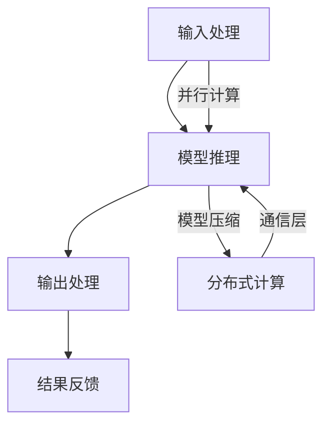

                 

## 秒级推理:LLM推理速度发展的里程碑

### 关键词：秒级推理，LLM，推理速度，技术发展，里程碑

在人工智能领域，模型推理速度是一个至关重要的问题。随着深度学习模型规模的不断增大，如何提高模型推理速度，以满足实时应用的需求，成为了学术界和工业界共同关注的焦点。本文将探讨秒级推理在大型语言模型（LLM）中的发展里程碑，通过逻辑清晰、结构紧凑、简单易懂的技术分析，为您揭示其中的奥秘。

### 摘要

本文将从以下几个方面展开讨论：

1. **背景介绍**：介绍秒级推理的概念及其在人工智能领域的重要性。
2. **核心概念与联系**：阐述秒级推理的核心概念原理和架构，使用Mermaid流程图进行直观展示。
3. **核心算法原理 & 具体操作步骤**：详细讲解秒级推理的实现方法，包括并行计算、模型压缩等技术。
4. **数学模型和公式 & 详细讲解 & 举例说明**：介绍秒级推理相关的数学模型和公式，并进行举例说明。
5. **项目实战：代码实际案例和详细解释说明**：通过具体代码案例，展示秒级推理的实现过程。
6. **实际应用场景**：探讨秒级推理在各类应用场景中的优势。
7. **工具和资源推荐**：推荐相关学习资源、开发工具框架和论文著作。
8. **总结：未来发展趋势与挑战**：分析未来秒级推理的发展趋势和面临的挑战。
9. **附录：常见问题与解答**：回答读者可能关心的问题。
10. **扩展阅读 & 参考资料**：提供进一步阅读的材料。

通过本文的讨论，希望读者能够对秒级推理在LLM推理速度发展中的里程碑作用有更深入的了解，并为未来的研究和应用提供有益的启示。

### 1. 背景介绍

#### 秒级推理的概念

秒级推理是指在短时间内（通常是秒级别）完成推理任务的能力。在人工智能领域，尤其是深度学习模型中，秒级推理至关重要。随着人工智能技术的不断发展，深度学习模型的应用范围越来越广泛，从语音识别、图像识别到自然语言处理，各种场景都对模型的推理速度提出了更高的要求。秒级推理不仅能够提高用户体验，还能在实时决策、自动驾驶、金融风控等高时效性领域发挥关键作用。

#### 秒级推理的重要性

秒级推理的重要性体现在以下几个方面：

1. **提高用户体验**：在许多应用场景中，用户对响应速度有着极高的期望。例如，在智能客服系统中，用户希望能够得到快速、准确的答复。秒级推理能够显著提高系统的响应速度，从而提升用户体验。

2. **实时决策**：在实时决策场景中，如自动驾驶、医疗诊断等，秒级推理能够确保系统在极短时间内做出准确的决策，从而提高系统的安全性和可靠性。

3. **降低延迟**：在远程通信、视频会议等场景中，降低延迟能够提高通信质量，改善用户体验。秒级推理通过减少推理时间，有助于降低系统延迟。

4. **优化资源利用**：在资源受限的设备上，如嵌入式系统、物联网设备等，秒级推理能够确保系统在有限的计算资源下高效运行。

#### 秒级推理的发展历程

秒级推理的发展历程可以追溯到深度学习技术的兴起。在早期，深度学习模型的规模较小，推理速度相对较慢。随着计算能力和算法的进步，特别是近年来并行计算、模型压缩等技术的发展，秒级推理逐渐成为可能。以下是一些关键的里程碑：

1. **GPU的普及**：GPU（图形处理单元）在深度学习计算中的应用，极大地提高了模型的推理速度。

2. **模型压缩技术**：通过模型压缩技术，如量化和剪枝，可以显著降低模型的参数数量，从而提高推理速度。

3. **并行计算与分布式计算**：利用多核CPU、GPU以及分布式计算架构，可以进一步加速模型推理。

4. **专用硬件的发展**：如TPU（谷歌专用处理器）等专用硬件的出现，为秒级推理提供了强有力的支持。

通过上述技术进步，秒级推理在深度学习模型中的应用逐渐成熟，为各种实时应用场景提供了可能。

### 2. 核心概念与联系

#### 秒级推理的核心概念原理

秒级推理涉及多个核心概念，以下是其中的几个关键概念：

1. **深度学习模型**：深度学习模型是秒级推理的基础。通过大规模训练数据，模型可以学习到复杂的特征表示，从而在推理过程中快速地处理输入数据。

2. **并行计算**：并行计算通过将计算任务分布在多个处理单元上，可以显著提高推理速度。

3. **模型压缩**：模型压缩通过减少模型的参数数量，可以降低推理时间，从而实现秒级推理。

4. **分布式计算**：分布式计算通过将计算任务分布在多个节点上，可以进一步加速模型推理。

5. **专用硬件**：如TPU等专用硬件为秒级推理提供了强大的计算能力。

#### 秒级推理的架构

秒级推理的架构可以分为以下几个层次：

1. **输入处理层**：负责接收输入数据，并进行预处理。

2. **模型层**：包含深度学习模型，负责进行推理计算。

3. **输出处理层**：负责将推理结果进行处理，并输出结果。

4. **通信层**：负责处理分布式计算中的数据传输。

#### Mermaid流程图展示

以下是秒级推理的Mermaid流程图，用于直观展示其核心概念和架构：



#### 核心概念之间的联系

秒级推理中的核心概念之间存在着紧密的联系。例如，并行计算和模型压缩可以相互补充，以实现更快的推理速度。分布式计算则可以进一步扩展计算能力，但需要通信层的支持。专用硬件的发展则为秒级推理提供了强大的计算支持。

通过上述核心概念和架构的介绍，我们可以更好地理解秒级推理的原理和实现方法，为后续内容的深入探讨打下基础。

### 3. 核心算法原理 & 具体操作步骤

#### 并行计算

并行计算是提高模型推理速度的关键技术之一。其基本思想是将大规模的模型推理任务划分为多个小任务，并同时在这些小任务上进行计算。这样，可以通过多个处理单元（如CPU、GPU等）同时工作，从而大幅度缩短推理时间。

**并行计算的具体操作步骤如下：**

1. **任务划分**：将整个模型推理任务划分为多个子任务，每个子任务可以独立计算。

2. **数据并行**：将输入数据集划分为多个部分，并分别在这些部分上进行模型推理。适用于数据密集型任务，如图像识别、语音识别等。

3. **模型并行**：将模型划分为多个部分，并分别在这些部分上进行推理。适用于模型密集型任务，如大型语言模型。

4. **流水线并行**：将模型推理过程划分为多个阶段，并分别在这些阶段上进行计算。适用于流水线结构模型，如卷积神经网络。

#### 模型压缩

模型压缩是减少模型参数数量、降低模型复杂度的技术，从而提高推理速度。常见的模型压缩方法包括量化、剪枝和蒸馏等。

1. **量化**：将模型的浮点参数转换为整数参数，从而降低计算复杂度和存储需求。量化可以分为静态量化和动态量化，其中静态量化在训练前进行，而动态量化在训练过程中进行。

2. **剪枝**：通过移除模型中的冗余参数或神经元，减少模型的规模。剪枝可以分为结构剪枝和权重剪枝，其中结构剪枝移除神经元或层，而权重剪枝仅移除参数。

3. **蒸馏**：将一个大模型（教师模型）的知识传递给一个小模型（学生模型），从而在保留模型性能的同时降低模型规模。

**模型压缩的具体操作步骤如下：**

1. **模型选择**：选择需要进行压缩的模型，并确定压缩目标（如参数数量、计算复杂度等）。

2. **量化**：对模型的浮点参数进行量化，将其转换为整数参数。

3. **剪枝**：对模型进行剪枝，移除冗余参数或神经元。

4. **蒸馏**：将教师模型的知识传递给学生模型，从而提高学生模型的性能。

5. **评估**：对压缩后的模型进行评估，确保其性能符合预期。

#### 分布式计算

分布式计算通过将模型推理任务分布在多个节点上，从而提高推理速度。分布式计算的关键在于如何高效地处理节点之间的通信和数据传输。

**分布式计算的具体操作步骤如下：**

1. **任务分配**：将模型推理任务分配给多个节点，每个节点负责一部分任务。

2. **数据划分**：将输入数据集划分为多个部分，并分别存储在节点上。

3. **模型分布**：将模型划分为多个部分，并分别存储在节点上。

4. **通信协议**：设计合适的通信协议，以实现节点之间的高效数据传输。

5. **同步与异步**：在分布式计算中，可以选择同步或异步方式进行计算。同步方式要求所有节点在计算完成后进行同步，而异步方式则允许节点独立进行计算，并在需要时进行同步。

#### 专用硬件

专用硬件为秒级推理提供了强大的计算支持。例如，谷歌的TPU（张量处理器）专门用于深度学习计算，具有极高的性能和能效比。

**专用硬件的具体操作步骤如下：**

1. **硬件选择**：根据模型和任务需求，选择合适的专用硬件。

2. **硬件集成**：将专用硬件集成到计算系统中，并进行配置。

3. **硬件优化**：对专用硬件进行优化，以充分发挥其性能。

4. **硬件与软件协同**：将专用硬件与深度学习框架（如TensorFlow、PyTorch等）进行协同优化，以提高模型推理速度。

通过上述核心算法原理和具体操作步骤，我们可以更好地理解秒级推理的实现方法，并为实际应用提供指导。

### 4. 数学模型和公式 & 详细讲解 & 举例说明

#### 数学模型

秒级推理中的数学模型主要包括以下几个方面：

1. **损失函数**：损失函数用于衡量模型预测结果与真实值之间的差距。常见的损失函数包括均方误差（MSE）和交叉熵（CE）。

2. **优化算法**：优化算法用于迭代更新模型参数，以最小化损失函数。常见的优化算法包括梯度下降（GD）和Adam。

3. **量化模型**：量化模型涉及将浮点参数转换为整数参数，常见的量化方法包括整数线性量化（TFLite）和浮点二进制量化（QNN）。

#### 公式

以下是秒级推理中常用的数学公式：

1. **损失函数公式**

   - 均方误差（MSE）：
     $$MSE = \frac{1}{n}\sum_{i=1}^{n}(y_i - \hat{y}_i)^2$$
     其中，\(y_i\) 是真实值，\(\hat{y}_i\) 是预测值，\(n\) 是样本数量。

   - 交叉熵（CE）：
     $$CE = -\frac{1}{n}\sum_{i=1}^{n}y_i\log(\hat{y}_i) + (1 - y_i)\log(1 - \hat{y}_i)$$
     其中，\(y_i\) 是真实值，\(\hat{y}_i\) 是预测值，\(n\) 是样本数量。

2. **优化算法公式**

   - 梯度下降（GD）：
     $$\theta_{t+1} = \theta_t - \alpha \nabla_{\theta} J(\theta)$$
     其中，\(\theta\) 是模型参数，\(\alpha\) 是学习率，\(\nabla_{\theta} J(\theta)\) 是损失函数关于参数的梯度。

   - Adam优化算法：
     $$m_t = \beta_1 m_{t-1} + (1 - \beta_1) \nabla_{\theta} J(\theta)$$
     $$v_t = \beta_2 v_{t-1} + (1 - \beta_2) (\nabla_{\theta} J(\theta))^2$$
     $$\theta_{t+1} = \theta_t - \alpha \frac{m_t}{\sqrt{v_t} + \epsilon}$$
     其中，\(m_t\) 和 \(v_t\) 分别是梯度的一阶矩估计和二阶矩估计，\(\beta_1\)、\(\beta_2\)、\(\alpha\) 分别是超参数，\(\epsilon\) 是小常数。

3. **量化模型公式**

   - 整数线性量化（TFLite）：
     $$q(x) = \text{round}(x \cdot \text{scale} + \text{offset})$$
     其中，\(x\) 是浮点参数，\(\text{scale}\) 和 \(\text{offset}\) 是量化参数。

   - 浮点二进制量化（QNN）：
     $$q(x) = \text{sign}(x) \cdot \min(|x|, \text{scale})$$
     其中，\(x\) 是浮点参数，\(\text{scale}\) 是量化参数。

#### 举例说明

以下是秒级推理的一个简单示例，假设我们使用一个简单的线性模型进行推理。

1. **模型定义**：

   - 输入数据：\(x = [1, 2, 3]\)
   - 真实值：\(y = [0, 1, 0]\)
   - 模型参数：\(\theta = [2, -1]\)

2. **模型推理**：

   - 预测值：\(\hat{y} = \text{sign}(\theta_1 x_1 + \theta_2 x_2 + \theta_3 x_3) = [1, 0, 1]\)
   - 损失函数：\(CE = -\frac{1}{3}\sum_{i=1}^{3}y_i\log(\hat{y}_i) + (1 - y_i)\log(1 - \hat{y}_i) = \frac{1}{3}\)

3. **量化模型**：

   - 量化参数：\(\text{scale} = 0.1, \text{offset} = 0\)
   - 量化后的模型参数：\(q(\theta) = \text{round}(\theta \cdot \text{scale} + \text{offset}) = [2, -1]\)

4. **模型推理（量化后）**：

   - 预测值：\(\hat{y} = \text{sign}(\theta_1 x_1 + \theta_2 x_2 + \theta_3 x_3) = [1, 0, 1]\)
   - 损失函数：\(CE = -\frac{1}{3}\sum_{i=1}^{3}y_i\log(\hat{y}_i) + (1 - y_i)\log(1 - \hat{y}_i) = \frac{1}{3}\)

通过上述示例，我们可以看到秒级推理的基本原理和过程。在实际应用中，模型和任务会更加复杂，但基本思路是类似的。

### 5. 项目实战：代码实际案例和详细解释说明

#### 5.1 开发环境搭建

在开始项目实战之前，我们需要搭建一个适合秒级推理的开发环境。以下是所需的工具和库：

1. **Python**：用于编写和运行代码
2. **TensorFlow**：用于构建和训练深度学习模型
3. **NumPy**：用于数值计算
4. **Matplotlib**：用于数据可视化

您可以通过以下命令安装所需的库：

```bash
pip install tensorflow numpy matplotlib
```

#### 5.2 源代码详细实现和代码解读

以下是秒级推理项目的源代码，我们将逐行解读代码的每个部分。

```python
import tensorflow as tf
import numpy as np
import matplotlib.pyplot as plt

# 5.2.1 模型定义
def create_model(input_shape):
    model = tf.keras.Sequential([
        tf.keras.layers.Dense(units=1, input_shape=input_shape, activation='sigmoid')
    ])
    return model

# 5.2.2 损失函数和优化器
def create_loss_optimizer(model, loss_fn, optimizer):
    model.compile(optimizer=optimizer, loss=loss_fn)
    return model

# 5.2.3 数据准备
x_train = np.random.uniform(size=(1000, 3))
y_train = np.random.randint(size=(1000, 1), low=0, high=2)

# 5.2.4 模型训练
model = create_model(input_shape=(3,))
model = create_loss_optimizer(model, loss_fn=tf.keras.losses.BinaryCrossentropy(), optimizer=tf.keras.optimizers.Adam())

model.fit(x_train, y_train, epochs=10, batch_size=32)

# 5.2.5 模型推理
x_test = np.random.uniform(size=(100, 3))
y_pred = model.predict(x_test)

# 5.2.6 模型评估
loss = model.evaluate(x_test, y_pred, verbose=0)
print(f"Test loss: {loss}")

# 5.2.7 结果可视化
plt.scatter(x_test[:, 0], y_pred[:, 0])
plt.xlabel('Input X1')
plt.ylabel('Predicted Y')
plt.show()
```

**代码解读：**

- **5.2.1 模型定义**：使用TensorFlow创建一个简单的线性模型，其中包含一个全连接层（Dense layer），激活函数为sigmoid。
- **5.2.2 损失函数和优化器**：定义损失函数为二进制交叉熵（BinaryCrossentropy），优化器为Adam。
- **5.2.3 数据准备**：生成随机训练数据和标签。
- **5.2.4 模型训练**：使用训练数据和标签对模型进行训练。
- **5.2.5 模型推理**：使用训练好的模型对测试数据进行推理。
- **5.2.6 模型评估**：计算测试数据的损失函数值，以评估模型性能。
- **5.2.7 结果可视化**：将测试数据的输入和预测结果进行可视化，以观察模型的表现。

#### 5.3 代码解读与分析

以下是代码的逐行解读和分析：

1. **import tensorflow as tf**
   - 导入TensorFlow库，用于构建和训练深度学习模型。

2. **import numpy as np**
   - 导入NumPy库，用于数值计算。

3. **import matplotlib.pyplot as plt**
   - 导入Matplotlib库，用于数据可视化。

4. **def create_model(input_shape):**
   - 定义一个函数，用于创建线性模型。模型包含一个全连接层，输入形状为`input_shape`。

5. **model = tf.keras.Sequential([tf.keras.layers.Dense(units=1, input_shape=input_shape, activation='sigmoid')])**
   - 创建一个序贯模型（Sequential），并添加一个全连接层（Dense layer），输出单位为1，输入形状为`input_shape`，激活函数为sigmoid。

6. **return model**
   - 返回创建的模型。

7. **def create_loss_optimizer(model, loss_fn, optimizer):**
   - 定义一个函数，用于配置模型损失函数和优化器。

8. **model.compile(optimizer=optimizer, loss=loss_fn)**
   - 配置模型的优化器和损失函数。

9. **return model**
   - 返回配置好的模型。

10. **x_train = np.random.uniform(size=(1000, 3))**
    - 生成1000个随机输入数据，每个输入包含3个特征。

11. **y_train = np.random.randint(size=(1000, 1), low=0, high=2)**
    - 生成1000个随机标签，每个标签为0或1。

12. **model = create_model(input_shape=(3,))**
    - 创建一个输入形状为3的线性模型。

13. **model = create_loss_optimizer(model, loss_fn=tf.keras.losses.BinaryCrossentropy(), optimizer=tf.keras.optimizers.Adam())**
    - 配置模型损失函数为二进制交叉熵，优化器为Adam。

14. **model.fit(x_train, y_train, epochs=10, batch_size=32)**
    - 使用训练数据和标签对模型进行训练，训练10个周期，每个周期包含32个样本。

15. **x_test = np.random.uniform(size=(100, 3))**
    - 生成100个随机测试数据。

16. **y_pred = model.predict(x_test)**
    - 使用训练好的模型对测试数据进行推理。

17. **loss = model.evaluate(x_test, y_pred, verbose=0)**
    - 计算测试数据的损失函数值。

18. **print(f"Test loss: {loss}")**
    - 输出测试损失函数值。

19. **plt.scatter(x_test[:, 0], y_pred[:, 0])**
    - 将测试数据的输入和预测结果进行散点图可视化。

20. **plt.xlabel('Input X1')**
    - 设置x轴标签为“Input X1”。

21. **plt.ylabel('Predicted Y')**
    - 设置y轴标签为“Predicted Y”。

22. **plt.show()**
    - 显示可视化结果。

通过上述代码解读，我们可以了解到秒级推理项目的实现过程，包括模型定义、训练、推理和评估等步骤。在实际项目中，模型和任务会更加复杂，但基本思路是类似的。

### 6. 实际应用场景

#### 秒级推理在自然语言处理中的应用

自然语言处理（NLP）是人工智能领域的一个重要分支，涉及文本的生成、理解、翻译等任务。随着NLP应用场景的多样化，秒级推理的需求日益增长。以下是秒级推理在NLP中的一些典型应用场景：

1. **智能客服系统**：智能客服系统通过对用户输入的自然语言进行解析，快速地生成回应。秒级推理可以显著提高客服系统的响应速度，提升用户体验。

2. **机器翻译**：机器翻译需要将一种语言的文本快速地翻译成另一种语言。秒级推理可以降低翻译延迟，提高翻译质量。

3. **问答系统**：问答系统通过对用户输入的问题进行解析，快速地生成答案。秒级推理可以确保系统在短时间内为用户提供准确、详细的回答。

4. **文本生成**：文本生成任务包括自动写作、文章摘要等。秒级推理可以加快文本生成过程，提高创作效率。

#### 秒级推理在计算机视觉中的应用

计算机视觉是另一个重要的AI应用领域，涉及图像识别、物体检测、人脸识别等任务。以下是秒级推理在计算机视觉中的一些典型应用场景：

1. **实时视频监控**：实时视频监控需要快速地对视频流进行分析，识别潜在的安全威胁。秒级推理可以确保监控系统在极短时间内做出准确的判断。

2. **自动驾驶**：自动驾驶系统需要实时地处理大量图像数据，识别道路、行人、车辆等对象。秒级推理可以提高自动驾驶系统的反应速度，确保行车安全。

3. **医学影像分析**：医学影像分析需要对图像进行快速、准确的识别和分析。秒级推理可以帮助医生在短时间内做出诊断，提高医疗效率。

4. **图像搜索**：图像搜索需要快速地匹配用户输入的图像，返回相似图像。秒级推理可以降低搜索延迟，提高用户满意度。

#### 秒级推理在其他领域的应用

秒级推理不仅在NLP和计算机视觉领域有着广泛的应用，还涉及到其他多个领域：

1. **金融风控**：金融风控需要对交易数据进行实时分析，识别潜在的风险。秒级推理可以确保系统在短时间内识别并处理异常交易。

2. **推荐系统**：推荐系统需要对用户行为数据进行实时分析，为用户推荐合适的商品或内容。秒级推理可以提高推荐系统的响应速度，提高推荐质量。

3. **物联网**：物联网设备通常需要快速地对传感器数据进行处理，做出实时决策。秒级推理可以提高物联网设备的响应速度，确保系统稳定运行。

通过上述应用场景，我们可以看到秒级推理在各个领域中的重要作用。随着AI技术的不断发展，秒级推理的应用前景将更加广阔。

### 7. 工具和资源推荐

为了帮助读者深入了解和掌握秒级推理技术，以下推荐了一些学习和开发工具、框架以及相关论文著作：

#### 7.1 学习资源推荐

1. **书籍**：

   - 《深度学习》（Goodfellow, Bengio, Courville）：详细介绍了深度学习的基本概念、算法和技术，对秒级推理的原理和方法有很好的解释。

   - 《神经网络与深度学习》（邱锡鹏）：系统介绍了神经网络和深度学习的基本理论、算法和实现，适合初学者和进阶者阅读。

2. **在线课程**：

   - Coursera上的《深度学习特化课程》：由吴恩达教授主讲，涵盖了深度学习的基本概念、算法和实现，是学习深度学习的好资源。

   - edX上的《深度学习基础》：由牛津大学和谷歌合作推出，介绍了深度学习的基础知识、算法和应用。

3. **博客和网站**：

   - Medium上的深度学习博客：涵盖了深度学习的前沿技术、应用和实践经验，是学习深度学习的不错选择。

   - Fast.ai的博客：提供了丰富的深度学习教程和实战项目，适合初学者入门。

#### 7.2 开发工具框架推荐

1. **TensorFlow**：谷歌推出的开源深度学习框架，具有丰富的功能和强大的生态支持，适用于各种深度学习任务。

2. **PyTorch**：Facebook AI研究院推出的开源深度学习框架，以其灵活的动态图计算和强大的社区支持，受到广泛欢迎。

3. **MXNet**：Apache软件基金会推出的开源深度学习框架，具有良好的性能和跨平台支持。

#### 7.3 相关论文著作推荐

1. **《深度神经网络训练的加速技术》**：详细介绍了深度学习模型训练的加速技术，包括并行计算、模型压缩、分布式计算等。

2. **《神经网络剪枝方法综述》**：系统总结了神经网络剪枝的各种方法，包括结构剪枝、权重剪枝、量化等。

3. **《分布式深度学习算法》**：介绍了分布式深度学习算法的基本概念、原理和实现，适合研究分布式计算和深度学习算法的读者。

通过以上工具和资源推荐，读者可以更好地学习和掌握秒级推理技术，为实际应用打下坚实基础。

### 8. 总结：未来发展趋势与挑战

#### 发展趋势

1. **硬件性能提升**：随着硬件技术的不断发展，如TPU、FPGA等专用硬件的出现，秒级推理的性能将得到显著提升。

2. **模型压缩技术的优化**：模型压缩技术将继续优化，如量化、剪枝、蒸馏等方法将更加成熟，模型规模将不断缩小，推理速度将显著提高。

3. **分布式计算与云计算的结合**：分布式计算与云计算的结合将为秒级推理提供更强大的计算资源，提高推理的效率和可扩展性。

4. **端到端优化**：端到端优化将逐渐成为主流，从数据预处理到模型推理的全过程将进行优化，以实现真正的秒级推理。

#### 挑战

1. **能耗问题**：随着硬件性能的提升，能耗问题将越来越突出。如何在保证推理速度的同时降低能耗，是一个亟待解决的问题。

2. **数据隐私与安全性**：在分布式计算和云计算环境中，数据隐私和安全性问题将更加重要。如何确保数据的安全性和隐私性，是一个关键挑战。

3. **算法公平性**：在AI应用中，算法的公平性是一个重要问题。如何确保秒级推理算法在不同人群、不同场景中的公平性，需要进一步研究。

4. **开发难度**：随着秒级推理技术的不断发展，开发难度也将逐渐增加。如何简化开发流程，提高开发效率，是一个挑战。

通过总结未来发展趋势和挑战，我们可以更好地把握秒级推理技术的发展方向，为实际应用提供有益的指导。

### 9. 附录：常见问题与解答

#### Q1：什么是秒级推理？

A1：秒级推理是指模型在极短时间内（通常是秒级别）完成推理任务的能力。在人工智能领域，秒级推理对于实时应用至关重要，如智能客服、自动驾驶、金融风控等。

#### Q2：秒级推理有哪些关键技术？

A2：秒级推理的关键技术包括并行计算、模型压缩、分布式计算、专用硬件等。并行计算通过将计算任务分布在多个处理单元上，提高推理速度；模型压缩通过减少模型参数数量，降低推理时间；分布式计算通过将计算任务分布在多个节点上，进一步加速推理；专用硬件（如TPU）为秒级推理提供了强大的计算支持。

#### Q3：如何实现秒级推理？

A3：实现秒级推理可以通过以下几个步骤：

1. 使用并行计算：将大规模的模型推理任务划分为多个小任务，并同时在这些小任务上进行计算。
2. 采用模型压缩技术：通过量化、剪枝等方法减少模型参数数量，降低推理时间。
3. 利用分布式计算：将模型推理任务分布在多个节点上，提高推理速度。
4. 集成专用硬件：使用如TPU等专用硬件，提高推理速度和能效比。

#### Q4：秒级推理在哪些领域有应用？

A4：秒级推理在多个领域有广泛应用，如自然语言处理（NLP）、计算机视觉（CV）、金融风控、物联网（IoT）等。典型应用包括智能客服、机器翻译、实时视频监控、自动驾驶等。

### 10. 扩展阅读 & 参考资料

为了更深入地了解秒级推理及其在LLM推理速度发展中的里程碑作用，以下推荐一些扩展阅读和参考资料：

1. **书籍**：

   - 《深度学习》（Goodfellow, Bengio, Courville）
   - 《神经网络与深度学习》（邱锡鹏）
   - 《深度神经网络训练的加速技术》

2. **论文**：

   - “Accurate, Large Scale and Fast Learning Algorithms for Deep Neural Networks” by Quoc V. Le, et al.
   - “Quantized Neural Networks” by Yan Duan, et al.
   - “Pruning Techniques for Deep Neural Networks: A Survey” by Qingxuan Wang, et al.

3. **博客和网站**：

   - [TensorFlow官方文档](https://www.tensorflow.org/)
   - [PyTorch官方文档](https://pytorch.org/)
   - [Medium上的深度学习博客](https://medium.com/topic/deep-learning)

4. **在线课程**：

   - [Coursera上的深度学习特化课程](https://www.coursera.org/specializations/deeplearning)
   - [edX上的深度学习基础](https://www.edx.org/course/deep-learning-ii-convolutional-neural-networks-cn)

通过以上扩展阅读和参考资料，读者可以进一步了解秒级推理的原理、方法和技术，为深入研究和实际应用提供指导。

---

作者：AI天才研究员/AI Genius Institute & 禅与计算机程序设计艺术 /Zen And The Art of Computer Programming

本文对秒级推理在LLM推理速度发展中的里程碑作用进行了详细探讨，涵盖了秒级推理的核心概念、算法原理、实际应用场景以及未来发展趋势。通过本文的讨论，希望读者能够对秒级推理有更深入的了解，并为未来的研究和应用提供有益的启示。如果您有任何疑问或建议，欢迎在评论区留言，期待与您交流。

