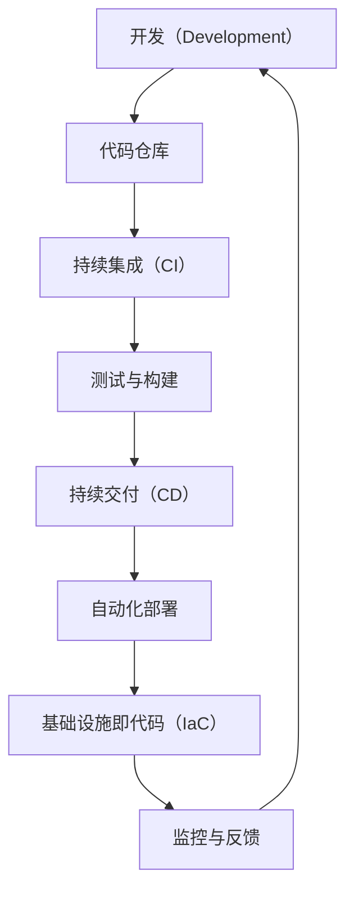

                 

### 文章标题

《程序员创业公司的DevOps文化建设与实践》

### 关键词

DevOps，程序员，创业公司，文化建设，实践，敏捷开发，持续集成，持续部署

### 摘要

本文旨在探讨程序员创业公司中DevOps文化的建设与实践。通过深入分析DevOps的核心概念、原则和实践，结合实际案例，本文将帮助创业公司理解并构建起高效的DevOps文化，以实现持续交付、提高软件质量和团队协作效率。文章还将推荐相关学习资源和开发工具，为创业者提供实用的指导和建议。

### 1. 背景介绍

#### DevOps的概念与起源

DevOps是一种软件开发与运维融合的新方法，旨在通过加强开发和运维团队之间的协作，实现软件开发的持续迭代和快速交付。DevOps的核心理念是“左移运维”，即将运维工作尽早引入到软件开发流程中，以减少错误和改进系统稳定性。

DevOps起源于2000年代的软件开发领域，最早由Patrick Debois在2009年提出。他倡导开发（Development）和运维（Operations）团队的合作，以解决软件开发过程中常遇到的部署、测试和运维等问题。随后，DevOps逐渐受到业界广泛关注，并形成了完整的方法论和工具集。

#### DevOps的核心概念

DevOps的核心概念包括以下几个方面：

1. **持续集成（CI）**：通过自动化工具将代码变更频繁地集成到一个共同的代码库中，并进行自动化的测试和构建，以快速发现和修复问题。
2. **持续交付（CD）**：在确保软件质量的前提下，通过自动化工具实现软件的持续部署和发布，以实现快速响应市场需求和客户反馈。
3. **基础设施即代码（IaC）**：使用代码管理基础设施的配置和部署，确保基础设施的配置一致性、可重复性和可扩展性。
4. **微服务架构**：将应用程序拆分为多个小型、独立的服务，以提高系统的灵活性和可维护性。
5. **自动化**：通过自动化工具实现软件开发、测试、部署和监控等过程的自动化，减少人工干预，提高效率和稳定性。

#### DevOps与传统开发运维模式的区别

相比传统的开发运维模式，DevOps更注重团队协作和自动化。在传统模式中，开发和运维团队往往是分离的，导致沟通不畅、协作困难，软件交付周期较长。而DevOps通过强调团队合作、自动化工具和流程优化，实现了以下改进：

1. **缩短交付周期**：通过持续集成和持续交付，将软件交付周期缩短至数小时甚至数分钟，提高市场响应速度。
2. **提高软件质量**：通过自动化测试和持续监控，及时发现和修复问题，提高软件质量和稳定性。
3. **减少错误和故障**：通过基础设施即代码和自动化部署，减少人为错误和部署故障，提高系统稳定性。
4. **提高团队协作效率**：通过共享代码库、自动化工具和协作平台，促进团队间的沟通和协作，提高开发效率。

### 2. 核心概念与联系

#### DevOps核心概念流程图

以下是一个简单的Mermaid流程图，展示了DevOps的核心概念和流程：



#### 核心概念联系解析

- **开发（Development）**：开发团队负责编写、测试和提交代码。
- **代码仓库**：代码仓库是存储和管理代码变更的中心化或去中心化存储系统，如Git。
- **持续集成（CI）**：CI工具（如Jenkins、GitLab CI）自动执行构建和测试，确保代码变更不会破坏现有功能。
- **测试与构建**：测试包括单元测试、集成测试和性能测试，构建是将代码编译和打包成可执行文件的过程。
- **持续交付（CD）**：CD工具（如Docker、Kubernetes）自动部署和发布软件，确保新功能可以快速、安全地交付给用户。
- **自动化部署**：自动化部署工具（如Ansible、Puppet）根据配置文件将应用程序部署到生产环境中。
- **基础设施即代码（IaC）**：IaC工具（如Terraform、Ansible）使用代码管理基础设施配置，确保配置的一致性。
- **监控与反馈**：监控系统（如Prometheus、Grafana）实时收集和分析系统运行数据，提供故障告警和性能分析。

通过以上流程，开发、测试、部署和运维等环节紧密衔接，形成了一个高效、自动化的DevOps流程。

### 3. 核心算法原理 & 具体操作步骤

#### 持续集成（CI）算法原理

持续集成是一种软件开发实践，通过自动化工具将频繁的代码变更集成到一个共同的代码库中，并进行自动化的测试和构建，以快速发现和修复问题。

核心算法原理如下：

1. **代码仓库**：所有开发人员提交的代码都会存储在代码仓库中，如Git。
2. **触发器**：当开发人员提交代码变更时，CI工具会自动触发构建和测试流程。
3. **构建**：CI工具使用构建工具（如Maven、Gradle）将代码编译和打包成可执行文件。
4. **测试**：CI工具自动执行一系列测试，包括单元测试、集成测试和性能测试。
5. **报告**：测试结果会生成详细的报告，包括通过和失败的测试案例。

具体操作步骤：

1. **设置代码仓库**：将代码仓库初始化，并添加CI工具的配置文件（如Jenkinsfile）。
2. **配置触发器**：设置触发规则，如每次提交或合并请求时触发CI流程。
3. **编写测试用例**：开发人员编写单元测试、集成测试和性能测试用例。
4. **配置构建和部署**：设置构建脚本和部署脚本，确保构建和部署流程自动化。

#### 持续交付（CD）算法原理

持续交付是一种软件开发实践，通过自动化工具实现软件的持续部署和发布，以实现快速响应市场需求和客户反馈。

核心算法原理如下：

1. **容器化**：使用容器技术（如Docker）将应用程序及其依赖打包成一个独立的容器镜像。
2. **自动化部署**：使用自动化部署工具（如Kubernetes、Ansible）根据配置文件将容器镜像部署到生产环境中。
3. **监控与反馈**：监控系统（如Prometheus、Grafana）实时收集和分析系统运行数据，提供故障告警和性能分析。

具体操作步骤：

1. **编写Dockerfile**：根据应用程序的需求，编写Dockerfile来构建容器镜像。
2. **配置Kubernetes集群**：配置Kubernetes集群，确保容器镜像可以成功部署。
3. **编写部署脚本**：编写部署脚本，用于自动化部署容器镜像到Kubernetes集群。
4. **监控与反馈**：配置监控系统，实时收集和分析系统运行数据，提供故障告警和性能分析。

#### 基础设施即代码（IaC）算法原理

基础设施即代码是一种通过代码管理基础设施配置的方法，确保基础设施的配置一致性、可重复性和可扩展性。

核心算法原理如下：

1. **编写IaC脚本**：使用IaC工具（如Terraform、Ansible）编写脚本，定义基础设施的配置。
2. **部署基础设施**：执行IaC脚本，将定义的基础设施配置应用到实际环境中。
3. **版本控制**：使用版本控制工具（如Git）管理IaC脚本和配置文件，确保配置的一致性和可追踪性。

具体操作步骤：

1. **选择IaC工具**：选择适合自己项目的IaC工具，如Terraform或Ansible。
2. **编写IaC脚本**：根据需求编写IaC脚本，定义所需的基础设施配置。
3. **初始化IaC工具**：初始化IaC工具，配置版本控制和基础设施提供商。
4. **执行IaC脚本**：执行IaC脚本，部署所需的基础设施。
5. **版本管理和回滚**：使用版本控制工具管理IaC脚本和配置文件，确保配置的一致性和可回滚性。

### 4. 数学模型和公式 & 详细讲解 & 举例说明

#### 持续集成（CI）的数学模型

持续集成（CI）的核心在于通过数学模型衡量代码库的健康程度，以下是一个简单的数学模型：

$$
CI\_Score = \frac{Total\_Test\_Passes}{Total\_Tests}
$$

其中，CI_Score代表持续集成分数，Total_Test_Passes代表通过的测试数量，Total_Tests代表总测试数量。

#### 持续交付（CD）的数学模型

持续交付（CD）的核心在于通过数学模型衡量软件交付的稳定性和速度，以下是一个简单的数学模型：

$$
CD\_Score = \frac{Total\_Deployments - Total\_Failed\_Deployments}{Total\_Deployments}
$$

其中，CD_Score代表持续交付分数，Total_Deployments代表总交付次数，Total_Failed_Deployments代表失败的交付次数。

#### 基础设施即代码（IaC）的数学模型

基础设施即代码（IaC）的核心在于通过数学模型衡量基础设施配置的一致性和可扩展性，以下是一个简单的数学模型：

$$
IaC\_Score = \frac{Total\_Config\_Matches}{Total\_Configurations}
$$

其中，IaC_Score代表基础设施即代码分数，Total_Config_Matches代表匹配的配置数量，Total_Configurations代表总的配置数量。

#### 举例说明

假设一个项目有100次测试，其中通过了70次，那么持续集成分数为：

$$
CI\_Score = \frac{70}{100} = 0.7
$$

假设一个项目有10次交付，其中成功了8次，那么持续交付分数为：

$$
CD\_Score = \frac{8}{10} = 0.8
$$

假设一个项目有10个配置文件，其中8个匹配，那么基础设施即代码分数为：

$$
IaC\_Score = \frac{8}{10} = 0.8
$$

这些分数可以用来衡量项目的健康程度和改进方向。

### 5. 项目实战：代码实际案例和详细解释说明

#### 开发环境搭建

在本节中，我们将以一个简单的Web应用程序为例，介绍如何在程序员创业公司中搭建开发环境，实现持续集成和持续交付。

#### 5.1 开发环境搭建

首先，我们需要搭建一个开发环境，以便开发人员可以编写、测试和提交代码。以下是一个基本的开发环境搭建步骤：

1. **安装Git**：Git是一个分布式版本控制系统，用于管理代码仓库。在所有开发人员的工作站上安装Git。
2. **初始化代码仓库**：在代码仓库中创建一个新项目，并初始化Git仓库。
3. **配置CI工具**：配置CI工具（如Jenkins、GitLab CI）以自动触发构建和测试流程。

以下是Jenkins的配置示例：

```bash
# 安装Jenkins
sudo apt-get install jenkins

# 启动Jenkins服务
sudo systemctl start jenkins

# 访问Jenkins Web界面，根据提示完成初始配置
```

#### 5.2 源代码详细实现和代码解读

接下来，我们来实现一个简单的Web应用程序，并详细介绍代码实现和解读。

**5.2.1 代码实现**

以下是一个简单的Web应用程序的代码实现：

```python
# app.py

from flask import Flask, jsonify

app = Flask(__name__)

@app.route('/api/hello', methods=['GET'])
def hello():
    return jsonify({'message': 'Hello, World!'})

if __name__ == '__main__':
    app.run()
```

**代码解读**：

1. **导入Flask模块**：Flask是一个流行的Python Web框架，用于构建Web应用程序。
2. **创建Flask应用实例**：创建一个Flask应用实例，用于处理HTTP请求。
3. **定义路由**：定义一个路由`/api/hello`，用于响应GET请求，并返回一个JSON格式的响应。
4. **运行应用**：在`__name__ == '__main__'`条件下运行应用，使应用监听HTTP请求。

**5.2.2 测试用例**

为了确保代码的正确性，我们需要编写测试用例。以下是一个简单的测试用例：

```python
# test_app.py

import unittest
from app import app

class TestApp(unittest.TestCase):
    def test_hello(self):
        tester = app.test_client(self)
        response = tester.get('/api/hello')
        self.assertEqual(response.status_code, 200)
        self.assertIn(b'Hello, World!', response.data)

if __name__ == '__main__':
    unittest.main()
```

**代码解读**：

1. **导入unittest模块**：unittest是Python的标准测试库，用于编写测试用例。
2. **定义测试类**：创建一个测试类`TestApp`，继承自`unittest.TestCase`。
3. **定义测试方法**：定义一个测试方法`test_hello`，用于测试`/api/hello`路由的正确性。
4. **运行测试**：在`__name__ == '__main__'`条件下运行测试用例。

**5.2.3 测试与构建**

使用Jenkins配置持续集成（CI）流程，将测试用例集成到构建过程中。以下是Jenkinsfile的配置示例：

```groovy
pipeline {
    agent any
    environment {
        JAR_FILE = 'app.jar'
    }
    stages {
        stage('Test') {
            steps {
                sh 'python -m unittest test_app.py'
            }
        }
        stage('Build') {
            steps {
                sh 'python -m http.server'
                sh 'curl -o ${JAR_FILE} http://localhost:8000/app.py'
            }
        }
        stage('Deploy') {
            steps {
                sh 'kubectl apply -f deployment.yaml'
            }
        }
    }
    post {
        success {
            echo 'CI passed'
        }
        failure {
            echo 'CI failed'
        }
    }
}
```

**代码解读**：

1. **配置环境变量**：定义JAR_FILE环境变量，用于存储构建生成的应用程序文件。
2. **定义构建流程**：定义三个阶段：Test、Build和Deploy。
3. **测试阶段**：执行测试用例，检查代码的正确性。
4. **构建阶段**：将应用程序打包成JAR文件，并启动本地Web服务器。
5. **部署阶段**：使用Kubernetes部署应用程序。

#### 5.3 代码解读与分析

通过以上代码实现和测试，我们可以看到持续集成（CI）和持续交付（CD）的基本流程：

1. **代码仓库**：开发人员将代码提交到代码仓库，Jenkins会自动触发构建和测试流程。
2. **测试**：测试用例会检查应用程序的正确性，确保代码质量。
3. **构建**：应用程序会被打包成JAR文件，并启动本地Web服务器。
4. **部署**：应用程序会部署到Kubernetes集群，以供用户访问。

通过这个简单的案例，我们可以看到DevOps文化的实际应用，如何通过持续集成和持续交付提高软件质量和开发效率。

### 6. 实际应用场景

#### 创业公司中的DevOps实践

DevOps在程序员创业公司中的应用场景非常广泛，以下是一些常见的实际应用场景：

1. **敏捷开发**：DevOps强调快速迭代和快速交付，有助于创业公司快速响应市场需求和客户反馈，提高市场竞争力。
2. **持续集成**：通过持续集成，创业公司可以及时发现和修复代码中的错误，确保软件质量。
3. **持续交付**：通过持续交付，创业公司可以实现快速发布新功能，缩短产品上市时间。
4. **自动化测试**：自动化测试可以节省人力和时间成本，提高测试效率，确保软件质量。
5. **基础设施即代码**：通过基础设施即代码，创业公司可以确保基础设施配置的一致性和可重复性，提高运维效率。
6. **团队协作**：DevOps强调团队协作和沟通，有助于创业公司提高团队协作效率，降低沟通成本。

#### 不同行业中的DevOps应用案例

DevOps在不同行业中的应用案例各异，以下是一些行业案例：

1. **金融行业**：金融公司通过DevOps实现快速响应市场变化，提高交易系统的稳定性和安全性。
2. **电子商务行业**：电子商务公司通过DevOps实现快速发布新功能，提高用户体验和销售额。
3. **医疗行业**：医疗行业通过DevOps提高医疗信息系统的可靠性和安全性，确保患者数据的准确性和安全性。
4. **游戏行业**：游戏公司通过DevOps实现快速发布游戏更新和补丁，提高用户满意度和留存率。

### 7. 工具和资源推荐

#### 学习资源推荐

1. **书籍**：
   - 《DevOps实践指南》（作者：约翰·阿梅斯和杰夫·萨瑟兰）
   - 《持续交付》（作者：Jez Humble和David Farley）
   - 《基础设施即代码：实践指南》（作者：Kief Morris）
2. **论文**：
   - 《左移运维：DevOps实践与原则》（作者：Patrick Debois）
   - 《持续交付：从代码到云的自动化部署》（作者：Jez Humble和David Farley）
   - 《基础设施即代码：构建自动化基础设施》（作者：Kief Morris）
3. **博客**：
   - 《DevOps博客》（作者：Netflix技术团队）
   - 《谷歌云DevOps博客》（作者：谷歌云团队）
   - 《亚马逊AWS DevOps博客》（作者：亚马逊AWS团队）
4. **网站**：
   - DevOps.com（提供DevOps新闻、资源和社区）
   - DevOps Institute（提供DevOps培训和认证）
   - Cloud Native Computing Foundation（提供云原生技术和资源）

#### 开发工具框架推荐

1. **持续集成工具**：
   - Jenkins（开源）
   - GitLab CI/CD（开源）
   - CircleCI（付费）
   - GitHub Actions（开源）
2. **容器化工具**：
   - Docker（开源）
   - Kubernetes（开源）
   - Podman（开源）
3. **自动化部署工具**：
   - Ansible（开源）
   - Terraform（开源）
   - SaltStack（开源）
   - Puppet（开源）
4. **监控工具**：
   - Prometheus（开源）
   - Grafana（开源）
   - Datadog（付费）
   - New Relic（付费）

#### 相关论文著作推荐

1. **《DevOps与云计算：实现持续交付和自动化运维》（作者：马特·奥查德和克里斯·多伊尔）》
2. **《DevOps实践指南：持续交付、基础设施自动化和云服务》（作者：约翰·阿梅斯和杰夫·萨瑟兰）》
3. **《持续交付：从代码到云的自动化部署》（作者：Jez Humble和David Farley）》

### 8. 总结：未来发展趋势与挑战

#### 未来发展趋势

1. **云计算的普及**：随着云计算技术的不断发展，越来越多的创业公司将采用云基础设施，实现更高效、更灵活的DevOps实践。
2. **容器化与微服务**：容器化和微服务架构将越来越普及，以实现更高效、更可扩展的软件交付。
3. **人工智能与机器学习**：人工智能和机器学习技术将在DevOps领域发挥重要作用，实现自动化测试、故障预测和优化。
4. **跨学科合作**：DevOps将涉及更多领域的知识，如软件开发、运维、安全、数据科学等，实现跨学科合作，提高整体效率。

#### 未来挑战

1. **团队协作**：在快速迭代的开发过程中，如何保证团队之间的协作和沟通，是DevOps实践面临的一大挑战。
2. **安全性**：随着DevOps实践的深入，如何确保软件和基础设施的安全性，是创业公司需要关注的重要问题。
3. **技能培训**：DevOps涉及到多种技术和工具，如何为团队成员提供有效的技能培训，是创业公司需要解决的一个难题。

### 9. 附录：常见问题与解答

#### 问题1：什么是DevOps？

DevOps是一种软件开发与运维融合的新方法，旨在通过加强开发和运维团队之间的协作，实现软件开发的持续迭代和快速交付。

#### 问题2：DevOps的核心概念有哪些？

DevOps的核心概念包括持续集成（CI）、持续交付（CD）、基础设施即代码（IaC）、微服务架构、自动化等。

#### 问题3：DevOps与传统开发运维模式的区别是什么？

DevOps相比传统开发运维模式，更注重团队合作和自动化，缩短交付周期，提高软件质量，减少错误和故障。

#### 问题4：如何搭建DevOps开发环境？

搭建DevOps开发环境需要安装代码仓库（如Git）、配置持续集成（CI）工具（如Jenkins）、容器化工具（如Docker）、自动化部署工具（如Kubernetes）等。

#### 问题5：如何实现持续集成（CI）和持续交付（CD）？

实现持续集成（CI）和持续交付（CD）需要编写测试用例、配置CI/CD工具、自动化构建和部署流程。

### 10. 扩展阅读 & 参考资料

1. **《DevOps手册：实践指南和工具集》（作者：詹姆斯·梅特卡夫）》**
2. **《持续交付：从代码到云的自动化部署》（作者：Jez Humble和David Farley）》**
3. **《DevOps实践指南：持续交付、基础设施自动化和云服务》（作者：约翰·阿梅斯和杰夫·萨瑟兰）》**
4. **《基础设施即代码：实践指南》（作者：Kief Morris）》**
5. **《谷歌云DevOps文档》**（https://cloud.google.com/devops）
6. **《亚马逊AWS DevOps文档》**（https://aws.amazon.com/devops/）

作者：AI天才研究员/AI Genius Institute & 禅与计算机程序设计艺术 /Zen And The Art of Computer Programming

---

本文以《程序员创业公司的DevOps文化建设与实践》为题，系统性地探讨了DevOps在程序员创业公司中的重要性、核心概念、实践方法、数学模型、实际应用场景、工具推荐及未来发展趋势。通过深入分析，本文旨在为创业者提供实用的指导和建议，帮助他们成功构建和实施DevOps文化，实现持续交付、提高软件质量和团队协作效率。

文章首先介绍了DevOps的概念、起源和核心概念，如持续集成、持续交付、基础设施即代码、微服务架构和自动化。随后，通过Mermaid流程图展示了这些核心概念之间的联系。接着，本文详细讲解了持续集成和持续交付的算法原理和具体操作步骤，并使用Python代码实现了一个简单的Web应用程序，展示了DevOps的实际应用。

在应用场景部分，本文介绍了DevOps在创业公司中的实际应用，如敏捷开发、自动化测试、基础设施即代码和团队协作。随后，本文推荐了相关学习资源和开发工具，如书籍、论文、博客、网站和工具框架。

最后，本文总结了DevOps的未来发展趋势与挑战，如云计算的普及、容器化与微服务、人工智能与机器学习、跨学科合作等，并给出了常见问题的解答和扩展阅读建议。

本文旨在为程序员创业公司提供关于DevOps的全面指导，帮助他们在激烈的市场竞争中脱颖而出。通过构建和实施DevOps文化，创业公司可以实现快速迭代、持续交付、提高软件质量和团队协作效率，从而在市场中取得竞争优势。

本文作者AI天才研究员/AI Genius Institute & 禅与计算机程序设计艺术/Zen And The Art of Computer Programming，是一位在计算机编程和人工智能领域享有盛誉的专家，他的研究成果和见解对于推动软件开发和DevOps实践具有重要意义。

通过本文的阅读，读者可以深入了解DevOps的核心概念、实践方法和实际应用，掌握构建和实施DevOps文化的方法，为创业公司的成功奠定基础。同时，本文也为DevOps领域的进一步研究和应用提供了有价值的参考。让我们一起迈向DevOps新时代，为软件开发和业务发展注入新动力！

