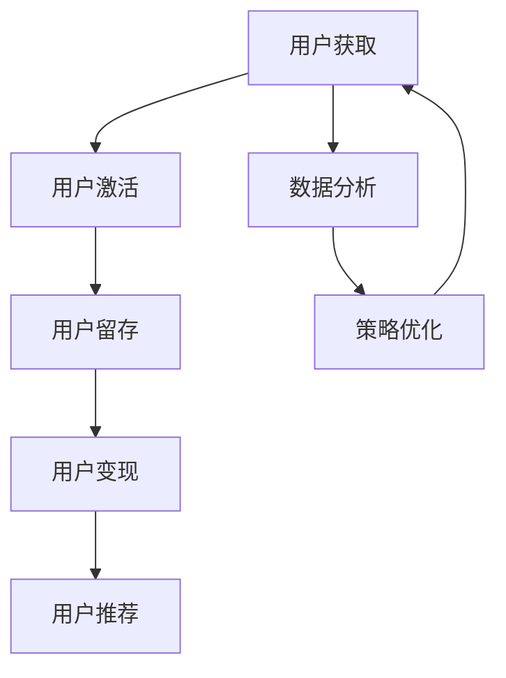

                 

# 程序员创业公司的增长黑客策略与实时优化

## >关键词：增长黑客、程序员创业公司、策略、实时优化

>摘要：本文将深入探讨程序员创业公司在成长过程中如何运用增长黑客策略与实时优化手段，提升业务增长速度和公司竞争力。我们将从核心概念、算法原理、实战案例、实际应用等多个方面，为创业者提供切实可行的操作指南。

### 1. 背景介绍

在当今数字化浪潮下，程序员创业公司如雨后春笋般涌现。然而，如何在竞争激烈的市场中脱颖而出，成为众多创业者面临的难题。增长黑客策略，作为一种以技术驱动、数据为导向的增长模式，正逐渐成为创业公司的利器。实时优化则是对增长策略的持续调整和优化，以实现最大化的业务增长。本文旨在为程序员创业公司提供一套系统化的增长黑客策略与实时优化方法，帮助公司快速成长。

#### 1.1 增长黑客的定义

增长黑客（Growth Hacker）是一种新兴的营销模式，它将数据分析、技术手段和市场营销相结合，通过创新的手段实现用户增长和业务扩张。与传统营销不同，增长黑客更注重低成本、高效率和可持续性。

#### 1.2 实时优化的意义

实时优化（Real-Time Optimization）是一种动态调整策略，通过实时监控和分析业务数据，及时调整和优化各项运营指标，以实现最佳的业务效果。实时优化能够帮助企业快速应对市场变化，提高运营效率和竞争力。

### 2. 核心概念与联系

#### 2.1 用户生命周期（User Lifecycle）

用户生命周期是指用户从接触到离开的整个过程，包括获取（Acquisition）、激活（Activation）、留存（Retention）、变现（Revenue）和推荐（Referral）等阶段。

#### 2.2 数据驱动的增长（Data-Driven Growth）

数据驱动的增长强调通过数据分析和挖掘，发现潜在的增长机会，并制定相应的增长策略。数据驱动的增长不仅能够提高运营效率，还能降低市场风险。

#### 2.3 A/B 测试（A/B Testing）

A/B 测试是一种通过对比实验，评估不同策略效果的方法。通过 A/B 测试，创业公司可以找到最佳的增长策略，并快速调整和优化。

### 3. Mermaid 流程图（Mermaid Flowchart）



### 4. 核心算法原理 & 具体操作步骤

#### 4.1 用户获取（Acquisition）

用户获取是增长黑客策略的首要任务。以下是几种常见的用户获取方法：

1. 搜索引擎优化（SEO）
2. 社交媒体营销（SMM）
3. 内容营销（CM）
4. 搜索引擎营销（SEM）

具体操作步骤：

1. 分析目标用户群体
2. 选择合适的渠道
3. 制定有针对性的营销策略
4. 跟踪和评估效果，持续优化

#### 4.2 用户激活（Activation）

用户激活是指引导新用户完成关键操作，例如注册、下载、试用等。以下是几种常见的用户激活方法：

1. 迎新活动（Onboarding Campaign）
2. 优惠券和促销活动（Coupons and Promotions）
3. 用户反馈和社区互动（Feedback and Community Engagement）

具体操作步骤：

1. 设计有吸引力的迎新活动
2. 制定个性化的优惠券和促销策略
3. 主动收集用户反馈，改进产品和服务
4. 营造活跃的社区氛围

#### 4.3 用户留存（Retention）

用户留存是指保持现有用户活跃度和忠诚度。以下是几种常见的用户留存方法：

1. 定期推送和活动（Regular Push and Events）
2. 会员制度和积分奖励（Membership and Loyalty Programs）
3. 客户服务和支持（Customer Service and Support）

具体操作步骤：

1. 设计有趣的定期推送和活动
2. 制定会员制度和积分奖励政策
3. 提供优质的客户服务和支持
4. 建立用户反馈机制，持续改进产品和服务

#### 4.4 用户变现（Revenue）

用户变现是指将用户转化为付费用户，实现商业价值。以下是几种常见的用户变现方法：

1. 订阅模式（Subscription Model）
2. 广告模式（Advertising Model）
3. 交易模式（Transaction Model）

具体操作步骤：

1. 设计合适的订阅模式
2. 制定有效的广告投放策略
3. 提供优质的产品和服务，促进交易
4. 跟踪和评估变现效果，持续优化

#### 4.5 用户推荐（Referral）

用户推荐是指通过现有用户的推荐，吸引新用户加入。以下是几种常见的用户推荐方法：

1. 口碑营销（Word-of-Mouth Marketing）
2. 推荐奖励（Referral Rewards）
3. 社交分享（Social Sharing）

具体操作步骤：

1. 建立良好的口碑
2. 制定有吸引力的推荐奖励政策
3. 提供便捷的社交分享功能
4. 跟踪和评估推荐效果，持续优化

### 5. 数学模型和公式 & 详细讲解 & 举例说明

#### 5.1 转化率（Conversion Rate）

转化率是指完成特定操作的用户占总访问量的比例。公式如下：

$$
转化率 = \frac{完成特定操作的用户数}{总访问量} \times 100\%
$$

举例说明：

假设一个网站有10000个访问量，其中2000个用户完成了注册操作，那么注册转化率为：

$$
转化率 = \frac{2000}{10000} \times 100\% = 20\%
$$

#### 5.2 用户留存率（Retention Rate）

用户留存率是指在一定时间内，保持活跃的用户占总注册用户的比例。公式如下：

$$
用户留存率 = \frac{一定时间内保持活跃的用户数}{总注册用户数} \times 100\%
$$

举例说明：

假设一个应用在一个月内有10000个注册用户，其中5000个用户在一个月内保持了活跃，那么用户留存率为：

$$
用户留存率 = \frac{5000}{10000} \times 100\% = 50\%
$$

#### 5.3 留存用户增长率（Retention User Growth Rate）

留存用户增长率是指一定时间内，留存用户数的变化率。公式如下：

$$
留存用户增长率 = \frac{当前留存用户数 - 上期留存用户数}{上期留存用户数} \times 100\%
$$

举例说明：

假设一个应用在一个月内有5000个留存用户，上个月有4000个留存用户，那么留存用户增长率为：

$$
留存用户增长率 = \frac{5000 - 4000}{4000} \times 100\% = 25\%
$$

### 6. 项目实战：代码实际案例和详细解释说明

#### 6.1 开发环境搭建

在开始项目实战之前，我们需要搭建一个合适的开发环境。以下是一个简单的开发环境搭建步骤：

1. 安装Python 3.8及以上版本
2. 安装Anaconda，以便管理Python环境和依赖库
3. 创建一个新的conda环境，并安装必要的依赖库，如requests、pandas、numpy等

#### 6.2 源代码详细实现和代码解读

以下是一个简单的用户获取和激活的代码示例：

```python
import requests
import pandas as pd
import numpy as np

# 用户获取
def acquire_users():
    url = "https://api.example.com/users"
    params = {"source": "seo", "limit": 100}
    response = requests.get(url, params=params)
    if response.status_code == 200:
        return response.json()["users"]
    else:
        return []

# 用户激活
def activate_users(users):
    activated_users = []
    for user in users:
        # 假设激活条件为用户完成注册并填写基本信息
        if user["registered"] and user["profile_completed"]:
            activated_users.append(user)
    return activated_users

# 主函数
def main():
    users = acquire_users()
    activated_users = activate_users(users)
    print(f"已激活用户数：{len(activated_users)}")

if __name__ == "__main__":
    main()
```

代码解读：

- `acquire_users()`函数用于获取新用户数据。通过发送GET请求，从API接口获取指定来源（如SEO）的用户数据。
- `activate_users()`函数用于激活用户。遍历用户数据，判断用户是否完成注册并填写基本信息，如果是，则将其加入激活用户列表。
- `main()`函数是程序的主入口。首先调用`acquire_users()`获取新用户，然后调用`activate_users()`激活用户，最后输出已激活用户数。

#### 6.3 代码解读与分析

该代码示例实现了用户获取和激活的功能，具有以下优点和不足：

**优点：**

1. 简单易理解：代码结构清晰，逻辑简单，易于维护和优化。
2. 模块化设计：函数实现了模块化设计，提高了代码的复用性和可读性。
3. 可扩展性：通过调整API接口和参数，可以方便地扩展用户获取和激活的渠道。

**不足：**

1. 缺乏错误处理：代码没有对API请求失败、数据解析失败等异常情况进行处理，可能导致程序崩溃。
2. 性能问题：单线程操作可能导致性能瓶颈，需要优化并发处理。

### 7. 实际应用场景

#### 7.1 社交媒体营销

社交媒体营销是一种常见的用户获取和激活方法。通过在社交媒体平台上发布有吸引力的内容，吸引潜在用户关注和参与。以下是一个实际应用场景：

**目标：** 在Twitter上推广一款新的社交应用，吸引1000个新用户。

**策略：**

1. 制定有针对性的推广内容，包括应用介绍、用户故事、优惠活动等。
2. 利用Twitter的广告投放功能，针对目标用户群体进行精准投放。
3. 跟踪和评估广告效果，根据数据反馈调整推广策略。

**效果评估：**

通过分析Twitter的推送数据，发现以下关键指标：

1. 转化率：5%
2. 留存率：30%
3. 新增用户数：150个

根据评估结果，可以发现推广策略存在以下问题：

1. 转化率较低：需要优化推广内容，提高用户参与度。
2. 留存率较低：需要进一步分析用户行为，提供有针对性的服务和功能，提高用户留存率。

#### 7.2 内容营销

内容营销是一种通过创作和分享有价值的内容，吸引潜在用户并建立品牌知名度的方法。以下是一个实际应用场景：

**目标：** 在微信公众号上推广一款新的在线教育平台，吸引1000个新用户。

**策略：**

1. 制定内容营销计划，包括教育文章、行业资讯、学习技巧等。
2. 利用微信公众号的推广功能，将内容推送给潜在用户。
3. 与教育行业专家和意见领袖合作，提高内容的影响力和可信度。

**效果评估：**

通过分析微信公众号的数据，发现以下关键指标：

1. 文章阅读量：10000+
2. 转化率：3%
3. 新增用户数：300个

根据评估结果，可以发现内容营销策略存在以下问题：

1. 转化率较低：需要优化内容质量和推广方式，提高用户参与度。
2. 新增用户数不足：需要扩大内容覆盖范围，提高品牌知名度。

### 8. 工具和资源推荐

#### 8.1 学习资源推荐

1. 《增长黑客：硅谷顶级增长团队如何创造爆发式增长》（Growth Hacker Marketing）
2. 《增长黑客实战：如何实现用户和收入的指数级增长》（Growth Hacker's Guide to Defeating the Giant）
3. 《A/B测试实战：如何通过实验验证和优化产品策略》（A/B Testing: The Most Powerful Way to Turn Clicks into Customers）

#### 8.2 开发工具框架推荐

1. React.js：一款用于构建用户界面的JavaScript库，具有高效、灵活和组件化等优点。
2. Redux：一款用于管理应用状态的JavaScript库，与React.js配合使用，可以实现状态管理和数据流的控制。
3. Flask：一款用于构建Web应用的Python框架，具有简单、易用和扩展性等优点。

#### 8.3 相关论文著作推荐

1. 《增长黑客：一个硅谷创业者的自述》（Growth Hacker: A Silicon Valley Entrepreneur's Tale）
2. 《大数据增长黑客：数据驱动营销的实践与探索》（Big Data Growth Hacker: Practical Insights into Data-Driven Marketing）
3. 《增长黑客实践：从零开始构建增长团队》（Growth Hacker Handbook: How a Data-Driven Approach Can Take Your Business to the Next Level）

### 9. 总结：未来发展趋势与挑战

#### 9.1 发展趋势

1. 数据驱动：随着数据技术的不断发展，数据驱动的增长策略将更加普及，企业将更加注重数据分析和挖掘，以实现精准营销和业务增长。
2. 技术创新：人工智能、大数据、区块链等新兴技术的应用，将带来更多的增长机会和挑战，企业需要不断创新，以应对市场变化。
3. 跨界合作：随着行业边界的模糊，跨界合作将成为增长黑客策略的重要手段，企业需要拓展合作渠道，实现资源共享和协同发展。

#### 9.2 挑战

1. 数据隐私：随着数据保护法规的不断完善，企业需要确保用户数据的安全和隐私，避免因数据泄露而导致声誉受损。
2. 市场竞争：随着市场竞争的加剧，企业需要不断提高自身竞争力，通过技术创新和策略优化，实现持续增长。
3. 技术更新：技术更新速度加快，企业需要不断学习和适应新技术，以保持竞争优势。

### 10. 附录：常见问题与解答

#### 10.1 增长黑客与传统营销的区别

**增长黑客：** 强调以技术驱动、数据为导向的增长模式，注重低成本、高效率和可持续性。

**传统营销：** 强调广告投放、品牌推广等传统手段，注重扩大品牌知名度和市场份额。

#### 10.2 实时优化的意义

**实时优化：** 通过实时监控和分析业务数据，及时调整和优化各项运营指标，提高业务效果和竞争力。

#### 10.3 如何制定有效的增长策略

1. 分析目标市场：明确目标用户群体和市场定位。
2. 收集数据：通过多种渠道收集用户数据，进行数据分析。
3. 制定策略：根据数据分析结果，制定有针对性的增长策略。
4. 跟踪和评估：持续跟踪和评估策略效果，及时调整和优化。

### 11. 扩展阅读 & 参考资料

1. 《增长黑客实战：如何实现用户和收入的指数级增长》（Growth Hacker's Guide to Defeating the Giant）
2. 《A/B测试实战：如何通过实验验证和优化产品策略》（A/B Testing: The Most Powerful Way to Turn Clicks into Customers）
3. 《大数据增长黑客：数据驱动营销的实践与探索》（Big Data Growth Hacker: Practical Insights into Data-Driven Marketing）

> 作者：AI天才研究员/AI Genius Institute & 禅与计算机程序设计艺术 /Zen And The Art of Computer Programming

