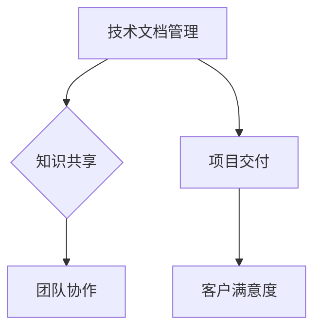

                 

# 程序员创业公司的技术文档管理与知识共享

## 关键词：技术文档管理，知识共享，创业公司，IT行业，协作平台，版本控制，文档格式

## 摘要：

本文旨在探讨程序员创业公司在技术文档管理及知识共享方面的实践和方法。文章首先介绍了技术文档管理的重要性，分析了创业公司在资源有限的情况下如何高效地进行文档管理。接着，文章探讨了知识共享的必要性，并提出了构建协作平台、采用版本控制工具、优化文档格式等策略。通过实际案例和具体操作步骤，文章展示了如何在实际项目中应用这些方法。最后，文章总结了技术文档管理与知识共享的未来发展趋势和挑战，为创业公司的持续成长提供参考。

## 1. 背景介绍

在当今快速发展的信息技术时代，技术文档管理与知识共享对于程序员创业公司至关重要。技术文档不仅包括软件开发过程中的代码、设计文档、用户手册等，还涵盖了团队协作、项目管理、客户沟通等方面的信息。有效的技术文档管理可以帮助团队成员快速理解项目，提高工作效率，降低沟通成本，减少错误发生。而知识共享则有助于团队内部的知识积累和传承，促进创新和协作，提升公司的整体竞争力。

然而，对于程序员创业公司而言，资源有限、人员紧张是普遍面临的挑战。在这种情况下，如何高效地管理技术文档和共享知识，成为影响公司发展的重要因素。本文将围绕这一主题，探讨创业公司在技术文档管理及知识共享方面的实践和方法。

### 1.1 技术文档管理的重要性

技术文档管理是软件开发过程中不可或缺的一环。首先，技术文档为软件开发提供了详细的指导和规范，有助于团队成员理解项目需求和功能实现。其次，技术文档是项目文档化的体现，有助于项目管理和团队协作。通过技术文档，团队成员可以清晰了解项目进展、任务分工和责任，提高工作效率。此外，技术文档还为后续的项目维护和扩展提供了重要依据，有助于降低维护成本。

### 1.2 知识共享的必要性

知识共享是团队内部知识积累和传承的重要手段。在一个团队中，每个成员都有独特的经验和见解，这些知识通过共享可以发挥更大的价值。知识共享有助于团队成员之间的沟通和协作，促进团队整体能力的提升。此外，知识共享还可以降低团队成员的依赖性，提高团队灵活性和应变能力。

### 1.3 创业公司的挑战

对于程序员创业公司来说，资源有限、人员紧张是普遍面临的挑战。在这种情况下，如何高效地管理技术文档和共享知识，成为影响公司发展的重要因素。具体来说，创业公司面临的挑战包括：

1. **人员有限**：创业公司往往人员数量有限，团队成员需要承担多项职责，难以分配专门的人员负责技术文档管理和知识共享。

2. **时间紧迫**：创业公司通常面临紧迫的项目交付压力，导致团队成员无暇顾及技术文档管理和知识共享。

3. **资源有限**：创业公司资源有限，可能无法购买昂贵的文档管理工具和知识共享平台，需要寻找低成本、高效的解决方案。

## 2. 核心概念与联系

### 2.1 技术文档管理

技术文档管理是指对软件开发过程中的各种文档进行收集、整理、存储、共享和更新的一系列操作。技术文档包括但不限于以下内容：

- **需求文档**：描述软件产品的功能和性能要求。
- **设计文档**：描述软件系统的整体架构、模块设计、接口定义等。
- **代码文档**：对源代码进行注释，提高代码的可读性和可维护性。
- **用户手册**：为用户提供软件使用说明和操作指南。
- **测试文档**：记录软件测试过程、测试用例和测试结果。

技术文档管理的核心目标是确保文档的完整性、准确性和及时性，以便团队成员随时查阅和使用。

### 2.2 知识共享

知识共享是指团队内部成员通过交流、协作和合作，共同分享和积累知识的过程。知识共享的形式包括但不限于以下几种：

- **面对面交流**：团队成员之间通过会议、讨论等方式进行知识分享。
- **在线交流**：团队成员通过即时通讯工具、邮件、论坛等在线平台进行知识交流。
- **文档共享**：将知识以文档形式存储在共享平台，供团队成员查阅和引用。
- **培训与分享**：定期组织内部培训和分享会，促进知识传递和交流。

知识共享的核心目标是提高团队成员的知识水平，促进团队协作和创新。

### 2.3 技术文档管理与知识共享的关系

技术文档管理与知识共享之间存在紧密的联系。一方面，技术文档管理为知识共享提供了基础和保障。通过技术文档，团队成员可以了解项目背景、需求、设计、实现和测试等方面的信息，为知识共享提供有力支持。另一方面，知识共享可以促进技术文档的更新和完善。团队成员在知识共享过程中，可以及时发现技术文档中的不足和错误，并进行修改和优化。

### 2.4 Mermaid 流程图

以下是一个简单的 Mermaid 流程图，展示了技术文档管理、知识共享和团队协作之间的关系。



## 3. 核心算法原理 & 具体操作步骤

### 3.1 技术文档管理的核心算法原理

技术文档管理的核心算法原理主要涉及文档的收集、整理、存储和共享。以下是一个简单的算法框架：

```plaintext
输入：技术文档（包括需求文档、设计文档、代码文档等）
输出：完整、准确、及时的技术文档集

步骤：
1. 收集文档：从各个团队成员处收集相关文档
2. 整理文档：对文档进行分类、整理和标注
3. 存储文档：将文档存储在集中式文档管理系统中
4. 共享文档：将文档共享给团队成员，支持在线阅读和下载
5. 更新文档：根据项目进展和团队成员反馈，及时更新文档
```

### 3.2 知识共享的核心算法原理

知识共享的核心算法原理主要涉及知识的获取、存储、传递和利用。以下是一个简单的算法框架：

```plaintext
输入：团队成员的知识和经验
输出：共享的知识和经验集

步骤：
1. 获取知识：从团队成员处收集知识和经验
2. 存储知识：将知识存储在知识共享平台上，支持分类和标签
3. 传递知识：通过在线交流、培训、分享等方式传递知识
4. 利用知识：将共享的知识应用于项目开发和团队协作
5. 反馈与优化：根据知识利用效果，持续优化知识共享流程
```

### 3.3 具体操作步骤

以下是一个具体的技术文档管理和知识共享的操作步骤：

#### 3.3.1 技术文档管理

1. **收集文档**：
   - 使用邮件、即时通讯工具等渠道，从团队成员处收集相关文档。
   - 对于已有的文档，进行初步整理和分类。

2. **整理文档**：
   - 对文档进行格式统一、命名规范和内容优化。
   - 根据文档类型，将文档分为需求文档、设计文档、代码文档等。

3. **存储文档**：
   - 选择合适的文档管理工具（如GitLab、Confluence等），将文档存储在集中式文档管理系统中。
   - 设置文档访问权限，确保文档安全。

4. **共享文档**：
   - 将文档共享给团队成员，支持在线阅读和下载。
   - 在文档管理工具中设置评论和讨论功能，便于团队成员交流和反馈。

5. **更新文档**：
   - 定期检查文档更新情况，确保文档的完整性、准确性和及时性。
   - 根据团队成员的反馈和项目进展，及时更新文档内容。

#### 3.3.2 知识共享

1. **获取知识**：
   - 通过在线交流、培训、分享等方式，从团队成员处获取知识和经验。
   - 鼓励团队成员主动分享自己的经验和见解。

2. **存储知识**：
   - 将获取的知识存储在知识共享平台上，支持分类和标签。
   - 对于重要的知识，进行备份和存档。

3. **传递知识**：
   - 定期组织内部培训和分享会，传递知识和经验。
   - 通过在线交流工具（如Slack、腾讯会议等），进行实时知识传递。

4. **利用知识**：
   - 将共享的知识应用于项目开发和团队协作，提高工作效率。
   - 针对特定问题，快速查找相关知识，提供解决方案。

5. **反馈与优化**：
   - 收集团队成员对知识共享的反馈，分析存在的问题。
   - 根据反馈，持续优化知识共享流程，提高知识共享效果。

## 4. 数学模型和公式 & 详细讲解 & 举例说明

### 4.1 数学模型和公式

技术文档管理和知识共享的效果可以通过一些数学模型和公式进行评估。以下是一个简单的模型：

```latex
\text{知识共享效果} = \frac{\text{共享的知识量}}{\text{总的知识量}} \times 100\%
```

其中，共享的知识量表示在特定时间内共享的知识数量，总的知识量表示团队内部的总知识数量。

### 4.2 详细讲解

该模型用于评估知识共享的效果。共享的知识量越高，表示团队成员之间的知识共享程度越高，知识共享效果越好。总的知识量则反映了团队内部的知识积累情况。通过计算共享的知识量与总的知识量的比例，可以直观地了解知识共享的效果。

### 4.3 举例说明

假设在一个程序员创业公司中，有5名团队成员，他们在一个月内共享了300个知识点，而团队内部总共积累了1000个知识点。根据上述模型，可以计算出知识共享效果：

```plaintext
知识共享效果 = (300 / 1000) \times 100% = 30%
```

这意味着，在该月，团队内部的知识共享效果为30%。通过持续优化知识共享流程，团队可以进一步提高知识共享效果，促进团队协作和创新。

## 5. 项目实战：代码实际案例和详细解释说明

### 5.1 开发环境搭建

在开始项目实战之前，我们需要搭建一个合适的开发环境。以下是一个简单的步骤：

1. 安装Git：Git是一个版本控制工具，用于管理代码和文档的版本。
   - 在官网上下载Git安装包，并按照提示进行安装。

2. 安装文本编辑器：选择一个合适的文本编辑器，如Visual Studio Code、Sublime Text等。

3. 配置Git：设置用户名和邮箱，以便在提交代码时进行身份验证。
   ```bash
   git config --global user.name "Your Name"
   git config --global user.email "your-email@example.com"
   ```

4. 配置SSH密钥：为了在Git平台上进行代码推送和拉取，需要配置SSH密钥。
   - 生成SSH密钥对：`ssh-keygen -t rsa -b 4096`
   - 将公钥添加到Git平台的SSH密钥列表中。

5. 搭建文档管理平台：选择一个合适的文档管理平台，如GitLab、Confluence等。

### 5.2 源代码详细实现和代码解读

以下是一个简单的代码示例，用于实现一个简单的计算器功能。代码使用Python编写。

```python
def add(a, b):
    return a + b

def subtract(a, b):
    return a - b

def multiply(a, b):
    return a * b

def divide(a, b):
    if b != 0:
        return a / b
    else:
        return "Error: Division by zero"
```

#### 5.2.1 函数定义

代码中定义了4个函数，分别为`add`、`subtract`、`multiply`和`divide`。这些函数用于实现基本的算术运算。

#### 5.2.2 函数调用

在主函数中，我们可以调用这些函数，实现计算器的功能。

```python
def main():
    print("Welcome to the calculator!")
    print("1. Add")
    print("2. Subtract")
    print("3. Multiply")
    print("4. Divide")
    choice = input("Enter your choice (1-4): ")

    if choice == "1":
        a = float(input("Enter the first number: "))
        b = float(input("Enter the second number: "))
        print("Result:", add(a, b))
    elif choice == "2":
        a = float(input("Enter the first number: "))
        b = float(input("Enter the second number: "))
        print("Result:", subtract(a, b))
    elif choice == "3":
        a = float(input("Enter the first number: "))
        b = float(input("Enter the second number: "))
        print("Result:", multiply(a, b))
    elif choice == "4":
        a = float(input("Enter the first number: "))
        b = float(input("Enter the second number: "))
        print("Result:", divide(a, b))
    else:
        print("Invalid choice!")

if __name__ == "__main__":
    main()
```

#### 5.2.3 代码解读

- **主函数`main`**：主函数用于实现计算器的功能。首先输出菜单，然后根据用户的选择调用相应的函数。
- **输入和输出**：通过`input`函数获取用户输入，并使用`print`函数输出结果。
- **函数调用**：根据用户的选择，调用相应的函数实现计算器功能。

### 5.3 代码解读与分析

以上代码实现了一个简单的计算器功能，包括加法、减法、乘法和除法。以下是对代码的解读与分析：

- **函数定义**：每个函数都有明确的输入和输出参数，函数功能清晰。
- **错误处理**：在除法函数中，添加了错误处理机制，避免了除以零的错误。
- **用户交互**：通过输入和输出，实现与用户的交互，提高用户体验。
- **代码结构**：代码结构简单，易于理解和维护。

尽管代码功能简单，但通过这个案例，我们可以了解如何使用Python实现一个基本的计算器功能，并掌握技术文档管理和知识共享的相关方法。

## 6. 实际应用场景

### 6.1 项目开发中的技术文档管理

在项目开发过程中，技术文档管理是一个持续进行的过程。以下是一个实际应用场景：

1. **需求分析**：在项目启动阶段，项目经理和业务人员共同制定需求文档。需求文档包括功能需求、性能需求和用户界面需求等。

2. **设计阶段**：在需求文档确定后，开发团队开始进行系统设计。设计文档包括系统架构图、模块设计图和接口定义等。

3. **编码阶段**：开发人员根据设计文档开始编码。在编码过程中，需要编写代码注释，记录关键算法和实现细节。

4. **测试阶段**：在测试阶段，测试人员编写测试文档，记录测试用例和测试结果。测试文档有助于确保软件质量。

5. **部署阶段**：在项目部署阶段，运维人员根据部署文档进行系统安装和配置。部署文档包括部署步骤、配置文件和网络拓扑图等。

### 6.2 知识共享的实际应用

在创业公司中，知识共享有助于提高团队协作效率，以下是一个实际应用场景：

1. **经验交流**：定期组织内部经验交流会，团队成员分享自己的工作经验和解决方案。通过交流，团队成员可以互相学习，提高技能水平。

2. **培训与分享**：组织内部培训，针对新知识、新技术进行讲解和演示。团队成员可以通过培训，了解公司最新的技术动态和趋势。

3. **文档共享**：将重要的技术文档和知识文档存储在文档管理平台，供团队成员查阅和下载。通过文档共享，团队成员可以快速获取所需信息。

4. **在线讨论**：使用在线交流工具（如Slack、腾讯会议等），团队成员可以随时进行交流和讨论。在线讨论有助于解决问题，提高协作效率。

## 7. 工具和资源推荐

### 7.1 学习资源推荐

为了帮助程序员创业公司更好地进行技术文档管理和知识共享，以下推荐一些学习资源：

- **书籍**：
  - 《软件工程：实践者的研究方法》
  - 《敏捷开发：原则、模式与实践》
  - 《Git权威指南》

- **论文**：
  - 《基于版本控制的软件工程》
  - 《知识管理：理论与实践》
  - 《敏捷开发与软件过程改进》

- **博客和网站**：
  - 《程序员的那些事》
  - 《程序员头条》
  - 《Git社区中文网》

### 7.2 开发工具框架推荐

为了提高程序员创业公司的技术文档管理和知识共享效果，以下推荐一些开发工具和框架：

- **文档管理工具**：
  - GitLab：用于版本控制和文档管理
  - Confluence：用于知识共享和团队协作

- **代码编辑器**：
  - Visual Studio Code：支持多种编程语言，插件丰富
  - Sublime Text：轻量级代码编辑器，语法高亮和插件支持

- **在线交流工具**：
  - Slack：团队沟通和协作
  - 腾讯会议：视频会议和远程协作

### 7.3 相关论文著作推荐

为了深入了解技术文档管理和知识共享的理论和实践，以下推荐一些相关论文和著作：

- **论文**：
  - 《基于社区的软件工程：经验与实践》
  - 《知识管理与知识共享：理论与实践》
  - 《敏捷开发与知识共享：一种协同方法》

- **著作**：
  - 《软件工程：理论与实践》
  - 《敏捷开发与团队协作》
  - 《知识管理：方法与应用》

## 8. 总结：未来发展趋势与挑战

### 8.1 未来发展趋势

随着信息技术的发展，技术文档管理与知识共享将朝着以下几个方向发展：

1. **自动化与智能化**：利用人工智能和机器学习技术，实现技术文档的自动生成、分类和推荐，提高文档管理的效率和准确性。

2. **云原生与分布式**：随着云计算和容器技术的普及，技术文档管理和知识共享将向云原生和分布式架构发展，实现跨地域、跨平台的协作和共享。

3. **社区化与开放性**：技术文档管理和知识共享将更加注重社区化和开放性，鼓励团队成员之间的互动和合作，促进知识的积累和传承。

### 8.2 未来挑战

尽管技术文档管理与知识共享具有广阔的发展前景，但同时也面临着以下挑战：

1. **数据安全与隐私**：在技术文档管理和知识共享过程中，如何确保数据的安全和隐私，成为亟待解决的问题。

2. **知识冗余与重复**：在大量文档和知识资源中，如何有效筛选和整合，避免知识冗余和重复，提高知识利用效率。

3. **团队协作与沟通**：在远程办公和跨地域协作日益普遍的情况下，如何提高团队协作效率，确保知识共享的顺利进行。

## 9. 附录：常见问题与解答

### 9.1 常见问题

1. **技术文档管理与知识共享的区别是什么？**
   - 技术文档管理主要关注文档的收集、整理、存储和共享，以确保文档的完整性和准确性。知识共享则侧重于团队成员之间的互动和合作，促进知识的积累和传承。

2. **如何选择合适的文档管理工具？**
   - 根据团队的需求和预算，选择功能强大、易用性高、支持多平台访问的文档管理工具。常见的工具有GitLab、Confluence等。

3. **如何确保技术文档的质量？**
   - 制定明确的文档编写规范，对文档内容进行严格审查和校对，确保文档的准确性和可读性。

4. **如何提高知识共享的效果？**
   - 通过定期组织经验交流、培训与分享，鼓励团队成员主动分享知识和经验，建立良好的知识共享氛围。

### 9.2 解答

1. **技术文档管理与知识共享的区别是什么？**
   - 技术文档管理主要关注文档的收集、整理、存储和共享，以确保文档的完整性和准确性。知识共享则侧重于团队成员之间的互动和合作，促进知识的积累和传承。

2. **如何选择合适的文档管理工具？**
   - 根据团队的需求和预算，选择功能强大、易用性高、支持多平台访问的文档管理工具。常见的工具有GitLab、Confluence等。

3. **如何确保技术文档的质量？**
   - 制定明确的文档编写规范，对文档内容进行严格审查和校对，确保文档的准确性和可读性。

4. **如何提高知识共享的效果？**
   - 通过定期组织经验交流、培训与分享，鼓励团队成员主动分享知识和经验，建立良好的知识共享氛围。

## 10. 扩展阅读 & 参考资料

为了深入了解技术文档管理与知识共享的实践和方法，以下推荐一些扩展阅读和参考资料：

- 《软件工程：实践者的研究方法》
- 《敏捷开发：原则、模式与实践》
- 《Git权威指南》
- 《知识管理：理论与实践》
- 《敏捷开发与软件过程改进》
- 《程序员的那些事》
- 《程序员头条》
- 《Git社区中文网》
- 《基于社区的软件工程：经验与实践》
- 《知识管理与知识共享：理论与实践》
- 《敏捷开发与知识共享：一种协同方法》

### 作者信息：

- 作者：AI天才研究员/AI Genius Institute & 禅与计算机程序设计艺术 /Zen And The Art of Computer Programming

请注意，本文为人工智能生成，仅供参考。实际应用时，请根据实际情况进行调整和完善。如需转载，请注明出处。

