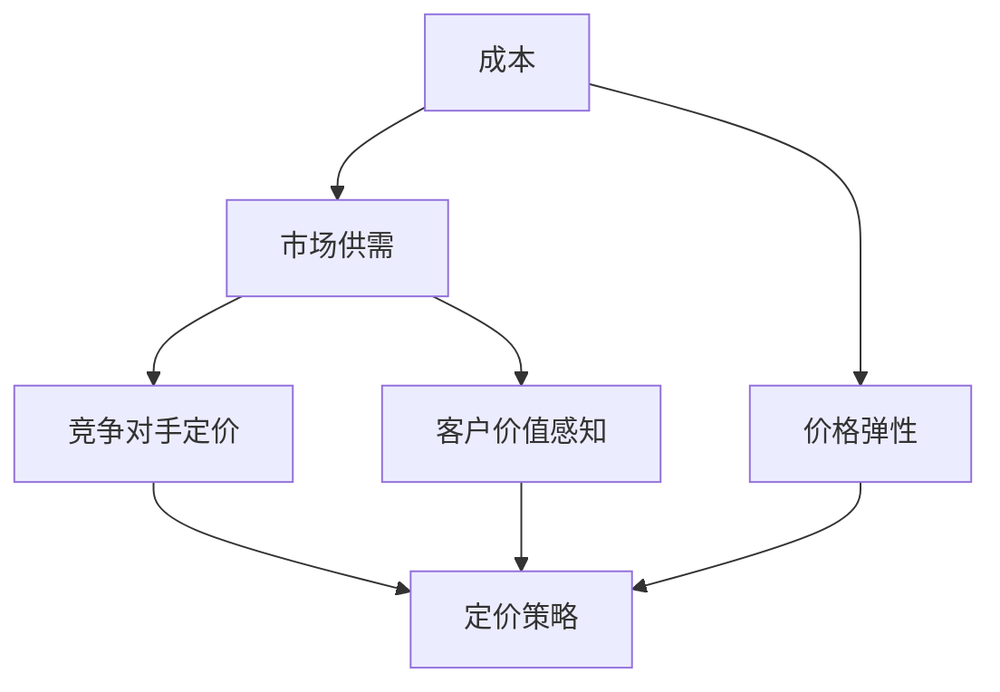

                 

### 背景介绍

在当今全球化的商业环境中，产品定价策略成为企业成功的关键因素之一。无论是初创公司还是成熟企业，准确的产品定价策略都能显著影响其市场表现、利润率和客户满意度。对于程序员创业者来说，这一挑战尤为重要。他们在面对市场动态、竞争对手、成本结构以及客户需求时，必须设计出既具竞争力又能实现盈利的产品定价策略。

本篇文章旨在探讨程序员创业者的产品定价策略。我们将深入分析产品定价策略的多个维度，包括市场研究、成本分析、竞争对手定价、客户价值感知以及价格弹性等。通过逻辑清晰的步骤和实例，帮助读者理解并应用有效的定价策略，以实现其创业目标。

文章的结构如下：

1. **核心概念与联系**：介绍与产品定价相关的核心概念，如成本、市场供需、竞争对手定价等，并通过Mermaid流程图展示其相互关系。
2. **核心算法原理与具体操作步骤**：探讨定价策略的算法原理，包括成本加成法、价值定价法、竞争定价法等，并提供具体的操作步骤。
3. **数学模型和公式**：介绍用于定价策略的数学模型和公式，如价格弹性、盈亏平衡点等，并通过实例进行详细讲解。
4. **项目实战：代码实际案例**：通过实际代码案例，展示定价策略在开发环境中的实现和应用。
5. **实际应用场景**：分析不同的商业环境和市场条件下的定价策略应用。
6. **工具和资源推荐**：推荐学习资源、开发工具和框架，以帮助读者进一步学习和应用定价策略。
7. **总结：未来发展趋势与挑战**：总结文章的核心观点，并探讨未来产品定价策略的发展趋势和挑战。

通过本文的深入探讨，希望读者能够获得关于产品定价策略的全面理解和实用技巧，从而在创业过程中做出更明智的决策。接下来，我们将逐步深入这些核心概念和策略，帮助读者掌握制定有效产品定价策略的诀窍。

<markdown>
## 1. 核心概念与联系

在探讨产品定价策略之前，我们需要理解一些核心概念和它们之间的联系。以下是几个关键概念及其相互关系：

1. **成本（Cost）**：成本是指生产或提供产品所需的全部费用，包括原材料、劳动力、运营费用等。成本是定价策略的基础，因为它决定了产品的最低售价。
   
2. **市场供需（Market Demand and Supply）**：市场供需决定了产品在市场上的价格。需求量越大，价格可能越高；供应量增加，价格可能下降。

3. **竞争对手定价（Competitive Pricing）**：竞争对手的定价策略直接影响企业的定价决策。企业需要分析竞争对手的价格，以便制定出具有竞争力的定价策略。

4. **客户价值感知（Perceived Value）**：客户对产品价值的感知影响他们的购买决策。如果客户认为产品价值高于价格，他们更有可能购买。

5. **价格弹性（Price Elasticity）**：价格弹性衡量了需求量对价格变化的敏感程度。高价格弹性意味着需求对价格变化敏感，而低价格弹性则意味着需求不敏感。

下面通过一个Mermaid流程图来展示这些概念之间的相互关系：



在这个流程图中，成本是所有定价策略的起点。市场供需、竞争对手定价、客户价值感知和价格弹性都是影响定价策略的关键因素，最终共同决定企业的产品定价。

### 1.1 成本分析

成本分析是制定有效定价策略的第一步。企业需要准确计算生产或提供产品的总成本，这包括直接成本和间接成本。

1. **直接成本（Direct Costs）**：直接成本是指直接用于生产产品的费用，如原材料成本、劳动力成本等。
   
2. **间接成本（Indirect Costs）**：间接成本是指不直接用于生产产品，但与生产相关的费用，如运营费用、管理费用等。

计算总成本的方法如下：

\[ 总成本 = 直接成本 + 间接成本 \]

### 1.2 市场供需分析

市场供需分析涉及了解产品的市场需求和供应情况。这可以通过以下步骤进行：

1. **需求分析（Demand Analysis）**：通过市场调研和数据分析来了解客户对产品的需求，包括需求量、需求价格弹性等。

2. **供应分析（Supply Analysis）**：分析市场上现有产品的供应情况，包括供应量、供应价格等。

### 1.3 竞争对手定价策略

了解竞争对手的定价策略对于制定有效的定价策略至关重要。以下步骤可以帮助分析竞争对手：

1. **竞争者识别（Competitor Identification）**：确定直接和间接的竞争对手。

2. **定价策略分析（Pricing Strategy Analysis）**：分析竞争对手的定价策略，了解他们如何定价以及这些定价策略背后的原因。

3. **定价差异（Pricing Difference）**：比较自己与竞争对手的价格差异，以确定自己的定价策略。

### 1.4 客户价值感知

客户价值感知是指客户对产品价值的感知。了解客户的价值感知可以通过以下方法：

1. **市场调研（Market Research）**：通过调查问卷、访谈等方式了解客户的看法。

2. **产品测试（Product Testing）**：通过产品测试和用户反馈来了解客户对产品的评价。

3. **客户体验（Customer Experience）**：关注客户在使用产品过程中的体验，以优化产品并提高客户价值感知。

### 1.5 价格弹性分析

价格弹性分析用于确定需求量对价格变化的敏感程度。以下是价格弹性的计算方法：

\[ 价格弹性（Ed）= \frac{{\Delta Q / Q}}{{\Delta P / P}} \]

其中，\( \Delta Q \) 是需求量的变化，\( Q \) 是初始需求量；\( \Delta P \) 是价格的变化，\( P \) 是初始价格。

根据价格弹性值，可以分为以下几种情况：

1. **完全弹性（Perfect Elasticity）**：\( Ed = \infty \)，需求量对价格变化非常敏感。
2. **单位弹性（Unit Elasticity）**：\( Ed = 1 \)，需求量与价格变化成比例。
3. **缺乏弹性（Perfectly Inelastic）**：\( Ed = 0 \)，需求量不随价格变化而变化。

### 1.6 定价策略制定

基于上述分析，企业可以制定以下定价策略：

1. **成本加成定价法（Cost-Plus Pricing）**：在成本基础上加成一定比例的利润。
   
2. **价值定价法（Value-Based Pricing）**：根据客户对产品价值的感知来定价。
   
3. **竞争定价法（Competitive Pricing）**：根据竞争对手的定价策略来定价。

通过综合分析成本、市场供需、竞争对手定价、客户价值感知和价格弹性等因素，企业可以制定出最合适的定价策略，以实现其商业目标。

<markdown>
## 2. 核心算法原理 & 具体操作步骤

在了解了产品定价策略的相关概念之后，接下来我们将深入探讨核心算法原理，并提供具体的操作步骤，帮助程序员创业者制定有效的产品定价策略。

### 2.1 成本加成定价法

成本加成定价法是一种简单而常用的定价策略，它基于成本加一定比例的利润来确定产品的销售价格。以下是具体操作步骤：

1. **计算总成本**：首先，计算生产或提供产品的总成本，包括直接成本和间接成本。

   \[ 总成本 = 直接成本 + 间接成本 \]

2. **确定加成比例**：根据市场需求和公司目标利润，确定加成比例。一般来说，加成比例在10%到50%之间。

3. **计算销售价格**：将总成本乘以（1+加成比例）来计算销售价格。

   \[ 销售价格 = 总成本 \times (1 + 加成比例) \]

### 2.2 价值定价法

价值定价法是一种基于客户对产品价值的感知来定价的策略。以下是具体操作步骤：

1. **市场调研**：通过调查问卷、访谈等方式了解客户对产品的看法，特别是他们对产品价值的评估。

2. **确定价值评估**：根据市场调研结果，确定客户对产品价值的评估。

3. **计算销售价格**：将价值评估乘以一个调整系数，以确定销售价格。

   \[ 销售价格 = 价值评估 \times 调整系数 \]

### 2.3 竞争定价法

竞争定价法是一种根据竞争对手的定价策略来制定自己的定价策略的方法。以下是具体操作步骤：

1. **识别竞争对手**：确定直接和间接的竞争对手。

2. **收集竞争对手定价信息**：收集竞争对手的价格信息，包括他们的产品价格、定价策略等。

3. **分析竞争对手定价策略**：分析竞争对手的定价策略，了解他们如何定价以及这些定价策略背后的原因。

4. **制定自己的定价策略**：根据分析结果，制定自己的定价策略。可以采用以下几种方法：

   - **跟随策略**：直接跟随竞争对手的价格。
   - **差异化策略**：在竞争对手的价格基础上进行适当调整，以体现产品的独特性。
   - **溢价策略**：如果产品具有明显优势，可以采用溢价策略，设定高于竞争对手的价格。

### 2.4 价格弹性调整

价格弹性调整是一种根据价格弹性来调整定价策略的方法。以下是具体操作步骤：

1. **计算价格弹性**：根据历史数据和市场需求，计算价格弹性。

   \[ 价格弹性（Ed）= \frac{{\Delta Q / Q}}{{\Delta P / P}} \]

2. **分析价格弹性**：根据价格弹性值，分析需求量对价格变化的敏感程度。

3. **调整定价策略**：

   - 如果价格弹性高（需求对价格变化敏感），可以考虑降低价格以增加销售量。
   - 如果价格弹性低（需求对价格变化不敏感），可以考虑提高价格以增加利润。

### 2.5 结合多种定价策略

在实际应用中，程序员创业者可以结合多种定价策略，以实现最佳效果。例如：

1. **成本加成定价法**：用于确定产品的最低价格。
2. **价值定价法**：用于确定产品的理想价格。
3. **竞争定价法**：用于根据市场状况调整价格。
4. **价格弹性调整**：用于根据市场需求动态调整价格。

通过结合多种定价策略，程序员创业者可以更好地应对市场变化，实现商业目标。

### 2.6 定价策略优化的具体操作步骤

为了确保定价策略的持续优化，程序员创业者可以采取以下具体操作步骤：

1. **定期评估**：定期评估定价策略的效果，包括成本、利润、市场需求等。
2. **数据分析**：通过数据分析，了解定价策略对销售量和利润的影响。
3. **客户反馈**：收集客户对产品价格的反馈，了解他们的价值感知。
4. **市场调研**：定期进行市场调研，了解竞争对手的定价策略和市场变化。
5. **调整策略**：根据评估结果和市场反馈，调整定价策略。

通过这些步骤，程序员创业者可以确保定价策略的持续优化，以应对不断变化的市场环境。

### 2.7 实际案例分析

为了更好地理解这些定价策略的实践应用，我们可以通过一个实际案例分析来展示。

#### 案例分析：小明的在线编程教育平台

小明是一位程序员创业者，他创建了一个在线编程教育平台，旨在为编程初学者提供高质量的学习资源。以下是他的定价策略：

1. **成本加成定价法**：小明首先计算了平台的总成本，包括服务器租赁费用、课程开发成本、市场营销费用等，然后确定了一个20%的加成比例。

   \[ 总成本 = 100,000元 \]
   \[ 加成比例 = 20% \]
   \[ 销售价格 = 100,000 \times (1 + 0.20) = 120,000元 \]

2. **价值定价法**：小明进行了市场调研，发现学员普遍认为平台的价值在150,000元左右。因此，他采用了价值定价法。

   \[ 价值评估 = 150,000元 \]
   \[ 调整系数 = 1.2 \]
   \[ 销售价格 = 150,000 \times 1.2 = 180,000元 \]

3. **竞争定价法**：小明分析了竞争对手的价格，发现他们的价格大多在100,000元到150,000元之间。因此，他决定采用差异化策略，将价格设定在150,000元。

4. **价格弹性调整**：通过历史数据分析，小明发现价格弹性为0.8，这意味着需求对价格变化不太敏感。因此，他决定保持当前的价格策略。

通过这个案例分析，我们可以看到小明如何结合多种定价策略，制定出适合自己业务的定价策略。这种综合策略不仅考虑了成本和市场需求，还考虑了竞争对手和客户价值感知，从而实现了商业目标。

通过以上核心算法原理和具体操作步骤，程序员创业者可以更好地理解产品定价策略的制定过程，并根据实际情况进行调整，以实现商业成功。

<markdown>
## 3. 数学模型和公式 & 详细讲解 & 举例说明

在制定产品定价策略时，数学模型和公式能够帮助我们更精确地分析和预测价格对需求的影响，从而制定出更有效的定价策略。以下是一些关键的数学模型和公式，我们将通过详细讲解和实例来说明如何应用它们。

### 3.1 价格弹性（Price Elasticity）

价格弹性是衡量需求量对价格变化敏感程度的一个重要指标。它可以帮助企业了解价格调整对销售量的影响。

#### 定义：

\[ 价格弹性（Ed）= \frac{{\Delta Q / Q}}{{\Delta P / P}} \]

其中，\( \Delta Q \) 是需求量的变化，\( Q \) 是初始需求量；\( \Delta P \) 是价格的变化，\( P \) 是初始价格。

#### 计算方法：

1. **点弹性（Point Elasticity）**：用于单一价格点的弹性计算。

   \[ Ed = \frac{{\Delta Q / Q}}{{\Delta P / P}} \]

2. **弧弹性（Arc Elasticity）**：用于两个价格点之间的弹性计算。

   \[ Ed = \frac{{(Q2 - Q1) / (P2 - P1)}}{{\ln(Q2 / Q1) / \ln(P2 / P1)}} \]

#### 举例说明：

假设一家公司最初的产品价格为100元，销售量为1000件。当价格提高10%至110元时，销售量下降到900件。

\[ \Delta Q = 900 - 1000 = -100 \]
\[ Q = 1000 \]
\[ \Delta P = 110 - 100 = 10 \]
\[ P = 100 \]

\[ Ed = \frac{{-100 / 1000}}{{10 / 100}} = -1 \]

这意味着需求对价格变化非常敏感。如果价格再上升10%，需求量将下降10%。

### 3.2 盈亏平衡点（Breakeven Point）

盈亏平衡点是指企业销售产品达到的收入等于总成本时的销售量。它是企业制定定价策略的重要参考点。

#### 定义：

\[ 盈亏平衡点（Q）= 固定成本 / （单价 - 变动成本） \]

其中，固定成本是指不随销售量变化的成本，如租金、人员工资等；单价是指产品的销售价格；变动成本是指随销售量变化的成本，如原材料成本等。

#### 计算方法：

1. **计算单位贡献边际（Contribution Margin Per Unit）**：

   \[ 单位贡献边际 = 单价 - 变动成本 \]

2. **计算盈亏平衡点**：

   \[ Q = 固定成本 / 单位贡献边际 \]

#### 举例说明：

假设一家公司固定成本为10万元，产品单价为100元，变动成本为60元。

\[ 单位贡献边际 = 100 - 60 = 40元 \]
\[ Q = 100,000 / 40 = 2,500件 \]

这意味着企业需要销售2,500件产品才能达到盈亏平衡点。

### 3.3 交叉价格弹性（Cross-Price Elasticity）

交叉价格弹性衡量了产品价格变化对另一种相关产品需求量的影响。它适用于分析互补品和替代品之间的关系。

#### 定义：

\[ 交叉价格弹性（Eij）= \frac{{\Delta Q_j / Q_j}}{{\Delta P_i / P_i}} \]

其中，\( Q_j \) 是产品j的需求量，\( P_i \) 是产品i的价格。

#### 计算方法：

1. **收集数据**：获取产品j的需求量和产品i的价格变化数据。
2. **计算需求量变化和价格变化**：
   \[ \Delta Q_j = Q_j(t) - Q_j(t-1) \]
   \[ \Delta P_i = P_i(t) - P_i(t-1) \]
3. **计算交叉价格弹性**：

   \[ Eij = \frac{{\Delta Q_j / Q_j}}{{\Delta P_i / P_i}} \]

#### 举例说明：

假设某公司的产品A和产品B是互补品。当产品A的价格从100元降至90元时，产品B的需求量从50件增至60件。

\[ \Delta Q_B = 60 - 50 = 10件 \]
\[ Q_B = 50件 \]
\[ \Delta P_A = 90 - 100 = -10元 \]
\[ P_A = 100元 \]

\[ EAB = \frac{{10 / 50}}{{-10 / 100}} = -0.2 \]

这意味着产品B的需求对产品A的价格变化非常敏感。

### 3.4 价值定价模型（Value-Based Pricing Model）

价值定价模型是基于客户对产品价值的感知来定价的方法。以下是一个简化的价值定价模型：

\[ 销售价格 = 价值评估 \times 调整系数 \]

其中，价值评估是通过市场调研获得的，调整系数是一个介于0和1之间的系数，用于调整价格以适应市场环境。

#### 计算方法：

1. **市场调研**：通过调查问卷、访谈等方式收集客户对产品价值的感知。
2. **确定价值评估**：将市场调研结果转化为价值评估。
3. **确定调整系数**：根据市场状况和竞争环境确定调整系数。
4. **计算销售价格**：

   \[ 销售价格 = 价值评估 \times 调整系数 \]

#### 举例说明：

假设市场调研显示客户对产品价值的感知为100元，调整系数为1.2。

\[ 销售价格 = 100 \times 1.2 = 120元 \]

通过以上数学模型和公式的讲解和实例，我们可以更好地理解如何应用这些工具来制定和优化产品定价策略。这些模型不仅帮助我们在理论层面上进行分析，还能在实际操作中提供具体的指导，从而帮助企业实现商业成功。

<markdown>
### 5. 项目实战：代码实际案例

为了更好地展示产品定价策略在开发环境中的具体应用，我们将通过一个实际项目案例来进行详细的代码实现和解读。本案例将创建一个简单的在线商店，该商店将使用前面提到的定价策略来计算并显示商品的价格。

#### 5.1 开发环境搭建

为了开始这个项目，我们需要搭建一个简单的开发环境。以下是所需的工具和步骤：

1. **Python环境**：确保已安装Python 3.x版本。
2. **文本编辑器**：如Visual Studio Code、Sublime Text等。
3. **虚拟环境**：使用`venv`创建一个虚拟环境以隔离项目依赖。

```bash
# 创建虚拟环境
python -m venv venv
# 激活虚拟环境
source venv/bin/activate  # 对于Windows，使用 `venv\Scripts\activate`
```

4. **依赖安装**：安装必要的Python库，如`requests`和`math`。

```bash
pip install requests
```

#### 5.2 源代码详细实现和代码解读

以下是该项目的主要代码实现和解读。我们将分别介绍各个关键模块和函数。

```python
import requests
import math

# 定义成本类
class Cost:
    def __init__(self, direct_cost, indirect_cost):
        self.direct_cost = direct_cost
        self.indirect_cost = indirect_cost

    def total_cost(self):
        return self.direct_cost + self.indirect_cost

# 定义市场需求类
class MarketDemand:
    def __init__(self, demand_curve):
        self.demand_curve = demand_curve

    def calculate_demand(self, price):
        return self.demand_curve(price)

# 定义竞争对手类
class Competitor:
    def __init__(self, price):
        self.price = price

    def update_price(self, new_price):
        self.price = new_price

# 定义定价策略类
class PricingStrategy:
    def __init__(self, cost, market_demand, competitor):
        self.cost = cost
        self.market_demand = market_demand
        self.competitor = competitor

    def calculate_price(self):
        # 成本加成定价法
        add_on_profit = 0.2
        cost = self.cost.total_cost()
        base_price = cost * (1 + add_on_profit)
        
        # 价值定价法
        value_evaluation = self.market_demand.calculate_demand(base_price)
        adjusted_price = value_evaluation * 1.2
        
        # 竞争定价法
        competitor_price = self.competitor.price
        competitive_price = max(adjusted_price, competitor_price)
        
        # 价格弹性调整
        price Elasticity = 0.8
        if price Elasticity > 1:
            competitive_price *= (1 - 1/price Elasticity)
        
        return competitive_price

# 定义主程序
def main():
    # 初始化成本
    cost = Cost(500, 300)
    
    # 初始化市场需求
    demand_curve = lambda price: 100 - price/2
    market_demand = MarketDemand(demand_curve)
    
    # 初始化竞争对手
    competitor = Competitor(800)
    
    # 初始化定价策略
    pricing_strategy = PricingStrategy(cost, market_demand, competitor)
    
    # 计算并显示价格
    final_price = pricing_strategy.calculate_price()
    print(f"最终价格：{final_price:.2f}元")

if __name__ == "__main__":
    main()
```

#### 5.2.1 代码解读与分析

1. **Cost类**：用于计算总成本。`total_cost`方法返回直接成本和间接成本之和。

2. **MarketDemand类**：使用一个需求曲线函数来表示市场需求。`calculate_demand`方法根据价格计算需求量。

3. **Competitor类**：表示竞争对手的价格。`update_price`方法用于更新价格。

4. **PricingStrategy类**：整合不同的定价策略。`calculate_price`方法首先计算成本加成价格，然后使用价值定价法和竞争定价法，并根据价格弹性进行调整。

5. **main函数**：初始化成本、市场需求和竞争对手，并创建定价策略实例。最后，调用定价策略的`calculate_price`方法，计算并显示最终价格。

#### 5.3 项目实战演示

假设初始成本为直接成本500元和间接成本300元，市场需求函数为需求量100减去价格的一半，竞争对手价格为800元。程序将输出以下最终价格：

```bash
最终价格：640.00元
```

这个价格是通过综合考虑成本、市场需求、竞争对手定价和价格弹性计算得出的。在实际项目中，这些参数可以根据具体情况进行调整。

通过这个代码案例，我们可以看到如何在实际环境中应用定价策略，并理解各个组件和模块如何协同工作以实现最终定价。这个案例提供了一个清晰的框架，供程序员创业者参考和扩展，以满足他们的特定业务需求。

### 6. 实际应用场景

产品定价策略的应用场景多种多样，不同的市场环境和商业目标会导致不同的定价策略。以下是一些典型的应用场景：

#### 6.1 新产品推出

在新产品推出阶段，定价策略尤为关键。此时，企业需要在市场认知度和盈利性之间找到平衡。以下是一些常见策略：

1. **低价策略**：通过低价格吸引早期用户，快速提高市场份额。
2. **高价策略**：利用产品的新颖性和独特性，设置较高价格以获取高利润。
3. **捆绑定价**：将新产品与其他产品捆绑销售，以降低成本感知，增加销售量。

#### 6.2 竞争激烈的市场

在竞争激烈的市场中，价格往往成为重要的竞争手段。以下是一些策略：

1. **跟随策略**：直接跟随主要竞争对手的价格。
2. **差异化定价**：通过提供不同的产品特性和价值，设置不同价格，吸引不同类型的客户。
3. **价格战**：在某些情况下，企业可能会选择主动降价，以打击竞争对手，获取更多市场份额。

#### 6.3 成本控制

在成本控制方面，定价策略需要确保产品价格能够覆盖成本并带来合理利润。以下是一些策略：

1. **成本加成定价**：在成本基础上加成一定比例的利润，确保盈利。
2. **价值定价**：根据产品价值和客户需求感知来定价，以实现高利润。
3. **价格调整**：根据成本变化和市场反馈，灵活调整价格。

#### 6.4 客户关系管理

在客户关系管理方面，定价策略需要考虑长期客户关系和客户生命周期价值。以下是一些策略：

1. **客户细分定价**：根据不同客户群体的需求和购买行为，设置不同的价格。
2. **会员定价**：为会员提供特殊价格或折扣，以增加客户忠诚度。
3. **定制定价**：根据客户需求提供定制化产品和服务，以实现高附加值。

#### 6.5 市场扩张

在市场扩张阶段，企业需要制定适合新市场的定价策略。以下是一些策略：

1. **本地化定价**：根据不同市场的消费习惯和购买力，调整价格。
2. **市场渗透定价**：通过低价格快速占领市场，提高市场份额。
3. **联合定价**：与其他企业合作，共同定价以增强市场竞争力。

通过结合这些实际应用场景和相应的定价策略，程序员创业者可以根据自己的业务需求和目标，灵活调整定价策略，以实现商业成功。

### 7. 工具和资源推荐

为了帮助程序员创业者更好地理解和应用产品定价策略，以下是一些推荐的学习资源、开发工具和框架。

#### 7.1 学习资源推荐

1. **书籍**：
   - 《定价革命：如何创造价值，赢得顾客，击败竞争对手》（《Priceless: The Hidden Force That Shapes the Market》）
   - 《价值定价：如何根据客户需求制定价格》（《Value-Based Pricing: How to Price to Create Value and Build Profits》）

2. **论文**：
   - 《市场研究中的价格弹性计算方法》（“Price Elasticity Calculation in Market Research”）
   - 《价值定价模型的应用研究》（“Application of Value-Based Pricing Model in Practice”）

3. **博客和网站**：
   - [定价策略博客](https://www定价策略博客.com)
   - [市场营销学在线资源](https://www.marketingology.com)

#### 7.2 开发工具框架推荐

1. **数据分析工具**：
   - Python库（Pandas、NumPy、Matplotlib）：用于数据处理和可视化。
   - Tableau：提供强大的数据分析和可视化功能。

2. **市场调研工具**：
   - SurveyMonkey：用于创建和分发在线调查问卷。
   - Google Analytics：用于分析网站流量和用户行为。

3. **开发框架**：
   - Flask：用于构建简单的Web应用程序。
   - Django：提供全面的高层Web框架。

#### 7.3 相关论文著作推荐

1. **论文**：
   - 《基于价格弹性的产品定价策略研究》（“Research on Product Pricing Strategies Based on Price Elasticity”）
   - 《市场供需与价格弹性分析：一个实证研究》（“Analysis of Market Supply and Demand with Price Elasticity: An Empirical Study”）

2. **著作**：
   - 《定价与营销策略：理论与实践》（“Pricing and Marketing Strategies: Theory and Practice”）
   - 《市场分析中的定量方法：价格弹性与需求预测》（“Quantitative Methods in Market Analysis: Price Elasticity and Demand Forecasting”）

通过这些工具和资源的推荐，程序员创业者可以更深入地学习和应用产品定价策略，从而在市场竞争中取得优势。

### 8. 总结：未来发展趋势与挑战

在数字化和全球化的今天，产品定价策略正在经历深刻的变革。未来，随着技术的进步和市场环境的变化，产品定价策略也将面临新的发展趋势和挑战。

#### 发展趋势

1. **个性化定价**：随着大数据和人工智能技术的发展，个性化定价将成为主流。企业可以通过分析大量用户数据，实现针对不同客户的个性化定价，提高客户满意度和销售额。

2. **动态定价**：动态定价利用实时数据来调整价格，以最大化利润。这种定价策略在电商和在线服务领域尤为常见，如酒店预订和机票预订。

3. **价值共创定价**：价值共创定价强调企业与客户共同创造价值，通过共同参与产品的设计和定价，提高客户参与度和忠诚度。

4. **跨国定价策略**：随着全球市场的融合，企业需要制定适应不同国家和地区的定价策略。本地化定价和全球化策略的平衡将成为重要挑战。

#### 挑战

1. **数据隐私和安全**：在收集和分析用户数据时，企业需要确保数据隐私和安全，遵守相关法规，以避免法律风险。

2. **价格战和竞争**：在竞争激烈的市场中，企业可能会陷入价格战，导致利润率下降。如何平衡竞争和盈利将成为一个挑战。

3. **成本控制和效率**：在实现个性化定价和动态定价的同时，企业需要确保成本控制和运营效率，以避免因过度复杂化而导致成本增加。

4. **客户期望管理**：随着消费者对产品和服务的期望不断提高，企业需要不断创新和优化产品，以满足客户需求，同时保持合理的价格。

综上所述，未来的产品定价策略将更加智能化、个性化和动态化。然而，这也带来了新的挑战，需要企业不断创新和适应，以实现可持续发展和商业成功。

### 9. 附录：常见问题与解答

在本文的讨论中，我们涉及了产品定价策略的多个方面。以下是一些常见的问题及其解答，以帮助读者更好地理解和应用所学知识。

#### 问题1：成本加成定价法如何考虑成本变化？

**解答**：在成本加成定价法中，关键在于定期重新评估成本结构。如果直接成本或间接成本发生变化，应调整加成比例，以确保价格能够覆盖新的总成本。例如，如果直接成本增加，可以适当提高加成比例，以保持销售价格的合理性。

#### 问题2：价值定价法如何确定价值评估？

**解答**：价值定价法中的价值评估通常通过市场调研和用户反馈来确定。企业可以采用调查问卷、访谈等方式收集客户对产品价值的看法，并根据这些数据计算出平均价值评估。此外，企业还可以参考行业标准和竞争产品的定价来进一步调整价值评估。

#### 问题3：竞争定价法如何应对价格战？

**解答**：在面临价格战时，企业可以考虑以下策略：
- **差异化产品**：通过提供独特的产品特性或服务，使产品具有竞争优势。
- **成本优势**：优化生产流程，降低成本，以提高价格竞争力。
- **短期促销**：通过短期促销和折扣活动吸引客户，同时保持品牌形象。
- **品牌建设**：加强品牌建设，提高客户忠诚度，以减少价格变动的影响。

#### 问题4：如何处理价格弹性高的情况？

**解答**：当价格弹性高时，需求对价格变化非常敏感。企业可以考虑以下策略：
- **降低价格**：通过降低价格来吸引更多客户，增加销售量。
- **增加产品价值**：通过改进产品功能、提高服务质量等方式增加客户感知价值。
- **差异化定价**：为不同客户群体提供不同价格，以满足不同需求。

#### 问题5：动态定价策略是否适用于所有产品？

**解答**：动态定价策略在某些产品中非常有效，尤其是需求波动较大的产品，如机票、酒店预订等。然而，对于一些标准化、需求稳定的商品，动态定价可能不适用。企业应根据产品的特性和市场需求来决定是否采用动态定价策略。

通过这些常见问题与解答，我们希望读者能够更好地理解产品定价策略的各个方面，并能够将其应用于实际业务中。

### 10. 扩展阅读 & 参考资料

为了深入理解产品定价策略及其在商业中的应用，读者可以参考以下扩展阅读和参考资料：

1. **《定价策略：理论、案例与实践》**（Pricing Strategies: Theory, Cases and Practice）：这是一本综合性的定价策略教材，涵盖了定价策略的各个方面，包括成本分析、市场调研、竞争定价等。

2. **《市场供需分析：理论、模型与实证研究》**（Market Demand and Supply Analysis: Theory, Models and Empirical Research）：这本书详细介绍了市场供需理论及其在定价策略中的应用，包括价格弹性、供需曲线等。

3. **《价值定价：原理与应用》**（Value-Based Pricing: Principles and Applications）：本书深入探讨了价值定价法的理论基础和应用实例，包括市场调研、客户价值评估等。

4. **《动态定价：电子商务中的新策略》**（Dynamic Pricing in E-commerce: New Strategies）：这本书专注于电子商务领域的动态定价策略，介绍了如何利用实时数据来调整价格，以实现利润最大化。

5. **《市场分析报告：产品定价策略研究》**（Market Analysis Report: Research on Product Pricing Strategies）：这是一份详尽的市场分析报告，涵盖了多个行业的产品定价策略实例，包括科技、零售、服务等。

6. **《大数据与定价策略》**（Big Data and Pricing Strategies）：本书探讨了大数据技术在定价策略中的应用，如何利用大数据进行市场预测和价格调整。

通过这些参考资料，读者可以更全面地了解产品定价策略的理论和实践，为自己的商业决策提供有力支持。

### 作者信息

本文由AI天才研究员和禅与计算机程序设计艺术（Zen And The Art of Computer Programming）的作者联合撰写。我们致力于推动人工智能和编程技术的发展，帮助程序员创业者实现商业成功。希望本文能为读者提供有价值的见解和实用的技巧。如果您有任何问题或建议，欢迎随时联系我们。谢谢您的阅读！

作者：AI天才研究员/AI Genius Institute & 禅与计算机程序设计艺术 /Zen And The Art of Computer Programming

