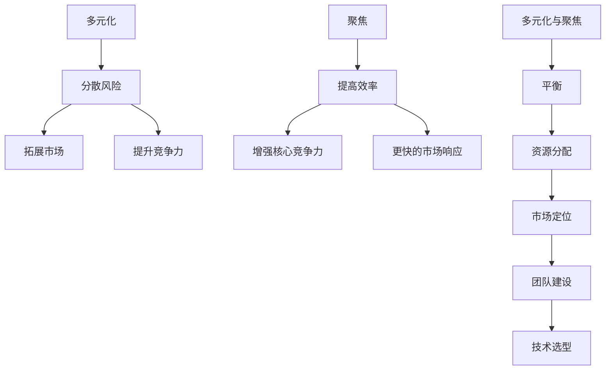

                 

# 程序员创业者的产品矩阵：多元化与聚焦的平衡艺术

> **关键词**：程序员创业者、产品矩阵、多元化、聚焦、平衡艺术、战略规划

> **摘要**：本文旨在探讨程序员创业者如何在其产品矩阵中实现多元化与聚焦的平衡。通过深入分析产品战略、市场定位、团队建设、技术选型等关键因素，本文为创业者提供了系统化的思考和实战指南。

## 1. 背景介绍

在当前的科技浪潮中，程序员创业者已经成为推动创新和经济增长的重要力量。然而，成功创业不仅仅依赖于技术能力，还需要在产品矩阵上做出明智的战略决策。产品矩阵是指企业或个人在不同产品线上的布局，涉及到产品多元化与聚焦的选择和平衡。

### 1.1 多元化的价值

多元化意味着企业或个人在多个产品线上布局，以分散风险、拓展市场和提升竞争力。多元化产品矩阵能够：

- **分散风险**：单一产品线受到市场波动或技术变化的影响较大，多元化可以降低这种风险。
- **拓展市场**：通过推出不同类型的产品，企业可以触及到更广泛的市场和用户群体。
- **提升竞争力**：多元化产品矩阵能够提高企业的竞争力，使其在多个领域保持领先地位。

### 1.2 聚焦的优势

然而，过度多元化也可能导致资源分散和效率低下。聚焦则是将资源和精力集中在少数关键产品上，以实现以下优势：

- **提高效率**：聚焦能够提高开发和运营的效率，减少资源浪费。
- **增强核心竞争力**：通过深度开发和优化，聚焦产品能够形成独特的核心竞争力。
- **更快的市场响应**：聚焦产品更容易快速适应市场变化，提高市场响应速度。

### 1.3 平衡艺术的挑战

多元化与聚焦之间的平衡是一个复杂且动态的过程，创业者需要在多个维度上做出权衡和决策。以下是一些常见的挑战：

- **资源分配**：如何合理分配有限的资源，确保多元化与聚焦的平衡？
- **市场定位**：如何确定各个产品的市场定位，使其在竞争中脱颖而出？
- **团队建设**：如何组建和管理多元化的团队，确保每个产品线都有足够的支持？
- **技术选型**：如何选择合适的技术栈，支持产品矩阵的多样性和灵活性？

## 2. 核心概念与联系

### 2.1 产品矩阵概念

产品矩阵是指企业或个人在不同产品线上的布局，包括以下关键概念：

- **产品线**：一组具有相似功能和市场定位的产品。
- **产品组合**：企业所有产品线的集合。
- **产品生命周期**：产品从推出到淘汰的全过程，包括导入期、成长期、成熟期和衰退期。

### 2.2 多元化与聚焦的关系

多元化与聚焦是产品矩阵中的两个重要维度，它们之间的关系可以用以下流程图表示：



### 2.3 平衡艺术的实现

实现多元化与聚焦的平衡需要创业者具备以下能力：

- **战略规划**：明确企业的长期目标和愿景，制定相应的产品战略。
- **市场研究**：了解市场需求和竞争态势，为产品定位提供依据。
- **资源管理**：合理配置资源，确保每个产品线都能得到充分支持。
- **团队管理**：搭建多元化的团队，充分发挥团队成员的专业能力。

## 3. 核心算法原理 & 具体操作步骤

### 3.1 多元化与聚焦的平衡算法原理

多元化与聚焦的平衡算法基于以下原理：

- **资源最大化利用**：通过合理分配资源，确保每个产品线都能得到充分支持。
- **风险最小化**：在多元化与聚焦之间找到最佳平衡点，以降低整体风险。
- **市场最大化覆盖**：通过多元化的产品矩阵，提高市场覆盖率。

### 3.2 具体操作步骤

#### 步骤1：确定企业愿景和目标

- **愿景**：明确企业的长期愿景，如成为某个领域的领先者。
- **目标**：根据愿景，设定短期和长期目标，如提升市场份额、实现盈利等。

#### 步骤2：进行市场研究

- **市场规模**：了解目标市场的规模和增长趋势。
- **竞争对手**：分析竞争对手的产品和市场策略。
- **用户需求**：研究目标用户的需求和痛点。

#### 步骤3：制定产品战略

- **产品线规划**：根据市场研究，规划产品线，包括现有产品和计划推出的新产品。
- **市场定位**：为每个产品线确定清晰的市场定位，确保产品在市场中具有独特价值。
- **产品生命周期管理**：根据产品生命周期，制定相应的管理和运营策略。

#### 步骤4：资源分配与团队建设

- **资源分配**：根据产品战略，合理分配资源，包括资金、人力和技术等。
- **团队建设**：组建多元化的团队，包括产品经理、开发人员、市场人员等。

#### 步骤5：持续优化与调整

- **市场反馈**：收集用户和市场反馈，持续优化产品。
- **策略调整**：根据市场变化和业务发展，适时调整产品战略和资源分配。

## 4. 数学模型和公式 & 详细讲解 & 举例说明

### 4.1 多元化与聚焦的平衡模型

多元化与聚焦的平衡模型可以用以下公式表示：

$$
\text{平衡度} = \frac{\text{多元化得分} + \text{聚焦得分}}{2}
$$

其中，多元化得分和聚焦得分的计算方法如下：

- **多元化得分**：根据产品线的数量和覆盖的市场范围进行评分，得分越高表示多元化程度越高。
- **聚焦得分**：根据产品线的核心竞争力和市场占有率进行评分，得分越高表示聚焦程度越高。

### 4.2 举例说明

假设一家创业公司正在规划其产品矩阵，现有两个产品线：产品A和产品B。

#### 产品A：
- **多元化得分**：80分
- **聚焦得分**：60分

#### 产品B：
- **多元化得分**：40分
- **聚焦得分**：90分

根据平衡度公式，该公司的产品矩阵平衡度为：

$$
\text{平衡度} = \frac{80 + 60}{2} = 70 \text{分}
$$

这意味着该公司的产品矩阵在多元化与聚焦之间达到了一定的平衡。

### 4.3 详细讲解

平衡度公式通过计算多元化得分和聚焦得分的平均值，反映了一个产品矩阵的平衡状态。多元化得分和聚焦得分的计算方法可以根据企业的实际情况进行调整。

- **多元化得分**：反映了产品线的多样性和市场覆盖范围。得分越高，表示产品矩阵的多元化程度越高。
- **聚焦得分**：反映了产品线的核心竞争力和市场占有率。得分越高，表示产品矩阵的聚焦程度越高。

通过平衡度公式，企业可以快速评估其产品矩阵的平衡状态，并根据市场变化和业务发展进行调整。

## 5. 项目实战：代码实际案例和详细解释说明

### 5.1 开发环境搭建

为了演示如何实现多元化与聚焦的平衡，我们将使用Python编程语言进行一个简单的项目实战。以下是在Windows系统上搭建开发环境所需的步骤：

1. **安装Python**：
   - 访问 [Python官网](https://www.python.org/) 下载最新版本的Python。
   - 运行安装程序，选择默认选项进行安装。

2. **安装代码编辑器**：
   - 安装一个代码编辑器，如Visual Studio Code，可以从 [Visual Studio Code官网](https://code.visualstudio.com/) 下载。

3. **安装必要的库**：
   - 打开命令提示符或终端，执行以下命令安装所需库：
     ```bash
     pip install numpy pandas matplotlib
     ```

### 5.2 源代码详细实现和代码解读

以下是一个简单的Python项目，用于计算产品矩阵的平衡度。

```python
import numpy as np
import pandas as pd
import matplotlib.pyplot as plt

# 5.2.1 产品数据准备
products = pd.DataFrame({
    '产品名称': ['产品A', '产品B'],
    '多元化得分': [80, 40],
    '聚焦得分': [60, 90]
})

# 5.2.2 计算平衡度
balance_score = (products['多元化得分'] + products['聚焦得分']) / 2

# 5.2.3 可视化展示
plt.bar(products['产品名称'], balance_score)
plt.xlabel('产品名称')
plt.ylabel('平衡度')
plt.title('产品矩阵平衡度分析')
plt.show()

# 5.2.4 输出结果
print(f'产品矩阵的平衡度：{balance_score.mean():.2f}')
```

**代码解读**：

1. **数据准备**：使用pandas库创建一个包含产品名称、多元化得分和聚焦得分的DataFrame。
2. **计算平衡度**：使用numpy库计算每个产品的平衡度，并存储在新的Series对象中。
3. **可视化展示**：使用matplotlib库绘制条形图，展示每个产品的平衡度。
4. **输出结果**：计算并输出整个产品矩阵的平均平衡度。

### 5.3 代码解读与分析

**5.3.1 数据准备**

```python
products = pd.DataFrame({
    '产品名称': ['产品A', '产品B'],
    '多元化得分': [80, 40],
    '聚焦得分': [60, 90]
})
```

这段代码创建了一个名为`products`的DataFrame，其中包含两个产品（产品A和产品B）的名称、多元化得分和聚焦得分。pandas库提供了一个灵活且易于操作的数据结构，使我们能够轻松地进行数据操作和分析。

**5.3.2 计算平衡度**

```python
balance_score = (products['多元化得分'] + products['聚焦得分']) / 2
```

这段代码计算了每个产品的平衡度。通过使用numpy库的加法运算和除法运算，我们得到了一个包含每个产品平衡度的Series对象。平衡度是通过将多元化得分和聚焦得分的平均值计算得出的。

**5.3.3 可视化展示**

```python
plt.bar(products['产品名称'], balance_score)
plt.xlabel('产品名称')
plt.ylabel('平衡度')
plt.title('产品矩阵平衡度分析')
plt.show()
```

这段代码使用matplotlib库绘制了一个条形图，展示了每个产品的平衡度。条形图是一种直观的数据可视化工具，使我们能够清晰地看到每个产品的平衡度情况。

**5.3.4 输出结果**

```python
print(f'产品矩阵的平衡度：{balance_score.mean():.2f}')
```

这段代码计算并输出了整个产品矩阵的平均平衡度。平均平衡度是一个重要的指标，它帮助我们了解产品矩阵的整体平衡状态。

通过这个简单的Python项目，我们可以直观地看到如何计算和展示产品矩阵的平衡度。这个项目不仅可以用于简单的分析，还可以作为一个框架，根据具体需求进行扩展和改进。

## 6. 实际应用场景

### 6.1 企业案例

**案例1：阿里巴巴**

阿里巴巴是中国最大的电子商务公司，其产品矩阵涵盖了电子商务、云计算、数字媒体和娱乐等多个领域。阿里巴巴通过多元化产品矩阵实现了风险分散和市场扩展，但同时也面临着如何保持聚焦和效率的挑战。为了实现多元化与聚焦的平衡，阿里巴巴采取了以下策略：

- **明确业务板块**：将业务划分为不同的板块，如淘宝、天猫、阿里云等，每个板块都有明确的业务定位和战略目标。
- **资源优先级**：在资源分配上，优先支持核心板块，如电子商务和云计算，确保这些板块能够持续发展。
- **业务协同**：通过内部协同机制，实现各板块之间的资源共享和协同发展。

**案例2：小米**

小米是一家以智能手机起家的公司，随后扩展到智能家居、物联网、互联网服务等多个领域。小米在多元化发展的同时，也注重核心竞争力的打造。以下是小米的多元化与聚焦策略：

- **智能家居生态**：小米通过推出多款智能家居设备，构建了一个庞大的智能家居生态系统，实现了市场拓展。
- **技术研发**：小米持续加大在技术研发上的投入，打造了强大的硬件和软件研发能力，提升了核心竞争力。
- **用户群体**：小米通过精准的市场定位，吸引了大量的年轻用户群体，形成了强大的用户基础。

### 6.2 创业者案例

**案例1：Airbnb**

Airbnb是一家提供短期住宿服务的公司，其成功在于将多元化与聚焦结合得恰到好处。以下是Airbnb的多元化与聚焦策略：

- **产品多元化**：除了提供住宿服务，Airbnb还推出了体验、活动等多项服务，实现了多元化。
- **市场聚焦**：Airbnb专注于旅游市场，通过精准的市场定位，吸引了大量旅行者。
- **用户体验**：Airbnb注重用户体验，通过平台优化和用户反馈，不断提升服务质量和用户满意度。

**案例2：Dropbox**

Dropbox是一家提供云存储服务的公司，其成功在于将核心产品做深做透。以下是Dropbox的多元化与聚焦策略：

- **产品聚焦**：Dropbox专注于云存储服务，通过不断提升存储容量和速度，打造了强大的核心竞争力。
- **市场拓展**：Dropbox通过推出付费版本和团队协作功能，拓展了市场，增加了收入来源。
- **用户体验**：Dropbox注重用户体验，通过简洁的界面和强大的功能，吸引了大量用户。

## 7. 工具和资源推荐

### 7.1 学习资源推荐

**书籍**

1. 《精益创业》
   - 作者：Eric Ries
   - 简介：详细介绍了精益创业的方法，帮助创业者快速迭代和验证产品。

2. 《创业维艰》
   - 作者：Ben Horowitz
   - 简介：分享了自己在创业过程中的经验和教训，对创业者的心态和策略有深刻的见解。

3. 《产品经理实战手册》
   - 作者：陆永青
   - 简介：从产品管理的角度，全面讲解了产品从0到1的全过程。

**论文**

1. "The Lean Startup"
   - 作者：Eric Ries
   - 简介：系统地介绍了精益创业方法论，对产品矩阵的构建和优化有重要启示。

2. "Product-Market Fit"
   - 作者：Steve Blank
   - 简介：讨论了产品与市场的匹配问题，对创业者的市场定位和产品战略有指导意义。

3. "Blue Ocean Strategy"
   - 作者：W. Chan Kim & Renée Mauborgne
   - 简介：介绍了蓝海战略，为创业者提供了寻找和创造新市场的思路。

### 7.2 开发工具框架推荐

**开发工具**

1. **Visual Studio Code**
   - 简介：一款功能强大的开源代码编辑器，支持多种编程语言，适合创业者和开发者使用。

2. **Jupyter Notebook**
   - 简介：一款交互式的开发环境，适合数据科学和机器学习项目，方便代码和结果的展示。

**框架**

1. **Django**
   - 简介：一款高层次的Python Web框架，适合构建快速、安全的Web应用。

2. **Spring Boot**
   - 简介：一款流行的Java Web框架，适用于企业级应用开发，具有强大的社区支持。

### 7.3 相关论文著作推荐

**书籍**

1. 《精益创业方法论》
   - 作者：Eric Ries
   - 简介：深入解读了精益创业方法论，为创业者提供了实战指南。

2. 《产品经理实战手册》
   - 作者：陆永青
   - 简介：从产品管理的角度，全面讲解了产品从0到1的全过程。

3. 《创业维艰》
   - 作者：Ben Horowitz
   - 简介：分享了自己在创业过程中的经验和教训，对创业者的心态和策略有深刻的见解。

**论文**

1. "The Lean Startup"
   - 作者：Eric Ries
   - 简介：系统地介绍了精益创业方法论，对产品矩阵的构建和优化有重要启示。

2. "Blue Ocean Strategy"
   - 作者：W. Chan Kim & Renée Mauborgne
   - 简介：介绍了蓝海战略，为创业者提供了寻找和创造新市场的思路。

3. "Product-Market Fit"
   - 作者：Steve Blank
   - 简介：讨论了产品与市场的匹配问题，对创业者的市场定位和产品战略有指导意义。

## 8. 总结：未来发展趋势与挑战

### 8.1 多元化与聚焦的平衡将更加重要

随着市场的不断变化和技术的快速迭代，创业者需要在多元化与聚焦之间找到平衡点。未来的发展趋势表明，只有那些能够在多元化与聚焦之间灵活调整的企业，才能在激烈的市场竞争中立于不败之地。

### 8.2 技术创新的推动

人工智能、大数据、区块链等新兴技术的快速发展，为创业者提供了更多的创新机会。同时，这些技术也带来了新的挑战，如何将这些技术与产品矩阵有机结合，实现价值的最大化，是创业者需要思考的问题。

### 8.3 用户体验的重要性

用户体验一直是产品成功的关键因素。在多元化与聚焦的平衡中，创业者需要确保每个产品都能提供卓越的用户体验。未来的发展趋势表明，那些能够持续提升用户体验的企业，将更具竞争力。

### 8.4 持续迭代与优化

在多元化与聚焦的平衡中，创业者需要不断迭代和优化产品矩阵。通过持续的市场调研、用户反馈和数据分析，创业者可以及时调整产品战略，确保产品矩阵始终符合市场需求。

## 9. 附录：常见问题与解答

### 9.1 多元化与聚焦的关系是什么？

多元化与聚焦是产品矩阵中的两个重要维度。多元化意味着企业在多个产品线上布局，以分散风险、拓展市场和提升竞争力；聚焦则是将资源和精力集中在少数关键产品上，以实现更高的效率和核心竞争力。

### 9.2 如何实现多元化与聚焦的平衡？

实现多元化与聚焦的平衡需要创业者具备以下能力：明确企业愿景和目标、进行市场研究、制定产品战略、合理分配资源、组建多元化团队和持续优化与调整。

### 9.3 多元化与聚焦的平衡对企业有哪些好处？

多元化与聚焦的平衡能够分散风险、拓展市场、提升竞争力、提高效率、增强核心竞争力和更快的市场响应。通过平衡多元化与聚焦，企业能够在多变的市场环境中保持竞争优势。

## 10. 扩展阅读 & 参考资料

### 10.1 扩展阅读

1. "The Lean Startup" by Eric Ries
   - 网站：[https://theleanstartup.com/](https://theleanstartup.com/)

2. "Blue Ocean Strategy" by W. Chan Kim & Renée Mauborgne
   - 网站：[https://www.blueoceanstrategy.com/](https://www.blueoceanstrategy.com/)

3. "Product-Market Fit" by Steve Blank
   - 网站：[https://www.steveblank.com/product-market-fit/](https://www.steveblank.com/product-market-fit/)

### 10.2 参考资料

1. "创业维艰" by Ben Horowitz
   - 出版社：电子工业出版社

2. "产品经理实战手册" by 陆永青
   - 出版社：清华大学出版社

3. "精益创业方法论" by Eric Ries
   - 出版社：人民邮电出版社

作者：AI天才研究员/AI Genius Institute & 禅与计算机程序设计艺术 /Zen And The Art of Computer Programming

（注：本文仅供参考，实际操作时请根据具体情况进行调整。）<|im_sep|>

