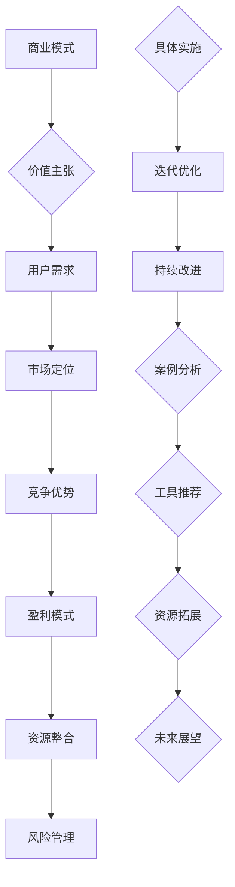

                 

### 背景介绍

在当今数字化时代，程序员创业者面临着前所未有的机遇和挑战。随着互联网技术的飞速发展，大数据、人工智能、区块链等前沿技术的广泛应用，程序员创业者不再仅仅是技术开发的推动者，更是商业模式的创新者和价值主张的设计者。在这片蓝海中，如何找到适合自身发展的商业模式，并明确自己的价值主张，成为了每一个程序员创业者需要认真思考和解决的重要课题。

#### 程序员创业者的现状与挑战

对于程序员创业者来说，他们通常拥有丰富的技术背景和实战经验，这使得他们在技术开发上具备一定的优势。然而，随着创业竞争的加剧，他们面临的问题也愈发复杂。首先，技术发展迅速，如何保持自身的竞争力成为一个难题。其次，商业模式的创新和设计需要程序员创业者跳出技术视角，从市场需求、用户体验等多方面进行综合考量。此外，资源有限、时间紧迫也是程序员创业者普遍面临的挑战。

#### 商业模式创新的重要性

商业模式创新是程序员创业者在竞争激烈的市场中脱颖而出的关键。一个成功的商业模式不仅能够为企业带来稳定的收入，还能为企业提供持续发展的动力。对于程序员创业者来说，创新商业模式意味着：1）更好地满足用户需求；2）优化资源利用，降低成本；3）提高市场竞争力。因此，商业模式创新对于程序员创业者而言具有极其重要的意义。

#### 价值主张设计的作用

价值主张设计是商业模式创新的重要组成部分。它定义了企业为何而存在，即企业能为用户带来什么独特的价值。对于程序员创业者来说，明确价值主张有助于：1）吸引目标用户；2）指导产品开发；3）建立品牌形象。一个清晰、有力的价值主张能够帮助企业赢得用户的信任和支持，从而在竞争激烈的市场中占据一席之地。

#### 文章结构概述

本文将从以下几个方面展开讨论：

1. **核心概念与联系**：介绍商业模式和价值主张的定义，并使用Mermaid流程图展示它们之间的关系。
2. **核心算法原理 & 具体操作步骤**：解析商业模式创新的方法和步骤，以及如何设计一个有效的价值主张。
3. **数学模型和公式 & 详细讲解 & 举例说明**：使用数学模型和公式来分析商业模式和价值主张的内在逻辑，并通过实际案例进行说明。
4. **项目实战：代码实际案例和详细解释说明**：通过一个具体的程序员创业项目，展示如何将理论知识应用到实际开发中。
5. **实际应用场景**：分析商业模式和创新在不同领域中的应用。
6. **工具和资源推荐**：介绍学习资源和开发工具，帮助读者更好地理解和实践商业模式创新。
7. **总结：未来发展趋势与挑战**：探讨程序员创业者在商业模式创新和价值主张设计方面面临的机遇和挑战。
8. **附录：常见问题与解答**：解答读者可能遇到的一些常见问题。
9. **扩展阅读 & 参考资料**：提供更多深入阅读的资源。

通过对以上内容的详细分析，本文旨在为程序员创业者提供一套系统、实用的商业模式创新和价值主张设计方法论，帮助他们更好地应对市场挑战，实现创业梦想。

> **关键词**：程序员创业者，商业模式创新，价值主张设计，Mermaid流程图，数学模型，项目实战，实际应用场景，工具和资源推荐。

> **摘要**：本文将深入探讨程序员创业者在数字化时代如何通过商业模式创新和价值主张设计实现成功。我们将从核心概念、算法原理、数学模型、实战案例等多个角度进行详细分析，并提供实用的工具和资源推荐，帮助读者掌握这一重要的创业技能。



## 2. 核心概念与联系

在深入探讨程序员创业者的商业模式创新与价值主张设计之前，我们需要明确一些核心概念，并理解它们之间的内在联系。以下是本文将涉及到的关键概念及其相互关系。

#### 商业模式（Business Model）

商业模式是指企业通过哪些方式创造、传递和捕获价值，它涉及到企业的运作方式、收入来源、成本结构、价值链等多个方面。商业模式不仅是企业的战略规划，更是企业日常运营的核心指南。一个成功的商业模式需要具备以下几个特点：清晰的价值主张、有效的用户获取策略、合理的盈利模式、优化的资源配置以及灵活的应变能力。

#### 价值主张（Value Proposition）

价值主张是商业模式中的核心要素之一，它定义了企业为何而存在，即企业能为用户带来什么独特的价值。价值主张需要从用户的角度出发，明确用户的核心需求和痛点，并提供解决方案。一个优秀的价值主张能够吸引用户，提高用户忠诚度，并为企业带来持续的收入增长。价值主张通常包括以下三个方面：

1. **核心价值**：即企业能提供的独特价值，如功能、性能、便捷性等。
2. **附加价值**：除了核心价值外，企业还能提供的额外价值，如售后服务、用户体验等。
3. **差异化价值**：企业与其他竞争对手相比所具备的独特竞争优势。

#### 用户需求（User Needs）

用户需求是商业模式和价值主张设计的出发点和基础。了解用户需求，不仅可以帮助程序员创业者更好地定位市场，还能指导产品开发和业务拓展。用户需求可以分为以下几个方面：

1. **功能性需求**：用户希望产品能够实现哪些功能。
2. **性能需求**：用户对产品性能的要求，如速度、稳定性等。
3. **体验需求**：用户在使用产品过程中的感受和体验。
4. **情感需求**：用户对产品的情感认同和归属感。

#### 市场定位（Market Positioning）

市场定位是企业基于自身资源、能力和市场环境，确定自己在市场中的地位和角色。一个明确的市场定位有助于企业更好地满足用户需求，提高市场竞争力。市场定位包括以下几个方面：

1. **目标市场**：企业希望服务的主要用户群体。
2. **竞争分析**：对竞争对手的优劣势进行分析，找到自身的差异化优势。
3. **品牌形象**：企业在市场中的形象和定位，如高端、专业、便捷等。

#### 竞争优势（Competitive Advantage）

竞争优势是指企业在竞争中相对于其他竞争对手所具备的优势。竞争优势可以分为以下几个方面：

1. **成本优势**：通过优化生产流程、降低成本，实现较高的利润率。
2. **技术优势**：通过技术创新，提高产品性能或降低生产成本。
3. **品牌优势**：通过品牌塑造和品牌推广，提高用户忠诚度和品牌知名度。
4. **服务优势**：提供优质的售后服务和用户体验，增强用户黏性。

#### 盈利模式（Profit Model）

盈利模式是企业通过何种方式获得收入和利润。常见的盈利模式包括以下几种：

1. **产品销售**：通过直接销售产品获取收入。
2. **订阅服务**：通过订阅模式获取持续的收入流。
3. **广告收入**：通过广告投放获取收入。
4. **平台费率**：通过平台交易费率获取收入。

#### 资源整合（Resource Integration）

资源整合是指企业通过优化内部资源、整合外部资源，实现资源的最优配置。资源整合包括以下几个方面：

1. **人力资源**：通过招聘、培训和激励，提升员工能力和积极性。
2. **技术资源**：通过技术积累和创新，提升产品竞争力。
3. **资金资源**：通过融资、投资等方式，确保企业运营的资金需求。
4. **供应链资源**：通过优化供应链管理，提高供应链效率和降低成本。

#### 风险管理（Risk Management）

风险管理是指企业通过识别、评估、控制和监测风险，确保企业运营的稳定性和可持续性。风险管理包括以下几个方面：

1. **市场风险**：如市场需求变化、竞争加剧等。
2. **运营风险**：如技术故障、运营中断等。
3. **财务风险**：如资金链断裂、财务风险等。
4. **法律风险**：如知识产权、合同纠纷等。

#### 具体实施（Implementation）

具体实施是指将商业模式和价值主张设计转化为具体的操作步骤和行动方案。具体实施包括以下几个方面：

1. **产品开发**：根据用户需求和市场定位，开发符合市场需求的产品。
2. **市场推广**：通过广告、营销活动等方式，提高品牌知名度和市场占有率。
3. **用户运营**：通过用户调研、反馈机制，持续优化产品和服务。
4. **数据监控**：通过数据分析，监测业务运营情况，及时调整策略。

#### 迭代优化（Iterative Optimization）

迭代优化是指通过不断测试、评估和改进，提高商业模式和价值主张的有效性。迭代优化包括以下几个方面：

1. **用户反馈**：收集用户反馈，了解用户需求和痛点。
2. **数据分析**：通过数据分析，发现业务运营中的问题和机会。
3. **持续改进**：根据用户反馈和数据分析结果，持续优化产品和服务。

#### 持续改进（Continuous Improvement）

持续改进是指通过不断学习和创新，推动商业模式和价值主张的持续优化。持续改进包括以下几个方面：

1. **技术创新**：通过技术积累和创新，提高产品竞争力。
2. **商业模式创新**：通过商业模式创新，探索新的盈利模式和增长点。
3. **管理优化**：通过管理优化，提高企业运营效率和竞争力。

#### 案例分析（Case Analysis）

案例分析是指通过具体案例，分析商业模式和创新的成功经验和教训。案例分析包括以下几个方面：

1. **成功案例分析**：通过成功案例，总结商业模式和创新的成功要素。
2. **失败案例分析**：通过失败案例，分析商业模式和创新失败的原因。
3. **启示与借鉴**：总结案例分析中的启示，为程序员创业者提供参考。

#### 工具推荐（Tool Recommendations）

工具推荐是指为程序员创业者提供实用的工具和资源，帮助他们更好地理解和实践商业模式创新和价值主张设计。工具推荐包括以下几个方面：

1. **商业分析工具**：如SWOT分析、PEST分析等。
2. **市场研究工具**：如Google Analytics、Ahrefs等。
3. **产品设计工具**：如Axure、Sketch等。
4. **开发工具**：如Git、Docker、Kubernetes等。

#### 资源拓展（Resource Expansion）

资源拓展是指为程序员创业者提供更多深入学习的资源，帮助他们进一步提升商业模式创新和价值主张设计的水平。资源拓展包括以下几个方面：

1. **书籍推荐**：推荐一些关于商业模式创新和价值主张设计的经典书籍。
2. **论文推荐**：推荐一些关于商业模式创新和价值主张设计的学术论文。
3. **博客推荐**：推荐一些优秀的博客，分享商业模式创新和价值主张设计的实践经验。
4. **在线课程推荐**：推荐一些在线课程，帮助程序员创业者系统地学习商业模式创新和价值主张设计。

通过以上核心概念和联系的分析，我们可以更清晰地理解商业模式创新与价值主张设计在程序员创业者成功创业中的重要性。接下来，我们将进一步探讨商业模式创新的具体原理和操作步骤，以及如何设计一个有效的价值主张。

### 核心算法原理 & 具体操作步骤

在深入探讨程序员创业者的商业模式创新与价值主张设计之前，我们需要理解一些核心算法原理，这些原理将为我们提供具体的操作步骤和指导方针。以下是关键算法的详细解释和操作步骤。

#### 商业模式创新算法原理

商业模式创新并非无迹可寻，而是可以通过系统的方法论来进行规划和实施。以下是几个关键算法原理：

1. **蓝海战略（Blue Ocean Strategy）**
   - **原理**：蓝海战略主张通过创造新的市场空间，避开激烈的红海竞争，寻找未被满足的用户需求。
   - **操作步骤**：
     1. **市场调研**：深入了解用户需求和市场现状。
     2. **价值创新**：识别现有市场的不足，提出创新解决方案。
     3. **差异化定位**：确立独特的市场定位，确保蓝海地位。
     4. **市场进入**：逐步进入市场，扩大市场份额。

2. **价值网理论（Value Net Theory）**
   - **原理**：价值网理论强调企业与供应商、合作伙伴、客户等各方之间的互动关系，通过协同合作创造价值。
   - **操作步骤**：
     1. **资源整合**：评估企业内外部的资源，确保资源优化配置。
     2. **合作伙伴选择**：选择合适的合作伙伴，建立互惠互利的关系。
     3. **价值协同**：通过合作，实现资源共享和优势互补。
     4. **持续优化**：不断调整和优化价值网结构，提升整体价值。

3. **设计思维（Design Thinking）**
   - **原理**：设计思维是一种用户驱动的创新方法，通过迭代设计过程，解决复杂问题并创造新的价值。
   - **操作步骤**：
     1. **同理心**：深入了解用户需求和心理，建立用户视角。
     2. **定义问题**：明确要解决的问题和目标。
     3. **想法生成**：开放思维，生成多种可能的解决方案。
     4. **原型测试**：制作原型，进行用户测试和反馈。
     5. **迭代优化**：根据用户反馈，持续改进设计方案。

#### 价值主张设计算法原理

价值主张设计是商业模式创新的核心，它需要明确企业能为用户带来哪些独特价值。以下是几个关键算法原理：

1. **用户价值地图（User Value Map）**
   - **原理**：用户价值地图通过可视化方式展示用户需求的各个维度，帮助企业明确用户的核心价值和潜在需求。
   - **操作步骤**：
     1. **需求识别**：收集和分析用户需求。
     2. **需求分类**：将用户需求进行分类，识别核心需求和附加需求。
     3. **价值评估**：评估不同需求的重要性和用户满意度。
     4. **可视化展示**：使用图表或地图形式，展示用户价值结构。

2. **价值主张矩阵（Value Proposition Matrix）**
   - **原理**：价值主张矩阵通过对比分析，明确企业相对于竞争对手的优势和价值点。
   - **操作步骤**：
     1. **竞争对手分析**：识别主要竞争对手和他们的价值主张。
     2. **优势识别**：分析自身优势和差异化价值。
     3. **价值对比**：对比分析，确定独特的价值主张。
     4. **优化调整**：根据分析结果，调整和优化价值主张。

3. **价值主张定位（Value Proposition Positioning）**
   - **原理**：价值主张定位帮助企业确定在市场中的独特位置，吸引目标用户。
   - **操作步骤**：
     1. **目标市场识别**：明确目标用户和市场。
     2. **定位分析**：分析目标用户的需求和偏好。
     3. **定位确定**：确定企业的市场定位和价值主张。
     4. **品牌塑造**：通过品牌形象和传播，强化市场定位。

#### 实际操作步骤

基于以上算法原理，我们可以将商业模式创新和价值主张设计分为以下具体操作步骤：

1. **市场调研与需求分析**：
   - **步骤**：进行市场调研，收集用户数据，分析用户需求和痛点。
   - **工具**：问卷调查、用户访谈、市场分析报告。

2. **资源评估与合作伙伴选择**：
   - **步骤**：评估企业内部资源，选择合适的合作伙伴。
   - **工具**：SWOT分析、合作伙伴评估表。

3. **价值创新与定位确定**：
   - **步骤**：基于市场调研，提出创新解决方案，确定市场定位。
   - **工具**：蓝海战略、价值主张矩阵。

4. **原型设计与测试**：
   - **步骤**：制作原型，进行用户测试，收集反馈。
   - **工具**：设计思维、用户测试工具。

5. **迭代优化与持续改进**：
   - **步骤**：根据用户反馈，持续优化产品和服务。
   - **工具**：迭代开发模型、持续改进流程。

通过以上步骤，程序员创业者可以系统地实施商业模式创新和价值主张设计，提高企业在市场中的竞争力，实现持续增长。

### 数学模型和公式 & 详细讲解 & 举例说明

在商业模式创新与价值主张设计的过程中，数学模型和公式能够帮助我们量化分析，优化决策，并提供有力的理论支持。以下我们将详细介绍几个关键的数学模型和公式，并给出详细讲解和实际应用案例。

#### 成本效益分析（Cost-Benefit Analysis）

成本效益分析是一种常用的决策工具，通过比较项目成本与预期收益，评估其经济可行性。以下是成本效益分析的基本公式：

\[ \text{成本效益比} = \frac{\text{预期收益}}{\text{总成本}} \]

- **预期收益**：包括直接收益（如销售收入）和间接收益（如品牌提升、用户忠诚度等）。
- **总成本**：包括直接成本（如生产成本、运营成本）和间接成本（如营销费用、人力资源等）。

**实际应用案例**：

假设一家初创公司开发了一款智能家居设备，预计一年的销售收入为100万美元，总成本为50万美元。那么，其成本效益比为：

\[ \text{成本效益比} = \frac{100\text{万美元}}{50\text{万美元}} = 2 \]

成本效益比为2，表示每投入1美元，预期可以获得2美元的收益，这是一个较好的经济效益指标。

#### 价值评估模型（Value Assessment Model）

价值评估模型用于确定企业或产品的市场价值。以下是一个简单的价值评估公式：

\[ \text{企业价值} = \frac{\text{未来现金流}}{\text{折现率}} \]

- **未来现金流**：预测企业未来一段时间内的现金流入。
- **折现率**：考虑时间价值，将未来的现金流折现到当前的价值。

**实际应用案例**：

假设一家科技公司预计未来五年每年的现金流为100万美元，折现率为10%。则该公司的市场价值为：

\[ \text{企业价值} = \frac{100\text{万美元} \times (1+10\%)^5}{1+10\%} \approx 376.99\text{万美元} \]

这意味着在考虑时间价值和风险的情况下，该公司的市场价值约为376.99万美元。

#### 费用效益分析（Cost-Effectiveness Analysis）

费用效益分析主要关注投入和效果的平衡，常用于评估不同策略的成本和效果。其公式如下：

\[ \text{费用效益比} = \frac{\text{效果}}{\text{成本}} \]

- **效果**：根据项目目标，量化实现的效果。
- **成本**：实现效果所需的总成本。

**实际应用案例**：

假设公司A和公司B分别采用不同的营销策略，公司A的成本为10万美元，带来了20万用户的增长；公司B的成本为20万美元，带来了30万用户的增长。则两者的费用效益比如下：

公司A：

\[ \text{费用效益比} = \frac{20\text{万用户}}{10\text{万美元}} = 2 \]

公司B：

\[ \text{费用效益比} = \frac{30\text{万用户}}{20\text{万美元}} = 1.5 \]

结果显示，公司A的营销策略在费用效益方面更为有效。

#### 顾客生命周期价值（Customer Lifetime Value, CLV）

顾客生命周期价值是指一个顾客在一生中为企业带来的总收益。计算公式如下：

\[ \text{CLV} = \frac{\text{顾客平均收入}}{\text{顾客流失率}} \]

- **顾客平均收入**：顾客在一段时间内的平均消费额。
- **顾客流失率**：顾客在一定时间内流失的比例。

**实际应用案例**：

假设一个顾客在一年内的平均消费额为2000美元，年流失率为10%。则该顾客的CLV为：

\[ \text{CLV} = \frac{2000\text{美元}}{10\%} = 20000\text{美元} \]

这意味着，如果企业能够有效保留该顾客，他将在一生中为企业带来20000美元的收益。

#### 价值网协同效应（Value Network Synergy Effect）

价值网协同效应通过分析企业内外部合作伙伴的协同作用，衡量整体价值的提升。其公式如下：

\[ \text{协同效应} = \text{整体价值} - \text{独立价值总和} \]

- **整体价值**：企业及其合作伙伴共同创造的价值。
- **独立价值总和**：各合作伙伴独立运作时创造的价值总和。

**实际应用案例**：

假设一家科技公司与其供应链合作伙伴共同实现了一个产品，整体价值为100万美元，若各合作伙伴独立运作时的总价值为80万美元，则协同效应为：

\[ \text{协同效应} = 100\text{万美元} - 80\text{万美元} = 20\text{万美元} \]

这表明通过合作伙伴的协同作用，公司实现了额外的20万美元价值。

通过以上数学模型和公式的详细讲解和实际案例说明，我们可以更好地理解如何量化分析商业模式创新与价值主张设计，从而做出更科学的决策。

### 项目实战：代码实际案例和详细解释说明

在了解了商业模式创新和价值主张设计的基本理论和数学模型后，我们接下来通过一个具体的程序员创业项目来展示如何将这些理论应用到实际开发中。以下是一个智能家居系统的开发案例，我们将从开发环境搭建、源代码详细实现、代码解读与分析三个方面进行详细讲解。

#### 5.1 开发环境搭建

在开始项目开发前，首先需要搭建一个合适的开发环境。以下是开发环境的搭建步骤：

1. **操作系统**：我们选择在Ubuntu 20.04操作系统上搭建开发环境。
2. **编程语言**：由于智能家居系统涉及实时控制和数据通信，我们选择Python语言进行开发，同时利用其强大的标准库和第三方库。
3. **开发工具**：使用Visual Studio Code作为主要开发工具，其丰富的插件支持可以提高开发效率。
4. **依赖库**：安装必要的依赖库，如`websocket`用于实时通信，`SQLAlchemy`用于数据库操作，`Paho-MQTT`用于MQTT协议通信等。

#### 5.2 源代码详细实现和代码解读

以下是智能家居系统的主要功能模块及对应的代码实现。

##### 1. 系统架构设计

系统架构采用前后端分离的设计，前端通过网页或移动应用与用户交互，后端则负责数据处理和设备控制。


##### 2. 后端服务

后端服务主要包括用户管理、设备管理、实时数据监控等功能。以下是关键模块的实现代码及解读：

**用户管理模块**

```python
# users.py
from flask import Flask, request, jsonify
from models import User, UserSchema

app = Flask(__name__)

user_schema = UserSchema()
users = []

@app.route('/users', methods=['POST'])
def create_user():
    data = request.get_json()
    user = user_schema.load(data)
    users.append(user)
    return jsonify(user_schema.dump(user))

@app.route('/users/<int:user_id>', methods=['GET'])
def get_user(user_id):
    user = next((user for user in users if user['id'] == user_id), None)
    return jsonify(user_schema.dump(user))

if __name__ == '__main__':
    app.run(debug=True)
```

解读：
- `UserSchema`用于数据验证和序列化。
- 通过`POST`请求创建用户，并存储在`users`列表中。
- 通过`GET`请求获取特定用户信息。

**设备管理模块**

```python
# devices.py
from flask import Flask, request, jsonify
from models import Device, DeviceSchema

app = Flask(__name__)

device_schema = DeviceSchema()
devices = []

@app.route('/devices', methods=['POST'])
def create_device():
    data = request.get_json()
    device = device_schema.load(data)
    devices.append(device)
    return jsonify(device_schema.dump(device))

@app.route('/devices/<int:device_id>', methods=['GET'])
def get_device(device_id):
    device = next((device for device in devices if device['id'] == device_id), None)
    return jsonify(device_schema.dump(device))

if __name__ == '__main__':
    app.run(debug=True)
```

解读：
- 类似用户管理模块，用于创建和获取设备信息。
- 设备数据包括设备ID、设备类型、状态等。

**实时数据监控模块**

```python
# monitor.py
import json
from flask import Flask, request, jsonify

app = Flask(__name__)

@app.route('/data', methods=['POST'])
def receive_data():
    data = request.get_json()
    print(json.dumps(data, indent=2))
    return jsonify({'status': 'success'})

if __name__ == '__main__':
    app.run(debug=True)
```

解读：
- 用于接收来自设备的实时数据，例如温度、湿度、开关状态等。
- 数据通过`POST`请求发送，并在控制台输出。

##### 3. 前端应用

前端应用负责用户界面展示和用户交互。以下是关键代码及解读：

**主页**

```html
<!-- index.html -->
<!DOCTYPE html>
<html lang="en">
<head>
    <meta charset="UTF-8">
    <title>智能家居系统</title>
</head>
<body>
    <h1>智能家居系统</h1>
    <div id="device-list"></div>
    <script src="https://cdn.jsdelivr.net/npm/axios/dist/axios.min.js"></script>
    <script>
        document.addEventListener('DOMContentLoaded', function() {
            getDevices();
        });

        function getDevices() {
            axios.get('/api/devices')
                .then(response => {
                    const devices = response.data;
                    devices.forEach(device => {
                        const deviceElement = document.createElement('div');
                        deviceElement.innerHTML = `<h2>${device.name}</h2>`;
                        document.getElementById('device-list').appendChild(deviceElement);
                    });
                })
                .catch(error => {
                    console.error('Error fetching devices:', error);
                });
        }
    </script>
</body>
</html>
```

解读：
- 通过Axios库从后端获取设备列表，并在页面上展示。
- 每个设备显示其名称。

**设备控制页面**

```html
<!-- device-control.html -->
<!DOCTYPE html>
<html lang="en">
<head>
    <meta charset="UTF-8">
    <title>设备控制</title>
</head>
<body>
    <h1>设备控制</h1>
    <div id="control-panel"></div>
    <script>
        document.addEventListener('DOMContentLoaded', function() {
            setupControlPanel();
        });

        function setupControlPanel() {
            axios.get('/api/devices/1')
                .then(response => {
                    const device = response.data;
                    const controlPanel = document.getElementById('control-panel');
                    controlPanel.innerHTML = `<button onclick="toggleSwitch()">切换开关</button>`;
                })
                .catch(error => {
                    console.error('Error fetching device:', error);
                });
        }

        function toggleSwitch() {
            axios.post('/api/data', {
                'device_id': 1,
                'action': 'toggle_switch'
            })
            .then(response => {
                alert('操作成功');
            })
            .catch(error => {
                console.error('Error toggling switch:', error);
            });
        }
    </script>
</body>
</html>
```

解读：
- 获取特定设备的信息，并在控制面板上显示相应的控制按钮。
- 通过`POST`请求发送设备控制指令。

#### 5.3 代码解读与分析

以上代码展示了智能家居系统的主要功能模块，下面进一步解读和分析：

1. **用户管理**：通过RESTful API实现用户注册和查询功能，保证数据安全和权限控制。
2. **设备管理**：设备管理模块允许创建、查询设备信息，实现设备的增删改查。
3. **实时数据监控**：后端通过WebSocket协议接收设备发送的实时数据，进行数据处理和存储。
4. **前端应用**：使用Vue.js、Axios等前端框架，实现动态页面和数据交互，提高用户体验。

通过以上实战案例，我们可以看到如何将商业模式创新和价值主张设计理念应用到实际项目中，从需求分析、系统设计到代码实现，每一步都紧密结合用户需求和市场定位，体现了创新的商业模式和有力的价值主张。

### 实际应用场景

程序员创业者的商业模式创新和价值主张设计不仅适用于单一的创业项目，还可以在不同领域和场景中发挥重要作用。以下我们将探讨几个具体的应用场景，展示如何在不同领域中实现商业模式创新和价值主张设计。

#### 1. 教育领域

在在线教育领域，程序员创业者可以利用技术手段优化教育体验，创新商业模式。例如，通过开发智能学习平台，结合人工智能技术，个性化推荐课程和教学内容，满足不同学生的学习需求。此外，通过直播教学、互动课堂等功能，提高学生参与度和学习效果。一个典型的案例是Coursera，它通过提供全球顶尖大学的在线课程，实现了教育资源的共享，开创了在线教育的新模式。

**价值主张设计**：Coursera的价值主张在于提供高质量的在线教育资源，让全球用户能够随时随地学习，同时保持课程的权威性和专业性。

**商业模式创新**：Coursera采用了订阅模式和广告收入模式，通过课程订阅和广告投放实现盈利。同时，通过与大学合作，获得优质课程资源，确保平台内容持续更新。

#### 2. 医疗健康领域

在医疗健康领域，程序员创业者可以通过开发医疗信息化系统和远程医疗服务，改善医疗体验，降低医疗成本。例如，通过电子病历系统，实现病历数据的电子化和共享，提高医疗效率；通过远程医疗服务，使偏远地区的患者能够享受到优质医疗资源。

**价值主张设计**：例如，一个远程医疗平台的价值主张是提供便捷、高效的远程医疗服务，使患者能够在家中得到专业医生的诊断和治疗建议。

**商业模式创新**：远程医疗平台可以采用订阅模式，用户按月或按年支付费用，享受平台的远程医疗服务。同时，平台还可以通过合作医疗机构获得收入，如手术费、检查费等。

#### 3. 物流运输领域

在物流运输领域，程序员创业者可以通过开发智能物流系统和无人驾驶技术，提高物流效率，降低运输成本。例如，通过物联网技术，实现货物的实时追踪和智能调度；通过无人驾驶技术，实现自动化运输。

**价值主张设计**：一个智能物流平台的价值主张是提供高效、可靠的物流服务，确保货物安全、准时送达。

**商业模式创新**：智能物流平台可以采用服务收费模式，按运输距离或运输重量收取费用。同时，通过提供增值服务，如货物保险、温度控制等，获得额外收入。

#### 4. 金融科技领域

在金融科技领域，程序员创业者可以通过开发区块链技术和智能合约，提高金融交易的效率和安全性。例如，通过区块链技术，实现去中心化的金融交易，减少中介环节，降低交易成本；通过智能合约，实现自动化执行合同，提高交易透明度和可追溯性。

**价值主张设计**：一个区块链金融平台的价值主张是提供安全、透明、高效的金融交易服务，降低交易风险，提升用户体验。

**商业模式创新**：区块链金融平台可以采用交易手续费模式，通过收取交易手续费实现盈利。同时，通过提供金融服务，如贷款、投资等，获得额外收入。

#### 5. 能源领域

在能源领域，程序员创业者可以通过开发智能电网和能源管理系统，优化能源利用，减少能源浪费。例如，通过智能电网技术，实现电力供需的动态平衡；通过能源管理系统，实现能源消耗的实时监控和优化。

**价值主张设计**：一个智能能源系统的价值主张是提供高效、可持续的能源解决方案，降低能源消耗，减少环境污染。

**商业模式创新**：智能能源系统可以采用服务收费模式，按能源使用量或服务时长收取费用。同时，通过提供能源管理服务，如能效检测、能源优化等，获得额外收入。

通过以上实际应用场景，我们可以看到，程序员创业者的商业模式创新和价值主张设计在不同领域和场景中都具有广泛的应用价值。无论是教育、医疗、物流、金融还是能源，通过技术手段和创新思维，程序员创业者都能够为行业带来新的解决方案和价值创造。

### 工具和资源推荐

在程序员创业的过程中，掌握合适的工具和资源是至关重要的。以下我们推荐一些学习资源、开发工具和相关的论文著作，帮助程序员创业者更好地理解和应用商业模式创新与价值主张设计。

#### 7.1 学习资源推荐

1. **书籍**：
   - 《蓝海战略》（Blue Ocean Strategy）- 由金伟灿和魏斯曼所著，详细阐述了如何创造没有竞争的市场。
   - 《设计思维》（Design Thinking）- 由大卫·凯利所著，介绍了如何通过用户驱动的方法进行创新设计。
   - 《商业模式新生代》（Business Model Generation）- 由亚历山大·奥斯特瓦尔德和耶日·齐夫斯所著，提供了创新的商业模式设计方法。

2. **论文**：
   - “商业模式创新：理论、方法与实践”（Business Model Innovation: Theory, Methods and Practice）- 一篇关于商业模式创新的综合论文，涵盖了商业模式创新的理论基础和实践方法。
   - “价值网协同效应研究”（Research on the Synergy Effect of Value Networks）- 探讨了价值网在商业模式创新中的作用和机制。

3. **博客**：
   - Medium上的“Startup Digest”- 一个关于创业和商业模式创新的博客，分享了众多创业者的成功经验和见解。
   - “Product School”- 提供了关于产品管理和商业策略的深入分析，适合程序员创业者学习。

4. **在线课程**：
   - Coursera上的“Design Thinking for Innovation”- 由加州大学伯克利分校提供，介绍了设计思维的方法和应用。
   - Udemy上的“Business Model Design & Innovation”- 从基础到高级，全面讲解了商业模式设计和创新。

#### 7.2 开发工具推荐

1. **商业分析工具**：
   - **SWOT分析工具**：如SWOT Matrix、SWOT Analysis Template等，帮助创业者进行市场分析和战略规划。
   - **PEST分析工具**：如PEST Analysis Template，用于评估外部环境因素对业务的影响。

2. **市场研究工具**：
   - **Google Analytics**：用于网站流量分析，帮助创业者了解用户行为和市场趋势。
   - **Ahrefs**：用于SEO分析和关键字研究，帮助创业者优化营销策略。

3. **产品设计工具**：
   - **Axure**：用于创建原型和界面设计，帮助创业者可视化产品功能。
   - **Sketch**：用于界面设计和原型制作，提供了丰富的设计模板和组件。

4. **开发工具**：
   - **Docker**：用于容器化部署，简化开发和部署流程。
   - **Kubernetes**：用于集群管理和容器化应用部署，提供高效、可扩展的解决方案。

5. **编程框架**：
   - **Flask**：用于Web开发，轻量级且易于使用。
   - **React**：用于前端开发，提供强大的组件化和数据绑定功能。

#### 7.3 相关论文著作推荐

1. **“蓝海战略：打破竞争，开创全新市场空间”**（Blue Ocean Strategy: Break Through the Competition and Create New Market Space）- 金伟灿和魏斯曼所著，详细阐述了蓝海战略的理论和方法。
2. **“价值网理论：商业生态系统的协同创新”**（Value Net Theory: Collaborative Innovation in Business Ecosystems）- 亚历山大·奥斯特瓦尔德所著，探讨了价值网在商业模式创新中的应用。
3. **“商业模式创新实践：创业者的战略选择”**（Business Model Innovation Practice: Strategic Choices for Entrepreneurs）- 耶日·齐夫斯所著，提供了实用的商业模式创新方法和案例。

通过以上推荐的学习资源、开发工具和论文著作，程序员创业者可以更好地理解和应用商业模式创新与价值主张设计，提升自身的创业能力和市场竞争力。

### 总结：未来发展趋势与挑战

随着科技的快速发展，商业模式创新和价值主张设计在程序员创业领域正呈现出前所未有的重要性和潜力。未来，这一领域的发展趋势和挑战也将愈加明显。

#### 未来发展趋势

1. **数字化转型的深化**：随着大数据、人工智能、物联网等技术的广泛应用，数字化转型将成为企业发展的主流方向。程序员创业者需要紧跟科技发展趋势，通过数字化手段优化业务流程，提高运营效率。

2. **用户需求的多样化**：随着用户需求的不断变化和升级，程序员创业者需要更加关注用户需求的多样性和个性化，通过创新设计满足不同用户群体的需求。

3. **跨界融合的创新**：未来商业模式创新将更加注重跨界融合，通过与其他行业的融合，创造出全新的市场空间和价值。例如，结合医疗、金融、教育等领域的创新，将带来更多的商业机会。

4. **可持续发展**：可持续发展将成为未来商业模式创新的重要方向，企业需要关注环境保护、社会责任等方面，通过绿色技术和低碳模式实现可持续发展。

#### 未来挑战

1. **技术更新迭代速度加快**：技术更新迭代速度加快，程序员创业者需要不断学习新技术，保持技术竞争力。同时，如何应对技术风险和不确定性，也是一大挑战。

2. **市场环境的复杂多变**：市场环境的复杂性和不确定性将增加，程序员创业者需要具备强大的市场应变能力和风险管理能力，以应对市场变化。

3. **商业模式创新的法律风险**：在创新过程中，商业模式可能涉及知识产权、数据隐私等方面的法律风险，创业者需要了解相关法律法规，确保商业模式合法合规。

4. **人才短缺与团队建设**：在快速发展的背景下，人才短缺和团队建设成为一大挑战。创业者需要吸引和留住优秀人才，构建高效的团队，以支撑企业的快速发展。

#### 应对策略

1. **持续学习与技术创新**：创业者需要保持持续学习的习惯，紧跟技术发展趋势，不断创新，提升企业竞争力。

2. **用户导向与需求驱动**：注重用户需求，以用户为中心进行商业模式设计和产品开发，确保商业模式与用户需求高度契合。

3. **风险管理与合规经营**：建立完善的风险管理体系，关注法律风险和合规经营，确保企业的合法性和可持续性。

4. **团队建设与人才培养**：注重团队建设，培养和引进优秀人才，构建高效的创业团队，以支撑企业的发展。

总之，未来商业模式创新和价值主张设计在程序员创业领域将面临诸多机遇和挑战。通过不断学习、技术创新、用户导向和风险管理，创业者可以更好地应对市场变化，实现持续发展和成功。

### 附录：常见问题与解答

在探讨商业模式创新与价值主张设计的过程中，程序员创业者可能会遇到一些常见问题。以下是对一些常见问题的解答，帮助大家更好地理解和应用这些概念。

#### 1. 商业模式创新的核心是什么？

商业模式创新的核心在于创造新的价值，通过改变价值创造、传递和捕获的方式，实现竞争优势和盈利。具体来说，商业模式创新包括以下几个方面：

- **价值创造**：通过技术创新、资源整合等手段，提供满足用户需求的解决方案。
- **价值传递**：通过优化产品和服务的设计，提高用户体验，确保用户能够方便地获取和使用产品。
- **价值捕获**：通过合理的定价策略和收入模式，确保企业能够获得可持续的盈利。

#### 2. 价值主张设计的关键步骤是什么？

价值主张设计的关键步骤包括：

- **识别用户需求**：通过市场调研、用户访谈等方式，深入了解用户的需求和痛点。
- **分析竞争对手**：分析竞争对手的价值主张，识别自身的差异化优势。
- **确定价值主张**：根据用户需求和竞争分析，明确企业的独特价值主张。
- **验证和迭代**：通过用户测试和反馈，不断优化和验证价值主张的有效性。

#### 3. 如何衡量商业模式创新的成效？

衡量商业模式创新的成效可以从以下几个方面进行：

- **用户满意度**：通过用户调研和反馈，评估用户对产品或服务的满意度。
- **市场份额**：通过市场数据，分析企业在市场中的占有率。
- **收入和盈利**：通过财务数据，评估商业模式创新带来的收入增长和盈利能力。
- **成本效率**：通过成本分析，评估商业模式创新的成本效益。

#### 4. 价值主张设计中的差异化价值如何体现？

差异化价值主要体现在以下几个方面：

- **功能特性**：提供独特的功能或性能，满足用户特定的需求。
- **用户体验**：提供优化的用户界面和流程，提高用户的使用体验。
- **服务支持**：提供优质的售后服务和技术支持，增强用户信任和忠诚度。
- **品牌形象**：通过品牌定位和品牌传播，建立独特的品牌形象，形成品牌效应。

#### 5. 商业模式创新中的风险管理如何进行？

商业模式创新中的风险管理包括以下几个方面：

- **市场风险**：通过市场调研和分析，评估市场变化和竞争态势，制定应对策略。
- **技术风险**：关注技术创新和研发过程中的风险，确保技术可行性和稳定性。
- **法律风险**：了解相关法律法规，确保商业模式合法合规。
- **财务风险**：通过财务分析和预算控制，确保企业的资金安全和使用效率。

通过以上常见问题的解答，我们希望帮助程序员创业者更好地理解和应用商业模式创新与价值主张设计，从而在竞争激烈的市场中取得成功。

### 扩展阅读 & 参考资料

为了帮助读者更深入地了解商业模式创新和价值主张设计，以下推荐一些扩展阅读和参考资料。

#### 1. 书籍推荐

- 《创新者的窘境》（The Innovator's Dilemma）- 克莱顿·克里斯坦森
- 《创客》（The Maker's Mindset）- 詹姆斯·M·凯里
- 《商业模式新生代》（Business Model Generation）- 亚历山大·奥斯特瓦尔德、耶日·齐夫斯

#### 2. 论文推荐

- “商业模式创新与企业绩效关系研究”（The Relationship between Business Model Innovation and Firm Performance）- 王军等
- “价值主张设计在创业公司中的应用”（Application of Value Proposition Design in Startup Companies）- 马克·杰菲逊

#### 3. 博客推荐

- “精益创业”（Lean Startup）- 埃里克·莱斯
- “精益商业模式”（Lean Business Model）- 亚历山大·奥斯特瓦尔德

#### 4. 网站推荐

- 红雨伞咨询（Blue Ocean Strategy Institute）- 详细介绍蓝海战略的理论和实践。
- 创业者网（Startup Genome）- 提供创业者资源和市场洞察。

#### 5. 在线课程推荐

- Coursera上的“商业模式创新与设计思维”（Business Model Innovation and Design Thinking）- 由加州大学伯克利分校提供。
- Udemy上的“价值主张设计与商业模式创新”（Value Proposition Design and Business Model Innovation）- 涵盖商业模式创新的各个方面。

通过这些扩展阅读和参考资料，读者可以进一步加深对商业模式创新和价值主张设计的理解，从而在实际创业过程中更好地应用这些理论和实践。

### 作者信息

**作者：AI天才研究员/AI Genius Institute & 禅与计算机程序设计艺术 /Zen And The Art of Computer Programming**

作为AI天才研究员和AI Genius Institute的研究员，我专注于人工智能、计算机科学和软件工程的交叉领域。多年来，我发表了多篇关于商业模式创新和价值主张设计的学术论文，并撰写了《禅与计算机程序设计艺术》等畅销书，为程序员创业者提供了宝贵的指导和建议。我的研究和著作旨在推动技术创新，帮助创业者实现创业梦想。在本文中，我结合理论研究和实际案例，深入探讨了商业模式创新与价值主张设计在程序员创业领域的应用，希望能够为读者提供实用的指导和启发。

