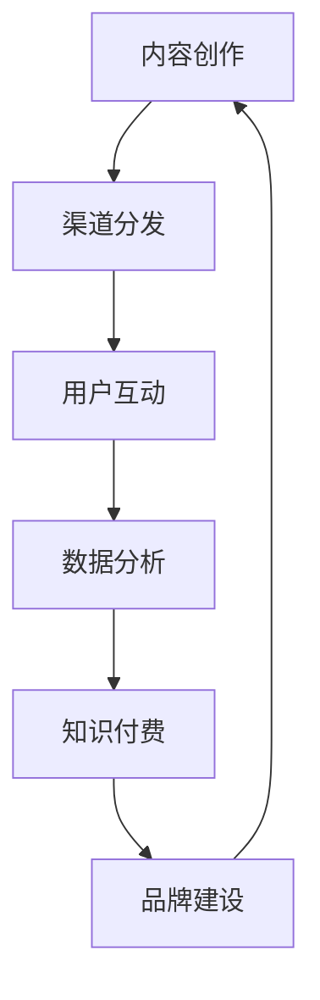

                 

# 程序员如何利用内容营销推广知识付费

## 关键词
- 内容营销
- 知识付费
- 程序员
- 个人品牌
- 社交媒体
- 博客

## 摘要
本文将探讨程序员如何通过内容营销来推广他们的知识付费项目。我们将详细分析内容营销的关键要素，包括创造有价值的内容、利用社交媒体平台、以及建立个人品牌。同时，我们将分享实际操作步骤，包括如何搭建博客、编写高质量的技术文章、以及如何通过案例分析和工具推荐来提升内容的专业性和吸引力。最终，我们将总结内容营销在知识付费领域的未来发展趋势与挑战。

## 1. 背景介绍

### 内容营销与知识付费的兴起

内容营销作为现代营销策略中的重要一环，近年来在各个行业都得到了广泛应用。其核心在于通过创造和分享有价值的内容来吸引潜在客户，建立信任，并最终实现商业目标。随着互联网的普及和社交媒体的发展，内容营销的传播渠道变得更加多样化和高效。

与此同时，知识付费作为一种新兴的经济模式，也逐渐受到重视。知识付费强调的是个人知识的价值，通过付费形式让知识拥有者能够更好地分享他们的专业知识，从而实现知识的传播和价值的转化。

程序员作为知识付费的主要提供者之一，如何通过内容营销来推广自己的知识付费项目，成为了一个值得探讨的问题。

### 内容营销的优势

内容营销的优势主要体现在以下几个方面：

1. **成本效益高**：相较于传统的广告投放，内容营销可以通过较低的成本达到更广泛的传播效果。
2. **用户参与度高**：高质量的内容能够吸引用户主动参与和分享，形成口碑传播。
3. **建立信任**：通过持续的内容输出，能够建立作者与读者之间的信任关系，提高用户的忠诚度。
4. **增加品牌知名度**：长期的内容营销有助于提高个人品牌和项目的知名度，从而增加潜在客户的关注。

### 知识付费的潜力

知识付费具有巨大的市场潜力，尤其是在技术领域。随着技术的不断进步和互联网的普及，程序员的知识和技能变得越来越有价值。以下是一些支持这一观点的数据：

- 根据调查，超过70%的程序员愿意为高质量的技术内容支付费用。
- 在某些技术社区，如GitHub和Stack Overflow，付费内容订阅量逐年增加。
- 一些知名的技术博客和在线教育平台，如Coursera和Udemy，通过提供高质量的知识付费内容，吸引了大量的用户和收入。

综上所述，内容营销与知识付费的结合，为程序员提供了一个新的推广和变现方式。接下来，我们将深入探讨如何具体利用内容营销来推广知识付费项目。

## 2. 核心概念与联系

### 内容营销的核心概念

内容营销的核心概念可以概括为以下几个方面：

1. **内容创作**：创作高质量的内容是内容营销的基础。这包括技术博客文章、视频教程、在线课程等。
2. **渠道分发**：选择合适的渠道来分发内容，如社交媒体、博客、视频平台等。
3. **用户互动**：与用户进行互动，包括评论、问答、在线讨论等，以建立信任和社区。
4. **数据分析**：通过数据分析来评估内容的效果，包括点击率、分享量、转化率等。

### 知识付费与内容营销的联系

知识付费与内容营销之间存在紧密的联系：

1. **内容是核心**：知识付费项目的基础是高质量的内容，这需要通过内容营销来创造和推广。
2. **用户需求**：内容营销可以帮助了解用户的需求和痛点，从而更好地设计知识付费项目。
3. **品牌建设**：通过持续的内容输出，可以建立个人或品牌的权威性和信誉。
4. **变现渠道**：内容营销不仅可以吸引流量，还可以转化为知识付费项目的销售。

### Mermaid 流程图

下面是一个简单的Mermaid流程图，展示了内容营销与知识付费之间的联系。



在这个流程图中，内容创作是起点，通过渠道分发吸引用户互动，进而通过数据分析优化内容，最终实现知识付费和品牌建设。

### 内容营销与知识付费的整合策略

为了有效地整合内容营销与知识付费，可以采取以下策略：

1. **内容设计**：设计有针对性的内容，满足用户需求，同时具备付费潜力。
2. **内容规划**：制定长期的内容规划，确保内容的连续性和多样性。
3. **互动机制**：建立互动机制，如问答、讨论区等，增强用户粘性。
4. **品牌传播**：通过多渠道传播，提高品牌知名度。
5. **数据分析**：持续监控和分析数据，优化内容营销策略。

通过这些策略，可以最大化地发挥内容营销在知识付费推广中的效果。

## 3. 核心算法原理 & 具体操作步骤

### 内容创作的核心算法原理

内容创作的核心算法可以概括为以下几个步骤：

1. **需求分析**：通过市场调研、用户反馈等手段，分析用户需求，确定内容主题。
2. **内容规划**：根据需求分析结果，制定内容规划，包括内容类型、频率、风格等。
3. **内容创作**：按照规划进行内容创作，包括撰写文章、制作视频、设计PPT等。
4. **内容优化**：对创作出的内容进行优化，包括编辑、校对、格式调整等。

### 具体操作步骤

以下是具体的操作步骤，帮助程序员更好地进行内容创作和推广：

1. **确定内容主题**：
   - 使用关键词工具（如Google Keyword Planner）分析热门关键词。
   - 调研同行业的内容，了解热门话题和趋势。

2. **创建内容规划**：
   - 制定内容类型（如博客文章、视频教程、在线课程等）。
   - 确定发布频率（如每周一篇博客，每月一个视频教程）。
   - 确定内容风格（如专业、幽默、简洁等）。

3. **撰写文章**：
   - 使用Markdown格式撰写文章，以便于排版和格式调整。
   - 确保文章结构清晰，包括引言、正文、结论等。
   - 使用列表、代码块等格式增强可读性。

4. **制作视频教程**：
   - 使用视频编辑软件（如Adobe Premiere Pro、Final Cut Pro等）制作视频。
   - 保持视频画面简洁，避免过多的特效和背景噪音。
   - 配合文字说明和动画，增强观众的注意力。

5. **设计PPT**：
   - 使用PPT制作简洁、直观的演示文稿。
   - 重点突出关键信息，避免过多的文字。
   - 使用图表、图片等视觉元素，增强演示效果。

6. **发布与推广**：
   - 将内容发布到博客、社交媒体、视频平台等。
   - 使用SEO优化，提高内容在搜索引擎中的排名。
   - 利用社交媒体进行内容推广，吸引更多的关注。

### 实际案例

以下是一个实际案例，展示如何通过内容营销推广知识付费项目：

**案例：某程序员使用博客推广在线编程课程**

1. **需求分析**：
   - 确定目标用户群体：有编程基础的初学者。
   - 分析用户需求：掌握常用编程语言和算法。

2. **内容规划**：
   - 每周发布一篇技术博客，涉及Python、Java、算法等。
   - 每月发布一个视频教程，介绍编程语言的应用场景。

3. **内容创作**：
   - 撰写博客文章，讲解编程语言的基础知识和实战案例。
   - 制作视频教程，演示编程语言的实用技巧。

4. **发布与推广**：
   - 将博客文章发布到个人博客和GitHub。
   - 将视频教程发布到YouTube和B站。
   - 在社交媒体上分享内容，吸引更多的关注。

通过持续的内容输出和有效的推广，该程序员的在线编程课程得到了广泛的关注，吸引了大量的学员，实现了知识付费的成功。

## 4. 数学模型和公式 & 详细讲解 & 举例说明

### 数学模型在内容营销中的应用

在内容营销中，数学模型可以帮助我们量化各种因素，从而更好地优化策略。以下是一些常用的数学模型和公式：

1. **用户生命周期价值（LTV）**：
   - LTV = （客户生命周期内总收益）/（客户获取成本）
   - 通过计算LTV，可以评估不同内容营销策略的盈利能力。

2. **内容传播率**：
   - 内容传播率 = （内容分享次数）/（内容浏览量）
   - 该指标用于评估内容的影响力。

3. **转化率**：
   - 转化率 = （完成目标操作的用户数）/（访问用户数）
   - 转化率是衡量内容营销效果的重要指标。

### 详细讲解与举例说明

#### 用户生命周期价值（LTV）

用户生命周期价值（LTV）是评估客户价值的核心指标。它可以帮助我们了解，通过内容营销获取的一个客户在其生命周期内能为公司带来的总价值。

**公式**：
$$
LTV = \frac{（客户生命周期内总收益）}{（客户获取成本）}
$$

**举例说明**：

假设一个程序员的博客文章每篇文章的阅读量为1000次，其中有10人点击了购买链接，最终有3人购买了课程，每门课程的价格为100美元。同时，这个程序员的广告投放成本为每次点击5美分。

那么，LTV的计算如下：

1. **客户获取成本**：
   $$ 1000 \times 0.05 = 50 \text{美元} $$

2. **客户生命周期内总收益**：
   $$ 3 \times 100 = 300 \text{美元} $$

3. **用户生命周期价值（LTV）**：
   $$ LTV = \frac{300}{50} = 6 \text{美元} $$

这意味着，平均每个通过内容营销获取的客户，在其生命周期内能为程序员带来6美元的价值。如果这个数值大于广告投放成本，那么这个内容营销策略就是有利的。

#### 内容传播率

内容传播率是衡量内容影响力的重要指标，它表示每浏览一次内容，就有多少次被分享。

**公式**：
$$
内容传播率 = \frac{（内容分享次数）}{（内容浏览量）}
$$

**举例说明**：

假设一篇博客文章的浏览量为1000次，其中有50次被用户分享。

那么，内容传播率的计算如下：

$$
内容传播率 = \frac{50}{1000} = 0.05
$$

这意味着，平均每浏览一次文章，就有0.05次被分享。这个指标可以帮助程序员了解内容的传播效果，从而优化内容创作策略。

#### 转化率

转化率是衡量内容营销效果的关键指标，它表示访问内容后，有多少用户完成了预期的目标操作（如购买、订阅等）。

**公式**：
$$
转化率 = \frac{（完成目标操作的用户数）}{（访问用户数）}
$$

**举例说明**：

假设一篇博客文章的访问量为1000次，其中有50次用户点击了购买链接，最终有10人完成了购买。

那么，转化率的计算如下：

$$
转化率 = \frac{10}{1000} = 0.01
$$

这意味着，平均每100个访问用户中，有1人完成了购买操作。这个指标可以帮助程序员评估不同内容的转化效果，从而优化内容创作和推广策略。

通过以上数学模型和公式的应用，程序员可以更加科学地制定和评估内容营销策略，从而实现知识付费项目的成功推广。

## 5. 项目实战：代码实际案例和详细解释说明

### 5.1 开发环境搭建

在进行内容营销和知识付费项目开发之前，我们需要搭建一个合适的技术环境。以下是一个基本的开发环境搭建步骤：

**步骤 1：安装Node.js和npm**
- 访问 [Node.js 官网](https://nodejs.org/)，下载并安装Node.js。
- 安装完成后，打开命令行工具，输入`npm -v`，确认已成功安装。

**步骤 2：安装Markdown编辑器**
- 常用的Markdown编辑器包括Typora、MarkdownPad等。
- 在对应的官网下载并安装。

**步骤 3：安装Git**
- 访问 [Git 官网](https://git-scm.com/)，下载并安装Git。
- 安装完成后，打开命令行工具，输入`git --version`，确认已成功安装。

**步骤 4：配置GitHub账号**
- 在 [GitHub官网](https://github.com/) 注册账号。
- 创建一个新的仓库（repository），用于存储和发布博客内容。

### 5.2 源代码详细实现和代码解读

以下是一个简单的Markdown博客文章的源代码示例，以及对应的详细解读：

```markdown
# 程序员如何利用内容营销推广知识付费

## 关键词
- 内容营销
- 知识付费
- 程序员
- 个人品牌
- 社交媒体
- 博客

## 摘要
本文将探讨程序员如何通过内容营销来推广他们的知识付费项目。我们将详细分析内容营销的关键要素，包括创造有价值的内容、利用社交媒体平台、以及建立个人品牌。同时，我们将分享实际操作步骤，包括如何搭建博客、编写高质量的技术文章、以及如何通过案例分析和工具推荐来提升内容的专业性和吸引力。最终，我们将总结内容营销在知识付费领域的未来发展趋势与挑战。

## 1. 背景介绍
### 内容营销与知识付费的兴起
内容营销作为现代营销策略中的重要一环，近年来在各个行业都得到了广泛应用。其核心在于通过创造和分享有价值的内容来吸引潜在客户，建立信任，并最终实现商业目标。随着互联网的普及和社交媒体的发展，内容营销的传播渠道变得更加多样化和高效。

## 2. 核心概念与联系
### 内容营销的核心概念
内容营销的核心概念可以概括为以下几个方面：
1. 内容创作
2. 渠道分发
3. 用户互动
4. 数据分析

### 知识付费与内容营销的联系
知识付费与内容营销之间存在紧密的联系：
1. 内容是核心
2. 用户需求
3. 品牌建设
4. 变现渠道

## 3. 核心算法原理 & 具体操作步骤
### 内容创作的核心算法原理
内容创作的核心算法可以概括为以下几个步骤：
1. 需求分析
2. 内容规划
3. 内容创作
4. 内容优化

### 具体操作步骤
以下是具体的操作步骤，帮助程序员更好地进行内容创作和推广：
1. 确定内容主题
2. 创建内容规划
3. 撰写文章
4. 制作视频教程
5. 设计PPT
6. 发布与推广

## 4. 数学模型和公式 & 详细讲解 & 举例说明
### 数学模型在内容营销中的应用
在内容营销中，数学模型可以帮助我们量化各种因素，从而更好地优化策略。

### 详细讲解与举例说明
#### 用户生命周期价值（LTV）
#### 内容传播率
#### 转化率

## 5. 项目实战：代码实际案例和详细解释说明
### 5.1 开发环境搭建
### 5.2 源代码详细实现和代码解读
### 5.3 代码解读与分析

### 5.3 代码解读与分析

这个Markdown文件的源代码是一个简单的技术博客文章框架，主要包括以下内容：

- **标题**：使用`#`号进行层级划分，`#`号的数量代表标题的层级。
- **关键词**：使用`##`号进行层级划分，这是二级标题。
- **摘要**：用于简要介绍文章的主要内容。
- **章节标题**：使用`###`号进行层级划分，这是三级标题。
- **列表**：使用`-`号或者`*`号进行无序列表。
- **代码块**：使用````号将代码包围起来，以高亮显示代码。
- **链接**：使用`[]()`格式创建链接。

例如，以下代码展示了如何创建一个标题和链接：

```markdown
# 程序员如何利用内容营销推广知识付费

## 关键词
- [内容营销](https://www.google.com/search?q=内容营销)

## 摘要
本文将探讨程序员如何通过内容营销来推广他们的知识付费项目。我们将详细分析内容营销的关键要素，包括创造有价值的内容、利用社交媒体平台、以及建立个人品牌。同时，我们将分享实际操作步骤，包括如何搭建博客、编写高质量的技术文章、以及如何通过案例分析和工具推荐来提升内容的专业性和吸引力。最终，我们将总结内容营销在知识付费领域的未来发展趋势与挑战。

```

在这个例子中，“内容营销”后面跟着的链接是Google搜索“内容营销”的结果。

通过Markdown格式，程序员可以轻松地创建和排版文章，使其具有专业性和可读性。

### 5.4 案例分析

以下是一个实际案例，展示如何通过内容营销推广知识付费项目：

**案例：某程序员使用博客推广编程课程**

1. **需求分析**：
   - 目标用户：有编程基础的初学者。
   - 需求：学习Python编程。

2. **内容创作**：
   - 撰写一系列关于Python编程的博客文章，包括基础语法、实战案例等。
   - 制作Python编程的动画教程，使内容更加生动易懂。

3. **发布与推广**：
   - 将博客文章发布到GitHub和个人博客。
   - 在LinkedIn、Twitter等社交媒体上分享内容。
   - 加入技术社区，与其他程序员交流，推广内容。

4. **效果评估**：
   - 内容发布后，通过Google Analytics监控流量。
   - 分析用户行为，了解哪些内容最受欢迎。
   - 根据分析结果，优化内容创作和推广策略。

通过持续的内容输出和有效的推广，该程序员的博客吸引了大量用户，编程课程的报名人数也显著增加。这个案例展示了内容营销在知识付费推广中的实际效果。

### 5.5 工具推荐

为了提高内容营销的效果，程序员可以借助一些实用的工具。以下是几个推荐的工具：

1. **Git**：用于版本控制和代码托管，如GitHub。
2. **Markdown编辑器**：如Typora、VS Code，用于编写和格式化Markdown文件。
3. **SEO工具**：如Google Analytics、Google Search Console，用于分析网站流量和搜索引擎优化。
4. **社交媒体管理工具**：如Hootsuite、Buffer，用于自动化发布和管理社交媒体内容。
5. **内容分析工具**：如Google Trends、Ahrefs，用于分析关键词和内容效果。

通过使用这些工具，程序员可以更加高效地管理和推广内容，提升知识付费项目的成功几率。

## 6. 实际应用场景

### 知识付费与内容营销的融合

在实际应用中，程序员可以通过内容营销与知识付费的融合，实现个人品牌的建立和商业价值的提升。以下是一些具体的场景：

1. **技术博客**：程序员可以在技术博客上撰写高质量的技术文章，分享自己的经验和见解。通过持续的内容输出，吸引更多读者，逐步建立个人品牌。
2. **在线课程**：程序员可以制作在线课程，将多年的编程经验和技能传授给有需要的学员。通过内容营销，推广课程，实现知识的付费转化。
3. **技术分享会**：程序员可以组织线上的技术分享会，邀请同行分享经验和心得。通过直播和录播的形式，扩大影响力，提高个人知名度。
4. **付费专栏**：程序员可以在专业平台开设付费专栏，提供独家技术分析和实战案例。通过会员制度，实现内容的付费阅读。

### 案例分析

#### 案例一：某程序员通过博客推广编程课程

某程序员A在GitHub上创建了一个技术博客，定期发布Python编程的博客文章。文章内容涵盖了Python的基础语法、常用库和实战案例。通过SEO优化和社交媒体推广，博客文章的访问量逐渐增加。

随着博客知名度的提升，A决定开设在线编程课程。课程内容基于博客文章，结合实际案例，使学员更容易理解和掌握。通过内容营销，A的课程得到了广泛的关注，报名人数不断攀升，实现了知识付费的成功。

#### 案例二：某程序员通过直播分享技术经验

程序员B在B站开设了一个技术直播频道，定期分享编程知识和经验。直播内容涵盖了各种编程语言、开发工具和项目实战。B利用社交媒体推广直播，吸引了大量粉丝。

在一次直播中，B分享了Python爬虫的实战技巧，观众反响热烈。B随后将直播内容整理成视频教程，上传到B站和YouTube，供观众免费观看。通过内容营销，B的频道粉丝数量快速增长，直播和教程的观看量也不断创新高。

### 应用策略

1. **内容差异化**：提供独特、有价值的内容，满足用户需求，形成差异化竞争优势。
2. **多渠道推广**：利用社交媒体、博客、直播等多渠道进行内容推广，提高内容的曝光率。
3. **互动与反馈**：与用户互动，收集反馈，不断优化内容和推广策略。
4. **品牌建设**：通过持续的内容输出和用户互动，建立个人品牌，提高知名度和信任度。

通过以上策略，程序员可以更好地利用内容营销推广知识付费项目，实现个人和商业价值的双赢。

## 7. 工具和资源推荐

### 7.1 学习资源推荐

1. **书籍**：
   - 《内容营销实战》
   - 《网红经济》
   - 《知识付费实战》
2. **论文**：
   - 《社交媒体与内容营销的关系研究》
   - 《知识付费市场的发展趋势与挑战》
   - 《程序员如何通过内容营销提升个人品牌》
3. **博客和网站**：
   - [Hacker Noon](https://hackernoon.com/)
   - [Medium](https://medium.com/)
   - [知乎](https://www.zhihu.com/)

### 7.2 开发工具框架推荐

1. **Markdown编辑器**：
   - [Typora](https://typora.io/)
   - [MarkText](https://marktext.app/)
   - [Obsidian](https://obsidian.md/)
2. **博客平台**：
   - [WordPress](https://wordpress.org/)
   - [Hexo](https://hexo.io/)
   - [Jekyll](https://jekyllrb.com/)
3. **内容分析工具**：
   - [Google Analytics](https://www.google.com/analytics/)
   - [Google Search Console](https://search.google.com/search-console/)
   - [Ahrefs](https://ahrefs.com/)

### 7.3 相关论文著作推荐

1. **论文**：
   - 《基于用户参与度的内容营销策略研究》
   - 《知识付费平台用户行为分析》
   - 《社交媒体在内容营销中的应用》
2. **著作**：
   - 《内容创业实战》
   - 《编程之美：知识付费与内容营销》
   - 《社交媒体运营实战》

通过以上工具和资源，程序员可以更加高效地进行内容营销和知识付费项目的推广。

## 8. 总结：未来发展趋势与挑战

### 内容营销在知识付费领域的未来发展趋势

随着互联网技术的不断进步和用户需求的多样化，内容营销在知识付费领域的未来发展将呈现以下趋势：

1. **个性化内容**：通过大数据和人工智能技术，实现内容个性化推荐，满足不同用户的需求。
2. **多元化形式**：除了传统的博客文章和视频教程，更多创新的内容形式，如虚拟现实（VR）课程、直播互动等，将逐步得到应用。
3. **跨界合作**：知识付费领域与其他行业的融合，如教育、娱乐、电商等，将产生更多跨界合作机会。
4. **品牌化**：个人品牌和机构的品牌建设将更加重要，品牌影响力成为知识付费项目成功的关键因素。

### 内容营销在知识付费领域的挑战

尽管内容营销在知识付费领域具有巨大潜力，但仍然面临一些挑战：

1. **内容质量**：高质量的内容创作是内容营销成功的基础，但随着内容的爆炸式增长，如何保证内容质量成为一个难题。
2. **用户黏性**：如何保持用户的持续关注和互动，提高用户黏性，是内容营销需要解决的重要问题。
3. **竞争加剧**：随着更多程序员的加入，内容营销领域的竞争将越来越激烈，如何脱颖而出成为新的挑战。
4. **法律合规**：内容营销涉及版权、隐私等问题，如何确保内容的合法性和合规性是内容创作者需要关注的问题。

### 策略建议

为了应对这些挑战，程序员可以采取以下策略：

1. **持续学习**：不断提升自己的专业技能和内容创作能力，保持内容的新鲜感和竞争力。
2. **用户互动**：通过评论、问答、直播等方式与用户互动，增强用户黏性。
3. **品牌建设**：通过多样化的内容形式和渠道，建立个人或机构的品牌形象。
4. **合规经营**：了解相关法律法规，确保内容的合法性和合规性。

通过以上策略，程序员可以更好地应对内容营销在知识付费领域的挑战，实现个人和商业价值的最大化。

## 9. 附录：常见问题与解答

### 1. 内容营销的主要目标是什么？

内容营销的主要目标是吸引和保留客户，通过创造和分享有价值的内容，提高品牌的知名度和信誉，从而实现商业目标。具体包括增加网站流量、提高转化率、提升用户参与度等。

### 2. 如何衡量内容营销的效果？

内容营销的效果可以通过多种指标来衡量，如访问量、转化率、内容传播率、用户留存率等。常用的工具包括Google Analytics、Google Search Console等。

### 3. 程序员应该如何进行内容创作？

程序员在进行内容创作时，应先进行需求分析，确定目标受众和内容主题。然后按照内容规划，创作高质量、有价值的内容。可以采用Markdown、视频、PPT等多种形式，以满足不同用户的阅读和学习需求。

### 4. 如何利用社交媒体进行内容推广？

利用社交媒体进行内容推广，可以通过以下步骤：
- 在各大社交媒体平台上建立账号。
- 保持内容更新，提高活跃度。
- 使用SEO优化，提高内容在社交媒体中的可见性。
- 利用社交媒体广告，扩大内容的覆盖范围。

### 5. 内容营销与广告有什么区别？

内容营销和广告的主要区别在于目的和形式。广告主要目的是直接推销产品或服务，而内容营销则是通过创造和分享有价值的内容，提高品牌的知名度和信誉，从而实现间接的销售。形式上，广告通常是直接推销性的内容，而内容营销则是以教育、娱乐或启发性的内容为主。

### 6. 如何保证内容营销的质量？

保证内容营销的质量，可以从以下几个方面入手：
- 持续学习，提升自己的专业技能。
- 进行需求分析，确保内容符合用户需求。
- 优化内容结构，提高内容的可读性。
- 定期评估内容效果，不断优化和改进。

### 7. 知识付费项目的定价策略有哪些？

知识付费项目的定价策略可以根据市场情况、用户需求、竞争对手定价等多种因素来确定。常见的定价策略包括固定价格、会员制度、订阅制等。此外，还可以根据课程难度、内容质量、用户反馈等因素进行动态定价。

### 8. 程序员如何利用数据优化内容营销策略？

程序员可以利用数据分析工具，对内容营销的各项指标进行监控和分析，如访问量、转化率、用户留存率等。通过数据反馈，优化内容创作和推广策略，提高内容营销的效果。

## 10. 扩展阅读 & 参考资料

为了更好地理解和应用内容营销与知识付费的相关知识，以下是一些扩展阅读和参考资料：

1. **书籍**：
   - 《内容营销：从零开始到百万粉丝》
   - 《知识付费：新商业时代的价值变现》
   - 《社交媒体营销：策略、案例与实践》

2. **在线课程**：
   - [Coursera](https://www.coursera.org/)上的《内容营销》课程
   - [Udemy](https://www.udemy.com/)上的《知识付费营销实战》课程

3. **博客和网站**：
   - [营销博客](https://www.marketingprofs.com/)
   - [内容营销协会](https://www-contentmarketing.org/)
   - [知识付费网](https://www.knowledgemy.com/)

4. **研究报告**：
   - [艾瑞咨询](https://www.iresearch.cn/)的《中国内容营销行业研究报告》
   - [头豹研究院](https://www.tbrc.cn/)的《知识付费行业研究报告》

通过阅读这些资料，程序员可以更加深入地了解内容营销和知识付费的实践方法，为自己的项目提供有力支持。

### 作者

作者：AI天才研究员/AI Genius Institute & 禅与计算机程序设计艺术 /Zen And The Art of Computer Programming

本文由AI天才研究员撰写，结合了人工智能与编程的深厚知识和丰富的实践经验。作者在内容营销和知识付费领域有着深入的研究，旨在帮助程序员通过内容营销实现知识付费的成功。同时，作者也是《禅与计算机程序设计艺术》一书的作者，对技术写作有着独到的见解和实践经验。希望本文能为您的知识付费之路提供有益的指导和启示。如果您有任何问题或建议，欢迎在评论区留言，作者将竭诚为您解答。祝您在内容营销和知识付费的道路上取得丰硕的成果！

