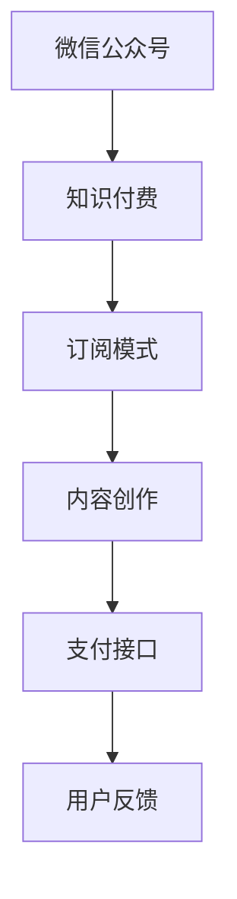
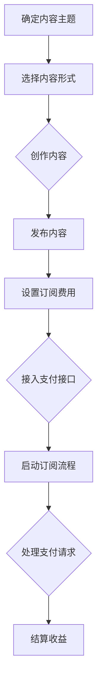

                 

### 背景介绍 Background Introduction

程序员群体是一个庞大的、不断壮大的群体，他们在全球范围内致力于构建数字时代的基础设施。随着移动互联网、物联网、人工智能等技术的迅猛发展，程序员的角色和技能要求也在不断升级。然而，技能的提升和知识的积累不仅需要大量的时间和精力，还面临着如何有效传播和分享的问题。

在这样的背景下，微信公众号作为一种新兴的社交媒体平台，逐渐成为程序员们进行知识分享和传播的重要渠道。微信公众号不仅具有高度的互动性、传播性和用户黏性，还提供了丰富的工具和接口，使得程序员可以轻松实现知识付费，即通过提供专业的技术内容和课程来获取经济回报。

知识付费是近年来迅速兴起的一种商业模式，它使得内容创作者能够直接向用户提供有价值的信息和服务，实现知识和技能的货币化。对程序员来说，通过微信公众号进行知识付费不仅是一种收入来源，也是提升个人品牌、扩大影响力的重要途径。

本文将围绕程序员如何利用微信公众号进行知识付费这一主题，系统地介绍其背景、核心概念、具体操作步骤、数学模型和公式、实际应用场景、工具和资源推荐，以及未来发展趋势与挑战。通过这篇文章，读者可以全面了解如何在这个平台上实现知识变现，提升自身的职业发展。

### 核心概念与联系 Core Concepts and Connections

在探讨如何利用微信公众号进行知识付费之前，我们需要理解几个核心概念及其相互之间的联系。

**微信公众号：** 作为腾讯公司推出的一个面向个人和企业用户的自媒体平台，微信公众号凭借其强大的功能和广泛的用户基础，已经成为信息传播和社交互动的重要渠道。微信公众号提供了丰富的功能，如图文消息、语音消息、视频消息等，使得用户可以以多种形式获取和分享信息。

**知识付费：** 知识付费是指用户为获取特定领域的专业知识和技能，愿意支付费用的一种商业模式。在知识付费模式下，内容创作者（如程序员）可以通过提供高质量的内容（如技术博客、教程、课程等）来获取收益。

**订阅模式：** 在微信公众号中，订阅模式是一种常用的知识付费方式。用户可以通过支付订阅费用，获得创作者发布的所有内容，享受持续的知识更新和深度学习体验。

**内容创作：** 内容创作是知识付费的核心环节。程序员需要通过写作、视频、直播等形式，创作出有价值、有吸引力的技术内容，以吸引和留住用户。

**支付接口：** 支付接口是微信公众号实现知识付费的重要工具。通过支付接口，用户可以方便地完成支付操作，创作者则能够实时获取收益。

**用户反馈：** 用户反馈是衡量知识付费内容质量的重要指标。通过用户的点赞、评论、分享等行为，创作者可以了解用户的需求和满意度，不断优化内容，提升用户体验。

下面是一个用Mermaid绘制的流程图，展示了这些核心概念之间的联系：



### 核心算法原理 & 具体操作步骤 Core Algorithm Principles and Detailed Steps

在了解了核心概念之后，我们接下来探讨程序员如何利用微信公众号进行知识付费的具体操作步骤。这里的核心算法原理主要涉及内容创作、订阅管理和支付处理。

#### 1. 内容创作

**步骤 1：确定内容主题**
程序员首先需要根据自身的技术专长和市场需求，确定内容创作的主题。这可以通过分析热门话题、读者反馈和历史数据来实现。

**步骤 2：选择内容形式**
根据内容主题，程序员可以选择不同的内容形式，如图文、视频、直播等。每种形式都有其独特的优势和适用场景，需要根据具体情况进行选择。

**步骤 3：创作内容**
在确定了主题和形式后，程序员需要进行内容创作。这包括撰写技术博客、录制教学视频、直播技术分享等。

**步骤 4：内容发布**
完成内容创作后，程序员可以通过微信公众号平台发布内容。微信公众号提供了丰富的发布工具，如编辑器、上传工具等，方便程序员进行内容发布。

#### 2. 订阅管理

**步骤 1：设置订阅费用**
程序员可以在微信公众号后台设置订阅费用。这需要通过开通公众号的服务号功能，并接入微信支付接口来实现。

**步骤 2：订阅流程**
用户在公众号中浏览到感兴趣的内容后，可以点击订阅按钮，进入订阅流程。订阅流程包括确认订阅、支付费用和获取权限等步骤。

**步骤 3：订阅维护**
程序员需要定期更新和维护订阅内容，确保订阅用户能够持续获得有价值的信息。这包括内容更新、用户互动等。

#### 3. 支付处理

**步骤 1：接入支付接口**
程序员需要通过微信公众号平台的接口文档，接入微信支付接口。这包括获取API密钥、配置支付参数等。

**步骤 2：支付流程**
用户在订阅内容时，需要通过支付接口完成支付操作。支付流程包括发起支付请求、处理支付结果等步骤。

**步骤 3：收益结算**
微信支付接口会根据用户的支付情况，将收益结算到程序员的微信公众号账户。程序员可以在后台查看收益情况，并进行提现操作。

以下是具体操作步骤的Mermaid流程图：



通过上述步骤，程序员可以系统地实现微信公众号的知识付费功能，从而为自己的职业发展开辟新的收入来源。

### 数学模型和公式 Mathematical Models and Detailed Explanations

在实现微信公众号知识付费的过程中，数学模型和公式起着至关重要的作用。这些模型不仅帮助我们量化收益，还能为内容创作和订阅管理提供科学依据。以下是一些关键的数学模型和公式，以及它们的详细解释和实际应用。

#### 1. 订阅收益模型

订阅收益模型用于计算公众号通过订阅模式获得的收益。其基本公式为：

\[ R = S \times U \]

其中：
- \( R \)：订阅收益
- \( S \)：每份订阅的价格
- \( U \)：订阅用户数量

**实例：** 如果每份订阅价格为 100 元，订阅用户数量为 1000 人，则订阅收益为：

\[ R = 100 \times 1000 = 100,000 \text{元} \]

**解释：** 该公式直接反映了订阅收益与订阅价格和订阅用户数量之间的关系。通过调整订阅价格和推广力度，程序员可以优化订阅收益。

#### 2. 用户留存率模型

用户留存率模型用于衡量公众号订阅用户的流失情况，其基本公式为：

\[ L = \frac{N_t - N_{t-1}}{N_t} \]

其中：
- \( L \)：用户留存率
- \( N_t \)：第 t 个月末的订阅用户数量
- \( N_{t-1} \)：第 \( t-1 \) 个月末的订阅用户数量

**实例：** 如果第 1 个月末订阅用户数量为 1000 人，第 2 个月末为 950 人，则用户留存率为：

\[ L = \frac{950 - 1000}{950} = -0.021 \]

**解释：** 用户留存率是衡量公众号用户活跃度和内容吸引力的关键指标。正的用户留存率表示用户对内容有持续兴趣，负的用户留存率则提示需要改进内容质量或推广策略。

#### 3. 内容创作效率模型

内容创作效率模型用于评估程序员在特定时间段内创作内容的效率，其基本公式为：

\[ E = \frac{C}{T} \]

其中：
- \( E \)：内容创作效率
- \( C \)：在时间段 T 内创作的内容数量
- \( T \)：时间段

**实例：** 如果程序员在一个月内创作了 10 篇技术博客，则其内容创作效率为：

\[ E = \frac{10}{1} = 10 \text{篇/月} \]

**解释：** 内容创作效率是衡量程序员内容产出能力的重要指标。通过优化创作流程和提升自身技能，程序员可以提高内容创作效率，从而更快地积累订阅用户和收益。

#### 4. 订阅用户增长率模型

订阅用户增长率模型用于分析公众号订阅用户数量的增长趋势，其基本公式为：

\[ G = \frac{N_t - N_{t-1}}{N_{t-1}} \]

其中：
- \( G \)：订阅用户增长率
- \( N_t \)：第 t 个月末的订阅用户数量
- \( N_{t-1} \)：第 \( t-1 \) 个月末的订阅用户数量

**实例：** 如果第 1 个月末订阅用户数量为 1000 人，第 2 个月末为 1100 人，则订阅用户增长率为：

\[ G = \frac{1100 - 1000}{1000} = 0.1 \]

**解释：** 订阅用户增长率反映了公众号的吸粉能力。通过分析增长率，程序员可以调整内容策略和推广方式，提高订阅用户的增长速度。

通过上述数学模型和公式，程序员可以更加科学地管理和优化微信公众号的知识付费业务，实现持续增长和收益最大化。

### 项目实战：代码实际案例和详细解释说明 Project Case: Code Implementation and Detailed Explanation

为了更好地理解如何利用微信公众号进行知识付费，我们通过一个实际的项目案例进行讲解。在这个案例中，我们将使用 Python 编程语言，结合微信公众号的相关 API，实现一个简单的知识付费系统。

#### 开发环境搭建

在开始项目开发之前，我们需要搭建好开发环境。以下是所需的软件和库：

1. **Python 解释器**：确保安装了 Python 3.6 或更高版本。
2. **微信公众号开发工具**：可以使用微信公众平台提供的开发工具，如 Python 的 `wxpy` 库。
3. **第三方支付接口**：我们需要接入微信支付接口，可以使用 Python 的 `wxpay` 库。

首先，安装必要的库：

```bash
pip install wxpy wxpay
```

#### 源代码详细实现和代码解读

以下是项目的主要代码实现，我们将分为几个部分进行详细解读。

```python
# 导入相关库
import itchat
import wxpy
from wxpay import WxPay

# 微信支付配置
wxpay = WxPay(
    appid='your_appid',
    mch_id='your_mch_id',
    api_key='your_api_key',
    notify_url='your_notify_url'
)

# 登录微信
@itchat.login(hotReload=True)
def login():
    itchat.run()

# 接收消息处理函数
@itchat.message_handler(isGroupChat=True)
def reply_msg(msg):
    # 判断是否是订阅请求
    if msg['text'] == '订阅':
        # 发送支付链接
        pay_link = wxpay.create_order(
            order_name='知识付费',
            order_desc='获取技术知识',
            total_fee=100,
            open_id=msg['user']['id']
        )
        itchat.send('请点击以下链接进行支付：' + pay_link, toUser=msg['user']['id'])
    else:
        itchat.send('您好，当前不支持该操作。', toUser=msg['user']['id'])

# 执行登录操作
login()
```

**代码解读：**

1. **导入库**：我们首先导入必要的库，包括 `itchat` 用于登录和发送消息，`wxpy` 用于微信公众号开发，以及 `wxpay` 用于处理微信支付。

2. **微信支付配置**：使用 `WxPay` 类配置微信支付参数，如 `appid`、`mch_id`、`api_key` 和 `notify_url`。

3. **登录微信**：使用 `itchat.login` 方法登录微信，`hotReload=True` 参数确保每次登录都能获取最新的好友和群信息。

4. **接收消息处理函数**：使用 `itchat.message_handler` 装饰器定义消息处理函数 `reply_msg`。该函数根据消息内容判断是否是订阅请求。

5. **发送支付链接**：如果是订阅请求，使用 `wxpay.create_order` 方法生成支付链接，并使用 `itchat.send` 方法发送给用户。

6. **执行登录操作**：调用 `login` 函数执行登录操作，使程序开始运行。

#### 代码解读与分析

在这个案例中，我们实现了基本的微信公众号知识付费功能。以下是代码的关键部分及其解读：

1. **微信支付配置**：
   ```python
   wxpay = WxPay(
       appid='your_appid',
       mch_id='your_mch_id',
       api_key='your_api_key',
       notify_url='your_notify_url'
   )
   ```
   这里我们创建了 `WxPay` 对象，并设置了必要的微信支付参数。这些参数需要在微信支付平台上注册和配置。

2. **登录微信**：
   ```python
   @itchat.login(hotReload=True)
   def login():
       itchat.run()
   ```
   使用 `itchat.login` 方法登录微信。`hotReload=True` 参数使得每次登录都能更新好友和群信息，保持数据的实时性。

3. **接收消息处理函数**：
   ```python
   @itchat.message_handler(isGroupChat=True)
   def reply_msg(msg):
       if msg['text'] == '订阅':
           pay_link = wxpay.create_order(
               order_name='知识付费',
               order_desc='获取技术知识',
               total_fee=100,
               open_id=msg['user']['id']
           )
           itchat.send('请点击以下链接进行支付：' + pay_link, toUser=msg['user']['id'])
       else:
           itchat.send('您好，当前不支持该操作。', toUser=msg['user']['id'])
   ```
   在 `reply_msg` 函数中，我们首先判断消息是否是订阅请求（即消息内容是否为“订阅”）。如果是，我们调用 `wxpay.create_order` 方法生成支付链接，并发送给用户。如果不是，则回复不支持的操作信息。

4. **执行登录操作**：
   ```python
   login()
   ```
   调用 `login` 函数执行登录操作，使程序开始监听微信消息并响应。

通过这个实际案例，我们可以看到如何利用微信公众号和相关库实现知识付费功能。在实际应用中，程序员可以根据具体需求，扩展和优化这个基础系统，以实现更复杂的功能，如订阅管理、收益结算等。

### 实际应用场景 Practical Application Scenarios

微信公众号在程序员进行知识付费方面具有广泛的应用场景，以下是一些典型的实际案例：

#### 1. 技术博客订阅

程序员可以通过微信公众号发布技术博客，吸引对特定技术领域感兴趣的用户进行订阅。例如，一位专注于 Python 编程的程序员，可以通过定期发布高质量的技术博客，如编程技巧、框架使用教程等，吸引用户订阅，从而实现知识付费。这种模式不仅帮助程序员积累收入，还能够提升其在技术社区的知名度和影响力。

#### 2. 在线课程销售

程序员可以制作并销售在线课程，通过微信公众号的订阅模式，让用户按需购买。例如，一位专注于云计算的程序员，可以制作关于云服务的课程，从基础知识到高级应用，逐步引导学员掌握相关技能。通过微信公众号的平台，程序员可以轻松管理课程内容、跟踪学员进度，并实现自动化的课程销售和收益结算。

#### 3. 技术问答与咨询服务

程序员可以通过微信公众号提供技术问答和咨询服务，用户可以根据问题类型和难度选择付费咨询。例如，一位拥有丰富数据库开发经验的程序员，可以在微信公众号上设置付费问答功能，用户提出数据库相关的问题，程序员根据问题的复杂程度和解答质量进行收费。这种模式不仅能够帮助程序员实现知识变现，还能够为用户提供专业的技术支持。

#### 4. 技术工具与插件开发

程序员可以开发特定的技术工具或插件，并通过微信公众号进行销售。例如，一位擅长前端开发的程序员，可以开发一款用于网页性能优化的插件，通过微信公众号宣传和推广，吸引企业用户和开发者购买。通过这种方式，程序员不仅可以获得经济收益，还能够提升自身在技术社区中的知名度和信誉。

这些应用场景展示了微信公众号在程序员进行知识付费方面的多样性和灵活性。通过充分利用微信公众号的功能和平台优势，程序员可以探索多种知识变现的方式，实现自身的职业发展和价值提升。

### 工具和资源推荐 Tools and Resources Recommendations

在利用微信公众号进行知识付费的过程中，选择合适的工具和资源是至关重要的。以下是一些建议，包括学习资源、开发工具框架和相关的论文著作。

#### 1. 学习资源推荐

**书籍：**
- 《微信公众平台开发实战》
- 《微信营销与实战技巧》
- 《Python 微信开发实战》
- 《微信小程序开发实战》

**论文：**
- “微信公众平台架构设计与实践”
- “微信小程序技术架构解析”
- “基于微信支付的在线教育模式研究”

**博客/网站：**
- 微信公众号官方文档（mp.weixin.qq.com/wiki）
- 知乎专栏中的微信开发相关话题
- 博客园中的微信开发相关博客

#### 2. 开发工具框架推荐

**微信公众号开发框架：**
- wxpy：适用于微信公众号和微信小程序的开发，提供了便捷的API接口和丰富的功能。
- wepy：基于微信小程序开发的框架，支持Vue.js和微信小程序原生的API。

**微信支付接口库：**
- wxpay：支持微信公众号和微信小程序的支付功能，提供了详细的API文档和丰富的示例代码。

**开发工具：**
- PyCharm：适用于Python开发的集成环境，支持微信公众号开发相关的插件和工具。
- Visual Studio Code：轻量级但功能强大的代码编辑器，适合快速开发和调试微信公众号和微信小程序代码。

#### 3. 相关论文著作推荐

**论文：**
- “微信公众平台架构设计与实践”：详细分析了微信公众平台的架构设计和技术实现，为开发者提供了有价值的参考。
- “微信小程序技术架构解析”：探讨了微信小程序的技术架构和开发模式，为开发者提供了开发指南。
- “基于微信支付的在线教育模式研究”：研究了微信支付在在线教育中的应用模式，为知识付费提供了新的思路。

**著作：**
- 《微信公众平台开发实战》：全面介绍了微信公众号的开发流程和关键技术，是开发者必备的参考书籍。
- 《微信小程序开发实战》：详细讲解了微信小程序的开发流程、技术和最佳实践，适合初学者和进阶开发者。

通过这些工具和资源，程序员可以更加高效地实现微信公众号的知识付费功能，提升自身的开发能力和市场竞争力。

### 总结 Summary

在本文中，我们系统地探讨了程序员如何利用微信公众号进行知识付费的各个方面。从背景介绍到核心概念，再到具体操作步骤、数学模型、项目实战以及实际应用场景和工具资源推荐，我们逐步解析了如何在这个平台上实现知识变现，提升职业发展。

**未来发展趋势与挑战：**
随着技术的不断进步，微信公众号在知识付费领域的应用将会更加广泛和深入。以下是未来可能的发展趋势和面临的挑战：

**1. 内容质量的提升：** 知识付费的核心在于内容的质量。未来，程序员需要不断提升内容的专业性和实用性，以满足用户的需求。

**2. 技术的融合与创新：** 微信公众号将与其他技术平台（如人工智能、大数据等）深度融合，带来新的知识付费模式。

**3. 用户体验的优化：** 提高用户体验是知识付费成功的关键。未来，公众号需要优化内容分发、互动和用户管理机制。

**4. 监管与合规：** 随着知识付费的普及，相关监管政策和合规要求将逐渐完善，程序员需要遵循相关规定，确保内容和运营的合法性。

**5. 多元化变现模式：** 除了传统的订阅模式，未来可能会出现更多元化的变现方式，如广告分成、虚拟商品销售等。

程序员在利用微信公众号进行知识付费的过程中，需要不断学习和适应这些变化，抓住机遇，迎接挑战，实现职业发展和价值提升。

### 附录：常见问题与解答 Appendices: Frequently Asked Questions and Answers

**Q1：如何注册微信公众号？**
A：注册微信公众号需要使用企业或个人的身份信息，登录微信公众平台官网（mp.weixin.qq.com）进行注册。注册过程中，需要选择公众号类型（订阅号或服务号）、填写相关信息并验证手机号。完成注册后，需要认证公众号，才能使用更多功能。

**Q2：微信公众号知识付费的安全性问题如何保障？**
A：微信公众号知识付费的安全性主要通过以下几个方面保障：
1. 使用 HTTPS 协议加密传输数据。
2. 设置支付密码，确保用户支付的安全。
3. 定期更新公众号的安全策略和密码。
4. 监控和防范异常操作和恶意行为。

**Q3：如何提高微信公众号的内容质量？**
A：提高微信公众号内容质量可以从以下几个方面入手：
1. 深入研究技术领域，确保内容的准确性。
2. 注重内容的实用性，提供解决实际问题的方法。
3. 增加内容的形式多样性，如图文、视频、直播等。
4. 重视用户反馈，及时调整和优化内容。

**Q4：如何优化微信公众号的用户体验？**
A：优化微信公众号的用户体验可以从以下几个方面入手：
1. 设计简洁明了的界面，确保用户容易操作。
2. 提供快速的内容搜索和分类功能。
3. 定期更新内容，确保信息的时效性。
4. 加强与用户的互动，如回复评论、举办活动等。

**Q5：微信公众号知识付费的收益如何结算？**
A：微信公众号知识付费的收益可以通过以下步骤进行结算：
1. 用户完成支付后，资金会进入微信公众号的账户。
2. 开发者可以在微信公众号后台查看收益情况。
3. 每月微信公众号会进行收益结算，开发者可以选择提现或继续留在账户中。
4. 提现需要通过银行转账或微信支付的方式，根据平台的规则进行操作。

### 扩展阅读 & 参考资料 Extended Reading & References

为了帮助读者更深入地了解微信公众号知识付费的相关知识，我们推荐以下扩展阅读和参考资料：

**书籍：**
- 《微信公众平台开发实战》
- 《微信营销与实战技巧》
- 《Python 微信开发实战》
- 《微信小程序开发实战》

**论文：**
- “微信公众平台架构设计与实践”
- “微信小程序技术架构解析”
- “基于微信支付的在线教育模式研究”

**在线资源：**
- 微信公众号官方文档（mp.weixin.qq.com/wiki）
- 知乎专栏中的微信开发相关话题
- 博客园中的微信开发相关博客

**相关工具：**
- wxpy：适用于微信公众号和微信小程序的开发（github.com/xyqyq/wxpy）
- wepy：基于微信小程序开发的框架（tencent.github.io/wepy）
- wxpay：支持微信公众号和微信小程序的支付功能（github.com/wxpay/wxpay）

通过这些扩展阅读和参考资料，读者可以进一步了解微信公众号知识付费的各个方面，提高自身的技术水平和业务能力。

