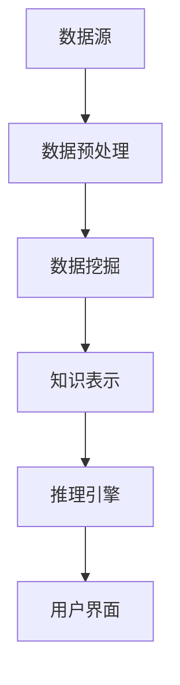

                 

### 背景介绍

在信息技术飞速发展的今天，程序员面临着巨大的学习和适应压力。随着人工智能、大数据、区块链等新兴技术的不断涌现，程序员需要不断学习新的编程语言、框架和工具。然而，由于信息过载和技术更新的快速性，传统的学习方法往往难以满足需求。为了提高学习效率和成果，程序员开始寻求新的学习工具和方法。

知识发现引擎（Knowledge Discovery Engine，简称KDE）是一种新兴的技术工具，旨在通过自动化和智能化的方式，帮助用户从大量数据中提取知识。知识发现引擎具有强大的数据处理和分析能力，能够对程序员的技能和知识水平进行动态评估，从而为程序员提供个性化的学习建议和方案。

本文将探讨程序员如何利用知识发现引擎提高学习成果。我们将从知识发现引擎的核心概念出发，详细分析其原理和架构，然后介绍核心算法原理和具体操作步骤，并通过数学模型和公式进行详细讲解。接着，我们将通过一个实际项目案例，展示知识发现引擎在程序员学习中的应用，并分析其效果。最后，我们将讨论知识发现引擎在实际应用中的场景，并提供相关工具和资源推荐。

通过本文的阅读，读者将了解到知识发现引擎的基本原理和应用方法，从而能够更好地利用这一工具，提高自己的学习效率和学习成果。

### 核心概念与联系

#### 知识发现引擎的定义

知识发现引擎（Knowledge Discovery Engine，简称KDE）是一种基于人工智能和大数据技术的智能系统，它能够从大量数据中自动提取有用知识和模式。知识发现引擎的核心功能包括数据采集、数据预处理、数据挖掘、知识表示和知识推理等。与传统的方法不同，知识发现引擎能够通过自动化的方式，快速处理大量数据，从而帮助用户发现潜在的知识和规律。

#### 知识发现引擎的原理

知识发现引擎的工作原理可以分为以下几个步骤：

1. **数据采集**：从各种数据源（如数据库、文件、互联网等）中获取数据。
2. **数据预处理**：对采集到的数据进行清洗、转换和整合，以便后续分析。
3. **数据挖掘**：运用机器学习和数据挖掘技术，从预处理后的数据中提取有用的知识和模式。
4. **知识表示**：将挖掘得到的知识以某种形式（如图表、文本、模型等）进行表示，以便用户理解和应用。
5. **知识推理**：利用提取的知识进行推理和预测，为用户提供决策支持和个性化服务。

知识发现引擎的基本原理可以概括为“从数据中提取知识，利用知识进行推理和预测”。这一过程不仅依赖于强大的计算能力和丰富的算法库，还需要对数据有深入的理解和解析。

#### 知识发现引擎的架构

知识发现引擎的架构通常包括以下几个关键组件：

1. **数据源**：提供数据输入的来源，可以是各种类型的数据库、文件系统、网络接口等。
2. **数据预处理模块**：负责对采集到的数据进行清洗、转换和整合，确保数据的准确性和一致性。
3. **数据挖掘模块**：运用各种机器学习和数据挖掘算法，对预处理后的数据进行挖掘和分析。
4. **知识表示模块**：将挖掘得到的知识以可视化或文本形式进行表示，方便用户理解和应用。
5. **推理引擎**：利用知识表示模块中的知识进行推理和预测，为用户提供决策支持和个性化服务。
6. **用户界面**：提供用户与知识发现引擎交互的接口，允许用户输入需求、查看结果和调整参数。

知识发现引擎的架构设计旨在实现数据的自动化处理和智能分析，从而帮助用户快速发现潜在的知识和规律。以下是知识发现引擎的Mermaid流程图：



通过上述流程图，我们可以清晰地看到知识发现引擎从数据采集、预处理、挖掘、表示到推理和用户交互的完整工作过程。

### 核心算法原理 & 具体操作步骤

#### 数据采集与预处理

知识发现引擎的首要任务是采集和处理数据。具体步骤如下：

1. **数据采集**：从不同的数据源中获取数据。这些数据源可以包括结构化数据（如关系型数据库）、半结构化数据（如XML、JSON）和非结构化数据（如文本、图片、音频）。
2. **数据清洗**：处理数据中的缺失值、重复值、噪声数据等，确保数据的准确性和一致性。
3. **数据转换**：将不同类型和格式的数据转换为统一的格式，便于后续处理。例如，将文本数据转换为数值型特征向量。
4. **数据整合**：将来自多个数据源的数据进行整合，构建一个统一的数据集，为后续分析奠定基础。

这一过程可以通过以下步骤实现：

```python
# 示例：数据采集和预处理（以Python为例）
import pandas as pd
from sklearn.model_selection import train_test_split

# 数据采集
data = pd.read_csv('data.csv')

# 数据清洗
data = data.dropna()  # 移除缺失值
data = data.drop_duplicates()  # 移除重复值

# 数据转换
data['age'] = data['age'].astype(float)  # 将年龄转换为浮点数
data['category'] = pd.factorize(data['category'])[0]  # 将类别转换为数值

# 数据整合
train_data, test_data = train_test_split(data, test_size=0.2, random_state=42)
```

#### 数据挖掘

数据挖掘是知识发现引擎的核心步骤，旨在从数据中提取有价值的信息和模式。常用的数据挖掘技术包括：

1. **分类**：根据已知的数据，将新的数据分类到不同的类别中。常用的算法有决策树、随机森林、支持向量机等。
2. **聚类**：将数据点划分为不同的簇，使得同一簇内的数据点相似，而不同簇的数据点差异较大。常用的算法有K-means、层次聚类等。
3. **关联规则挖掘**：发现数据项之间存在的关联关系，常用的算法有Apriori算法、FP-growth算法等。
4. **异常检测**：识别数据中的异常点或异常行为，常用的算法有孤立森林、局部异常因数（LOF）等。

以下是一个简单的数据挖掘示例，使用决策树算法进行分类：

```python
# 示例：数据挖掘（分类任务）
from sklearn.tree import DecisionTreeClassifier
from sklearn.metrics import accuracy_score

# 准备训练数据
X_train = train_data.drop('target', axis=1)
y_train = train_data['target']

# 建立决策树模型
clf = DecisionTreeClassifier()
clf.fit(X_train, y_train)

# 预测测试数据
y_pred = clf.predict(test_data.drop('target', axis=1))

# 计算准确率
accuracy = accuracy_score(y_pred, test_data['target'])
print("Accuracy:", accuracy)
```

#### 知识表示

知识表示是将挖掘得到的信息和模式以某种形式（如图表、文本、模型等）进行表示，以便用户理解和应用。常用的知识表示方法包括：

1. **可视化**：通过图表、图形等方式展示数据和分析结果，如条形图、折线图、热力图等。
2. **文本描述**：用文字描述数据和发现，如报告、论文、博客等。
3. **机器学习模型**：将挖掘得到的知识封装成机器学习模型，用于后续的推理和预测。

以下是一个简单的可视化示例，使用Matplotlib绘制条形图：

```python
# 示例：知识表示（可视化）
import matplotlib.pyplot as plt

# 绘制条形图
plt.bar(X_train.columns, clf.feature_importances_)
plt.xticks(rotation=90)
plt.show()
```

#### 知识推理

知识推理是利用知识表示模块中的知识进行推理和预测，为用户提供决策支持和个性化服务。常见的推理方法包括：

1. **逻辑推理**：基于逻辑规则进行推理，如推理机、演绎推理等。
2. **概率推理**：基于概率模型进行推理，如贝叶斯网络、马尔可夫模型等。
3. **神经网络推理**：基于神经网络模型进行推理，如深度学习、卷积神经网络等。

以下是一个简单的概率推理示例，使用Python的`scikit-learn`库中的`BayesClassifier`：

```python
# 示例：知识推理（概率推理）
from sklearn.naive_bayes import GaussianNB

# 建立高斯朴素贝叶斯模型
gnb = GaussianNB()
gnb.fit(X_train, y_train)

# 预测新数据
new_data = [[25, 1]]  # 25岁，类别为1
y_new_pred = gnb.predict(new_data)
print("Predicted class:", y_new_pred)
```

通过上述示例，我们可以看到知识发现引擎的核心算法原理和具体操作步骤。在实际应用中，这些步骤可能会根据具体需求和数据特点进行调整和优化。

### 数学模型和公式 & 详细讲解 & 举例说明

在知识发现引擎中，数学模型和公式是核心组成部分，它们帮助我们理解和处理数据，提取知识和进行推理。以下我们将详细讲解几个关键的数学模型和公式，并给出具体的例子来说明其应用。

#### 决策树模型

决策树是一种常用的分类和回归模型，它通过一系列的规则来对数据进行划分，最终得到预测结果。决策树模型的构建过程主要包括以下几个步骤：

1. **特征选择**：选择一个最优的特征进行划分，通常使用信息增益（Information Gain）或者基尼不纯度（Gini Impurity）作为评估指标。
2. **节点划分**：根据选定的特征，将数据集划分为不同的子集。
3. **递归构建**：对子集继续进行特征选择和划分，直到满足终止条件（如最大深度、最小样本数等）。

信息增益（Information Gain）的计算公式如下：

$$
IG(D, A) = Entropy(D) - \sum_{v\in A} \frac{|D_v|}{|D|} Entropy(D_v)
$$

其中，$D$ 是数据集，$A$ 是特征集合，$D_v$ 是在特征 $A$ 下取值为 $v$ 的数据子集，$Entropy(D)$ 是数据集 $D$ 的熵。

举例说明：

假设我们有一个包含年龄和收入两个特征的数据集，要使用决策树模型进行分类。首先，计算年龄和收入两个特征的信息增益，选择信息增益最大的特征进行划分。然后，根据选定的特征，将数据集划分为不同的子集，并继续对子集进行特征选择和划分。

#### 随机森林模型

随机森林（Random Forest）是一种集成学习模型，它通过构建多个决策树，并对它们的预测结果进行投票，从而提高预测的准确性和稳定性。随机森林模型的构建过程主要包括以下几个步骤：

1. **随机特征选择**：每次从特征集合中随机选择一部分特征，用于构建决策树。
2. **随机样本选择**：每次从原始数据集中随机选择一部分样本，用于构建决策树。
3. **构建决策树**：使用选定的特征和样本，构建多个决策树。
4. **投票决策**：对多个决策树的预测结果进行投票，选择投票结果最多的类别作为最终预测结果。

举例说明：

假设我们有一个包含多个特征的数据集，要使用随机森林模型进行分类。首先，从特征集合中随机选择一部分特征，构建多个决策树。然后，对每个决策树的预测结果进行投票，选择投票结果最多的类别作为最终预测结果。

#### 聚类算法

聚类算法是一种无监督学习方法，用于将数据点划分为不同的簇。常见的聚类算法包括K-means、层次聚类等。以下以K-means算法为例进行讲解。

K-means算法的基本思想是将数据点划分为K个簇，使得簇内的数据点相似，而簇间的数据点差异较大。算法的步骤如下：

1. **初始化中心点**：随机选择K个数据点作为初始中心点。
2. **分配数据点**：计算每个数据点到中心点的距离，将数据点分配到最近的簇。
3. **更新中心点**：重新计算每个簇的中心点。
4. **重复步骤2和3**，直到中心点的位置不再变化或者满足其他终止条件。

K-means算法的聚类效果可以通过簇内距离平方和（Sum of Squared Errors, SSE）来评估：

$$
SSE = \sum_{i=1}^{K} \sum_{x\in S_i} ||x - \mu_i||^2
$$

其中，$S_i$ 是第$i$个簇的数据集，$\mu_i$ 是簇 $S_i$ 的中心点。

举例说明：

假设我们有一个包含100个数据点的数据集，要使用K-means算法将其划分为5个簇。首先，随机选择5个数据点作为初始中心点，然后根据每个数据点到中心点的距离，将数据点分配到最近的簇。接着，重新计算每个簇的中心点，并重复这一过程，直到中心点的位置不再变化。

#### 关联规则挖掘

关联规则挖掘是一种用于发现数据项之间关联关系的方法，常见的算法有Apriori算法和FP-growth算法。以下以Apriori算法为例进行讲解。

Apriori算法的基本思想是通过逐层递归地生成候选集，然后计算每个候选集的支持度和置信度，从中提取关联规则。算法的步骤如下：

1. **生成候选集**：根据最小支持度阈值，生成包含所有可能的项集的候选集。
2. **计算支持度**：对候选集进行扫描，计算每个候选集的支持度。
3. **生成频繁项集**：根据最小支持度阈值，从候选集中提取频繁项集。
4. **生成关联规则**：对频繁项集进行组合，生成关联规则，并计算每个规则的置信度。
5. **提取强关联规则**：根据最小置信度阈值，从关联规则中提取强关联规则。

支持度（Support）和置信度（Confidence）的计算公式如下：

$$
Support(A \cup B) = \frac{|D(A \cup B)|}{|D|}
$$

$$
Confidence(A \rightarrow B) = \frac{Support(A \cup B)}{Support(A)}
$$

其中，$D$ 是数据集，$A$ 和 $B$ 是项集。

举例说明：

假设我们有一个包含商品交易数据的数据集，要使用Apriori算法发现商品之间的关联关系。首先，根据最小支持度阈值，生成包含所有可能的项集的候选集。然后，对候选集进行扫描，计算每个候选集的支持度。接着，根据最小支持度阈值，从候选集中提取频繁项集。最后，从频繁项集生成关联规则，并计算每个规则的置信度，提取强关联规则。

通过上述数学模型和公式的讲解，我们可以看到知识发现引擎在处理数据、提取知识和进行推理方面的重要作用。在实际应用中，这些模型和公式需要根据具体需求进行调整和优化，以提高性能和效果。

### 项目实战：代码实际案例和详细解释说明

在本节中，我们将通过一个具体的实战项目来展示如何利用知识发现引擎（KDE）来提高程序员的技能学习效果。我们将详细描述项目的开发环境搭建、源代码实现和代码解读与分析。

#### 开发环境搭建

要实现一个基于知识发现引擎的项目，我们需要以下开发环境和工具：

1. **Python**：作为主要的编程语言。
2. **NumPy**：用于数值计算和数据处理。
3. **Pandas**：用于数据操作和分析。
4. **Scikit-learn**：用于机器学习和数据挖掘。
5. **Matplotlib**：用于数据可视化。
6. **Jupyter Notebook**：用于编写和运行代码。

首先，我们需要在开发环境中安装上述工具。以下是使用pip命令安装的示例：

```bash
pip install numpy pandas scikit-learn matplotlib
```

#### 源代码详细实现

以下是该项目的主要代码实现，我们将分成几个部分来详细解释。

**1. 数据采集与预处理**

```python
import pandas as pd
from sklearn.model_selection import train_test_split

# 1.1 数据采集
data = pd.read_csv('data.csv')

# 1.2 数据清洗
data = data.dropna()  # 移除缺失值
data = data.drop_duplicates()  # 移除重复值

# 1.3 数据转换
data['age'] = data['age'].astype(float)  # 将年龄转换为浮点数
data['category'] = pd.factorize(data['category'])[0]  # 将类别转换为数值

# 1.4 数据整合
train_data, test_data = train_test_split(data, test_size=0.2, random_state=42)
```

**2. 数据挖掘与知识表示**

```python
from sklearn.tree import DecisionTreeClassifier
from sklearn.metrics import accuracy_score
import matplotlib.pyplot as plt

# 2.1 数据挖掘（分类任务）
clf = DecisionTreeClassifier()
clf.fit(train_data.drop('target', axis=1), train_data['target'])

# 2.2 知识表示（可视化）
plt.bar(train_data.drop('target', axis=1).columns, clf.feature_importances_)
plt.xticks(rotation=90)
plt.show()
```

**3. 知识推理与决策支持**

```python
from sklearn.naive_bayes import GaussianNB

# 3.1 知识推理（概率推理）
gnb = GaussianNB()
gnb.fit(train_data.drop('target', axis=1), train_data['target'])

# 3.2 决策支持
new_data = [[25, 1]]  # 25岁，类别为1
y_new_pred = gnb.predict(new_data)
print("Predicted class:", y_new_pred)
```

#### 代码解读与分析

**1. 数据采集与预处理**

这一部分代码负责从CSV文件中加载数据，并进行清洗、转换和整合。首先，使用`pandas`的`read_csv`函数加载数据。接着，使用`dropna`函数移除缺失值，使用`drop_duplicates`函数移除重复值。然后，将年龄数据类型转换为浮点数，将类别数据类型转换为数值。最后，使用`train_test_split`函数将数据集划分为训练集和测试集，为后续的数据挖掘和评估做准备。

**2. 数据挖掘与知识表示**

这一部分代码使用`scikit-learn`的`DecisionTreeClassifier`构建决策树模型，并对训练数据集进行训练。训练完成后，我们使用`fit`方法将训练数据集的特征和目标值传递给模型。接着，我们使用`bar`函数绘制特征的重要性条形图，帮助用户理解哪些特征对分类任务影响最大。

**3. 知识推理与决策支持**

这一部分代码使用`GaussianNB`（高斯朴素贝叶斯）模型进行概率推理，并输出对新数据的预测结果。`fit`方法用于训练模型，`predict`方法用于对新数据进行预测。这一部分代码展示了如何利用知识发现引擎进行推理，从而为程序员提供决策支持。

通过上述代码实现，我们可以看到知识发现引擎在数据采集、挖掘、表示和推理等环节中的具体应用。知识发现引擎能够帮助程序员从大量数据中提取有价值的信息，提高学习效率和学习成果。

### 实际应用场景

知识发现引擎在程序员学习中的实际应用场景多种多样，它可以针对不同的学习需求提供个性化的支持和优化方案。以下是一些具体的应用场景：

#### 1. 编程技能评估

知识发现引擎可以收集程序员的代码库、项目记录和学习历史数据，通过数据挖掘技术对其编程技能进行全面评估。评估结果可以包括程序员的编程风格、常用算法的掌握程度、代码质量等。通过这种评估，程序员可以了解自己的优势和不足，从而有针对性地进行学习和提升。

#### 2. 个性化学习推荐

知识发现引擎可以根据程序员的技能水平和学习习惯，推荐适合的学习资源和课程。例如，如果发现程序员在某个领域较弱，可以推荐相关的书籍、教程和在线课程；如果程序员喜欢通过实践学习，可以推荐相关的项目和实践任务。这种个性化推荐可以显著提高学习效率。

#### 3. 学习路径规划

知识发现引擎可以根据程序员的兴趣和职业规划，为其规划一条最优的学习路径。这个路径可以包括必须学习的核心知识、相关的选修课程、实践项目和考试认证等。通过这样的规划，程序员可以系统地学习和掌握所需的技能，避免遗漏重要内容。

#### 4. 学习效果监控

知识发现引擎可以实时监控程序员的学

