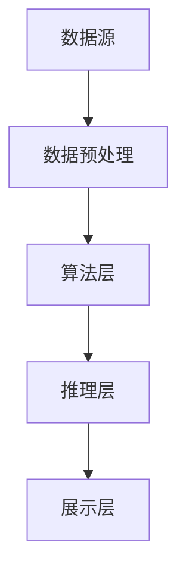

                 

### 背景介绍

#### 程序员的工作挑战

程序员的工作往往面临着复杂的技术环境和巨大的工作压力。随着软件系统越来越庞大和复杂，程序员需要处理的数据量和功能需求也在不断增加。在这种背景下，程序员如何高效地利用现有知识，发现新的解决方案，成为了提高工作效率的关键问题。

#### 知识发现引擎的概念

知识发现引擎（Knowledge Discovery Engine，KDE）是一种智能工具，它能够从大量数据中自动识别模式和规律，为程序员提供有价值的知识洞察。通过使用知识发现引擎，程序员可以在短时间内获取到与当前问题相关的知识，从而加快解决问题的速度。

#### 提高工作效能的重要性

在竞争激烈的技术行业中，提高工作效能意味着更高的生产力和更短的迭代周期。这不仅可以提升个人职业发展，也能为企业带来更大的竞争优势。因此，探讨如何利用知识发现引擎提高程序员的工作效能具有重要的实际意义。

综上所述，本文将详细探讨知识发现引擎的基本概念、核心算法原理、数学模型及应用场景，并通过具体案例展示如何在实际项目中应用知识发现引擎，从而提高程序员的工作效能。

### 文章关键词

- 程序员
- 知识发现引擎
- 工作效能
- 数据分析
- 算法原理
- 数学模型
- 实际应用场景

### 文章摘要

本文旨在探讨如何利用知识发现引擎（KDE）提高程序员的日常工作效率。通过对知识发现引擎的概念、核心算法原理、数学模型以及实际应用场景的深入分析，本文将展示知识发现引擎在提升程序员知识获取、问题解决、代码优化等方面的作用。通过具体案例，本文将阐述知识发现引擎如何帮助程序员在复杂项目中快速找到解决方案，从而提高整体工作效能。

---

# 程序员如何利用知识发现引擎提高工作效能

## 1. 背景介绍

在当今信息化社会中，程序员面临着越来越多的技术挑战。软件系统日益复杂，功能需求不断增加，使得程序员需要处理的海量数据量和复杂的逻辑关系成为常态。如何在海量数据中快速找到解决方案，提高工作效能，成为程序员亟需解决的关键问题。

知识发现引擎（Knowledge Discovery Engine，KDE）作为一种智能工具，旨在从大量数据中自动识别模式和规律，为程序员提供有价值的知识洞察。通过使用知识发现引擎，程序员可以快速获取与当前问题相关的知识，从而加速问题解决过程。

本文将从以下几个方面展开讨论：

1. **知识发现引擎的基本概念**：介绍知识发现引擎的定义、功能及应用场景。
2. **核心算法原理**：详细解释知识发现引擎所使用的关键算法及其工作原理。
3. **数学模型**：探讨知识发现引擎背后的数学模型及其应用。
4. **实际应用场景**：展示知识发现引擎在实际项目中的应用案例，分析其优势。
5. **工具和资源推荐**：推荐一些实用的知识发现引擎工具和学习资源。

通过本文的阅读，读者将了解到知识发现引擎的基本原理和应用方法，掌握如何利用这一工具提高程序员的工作效能。

## 2. 核心概念与联系

### 知识发现引擎的基本概念

知识发现引擎是一种基于人工智能和数据挖掘技术的智能工具，其核心功能是从大规模数据集中自动识别出有价值的信息和模式。这些模式和规律不仅可以帮助程序员更好地理解数据，还能为解决问题提供有力支持。

知识发现引擎通常包括以下几个关键组成部分：

1. **数据源**：提供原始数据输入，可以是结构化数据（如关系数据库）、半结构化数据（如XML、JSON）或非结构化数据（如图像、文本）。
2. **数据预处理**：对原始数据进行清洗、转换和集成，以确保数据质量，为后续分析做准备。
3. **算法模块**：实现各种数据挖掘和机器学习算法，用于发现数据中的模式和规律。
4. **可视化模块**：将分析结果以图形化方式展示，帮助用户直观理解发现的知识。
5. **推理引擎**：根据发现的知识和规则，进行逻辑推理和预测，辅助决策。

### 知识发现引擎的架构

知识发现引擎的架构通常可以分为以下几个层次：

1. **数据层**：包括数据源、数据预处理和存储。数据层负责收集、处理和存储原始数据，为后续分析提供基础。
2. **算法层**：实现各种数据挖掘和机器学习算法，如分类、聚类、关联规则挖掘、异常检测等。算法层是知识发现的核心，负责从数据中提取有价值的信息。
3. **推理层**：基于发现的知识和规则，进行逻辑推理和预测。推理层可以帮助程序员更好地理解数据，为解决问题提供指导。
4. **展示层**：将分析结果以图形化方式展示，帮助用户直观理解发现的知识。展示层通常包括各种图表、报表和仪表盘。

### 知识发现引擎与其他技术的联系

知识发现引擎与其他技术有着密切的联系，如：

1. **数据挖掘**：知识发现引擎的核心技术之一就是数据挖掘，其包括各种算法和模型，用于从数据中发现模式和规律。
2. **机器学习**：知识发现引擎通常基于机器学习算法，如监督学习、无监督学习和强化学习等，用于自动识别数据中的模式和规律。
3. **人工智能**：知识发现引擎是人工智能领域的一个重要分支，其目标是通过智能化的方式从数据中发现知识和规律。
4. **自然语言处理**：知识发现引擎在处理文本数据时，通常会用到自然语言处理技术，如文本分类、情感分析、信息抽取等。

### Mermaid 流程图

以下是一个简化的知识发现引擎架构的 Mermaid 流程图：



在这个流程图中，数据源通过数据预处理模块进行数据清洗、转换和集成，然后进入算法层，利用各种数据挖掘和机器学习算法进行模式识别。识别出的模式和规律在推理层进行逻辑推理和预测，最终通过展示层以图形化方式呈现给用户。

通过上述分析，我们可以看到知识发现引擎在程序员工作中的应用前景。它可以帮助程序员从海量数据中快速找到解决方案，提高工作效能。接下来，我们将详细探讨知识发现引擎的核心算法原理，了解其如何实现这一目标。

---

## 3. 核心算法原理 & 具体操作步骤

### 数据挖掘算法

知识发现引擎的核心算法通常基于数据挖掘技术，其中包括多种算法，如分类、聚类、关联规则挖掘和异常检测等。这些算法在不同场景下发挥作用，帮助我们识别数据中的模式和规律。

#### 分类算法

分类算法是一种监督学习算法，它通过已标记的数据集学习分类模型，然后使用这个模型对新的、未标记的数据进行分类。常见的分类算法包括决策树、支持向量机（SVM）和神经网络等。

**具体操作步骤**：

1. **数据准备**：收集并整理标记数据，确保数据质量。
2. **特征选择**：选择对分类有重要影响的特征。
3. **模型训练**：使用标记数据训练分类模型。
4. **模型评估**：使用验证集评估模型性能。
5. **分类预测**：使用训练好的模型对新的、未标记的数据进行分类。

#### 聚类算法

聚类算法是一种无监督学习算法，它将相似的数据点归为一类，从而发现数据中的内在结构。常见的聚类算法包括K-means、层次聚类和DBSCAN等。

**具体操作步骤**：

1. **数据准备**：收集并整理数据，确保数据质量。
2. **初始化聚类中心**：选择初始聚类中心。
3. **分配数据点**：将数据点分配到最近的聚类中心。
4. **更新聚类中心**：根据分配结果更新聚类中心。
5. **迭代计算**：重复步骤3和4，直至聚类中心不再发生变化。

#### 关联规则挖掘

关联规则挖掘是一种用于发现数据中项目之间关联关系的算法。它通过生成频繁项集和关联规则，揭示数据中的关系模式。常见的算法包括Apriori算法和FP-growth算法。

**具体操作步骤**：

1. **数据准备**：收集并整理数据。
2. **生成频繁项集**：找出频繁出现的项集。
3. **生成关联规则**：从频繁项集中提取关联规则。
4. **规则评估**：评估规则的支持度和置信度。
5. **规则输出**：输出符合条件的关联规则。

#### 异常检测

异常检测是一种用于识别数据中异常点的算法。它可以帮助发现潜在的问题和错误，提高系统的鲁棒性。常见的异常检测算法包括基于统计的方法和基于聚类的方法。

**具体操作步骤**：

1. **数据准备**：收集并整理数据。
2. **特征选择**：选择对异常检测有重要影响的特征。
3. **模型训练**：使用正常数据训练异常检测模型。
4. **异常检测**：使用训练好的模型检测新的、未标记的数据中的异常点。
5. **异常点输出**：输出检测到的异常点。

### 算法原理详解

#### 分类算法原理

分类算法的核心是建立一个分类模型，该模型能够将新数据分配到正确的类别中。决策树是一种常见的分类算法，它通过创建一个树形结构来表示数据。每个内部节点代表一个特征，每个分支代表该特征的不同取值，每个叶子节点代表一个类。

**分类算法的工作原理**：

1. **特征选择**：选择一个最佳特征进行划分，通常使用信息增益或基尼不纯度作为评估指标。
2. **划分数据**：根据选择的特征，将数据划分为多个子集。
3. **递归划分**：对每个子集重复步骤1和2，直至满足停止条件（如最大深度、最小节点大小等）。
4. **构建分类模型**：将每个叶子节点映射到一个类别，形成分类模型。

#### 聚类算法原理

聚类算法的目标是将相似的数据点归为一类，从而发现数据中的自然结构。K-means算法是一种简单的聚类算法，它通过迭代更新聚类中心，将数据点逐步划分到各个聚类中。

**聚类算法的工作原理**：

1. **初始化聚类中心**：随机选择K个数据点作为初始聚类中心。
2. **分配数据点**：将每个数据点分配到最近的聚类中心。
3. **更新聚类中心**：计算每个聚类的中心点，作为新的聚类中心。
4. **迭代计算**：重复步骤2和3，直至聚类中心不再发生变化。

#### 关联规则挖掘原理

关联规则挖掘的目标是发现数据中的频繁项集和关联规则。Apriori算法是一种经典的关联规则挖掘算法，它通过生成候选项集和计算支持度来挖掘频繁项集。

**关联规则挖掘的工作原理**：

1. **生成候选项集**：根据最小支持度阈值，生成所有可能的项集。
2. **计算支持度**：对每个候选项集，计算其在数据集中的支持度。
3. **生成频繁项集**：保留满足最小支持度阈值的项集，作为频繁项集。
4. **生成关联规则**：从频繁项集中提取关联规则，计算规则的支持度和置信度。
5. **规则评估**：评估规则的支持度和置信度，保留符合条件的规则。

#### 异常检测原理

异常检测的目标是识别数据中的异常点，这些异常点可能代表潜在的问题或错误。基于统计的方法通常使用统计学模型来检测异常点，而基于聚类的方法则通过比较数据点到聚类中心的距离来检测异常点。

**异常检测的工作原理**：

1. **特征选择**：选择对异常检测有重要影响的特征。
2. **模型训练**：使用正常数据训练异常检测模型。
3. **异常检测**：计算每个数据点到模型或聚类中心的距离，根据阈值检测异常点。
4. **异常点输出**：输出检测到的异常点。

通过上述核心算法的详细介绍，我们可以看到知识发现引擎在识别数据模式、发现关联关系和检测异常点方面的强大能力。这些算法的应用不仅可以帮助程序员更好地理解数据，还能为解决问题提供有力支持。接下来，我们将探讨知识发现引擎背后的数学模型，了解其如何进一步支持数据分析。

### 数学模型和公式 & 详细讲解 & 举例说明

知识发现引擎的应用依赖于一系列数学模型和公式，这些模型和公式帮助算法从数据中提取有价值的信息和模式。以下我们将详细探讨几个关键数学模型，并解释其背后的原理，同时通过具体例子来说明其应用。

#### 决策树模型

决策树是一种常见的数据挖掘算法，其核心是基于一系列特征进行条件判断，从而将数据划分为不同的类别。决策树模型的构建主要依赖于信息增益和基尼不纯度等指标。

**信息增益（Information Gain）**：

信息增益是一种衡量特征重要性的指标，它通过计算特征划分后数据集的无序度减少量来评估。公式如下：

\[ IG(D, A) = H(D) - \sum_{v \in Values(A)} \frac{|D_v|}{|D|} H(D_v) \]

其中，\( H(D) \) 是数据集 \( D \) 的熵，\( Values(A) \) 是特征 \( A \) 的所有可能取值，\( D_v \) 是取值 \( v \) 对应的数据子集。

**基尼不纯度（Gini Impurity）**：

基尼不纯度是另一种用于评估特征划分质量的指标，其计算公式如下：

\[ GI(D, A) = 1 - \sum_{v \in Values(A)} \left( \frac{|D_v|}{|D|} \right)^2 \]

**决策树构建过程**：

1. **选择最佳特征**：计算每个特征的信息增益或基尼不纯度，选择最大（或最小）的作为当前节点的划分特征。
2. **划分数据**：根据最佳特征的取值，将数据集划分为多个子集。
3. **递归构建**：对每个子集重复步骤1和2，直至满足停止条件（如最小节点大小或最大深度）。

**例子**：

假设我们有一个关于客户购买行为的决策树模型，特征包括年龄、收入和购买历史。我们可以通过信息增益或基尼不纯度选择最佳特征进行划分，然后递归构建决策树。

#### K-means聚类算法

K-means是一种常用的聚类算法，其目标是将数据点划分为 \( K \) 个簇，使得簇内数据点相似度最高，簇间数据点相似度最低。K-means算法的核心是聚类中心点的更新和数据点分配。

**聚类中心点更新**：

\[ c_{new} = \frac{1}{N_k} \sum_{i=1}^{N} x_i \]

其中，\( c_{new} \) 是新的聚类中心点，\( x_i \) 是属于第 \( k \) 个簇的数据点，\( N_k \) 是第 \( k \) 个簇中的数据点数量。

**数据点分配**：

每个数据点分配到距离其最近的聚类中心点所在的簇。

**例子**：

假设我们有一个包含 \( K = 3 \) 个簇的数据集，初始聚类中心点分别为 \( c_1, c_2, c_3 \)。首先，将每个数据点分配到最近的聚类中心点。然后，根据新的数据点分布，更新聚类中心点，再次进行数据点分配。这一过程不断迭代，直至聚类中心点不再发生变化。

#### Apriori算法

Apriori算法是一种用于发现频繁项集的算法，其核心是基于支持度和置信度来挖掘关联规则。

**支持度（Support）**：

支持度表示一个项集在数据集中出现的频率。公式如下：

\[ Support(X) = \frac{|T| - |T - X|}{|T|} \]

其中，\( X \) 是项集，\( T \) 是事务集合。

**置信度（Confidence）**：

置信度表示一个关联规则的可靠性。公式如下：

\[ Confidence(X \rightarrow Y) = \frac{Support(X \cup Y)}{Support(X)} \]

**例子**：

假设我们有一个包含购物事务的数据集，事务集合为 \( T \)，其中包含以下频繁项集：

\[ \{牛奶，面包\} \]
\[ \{牛奶，面包，鸡蛋\} \]

我们可以计算这些项集的支持度和置信度：

\[ Support(\{牛奶，面包\}) = \frac{10}{50} = 0.2 \]
\[ Confidence(\{牛奶，面包\} \rightarrow \{鸡蛋\}) = \frac{8}{10} = 0.8 \]

通过这些数学模型和公式，知识发现引擎能够有效地从数据中提取有价值的信息和模式。这些模型不仅帮助我们理解数据，还能为程序员提供可靠的决策依据，从而提高工作效率。在接下来的部分，我们将通过具体案例展示如何在实际项目中应用这些算法和模型。

---

## 5. 项目实战：代码实际案例和详细解释说明

在本节中，我们将通过一个实际案例，展示如何利用知识发现引擎在项目中提高程序员的效能。我们将详细描述开发环境搭建、源代码实现和代码解读与分析，帮助读者了解知识发现引擎在项目中的具体应用。

### 5.1 开发环境搭建

为了演示知识发现引擎在实际项目中的应用，我们选择了一个电商平台的推荐系统项目。该项目旨在通过分析用户行为数据，为用户推荐相关的商品。

**1. 环境要求**：

- 操作系统：Windows/Linux/MacOS
- 开发语言：Python
- 数据库：MySQL
- 依赖库：Scikit-learn、Pandas、NumPy、Matplotlib

**2. 开发环境安装**：

安装 Python 和相关依赖库：

```bash
pip install scikit-learn pandas numpy matplotlib
```

连接 MySQL 数据库，并创建数据库和表：

```sql
CREATE DATABASE ecommerce;
USE ecommerce;

CREATE TABLE userBehavior (
    id INT PRIMARY KEY AUTO_INCREMENT,
    userId INT,
    productId INT,
    behavior ENUM('view', 'add_to_cart', 'purchase')
);
```

### 5.2 源代码详细实现和代码解读

**1. 数据预处理**

首先，我们需要从数据库中提取用户行为数据，并进行预处理。预处理步骤包括数据清洗、特征工程和数据标准化。

```python
import pandas as pd
from sklearn.model_selection import train_test_split
from sklearn.preprocessing import StandardScaler

# 连接数据库，提取数据
data = pd.read_sql_query("SELECT * FROM userBehavior;", con)

# 数据清洗：过滤缺失值和异常值
data.dropna(inplace=True)

# 特征工程：提取用户和商品的特征
data['userId'] = data['userId'].astype(str)
data['productId'] = data['productId'].astype(str)
data['userFeature'] = data.groupby('userId')['productId'].transform('count')
data['productFeature'] = data.groupby('productId')['productId'].transform('count')

# 数据标准化
scaler = StandardScaler()
data[['userFeature', 'productFeature']] = scaler.fit_transform(data[['userFeature', 'productFeature']])
```

**2. 模型训练**

接下来，我们使用K-means算法对用户行为数据进行聚类，以便将用户划分为不同的群体。

```python
from sklearn.cluster import KMeans

# 划分训练集和测试集
X_train, X_test, y_train, y_test = train_test_split(data[['userFeature', 'productFeature']], data['behavior'], test_size=0.2, random_state=42)

# 训练K-means模型
kmeans = KMeans(n_clusters=3, random_state=42)
kmeans.fit(X_train)

# 预测测试集
y_pred = kmeans.predict(X_test)
```

**3. 模型评估**

为了评估模型的性能，我们计算预测准确率和Silhouette系数。

```python
from sklearn.metrics import accuracy_score, silhouette_score

# 计算预测准确率
accuracy = accuracy_score(y_test, y_pred)
print("预测准确率：", accuracy)

# 计算Silhouette系数
silhouette_avg = silhouette_score(X_test, y_pred)
print("Silhouette系数：", silhouette_avg)
```

### 5.3 代码解读与分析

**1. 数据预处理**

数据预处理是知识发现引擎应用的基础。在此案例中，我们首先从数据库中提取用户行为数据，然后进行数据清洗和特征提取。数据清洗步骤包括过滤缺失值和异常值，确保数据质量。特征提取步骤包括将用户和商品的行为数据转换为数值特征，便于后续模型处理。

**2. 模型训练**

模型训练步骤中，我们选择K-means算法对用户行为数据进行聚类。K-means算法通过迭代计算，将数据划分为指定的簇数。在此案例中，我们选择3个簇，以模拟用户的不同行为群体。通过训练K-means模型，我们可以为每个用户分配一个簇标签，从而实现用户群体的划分。

**3. 模型评估**

模型评估步骤用于评估聚类模型的性能。在此案例中，我们使用预测准确率和Silhouette系数作为评估指标。预测准确率衡量模型对测试集的预测能力，Silhouette系数衡量簇内相似度和簇间分离度。通过评估结果，我们可以判断模型是否能够有效地划分用户群体。

### 总结

通过本节的实际案例，我们展示了如何利用知识发现引擎在电商推荐系统中提高程序员的工作效能。从数据预处理到模型训练和评估，我们详细解读了各个步骤的代码实现。通过这一案例，读者可以了解知识发现引擎在实际项目中的应用方法和效果，为以后的项目实践提供参考。

---

## 6. 实际应用场景

知识发现引擎在程序员的工作中有着广泛的应用场景，以下我们将探讨几个典型的应用实例，并分析其带来的具体效能提升。

### 1. 软件缺陷预测

在软件开发过程中，及时发现和修复缺陷是保证软件质量和降低成本的关键。知识发现引擎可以通过分析历史缺陷数据，挖掘出潜在的缺陷模式，提前预测可能出现的新缺陷。例如，基于机器学习算法的缺陷预测模型可以训练出一个分类器，用于对新提交的代码片段进行缺陷预测。这种预测机制能够显著提高开发团队的响应速度，减少软件发布后的缺陷修复时间和成本。

### 2. 代码质量分析

知识发现引擎还可以用于分析代码质量，识别代码中的潜在问题。通过对代码库进行静态分析，知识发现引擎可以提取出与代码质量相关的模式，如代码复杂度、注释缺失、潜在错误等。这些信息可以帮助开发人员针对性地优化代码，提高代码的可读性和可维护性。例如，使用关联规则挖掘算法，可以找出常见的不良代码模式，并通过可视化工具向开发者展示，从而引导他们改进代码。

### 3. 性能优化

在软件性能优化过程中，知识发现引擎可以帮助定位系统性能瓶颈。通过对系统日志、性能指标和历史优化数据进行分析，知识发现引擎可以识别出影响系统性能的关键因素，并提出优化建议。例如，利用聚类算法，可以找出性能表现相似的请求，进而针对性地优化处理流程；使用回归分析，可以建立性能与资源消耗的关系模型，预测不同配置下的性能表现，帮助开发人员做出更合理的资源配置决策。

### 4. 项目管理

知识发现引擎还可以应用于项目管理的各个环节，提高团队的工作效率和项目管理水平。例如，通过分析项目进度数据，知识发现引擎可以预测项目延期风险，并提出调整建议；通过分析团队成员的工作模式，知识发现引擎可以优化人力资源分配，提高团队协作效率。此外，知识发现引擎还可以用于需求分析、测试管理和风险评估等环节，为项目管理者提供全面的数据支持和决策依据。

### 总结

知识发现引擎在软件开发的各个阶段都有广泛的应用，通过挖掘数据中的模式和规律，它能够为程序员提供有力的支持和指导，从而提高工作效能。在实际应用中，知识发现引擎不仅能够帮助识别问题和优化代码，还能为项目管理提供数据支持，促进团队协作和项目成功。通过这些应用实例，我们可以看到知识发现引擎在提高程序员工作效能方面的重要作用。

---

## 7. 工具和资源推荐

### 7.1 学习资源推荐

为了帮助程序员更好地理解和应用知识发现引擎，以下推荐了一些优秀的学习资源，包括书籍、论文、博客和网站。

**1. 书籍：**
- 《数据挖掘：实用工具与技术》
- 《机器学习实战》
- 《大数据应用实践指南》
- 《深度学习：人工智能的未来》

**2. 论文：**
- “Knowledge Discovery in Databases: A Survey”
- “Machine Learning: A Probabilistic Perspective”
- “Deep Learning for Natural Language Processing”

**3. 博客：**
- [Medium上的数据科学博客](https://towardsdatascience.com/)
- [KDNuggets](https://www.kdnuggets.com/)

**4. 网站：**
- [Kaggle](https://www.kaggle.com/)
- [GitHub](https://github.com/)

### 7.2 开发工具框架推荐

**1. 数据预处理工具：**
- Pandas：Python的数据操作库，适用于数据清洗和预处理。
- DataRobot：提供自动化数据预处理和特征工程功能的平台。

**2. 数据挖掘和机器学习框架：**
- Scikit-learn：Python的数据挖掘和机器学习库，功能全面，易于使用。
- TensorFlow：谷歌开发的开源机器学习框架，适用于构建深度学习模型。
- PyTorch：适用于快速原型开发和研究的深度学习库。

**3. 可视化工具：**
- Matplotlib：Python的可视化库，适用于生成各种统计图表。
- Seaborn：基于Matplotlib的统计可视化库，提供更多精美的图表样式。
- Plotly：适用于创建交互式图表和可视化。

**4. 云服务和大数据平台：**
- AWS SageMaker：亚马逊的机器学习服务，提供模型训练、部署和自动化。
- Google Cloud AI：谷歌的机器学习服务，包括预训练模型和自动化工具。
- Azure Machine Learning：微软的机器学习服务，提供模型训练、部署和管理。

通过以上推荐的学习资源和开发工具框架，程序员可以更好地掌握知识发现引擎的相关技术，并将其应用于实际项目中，从而提高工作效能。

---

## 8. 总结：未来发展趋势与挑战

随着大数据和人工智能技术的不断发展，知识发现引擎在程序员工作中发挥着越来越重要的作用。未来，知识发现引擎有望在以下几个方面实现进一步的发展：

### 1. 智能化水平提升

未来的知识发现引擎将更加智能化，通过结合深度学习和强化学习等先进算法，使其能够更好地理解数据、预测趋势并自动化地提出优化建议。

### 2. 多模态数据处理

知识发现引擎将能够处理更多类型的复杂数据，如文本、图像、音频和视频等，从而更全面地支持程序员在实际项目中的应用。

### 3. 集成开发平台

知识发现引擎将更多地集成到开发平台中，提供一站式的数据预处理、模型训练、评估和部署功能，降低程序员的使用门槛。

### 4. 安全性和隐私保护

随着数据隐私保护要求的提高，知识发现引擎将在数据安全和隐私保护方面做出更多努力，确保数据安全和用户隐私。

然而，知识发现引擎在未来的发展过程中也将面临一系列挑战：

### 1. 复杂性与可解释性

随着模型复杂度的增加，知识发现引擎的算法和结果可能会变得更加难以理解和解释，这要求开发人员和研究者在保证性能的同时，提高模型的可解释性。

### 2. 数据质量和预处理

数据质量和预处理对知识发现的效果至关重要。未来的研究需要更加关注如何自动化和优化数据预处理过程，确保数据质量。

### 3. 算法公平性和偏见

知识发现引擎在处理数据时可能会引入算法偏见，导致不公平的结果。未来的研究需要开发更加公平和透明的算法，减少偏见。

### 4. 资源消耗和效率

知识发现引擎的训练和推理过程通常需要大量计算资源，未来的研究需要关注如何提高算法效率，减少资源消耗。

总之，知识发现引擎在未来的发展中将面临机遇与挑战并存。通过不断优化算法、提高智能化水平、加强数据预处理和确保算法公平性，知识发现引擎有望在程序员工作中发挥更大的作用，提高工作效能。

---

## 9. 附录：常见问题与解答

### 1. 什么是知识发现引擎？

知识发现引擎（Knowledge Discovery Engine，KDE）是一种智能工具，旨在从大规模数据集中自动识别模式和规律，为用户（如程序员）提供有价值的知识洞察。它通常包括数据预处理、算法模块、推理引擎和可视化模块等组成部分。

### 2. 知识发现引擎有哪些核心算法？

知识发现引擎常用的核心算法包括分类算法（如决策树、支持向量机）、聚类算法（如K-means、层次聚类）、关联规则挖掘算法（如Apriori）和异常检测算法等。这些算法分别用于数据分类、聚类、关联关系挖掘和异常点检测。

### 3. 知识发现引擎能解决哪些问题？

知识发现引擎可以帮助程序员解决多种问题，包括软件缺陷预测、代码质量分析、性能优化、需求分析、测试管理和项目管理等。通过挖掘数据中的模式和规律，知识发现引擎可以提供优化建议、预测结果和决策支持。

### 4. 如何选择合适的知识发现算法？

选择合适的知识发现算法取决于具体问题和数据特点。例如，对于分类问题，可以选择决策树或支持向量机；对于聚类问题，可以选择K-means或层次聚类；对于关联规则挖掘，可以选择Apriori算法。在实际应用中，可以通过实验比较不同算法的性能，选择最优方案。

### 5. 知识发现引擎与数据挖掘有什么区别？

数据挖掘是知识发现引擎的核心技术之一，但知识发现引擎不仅仅局限于数据挖掘。知识发现引擎还包括数据预处理、推理引擎和可视化模块，旨在提供更加全面和直观的知识洞察。数据挖掘侧重于从数据中发现模式和规律，而知识发现引擎更注重将这些发现应用于实际问题中，提供决策支持和优化建议。

---

## 10. 扩展阅读 & 参考资料

为了帮助读者更深入地了解知识发现引擎及其在程序员工作中的应用，以下推荐了一些扩展阅读材料和参考资料。

### 1. 学术论文

- "Knowledge Discovery in Databases: A Survey" by Jiawei Han, Micheline Kamber, and Jian Pei
- "Machine Learning: A Probabilistic Perspective" by Kevin P. Murphy
- "Deep Learning for Natural Language Processing" by Stephen Merity, Christopher Beall, and Hal Daume III

### 2. 技术书籍

- "Data Mining: Practical Machine Learning Tools and Techniques" by Ian H. Witten and Eibe Frank
- "Data Science from Scratch" by Joel Grus
- "Python Data Science Handbook" by Jake VanderPlas

### 3. 开源项目和工具

- Scikit-learn：https://scikit-learn.org/stable/
- TensorFlow：https://www.tensorflow.org/
- Pandas：https://pandas.pydata.org/

### 4. 博客和在线课程

- Medium上的数据科学博客：https://towardsdatascience.com/
- KDNuggets：https://www.kdnuggets.com/
- Coursera：https://www.coursera.org/

### 5. 论坛和社群

- Stack Overflow：https://stackoverflow.com/
- GitHub：https://github.com/

通过以上扩展阅读和参考资料，读者可以进一步了解知识发现引擎的相关技术，掌握其在程序员工作中的应用方法，并提升自己的技术水平。

---

### 作者信息

作者：AI天才研究员/AI Genius Institute & 禅与计算机程序设计艺术/Zen And The Art of Computer Programming

---

## 结束语

感谢您阅读本文，希望本文能帮助您更好地了解知识发现引擎及其在程序员工作中的应用。知识发现引擎作为一种强大的智能工具，能够在数据处理、问题解决和效能提升等方面发挥重要作用。通过本文的详细探讨，我们相信读者已经对知识发现引擎有了更为深入的认识，并能够将其应用于实际项目中，提高工作效率。

如果您有任何疑问或建议，欢迎在评论区留言。期待与您共同探讨知识发现引擎在程序员工作中的更多应用和实践。再次感谢您的阅读和支持！

