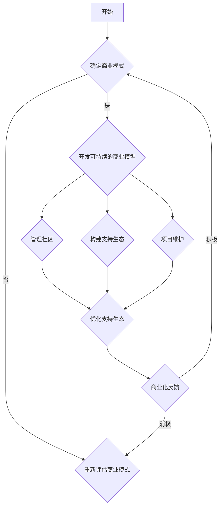

                 

# 程序员如何将开源项目商业化：开源与盈利的平衡

## 关键词：开源项目，商业化，盈利，平衡，程序员

## 摘要：
本文旨在探讨程序员如何将开源项目商业化，实现开源与盈利的平衡。通过对开源项目商业化模式的深入分析，本文提出了具体的操作步骤和策略，包括开发可持续的商业模型、有效管理社区、构建支持生态和优化项目维护等方面。同时，本文还探讨了开源项目的潜在挑战和解决方法，为程序员提供了实用的指导。

## 1. 背景介绍

开源项目已经成为现代软件开发的一个重要组成部分。它们不仅为开发者提供了丰富的技术资源和知识共享的平台，还推动了技术的创新和进步。然而，开源项目通常是基于自愿贡献和共享原则，这可能导致项目在商业化方面的局限性。程序员如何将开源项目商业化，既保持其开放性，又能实现盈利，成为一个备受关注的问题。

商业化和盈利对开源项目来说并非对立的概念。实际上，许多成功的开源项目已经找到了平衡点，实现了良好的商业回报。例如，红帽公司通过提供企业级支持和咨询服务，将开源的Linux操作系统商业化，成为一家价值数十亿美元的公司。类似的案例还有很多，这为程序员提供了宝贵的经验和启示。

本文将结合实际案例，深入探讨程序员如何将开源项目商业化，实现开源与盈利的平衡。通过系统地分析和解答相关问题，帮助程序员更好地理解和实践这一过程。

## 2. 核心概念与联系

在探讨开源项目商业化的过程中，我们需要明确几个核心概念和它们之间的关系。

### 2.1 开源项目

开源项目是指其源代码可以公开访问、修改和共享的软件项目。开源的核心价值观包括共享、协作和开放。开发者通过贡献代码、文档和资源，共同推动项目的发展。

### 2.2 商业化

商业化是指将产品或服务转化为商业机会，通过市场推广和商业模式，实现盈利的过程。在开源项目中，商业化可以理解为将开源项目的资源转化为商业收入。

### 2.3 平衡

平衡是指开源与商业化之间保持一种合理的关系，既不损害开源项目的开放性和社区发展，又能实现商业盈利。这种平衡是可持续发展的关键。

### 2.4 商业模式

商业模式是指企业通过何种方式创造、传递和获取价值。在开源项目中，商业模式需要考虑如何利用开源资源实现盈利，同时保持社区的活跃和支持。

### 2.5 社区管理

社区管理是指维护和管理开源项目社区的过程。社区是开源项目的重要资源，有效的社区管理可以促进项目的成长和商业化。

### 2.6 项目维护

项目维护是指对开源项目进行持续改进和更新，以确保其稳定性和可扩展性。良好的项目维护是开源项目商业化的基础。

### 2.7 支持生态

支持生态是指围绕开源项目形成的支持网络，包括开发者、用户、合作伙伴等。一个健康的支持生态可以促进开源项目的商业化。

### 2.8 Mermaid 流程图

以下是一个描述开源项目商业化流程的 Mermaid 流程图：



通过这个流程图，我们可以看到开源项目商业化的各个环节之间的联系和相互影响。这种系统化的方法有助于程序员更好地理解和实施开源项目的商业化。

## 3. 核心算法原理 & 具体操作步骤

要将开源项目商业化，程序员需要掌握一系列核心算法原理和具体操作步骤。以下是一些关键的方面：

### 3.1 确定商业模式

确定商业模式是开源项目商业化的第一步。程序员需要分析项目的特点和市场需求，找到适合的商业模式。以下是几种常见的商业模式：

- **订阅模式**：通过提供定期订阅服务，如云服务或软件即服务（SaaS），获得持续的收入。
- **付费支持模式**：提供企业级支持服务，如问题解答、培训和技术支持，吸引企业用户。
- **付费功能扩展模式**：在开源项目的基础上，提供付费的功能扩展或插件。
- **广告模式**：通过展示广告获得收入，但需要注意不要损害用户体验。
- **合作模式**：与其他企业或机构合作，共同开发或推广项目。

### 3.2 管理社区

有效的社区管理是开源项目成功的关键。程序员需要建立和维护一个活跃、健康的社区。以下是具体的操作步骤：

- **建立沟通渠道**：提供多种沟通渠道，如论坛、邮件列表、社交媒体等，方便开发者、用户和贡献者交流。
- **鼓励贡献**：建立贡献指南，明确贡献流程和规范，鼓励更多的开发者参与项目。
- **反馈机制**：建立反馈机制，及时响应用户和开发者的反馈，优化项目。
- **组织活动**：定期举办线上或线下的活动，如黑客松、讲座等，增强社区凝聚力。

### 3.3 构建支持生态

构建一个健康的支持生态对于开源项目的商业化至关重要。以下是构建支持生态的几个关键步骤：

- **合作伙伴关系**：与相关企业、机构和社区建立合作关系，共同推广项目。
- **培训与认证**：提供专业的培训和认证服务，培养专业人才，增加项目的市场价值。
- **开发工具与资源**：提供高质量的开发工具和资源，如文档、教程、代码示例等，方便开发者使用项目。
- **市场推广**：通过多种渠道进行市场推广，提高项目的知名度和影响力。

### 3.4 项目维护

项目维护是开源项目长期发展的基础。程序员需要确保项目的稳定性、可扩展性和安全性。以下是项目维护的几个关键步骤：

- **持续集成与测试**：建立持续集成和测试流程，确保代码质量和项目稳定性。
- **文档更新**：及时更新项目文档，确保文档与代码的一致性。
- **版本控制**：合理规划版本发布，确保新功能的稳定性和可回滚性。
- **安全性**：定期进行安全性评估和修复，防范潜在的安全漏洞。

### 3.5 商业化反馈

在开源项目商业化的过程中，程序员需要不断收集反馈，优化商业模式和项目运营。以下是几个关键步骤：

- **用户反馈**：收集用户反馈，了解用户需求和使用情况，优化产品和服务。
- **市场研究**：定期进行市场研究，了解行业趋势和竞争态势，调整商业策略。
- **数据分析**：利用数据分析工具，分析用户行为和商业模式效果，优化运营决策。

## 4. 数学模型和公式 & 详细讲解 & 举例说明

在开源项目商业化过程中，程序员可以运用一些数学模型和公式来评估和优化项目运营。以下是一些常用的数学模型和具体讲解：

### 4.1 成本效益分析

成本效益分析（Cost-Benefit Analysis，CBA）是一种评估项目成本和收益的数学模型。其基本公式为：

$$
\text{成本效益比} = \frac{\text{收益}}{\text{成本}}
$$

其中，收益和成本可以分别表示为：

$$
\text{收益} = \text{直接收益} + \text{间接收益}
$$

$$
\text{成本} = \text{直接成本} + \text{间接成本}
$$

直接收益和直接成本通常比较容易确定，如销售收入、维护成本等。而间接收益和间接成本则需要通过市场调研和数据分析来估算。

### 4.2 折现现金流分析

折现现金流分析（Discounted Cash Flow，DCF）是一种评估项目未来现金流现值的数学模型。其基本公式为：

$$
\text{DCF} = \sum_{t=1}^{n} \frac{\text{现金流}_t}{(1 + \text{折现率})^t}
$$

其中，现金流 $t$ 表示第 $t$ 年的现金流，折现率用于调整未来现金流的现值。

### 4.3 盈亏平衡分析

盈亏平衡分析（Break-Even Analysis，BEA）是一种评估项目达到盈亏平衡点的数学模型。其基本公式为：

$$
\text{盈亏平衡点} = \frac{\text{固定成本}}{\text{单位贡献边际}}
$$

其中，固定成本是指不随产量变化而变化的成本，如租金、人员工资等。单位贡献边际是指单位产品或服务的销售价格减去单位可变成本。

### 4.4 举例说明

假设某程序员打算将一个开源项目商业化，通过订阅模式获得收入。以下是一个简单的成本效益分析的例子：

#### 收益

- 每月订阅费用：100元
- 预期订阅用户数：1000人
- 每年订阅时长：12个月

$$
\text{直接收益} = 100 \text{元} \times 1000 \text{人} \times 12 \text{个月} = 1,200,000 \text{元}
$$

#### 成本

- 固定成本：服务器租赁费 5000元/月，人员工资 8000元/月
- 间接成本：推广费用 5000元/月

$$
\text{直接成本} = 5000 \text{元/月} \times 12 \text{个月} + 8000 \text{元/月} \times 12 \text{个月} + 5000 \text{元/月} \times 12 \text{个月} = 210,000 \text{元}
$$

#### 成本效益分析

$$
\text{成本效益比} = \frac{1,200,000 \text{元}}{210,000 \text{元}} \approx 5.71
$$

成本效益比较高，表明项目的盈利前景较好。

#### 结论

通过成本效益分析，程序员可以初步判断项目的商业可行性。在实际运营过程中，还需不断收集反馈和优化项目，以确保商业化的成功。

## 5. 项目实战：代码实际案例和详细解释说明

### 5.1 开发环境搭建

在开源项目商业化之前，程序员需要搭建一个稳定的开发环境。以下是一个基于Python的开源项目开发环境的搭建步骤：

1. **安装Python**：从 [Python官方网站](https://www.python.org/downloads/) 下载并安装Python。
2. **安装依赖库**：在项目目录下创建一个名为 `requirements.txt` 的文件，列出项目所需的依赖库，例如：

   ```
   Flask==1.1.2
   requests==2.27.1
   SQLAlchemy==1.4.16
   ```

   使用以下命令安装依赖库：

   ```bash
   pip install -r requirements.txt
   ```

3. **配置数据库**：根据项目需求选择合适的数据库（如MySQL、PostgreSQL等），并配置数据库连接信息。

### 5.2 源代码详细实现和代码解读

以下是一个简单的开源项目示例，用于实现一个基于Flask的Web应用程序。

```python
# app.py

from flask import Flask, request, jsonify
from flask_sqlalchemy import SQLAlchemy

app = Flask(__name__)
app.config['SQLALCHEMY_DATABASE_URI'] = 'sqlite:///database.db'
db = SQLAlchemy(app)

class User(db.Model):
    id = db.Column(db.Integer, primary_key=True)
    username = db.Column(db.String(80), unique=True, nullable=False)
    password = db.Column(db.String(120), nullable=False)

@app.route('/register', methods=['POST'])
def register():
    username = request.form['username']
    password = request.form['password']
    if not username or not password:
        return jsonify({'error': '缺失用户名或密码'}), 400
    if User.query.filter_by(username=username).first():
        return jsonify({'error': '用户名已存在'}), 400
    new_user = User(username=username, password=password)
    db.session.add(new_user)
    db.session.commit()
    return jsonify({'message': '注册成功'})

@app.route('/login', methods=['POST'])
def login():
    username = request.form['username']
    password = request.form['password']
    user = User.query.filter_by(username=username, password=password).first()
    if not user:
        return jsonify({'error': '用户名或密码错误'}), 401
    return jsonify({'message': '登录成功'})

if __name__ == '__main__':
    db.create_all()
    app.run(debug=True)
```

#### 代码解读

- **数据库配置**：使用SQLAlchemy库连接到SQLite数据库，并创建用户表。

  ```python
  app.config['SQLALCHEMY_DATABASE_URI'] = 'sqlite:///database.db'
  db = SQLAlchemy(app)
  
  class User(db.Model):
      id = db.Column(db.Integer, primary_key=True)
      username = db.Column(db.String(80), unique=True, nullable=False)
      password = db.Column(db.String(120), nullable=False)
  ```

- **注册API**：实现注册功能，接收用户名和密码，检查用户名是否已存在，并将新用户添加到数据库。

  ```python
  @app.route('/register', methods=['POST'])
  def register():
      username = request.form['username']
      password = request.form['password']
      if not username or not password:
          return jsonify({'error': '缺失用户名或密码'}), 400
      if User.query.filter_by(username=username).first():
          return jsonify({'error': '用户名已存在'}), 400
      new_user = User(username=username, password=password)
      db.session.add(new_user)
      db.session.commit()
      return jsonify({'message': '注册成功'})
  ```

- **登录API**：实现登录功能，验证用户名和密码，并返回登录成功或失败的消息。

  ```python
  @app.route('/login', methods=['POST'])
  def login():
      username = request.form['username']
      password = request.form['password']
      user = User.query.filter_by(username=username, password=password).first()
      if not user:
          return jsonify({'error': '用户名或密码错误'}), 401
      return jsonify({'message': '登录成功'})
  ```

### 5.3 代码解读与分析

上述代码实现了一个简单的用户注册和登录功能。以下是代码的分析：

- **数据库设计**：使用SQLAlchemy库连接到SQLite数据库，并创建一个名为 `User` 的表，包含 `id`、`username` 和 `password` 三个字段。
- **API实现**：使用Flask框架实现两个API接口，分别为 `/register` 和 `/login`。
- **安全性**：虽然示例代码简单，但在实际项目中应考虑使用加密算法（如SHA-256）对密码进行加密存储，并使用HTTPS协议保护用户数据传输安全。
- **错误处理**：示例代码中使用了基本的错误处理，但在实际项目中应提供更详细的错误信息和日志记录。

## 6. 实际应用场景

开源项目商业化在实际中有着广泛的应用场景。以下是一些典型的例子：

### 6.1 企业级支持服务

许多开源项目提供企业级支持服务，如问题解答、培训和技术支持。这种模式适用于那些需要稳定性和可靠性的企业用户。例如，Linux内核项目提供Red Hat公司的企业级支持服务，帮助企业用户解决技术问题。

### 6.2 付费插件和功能扩展

开源项目可以通过提供付费插件和功能扩展来增加收入。这种模式适用于那些具有大量用户基础的项目。例如，WordPress的插件市场是一个巨大的付费扩展市场，许多插件开发者通过出售付费插件获得收入。

### 6.3 云服务和订阅模式

开源项目可以构建基于云服务的订阅模式，如提供云数据库、云存储等服务。这种模式适用于那些需要灵活性和可扩展性的用户。例如，MongoDB公司通过提供企业级的MongoDB云服务获得大量收入。

### 6.4 合作开发与市场推广

开源项目可以与其他企业或机构合作，共同开发或推广项目。这种模式适用于那些具有互补技术或市场的项目。例如，Kubernetes社区与多个云服务提供商合作，推广Kubernetes在云环境中的应用。

### 6.5 付费培训和认证

开源项目可以通过提供付费培训课程和认证服务来获得收入。这种模式适用于那些具有专业知识和技术技能的项目。例如，Apache Kafka项目提供付费的培训和认证服务，帮助开发者掌握Kafka的核心技术。

## 7. 工具和资源推荐

在开源项目商业化的过程中，程序员可以使用一系列工具和资源来提高效率和质量。以下是一些建议：

### 7.1 学习资源推荐

- **书籍**：
  - 《开源成功之路》（Open Source Success: How to Run a Business on Free Software）
  - 《商业与开源》（Business and Open Source: A Research Book）

- **论文**：
  - “Open Source as a Service: The Business Model of GitHub” (GitHub的商业模式研究)
  - “The Economics of Open Source” (开源经济学)

- **博客**：
  - Opensource.com
  - Hacker Noon

- **网站**：
  - GitHub
  - GitLab

### 7.2 开发工具框架推荐

- **项目管理工具**：JIRA、Trello
- **代码审查工具**：GitLab、GitHub
- **持续集成工具**：Jenkins、Travis CI
- **云服务提供商**：AWS、Google Cloud、Azure
- **培训与认证平台**：Udemy、Pluralsight

### 7.3 相关论文著作推荐

- **论文**：
  - “The Economic Impact of Open Source Software” (开源软件的经济影响)
  - “Open Source Models: Building Business Value” (开源商业模式：构建商业价值)

- **著作**：
  - 《开源商业模式：构建、运营与盈利》（Open Source Models: Building, Operating, and Monetizing）

这些工具和资源有助于程序员更好地理解和实践开源项目的商业化。

## 8. 总结：未来发展趋势与挑战

开源项目商业化在未来的发展趋势中将继续发挥重要作用。随着技术的不断进步和市场竞争的加剧，开源项目将越来越成为企业创新和发展的关键。以下是一些未来发展趋势：

1. **云服务与订阅模式**：云服务和订阅模式将成为开源项目商业化的重要方向，为企业提供灵活、可扩展的服务。
2. **合作生态的构建**：开源项目将更加注重与合作伙伴的生态构建，共同推动项目的发展和市场推广。
3. **知识付费**：随着专业人才的稀缺，开源项目将加大对培训、认证和专业知识的付费投入。
4. **区块链技术**：区块链技术有望为开源项目提供新的商业模式和激励机制，促进社区发展和商业化。

然而，开源项目商业化也面临一系列挑战：

1. **社区管理**：有效管理社区是开源项目商业化的关键，但需要平衡社区开放性和商业化需求。
2. **可持续性**：确保开源项目的可持续性是商业化的基础，需要持续投入和维护。
3. **安全与合规**：开源项目在商业化的过程中需要确保安全性和合规性，防范潜在的法律风险。
4. **市场竞争**：开源项目在商业化的过程中将面临激烈的竞争，需要不断创新和优化商业模式。

程序员需要不断学习和适应这些发展趋势和挑战，通过实践和探索，找到适合自己项目的商业化路径。

## 9. 附录：常见问题与解答

### 9.1 如何确定合适的商业模式？

确定合适的商业模式需要分析项目特点、市场需求和竞争态势。以下是一些建议：

- **订阅模式**：适用于需要持续维护和更新功能的软件项目。
- **支持服务模式**：适用于需要专业支持的软件项目，如企业用户。
- **付费插件模式**：适用于有大量用户基础的软件项目，通过提供付费插件增加收入。
- **合作模式**：适用于具有互补技术的项目，通过合作共同推动项目发展。

### 9.2 如何管理开源项目社区？

管理开源项目社区需要建立有效的沟通渠道、鼓励贡献和提供反馈机制。以下是一些建议：

- **建立沟通渠道**：提供多种沟通渠道，如论坛、邮件列表、社交媒体等。
- **鼓励贡献**：制定明确的贡献指南和流程，鼓励开发者参与项目。
- **反馈机制**：建立反馈机制，及时响应用户和开发者的反馈，优化项目。

### 9.3 如何确保开源项目的可持续性？

确保开源项目的可持续性需要持续投入和维护。以下是一些建议：

- **资金来源**：通过商业模式获取持续收入，如订阅模式、支持服务模式等。
- **贡献者激励机制**：提供奖励和激励机制，鼓励开发者持续贡献。
- **项目规划**：制定长期项目规划，确保项目的稳定性和可扩展性。

## 10. 扩展阅读 & 参考资料

- **书籍**：
  - Eric S. Raymond, 《The Cathedral and the Bazaar》
  - Tim O'Reilly, 《Open Sources: Voices from the Open Source Revolution》

- **论文**：
  - Steve Weber, “The Success of Open Source”
  - Matt Asay, “The Business of Open Source”

- **网站**：
  - Open Source Initiative (OSI) [https://opensource.org/]
  - GitHub [https://github.com/]

这些资源和书籍提供了更深入的开源项目商业化和社区管理的见解，有助于程序员更好地理解和实践开源项目商业化。

### 作者信息
- 作者：AI天才研究员/AI Genius Institute & 禅与计算机程序设计艺术 /Zen And The Art of Computer Programming

