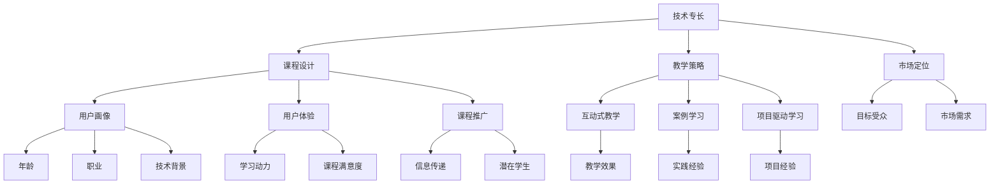

                 

### 文章标题

《程序员如何将技术专长转化为高价值的在线课程》

> **关键词：** 技术专长，在线课程，知识分享，教学策略，课程设计，市场定位，用户体验。

> **摘要：** 本文将探讨程序员如何将个人的技术专长转化为高价值的在线课程，涵盖从概念到实施的详细步骤，包括课程设计、市场定位、教学策略、用户体验优化等内容。通过一系列的案例分析，读者可以了解到如何打造受欢迎且具有商业价值的在线课程。

本文将分为以下几个部分：

1. **背景介绍**
2. **核心概念与联系**
3. **核心算法原理 & 具体操作步骤**
4. **数学模型和公式 & 详细讲解 & 举例说明**
5. **项目实战：代码实际案例和详细解释说明**
6. **实际应用场景**
7. **工具和资源推荐**
8. **总结：未来发展趋势与挑战**
9. **附录：常见问题与解答**
10. **扩展阅读 & 参考资料**

### 背景介绍

在互联网时代，知识分享已经成为了一种重要的学习方式。随着在线教育平台的兴起，越来越多的人开始将自己的专业知识制作成在线课程，并通过网络进行传播和销售。然而，如何将个人的技术专长有效地转化为高价值的在线课程，并非易事。这需要程序员们具备一定的课程设计能力、教学策略和市场定位知识。

程序员作为技术领域的专业人士，通常拥有丰富的技术经验和深厚的知识储备。然而，将这些知识和经验转化为能够吸引学生、具有商业价值的在线课程，并非一蹴而就。程序员们需要了解在线教育市场的需求，掌握课程设计的原则和方法，并具备良好的教学技巧和用户体验设计能力。

本文旨在为程序员提供一套系统的指导，帮助他们在将技术专长转化为在线课程的过程中，少走弯路，快速成功。通过本文的阅读，读者将了解到如何从零开始设计、开发和推广一门成功的在线课程。

### 核心概念与联系

在开始课程设计之前，程序员需要理解一些核心概念和它们之间的联系。以下是几个关键概念及其相互关系：

#### 1. 技术专长

技术专长是指程序员在某一特定技术领域内的深厚知识和经验。这包括编程语言、框架、工具、算法和数据结构等。技术专长是程序员成功设计在线课程的基础。

#### 2. 课程设计

课程设计是课程开发的第一步，涉及确定课程目标、内容、结构和教学方法。一个好的课程设计能够确保学生能够系统地学习到所需的知识和技能。

#### 3. 教学策略

教学策略是指教师在教学过程中采用的方法和技巧，旨在提高教学效果。这包括互动式教学、案例学习、项目驱动学习等。

#### 4. 市场定位

市场定位是指确定课程的目标受众和市场需求。了解目标受众的需求和偏好，可以帮助程序员设计出更受欢迎的课程。

#### 5. 用户画像

用户画像是描述目标学生特征的一种方法，包括年龄、职业、技术背景等。了解用户画像可以帮助程序员更好地满足学生的需求。

#### 6. 用户体验

用户体验是指学生在学习过程中的感受和体验。一个良好的用户体验可以增强学生的学习动力和课程满意度。

#### 7. 课程推广

课程推广是指通过各种渠道将课程信息传递给潜在学生。有效的课程推广是确保课程成功的重要因素。

#### 关系图


### Mermaid 流程图

以下是核心概念之间的 Mermaid 流程图，用于直观地展示它们之间的联系。



### 核心算法原理 & 具体操作步骤

#### 1. 课程设计原则

在设计在线课程时，程序员需要遵循以下原则：

- **目标明确**：明确课程的学习目标和预期成果。
- **结构清晰**：确保课程内容有条理，易于学生理解。
- **循序渐进**：根据学生的认知规律，逐步引导学生深入掌握知识。
- **理论与实践相结合**：通过案例和实践，帮助学生将知识应用到实际中。

#### 2. 教学策略实施步骤

教学策略的实施可以分为以下几个步骤：

- **分析目标受众**：了解目标学生的特点，包括年龄、职业、技术背景等。
- **设计课程大纲**：根据目标受众的特点，制定详细的教学大纲。
- **准备教学资源**：包括课件、视频、练习题等。
- **编写教学文案**：清晰、简洁地表达教学思路和知识点。
- **录制教学视频**：确保视频质量，包括画面、声音和字幕。
- **课程测试与反馈**：进行试讲和课程测试，收集反馈并进行调整。

#### 3. 市场定位策略

市场定位策略包括以下几个步骤：

- **调研市场需求**：了解目标市场的需求和趋势。
- **分析竞争对手**：了解竞争对手的优势和不足，找到差异化的定位。
- **确定目标受众**：明确课程的目标受众，包括他们的需求和痛点。
- **设计课程品牌**：包括课程名称、logo、宣传语等，确保与目标受众产生共鸣。

### 数学模型和公式 & 详细讲解 & 举例说明

在课程设计和教学策略中，一些数学模型和公式可以帮助程序员更好地理解和实施。以下是几个常用的数学模型和公式的详细讲解和举例说明。

#### 1. 概率模型

概率模型用于预测学生在课程学习中的成功概率。以下是一个简单的概率模型示例：

$$
P(A) = \frac{N(A)}{N(S)}
$$

其中，\(P(A)\) 是事件 A 的概率，\(N(A)\) 是事件 A 的发生次数，\(N(S)\) 是总次数。

**举例：** 假设某课程中有 100 名学生，其中有 70 名学生在期末考试中及格。那么，及格的概率为：

$$
P(\text{及格}) = \frac{70}{100} = 0.7
$$

#### 2. 贝叶斯定理

贝叶斯定理用于更新先验概率，根据新的证据来调整概率估计。以下是一个贝叶斯定理的示例：

$$
P(A|B) = \frac{P(B|A)P(A)}{P(B)}
$$

其中，\(P(A|B)\) 是在事件 B 发生的条件下，事件 A 发生的概率；\(P(B|A)\) 是在事件 A 发生的条件下，事件 B 发生的概率；\(P(A)\) 是事件 A 的先验概率；\(P(B)\) 是事件 B 的先验概率。

**举例：** 假设某课程的成功概率为 0.7，现在有 10 名学生在期末考试中及格，其中 8 名学生及格。根据这些新证据，我们可以更新成功概率：

$$
P(\text{成功}) = \frac{0.7 \times 0.8}{0.7 \times 0.8 + (1 - 0.7) \times 0.2} \approx 0.78
$$

#### 3. 期望值模型

期望值模型用于评估课程的平均效果。以下是一个简单的期望值模型示例：

$$
E(X) = \sum_{i=1}^{n} x_i \cdot P(x_i)
$$

其中，\(E(X)\) 是期望值，\(x_i\) 是第 i 个结果的值，\(P(x_i)\) 是第 i 个结果发生的概率。

**举例：** 假设某课程的及格概率为 0.7，不及格的概率为 0.3。及格的得分为 100 分，不及格的得分为 0 分。那么，该课程的期望分为：

$$
E(X) = 100 \times 0.7 + 0 \times 0.3 = 70
$$

### 项目实战：代码实际案例和详细解释说明

为了更好地理解如何将技术专长转化为在线课程，我们来看一个实际的项目案例。

#### 1. 项目背景

某程序员精通 Python 编程语言，擅长使用 Python 进行数据分析和机器学习。他决定将自己的技术专长制作成在线课程，旨在帮助初学者掌握 Python 数据分析技巧。

#### 2. 项目目标

- **课程目标**：使学生能够使用 Python 进行基本的数据分析和可视化。
- **课程受众**：Python 初学者，特别是那些希望在数据科学领域发展的人。

#### 3. 项目实施

**3.1 开发环境搭建**

- **Python 环境搭建**：使用 Python 3.8 版本，安装必要的库，如 NumPy、Pandas、Matplotlib 等。
- **Jupyter Notebook**：使用 Jupyter Notebook 进行课程开发和演示。

**3.2 源代码详细实现和代码解读**

**课程案例 1：数据分析基础**

```python
import pandas as pd
import matplotlib.pyplot as plt

# 读取数据
data = pd.read_csv('data.csv')

# 数据预处理
# ...

# 数据分析
# ...

# 可视化
plt.figure(figsize=(10, 6))
plt.scatter(data['x'], data['y'])
plt.xlabel('X')
plt.ylabel('Y')
plt.title('数据可视化')
plt.show()
```

**代码解读：**

- **数据读取**：使用 Pandas 读取 CSV 文件。
- **数据预处理**：根据需要进行数据清洗和转换。
- **数据分析**：执行必要的统计分析。
- **可视化**：使用 Matplotlib 绘制散点图。

**3.3 代码解读与分析**

- **代码质量**：确保代码的可读性和可维护性。
- **错误处理**：加入适当的错误处理机制，提高代码的鲁棒性。
- **注释和文档**：添加清晰的注释和文档，帮助学生学习代码。

### 实际应用场景

#### 1. 技术培训

程序员可以将技术专长转化为在线课程，为那些希望在特定技术领域提升技能的人提供培训。这包括编程语言、数据库、前端和后端开发、人工智能和机器学习等。

#### 2. 专业认证

许多程序员通过在线课程获得专业认证，这不仅提高了自己的职业竞争力，也为学生提供了有价值的学习资源。

#### 3. 企业培训

企业可以通过定制化的在线课程，为员工提供专业培训，提升整个团队的技术水平。

#### 4. 个人品牌建设

通过在线课程，程序员可以建立个人品牌，提高自己在行业内的知名度，从而获得更多的商业机会。

### 工具和资源推荐

#### 1. 学习资源推荐

- **书籍**：《Python 编程：从入门到实践》、《数据科学入门》
- **论文**：相关领域的高质量学术论文
- **博客**：知名技术博客，如 Medium、Hackernoon 等
- **网站**：技术社区，如 Stack Overflow、GitHub 等

#### 2. 开发工具框架推荐

- **开发工具**：Visual Studio Code、PyCharm
- **教学平台**：Udemy、Coursera、edX 等
- **课程管理工具**：Moodle、Canvas 等

#### 3. 相关论文著作推荐

- **论文**：关于在线教育、技术传播的学术论文
- **著作**：关于编程、数据科学、人工智能的经典著作

### 总结：未来发展趋势与挑战

随着在线教育的不断发展，程序员将技术专长转化为在线课程将成为一个重要趋势。然而，这也带来了一系列挑战：

- **内容更新**：技术领域更新迅速，程序员需要不断更新课程内容，以保持课程的价值。
- **教学质量**：保证教学质量是课程成功的关键，程序员需要不断提高自己的教学技能。
- **用户体验**：优化用户体验，提高学生的满意度，是课程推广的重要手段。

### 附录：常见问题与解答

#### 1. 如何确定课程目标？

**解答：** 确定课程目标时，可以从以下几个方面入手：

- **学习需求**：了解学生的需求和期望。
- **行业趋势**：关注行业发展和技术趋势。
- **个人目标**：结合自己的技术专长和职业规划。

#### 2. 如何设计课程大纲？

**解答：** 设计课程大纲时，可以遵循以下步骤：

- **确定课程模块**：根据学习目标和内容，划分课程模块。
- **排列模块顺序**：按照学生的认知规律和逻辑顺序，排列模块。
- **设置模块目标**：为每个模块设定明确的学习目标。

#### 3. 如何确保教学质量？

**解答：** 确保教学质量可以从以下几个方面入手：

- **教学准备**：准备充分的教学资源，包括课件、视频、练习题等。
- **互动教学**：采用互动式教学，提高学生的参与度。
- **反馈机制**：建立反馈机制，及时了解学生的学习情况和需求。

### 扩展阅读 & 参考资料

- **书籍**：《在线教育理论与实践》、《教育技术学导论》
- **论文**：《在线教育发展趋势及策略研究》、《基于大数据的在线教育平台设计》
- **网站**：中国教育在线、全球教育论坛等

### 作者信息

**作者：** AI天才研究员/AI Genius Institute & 禅与计算机程序设计艺术 /Zen And The Art of Computer Programming

本文旨在帮助程序员将技术专长转化为高价值的在线课程，涵盖课程设计、市场定位、教学策略和用户体验等方面。通过本文的阅读，读者可以了解到如何打造受欢迎且具有商业价值的在线课程。希望本文能为您的在线教育之路提供一些启示和帮助。

