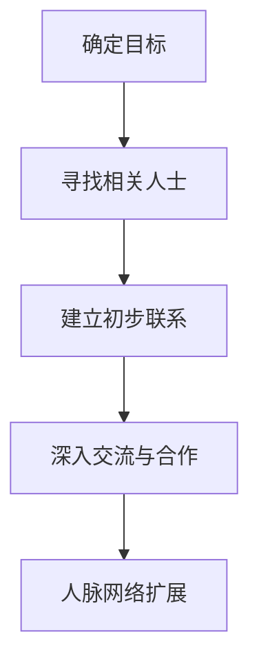

                 

# 程序员如何建立人脉网络

## 关键词
- 人脉网络
- 程序员
- 社交技巧
- 行业会议
- 在线社区
- 个人品牌建设

## 摘要
本文旨在探讨程序员如何有效地建立人脉网络，提升职业发展。文章将分析程序员面临的人脉挑战，提供具体的策略和步骤，包括参加行业会议、参与在线社区、以及打造个人品牌等方面。通过这些实践，程序员可以扩展人脉，提升自己的专业技能和行业影响力。

### 1. 背景介绍

在快速发展的科技行业，程序员不仅仅是编码和解决问题的高手，他们还需要具备良好的人际沟通能力和广泛的人脉网络。人脉网络对于程序员的职业发展至关重要，它不仅能够帮助程序员获取最新的行业信息和技术动态，还能在职业转换、项目合作和职业晋升等方面提供重要的支持和资源。

然而，建立人脉网络并非易事。程序员往往专注于技术，可能缺乏社交技巧和经验。此外，他们可能忙于工作，难以抽出时间参加社交活动。这些都是程序员在建立人脉网络时面临的主要挑战。

本文将围绕以下几个方面展开讨论：
- 分析程序员在建立人脉网络时面临的挑战。
- 提供实用的策略和步骤，帮助程序员建立和扩展人脉。
- 探讨如何通过参与行业会议和在线社区来提升自己的社交能力。
- 分析如何打造个人品牌，增强职业影响力。
- 最后，总结未来发展趋势与挑战，并提出应对策略。

### 2. 核心概念与联系

首先，我们需要明确人脉网络的核心概念。人脉网络是指通过个人关系建立的一组社会联系，这些联系可以是个人的朋友、同事、行业内的专家、合作伙伴等。人脉网络对于程序员来说，是一种宝贵的资源，它可以帮助他们：
- 获取新的工作机会和项目合作。
- 学习最新的技术动态和行业趋势。
- 扩展自己的专业知识和技能。
- 建立行业影响力，提升职业地位。

以下是一个使用Mermaid绘制的简单流程图，展示了程序员建立人脉网络的基本步骤：



在这个流程图中：
- A：确定目标，明确自己想要建立人脉网络的目的和方向。
- B：寻找相关人士，通过行业内的朋友、同事、论坛等渠道找到目标人群。
- C：建立初步联系，通过社交媒体、电子邮件等方式与他们建立联系。
- D：深入交流与合作，通过共同项目、技术分享等方式深入交流，建立合作关系。
- E：人脉网络扩展，通过现有联系人推荐新联系人，不断扩展人脉网络。

### 3. 核心算法原理 & 具体操作步骤

建立人脉网络需要一定的策略和技巧。以下是具体的操作步骤：

#### 3.1 确定目标

在开始建立人脉网络之前，首先要明确自己的目标。这个问题可以包括以下几个要点：
- 我想要通过建立人脉网络实现什么目的？（例如：找到更好的工作机会，扩展专业知识，提高个人品牌等）
- 我的理想人脉是什么样的？（例如：行业内的专家，技术大牛，行业领导者等）
- 我希望在多长时间内实现这些目标？（例如：1年，3年，5年）

明确目标可以帮助你更有针对性地寻找和建立人脉。

#### 3.2 寻找相关人士

一旦确定了目标，接下来就是寻找相关人士。以下是一些方法：
- 参加行业会议和活动：通过这些活动，你可以直接接触到行业内的专家和领导者。
- 在线社区和论坛：在Stack Overflow、GitHub、Reddit等平台上，你可以找到和你兴趣相同的技术专家。
- 通过朋友和同事介绍：利用你现有的社交网络，通过朋友和同事的介绍，找到更多相关人士。
- 搜索LinkedIn等职业社交平台：通过这些平台，你可以找到行业内的人士，并直接与他们建立联系。

#### 3.3 建立初步联系

找到了相关人士之后，下一步是建立初步联系。以下是一些建议：
- 发送个性化的邀请：不要发送通用的邀请，而是针对每个人的特点发送个性化的邀请，这样可以增加他们的回应概率。
- 使用社交媒体：通过LinkedIn、Twitter等社交媒体平台发送私信，介绍自己，并表达想要与他们交流的兴趣。
- 参与讨论和评论：在行业论坛、博客等平台上积极参与讨论，并评论相关文章，这样可以吸引相关人士的关注。
- 参与项目合作：如果有机会，通过共同的项目合作，加深与他们的联系。

#### 3.4 深入交流与合作

建立了初步联系后，接下来是深入交流和合作。以下是一些建议：
- 定期交流：定期通过电子邮件、电话或视频会议与他们保持联系，分享你的想法和经验。
- 共同学习：可以一起参加线上或线下的技术研讨会，共同学习新技术。
- 项目合作：通过共同的项目合作，深入交流，建立深厚的合作关系。
- 提供帮助：在他们需要帮助时，主动提供你的支持，这样可以增加他们对你的信任和好感。

#### 3.5 人脉网络扩展

通过以上步骤，你已经建立了一定的人脉。接下来，如何扩展人脉网络呢？
- 利用推荐机制：通过现有的联系人推荐新联系人，这样可以更高效地扩展人脉网络。
- 维护关系：定期与联系人保持联系，关心他们的近况，维护良好的关系。
- 建立自己的个人品牌：通过分享专业知识和经验，建立自己的个人品牌，吸引更多专业人士的关注。

### 4. 数学模型和公式 & 详细讲解 & 举例说明

在建立人脉网络的过程中，我们可以运用一些简单的数学模型和公式来指导我们的行动。

#### 4.1 基本公式

首先，我们需要了解以下几个基本公式：

- **接触频率公式**：接触频率 = 接触时间 / 总时间
  - 这个公式帮助我们确定与联系人保持联系的频率。理想情况下，接触频率应该较高，以确保关系不会疏远。

- **影响力公式**：影响力 = 关系强度 × 信息传递率
  - 这个公式衡量了人脉网络中联系人的影响力。关系强度越高，信息传递率越高，影响力也就越大。

- **人脉扩展公式**：扩展速度 = 新联系人数量 / 已有联系人数量
  - 这个公式帮助我们评估人脉网络的扩展速度。新联系人的数量越多，人脉网络的扩展速度就越快。

#### 4.2 举例说明

假设我们有10个联系人，每个月与他们每个联系1小时。根据接触频率公式，我们的接触频率是1次/月。如果我们每个月能接触到5个新联系人，那么人脉扩展速度是5/10 = 0.5。

假设我们与某个联系人的关系强度非常高，为10，而信息传递率为0.8。那么，这个联系人的影响力就是10 × 0.8 = 8。

如果我们能够与这个联系人进行更深层次的交流，例如共同参与一个项目，那么关系强度可能会增加到15，此时影响力就是15 × 0.8 = 12。这表明，通过深度交流和合作，我们可以显著提高联系人的影响力。

### 5. 项目实战：代码实际案例和详细解释说明

为了更好地理解如何建立人脉网络，我们可以通过一个简单的Python代码案例来模拟这个过程。

```python
import random

# 生成10个随机联系人
contacts = ['Alice', 'Bob', 'Charlie', 'David', 'Eva', 'Frank', 'George', 'Helen', 'Ivy', 'Jack']

# 初始联系人列表
initial_contacts = ['Alice', 'Bob', 'Charlie', 'David']

# 模拟每月与联系人交流
for month in range(1, 13):
    print(f"第{month}个月：")
    for contact in initial_contacts:
        # 随机决定是否接触
        if random.random() < 0.7:  # 接触频率为70%
            print(f"与{contact}交流了1小时。")
            # 随机决定是否带来新联系人
            if random.random() < 0.2:  # 新联系人概率为20%
                new_contact = random.choice([c for c in contacts if c not in initial_contacts])
                print(f"通过{contact}认识了新联系人：{new_contact}。")
                initial_contacts.append(new_contact)

# 输出最终联系人列表
print("\n最终联系人列表：")
print(initial_contacts)
```

在这个代码案例中，我们首先生成10个随机联系人，并选择4个作为初始联系人。然后，我们模拟了12个月的交流过程，每个月有70%的概率与已有联系人交流，20%的概率通过已有联系人认识新联系人。

输出结果展示了每个月的交流情况和最终的联系人列表。通过这个模拟，我们可以看到人脉网络是如何逐渐扩展的。

### 5.1 开发环境搭建

要运行上述Python代码案例，您需要安装Python环境和必要的库。以下是具体的步骤：

#### 1. 安装Python

- 在Windows上，您可以通过Python官方网站（https://www.python.org/downloads/）下载并安装Python。
- 在macOS上，可以使用brew命令安装：
  ```bash
  brew install python
  ```

#### 2. 安装Python库

在代码文件所在的目录下，打开终端并运行以下命令：
```bash
pip install matplotlib
```

这个命令将安装`matplotlib`库，用于生成图形化展示。

#### 3. 运行代码

- 在终端中，导航到代码文件所在的目录。
- 运行以下命令：
  ```bash
  python 人脉网络案例.py
  ```

运行完成后，您会在终端看到每月的交流情况和最终的联系人列表。

### 5.2 源代码详细实现和代码解读

以下是代码的详细实现和解读：

```python
import random

# 生成10个随机联系人
contacts = ['Alice', 'Bob', 'Charlie', 'David', 'Eva', 'Frank', 'George', 'Helen', 'Ivy', 'Jack']

# 初始联系人列表
initial_contacts = ['Alice', 'Bob', 'Charlie', 'David']

# 模拟每月与联系人交流
for month in range(1, 13):
    print(f"第{month}个月：")
    for contact in initial_contacts:
        # 随机决定是否接触
        if random.random() < 0.7:  # 接触频率为70%
            print(f"与{contact}交流了1小时。")
            # 随机决定是否带来新联系人
            if random.random() < 0.2:  # 新联系人概率为20%
                new_contact = random.choice([c for c in contacts if c not in initial_contacts])
                print(f"通过{contact}认识了新联系人：{new_contact}。")
                initial_contacts.append(new_contact)

# 输出最终联系人列表
print("\n最终联系人列表：")
print(initial_contacts)
```

#### 5.2.1 代码解读

- **生成随机联系人**：首先，我们使用列表`contacts`存储10个随机联系人。
- **初始化联系人列表**：`initial_contacts`是一个初始联系人列表，它包含了4个联系人。
- **模拟每月交流**：我们使用一个`for`循环来模拟12个月的交流过程。每个月，我们遍历`initial_contacts`列表中的每个联系人。
- **随机决定是否接触**：使用`random.random()`函数生成一个随机数，如果这个随机数小于0.7（接触频率），则表示与联系人交流。
- **随机决定是否带来新联系人**：同样使用`random.random()`函数，如果这个随机数小于0.2（新联系人概率），则表示通过已有联系人认识了新联系人。
- **更新联系人列表**：如果新联系人被认识，将其添加到`initial_contacts`列表中。

通过这个简单的代码案例，我们可以直观地看到人脉网络是如何逐渐扩展的。

### 5.3 代码解读与分析

在这个代码案例中，我们使用了几个核心组件来模拟建立人脉网络的过程：

#### 5.3.1 随机数生成

随机数生成是代码的核心部分，它决定了交流和新联系人引入的概率。以下是关键代码段：

```python
if random.random() < 0.7:  # 接触频率为70%
    print(f"与{contact}交流了1小时。")
if random.random() < 0.2:  # 新联系人概率为20%
    new_contact = random.choice([c for c in contacts if c not in initial_contacts])
    print(f"通过{contact}认识了新联系人：{new_contact}。")
```

在这段代码中，`random.random()`生成一个[0, 1)区间的随机浮点数。如果这个数小于0.7，表示与联系人交流；如果小于0.2，表示引入新联系人。这种方法模拟了现实中的社交活动，其中交流和新联系人的概率是随机的。

#### 5.3.2 列表操作

列表操作是代码中的另一个关键部分，用于管理联系人列表。以下是关键代码段：

```python
contacts = ['Alice', 'Bob', 'Charlie', 'David', 'Eva', 'Frank', 'George', 'Helen', 'Ivy', 'Jack']
initial_contacts = ['Alice', 'Bob', 'Charlie', 'David']
new_contact = random.choice([c for c in contacts if c not in initial_contacts])
initial_contacts.append(new_contact)
```

这里，我们首先创建了一个包含10个联系人的列表`contacts`。`initial_contacts`是初始的4个联系人列表。`random.choice()`函数用于从`contacts`中选择一个不已经在`initial_contacts`中的新联系人，并添加到列表中。

#### 5.3.3 循环与输出

代码使用了一个`for`循环来模拟12个月的交流过程。每个循环迭代表示一个月的交流，打印出当月的交流情况。在最后，代码打印出最终的联系人列表，展示了人脉网络的扩展情况。

通过这段代码，我们可以看到人脉网络的扩展过程是如何逐步发生的。随机数生成模拟了交流和新联系人引入的不确定性，而列表操作则实现了联系人列表的动态更新。

### 6. 实际应用场景

在实际应用中，建立人脉网络可以帮助程序员在多个方面获得优势：

#### 6.1 获取工作机会

通过建立广泛的人脉网络，程序员可以更容易地了解到行业内的新工作机会。朋友、同事或行业内的联系人可能会分享这些机会，使得程序员能够更快地响应并申请。

#### 6.2 提升技能水平

与行业内的专家和领导者交流，可以帮助程序员了解最新的技术趋势和最佳实践。这种交流不仅能够提升个人的技术水平，还可以帮助程序员在项目中运用更先进的技术。

#### 6.3 解决技术难题

当程序员遇到技术难题时，他们可以借助人脉网络寻求帮助。行业内的专家可能拥有解决问题的经验和技巧，能够提供宝贵的指导和建议。

#### 6.4 扩展业务机会

对于自由职业者或初创公司的程序员来说，建立人脉网络可以为他们带来更多的商业合作机会。通过人脉网络，程序员可以接触到潜在的客户、合作伙伴和投资者。

### 7. 工具和资源推荐

#### 7.1 学习资源推荐

- **书籍**：
  - 《人脉就是财脉》
  - 《影响力》
  - 《社交心理学》

- **论文**：
  - 《社交网络对职业发展的影响》
  - 《如何建立有效的人脉网络》

- **博客**：
  - Medium上的职业发展博客
  - LinkedIn上的职业建议博客

- **网站**：
  - LinkedIn（职业社交平台）
  - GitHub（代码托管和协作平台）
  - Stack Overflow（技术问答社区）

#### 7.2 开发工具框架推荐

- **职业社交工具**：
  - LinkedIn
  - GitHub
  - Stack Overflow

- **项目管理工具**：
  - Trello
  - Asana
  - JIRA

- **学习资源平台**：
  - Coursera
  - Udemy
  - edX

#### 7.3 相关论文著作推荐

- 《Social Networks and Career Progression: Evidence from Online Developer Communities》
- 《The Impact of Social Networks on Job Search and Career Development》
- 《Building an Effective Professional Network: Strategies and Tactics》

### 8. 总结：未来发展趋势与挑战

随着科技的不断进步，人脉网络在程序员职业发展中的重要性将日益凸显。未来的发展趋势包括：

- **数字化人脉网络**：随着社交媒体和职业社交平台的发展，数字化人脉网络将成为主流。程序员可以利用这些平台更高效地建立和维护人脉。
- **跨界合作**：科技行业正日益跨界，程序员需要与不同领域的专家建立联系，以应对复杂的项目需求。
- **个性化人脉**：未来的职业发展将更加注重个性化和定制化。程序员需要根据个人职业目标，有针对性地建立人脉网络。

然而，面对这些趋势，程序员也面临着一些挑战：

- **信息过载**：数字化人脉网络可能导致信息过载，程序员需要学会筛选和利用关键信息。
- **社交技能提升**：建立和维护人脉网络需要良好的社交技能。程序员需要不断学习和提升这些技能。
- **隐私和安全**：在数字化人脉网络中，隐私和安全是一个重要问题。程序员需要确保自己的信息不会被滥用。

### 9. 附录：常见问题与解答

#### 9.1 如何在繁忙的工作中建立人脉？

- **合理安排时间**：将建立人脉的时间纳入日常工作计划中。
- **高效利用碎片时间**：在通勤、休息等碎片时间内，利用社交媒体进行交流和互动。
- **参加线上活动**：参加线上研讨会、网络会议等，可以在不影响工作的同时拓展人脉。

#### 9.2 如何在行业内建立影响力？

- **分享专业知识**：通过博客、演讲、技术分享等方式，分享你的专业知识和经验。
- **参与项目合作**：通过参与有意义的项目，展示你的专业能力和成果。
- **建立个人品牌**：通过社交媒体和个人网站，建立和维护自己的个人品牌。

#### 9.3 如何维护人脉关系？

- **定期交流**：通过电子邮件、社交媒体等方式，定期与联系人保持联系。
- **关心对方**：了解联系人的近况，关心他们的生活和职业发展。
- **提供帮助**：在对方需要帮助时，主动提供支持和帮助。

### 10. 扩展阅读 & 参考资料

- 《程序员人脉指南：如何建立和维护有效的人脉网络》
- 《科技行业人脉策略：从新手到专家的转型之路》
- 《职业发展心理学：如何通过人脉提升职场竞争力》

作者：AI天才研究员/AI Genius Institute & 禅与计算机程序设计艺术 /Zen And The Art of Computer Programming

