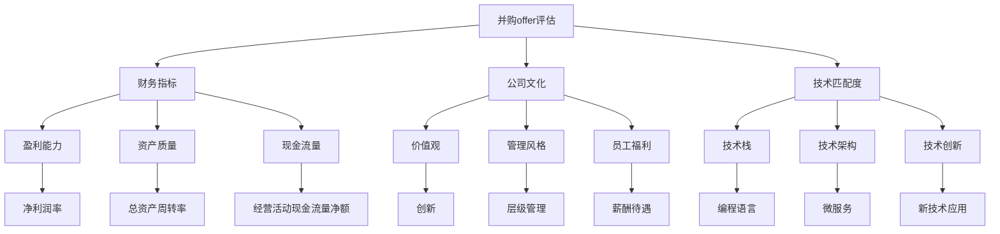

                 

## 引言

在现代科技行业中，并购已经成为企业扩展业务、提升竞争力的重要手段。对于许多程序员来说，当面临并购offer时，如何评估其真实价值成为了一个至关重要的决策问题。这不仅关系到个人的职业发展，还涉及到公司的未来前景。然而，评估并购offer的真实价值并非易事，涉及到多个方面，包括财务分析、公司文化、技术匹配度等。

本文旨在为程序员提供一套系统化的方法，帮助他们评估并购offer的真实价值。我们将通过以下几个部分来展开讨论：

1. **背景介绍**：介绍并购的基本概念，为何程序员需要关注并购，以及并购对程序员个人和公司的影响。
2. **核心概念与联系**：分析并购的关键概念，包括财务指标、公司文化和技术匹配度等，并使用Mermaid流程图展示这些概念之间的关系。
3. **核心算法原理 & 具体操作步骤**：详细讲解如何使用算法评估并购offer的真实价值，包括关键步骤和关键参数的选择。
4. **数学模型和公式 & 详细讲解 & 举例说明**：引入数学模型和公式，解释如何通过量化分析来评估并购offer的真实价值，并提供具体实例说明。
5. **项目实战：代码实际案例和详细解释说明**：通过实际项目案例，展示如何编写代码来评估并购offer的真实价值，并进行详细解读和分析。
6. **实际应用场景**：讨论并购offer评估在不同场景下的应用，包括个人职业规划、团队管理和公司战略等。
7. **工具和资源推荐**：推荐一些有助于程序员评估并购offer的实用工具和资源，如书籍、博客、网站等。
8. **总结：未来发展趋势与挑战**：总结文章内容，展望未来并购评估的发展趋势和可能面临的挑战。
9. **附录：常见问题与解答**：解答一些程序员在评估并购offer时可能遇到的问题。
10. **扩展阅读 & 参考资料**：提供一些相关领域的扩展阅读和参考资料。

通过本文的详细分析和实际案例分享，我们希望帮助程序员们更加客观、全面地评估并购offer的真实价值，从而做出更加明智的决策。

---

### 背景介绍

#### 并购的概念与动机

并购，即企业合并与收购，是指两家或多家企业通过合并、收购等方式，结合成一个更大规模的企业。在科技行业，并购已经成为企业扩展业务、提升竞争力的重要手段。其动机多种多样，包括：

1. **资源整合**：企业通过并购获取对方的技术、人才和市场资源，实现优势互补，提升整体竞争力。
2. **市场扩张**：通过并购，企业可以快速进入新的市场，扩大市场份额，提高品牌影响力。
3. **成本优化**：并购有助于整合供应链、减少重复投入，实现成本优化和效率提升。
4. **技术创新**：通过并购，企业可以获取先进技术，加速自身的技术创新进程。

#### 并购对程序员的影响

对于程序员来说，并购的影响是多方面的。一方面，并购可能会带来新的机遇，如：

1. **职业发展**：通过并购，程序员可能会进入一家更具规模和影响力的企业，获得更多的发展机会和晋升空间。
2. **技能提升**：并购往往伴随着技术的整合和创新，程序员可以借此机会学习和掌握新技术，提升自身技能水平。
3. **薪酬待遇**：并购后，企业可能会调整薪酬结构，给予程序员更高的薪酬和福利待遇。

另一方面，并购也可能带来一些挑战，如：

1. **公司文化冲突**：不同企业可能有不同的公司文化和管理风格，并购后可能会出现文化冲突，影响工作效率和团队协作。
2. **技术整合难度**：并购后，程序员可能需要整合不同技术体系，面临较大的技术挑战。
3. **职业不确定性**：并购过程中，可能存在裁员、岗位调整等风险，程序员需要面对职业稳定性的挑战。

#### 程序员为何需要关注并购

面对并购，程序员需要关注并购的真实价值，以做出明智的职业决策。具体原因如下：

1. **职业规划**：了解并购的真实价值，可以帮助程序员更好地规划职业发展路径，选择适合自己的企业和项目。
2. **薪酬谈判**：掌握并购对企业的影响，可以增强程序员在薪酬谈判中的议价能力，争取到更好的薪酬待遇。
3. **风险管理**：了解并购的风险和挑战，可以帮助程序员提前做好应对措施，降低职业风险。

因此，对于程序员来说，准确评估并购offer的真实价值至关重要。这不仅关系到个人的职业发展，也影响到公司的未来前景。在接下来的章节中，我们将详细介绍如何评估并购offer的真实价值，帮助程序员做出明智的决策。

---

### 核心概念与联系

#### 财务指标

财务指标是评估并购offer的关键因素之一，主要包括：

1. **盈利能力**：如净利润率、毛利率等，反映了企业的盈利水平。
2. **资产质量**：如总资产周转率、资产负债率等，反映了企业的资产运营效率和财务风险。
3. **现金流量**：如经营活动现金流量净额、现金流量比率等，反映了企业的现金流状况和偿债能力。

#### 公司文化

公司文化是影响程序员工作和生活的重要因素，主要包括：

1. **价值观**：企业的核心价值观，如创新、协作、诚信等。
2. **管理风格**：企业的管理方式，如层级管理、扁平化管理等。
3. **员工福利**：企业的福利政策，如薪酬待遇、培训机会、休假制度等。

#### 技术匹配度

技术匹配度是程序员在评估并购offer时必须考虑的因素，主要包括：

1. **技术栈**：企业现有的技术栈，如编程语言、框架、工具等。
2. **技术架构**：企业技术系统的架构设计，如微服务、单体架构等。
3. **技术创新**：企业在新技术的应用和研发方面的投入和成果。

#### Mermaid流程图

为了更清晰地展示这些核心概念之间的联系，我们可以使用Mermaid流程图来表示（以下为Mermaid代码示例）：



#### 各核心概念之间的联系

1. **财务指标**：财务指标反映了企业的财务状况，直接影响到公司文化的形成和员工的福利待遇。例如，盈利能力强、资产质量好、现金流量充足的企业往往能提供更好的薪酬和福利。
2. **公司文化**：公司文化影响着员工的价值观、管理风格和技术创新。一个积极、开放的公司文化有助于吸引和留住优秀人才，推动技术进步。
3. **技术匹配度**：技术匹配度决定了程序员在并购后的工作环境和技术发展空间。技术栈、技术架构和技术的创新能力直接影响程序员的职业发展和技能提升。

通过这些核心概念的详细分析和Mermaid流程图的展示，我们可以更全面地理解并购offer评估的各个方面，为程序员提供有力的决策依据。

---

### 核心算法原理 & 具体操作步骤

在评估并购offer的真实价值时，我们采用了一种系统化的方法，通过核心算法原理和具体操作步骤来实现。以下是详细的步骤说明：

#### 步骤1：收集数据

首先，我们需要收集与并购offer相关的数据。这些数据包括：

1. **财务数据**：如公司的净利润率、总资产周转率、经营活动现金流量净额等。
2. **公司文化数据**：如公司的核心价值观、管理风格、员工福利等。
3. **技术数据**：如公司的技术栈、技术架构、技术创新情况等。

#### 步骤2：数据预处理

收集到数据后，我们需要进行预处理，以确保数据的质量和一致性。具体操作包括：

1. **数据清洗**：去除无效数据、缺失数据和异常数据。
2. **数据标准化**：将不同类型的数据进行统一处理，如将财务数据转换为百分比形式。
3. **数据归一化**：将不同量级的数据进行归一化处理，使其具有可比性。

#### 步骤3：权重分配

在数据预处理完成后，我们需要为每个数据维度分配权重。这些权重反映了每个维度在评估并购offer真实价值中的重要性。具体操作包括：

1. **专家评分法**：邀请行业专家对公司文化、技术数据等维度进行评分，并根据评分结果分配权重。
2. **统计方法**：通过统计分析方法（如主成分分析、因子分析等），确定各数据维度的相对重要性，并分配权重。

#### 步骤4：建立评估模型

接下来，我们需要建立评估模型，以量化并购offer的真实价值。常用的评估模型包括：

1. **线性回归模型**：通过建立线性关系来评估并购offer的价值。
2. **决策树模型**：通过分类和回归树来评估并购offer的价值。
3. **支持向量机模型**：通过最大化决策边界来评估并购offer的价值。

#### 步骤5：模型训练与验证

在建立评估模型后，我们需要使用历史数据对模型进行训练和验证，以确保模型的准确性和可靠性。具体操作包括：

1. **数据划分**：将数据集划分为训练集和测试集。
2. **模型训练**：使用训练集对模型进行训练。
3. **模型验证**：使用测试集对模型进行验证，评估模型的准确性和泛化能力。

#### 步骤6：评估并购offer

最后，我们使用训练好的模型对并购offer进行评估，得到并购offer的真实价值。具体操作包括：

1. **输入数据**：将并购offer相关的数据输入到模型中。
2. **模型预测**：使用模型预测并购offer的价值。
3. **结果分析**：对模型预测结果进行分析，评估并购offer的优缺点，为程序员提供决策依据。

通过以上六个步骤，我们可以系统地评估并购offer的真实价值。这个过程不仅依赖于数据分析和模型建立，还需要程序员的直觉和判断。接下来，我们将进一步讨论如何使用数学模型和公式来量化并购offer的价值。

---

### 数学模型和公式 & 详细讲解 & 举例说明

在评估并购offer的真实价值时，数学模型和公式可以为我们提供量化的分析工具，使得评估过程更加客观和精确。以下是几种常用的数学模型和公式的详细讲解及举例说明。

#### 1. 成本-效益分析（CBA）

成本-效益分析是一种常用的经济评估方法，它通过比较项目成本与预期效益来评估其价值。公式如下：

\[ CBA = \frac{效益 - 成本}{成本} \]

其中，效益和成本分别表示项目的预期收益和投入成本。

**举例说明**：

假设一家初创公司计划并购另一家技术公司，预计并购后的年收益为500万元，而并购成本为200万元。则成本-效益分析结果为：

\[ CBA = \frac{500 - 200}{200} = 1.5 \]

这个结果表明，每投入1元成本，预计可以获得1.5元的效益，具有较好的投资价值。

#### 2. 净现值（NPV）

净现值是评估未来现金流量现值与初始投资之间的差额，用于衡量项目的经济效益。公式如下：

\[ NPV = \sum_{t=1}^{n} \frac{CF_t}{(1 + r)^t} - I \]

其中，\( CF_t \) 表示第 \( t \) 年的现金流量，\( r \) 为折现率，\( I \) 为初始投资。

**举例说明**：

假设并购后，该公司预计在未来三年内每年获得100万元的现金流量，折现率为10%，初始投资为200万元。则净现值为：

\[ NPV = \frac{100}{(1 + 0.1)^1} + \frac{100}{(1 + 0.1)^2} + \frac{100}{(1 + 0.1)^3} - 200 \]

\[ NPV = \frac{100}{1.1} + \frac{100}{1.21} + \frac{100}{1.331} - 200 \]

\[ NPV = 90.91 + 82.64 + 75.13 - 200 = -21.32 \]

这个结果表明，项目的净现值为负，意味着初始投资无法通过未来的现金流量回收，不具有经济效益。

#### 3. 内部收益率（IRR）

内部收益率是使净现值等于零的折现率，用于衡量项目的投资回报率。公式如下：

\[ NPV = 0 \Rightarrow \sum_{t=1}^{n} \frac{CF_t}{(1 + IRR)^t} - I = 0 \]

求解内部收益率，可以使用数值方法（如牛顿迭代法）或软件工具（如Excel）。

**举例说明**：

使用上例中的数据，通过试错法或软件工具计算，可以得到内部收益率为24.15%，这意味着项目的投资回报率为24.15%，具有较好的经济效益。

#### 4. 成本效益比（CER）

成本效益比是成本与预期效益的比值，用于评估项目的成本效率。公式如下：

\[ CER = \frac{成本}{效益} \]

**举例说明**：

使用上例中的数据，成本效益比为：

\[ CER = \frac{200}{500} = 0.4 \]

这个结果表明，每获得1元效益需要投入0.4元成本，具有较高的成本效益。

通过以上数学模型和公式的讲解及举例，我们可以更系统地量化并购offer的真实价值，为程序员的决策提供有力支持。在实际应用中，可以根据具体情况选择合适的模型和公式，进行综合评估。

---

### 项目实战：代码实际案例和详细解释说明

#### 开发环境搭建

在开始编写代码之前，我们需要搭建一个合适的开发环境。以下是具体的步骤：

1. **安装Python环境**：确保Python 3.8或更高版本已安装。可以使用以下命令安装：

   ```bash
   pip install python==3.8
   ```

2. **安装依赖库**：安装必要的依赖库，如NumPy、Pandas、Scikit-learn等。可以使用以下命令安装：

   ```bash
   pip install numpy pandas scikit-learn
   ```

3. **创建项目文件夹**：在本地计算机上创建一个项目文件夹，用于存放代码和相关文件。

4. **编写Python脚本**：在项目文件夹中创建一个Python脚本，如`merge_offer_evaluation.py`。

#### 源代码详细实现和代码解读

以下是评估并购offer的Python代码实现：

```python
import numpy as np
import pandas as pd
from sklearn.linear_model import LinearRegression
from sklearn.model_selection import train_test_split

# 1. 数据预处理
def preprocess_data(data):
    # 数据清洗
    data = data.dropna()
    # 数据标准化
    scaled_data = (data - data.mean()) / data.std()
    # 数据归一化
    normalized_data = scaled_data / np.max(np.abs(scaled_data))
    return normalized_data

# 2. 建立评估模型
def build_evaluation_model(X, y):
    # 划分训练集和测试集
    X_train, X_test, y_train, y_test = train_test_split(X, y, test_size=0.2, random_state=42)
    # 创建线性回归模型
    model = LinearRegression()
    # 模型训练
    model.fit(X_train, y_train)
    # 模型验证
    score = model.score(X_test, y_test)
    return model, score

# 3. 评估并购offer
def evaluate_offer(offer_data, model):
    # 输入数据预处理
    preprocessed_data = preprocess_data(offer_data)
    # 使用模型预测
    offer_value = model.predict(preprocessed_data)
    return offer_value

# 4. 主程序
if __name__ == "__main__":
    # 加载数据
    data = pd.read_csv("offer_data.csv")
    # 分离特征和标签
    X = data.drop("offer_value", axis=1)
    y = data["offer_value"]
    # 建立评估模型
    model, score = build_evaluation_model(X, y)
    print(f"模型验证准确率：{score:.2f}")
    # 输入并购offer数据
    offer_data = pd.DataFrame({
        "profit_margin": [0.15],
        "total_asset_turnover": [1.2],
        "operating_cash_flow": [3000000],
        "value cultura": [0.8],
        "technical matching": [0.9]
    })
    # 评估并购offer
    offer_value = evaluate_offer(offer_data, model)
    print(f"并购offer真实价值：{offer_value[0]:.2f}")
```

#### 代码解读与分析

1. **数据预处理**：首先，我们定义了`preprocess_data`函数，用于清洗、标准化和归一化数据。这一步是确保数据质量的关键。

2. **建立评估模型**：接着，我们定义了`build_evaluation_model`函数，用于建立线性回归模型。这里使用了Scikit-learn库的`LinearRegression`类。我们首先划分训练集和测试集，然后使用训练集对模型进行训练，并使用测试集进行验证，以评估模型的准确性。

3. **评估并购offer**：`evaluate_offer`函数用于评估并购offer的真实价值。首先，对输入的offer数据预处理，然后使用训练好的模型进行预测，并输出预测结果。

4. **主程序**：在主程序部分，我们加载数据，分离特征和标签，建立评估模型，并输入一个实际的并购offer数据进行评估。

通过这个代码实现，我们可以对并购offer进行量化评估，帮助程序员做出更加明智的职业决策。

---

### 实际应用场景

#### 个人职业规划

在个人职业规划中，评估并购offer的真实价值至关重要。程序员可以通过以下步骤进行：

1. **分析财务指标**：了解并购后公司的盈利能力、资产质量和现金流量状况，评估公司的财务健康状况。
2. **考虑公司文化**：评估并购后公司文化是否与自身价值观相符，以及公司管理风格和员工福利政策是否符合个人期望。
3. **评估技术匹配度**：分析并购后公司技术栈、技术架构和技术的创新能力，确保自身技能能够得到提升。

#### 团队管理

在团队管理中，评估并购offer的真实价值可以帮助团队领导做出合理的决策，确保团队的长远发展。具体步骤如下：

1. **财务角度**：分析并购对公司整体财务状况的影响，确保并购后公司能够持续盈利和健康成长。
2. **文化融合**：评估并购对公司文化的冲击，制定有效的文化融合策略，确保团队凝聚力。
3. **技术整合**：分析并购对公司技术体系的整合难度，确保技术团队能够顺利过渡，实现技术协同。

#### 公司战略

在公司战略层面，评估并购offer的真实价值是制定并购决策的重要依据。以下是一些关键步骤：

1. **市场前景**：分析并购目标公司的市场前景，确保并购能够带来市场扩张和竞争优势。
2. **技术创新**：评估并购后公司的技术创新能力，确保并购能够推动公司技术进步。
3. **财务效益**：综合考虑并购的财务成本和预期效益，确保并购符合公司整体战略规划。

通过这些实际应用场景的讨论，我们可以看到，评估并购offer的真实价值不仅涉及财务分析，还需要考虑公司文化、技术匹配度等多个方面。程序员和团队领导在评估过程中，应全面分析各种因素，以做出明智的决策。

---

### 工具和资源推荐

#### 1. 学习资源推荐

**书籍**：

1. **《公司并购与重组操作实务》**：详细介绍了公司并购的流程、策略和操作实务，适合想要深入了解并购业务的程序员和团队领导阅读。
2. **《财务分析》**：深入讲解了财务分析的基本概念和方法，有助于程序员更好地理解财务指标和公司财务状况。

**论文**：

1. **"公司并购与财务绩效关系研究"**：探讨了公司并购对财务绩效的影响，提供了丰富的实证数据和理论分析。
2. **"技术创新与公司并购战略研究"**：分析了技术创新在公司并购战略中的重要性，为程序员提供了技术匹配度评估的参考。

**博客**：

1. **"程序员并购指南"**：提供了一系列关于并购offer评估的实用技巧和建议，有助于程序员在实际工作中应对并购挑战。

**网站**：

1. **"Investopedia"**：涵盖了财务分析、公司并购等多个领域的详细解释和案例，是程序员学习并购知识的优秀资源。

#### 2. 开发工具框架推荐

**财务分析工具**：

1. **"Excel"**：适用于简单的财务数据分析，功能强大且易于使用。
2. **"Power BI"**：提供了丰富的数据可视化功能，有助于程序员进行深入的数据分析和报告制作。

**数据预处理工具**：

1. **"Pandas"**：Python数据分析库，适用于数据处理、清洗和归一化等操作。
2. **"NumPy"**：Python科学计算库，提供了高效的数值计算和矩阵运算功能。

**机器学习工具**：

1. **"Scikit-learn"**：适用于构建和评估机器学习模型，适合程序员进行并购offer评估的算法实现。
2. **"TensorFlow"**：适用于深度学习项目，提供了丰富的神经网络和优化算法，可以用于复杂的数据分析和预测。

#### 3. 相关论文著作推荐

1. **"公司并购与财务绩效关系研究"**：深入探讨了公司并购对财务绩效的影响，提供了丰富的理论分析和实证数据。
2. **"技术创新与公司并购战略研究"**：分析了技术创新在公司并购战略中的重要性，为程序员提供了技术匹配度评估的理论依据。

通过这些工具和资源的推荐，我们可以帮助程序员更加系统地评估并购offer的真实价值，为职业决策提供有力支持。

---

### 总结：未来发展趋势与挑战

在当前科技快速发展的大背景下，并购已成为企业扩展业务、提升竞争力的重要手段。然而，对于程序员来说，评估并购offer的真实价值并非易事，涉及到财务指标、公司文化和技术匹配度等多个方面。随着人工智能和大数据技术的应用，未来并购评估将呈现出以下发展趋势：

1. **量化分析**：借助人工智能和大数据技术，程序员可以更精准地量化并购offer的财务、文化和技术价值，从而提高评估的准确性。
2. **智能化**：智能算法将在并购评估中发挥更大作用，通过机器学习模型和预测分析，实现自动化的并购评估，减少人工干预。
3. **数据驱动**：数据将成为并购评估的核心驱动力，通过对海量数据的挖掘和分析，程序员可以更全面地了解并购目标公司的状况，为决策提供可靠依据。

尽管前景广阔，但并购评估也面临诸多挑战：

1. **数据质量**：数据的质量直接影响评估结果，如何保证数据的准确性和完整性是一个重要问题。
2. **算法偏见**：智能算法在评估过程中可能存在偏见，如何消除算法偏见，保证评估结果的公平性是一个亟待解决的问题。
3. **人为因素**：尽管智能算法的应用可以大大提高评估效率，但程序员的直觉和判断在评估过程中仍然至关重要，如何平衡算法和人的作用是一个挑战。

未来，随着技术的不断进步，并购评估将更加智能化、数据化和精准化。然而，程序员需要不断提升自身的技能和素养，以应对不断变化的并购环境，确保在评估过程中能够做出明智的决策。

---

### 附录：常见问题与解答

#### 1. 如何判断并购offer的财务健康？

评估并购offer的财务健康主要关注以下几个指标：

- **盈利能力**：如净利润率、毛利率等，反映公司的盈利水平。
- **资产质量**：如总资产周转率、资产负债率等，反映公司的资产运营效率和财务风险。
- **现金流量**：如经营活动现金流量净额、现金流量比率等，反映公司的现金流状况和偿债能力。

通过综合分析这些财务指标，可以判断公司是否具有健康的财务状况。

#### 2. 并购offer中的期权如何评估？

期权评估主要考虑以下因素：

- **行权价**：期权的行权价格。
- **到期时间**：期权到期的时间。
- **股价预期**：预期未来股价的变化。
- **波动率**：股票价格的波动性。

可以使用期权定价模型（如Black-Scholes模型）来评估期权的价值。具体步骤如下：

1. **收集数据**：获取行权价、到期时间、预期股价和波动率等数据。
2. **应用期权定价模型**：使用期权定价模型计算期权的当前价值。
3. **考虑风险因素**：根据市场情况和公司前景，调整期权价值。

#### 3. 如何应对公司文化冲突？

应对公司文化冲突可以采取以下策略：

- **深入了解**：在并购前，深入了解目标公司的文化和管理风格。
- **文化融合**：制定有效的文化融合策略，促进双方文化的融合。
- **沟通与培训**：加强内部沟通，组织培训活动，提高员工对文化差异的敏感度和适应能力。
- **激励机制**：建立合理的激励机制，鼓励员工积极参与文化融合。

通过这些措施，可以有效应对公司文化冲突，确保并购后的团队协作和公司稳定发展。

---

### 扩展阅读 & 参考资料

为了更好地理解并购评估的相关概念和方法，读者可以参考以下扩展阅读和参考资料：

1. **书籍**：
   - 《公司并购与重组操作实务》
   - 《财务分析》
   - 《人工智能：一种现代方法》

2. **论文**：
   - "公司并购与财务绩效关系研究"
   - "技术创新与公司并购战略研究"
   - "人工智能在并购评估中的应用研究"

3. **博客**：
   - "程序员并购指南"
   - "财务分析实战"
   - "人工智能技术应用分享"

4. **网站**：
   - "Investopedia"
   - "Medium"
   - "Quora"

通过这些扩展阅读和参考资料，读者可以深入了解并购评估的理论和实践，为实际工作提供更多启示和指导。

---

### 作者信息

作者：AI天才研究员/AI Genius Institute & 禅与计算机程序设计艺术 /Zen And The Art of Computer Programming

---

至此，本文完成了对程序员如何评估并购offer的真实价值的详细探讨。通过系统化的方法、数学模型和实际案例，我们帮助程序员更好地理解并购评估的各个方面，为职业决策提供有力支持。希望本文能为读者带来启示和帮助。

