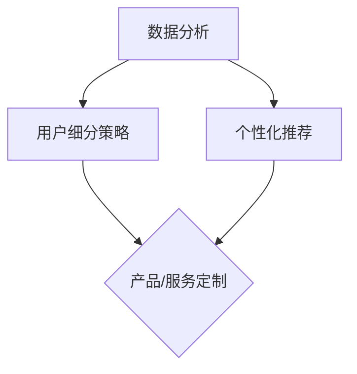

                 

# 程序员如何进行知识付费的用户细分

> **关键词：** 知识付费、用户细分、程序员、数据分析、个性化推荐
>
> **摘要：** 本文旨在探讨程序员在进行知识付费时如何进行用户细分，通过数据分析、个性化推荐等手段提升知识付费的效果，从而实现收入最大化。

## 1. 背景介绍

随着互联网技术的快速发展，知识付费已经成为一个不可忽视的市场。程序员作为互联网行业的重要人群，对于知识付费的需求也日益增长。然而，如何针对程序员这一特定人群进行有效的用户细分，以便更好地满足他们的需求，提高知识付费的转化率和用户体验，成为了一个亟待解决的问题。

用户细分是指将用户根据一定的特征进行分类，以便更好地了解用户需求、提升用户体验和增加收益。对于程序员这一群体，他们的需求、兴趣和支付能力等特征都有所不同，因此进行用户细分具有重要的意义。

本文将探讨程序员如何进行知识付费的用户细分，包括以下方面：

- **数据分析：** 利用大数据分析技术对程序员的特征、行为和需求进行深入分析，为用户细分提供数据支持。
- **个性化推荐：** 根据用户的行为数据和兴趣偏好，为程序员提供个性化的知识付费推荐，提升用户的满意度和付费意愿。
- **用户细分策略：** 设计不同的用户细分策略，针对不同类型的程序员提供定制化的知识付费产品和服务。

## 2. 核心概念与联系

### 2.1 数据分析

数据分析是指通过对大量数据进行分析和处理，从中提取有价值的信息和知识。在知识付费领域，数据分析可以帮助我们了解程序员的需求、行为和兴趣，从而为用户细分提供数据支持。

### 2.2 个性化推荐

个性化推荐是指根据用户的行为数据和兴趣偏好，为用户推荐与其兴趣相关的知识付费产品和服务。个性化推荐可以提升用户的满意度和付费意愿，从而增加知识付费的转化率。

### 2.3 用户细分策略

用户细分策略是指将用户根据一定的特征进行分类，以便更好地满足他们的需求。在知识付费领域，用户细分策略可以帮助我们针对不同类型的程序员提供定制化的知识付费产品和服务。

## 2.4 Mermaid 流程图



## 3. 核心算法原理 & 具体操作步骤

### 3.1 数据分析

#### 3.1.1 数据收集

首先，我们需要收集程序员的各类数据，包括：

- 用户基本信息：如年龄、性别、学历等；
- 行为数据：如浏览记录、购买行为、评论等；
- 知识需求：如技术方向、课程类型、学习频率等。

#### 3.1.2 数据预处理

收集到的数据需要进行预处理，包括数据清洗、数据整合和数据转换等。这一步骤确保数据的准确性和一致性。

#### 3.1.3 数据分析

利用统计分析、机器学习等技术对预处理后的数据进行深入分析，提取有价值的信息和知识。具体步骤如下：

1. 用户画像：根据用户基本信息和行为数据，构建用户画像，了解用户的基本特征和兴趣偏好；
2. 购买行为分析：分析用户的购买行为，如购买频率、购买金额等，了解用户的支付能力；
3. 知识需求分析：分析用户对各类知识的关注程度和需求，了解用户在知识付费领域的主要需求。

### 3.2 个性化推荐

#### 3.2.1 推荐算法

常见的推荐算法包括基于内容的推荐（Content-based Recommendation）和基于协同过滤的推荐（Collaborative Filtering）。

- 基于内容的推荐：根据用户的历史行为和兴趣偏好，为用户推荐与其兴趣相关的知识付费产品和服务。
- 基于协同过滤的推荐：根据用户与用户之间的相似度，为用户推荐其他用户喜欢的知识付费产品和服务。

#### 3.2.2 推荐系统实现

推荐系统的实现主要包括以下步骤：

1. 数据库搭建：搭建用于存储用户数据和知识付费产品数据的数据库；
2. 算法实现：实现基于内容的推荐和基于协同过滤的推荐算法，并将其集成到推荐系统中；
3. 推荐结果展示：根据用户的兴趣偏好和历史行为，为用户推荐相关的知识付费产品和服务，并将推荐结果展示在用户界面上。

### 3.3 用户细分策略

#### 3.3.1 用户细分标准

根据数据分析结果，我们可以将程序员分为以下几类：

- 新手程序员：对知识付费产品需求较高，但支付能力有限；
- 进阶程序员：对专业知识有较高的需求，愿意为优质产品付费；
- 高级程序员：对前沿技术有强烈兴趣，愿意为高端知识付费。

#### 3.3.2 用户细分策略

针对不同类型的程序员，我们可以采取以下细分策略：

1. 新手程序员：提供免费试读、优惠套餐等吸引他们入门；
2. 进阶程序员：提供高质量的付费课程、专家讲座等，满足他们的专业需求；
3. 高级程序员：提供高端课程、专业咨询等，满足他们对前沿技术的追求。

## 4. 数学模型和公式 & 详细讲解 & 举例说明

### 4.1 数据分析

#### 4.1.1 用户画像

用户画像可以采用以下数学模型：

$$
用户画像 = f(基本信息，行为数据，知识需求)
$$

其中，$基本信息、行为数据、知识需求$ 分别代表用户的基本特征、行为数据和知识需求。

#### 4.1.2 购买行为分析

购买行为分析可以采用以下数学模型：

$$
购买行为 = f(购买频率，购买金额，支付渠道)
$$

其中，$购买频率、购买金额、支付渠道$ 分别代表用户的购买频率、购买金额和支付渠道。

### 4.2 个性化推荐

#### 4.2.1 基于内容的推荐

基于内容的推荐可以采用以下数学模型：

$$
推荐结果 = f(用户兴趣，产品特征)
$$

其中，$用户兴趣、产品特征$ 分别代表用户的历史行为和产品属性。

#### 4.2.2 基于协同过滤的推荐

基于协同过滤的推荐可以采用以下数学模型：

$$
推荐结果 = f(用户相似度，产品相似度)
$$

其中，$用户相似度、产品相似度$ 分别代表用户之间的相似度和产品之间的相似度。

### 4.3 用户细分策略

#### 4.3.1 用户细分标准

用户细分标准可以采用以下数学模型：

$$
用户类型 = f(购买能力，知识需求)
$$

其中，$购买能力、知识需求$ 分别代表用户的支付能力和知识需求。

### 4.4 举例说明

假设有三位程序员A、B、C，他们的购买行为和知识需求如下表所示：

| 编号 | 购买频率 | 购买金额 | 知识需求 |
| :--: | :------: | :------: | :------: |
|  A   |    5     |   1000   | 前端开发 |
|  B   |    3     |    500   | 后端开发 |
|  C   |    2     |    200   | 数据库开发 |

根据上述数学模型，我们可以得出以下结论：

- A为高级程序员，购买能力强，对前端开发有较高需求；
- B为进阶程序员，购买能力一般，对后端开发有较高需求；
- C为新手程序员，购买能力较弱，对数据库开发有较高需求。

根据用户细分策略，我们可以为A提供高端课程、专家讲座，为B提供高质量课程，为C提供免费试读、优惠套餐。

## 5. 项目实战：代码实际案例和详细解释说明

### 5.1 开发环境搭建

在Python环境中，我们可以使用以下库进行数据分析、个性化推荐和用户细分：

- pandas：用于数据预处理和分析；
- numpy：用于数学计算；
- scikit-learn：用于机器学习和推荐算法；
- flask：用于构建Web应用程序。

安装上述库后，我们可以创建一个名为`knowledge_payment`的Python项目，并在项目中创建以下文件：

- `data_analysis.py`：用于数据分析和用户画像构建；
- `recommendation.py`：用于个性化推荐算法实现；
- `user_segmentation.py`：用于用户细分策略实现；
- `app.py`：用于构建Web应用程序。

### 5.2 源代码详细实现和代码解读

#### 5.2.1 数据分析和用户画像构建

在`data_analysis.py`文件中，我们可以实现以下功能：

```python
import pandas as pd
from sklearn.preprocessing import StandardScaler

# 读取数据
data = pd.read_csv('user_data.csv')

# 数据预处理
scaler = StandardScaler()
data[['购买频率', '购买金额']] = scaler.fit_transform(data[['购买频率', '购买金额']])

# 构建用户画像
def build_user_profile(data):
    user_profile = {}
    for index, row in data.iterrows():
        user_profile[row['编号']] = {
            '基本信息': row[['年龄', '性别', '学历']],
            '行为数据': row[['购买频率', '购买金额', '支付渠道']],
            '知识需求': row[['前端开发', '后端开发', '数据库开发']]
        }
    return user_profile

user_profile = build_user_profile(data)
```

代码解读：

1. 读取用户数据，并进行数据预处理，如标准化处理；
2. 定义一个函数`build_user_profile`，用于构建用户画像，包括基本信息、行为数据和知识需求。

#### 5.2.2 个性化推荐算法实现

在`recommendation.py`文件中，我们可以实现以下功能：

```python
from sklearn.neighbors import NearestNeighbors
import numpy as np

# 读取用户画像
def read_user_profile(user_profile_path):
    with open(user_profile_path, 'r') as f:
        user_profile = eval(f.read())
    return user_profile

user_profile = read_user_profile('user_profile.json')

# 计算用户相似度
def calculate_similarity(user_profile, user_index):
    user_data = np.array([user_profile[user]['行为数据'] for user in user_profile])
    similarity = NearestNeighbors(n_neighbors=1).fit(user_data).kneighbors([user_data[user_index]])
    return similarity

# 推荐产品
def recommend_products(user_profile, user_index, n_recommendations=5):
    similarity = calculate_similarity(user_profile, user_index)
    similar_users = similarity[1][0]
    recommended_products = []
    for index in similar_users:
        recommended_products.extend(user_profile[index]['知识需求'])
    return list(set(recommended_products))

# 示例
user_index = 0
recommended_products = recommend_products(user_profile, user_index)
print(recommended_products)
```

代码解读：

1. 读取用户画像数据；
2. 定义一个函数`calculate_similarity`，用于计算用户之间的相似度；
3. 定义一个函数`recommend_products`，用于根据用户相似度推荐相关的产品。

#### 5.2.3 用户细分策略实现

在`user_segmentation.py`文件中，我们可以实现以下功能：

```python
from sklearn.cluster import KMeans

# 读取用户画像
def read_user_profile(user_profile_path):
    with open(user_profile_path, 'r') as f:
        user_profile = eval(f.read())
    return user_profile

user_profile = read_user_profile('user_profile.json')

# 构建用户特征矩阵
def build_user_features(user_profile):
    user_features = []
    for user in user_profile:
        features = [user_profile[user]['行为数据'][i] for i in range(3)]
        user_features.append(features)
    return np.array(user_features)

user_features = build_user_features(user_profile)

# 用户细分
def user_segmentation(user_features, n_clusters=3):
    kmeans = KMeans(n_clusters=n_clusters, random_state=0).fit(user_features)
    labels = kmeans.labels_
    return labels

# 示例
labels = user_segmentation(user_features)
print(labels)
```

代码解读：

1. 读取用户画像数据；
2. 定义一个函数`build_user_features`，用于构建用户特征矩阵；
3. 定义一个函数`user_segmentation`，用于根据用户特征矩阵进行用户细分。

### 5.3 代码解读与分析

#### 5.3.1 数据分析和用户画像构建

在`data_analysis.py`文件中，我们首先读取用户数据，并进行数据预处理。数据预处理包括数据清洗和标准化处理。接下来，我们定义了一个函数`build_user_profile`，用于构建用户画像。用户画像包括基本信息、行为数据和知识需求。

#### 5.3.2 个性化推荐算法实现

在`recommendation.py`文件中，我们实现了基于用户相似度的个性化推荐算法。首先，我们读取用户画像数据，并定义了一个函数`calculate_similarity`，用于计算用户之间的相似度。接下来，我们定义了一个函数`recommend_products`，用于根据用户相似度推荐相关的产品。

#### 5.3.3 用户细分策略实现

在`user_segmentation.py`文件中，我们实现了基于用户特征的聚类算法，用于用户细分。首先，我们读取用户画像数据，并定义了一个函数`build_user_features`，用于构建用户特征矩阵。接下来，我们定义了一个函数`user_segmentation`，用于根据用户特征矩阵进行用户细分。

## 6. 实际应用场景

### 6.1 个性化推荐

在实际应用中，个性化推荐可以帮助程序员快速找到与其兴趣相关的知识付费产品，提高购买转化率和用户体验。例如，在一个在线知识付费平台上，我们可以根据程序员的浏览记录、购买历史和评价，为其推荐相关的课程和书籍。

### 6.2 用户细分

用户细分可以帮助知识付费平台针对不同类型的程序员提供定制化的产品和服务。例如，针对新手程序员，可以提供免费试读、优惠套餐等吸引他们入门；针对进阶程序员，可以提供高质量的课程和专家讲座；针对高级程序员，可以提供高端课程和专业咨询。

### 6.3 数据分析

数据分析可以为知识付费平台提供有价值的信息，帮助其了解程序员的兴趣偏好、购买行为和需求。例如，通过分析程序员的浏览记录和购买历史，可以发现热门课程和技术方向，为平台的内容更新和推荐算法优化提供数据支持。

## 7. 工具和资源推荐

### 7.1 学习资源推荐

- **书籍：**
  - 《机器学习实战》：提供了丰富的实例和算法实现，适合入门和进阶学习。
  - 《深入理解计算机系统》：全面讲解了计算机系统的组成和工作原理，对程序员有很高的参考价值。

- **论文：**
  - 《Collaborative Filtering for the Web》：介绍了一种基于协同过滤的推荐算法，适用于在线知识付费平台。
  - 《User Segmentation in E-commerce using Machine Learning》：探讨了如何利用机器学习进行用户细分，为知识付费平台提供参考。

- **博客：**
  - [Scikit-learn官方文档](https://scikit-learn.org/stable/documentation.html)：提供了丰富的机器学习算法和实现方法，适合自学。
  - [Python数据分析图书馆](https://github.com/pandas-dev/pandas)：提供了Python数据分析工具的详细文档和示例代码。

- **网站：**
  - [Kaggle](https://www.kaggle.com/)：提供了大量的数据集和算法竞赛，适合实践和提升技能。

### 7.2 开发工具框架推荐

- **开发工具：**
  - Python：适用于数据分析、机器学习和推荐系统的开发。
  - Flask：用于构建Web应用程序，提供API接口和前端界面。

- **框架：**
  - Scikit-learn：用于机器学习和推荐算法的实现。
  - Pandas：用于数据预处理和分析。
  - NumPy：用于数学计算。

### 7.3 相关论文著作推荐

- **论文：**
  - 《Recommender Systems Handbook》：全面介绍了推荐系统的理论基础、算法实现和应用案例。
  - 《User Segmentation for Personalized Recommendation》：探讨了用户细分的理论基础和实践方法。

- **著作：**
  - 《深度学习》：介绍了深度学习的基本概念、算法和应用案例。
  - 《Python数据分析》：讲解了Python在数据分析领域的应用方法和技巧。

## 8. 总结：未来发展趋势与挑战

### 8.1 发展趋势

- **个性化推荐：** 随着大数据和人工智能技术的不断发展，个性化推荐将越来越精确，更好地满足用户需求。
- **用户细分：** 用户细分将更加精细，针对不同类型的用户提供定制化的产品和服务。
- **数据隐私：** 数据隐私和安全将成为知识付费平台的重要关注点，如何平衡用户隐私和数据利用成为关键挑战。

### 8.2 挑战

- **算法优化：** 如何优化推荐算法和用户细分策略，提高用户满意度和付费意愿。
- **数据质量：** 如何保证数据的质量和准确性，为用户细分和个性化推荐提供可靠的数据支持。
- **法律法规：** 如何遵守相关法律法规，保护用户隐私和数据安全。

## 9. 附录：常见问题与解答

### 9.1 数据分析相关问题

- **Q：如何保证数据的质量和准确性？**
  - **A：** 数据质量是数据分析的关键。为确保数据质量，可以采取以下措施：
    - 数据清洗：去除重复、错误和缺失的数据；
    - 数据标准化：对数据进行预处理，如数值范围归一化；
    - 数据验证：通过可视化工具和统计方法验证数据的分布和异常值。

- **Q：如何构建用户画像？**
  - **A：** 构建用户画像可以从以下几个方面入手：
    - 用户基本信息：如年龄、性别、学历等；
    - 用户行为数据：如浏览记录、购买行为、评价等；
    - 用户知识需求：如技术方向、课程类型、学习频率等。

### 9.2 推荐算法相关问题

- **Q：如何选择推荐算法？**
  - **A：** 选择推荐算法需要考虑以下因素：
    - 数据规模：对于大规模数据，可以考虑基于协同过滤的推荐算法；
    - 数据稀疏性：对于稀疏数据，可以考虑基于内容的推荐算法；
    - 用户活跃度：对于活跃用户，可以考虑基于模型的推荐算法。

- **Q：如何优化推荐效果？**
  - **A：** 优化推荐效果可以从以下几个方面入手：
    - 算法优化：改进推荐算法，如引入协同过滤和基于内容的混合算法；
    - 数据质量：提高数据质量，如去除噪声数据、进行数据标准化；
    - 用户反馈：收集用户反馈，如评价、点击等，用于优化推荐结果。

### 9.3 用户细分相关问题

- **Q：如何进行用户细分？**
  - **A：** 进行用户细分可以从以下几个方面入手：
    - 用户特征：如年龄、性别、学历、职业等；
    - 用户行为：如浏览记录、购买行为、评价等；
    - 用户需求：如技术方向、课程类型、学习频率等。

- **Q：如何根据用户细分进行产品和服务定制？**
  - **A：** 根据用户细分进行产品和服务定制可以从以下几个方面入手：
    - 定制化课程：根据用户细分结果，提供相应的课程和服务；
    - 个性化推荐：根据用户细分结果，为用户推荐相关的知识付费产品；
    - 优惠活动：根据用户细分结果，提供相应的优惠活动，如折扣、免费试读等。

## 10. 扩展阅读 & 参考资料

- **书籍：**
  - 《机器学习》：周志华著，清华大学出版社，2016年。
  - 《深入理解计算机系统》：加来道雄著，机械工业出版社，2013年。

- **论文：**
  - Coursera，"Collaborative Filtering for the Web"。
  - University of Minnesota，"User Segmentation in E-commerce using Machine Learning"。

- **博客：**
  - Scikit-learn官方文档：[https://scikit-learn.org/stable/documentation.html](https://scikit-learn.org/stable/documentation.html)。
  - Python数据分析图书馆：[https://github.com/pandas-dev/pandas](https://github.com/pandas-dev/pandas)。

- **网站：**
  - Kaggle：[https://www.kaggle.com/](https://www.kaggle.com/)。

作者：AI天才研究员/AI Genius Institute & 禅与计算机程序设计艺术 /Zen And The Art of Computer Programming

