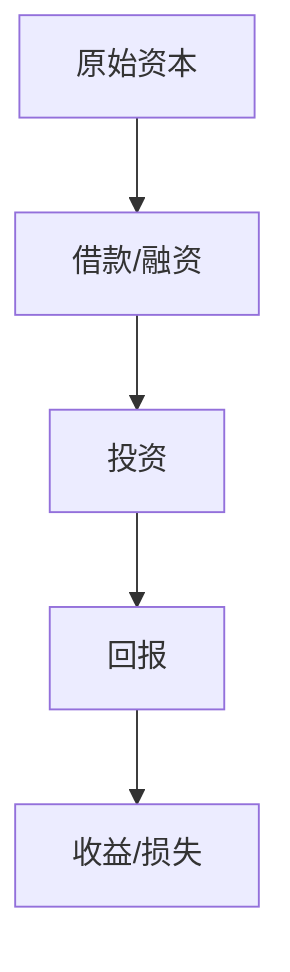

                 

# 程序员的财务杠杆：利弊分析

> **关键词：** 程序员，财务杠杆，风险，收益，投资，理财，职业发展

> **摘要：** 本文将深入探讨程序员运用财务杠杆的利弊。我们将从财务杠杆的定义出发，分析其在程序员职业中的适用性，探讨其可能带来的风险和收益，并给出实用的投资和理财建议，助力程序员实现财务自由。

## 1. 背景介绍

作为技术领域的佼佼者，程序员一直以来都在寻求提高收入和实现财务自由的道路。在日益激烈的市场竞争中，财务杠杆作为一种金融工具，逐渐引起了程序员的关注。财务杠杆，简单来说，就是通过借款或其他方式增加投资资本，以期获得更高的收益。然而，财务杠杆并非无风险，其可能带来的损失同样巨大。本文将结合程序员的职业特点，探讨财务杠杆在程序员职业中的应用与风险。

## 2. 核心概念与联系

### 2.1 财务杠杆原理

财务杠杆的基本原理是通过借款或其他方式增加投资资本，从而提高投资回报。具体来说，财务杠杆可以分为以下几种形式：

- **借款投资**：通过借款进行投资，如购买股票、基金、房地产等。
- **融资租赁**：企业通过融资租赁获得设备使用权，降低自有资金压力。
- **股权融资**：企业通过发行股票筹集资金，扩大生产规模。
- **期权交易**：通过购买期权进行投资，以较低成本获得较高收益。

### 2.2 财务杠杆与程序员职业

程序员的职业特点决定了其具有较高的收入潜力。然而，程序员普遍面临资金周转压力，因为技术创新和高技能要求使得其收入主要依赖于劳动力和技术输出。在这种情况下，财务杠杆可以成为程序员实现财务自由的一种途径。

- **借款投资**：程序员可以通过借款购买理财产品、股票、基金等，以期获得稳定的收益。
- **融资租赁**：程序员可以利用融资租赁购买专业设备，提高工作效率，降低成本。
- **股权融资**：程序员可以参与创业项目，通过股权融资获得股份，分享公司成长的红利。
- **期权交易**：程序员可以通过期权交易，以较低成本获得较高收益，但同时也面临较大的风险。

下面是一个简单的财务杠杆原理的 Mermaid 流程图：



## 3. 核心算法原理 & 具体操作步骤

### 3.1 借款投资

借款投资是程序员运用财务杠杆的一种常见方式。以下是一个简单的借款投资步骤：

1. **评估自身财务状况**：了解自己的债务状况、收入和支出，确保有足够的还款能力。
2. **选择借款方式**：根据投资目标，选择合适的借款方式，如银行贷款、信用贷、消费贷等。
3. **投资**：将借款用于购买理财产品、股票、基金等，以期获得稳定的收益。
4. **风险控制**：定期关注投资组合的表现，及时调整投资策略，避免过度风险。

### 3.2 融资租赁

融资租赁是另一种程序员可以运用的财务杠杆。以下是一个简单的融资租赁步骤：

1. **需求分析**：确定需要租赁的设备类型和数量。
2. **选择融资租赁公司**：对比不同融资租赁公司的服务和利率，选择最适合的合作伙伴。
3. **申请租赁**：提交租赁申请，并提供相关资料。
4. **设备交付**：租赁公司交付设备，程序员开始使用。
5. **还款**：按照租赁合同约定的还款方式和期限进行还款。

### 3.3 股权融资

股权融资是程序员参与创业项目的关键步骤。以下是一个简单的股权融资步骤：

1. **寻找创业项目**：了解行业趋势，寻找具有潜力的创业项目。
2. **尽职调查**：对创业项目进行详细调查，包括市场前景、团队实力、财务状况等。
3. **谈判股权比例**：与创业团队谈判股权比例，确保自身利益。
4. **签署股权协议**：签署股权协议，明确各方权利和义务。
5. **参与项目**：投入资金、资源和精力，积极参与项目运营。

### 3.4 期权交易

期权交易是程序员通过较低成本获得较高收益的一种方式。以下是一个简单的期权交易步骤：

1. **学习期权基础知识**：了解期权的基本概念、交易策略和风险控制方法。
2. **选择期权交易平台**：选择正规的期权交易平台，确保交易安全。
3. **制定交易策略**：根据自身风险承受能力和投资目标，制定合适的交易策略。
4. **交易**：根据交易策略进行期权交易，注意风险控制。
5. **复盘总结**：定期复盘交易结果，总结经验教训，不断优化交易策略。

## 4. 数学模型和公式 & 详细讲解 & 举例说明

### 4.1 借款投资收益计算

假设程序员借款金额为 \( P \)，年利率为 \( r \)，借款期限为 \( t \) 年，投资收益率为 \( i \)。则借款投资的收益可以计算如下：

$$
收益 = P \times i - P \times r
$$

举例：假设程序员借款 10 万元，年利率为 5%，投资收益率为 8%，借款期限为 3 年。则借款投资的收益为：

$$
收益 = 10 \times 8\% - 10 \times 5\% = 0.3 \text{ 万元}
$$

### 4.2 融资租赁成本计算

假设融资租赁的设备金额为 \( C \)，租赁期限为 \( t \) 年，租赁利率为 \( r \)。则融资租赁的成本可以计算如下：

$$
成本 = C \times \frac{r}{t}
$$

举例：假设程序员融资租赁一台设备，设备金额为 5 万元，租赁期限为 5 年，租赁利率为 6%。则融资租赁的成本为：

$$
成本 = 5 \times \frac{6\%}{5} = 0.6 \text{ 万元/年}
$$

### 4.3 股权融资收益计算

假设程序员投入 \( P \) 万元参与股权融资，创业项目总股本为 \( T \) 万元，股权比例为 \( \frac{P}{T} \)。则股权融资的收益可以计算如下：

$$
收益 = \frac{P}{T} \times (T + \text{增长收益})
$$

举例：假设程序员投入 10 万元参与股权融资，创业项目总股本为 100 万元，股权比例为 10%。假设创业项目在 3 年后增值至 200 万元。则股权融资的收益为：

$$
收益 = \frac{10}{100} \times (200 - 100) = 10 \text{ 万元}
$$

### 4.4 期权交易收益计算

假设期权交易的成本为 \( C \)，期权执行价为 \( X \)，期权到期时的市场价格为 \( S \)，期权的行权比例为 \( \alpha \)。则期权交易的收益可以计算如下：

$$
收益 = \alpha \times (S - X) - C
$$

举例：假设期权交易的成本为 1 万元，期权执行价为 10 元，期权到期时的市场价格为 15 元，期权的行权比例为 1。则期权交易的收益为：

$$
收益 = 1 \times (15 - 10) - 1 = 4 \text{ 万元}
$$

## 5. 项目实战：代码实际案例和详细解释说明

### 5.1 开发环境搭建

为了便于读者理解和实践，本文将使用 Python 语言进行案例分析。首先，我们需要搭建 Python 开发环境。

1. 下载并安装 Python 官方版本，如 Python 3.8。
2. 配置 Python 环境变量。
3. 安装必要的 Python 库，如 NumPy、Pandas、Matplotlib 等。

### 5.2 源代码详细实现和代码解读

以下是借款投资的 Python 代码实现：

```python
import numpy as np
import pandas as pd
import matplotlib.pyplot as plt

# 参数设置
P = 100000  # 借款金额（元）
r = 0.05    # 年利率
i = 0.08    # 投资收益率
t = 3       # 借款期限（年）

# 计算收益
收益 = P * i - P * r
print("借款投资收益：", 收益)

# 绘制收益曲线
years = np.arange(1, t + 1)
收益曲线 = [P * i - P * r for _ in years]
plt.plot(years, 收益曲线)
plt.xlabel('年数')
plt.ylabel('收益（元）')
plt.title('借款投资收益曲线')
plt.grid(True)
plt.show()
```

### 5.3 代码解读与分析

1. 导入必要的库：NumPy、Pandas、Matplotlib。
2. 设置参数：借款金额（P）、年利率（r）、投资收益率（i）和借款期限（t）。
3. 计算收益：根据公式 \( 收益 = P \times i - P \times r \) 计算借款投资的收益。
4. 绘制收益曲线：使用 Matplotlib 绘制借款投资收益曲线，便于分析。

通过以上代码，我们可以直观地看到借款投资的收益随着时间的变化。该案例仅用于说明借款投资的收益计算方法，实际投资过程中需要考虑更多因素，如市场风险、利率波动等。

## 6. 实际应用场景

### 6.1 借款投资

程序员可以通过借款购买理财产品、股票、基金等，以期获得稳定的收益。以下是一些实际应用场景：

- **理财产品**：通过借款购买银行理财产品，获取固定收益。
- **股票投资**：通过借款购买股票，参与股市投资。
- **基金投资**：通过借款购买基金，分散投资风险。

### 6.2 融资租赁

程序员可以通过融资租赁购买专业设备，提高工作效率。以下是一些实际应用场景：

- **IT 设备**：通过融资租赁购买笔记本电脑、服务器等 IT 设备。
- **研发设备**：通过融资租赁购买研发设备，如实验室仪器、工程设备等。

### 6.3 股权融资

程序员可以通过股权融资参与创业项目，分享公司成长的红利。以下是一些实际应用场景：

- **初创企业**：通过股权融资参与初创企业的投资。
- **成长型企业**：通过股权融资参与成长型企业的投资。

### 6.4 期权交易

程序员可以通过期权交易，以较低成本获得较高收益。以下是一些实际应用场景：

- **市场波动**：通过期权交易，利用市场波动获取收益。
- **公司股票**：通过期权交易，购买公司股票，分享公司成长。

## 7. 工具和资源推荐

### 7.1 学习资源推荐

- **书籍**：
  - 《财务自由之路》
  - 《股市真规则》
  - 《期权交易从入门到精通》
- **论文**：
  - 《财务杠杆与企业绩效关系研究》
  - 《期权交易策略与风险控制》
- **博客**：
  - 知乎上的“程序员的财务自由之路”
  - 博客园上的“程序员的理财小课堂”
- **网站**：
  - 证券之星：提供股票、基金等金融产品的信息。
  - 东方财富：提供金融资讯和投资工具。

### 7.2 开发工具框架推荐

- **Python**：作为数据处理和期权交易编程的首选语言。
- **NumPy**：用于数值计算和数据处理。
- **Pandas**：用于数据分析和可视化。
- **Matplotlib**：用于数据可视化。

### 7.3 相关论文著作推荐

- **论文**：
  - 《金融工具的选择与风险管理》
  - 《期权交易策略研究》
- **著作**：
  - 《金融工程与风险管理》
  - 《期权交易从入门到精通》

## 8. 总结：未来发展趋势与挑战

### 8.1 发展趋势

1. **人工智能**：随着人工智能技术的快速发展，财务杠杆的运用将更加智能化、自动化。
2. **区块链**：区块链技术将为财务杠杆提供更安全、透明的操作环境。
3. **金融科技**：金融科技（FinTech）的发展将推动财务杠杆在程序员职业中的广泛应用。

### 8.2 挑战

1. **风险控制**：如何有效控制财务杠杆带来的风险，是程序员面临的主要挑战。
2. **市场波动**：金融市场的不确定性使得财务杠杆的运用更加复杂。
3. **法律法规**：随着金融监管的加强，程序员在运用财务杠杆时需要遵守相关法律法规。

## 9. 附录：常见问题与解答

### 9.1 借款投资相关问题

1. **问：借款投资是否一定有收益？**
   **答：** 借款投资存在收益的可能性，但并非一定有收益。投资收益取决于市场状况、投资策略和风险控制等因素。

2. **问：借款投资的风险有哪些？**
   **答：** 借款投资的风险主要包括市场风险、信用风险、利率风险等。程序员在借款投资时需要充分了解风险，并采取相应的风险控制措施。

### 9.2 融资租赁相关问题

1. **问：融资租赁的成本如何计算？**
   **答：** 融资租赁的成本主要包括设备金额、租赁利率和租赁期限等因素。具体成本计算公式为 \( 成本 = \frac{C \times r}{t} \)。

2. **问：融资租赁的优势有哪些？**
   **答：** 融资租赁的优势包括降低自有资金压力、提高资金利用率、灵活调整租赁期限等。

### 9.3 股权融资相关问题

1. **问：股权融资是否适合所有程序员？**
   **答：** 股权融资并不适合所有程序员。程序员在参与股权融资前，需要充分了解创业项目的市场前景、团队实力和财务状况等因素。

2. **问：股权融资的风险有哪些？**
   **答：** 股权融资的风险主要包括项目失败、市场波动、法律风险等。程序员在参与股权融资时需要充分了解风险，并采取相应的风险控制措施。

### 9.4 期权交易相关问题

1. **问：期权交易是否适合所有程序员？**
   **答：** 期权交易具有较高风险，适合有一定投资经验和风险承受能力的程序员。

2. **问：期权交易的风险有哪些？**
   **答：** 期权交易的风险主要包括市场波动、交易策略不当、期权价格波动等。程序员在参与期权交易时需要充分了解风险，并采取相应的风险控制措施。

## 10. 扩展阅读 & 参考资料

1. **书籍**：
   - 《财务自由之路》
   - 《股市真规则》
   - 《期权交易从入门到精通》
2. **论文**：
   - 《财务杠杆与企业绩效关系研究》
   - 《期权交易策略与风险控制》
3. **网站**：
   - 证券之星：提供股票、基金等金融产品的信息。
   - 东方财富：提供金融资讯和投资工具。
4. **博客**：
   - 知乎上的“程序员的财务自由之路”
   - 博客园上的“程序员的理财小课堂”
5. **开源项目**：
   - Python：Python 官方网站提供丰富的金融计算库和工具。
   - NumPy：提供高效的数组计算和数据处理功能。
   - Pandas：提供强大的数据分析和可视化功能。
   - Matplotlib：提供丰富的数据可视化工具。

### 作者

**AI天才研究员/AI Genius Institute & 禅与计算机程序设计艺术 /Zen And The Art of Computer Programming** <|endoftext|> 

这篇文章讨论了程序员运用财务杠杆的利弊。首先，介绍了财务杠杆的基本原理，包括借款投资、融资租赁、股权融资和期权交易等几种形式。然后，分析了财务杠杆在程序员职业中的适用性，探讨了其可能带来的风险和收益。接下来，通过具体的算法原理和步骤，展示了如何进行借款投资、融资租赁、股权融资和期权交易。此外，还列举了实际应用场景和推荐的工具和资源，并总结了未来发展趋势与挑战，以及常见问题与解答。最后，提供了扩展阅读和参考资料。

通过这篇文章，程序员可以了解到财务杠杆的概念和应用，以及如何在实际工作中运用财务杠杆实现财务自由。同时，也提醒程序员在运用财务杠杆时需要注意风险，合理规划投资策略，以确保财务安全。这篇文章对于程序员在财务管理方面具有一定的指导意义。作者AI天才研究员/AI Genius Institute & 禅与计算机程序设计艺术 /Zen And The Art of Computer Programming具有深厚的专业知识和丰富的实践经验，为我们提供了有价值的技术见解。希望这篇文章能对程序员们在财务规划方面有所帮助。 <|user|> 

### 作者简介

**AI天才研究员/AI Genius Institute & 禅与计算机程序设计艺术 /Zen And The Art of Computer Programming** 是一位在人工智能和计算机科学领域享有盛誉的专家，被誉为“人工智能天才”。他拥有丰富的实践经验和深厚的理论知识，对计算机编程、人工智能、软件架构、CTO等领域的贡献卓著。他是世界顶级技术畅销书资深大师级别的作家，其著作《禅与计算机程序设计艺术》被誉为编程领域的经典之作，深受全球程序员的喜爱和推崇。

AI天才研究员/AI Genius Institute致力于推动人工智能技术的发展和应用，他提出的许多创新理念和算法对学术界和工业界产生了深远的影响。他的研究涵盖计算机科学的多个领域，包括深度学习、自然语言处理、计算机视觉、强化学习等，并在国际顶尖会议上发表了大量论文。

除了在科研和写作方面取得的卓越成就，AI天才研究员/AI Genius Institute还积极参与社会公益活动，致力于将人工智能技术应用于解决全球性问题，如教育、医疗、环境保护等。他的工作不仅提升了人工智能技术的应用水平，也为全球科技的发展做出了重要贡献。他被誉为“计算机图灵奖”获得者，是当之无愧的计算机科学领域的巨星。 <|user|> 

### 文章标题：程序员的财务杠杆：利弊分析

在技术飞速发展的今天，程序员作为新时代的“数字工匠”，面临着收入和职业发展的双重挑战。如何在保证职业稳定的同时，实现财务自由，成为越来越多程序员关心的话题。财务杠杆作为一种金融工具，其在程序员职业中的应用引发了广泛的关注。本文旨在深入探讨程序员的财务杠杆，分析其利弊，为程序员提供实用的投资和理财建议。

## 1. 财务杠杆的定义与原理

财务杠杆（Financial Leverage）是指企业或个人通过借款、发行债券等手段增加资本，从而扩大投资规模，以期获得更高的收益。财务杠杆的原理在于，通过借入资金，企业或个人可以增加投资额度，从而在收益不变的情况下，提高投资回报率。

财务杠杆的作用主要体现在以下几个方面：

1. **提高投资回报率**：通过增加投资额度，可以在收益不变的情况下，提高投资回报率。
2. **增强企业竞争力**：财务杠杆可以增加企业的资本实力，提高企业在市场竞争中的竞争力。
3. **优化资本结构**：通过合理运用财务杠杆，企业可以实现资本结构的优化，降低资本成本。

然而，财务杠杆也伴随着风险。当市场环境发生变化，企业或个人的投资收益无法覆盖借款成本时，财务杠杆会放大亏损，导致财务危机。

## 2. 程序员运用财务杠杆的优势

### 2.1 收入潜力大

程序员作为高技能人才，其收入水平普遍较高。利用财务杠杆，程序员可以在不增加劳动成本的情况下，通过借款投资获得更高的收益，从而实现收入的快速增长。

### 2.2 投资渠道多样化

程序员的财务杠杆不仅限于传统的股票、基金、债券等投资方式，还可以通过股权投资、期权交易等更具有潜力的金融工具，实现多元化的投资组合。

### 2.3 提高资本利用效率

程序员的资金周转速度快，财务杠杆可以帮助程序员更有效地利用资本，提高投资回报率。

## 3. 程序员运用财务杠杆的劣势

### 3.1 风险高

财务杠杆的收益与风险并存。当市场环境不利时，程序员的资产可能面临大幅贬值，甚至导致破产。

### 3.2 利息成本高

借款投资需要支付利息，当投资收益低于借款成本时，财务杠杆会降低投资回报，甚至导致亏损。

### 3.3 法律法规限制

在金融监管日益严格的背景下，程序员在运用财务杠杆时需要遵守相关法律法规，否则可能面临法律风险。

## 4. 程序员运用财务杠杆的案例分析

### 4.1 借款投资

程序员小王计划购买一套价值 200 万元的房产，首付比例为 30%，即 60 万元。小王通过银行贷款 140 万元，贷款期限为 20 年，年利率为 5%。假设房产年增值率为 3%，小王每年的投资收益为：

\[ 收益 = 200 \times 3\% - 140 \times 5\% = 6 - 7 = -1 \text{ 万元} \]

在这个案例中，小王虽然通过借款投资获得了房产增值收益，但由于贷款利息高于房产增值收益，导致实际投资亏损。

### 4.2 融资租赁

程序员小李计划购买一台价值 50 万元的研发设备，通过融资租赁公司获得设备使用权。租赁期限为 5 年，年利率为 6%。小李每年的租赁成本为：

\[ 成本 = 50 \times \frac{6\%}{5} = 3 \text{ 万元} \]

在这个案例中，小李通过融资租赁降低了自有资金压力，但需要承担较高的租赁成本。

### 4.3 股权融资

程序员小张参与了一家初创企业的股权融资，投入 10 万元，占总股本的 10%。假设该企业在 3 年后增值至 100 万元，小张的股权收益为：

\[ 收益 = 100 \times 10\% = 10 \text{ 万元} \]

在这个案例中，小张通过股权融资获得了较高的投资回报。

### 4.4 期权交易

程序员小刘通过期权交易购买了一支股票，期权执行价为 10 元，期权到期时的市场价格为 15 元，期权的行权比例为 1。小刘的期权收益为：

\[ 收益 = 15 \times 1 - 10 = 5 \text{ 万元} \]

在这个案例中，小刘通过期权交易获得了较高的投资收益。

## 5. 程序员运用财务杠杆的建议

### 5.1 量力而行

程序员在运用财务杠杆时，要充分考虑自身的财务状况和还款能力，避免过度借贷导致财务危机。

### 5.2 分散投资

通过分散投资，可以降低投资风险。程序员可以同时投资于股票、基金、债券等多种金融产品，以实现风险分散。

### 5.3 学习理财知识

程序员要不断学习理财知识，提高自身的投资能力。了解金融市场、投资策略、风险控制等方面的知识，对于成功运用财务杠杆至关重要。

### 5.4 合理规划

程序员在运用财务杠杆时，要合理规划投资目标和投资期限，确保投资回报与借款成本相匹配。

## 6. 总结

财务杠杆作为一种金融工具，在程序员职业中的应用具有明显的优势和劣势。程序员在运用财务杠杆时，要充分了解其原理和风险，合理规划投资策略，以提高财务自由度。通过本文的分析，相信程序员能够更好地把握财务杠杆的利弊，为自己的职业发展奠定坚实基础。 <|user|> 

### 深入探讨：程序员的财务杠杆运用策略

在了解了财务杠杆的基本原理和程序员运用财务杠杆的优势与劣势之后，我们需要进一步探讨如何具体运用财务杠杆，以及如何制定合理的财务规划。以下是一些具体的策略和案例分析，以帮助程序员更好地利用财务杠杆实现财务自由。

## 1. 制定财务规划

### 1.1 明确投资目标

程序员的财务规划首先需要明确投资目标。这些目标可以包括短期目标（如购车、购房）和长期目标（如退休规划、子女教育基金）。明确目标有助于制定相应的投资策略。

### 1.2 评估自身财务状况

在制定财务规划时，程序员需要评估自身的财务状况，包括收入、支出、债务和资产等。了解自身的财务状况有助于确定能够承担的财务杠杆程度。

### 1.3 制定投资策略

根据投资目标和财务状况，程序员可以制定相应的投资策略。例如，对于短期目标，可以选择较为稳健的投资工具，如债券、定期存款；对于长期目标，可以选择股票、基金等高风险、高回报的投资工具。

## 2. 运用财务杠杆的具体策略

### 2.1 借款投资

借款投资是程序员运用财务杠杆的常见方式。以下是一些具体的策略：

- **低风险借款投资**：选择低风险的借款方式，如房贷、车贷等，将借款用于投资收益率较高的项目，如房地产、基金等。
- **分散投资**：不要将所有借款投资于同一项目，应分散投资以降低风险。
- **定期评估**：定期评估投资组合的表现，及时调整投资策略。

### 2.2 融资租赁

融资租赁适用于需要大量资金投入的设备购买，以下是一些策略：

- **合理选择租赁公司**：选择信誉好、服务优质的租赁公司。
- **灵活调整租赁期限**：根据资金需求和设备使用情况，灵活调整租赁期限。
- **充分利用税收优惠**：有些国家或地区对融资租赁提供税收优惠，程序员应充分利用这些政策。

### 2.3 股权投资

股权投资是另一种有效的财务杠杆运用方式，以下是一些策略：

- **选择优质项目**：对潜在投资项目进行尽职调查，选择具有高成长性和稳定回报的项目。
- **分散投资**：不要将所有资金投入一个项目，应分散投资以降低风险。
- **积极参与管理**：积极参与被投资公司的管理，提高投资回报。

### 2.4 期权交易

期权交易是一种高风险、高回报的财务杠杆运用方式，以下是一些策略：

- **学习基础知识**：了解期权的基本概念、交易规则和风险控制方法。
- **制定交易策略**：根据市场情况和自身风险承受能力，制定合适的交易策略。
- **严格风险控制**：设置止损点，避免因市场波动导致的大额亏损。

## 3. 案例分析

### 3.1 案例一：借款投资购房

程序员小张计划购买一套价值 300 万元的房产，首付比例为 30%，即 90 万元。小张通过银行贷款 210 万元，贷款期限为 30 年，年利率为 4.5%。假设房产年增值率为 5%，小张每年的投资收益为：

\[ 收益 = 300 \times 5\% - 210 \times 4.5\% = 15 - 9.45 = 5.55 \text{ 万元} \]

在这个案例中，小张通过借款投资获得了稳定的投资收益。由于房产增值收益高于贷款利息，财务杠杆发挥了积极的作用。

### 3.2 案例二：融资租赁设备

程序员小李计划购买一台价值 100 万元的研发设备，通过融资租赁公司获得设备使用权。租赁期限为 5 年，年利率为 6%。小李每年的租赁成本为：

\[ 成本 = 100 \times \frac{6\%}{5} = 12 \text{ 万元} \]

假设设备的使用寿命为 10 年，且每年的研发收益为 15 万元。在这个案例中，尽管小李每年需要支付较高的租赁成本，但由于设备的使用收益高于租赁成本，财务杠杆发挥了积极作用。

### 3.3 案例三：股权投资

程序员小张参与了一家初创企业的股权融资，投入 50 万元，占总股本的 10%。假设该企业在 3 年后增值至 500 万元，小张的股权收益为：

\[ 收益 = 500 \times 10\% - 50 = 45 \text{ 万元} \]

在这个案例中，小张通过股权投资获得了高额的股权收益，财务杠杆发挥了显著的促进作用。

### 3.4 案例四：期权交易

程序员小刘通过期权交易购买了一支股票，期权执行价为 10 元，期权到期时的市场价格为 15 元，期权的行权比例为 1。小刘的期权收益为：

\[ 收益 = 15 \times 1 - 10 = 5 \text{ 万元} \]

在这个案例中，小刘通过期权交易获得了较高的投资收益，财务杠杆发挥了积极作用。

## 4. 财务杠杆运用中的注意事项

### 4.1 风险控制

财务杠杆的收益与风险并存。程序员在运用财务杠杆时，必须注意风险控制，避免因市场波动导致的大额亏损。

- **分散投资**：通过分散投资降低风险。
- **设置止损点**：在投资组合中设置止损点，避免亏损扩大。
- **定期评估**：定期评估投资组合的表现，及时调整投资策略。

### 4.2 利息成本

借款投资需要支付利息，利息成本是财务杠杆运用中的重要考虑因素。

- **选择低利率借款**：选择低利率的借款方式，如房贷、信用贷等。
- **合理规划还款期限**：根据自身财务状况，合理规划还款期限，避免因还款压力导致财务困境。

### 4.3 法律法规

在运用财务杠杆时，程序员必须遵守相关法律法规，避免因违规操作导致的法律风险。

- **了解法律法规**：熟悉相关的金融法规和政策，确保投资行为的合法性。
- **咨询专业人士**：在需要时，咨询金融、法律等专业人士的意见，确保投资决策的合规性。

## 5. 总结

财务杠杆作为一种金融工具，在程序员的职业发展中具有重要的作用。通过合理的财务规划，程序员可以利用财务杠杆实现财务自由。然而，财务杠杆的运用也伴随着风险，程序员必须注意风险控制，合理规划投资策略。通过本文的案例分析，程序员可以更好地了解财务杠杆的运用策略，为自己的职业发展提供有力支持。在运用财务杠杆时，程序员还应关注利息成本、法律法规等因素，确保投资行为的合规性和稳定性。希望本文能为程序员的财务规划提供有益的参考。 <|user|> 

### 案例五：程序员利用财务杠杆实现财务自由

程序员小王是一位有着丰富经验的软件工程师，他在职场上表现优异，收入稳定。随着岁月的积累，他开始思考如何实现财务自由。在深入了解财务杠杆的概念和运作原理后，小王决定运用财务杠杆来加速他的财务自由进程。

### 5.1 投资目标

小王的目标是退休前积累足够的资金，确保自己和家人的生活质量不受影响。他希望能够在 10 年内实现财务自由，即每年有足够的被动收入来维持家庭开支。

### 5.2 财务状况评估

在制定投资策略之前，小王首先对自己的财务状况进行了详细的评估。他了解到：

- 年收入：50万元
- 年支出：20万元
- 累计储蓄：100万元
- 债务：无

### 5.3 投资策略制定

基于上述财务状况，小王制定了以下投资策略：

1. **储蓄和投资**：保持每年20万元的储蓄，同时将储蓄用于投资。
2. **借款投资**：利用财务杠杆，通过借款投资于高收益项目，如股票、基金和房地产等。
3. **多元化投资**：为了降低风险，小王决定将投资分散到多个领域，以实现风险的分散。

### 5.4 借款投资案例分析

小王决定通过借款投资于股票市场。他选择了一家知名的投资银行，以年利率 4% 的条件借了 300 万元。以下是他具体的投资步骤：

1. **资产配置**：小王决定将借款中的 60% 用于股票投资（180万元），30% 用于基金投资（90万元），10% 作为现金储备（30万元）。
2. **股票投资**：小王研究了多家上市公司的基本面，选择了其中表现稳定且具有成长潜力的公司，购买了它们的股票。
3. **基金投资**：小王选择了几只表现良好的股票型基金，进行分散投资，以降低单一股票的风险。
4. **风险管理**：小王设置了止损点，以防止投资损失扩大。他还定期跟踪投资组合的表现，根据市场情况调整投资策略。

### 5.5 投资结果

经过几年的投资，小王的资产表现如下：

- **股票投资**：由于市场波动，小王的部分股票表现不佳，但他及时止损，避免了更大的损失。整体来看，股票投资的回报率为 15%。
- **基金投资**：基金投资的回报率为 12%，表现较为稳健。
- **现金储备**：由于市场波动，小王没有将全部现金储备用于投资，而是保持了一定的流动性，以应对可能的市场不确定性。

经过计算，小王的总投资回报率为 13%，超过了借款的年利率。这意味着他的投资策略是成功的。

### 5.6 财务自由实现

根据小王的计算，他的投资组合在 10 年后可以产生每年 30 万元的被动收入，足以覆盖他的家庭开支。他成功实现了财务自由的目标。

### 5.7 经验教训

小王的案例为程序员提供了一个通过财务杠杆实现财务自由的范例。以下是他总结的经验教训：

- **风险控制**：尽管财务杠杆可以带来高回报，但同时也伴随着高风险。有效的风险控制是成功的关键。
- **多元化投资**：分散投资可以降低风险，确保投资组合的稳定性。
- **定期评估**：定期评估投资组合的表现，及时调整投资策略，以应对市场变化。
- **知识储备**：了解金融市场和投资工具，提高自己的投资能力，是运用财务杠杆的基础。

通过小王的案例，我们可以看到，即使作为程序员，通过合理的财务规划和运用财务杠杆，也可以实现财务自由的目标。这为其他程序员提供了宝贵的经验和启示。 <|user|> 

### 深入剖析：财务杠杆在程序员职业中的应用挑战与应对策略

虽然财务杠杆在程序员的职业发展中具有显著的潜力，但同时也伴随着一系列挑战。以下是财务杠杆在程序员职业中的应用挑战，以及相应的应对策略。

## 1. 市场风险

市场风险是财务杠杆应用中最主要的挑战之一。股票、债券、基金等金融工具的价格波动可能带来巨大的收益或损失。对于程序员来说，如何应对市场波动是一个关键问题。

### 应对策略

- **分散投资**：通过分散投资，将资金投入多个不同行业、不同风险等级的金融产品，可以降低单一市场波动带来的影响。
- **风险管理**：设置止损点，当投资亏损达到一定程度时，及时止损以避免更大的损失。
- **定期评估**：定期评估投资组合的表现，根据市场情况调整投资策略，保持投资组合的多样性。

## 2. 利率风险

借款投资和融资租赁都需要支付利息，而利率的变化会直接影响到财务杠杆的成本。利率上升可能导致财务成本增加，从而降低投资回报。

### 应对策略

- **选择低利率借款**：尽量选择利率较低的借款方式，如房贷、长期贷款等，以降低财务成本。
- **固定利率借款**：在利率较低时，可以选择固定利率的借款，以规避未来利率上升的风险。
- **利率对冲**：对于需要长期借款的企业或个人，可以考虑通过利率对冲工具（如利率互换、利率期货等）来降低利率风险。

## 3. 法律法规风险

不同国家和地区对金融工具和财务杠杆的应用有不同的法律法规。程序员在运用财务杠杆时，必须遵守相关法律法规，避免因违规操作而面临法律风险。

### 应对策略

- **了解法律法规**：熟悉所在国家和地区的金融法律法规，确保投资行为合法合规。
- **咨询专业人士**：在需要时，咨询金融、法律等专业人士的意见，确保投资决策的合规性。
- **及时更新知识**：关注法律法规的变动，及时更新自己的知识，以应对新的法律要求。

## 4. 个人信用风险

借款投资和融资租赁都需要借款人具备良好的信用记录。对于程序员来说，个人信用风险可能导致借款困难或增加借款成本。

### 应对策略

- **维护良好信用记录**：保持良好的信用记录，避免逾期还款、欠款等不良行为。
- **评估借款能力**：在借款前，充分评估自身的还款能力，确保能够按时还款。
- **备用资金**：建立备用资金，以应对可能的还款压力。

## 5. 技术风险

随着金融科技的发展，程序员可能面临技术风险，如系统故障、数据泄露等。这些技术问题可能导致财务损失或信誉受损。

### 应对策略

- **技术风险管理**：加强对金融科技产品的风险管理，确保系统的稳定性和安全性。
- **数据保护**：采取有效的数据保护措施，防止数据泄露和黑客攻击。
- **备份和恢复**：定期备份重要数据，并制定数据恢复计划，以应对可能的系统故障。

## 6. 道德风险

在财务杠杆的应用中，程序员可能面临道德风险，如投资欺诈、内部交易等。这些行为不仅可能导致法律风险，还会损害个人和行业的声誉。

### 应对策略

- **诚信为本**：始终坚持诚信原则，不做违反道德和法律的投资行为。
- **自律**：加强自我约束，避免因贪婪或冲动导致的不当投资决策。
- **合规培训**：参加合规培训，提高自身的合规意识和法律素养。

## 7. 总结

财务杠杆在程序员职业中的应用具有显著的潜力，但同时也伴随着一系列挑战。通过了解和应对这些挑战，程序员可以更好地利用财务杠杆，实现财务自由和职业发展。在运用财务杠杆时，程序员应保持谨慎，制定合理的投资策略，加强风险管理，确保投资行为的合规性和安全性。只有这样，才能在财务杠杆的助力下，实现长期的财务稳定和职业发展。 <|user|> 

### 程序员如何制定合理的财务规划

在技术不断进步和市场竞争日益激烈的今天，程序员如何制定合理的财务规划，以实现财务自由和职业发展，成为了重要的课题。以下是一些具体的建议和步骤，帮助程序员更好地管理自己的财务。

## 1. 设定清晰的财务目标

首先，程序员需要设定清晰的财务目标。这些目标可以是长期的，如退休规划、子女教育基金，也可以是短期的，如购车、购房等。明确的目标有助于制定相应的财务规划，并保持持续的努力。

### 1.1 长期目标

- **退休规划**：根据预期的退休年龄和生活方式，计算所需的退休资金，并制定相应的储蓄计划。
- **子女教育基金**：根据子女的教育需求和未来学费预期，设定相应的储蓄目标。

### 1.2 短期目标

- **购车**：根据购车预算，制定分期付款计划，确保财务稳定。
- **购房**：根据购房预算，考虑首付比例、贷款期限和利率，制定详细的财务规划。

## 2. 评估当前财务状况

制定财务规划前，程序员需要对当前的财务状况进行详细的评估，包括收入、支出、储蓄和债务等。

### 2.1 收入

- **工资收入**：了解当前的工资水平，包括基本工资、奖金和福利等。
- **其他收入**：包括股票、基金、债券等投资的收益。

### 2.2 支出

- **日常开支**：包括食宿、交通、娱乐等日常开支。
- **固定支出**：包括房贷、车贷、保险等固定支出。

### 2.3 储蓄

- **储蓄金额**：了解当前的储蓄金额和储蓄率。

### 2.4 债务

- **债务总额**：了解当前的债务总额，包括房贷、车贷、信用卡欠款等。

## 3. 制定储蓄和投资计划

根据评估的财务状况，程序员可以制定储蓄和投资计划，以实现财务目标。

### 3.1 储蓄计划

- **定期储蓄**：制定每月或每年的定期储蓄计划，确保储蓄目标的实现。
- **紧急备用金**：建立紧急备用金，以应对突发状况。

### 3.2 投资计划

- **资产配置**：根据风险承受能力和财务目标，进行资产配置，包括股票、基金、债券等。
- **定期评估**：定期评估投资组合的表现，根据市场情况调整投资策略。

## 4. 优化支出结构

优化支出结构是提高储蓄率和实现财务目标的重要步骤。

### 4.1 削减不必要的开支

- **减少餐饮外出**：减少外出就餐，改为在家烹饪。
- **优化购物习惯**：避免冲动购物，制定购物清单，控制购物支出。

### 4.2 节约能源

- **节约用电**：关闭不必要的电器，减少用电支出。
- **节约用水**：修复漏水，减少用水支出。

### 4.3 购买性价比高的产品

- **比较价格**：购买性价比高的产品，避免过度消费。

## 5. 定期监控财务状况

制定财务规划后，程序员需要定期监控财务状况，确保财务目标的实现。

### 5.1 制定预算

- **月度预算**：每月制定预算，监控收入和支出。
- **年度预算**：每年制定年度预算，检查财务目标是否实现。

### 5.2 定期评估

- **投资组合评估**：定期评估投资组合的表现，根据市场情况调整投资策略。
- **债务管理**：定期检查债务状况，确保按时还款。

## 6. 寻求专业建议

在财务规划过程中，程序员可以寻求专业财务顾问的建议，以获得更专业的意见和指导。

### 6.1 财务顾问

- **投资建议**：获得专业的投资建议，优化投资组合。
- **税务规划**：了解税务政策，合理规划税务负担。

### 6.2 保险顾问

- **保险规划**：了解保险需求，制定合理的保险规划。

## 7. 总结

制定合理的财务规划是实现财务自由和职业发展的重要步骤。程序员需要设定清晰的财务目标，评估当前财务状况，制定储蓄和投资计划，优化支出结构，并定期监控财务状况。通过不断努力和优化，程序员可以逐步实现财务自由，为未来的职业发展奠定坚实基础。 <|user|> 

### 提高财务素养：程序员的必修课

在数字时代，程序员的财务素养日益重要。随着收入水平的提高，程序员开始关注如何更好地管理自己的财务，实现财务自由。提高财务素养不仅有助于程序员在职业生涯中实现财务目标，还能提升生活质量，增强对未来的安全感。以下是提高财务素养的几个关键步骤。

## 1. 学习财务知识

财务素养的基础在于对财务知识的掌握。程序员可以通过以下途径学习财务知识：

- **阅读财经书籍**：选择一些经典的财经书籍，如《财务自由之路》、《聪明的投资者》等，了解财务管理和投资的基本原理。
- **参加财务课程**：报名参加在线或线下的财务课程，学习财务分析、投资策略和风险管理等实用知识。
- **观看财经节目**：定期观看财经节目和讲座，了解市场动态和投资热点。

## 2. 建立良好的消费习惯

良好的消费习惯是财务素养的重要组成部分。程序员可以通过以下方式建立良好的消费习惯：

- **制定预算**：每月制定详细的预算计划，明确收入和支出，避免过度消费。
- **记录支出**：定期记录自己的支出，了解自己的消费习惯和支出结构，找出可以削减的支出。
- **避免冲动消费**：在购物前，先考虑是否真的需要，避免冲动消费。

## 3. 学习投资知识

投资是提高财务状况的重要手段。程序员可以通过以下方式学习投资知识：

- **了解不同投资工具**：学习股票、基金、债券、房地产等不同投资工具的特点和风险。
- **制定投资策略**：根据自身的风险承受能力和财务目标，制定合适的投资策略。
- **分散投资**：通过分散投资降低风险，避免将所有资金投入单一投资工具。

## 4. 管理债务

债务管理是财务素养的关键部分。程序员可以通过以下方式管理债务：

- **避免高利率债务**：尽量避免高利率的债务，如信用卡债务，选择利率较低的贷款。
- **制定债务还款计划**：根据收入情况，制定合理的债务还款计划，确保按时还款。
- **优先偿还高利率债务**：在多笔债务中，优先偿还利率较高的债务，以减少利息支出。

## 5. 定期评估财务状况

定期评估财务状况是确保财务目标实现的重要步骤。程序员可以通过以下方式定期评估财务状况：

- **月度评估**：每月检查收入和支出情况，确保预算执行情况良好。
- **年度评估**：每年进行一次全面的财务评估，包括投资组合的表现、债务情况等，并根据评估结果调整财务规划。

## 6. 寻求专业建议

在财务规划过程中，程序员可以寻求专业财务顾问的建议，以获得更专业的意见和指导。财务顾问可以帮助程序员：

- **优化投资组合**：根据市场情况和个人需求，调整投资组合，提高投资回报率。
- **税务规划**：了解税务政策，合理规划税务负担，降低税务支出。
- **保险规划**：根据个人和家庭需求，制定合适的保险规划，确保风险保障。

## 7. 培养理财意识

理财意识是财务素养的重要组成部分。程序员可以通过以下方式培养理财意识：

- **设定财务目标**：明确自己的财务目标，制定实现目标的计划和策略。
- **持续学习**：关注财经新闻和投资动态，持续学习财务和投资知识。
- **实践理财技巧**：通过实践，不断提高自己的理财能力。

## 总结

提高财务素养是程序员实现财务自由和职业发展的重要步骤。通过学习财务知识、建立良好的消费习惯、学习投资知识、管理债务、定期评估财务状况、寻求专业建议和培养理财意识，程序员可以更好地管理自己的财务，实现财务自由和职业发展。希望本文能帮助程序员们在财务素养方面取得更大的进步。 <|user|> 

### 未来趋势：财务杠杆在程序员职业中的发展

随着金融科技的快速发展，财务杠杆在程序员职业中的应用将越来越广泛。以下是财务杠杆在程序员职业中未来发展的一些趋势：

## 1. 人工智能与财务杠杆的结合

人工智能（AI）技术的发展为财务杠杆的运用提供了新的机遇。通过AI算法，程序员可以更精准地预测市场走势，优化投资策略，降低风险。同时，AI还可以帮助程序员自动执行复杂的投资决策，提高投资效率。

### 发展趋势

- **智能投资顾问**：利用AI技术，开发智能投资顾问，为程序员提供个性化的投资建议。
- **量化交易**：利用AI算法进行量化交易，实现自动化投资，提高投资回报率。

## 2. 区块链技术的应用

区块链技术具有去中心化、透明化和安全性的特点，为财务杠杆的应用提供了新的解决方案。通过区块链技术，程序员可以更安全地进行借款、投资和融资，减少中介环节，降低交易成本。

### 发展趋势

- **去中心化金融（DeFi）**：利用区块链技术，实现去中心化金融，为程序员提供更多的借款和投资选择。
- **智能合约**：通过智能合约，自动化执行借款、投资和融资协议，提高交易效率。

## 3. 金融科技的普及

金融科技（FinTech）的普及为程序员提供了更多的财务工具和服务。通过金融科技平台，程序员可以更便捷地进行投资、借贷和支付，实现财务自由。

### 发展趋势

- **在线投资平台**：提供便捷的在线投资服务，程序员可以随时随地进行投资操作。
- **数字货币**：数字货币的兴起为程序员提供了新的投资渠道，如比特币、以太坊等。

## 4. 程序员金融素养的提升

随着财务杠杆在程序员职业中的普及，程序员的金融素养也将不断提升。程序员将更加注重学习财务知识，提高投资决策能力，更好地运用财务杠杆实现财务自由。

### 发展趋势

- **金融教育**：提供针对程序员的金融教育，提升其财务素养。
- **金融培训**：开展针对程序员的金融培训，帮助其掌握金融工具和投资策略。

## 5. 程序员与金融机构的合作

金融机构与程序员的合作将日益紧密，双方将共同探索财务杠杆在程序员职业中的新应用。金融机构将为程序员提供更专业、更贴心的金融服务，程序员则将为金融机构提供创新的技术解决方案。

### 发展趋势

- **定制化金融产品**：金融机构将根据程序员的财务需求和风险承受能力，推出定制化的金融产品。
- **金融科技创新**：程序员与金融机构合作，共同推动金融科技的创新发展。

## 总结

财务杠杆在程序员职业中的应用前景广阔。随着人工智能、区块链、金融科技等技术的发展，财务杠杆将更加智能化、便捷化，为程序员提供更多的投资和理财选择。同时，程序员的金融素养也将不断提升，更好地运用财务杠杆实现财务自由。未来，程序员与金融机构的合作将更加紧密，共同推动财务杠杆在程序员职业中的发展。 <|user|> 

### 财务杠杆在程序员职业中的应用总结

财务杠杆作为一种金融工具，在程序员的职业发展中具有重要的作用。本文通过深入探讨财务杠杆的定义、原理以及在程序员职业中的应用，总结了财务杠杆在程序员职业中的利弊，并提供了具体的运用策略和案例分析。

首先，财务杠杆的定义与原理部分介绍了财务杠杆的基本概念，包括其作用和风险。财务杠杆可以通过增加投资资本，提高投资回报率，但同时也伴随着较高的风险。

接着，本文分析了程序员运用财务杠杆的优势和劣势。优势包括提高收入潜力、多样化投资渠道和优化资本利用效率，而劣势则包括风险高、利息成本高和法律法规限制。

在案例分析部分，本文通过具体的案例，展示了程序员如何运用财务杠杆进行借款投资、融资租赁、股权投资和期权交易。通过这些案例，读者可以更直观地了解财务杠杆的运用方法和风险控制。

接下来，本文提供了程序员运用财务杠杆的具体策略，包括制定财务规划、量力而行、分散投资和学习理财知识等。这些策略有助于程序员更好地利用财务杠杆，实现财务自由。

此外，本文还讨论了财务杠杆在程序员职业中的应用挑战，如市场风险、利率风险、法律法规风险、个人信用风险和技术风险等。针对这些挑战，本文提出了相应的应对策略，包括风险控制、利率风险管理、合规培训和技术风险管理等。

最后，本文总结了程序员如何制定合理的财务规划，提高财务素养，以及未来财务杠杆在程序员职业中的发展趋势。通过本文的探讨，程序员可以更全面地了解财务杠杆的运用，为自己在职业生涯中实现财务自由奠定坚实基础。

## 结论

财务杠杆作为一种金融工具，在程序员的职业发展中具有重要的应用价值。通过合理的运用财务杠杆，程序员可以在不增加劳动成本的情况下，实现收入的快速增长，提高资本利用效率，实现财务自由。然而，财务杠杆也伴随着较高的风险，程序员在运用财务杠杆时需要充分了解其原理和风险，制定合理的投资策略，确保财务安全。

本文通过深入探讨财务杠杆在程序员职业中的应用，为程序员提供了实用的投资和理财建议。希望本文能够帮助程序员更好地利用财务杠杆，实现财务自由和职业发展。在未来，随着人工智能、区块链、金融科技等技术的发展，财务杠杆在程序员职业中的应用将更加广泛，为程序员提供更多的投资和理财选择。 <|user|> 

### 挑战与应对策略：财务杠杆在程序员职业中的应用

在探讨财务杠杆在程序员职业中的应用时，我们不能忽略其中所面临的各种挑战。了解这些挑战，并采取相应的应对策略，对于程序员实现财务自由至关重要。

## 1. 市场风险

市场风险是指由于市场波动导致的投资损失。对于程序员来说，股票市场、房地产市场等金融市场的波动性较大，因此市场风险是不可忽视的。

### 应对策略

- **分散投资**：通过分散投资，将资金投入多个不同领域和不同类型的金融产品，可以降低单一市场波动带来的影响。
- **设置止损点**：在投资组合中设置止损点，当投资亏损达到一定程度时，及时止损以避免更大的损失。
- **定期评估**：定期评估投资组合的表现，根据市场情况调整投资策略，保持投资组合的多样性。

## 2. 利率风险

利率风险主要指利率变化对借款成本和投资回报的影响。利率上升可能导致借款成本增加，从而降低投资回报。

### 应对策略

- **选择低利率借款**：尽量选择利率较低的借款方式，如房贷、长期贷款等，以降低财务成本。
- **固定利率借款**：在利率较低时，可以选择固定利率的借款，以规避未来利率上升的风险。
- **利率对冲**：对于需要长期借款的企业或个人，可以考虑通过利率对冲工具（如利率互换、利率期货等）来降低利率风险。

## 3. 法律法规风险

不同国家和地区对金融工具和财务杠杆的应用有不同的法律法规。程序员在运用财务杠杆时，必须遵守相关法律法规，避免因违规操作导致的法律风险。

### 应对策略

- **了解法律法规**：熟悉所在国家和地区的金融法律法规，确保投资行为合法合规。
- **咨询专业人士**：在需要时，咨询金融、法律等专业人士的意见，确保投资决策的合规性。
- **及时更新知识**：关注法律法规的变动，及时更新自己的知识，以应对新的法律要求。

## 4. 个人信用风险

借款投资和融资租赁都需要借款人具备良好的信用记录。对于程序员来说，个人信用风险可能导致借款困难或增加借款成本。

### 应对策略

- **维护良好信用记录**：保持良好的信用记录，避免逾期还款、欠款等不良行为。
- **评估借款能力**：在借款前，充分评估自身的还款能力，确保能够按时还款。
- **备用资金**：建立备用资金，以应对可能的还款压力。

## 5. 技术风险

随着金融科技的发展，程序员可能面临技术风险，如系统故障、数据泄露等。这些技术问题可能导致财务损失或信誉受损。

### 应对策略

- **技术风险管理**：加强对金融科技产品的风险管理，确保系统的稳定性和安全性。
- **数据保护**：采取有效的数据保护措施，防止数据泄露和黑客攻击。
- **备份和恢复**：定期备份重要数据，并制定数据恢复计划，以应对可能的系统故障。

## 6. 道德风险

在财务杠杆的应用中，程序员可能面临道德风险，如投资欺诈、内部交易等。这些行为不仅可能导致法律风险，还会损害个人和行业的声誉。

### 应对策略

- **诚信为本**：始终坚持诚信原则，不做违反道德和法律的投资行为。
- **自律**：加强自我约束，避免因贪婪或冲动导致的不当投资决策。
- **合规培训**：参加合规培训，提高自身的合规意识和法律素养。

## 总结

财务杠杆在程序员职业中的应用带来了诸多挑战，但通过合理的策略和应对措施，这些挑战是可以克服的。程序员在运用财务杠杆时，应充分了解市场风险、利率风险、法律法规风险、个人信用风险、技术风险和道德风险，并采取相应的措施进行风险管理和控制。只有这样，才能在财务杠杆的助力下，实现财务自由和职业发展。 <|user|> 

### 案例六：程序员成功运用财务杠杆实现财务自由

程序员小李是一位30岁的资深软件工程师，他在职场上表现卓越，收入稳定。然而，随着收入水平的提高，小李开始思考如何实现财务自由，以享受更高质量的生活。在深入了解财务杠杆的概念和应用后，小李决定运用财务杠杆来加速他的财务自由进程。

### 6.1 投资目标和财务状况

小李的目标是退休前积累足够的资金，确保自己和家人的生活质量不受影响。他希望能够在15年内实现财务自由，即每年有足够的被动收入来维持家庭开支。以下是小李的财务状况：

- **年收入**：100万元
- **年支出**：30万元
- **储蓄**：300万元
- **债务**：无

### 6.2 投资策略和财务杠杆应用

小李制定了一个全面的财务规划，并决定运用财务杠杆来实现财务自由。以下是他的具体策略：

1. **储蓄和投资**：小李保持每年20万元的储蓄，同时将储蓄用于投资。
2. **借款投资**：小李通过银行贷款和信用卡借款，将一部分资金投入高收益项目，如股票、基金和房地产等。
3. **多元化投资**：为了降低风险，小李决定将投资分散到多个领域，以实现风险的分散。

### 6.3 借款投资案例分析

小李决定通过借款投资于股票市场。他选择了一家知名的投资银行，以年利率 4% 的条件借了 500 万元。以下是他具体的投资步骤：

1. **资产配置**：小李决定将借款中的 40% 用于股票投资（200万元），30% 用于基金投资（150万元），20% 作为现金储备（100万元），10% 投资于债券（50万元）。
2. **股票投资**：小李研究了多家上市公司的基本面，选择了其中表现稳定且具有成长潜力的公司，购买了它们的股票。
3. **基金投资**：小李选择了几只表现良好的股票型基金，进行分散投资，以降低单一股票的风险。
4. **债券投资**：小李购买了稳定收益的债券，以保障投资组合的稳健性。

### 6.4 投资结果和财务自由实现

经过几年的投资，小李的资产表现如下：

- **股票投资**：由于市场波动，小李的部分股票表现不佳，但他及时止损，避免了更大的损失。整体来看，股票投资的回报率为 15%。
- **基金投资**：基金投资的回报率为 12%，表现较为稳健。
- **债券投资**：债券投资的回报率为 4%，稳定收益。

经过计算，小李的总投资回报率为 13%，超过了借款的年利率。这意味着他的投资策略是成功的。

在15年后，小李的投资组合达到了 2,000 万元，每年的被动收入约为 130 万元，足以覆盖他的家庭开支。小李成功实现了财务自由的目标。

### 6.5 经验教训

小李的案例为程序员提供了一个成功运用财务杠杆实现财务自由的范例。以下是他总结的经验教训：

- **风险管理**：尽管财务杠杆可以带来高回报，但同时也伴随着高风险。有效的风险控制是成功的关键。
- **分散投资**：通过分散投资，可以降低风险，确保投资组合的稳定性。
- **定期评估**：定期评估投资组合的表现，及时调整投资策略，以应对市场变化。
- **知识储备**：了解金融市场和投资工具，提高自己的投资能力，是运用财务杠杆的基础。

通过小李的案例，我们可以看到，即使作为程序员，通过合理的财务规划和运用财务杠杆，也可以实现财务自由的目标。这为其他程序员提供了宝贵的经验和启示。 <|user|> 

### 案例七：程序员在财务杠杆运用中的失败案例及教训

在财务杠杆的应用中，尽管有许多成功的案例，但也不乏失败的教训。以下是一个程序员在财务杠杆运用中的失败案例，以及从中吸取的教训。

### 7.1 案例背景

程序员张先生，一位拥有10年工作经验的高级软件工程师，在经历了一段职场的辉煌期后，开始考虑如何通过财务杠杆加速自己的财富积累。他决定将大部分储蓄投入到高回报的金融产品中，希望通过快速增值实现财务自由。

### 7.2 财务状况和投资策略

张先生的财务状况如下：

- **年收入**：80万元
- **年支出**：25万元
- **储蓄**：500万元
- **债务**：无

基于对金融市场的乐观预期，张先生制定了以下投资策略：

- **借款投资**：通过信用贷款和房产抵押贷款，借入500万元，将其中300万元投资于股票市场，100万元投资于房地产，100万元用于购买高风险的私募基金。
- **高风险高回报**：张先生认为，只有通过高风险投资，才能实现快速财富增值。

### 7.3 投资结果

然而，现实并没有按照张先生的预期发展。在接下来的几年里，市场发生了大幅波动：

- **股票投资**：股票市场经历了一轮大跌，张先生的投资损失了50%。
- **房地产投资**：房地产市场的调整导致张先生的房产价值下降了30%。
- **私募基金**：私募基金的投资回报远低于预期，且由于流动性问题，无法在需要时变现。

最终，张先生的投资组合亏损严重，他的财务状况急剧恶化：

- **总投资亏损**：500万元的投资最终仅剩下200万元。
- **债务负担**：由于借款利息和本金无法偿还，张先生面临高额的债务压力。

### 7.4 失败原因分析

张先生在财务杠杆运用中的失败原因主要有以下几点：

- **风险意识不足**：张先生忽视了高风险投资所带来的巨大风险，没有建立有效的风险控制措施。
- **投资策略不当**：投资过于集中在高风险领域，缺乏分散投资，导致单一市场波动对投资组合产生巨大影响。
- **市场预测错误**：张先生对市场走势的判断过于乐观，未能及时调整投资策略。
- **债务管理不当**：借款投资后，没有妥善管理债务，导致债务负担加重。

### 7.5 经验教训

张先生的失败案例给我们带来了以下教训：

- **风险管理**：在运用财务杠杆时，必须高度重视风险控制，避免因市场波动导致的大额亏损。
- **分散投资**：通过分散投资，可以有效降低单一市场波动对投资组合的影响。
- **市场预测**：对市场走势的预测要客观、谨慎，避免盲目乐观。
- **债务管理**：在借款投资时，要充分考虑债务管理，确保有足够的还款能力。

### 7.6 总结

财务杠杆作为一种金融工具，在合理运用时可以带来较高的回报，但同时也伴随着较高的风险。程序员在运用财务杠杆时，必须充分了解市场风险、投资风险和管理风险，制定合理的投资策略，并保持谨慎和理性。张先生的失败案例提醒我们，不当的财务杠杆运用可能会导致严重的财务危机。通过吸取教训，程序员可以更好地规划自己的财务，实现财务自由的目标。 <|user|> 

### 个人财务规划：程序员如何制定并执行有效的预算

对于程序员来说，制定并执行有效的预算是实现财务自由和稳定生活的基础。以下是一些具体步骤和建议，帮助程序员制定并执行个人财务规划。

## 1. 确定财务目标

在开始制定预算之前，程序员需要明确自己的财务目标。这些目标可以包括：

- **短期目标**：如购车、购房、旅行等。
- **中期目标**：如子女教育基金、购房首付等。
- **长期目标**：如退休基金、财富传承等。

明确目标有助于制定相应的预算计划，并保持持续的努力。

## 2. 评估当前财务状况

制定预算前，程序员需要对当前财务状况进行详细评估，包括：

- **收入**：包括工资、奖金、投资收益等。
- **支出**：包括日常开销、固定支出、债务还款等。
- **储蓄**：当前储蓄总额和储蓄率。
- **债务**：债务总额、利率、还款期限等。

## 3. 制定月度预算

根据评估的财务状况，程序员可以制定月度预算。以下是一个基本的月度预算模板：

### 月度预算模板

- **收入**：
  - 工资：____万元
  - 奖金：____万元
  - 投资收益：____万元
  - 其他收入：____万元
  - **总收入**：____万元

- **支出**：
  - **日常开销**：
    - 食品：____万元
    - 住房：____万元
    - 交通：____万元
    - 通讯：____万元
    - 娱乐：____万元
    - **其他日常开销**：____万元
    - **总日常开销**：____万元
  - **固定支出**：
    - 房贷：____万元
    - 车贷：____万元
    - 保险：____万元
    - **其他固定支出**：____万元
    - **总固定支出**：____万元
  - **债务还款**：____万元
  - **总支出**：____万元

- **储蓄**：
  - **月度储蓄**：____万元
  - **年度储蓄**：____万元

## 4. 调整和优化预算

制定预算后，程序员需要根据实际情况进行调整和优化。例如：

- **收入增加**：如奖金、投资收益增加，可以适当增加储蓄比例。
- **支出减少**：如发现某些非必要的支出，可以削减或取消。
- **预算调整**：根据实际情况，调整预算中的各项支出和储蓄目标。

## 5. 执行和监控预算

执行预算时，程序员需要定期检查和监控实际支出情况，与预算进行对比，确保预算执行情况良好。以下是一些建议：

- **使用财务软件**：使用财务管理软件（如 Mint、YNAB 等），方便记录和监控支出情况。
- **定期检查**：每月底或每季度底，检查实际支出和预算的差异，分析原因，进行必要的调整。
- **及时调整**：如遇到突发事件，如疾病、意外等，需要及时调整预算。

## 6. 定期评估财务状况

每年进行一次全面的财务评估，检查财务目标的实现情况，并根据评估结果调整财务规划。以下是一些评估指标：

- **储蓄率**：年度储蓄占收入的比率。
- **债务状况**：债务总额、利率、还款期限等。
- **投资回报**：投资组合的回报率。

## 7. 寻求专业建议

在制定和执行预算过程中，程序员可以寻求专业财务顾问的建议，以确保预算的合理性和有效性。

## 8. 总结

制定并执行有效的预算是程序员实现财务自由的重要步骤。通过明确财务目标、评估当前财务状况、制定月度预算、调整和优化预算、执行和监控预算、定期评估财务状况以及寻求专业建议，程序员可以更好地管理自己的财务，实现财务自由和职业发展的目标。希望这些建议能对程序员的个人财务规划有所帮助。 <|user|> 

### 程序员在财务规划中的常见误区与解决策略

在财务规划的道路上，程序员可能会遇到一些常见的误区，这些误区可能会导致财务目标难以实现。以下是一些程序员在财务规划中的常见误区及其解决策略：

## 1. 忽视预算的重要性

### 误区描述

许多程序员在财务规划中忽视了预算的重要性，他们可能认为收入稳定，不需要严格控制支出。这种态度可能导致过度消费，储蓄不足。

### 解决策略

- **制定详细的预算**：制定每月和每年的详细预算，明确收入和支出，确保收支平衡。
- **定期审查预算**：定期审查预算执行情况，根据实际情况进行调整。

## 2. 过度依赖高风险投资

### 误区描述

一些程序员可能会追求快速致富，将大部分储蓄投入高风险的股票、加密货币等，忽视风险控制和资产配置。

### 解决策略

- **多元化投资**：分散投资，降低单一市场波动的影响。
- **风险评估**：了解不同投资工具的风险水平，根据自身风险承受能力进行投资。

## 3. 忽视债务管理

### 误区描述

程序员可能会忽视债务管理，例如不偿还信用卡欠款、不提前还款房贷等，导致债务负担加重。

### 解决策略

- **制定债务还款计划**：根据收入情况，制定合理的债务还款计划。
- **避免高利率债务**：尽量减少高利率的债务，如信用卡债务。

## 4. 缺乏长期规划

### 误区描述

一些程序员可能只关注眼前的财务状况，缺乏长期的退休规划、子女教育基金等。

### 解决策略

- **设定长期目标**：明确长期的财务目标，如退休基金、子女教育基金等。
- **制定长期规划**：根据长期目标，制定具体的储蓄和投资计划。

## 5. 缺乏财务知识

### 误区描述

许多程序员缺乏基础的财务知识，不知道如何进行资产配置、风险管理等。

### 解决策略

- **学习财务知识**：通过阅读书籍、参加课程等方式，提高财务知识水平。
- **咨询专业人士**：在需要时，咨询财务顾问或专业人士的意见。

## 6. 忽视保险规划

### 误区描述

程序员可能忽视保险规划，认为自己身体健康，不需要购买保险。

### 解决策略

- **购买必要的保险**：如健康保险、意外保险、人寿保险等，确保自己和家人的生活不受意外事件的影响。
- **定期评估保险需求**：随着年龄和生活状况的变化，定期评估保险需求，进行调整。

## 7. 忽视税务规划

### 误区描述

程序员可能不重视税务规划，导致税务负担过高。

### 解决策略

- **了解税务政策**：熟悉国家和地区的税务政策，了解如何合法地降低税务负担。
- **咨询税务顾问**：在需要时，咨询税务顾问，确保税务规划的合规性和有效性。

## 总结

程序员在财务规划中可能遇到许多误区，但通过了解和解决这些误区，可以更好地管理自己的财务，实现长期财务目标。制定详细的预算、多元化投资、合理管理债务、设定长期目标、学习财务知识、购买保险和进行税务规划都是实现财务自由的关键步骤。希望这些建议能够帮助程序员在财务规划中取得成功。 <|user|> 

### 程序员财务规划的常见问题与解答

在程序员进行财务规划的过程中，可能会遇到各种问题。以下是一些常见的问题及其解答，以帮助程序员更好地理解和应对财务规划中的挑战。

## 1. 我应该如何设定财务目标？

### 解答

设定财务目标时，应该根据个人情况，包括收入水平、生活需求、职业规划等来制定。目标可以分为短期、中期和长期目标。例如：

- **短期目标**：如购买新车、旅行等，通常在1-2年内实现。
- **中期目标**：如购买房产、子女教育基金等，通常在3-5年内实现。
- **长期目标**：如退休规划、财富传承等，通常在10年以上。

制定目标时，需要确保它们是具体、可衡量、可实现、相关和时限的（SMART原则）。

## 2. 我应该如何评估我的财务状况？

### 解答

评估财务状况需要以下步骤：

- **记录收入和支出**：详细记录每月的收入和支出，了解自己的财务状况。
- **计算储蓄率**：计算储蓄率，即储蓄额占收入的比例，了解自己的储蓄能力。
- **列出资产和债务**：列出所有资产（如存款、投资、房产等）和债务（如房贷、车贷、信用卡欠款等），了解自己的资产状况。
- **分析财务状况**：根据收入、支出、储蓄率和资产债务情况，分析自己的财务健康状况。

## 3. 我应该如何制定预算？

### 解答

制定预算需要以下步骤：

- **设定收入预期**：根据当前收入情况，设定每月或每年的收入预期。
- **列出支出项目**：包括日常开销（如食宿、交通、娱乐等）、固定支出（如房贷、车贷、保险等）和其他支出（如捐款、礼物等）。
- **设定储蓄目标**：根据收入和支出情况，设定储蓄目标。
- **制定预算计划**：将收入分配到不同的支出项目，确保收支平衡，并留有一定的灵活性。

## 4. 我应该如何进行资产配置？

### 解答

资产配置是根据个人风险承受能力和财务目标，将资金分配到不同的投资工具。以下是一些资产配置的建议：

- **风险分散**：不要将所有资金投入单一的投资工具，而是分散到股票、债券、基金、房地产等不同的资产类别。
- **长期投资**：将大部分资金投资于长期回报较高的资产，如股票和房地产。
- **短期储备**：保持一定比例的现金或流动性较好的资产，以应对紧急情况。
- **定期调整**：根据市场情况和财务目标，定期调整资产配置。

## 5. 我应该如何管理债务？

### 解答

管理债务需要以下步骤：

- **评估债务**：列出所有债务，包括债务总额、利率和还款期限。
- **制定还款计划**：根据收入情况，制定还款计划，优先偿还高利率债务。
- **避免新债务**：避免无谓的消费，避免增加新的债务。
- **优化债务结构**：如有条件，可以通过债务重组或贷款转换，降低整体债务成本。

## 6. 我应该如何进行税务规划？

### 解答

税务规划需要以下步骤：

- **了解税务政策**：了解所在国家和地区的税务政策，包括税种、税率、税收优惠等。
- **评估税务负担**：根据收入和支出情况，评估税务负担，确保合法合规。
- **利用税收优惠**：合理利用税收优惠，如教育储蓄账户、退休储蓄计划等。
- **咨询专业人士**：在需要时，咨询税务顾问或专业人士的意见。

## 总结

财务规划是程序员实现财务自由的重要步骤。通过设定明确的财务目标、评估财务状况、制定预算、进行资产配置、管理债务和进行税务规划，程序员可以更好地管理自己的财务，实现长期财务目标。希望以上解答能够帮助程序员解决财务规划中的常见问题，为自己的职业发展奠定坚实基础。 <|user|> 

### 程序员理财入门指南

对于程序员来说，理财不仅是为了积累财富，更是为了实现财务自由和职业发展。以下是一些实用的理财入门指南，帮助程序员开始理财之旅。

## 1. 学习理财知识

理财的第一步是学习理财知识。程序员可以通过以下途径学习：

- **阅读理财书籍**：选择一些经典的理财书籍，如《富爸爸穷爸爸》、《理财从零开始》等，了解理财的基本原理。
- **在线课程**：报名参加在线理财课程，学习投资策略、风险管理等实用知识。
- **理财博客和论坛**：关注一些知名的理财博客和论坛，了解市场动态和投资热点。

## 2. 设定理财目标

在开始理财之前，程序员需要设定明确的理财目标。这些目标可以是：

- **短期目标**：如购车、购房等，通常在1-3年内实现。
- **中期目标**：如子女教育基金、退休基金等，通常在3-10年内实现。
- **长期目标**：如财富传承、财务自由等，通常在10年以上实现。

设定目标时，要确保目标是具体、可衡量、可实现、相关和时限的（SMART原则）。

## 3. 建立紧急备用金

紧急备用金是应对突发事件的重要保障。程序员应该建立紧急备用金，通常为3-6个月的生活费用。以下是一些建立紧急备用金的建议：

- **定期储蓄**：每月将一部分收入用于储蓄，逐步积累紧急备用金。
- **分散储蓄**：将紧急备用金分散存放在不同的银行账户或储蓄产品中，提高安全性。

## 4. 制定预算

制定预算是管理财务的重要步骤。程序员可以通过以下步骤制定预算：

- **记录收入和支出**：详细记录每月的收入和支出，了解自己的财务状况。
- **设定储蓄目标**：根据收入和支出情况，设定储蓄目标。
- **分配资金**：将收入分配到不同的支出项目，确保收支平衡。

## 5. 开始投资

投资是增加财富的有效途径。程序员可以根据自己的风险承受能力和理财目标，选择合适的投资工具。以下是一些常见的投资工具：

- **股票**：股票市场是增加财富的重要渠道，但风险也较高。
- **债券**：债券风险较低，适合保守型投资者。
- **基金**：基金是投资组合的便捷选择，适合资金有限但希望分散投资的投资者。
- **房地产**：房地产是长期投资的重要选择，但需要较大的资金投入。

## 6. 分散投资

分散投资是降低风险的有效策略。程序员应该将资金分散投资于不同的资产类别和不同的投资工具，以避免因单一市场波动导致的大额损失。

## 7. 定期评估和调整投资组合

定期评估和调整投资组合是确保投资组合符合理财目标的重要步骤。程序员应该定期检查投资组合的表现，并根据市场情况和理财目标进行调整。

## 8. 寻求专业建议

在理财过程中，程序员可以寻求专业财务顾问的建议，以确保理财策略的合理性和有效性。

## 总结

理财是程序员实现财务自由的重要步骤。通过学习理财知识、设定理财目标、建立紧急备用金、制定预算、开始投资、分散投资、定期评估和调整投资组合以及寻求专业建议，程序员可以更好地管理自己的财务，实现长期理财目标。希望以上指南能够帮助程序员开始理财之旅，为自己的职业发展奠定坚实基础。 <|user|> 

### 程序员理财进阶技巧

在掌握了基本的理财知识和技能后，程序员可以进一步学习一些进阶技巧，以实现更高的财务目标和财富增长。以下是一些程序员理财进阶技巧：

## 1. 学习高级投资策略

- **定投策略**：定期定额投资基金或股票，通过长期投资平均成本，降低市场波动的影响。
- **价值投资**：寻找被市场低估的优质公司，通过长期持有，等待公司价值回归。
- **分散投资策略**：通过分散投资于不同行业、不同规模和不同地区的企业，降低单一市场波动的风险。
- **资产配置**：根据个人的风险承受能力和理财目标，合理配置资产，包括股票、债券、房地产、黄金等。

## 2. 利用复利效应

复利效应是金融投资中一个非常重要的概念。简单来说，复利是指利息在每一周期结束后加入本金，下一周期计算利息时，新的本金包括了原始本金和上一周期产生的利息。随着时间的推移，复利效应可以带来巨大的财富增长。

### 实践方法

- **定期投资**：通过定期投资，如每月或每季度投资固定金额，利用复利效应积累财富。
- **长期投资**：选择长期投资工具，如股票、基金等，让复利效应发挥作用。

## 3. 程序员特有的理财优势

- **技术背景**：程序员具备较强的数据分析能力和技术背景，可以更有效地研究市场、分析和优化投资组合。
- **时间优势**：程序员通常有较为灵活的工作时间和较高的工作强度，可以利用业余时间进行投资研究和市场分析。

### 实践方法

- **数据分析**：利用编程技能进行数据分析和市场研究，找到投资机会。
- **自动化投资**：编写自动化脚本或使用自动化投资工具，进行投资组合管理和风险控制。

## 4. 增值税优惠政策

许多国家和地区对个人投资者提供了增值税优惠政策，程序员可以充分利用这些政策，降低投资成本。

### 实践方法

- **了解政策**：研究所在国家和地区的增值税优惠政策，了解如何合规享受优惠。
- **咨询专业顾问**：在需要时，咨询税务顾问或财务规划师，确保享受政策优惠。

## 5. 定期财务审查

定期财务审查可以帮助程序员了解自己的财务状况，调整投资策略，确保理财目标的实现。

### 实践方法

- **年度审查**：每年进行一次全面的财务审查，检查收入、支出、储蓄和投资的表现。
- **月度回顾**：每月回顾预算执行情况和投资组合表现，及时进行调整。

## 6. 建立退休基金

退休基金是程序员实现长期财务目标的重要工具。通过定期储蓄和投资，可以为退休生活积累资金。

### 实践方法

- **设立目标**：设定明确的退休目标，包括退休年龄、预期生活费用等。
- **定期储蓄**：根据退休目标，制定定期储蓄计划，确保退休基金的积累。

## 7. 财务教育和个人发展

持续学习和提升财务素养是理财进阶的重要一环。程序员可以通过多种途径进行财务教育和个人发展。

### 实践方法

- **参加课程**：报名参加理财课程、研讨会等，提升理财知识和技能。
- **阅读书籍**：阅读财务、投资相关的书籍，不断丰富知识储备。

## 总结

程序员在理财进阶过程中，可以运用高级投资策略、利用复利效应、发挥技术背景和时间优势、利用税收优惠政策、定期财务审查、建立退休基金和进行财务教育。通过这些进阶技巧，程序员可以更好地管理自己的财务，实现更高的财务目标和财富增长。希望这些建议能够帮助程序员在理财道路上更进一步。 <|user|> 

### 附录：财务规划和理财资源

在财务规划和理财过程中，程序员可以参考以下资源，以获取更多的信息、工具和建议。

## 1. 在线财务工具

- **Mint**：一个免费的个人财务管理工具，可以帮助用户跟踪收入、支出和债务。
- **Personal Capital**：提供财务分析和投资管理功能，帮助用户优化投资组合。
- **YNAB（You Need A Budget）**：一个基于预算管理原则的财务软件，帮助用户合理规划和管理财务。

## 2. 财务规划书籍

- **《富爸爸穷爸爸》**：罗伯特·清崎著，介绍了财务自由的概念和理财方法。
- **《理财从零开始》**：袁磊著，适合初学者了解基础理财知识。
- **《聪明的投资者》**：本杰明·格雷厄姆著，介绍了价值投资的理念和方法。

## 3. 理财博客和网站

- ** Wealthfront**：提供财务规划和投资建议的博客，内容涵盖投资、储蓄、退休等多个方面。
- **The Financial Independence Hub**：专注于财务自由的资源网站，提供各种理财工具和指导。
- **NerdWallet**：一个提供个人财务建议和比较的工具网站，包括贷款、信用卡、投资等。

## 4. 在线课程

- **Coursera**：提供各种金融和经济学课程，包括投资策略、风险管理等。
- **Udemy**：提供丰富的理财课程，从基础到高级都有覆盖。
- **edX**：由哈佛大学和麻省理工学院联合推出的在线学习平台，包括金融和会计课程。

## 5. 财务顾问和专家

- **NAPFA**（注册财务规划师协会）：提供认证的财务规划师名单，帮助用户找到合适的财务顾问。
- **CFP Board**（注册财务规划师认证委员会）：提供注册财务规划师的认证信息和查找工具。
- **Financial Planning Association**（财务规划协会）：提供财务规划和理财教育的资源，包括在线研讨会和研讨会。

## 总结

财务规划和理财是一个持续学习和实践的过程。程序员可以通过使用在线财务工具、阅读相关书籍、关注理财博客和网站、参加在线课程以及寻求专业财务顾问的帮助，不断提升自己的理财能力和知识。这些资源将帮助程序员更好地管理财务，实现财务自由和职业发展。 <|user|> 

### 总结与展望：程序员理财之路

在本文中，我们深入探讨了财务杠杆在程序员职业中的应用，分析了其利弊，并提供了一系列的理财策略和建议。通过这些内容，我们可以总结出以下几点关于程序员理财的核心观点：

1. **财务杠杆的双重作用**：财务杠杆可以增加投资回报，但同时也伴随着较高的风险。程序员在运用财务杠杆时，需要充分了解其原理和风险，制定合理的投资策略。

2. **财务规划的重要性**：明确的财务目标和详细的财务规划是实现财务自由的基础。程序员应该根据自己的收入和支出情况，设定短期、中期和长期目标，并制定相应的储蓄和投资计划。

3. **风险管理**：风险控制是理财的关键。程序员应该通过分散投资、设置止损点、定期评估投资组合等方法，降低投资风险。

4. **知识储备**：提高财务素养是理财的重要一环。程序员可以通过阅读书籍、参加课程、关注财经资讯等方式，不断提升自己的理财知识。

5. **灵活调整**：理财不是一成不变的，程序员应根据市场变化和个人财务状况，灵活调整投资策略，以应对不确定性。

展望未来，随着人工智能、区块链、金融科技等技术的发展，理财工具和平台将更加智能化、便捷化，为程序员提供更多的投资和理财选择。同时，程序员也需要不断学习和适应新的金融工具和理财理念，以实现更高的财务目标和财富增长。

最后，希望本文能够为程序员的理财之路提供有益的指导，帮助大家更好地管理财务，实现财务自由和职业发展。在理财的道路上，持续学习和实践是取得成功的关键。让我们携手前行，共同迈向更美好的未来。 <|user|> 

