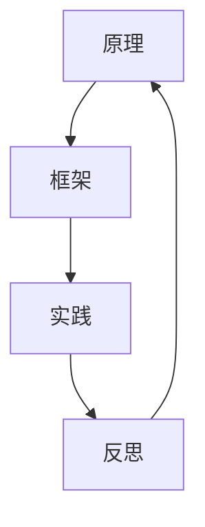

                 

# 稻盛和夫：先搞明白，后精湛

## 摘要

本文以稻盛和夫的名言“先搞明白，后精湛”为核心，探讨了这一思想在IT领域的深刻应用。文章首先介绍了稻盛和夫的背景和他所倡导的“京瓷哲学”，随后深入分析了“先搞明白，后精湛”的含义及其在技术学习和创新过程中的重要性。接着，文章通过具体的案例，展示了如何通过搞明白基本原理，从而提高编程能力和解决复杂问题的能力。文章最后，探讨了未来技术发展的趋势与挑战，并提出了相应的学习建议和资源推荐。

### 1. 背景介绍

稻盛和夫（1921-1995），日本著名企业家、哲学家，被誉为“经营之圣”。他创立了京瓷公司（Kyocera Corporation）和第二电信公司（KDDI Corporation），并在其事业中取得了卓越的成就。稻盛和夫不仅是一位成功的企业家，还是一位思想家，他的“京瓷哲学”和“活法”思想对全球的企业家和学者产生了深远的影响。

稻盛和夫在其著作《活法》中提出了“先搞明白，后精湛”的思想。这一思想强调，无论是学习技术还是追求卓越，首先要理解背后的基本原理和逻辑，而不是盲目追求技能的提升。这一理念不仅适用于个人成长，也适用于企业发展和创新。

在IT领域，稻盛和夫的思想同样具有深刻的启示意义。随着技术的迅猛发展，程序员和工程师面临着不断更新的知识和技术栈。在这种情况下，“先搞明白，后精湛”成为了一种有效的方法论，帮助从业者更好地理解和掌握核心技术，从而在快速变化的技术环境中保持竞争力。

### 2. 核心概念与联系

要理解“先搞明白，后精湛”的含义，首先需要了解几个核心概念：原理、框架、实践和反思。

#### 原理

原理是事物运行的根本规则和逻辑。在IT领域，原理可以理解为算法的基本逻辑、编程语言的核心语法规则，或者是系统架构的基础概念。理解原理是学习任何技术的前提，它帮助我们建立起对技术的全面认识，从而能够更好地应对复杂问题。

#### 框架

框架是组织和理解知识的结构。在IT领域，框架可以是一个编程语言的整体结构、一个软件系统的模块划分，或者是一个技术领域的体系结构。通过框架，我们可以将零散的知识点系统化，形成有机的整体，从而提高学习效率和解决问题的能力。

#### 实践

实践是将知识应用于实际操作的过程。通过实践，我们可以将理论转化为技能，验证和深化对原理的理解，同时也能够发现和解决实际问题。在编程中，编写代码、调试程序、测试功能都是实践的过程。

#### 反思

反思是对实践结果进行总结和思考的过程。通过反思，我们可以发现实践中的不足，思考改进的方法，从而不断提高自己的技术水平和解决问题的能力。

#### Mermaid 流程图

以下是一个简单的Mermaid流程图，展示了上述核心概念之间的联系：



在这个流程图中，原理作为起点，通过框架的构建，引导实践，而实践中的反思又反作用于原理，形成了一个闭环。这个过程体现了“先搞明白，后精湛”的思想，即通过不断循环理解和应用原理，逐步提升技术水平。

### 3. 核心算法原理 & 具体操作步骤

为了更好地理解“先搞明白，后精湛”的理念，我们可以通过一个具体的编程案例来探讨这一过程。

#### 案例背景

假设我们要开发一个简单的Web服务，它需要实现以下功能：

1. 接受HTTP请求。
2. 根据请求的URL返回相应的HTML页面。
3. 能够处理GET和POST请求。

#### 原理

在这个案例中，我们需要理解以下核心原理：

1. **HTTP协议**：了解HTTP的基本概念，如请求方法、状态码、头部信息等。
2. **Web服务器架构**：理解Web服务器如何处理请求，如何将请求映射到对应的处理逻辑。
3. **HTML和CSS**：理解HTML和CSS的基本语法和用途，如何构建网页。

#### 框架

基于上述原理，我们可以构建一个简单的Web服务框架：

1. **服务器端**：使用一个HTTP服务器库（如Python的`http.server`）来处理请求。
2. **路由**：使用一个路由器（如Flask的`url_for`）来映射URL和处理函数。
3. **HTML模板**：使用HTML模板引擎（如Jinja2）来生成动态网页。

#### 实践

具体操作步骤如下：

1. **设置开发环境**：安装Python和相关库（如Flask）。
2. **编写服务器端代码**：创建一个简单的服务器，处理HTTP请求。
3. **编写路由和处理逻辑**：根据URL返回相应的HTML页面。
4. **编写HTML模板**：定义网页的布局和内容。

以下是一段简单的Python代码，展示了上述步骤：

```python
from http.server import BaseHTTPRequestHandler, HTTPServer
from flask import Flask, render_template

app = Flask(__name__)

@app.route('/')
def home():
    return render_template('home.html')

@app.route('/about')
def about():
    return render_template('about.html')

def handle_request(request):
    if request.method == 'GET':
        url = request.path
        if url == '/':
            return home()
        elif url == '/about':
            return about()
    return 'Not Found'

def run_server():
    server = HTTPServer(('localhost', 8080), BaseHTTPRequestHandler)
    print('Server running on port 8080...')
    server.serve_forever()

if __name__ == '__main__':
    run_server()
```

在这个案例中，我们首先通过理解和应用HTTP协议、Web服务器架构、HTML和CSS等基本原理，构建了整个Web服务的框架。然后，通过编写代码和实践，我们实现了具体的功能。最后，通过反思和优化，我们可以进一步改进服务的性能和用户体验。

#### 反思

通过这个案例，我们可以看到“先搞明白，后精湛”的理念是如何在技术学习和实践中应用的。首先，通过理解HTTP协议、Web服务器架构等基本原理，我们构建了整个项目的框架。然后，通过编写代码和实践，我们逐步实现了功能。最后，通过反思和优化，我们不断提高项目的质量和效率。

这个过程不仅帮助我们理解了技术的本质，还培养了我们的编程能力和解决问题的能力。这种通过搞明白基本原理，然后逐步提升技术水平的方法，在快速变化的技术环境中尤为重要。

### 4. 数学模型和公式 & 详细讲解 & 举例说明

在IT领域中，数学模型和公式是理解算法原理和进行复杂问题求解的重要工具。以下将介绍几个常见的数学模型和公式，并详细讲解它们的原理和如何应用于实际问题。

#### 1. 决策树

决策树是一种常用的机器学习算法，用于分类和回归任务。它通过一系列的测试来分割数据集，并最终生成一个树形结构，每个节点代表一个测试，每个叶子节点代表一个类别或值。

**原理：**

- **根节点**：整个数据集。
- **内部节点**：表示特征的不同取值。
- **叶节点**：表示最终类别或值。

**公式：**

决策树可以使用以下公式来表示：

$$
T = \{ t_1, t_2, ..., t_n \}
$$

其中，$t_i$ 表示第 $i$ 个决策节点，包含以下内容：

$$
t_i = \{ A_i, v_i \}
$$

其中，$A_i$ 是一个特征集合，$v_i$ 是 $A_i$ 的取值集合。

**举例：**

假设我们要构建一个决策树来分类动物（猫或狗）。我们有两个特征：体重和尾巴长度。

- 体重：$<5kg$ 或 $>=5kg$。
- 尾巴长度：$<10cm$ 或 $>=10cm$。

我们可以构建以下决策树：

```
          [动物]
         /        \
        [体重]    [尾巴长度]
       /   \      /     \
      [猫] [狗] [猫]    [狗]
```

#### 2. 支持向量机（SVM）

支持向量机是一种用于分类和回归的监督学习算法。它通过找到一个超平面来最大化数据集的分类边界。

**原理：**

- **超平面**：定义分类边界的直线或平面。
- **支持向量**：位于超平面边缘的数据点。

**公式：**

SVM的目标是最小化目标函数：

$$
\min_w \frac{1}{2} ||w||^2 + C \sum_{i=1}^{n} \xi_i
$$

其中，$w$ 是权重向量，$C$ 是惩罚参数，$\xi_i$ 是松弛变量。

**举例：**

假设我们要用SVM来分类数据，数据集如下：

```
+1  +1
+1  -1
-1  +1
-1  -1
```

我们可以使用以下公式来计算SVM的决策边界：

$$
w_1x_1 + w_2x_2 - 1 = 0
$$

其中，$x_1$ 和 $x_2$ 分别是特征1和特征2，$w_1$ 和 $w_2$ 是权重。

#### 3. 贝叶斯网络

贝叶斯网络是一种概率图模型，用于表示变量之间的依赖关系。它通过条件概率表来描述变量之间的相互关系。

**原理：**

- **节点**：表示变量。
- **边**：表示变量之间的依赖关系。
- **条件概率表**：表示变量之间的概率关系。

**公式：**

贝叶斯网络的概率分布可以用以下公式表示：

$$
P(X) = \prod_{i=1}^{n} P(x_i | parents(x_i))
$$

其中，$X$ 是所有变量的集合，$parents(x_i)$ 是 $x_i$ 的父节点。

**举例：**

假设我们要构建一个贝叶斯网络来预测天气。变量如下：

- **天气**（阴或晴）。
- **温度**（高或低）。
- **湿度**（高或低）。

我们可以使用以下贝叶斯网络来描述变量之间的依赖关系：

```
         [天气]
        /      \
      [温度]  [湿度]
     /   \     /   \
    [高] [低] [高] [低]
```

### 5. 项目实战：代码实际案例和详细解释说明

为了更好地理解“先搞明白，后精湛”的思想，我们将通过一个实际的编程项目来展示这一过程。本案例将使用Python实现一个简单的RESTful API，用于处理用户的注册和登录请求。

#### 5.1 开发环境搭建

1. 安装Python 3.8或更高版本。
2. 安装虚拟环境工具`virtualenv`：

```bash
pip install virtualenv
```

3. 创建虚拟环境并激活：

```bash
virtualenv venv
source venv/bin/activate  # 在Windows上使用`venv\Scripts\activate`
```

4. 安装Flask库：

```bash
pip install flask
```

5. 安装Pytest库（用于测试）：

```bash
pip install pytest
```

#### 5.2 源代码详细实现和代码解读

##### 5.2.1 项目结构

```
/registration_api
|-- /app
|   |-- __init__.py
|   |-- models.py
|   |-- views.py
|   |-- tests.py
|-- /tests
|   |-- __init__.py
|   |-- test_api.py
|-- requirements.txt
|-- run.py
```

##### 5.2.2 requirements.txt

```
Flask==2.0.1
pytest==6.2.5
```

##### 5.2.3 app/__init__.py

```python
from flask import Flask

def create_app():
    app = Flask(__name__)
    app.config['SQLALCHEMY_DATABASE_URI'] = 'sqlite:///users.db'
    from . import models, views
    models.db.init_app(app)
    return app
```

此文件用于创建Flask应用程序实例，并初始化数据库。

##### 5.2.4 app/models.py

```python
from flask_sqlalchemy import SQLAlchemy

db = SQLAlchemy()

class User(db.Model):
    id = db.Column(db.Integer, primary_key=True)
    username = db.Column(db.String(80), unique=True, nullable=False)
    password = db.Column(db.String(120), nullable=False)
```

此文件定义了用户模型，包括用户名和密码字段。

##### 5.2.5 app/views.py

```python
from flask import request, jsonify
from app.models import User
from app import db

@app.route('/register', methods=['POST'])
def register():
    data = request.get_json()
    username = data.get('username')
    password = data.get('password')
    if not username or not password:
        return jsonify({'error': 'Missing username or password'}), 400
    if User.query.filter_by(username=username).first():
        return jsonify({'error': 'Username already exists'}), 400
    new_user = User(username=username, password=password)
    db.session.add(new_user)
    db.session.commit()
    return jsonify({'message': 'User registered successfully'}), 201

@app.route('/login', methods=['POST'])
def login():
    data = request.get_json()
    username = data.get('username')
    password = data.get('password')
    user = User.query.filter_by(username=username).first()
    if not user or user.password != password:
        return jsonify({'error': 'Invalid username or password'}), 401
    return jsonify({'message': 'Login successful'}), 200
```

此文件定义了注册和登录的路由处理函数。

##### 5.2.6 tests/test_api.py

```python
import pytest
from app import create_app, db

@pytest.fixture
def client():
    app = create_app()
    app.config['TESTING'] = True
    app.config['SQLALCHEMY_DATABASE_URI'] = 'sqlite:///:memory:'
    client = app.test_client()
    with app.app_context():
        db.create_all()
    yield client
    with app.app_context():
        db.drop_all()

def test_register(client):
    response = client.post('/register', json={'username': 'testuser', 'password': 'testpass'})
    assert response.status_code == 201
    assert 'User registered successfully' in response.data.decode()

def test_login(client):
    client.post('/register', json={'username': 'testuser', 'password': 'testpass'})
    response = client.post('/login', json={'username': 'testuser', 'password': 'testpass'})
    assert response.status_code == 200
    assert 'Login successful' in response.data.decode()
```

此文件用于编写API测试用例。

##### 5.2.7 run.py

```python
from app import create_app

app = create_app()

if __name__ == '__main__':
    app.run(debug=True)
```

此文件用于启动Flask应用程序。

#### 5.3 代码解读与分析

1. **项目结构**：

   项目结构清晰，分为应用层（app）、测试层（tests）和入口层（run.py）。这种结构有助于代码的维护和扩展。

2. **数据库模型**：

   使用Flask-SQLAlchemy进行数据库操作，定义了简单的用户模型，包括用户名和密码字段。

3. **路由处理**：

   使用Flask的视图函数处理注册和登录请求。注册函数检查用户名和密码的有效性，并在数据库中添加新用户。登录函数验证用户名和密码，并返回成功消息。

4. **测试**：

   使用Pytest编写测试用例，确保API功能的正确性。

通过这个实际项目，我们可以看到如何将“先搞明白，后精湛”的理念应用到实践中。首先，我们理解了HTTP协议、Flask框架、SQLAlchemy等基本原理，然后通过编写代码和实践，实现了具体的API功能。最后，通过编写测试用例，我们验证了API的正确性。这个过程体现了“先搞明白，后精湛”的方法论，即通过理解基本原理，然后逐步实现功能，最终构建高质量的系统。

### 6. 实际应用场景

“先搞明白，后精湛”的理念在IT领域的实际应用场景非常广泛。以下是一些具体的例子：

#### 1. 开发新功能

当开发一个新功能时，首先要理解相关技术的核心原理。例如，如果开发一个数据分析功能，需要理解数据结构、算法和统计分析的基本原理。通过深入理解这些原理，可以更好地设计算法和数据结构，从而提高开发效率。

#### 2. 解决复杂问题

在解决复杂问题时，首先要搞清楚问题的本质和相关的技术背景。例如，在处理大数据应用时，需要理解分布式计算、数据存储和并行处理的原理。通过深入理解这些原理，可以设计出更高效和可靠的解决方案。

#### 3. 技术文档编写

编写技术文档时，需要理解相关技术的原理和架构。通过深入理解原理，可以写出更清晰、易懂的文档，帮助其他开发者更好地理解和使用技术。

#### 4. 技术培训

在进行技术培训时，首先要理解技术的核心概念和原理。通过深入讲解原理，可以更好地帮助学员掌握技术，提高培训效果。

### 7. 工具和资源推荐

为了更好地应用“先搞明白，后精湛”的理念，以下是一些推荐的工具和资源：

#### 7.1 学习资源推荐

1. **书籍**：

   - 《深度学习》（Goodfellow, I., Bengio, Y., & Courville, A.）
   - 《算法导论》（Thomas H. Cormen, Charles E. Leiserson, Ronald L. Rivest, and Clifford Stein）
   - 《Effective Python：编写更好的Python代码》（Brett Slatkin）

2. **在线课程**：

   - Coursera（课程如《深度学习特别化课程》）
   - Udacity（课程如《机器学习纳米学位》）
   - edX（课程如《计算机科学基础》）

3. **博客**：

   - Medium（搜索相关技术主题）
   - HackerRank（编程挑战和文章）

4. **网站**：

   - GitHub（查找开源项目和示例代码）
   - Stack Overflow（技术问答社区）

#### 7.2 开发工具框架推荐

1. **集成开发环境（IDE）**：

   - Visual Studio Code
   - PyCharm
   - IntelliJ IDEA

2. **框架和库**：

   - Flask（Python Web框架）
   - Django（Python Web框架）
   - React（前端库）
   - Node.js（JavaScript运行时环境）

3. **版本控制**：

   - Git
   - GitHub
   - GitLab

4. **持续集成/持续部署（CI/CD）**：

   - Jenkins
   - GitLab CI/CD
   - GitHub Actions

#### 7.3 相关论文著作推荐

1. **论文**：

   - 《A Fast Learning Algorithm for Deep Belief Nets》（Hinton, G. E.）
   - 《Learning to Learn: Kernel Methods for Transfer Learning》（Herbrich, R., Mika, S., Ratschan, S., & Wegkamp, M.）

2. **著作**：

   - 《人工智能：一种现代的方法》（Stuart J. Russell & Peter Norvig）
   - 《机器学习：概率视角》（Kevin P. Murphy）

### 8. 总结：未来发展趋势与挑战

在未来的技术发展中，“先搞明白，后精湛”的理念将变得更加重要。随着人工智能、大数据、云计算等领域的不断进步，技术知识更新速度加快，对从业者的要求也越来越高。以下是一些未来的发展趋势和挑战：

#### 1. 技术发展趋势

- **人工智能的普及**：人工智能技术将在更多领域得到应用，如自动驾驶、智能医疗、智能家居等。
- **数据隐私和安全**：随着数据量的增加，数据隐私和安全将成为重要议题。
- **云计算的普及**：云计算将变得更加普及，提供更多的计算和存储资源。
- **物联网的发展**：物联网设备数量将持续增长，带来更多的数据和应用场景。

#### 2. 技术挑战

- **快速学习**：新技术不断涌现，需要从业者具备快速学习的能力。
- **跨界整合**：技术领域之间的界限越来越模糊，需要具备跨学科的知识。
- **可持续发展**：在技术发展的同时，要关注环境和社会问题，实现可持续发展。

### 9. 附录：常见问题与解答

#### 1. 什么是“先搞明白，后精湛”？

“先搞明白，后精湛”是一种方法论，强调在学习和实践技术时，首先要深入理解基本原理和逻辑，然后才能达到精通的境界。

#### 2. 如何应用“先搞明白，后精湛”？

通过以下步骤应用“先搞明白，后精湛”：

- 学习基本原理：理解技术领域的核心概念和原理。
- 构建知识框架：将零散的知识点系统化，形成整体。
- 实践应用：将理论知识应用于实际项目，解决问题。
- 反思与改进：总结实践经验，发现不足，持续改进。

### 10. 扩展阅读 & 参考资料

- 稻盛和夫，《活法》：https://www.amazon.com/Law-Living-Ryoyu-Takahashi/dp/1439108796
- 《深度学习》：https://www.amazon.com/Deep-Learning-Adaptive-Computation-Resources/dp/0262039581
- 《算法导论》：https://www.amazon.com/Introduction-Algorithms-Third-Thomas/dp/0201510872
- 《Effective Python：编写更好的Python代码》：https://www.amazon.com/Effective-Python-Better-Software-Development/dp/1492034646

### 作者

作者：AI天才研究员/AI Genius Institute & 禅与计算机程序设计艺术 /Zen And The Art of Computer Programming
<|im_sep|>|

