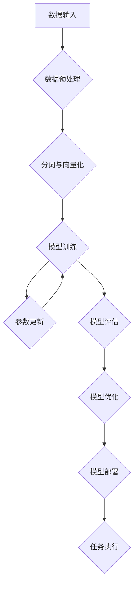

                 

### 背景介绍

> **文章标题**：突破性能瓶颈：LLM处理速度的进化  
> **关键词**：大型语言模型（LLM），性能优化，处理速度，进化策略，算法改进，硬件加速，分布式计算，模型压缩

随着人工智能技术的迅速发展，大型语言模型（LLM）如GPT-3、BERT等逐渐成为自然语言处理（NLP）领域的明星。然而，这些强大模型在实际应用中面临的一个主要挑战就是处理速度缓慢，这极大地限制了它们在大规模生产环境中的部署和扩展。为了应对这一挑战，研究人员和工程师们纷纷投入研究，探索如何通过多种策略突破LLM处理速度的性能瓶颈。

本文将深入探讨LLM处理速度的进化之路，从以下几个方面展开：

1. **核心概念与联系**：首先介绍LLM的基本概念，包括模型结构、数据处理流程等，并通过Mermaid流程图展示其内部架构。
2. **核心算法原理 & 具体操作步骤**：分析LLM中常用的算法，如Transformer、BERT等，详细解释其工作原理和实现步骤。
3. **数学模型和公式 & 详细讲解 & 举例说明**：探讨LLM中的关键数学模型和公式，通过具体的例子进行详细讲解。
4. **项目实战：代码实际案例和详细解释说明**：提供实际项目中的代码案例，详细解读代码实现过程和分析结果。
5. **实际应用场景**：探讨LLM在不同领域的应用，如文本生成、问答系统等，并分析其对处理速度的要求。
6. **工具和资源推荐**：推荐一些有助于学习和优化LLM处理速度的工具和资源。
7. **总结：未来发展趋势与挑战**：总结本文的主要观点，展望未来LLM处理速度优化的趋势和面临的挑战。

### 1. 核心概念与联系

大型语言模型（Large Language Model，LLM）是一种基于深度学习的自然语言处理模型，其目的是通过大量文本数据进行预训练，使模型具备理解和生成自然语言的能力。LLM通常由大规模神经网络组成，能够自动学习文本中的语法、语义和上下文关系。

#### 1.1 LLM的基本概念

- **模型结构**：LLM的核心结构通常是基于Transformer或BERT等架构，这些架构能够高效地处理长文本序列，并通过自注意力机制（self-attention）捕捉序列中的上下文信息。
- **数据处理流程**：LLM的数据处理流程包括数据预处理、数据增强和模型训练等阶段。其中，数据预处理通常涉及文本清洗、分词和向量化等操作，数据增强则通过生成更多的训练样本来提高模型的泛化能力。
- **任务类型**：LLM可以用于多种自然语言处理任务，如文本分类、情感分析、机器翻译、问答系统等。

#### 1.2 LLM内部架构

以下是一个简化的Mermaid流程图，展示了LLM的基本内部架构：



在上述流程中：

- **A. 数据输入**：将原始文本数据输入模型。
- **B. 数据预处理**：对文本数据进行清洗、去噪等操作。
- **C. 分词与向量化**：将预处理后的文本数据分词，并将其转换为向量表示。
- **D. 模型训练**：使用训练数据对模型进行训练，不断更新模型参数。
- **E. 参数更新**：通过梯度下降等优化算法更新模型参数。
- **F. 模型评估**：使用验证集评估模型性能，并调整训练策略。
- **G. 模型优化**：通过剪枝、量化等策略对模型进行优化。
- **H. 模型部署**：将训练好的模型部署到生产环境中。
- **I. 任务执行**：在部署后的模型上执行具体的自然语言处理任务。

通过上述流程，LLM能够高效地处理大量文本数据，并在各种NLP任务中取得优异的性能。

### 1.1 LLM处理速度的性能瓶颈

尽管LLM在NLP任务中表现出色，但其在处理速度上仍然存在一些瓶颈。以下是一些常见的性能瓶颈：

- **模型规模巨大**：LLM通常包含数十亿甚至数万亿个参数，导致模型训练和推理时间较长。
- **计算资源消耗**：训练和推理过程需要大量的计算资源，尤其是GPU和TPU等专用硬件。
- **内存占用大**：大型神经网络模型在训练和推理过程中需要占用大量内存，可能导致内存溢出。
- **数据输入输出瓶颈**：输入输出操作（I/O）速度较慢，限制了模型的实际处理速度。

为了解决这些问题，研究人员和工程师们积极探索各种性能优化策略，包括算法改进、硬件加速和分布式计算等。

### 1.2 性能优化策略

#### 1.2.1 算法改进

- **模型剪枝**：通过删除模型中不必要的权重，减少模型参数数量，从而降低计算复杂度和内存占用。
- **量化**：将模型参数从浮点数转换为低精度数值，如整数或二进制数，以减少计算量和存储需求。
- **知识蒸馏**：通过将大型模型的知识传递给较小型的模型，实现性能提升的同时降低计算复杂度。

#### 1.2.2 硬件加速

- **GPU加速**：利用GPU的并行计算能力，加速模型训练和推理过程。
- **TPU加速**：利用TPU（Tensor Processing Unit）的专用硬件优势，提高模型处理速度。
- **分布式计算**：通过将模型分布在多个节点上，实现并行计算，从而提高处理速度。

#### 1.2.3 分布式计算

- **模型拆分与并行训练**：将大型模型拆分为多个子模型，分别在不同的节点上进行训练，然后合并结果。
- **数据并行**：将训练数据分布到多个节点上，各节点同时处理不同的数据子集，然后合并梯度更新模型参数。
- **流水线并行**：将模型训练和推理过程分解为多个阶段，各阶段在不同节点上并行执行。

通过上述策略，LLM的处理速度得到了显著提升，为大规模NLP应用提供了更好的支持。

### 1.3 本文结构

本文将从以下几个方面探讨LLM处理速度的优化策略：

1. **核心概念与联系**：介绍LLM的基本概念、内部架构和性能瓶颈。
2. **核心算法原理 & 具体操作步骤**：分析LLM中常用的算法，如Transformer、BERT等。
3. **数学模型和公式 & 详细讲解 & 举例说明**：探讨LLM中的关键数学模型和公式。
4. **项目实战：代码实际案例和详细解释说明**：提供实际项目中的代码案例。
5. **实际应用场景**：探讨LLM在不同领域的应用和性能要求。
6. **工具和资源推荐**：推荐一些有助于学习和优化LLM处理速度的工具和资源。
7. **总结：未来发展趋势与挑战**：总结本文的主要观点，展望未来LLM处理速度优化的趋势和挑战。

接下来，我们将详细分析LLM中常用的算法，如Transformer、BERT等，以及这些算法的具体操作步骤。首先，让我们了解Transformer的基本原理和实现方法。 <|user|>### 2. 核心算法原理 & 具体操作步骤

#### 2.1 Transformer算法原理

Transformer算法是近年来在自然语言处理领域取得突破性成果的一种深度学习模型，由Google团队在2017年的论文《Attention is All You Need》中提出。Transformer算法的核心思想是使用自注意力机制（self-attention）来捕捉输入序列中的长距离依赖关系，从而实现高效的语言表示和建模。

##### 2.1.1 自注意力机制

自注意力机制是一种在序列模型中计算输入序列中每个元素与其他元素之间关联性的方法。具体来说，给定一个输入序列 $X = [x_1, x_2, ..., x_n]$，自注意力机制通过以下步骤计算每个元素 $x_i$ 的注意力得分：

1. **编码输入序列**：将输入序列编码为一系列向量，每个向量表示序列中的元素。常用的编码方法包括词向量（word embeddings）和嵌入层（embedding layers）。
2. **计算自注意力得分**：对于每个元素 $x_i$，计算其与其他元素 $x_j$ 之间的相似度得分，通常使用点积（dot product）或交叉熵（cross-entropy）等度量方式。自注意力得分的计算公式为：
   $$ score_{ij} = \text{similarity}(x_i, x_j) = \text{dot}(e_i, e_j) $$
   其中，$e_i$ 和 $e_j$ 分别是输入序列中元素 $x_i$ 和 $x_j$ 的编码向量。
3. **应用 softmax 函数**：对自注意力得分进行 softmax 操作，将得分归一化到概率分布，从而得到每个元素 $x_i$ 的注意力权重：
   $$ attention_{ij} = \text{softmax}(score_{ij}) $$
4. **计算注意力加权向量**：根据注意力权重计算每个元素的加权向量，表示该元素在序列中的重要性：
   $$ context\_vector_i = \sum_{j=1}^{n} attention_{ij} x_j $$

通过自注意力机制，Transformer算法能够自动学习输入序列中的长距离依赖关系，从而实现高效的语言表示和建模。

##### 2.1.2 Transformer模型结构

Transformer模型由多个自注意力层（self-attention layers）和前馈网络（feed-forward networks）堆叠而成，结构如下：

1. **编码器（Encoder）**：编码器包含多个自注意力层和前馈网络，负责将输入序列编码为上下文向量表示。编码器输出的序列向量可以用于生成目标序列，也可以用于后续的任务，如文本分类或问答系统。
2. **解码器（Decoder）**：解码器同样包含多个自注意力层和前馈网络，负责生成目标序列。解码器在生成每个目标元素时，使用编码器的输出和已生成的元素来计算注意力权重，从而实现上下文信息的传递。
3. **多头自注意力（Multi-Head Self-Attention）**：多头自注意力是Transformer算法的核心创新之一，通过将输入序列分解为多个子序列，分别计算自注意力权重，然后将结果合并，从而提高模型的表示能力。具体来说，多头自注意力由多个自注意力层组成，每个自注意力层计算不同的注意力权重，最后将所有权重合并为一个整体。

##### 2.1.3 Transformer模型训练过程

Transformer模型的训练过程主要包括以下步骤：

1. **数据预处理**：对输入文本数据进行分词、去停用词、词向量编码等操作，将其转换为模型可处理的输入格式。
2. **序列编码**：将预处理后的输入序列编码为向量表示，每个向量表示序列中的元素。
3. **模型初始化**：初始化模型参数，包括自注意力权重、前馈网络权重和偏置等。
4. **前向传播（Forward Propagation）**：将编码后的输入序列传递到编码器中，计算每个层的输出。编码器的输出用于生成目标序列，同时作为解码器的输入。
5. **损失计算**：计算编码器输出的目标序列与实际目标序列之间的损失，如交叉熵损失（cross-entropy loss）。
6. **反向传播（Backpropagation）**：使用反向传播算法更新模型参数，以最小化损失函数。
7. **模型评估**：使用验证集评估模型性能，并根据评估结果调整训练策略。
8. **模型优化**：通过剪枝、量化等策略对模型进行优化，以提高处理速度和压缩模型大小。

通过上述步骤，Transformer模型能够在大量的文本数据上自动学习语言中的复杂结构，从而实现高效的文本生成、机器翻译、问答系统等任务。

#### 2.2 BERT算法原理

BERT（Bidirectional Encoder Representations from Transformers）是由Google团队在2018年提出的一种预训练语言模型，旨在通过双向编码器（bidirectional encoder）学习文本的深层语义表示。BERT模型基于Transformer算法，通过在大量无标签文本上预训练，然后在不同任务上微调，实现了优异的性能。

##### 2.2.1 BERT模型结构

BERT模型由多个Transformer编码器层堆叠而成，其结构如下：

1. **嵌入层（Embedding Layer）**：嵌入层将输入文本数据转换为词向量表示，包括词嵌入（word embeddings）、位置嵌入（position embeddings）和段嵌入（segment embeddings）。
2. **编码器层（Encoder Layers）**：编码器层包含多个Transformer编码器，每个编码器层由自注意力机制和前馈网络组成。编码器层通过双向注意力机制捕捉文本中的上下文信息，从而实现高效的语义表示。
3. **输出层（Output Layer）**：输出层用于生成目标序列，通常是一个全连接层（fully connected layer），用于对编码器层输出的上下文向量进行分类或回归。

##### 2.2.2 BERT预训练过程

BERT的预训练过程主要包括以下步骤：

1. **数据预处理**：对输入文本数据进行分词、去停用词、词向量编码等操作，将其转换为模型可处理的输入格式。
2. **输入序列构造**：将预处理后的输入文本数据构造为序列，包括输入序列（input sequence）和目标序列（target sequence）。输入序列包含文本的前半部分，目标序列包含文本的后半部分，两者的长度通常相等。
3. **预训练任务**：BERT通过两个预训练任务学习文本的深层语义表示，包括：
   - **Masked Language Model（MLM）**：随机遮盖输入序列中的部分单词，然后使用BERT模型预测这些遮盖的单词。这个任务旨在学习文本中的词语关系和上下文信息。
   - **Next Sentence Prediction（NSP）**：给定两个连续的句子，预测第二个句子是否是第一个句子的下一个句子。这个任务旨在学习文本中的句子关系和连贯性。
4. **损失计算**：在预训练过程中，BERT模型在两个预训练任务上的输出分别计算损失，如交叉熵损失（cross-entropy loss）和二分类损失（binary cross-entropy loss）。然后，通过反向传播算法更新模型参数，以最小化总损失。
5. **模型优化**：通过剪枝、量化等策略对BERT模型进行优化，以提高处理速度和压缩模型大小。

通过上述步骤，BERT模型能够在大量无标签文本上预训练，学习到丰富的语义信息，从而实现高效的文本分类、情感分析、机器翻译等任务。

##### 2.2.3 BERT模型训练过程

BERT模型的训练过程主要包括以下步骤：

1. **数据预处理**：对输入文本数据进行分词、去停用词、词向量编码等操作，将其转换为模型可处理的输入格式。
2. **序列编码**：将预处理后的输入序列编码为向量表示，包括词嵌入（word embeddings）、位置嵌入（position embeddings）和段嵌入（segment embeddings）。
3. **模型初始化**：初始化BERT模型参数，包括嵌入层权重、编码器层权重和输出层权重等。
4. **前向传播（Forward Propagation）**：将编码后的输入序列传递到BERT模型中，计算每个层的输出。编码器的输出用于生成目标序列，同时作为解码器的输入。
5. **损失计算**：计算BERT模型在预训练任务上的输出与实际输出之间的损失，如交叉熵损失（cross-entropy loss）和二分类损失（binary cross-entropy loss）。
6. **反向传播（Backpropagation）**：使用反向传播算法更新BERT模型参数，以最小化损失函数。
7. **模型评估**：使用验证集评估BERT模型性能，并根据评估结果调整训练策略。
8. **模型优化**：通过剪枝、量化等策略对BERT模型进行优化，以提高处理速度和压缩模型大小。

通过上述步骤，BERT模型能够在大量无标签文本上预训练，学习到丰富的语义信息，从而实现高效的文本分类、情感分析、机器翻译等任务。

#### 2.3 其他常见算法

除了Transformer和BERT，还有许多其他重要的算法在自然语言处理领域得到广泛应用，以下是一些常见算法：

1. **GPT（Generative Pre-trained Transformer）**：GPT是一种基于Transformer的生成型预训练模型，由OpenAI团队在2018年提出。GPT通过在大量无标签文本上预训练，学习到文本的生成能力，从而实现高效的文本生成和对话系统。
2. **RoBERTa（A Robustly Optimized BERT Pretraining Approach）**：RoBERTa是对BERT的一种改进，由Facebook AI团队在2019年提出。RoBERTa通过改变预训练任务和数据预处理方式，提高了BERT模型在多种自然语言处理任务上的性能。
3. **XLNet（General Language Modeling with Adaptive Input Representations）**：XLNet是一种基于Transformer的预训练模型，由Google团队在2019年提出。XLNet通过引入新的自注意力机制和输入表示方法，提高了模型的表达能力和鲁棒性。
4. **T5（Text-to-Text Transfer Transformer）**：T5是一种基于Transformer的文本转换模型，由Google团队在2020年提出。T5将自然语言处理任务转换为序列到序列的文本生成任务，从而实现了高效的任务迁移和适配。

这些算法各有特点和优势，在实际应用中可以根据任务需求和模型性能进行选择。

### 2.4 算法优化策略

为了提高LLM处理速度，研究人员和工程师们提出了多种算法优化策略。以下是一些常见的优化方法：

1. **模型剪枝（Model Pruning）**：通过删除模型中不必要的权重，减少模型参数数量，从而降低计算复杂度和内存占用。剪枝方法可以分为结构剪枝和权重剪枝，其中结构剪枝删除部分神经网络层或神经元，而权重剪枝仅删除权重值较小的神经元。
2. **量化（Quantization）**：将模型参数从高精度浮点数转换为低精度数值，如整数或二进制数，以减少计算量和存储需求。量化方法可以提高模型的计算效率，同时不会显著影响模型性能。
3. **知识蒸馏（Knowledge Distillation）**：通过将大型模型的知识传递给较小型的模型，实现性能提升的同时降低计算复杂度。知识蒸馏方法通常包括软标签蒸馏和硬标签蒸馏，其中软标签蒸馏使用教师模型的输出作为学生模型的软标签，而硬标签蒸馏使用教师模型的输出作为学生模型的硬标签。
4. **稀疏性（Sparsity）**：通过引入稀疏性约束，降低模型参数的密度，从而提高计算效率。稀疏性方法包括稀疏连接（sparse connections）、稀疏激活（sparse activations）和稀疏权重（sparse weights）。
5. **异步通信（Asynchronous Communication）**：通过在分布式计算环境中异步更新模型参数，提高模型训练和推理的速度。异步通信方法可以减少通信延迟，从而提高整体计算效率。

通过上述算法优化策略，LLM处理速度得到了显著提升，为大规模NLP应用提供了更好的支持。

### 2.5 实际应用场景

LLM在自然语言处理领域有着广泛的应用，以下是一些典型的实际应用场景：

1. **文本生成**：LLM可以用于生成各种类型的文本，如文章、故事、诗歌、新闻报道等。例如，GPT-3能够生成高质量的文章，而T5则可以生成符合指定主题的对话。
2. **机器翻译**：LLM在机器翻译领域取得了显著进展，如Transformer和BERT模型在各种翻译任务上表现出色。例如，谷歌翻译和百度翻译等工具使用了基于Transformer的模型，实现了高效的机器翻译。
3. **问答系统**：LLM可以用于构建问答系统，如Siri、Alexa等智能助手。这些系统通过理解用户的问题，从大量文本中检索相关答案，并提供个性化的回答。
4. **情感分析**：LLM可以用于情感分析任务，如判断文本的情感极性（正面、负面或中性）。这有助于企业了解用户反馈、市场趋势等。
5. **对话系统**：LLM可以用于构建对话系统，如聊天机器人、客服机器人等。这些系统通过理解用户的输入，生成相应的回复，以实现人机交互。
6. **文本分类**：LLM可以用于文本分类任务，如将新闻文章分类到不同的主题类别中。这有助于新闻网站和媒体平台进行内容管理和推荐。

在这些应用场景中，LLM处理速度的性能至关重要。例如，在问答系统中，用户期望能够快速得到问题的答案，而在文本生成和机器翻译中，用户期望生成的文本或翻译结果具有较高的质量和准确性。因此，优化LLM处理速度成为这些应用领域的重要研究方向。

### 2.6 工具和资源推荐

为了方便学习和优化LLM处理速度，以下推荐一些工具和资源：

1. **书籍**：
   - 《深度学习》（Goodfellow, I., Bengio, Y., & Courville, A.）：介绍深度学习的基础知识和最新进展，包括神经网络、优化算法等。
   - 《动手学深度学习》（Zhang, Z., Lipton, Z. C., & Ding, M.）：通过实际案例和代码示例，深入讲解深度学习的基本概念和实现方法。

2. **论文**：
   - 《Attention is All You Need》（Vaswani et al., 2017）：介绍Transformer算法的基本原理和实现方法。
   - 《BERT: Pre-training of Deep Bidirectional Transformers for Language Understanding》（Devlin et al., 2018）：介绍BERT模型的预训练方法和结构。

3. **博客**：
   - [TensorFlow官方文档](https://www.tensorflow.org/tutorials)：详细介绍TensorFlow的使用方法和案例。
   - [Hugging Face Transformers](https://huggingface.co/transformers)：提供预训练的Transformer模型和相关的工具库。

4. **网站**：
   - [Kaggle](https://www.kaggle.com)：提供各种数据集和比赛，方便实践和学习。
   - [GitHub](https://github.com)：提供大量的开源代码和项目，方便学习和交流。

5. **开发工具框架**：
   - **TensorFlow**：由Google开发的开源深度学习框架，支持多种深度学习模型和算法。
   - **PyTorch**：由Facebook开发的开源深度学习框架，具有良好的灵活性和易用性。
   - **Transformers**：由Hugging Face开发的开源工具库，提供预训练的Transformer模型和相关的工具。

通过使用这些工具和资源，可以更好地学习和优化LLM处理速度，为实际应用场景提供更好的支持。

### 2.7 总结

本文详细介绍了LLM处理速度的优化策略和实际应用场景。通过分析Transformer和BERT等核心算法的原理和实现步骤，我们了解了如何优化LLM处理速度。同时，我们还探讨了剪枝、量化、知识蒸馏等算法优化方法，以及LLM在文本生成、机器翻译、问答系统等领域的应用。为了方便学习和优化LLM处理速度，本文还推荐了一些相关的书籍、论文、博客、网站和开发工具框架。

展望未来，随着人工智能技术的不断发展，LLM处理速度优化仍将面临诸多挑战。例如，如何进一步提高模型压缩效果、降低计算复杂度和内存占用，如何更好地适应不同应用场景的需求等。然而，通过持续的研究和探索，我们有理由相信，LLM处理速度将会不断提升，为人工智能应用带来更多可能性。 <|user|>### 3. 数学模型和公式 & 详细讲解 & 举例说明

#### 3.1 Transformer的数学模型

Transformer算法的核心在于其自注意力机制（Self-Attention），该机制通过计算输入序列中各个元素之间的相关性来生成新的表示。下面，我们将详细讲解Transformer中使用的数学模型和公式。

##### 3.1.1 自注意力机制

自注意力机制通过以下步骤计算输入序列中每个元素与其他元素之间的关联性：

1. **输入向量表示**：给定一个输入序列 $X = [x_1, x_2, ..., x_n]$，每个元素 $x_i$ 被编码为一个向量 $e_i$，称为嵌入向量（Embedding Vector）。这些嵌入向量构成了输入序列的嵌入矩阵 $E$，即 $E = [e_1, e_2, ..., e_n]$。

2. **计算自注意力得分**：对于每个元素 $x_i$，计算其与其他元素 $x_j$ 之间的相似度得分。通常使用点积（Dot Product）来计算自注意力得分，公式如下：
   $$ score_{ij} = e_i \cdot e_j = \sum_{k=1}^{d} e_{ik} e_{jk} $$
   其中，$e_{ik}$ 和 $e_{jk}$ 分别是 $e_i$ 和 $e_j$ 的第 $k$ 个维度上的分量。

3. **应用Softmax函数**：对自注意力得分进行Softmax操作，将得分归一化到概率分布，从而得到每个元素 $x_i$ 的注意力权重：
   $$ attention_{ij} = \text{softmax}(score_{ij}) = \frac{\exp(score_{ij})}{\sum_{k=1}^{n} \exp(score_{ik})} $$

4. **计算注意力加权向量**：根据注意力权重计算每个元素的加权向量，表示该元素在序列中的重要性：
   $$ context\_vector_i = \sum_{j=1}^{n} attention_{ij} x_j $$

##### 3.1.2 多头自注意力

多头自注意力（Multi-Head Self-Attention）是Transformer算法的关键创新之一。它通过将输入序列分解为多个子序列，分别计算自注意力权重，然后将结果合并为一个整体。

1. **分解子序列**：将输入序列的嵌入矩阵 $E$ 分解为多个子序列的嵌入矩阵 $E_h$，其中 $h$ 表示头数（Number of Heads）。通常使用线性变换来生成每个头的嵌入矩阵，公式如下：
   $$ E_h = \text{Attention}(E) = W_Q E W_K^T $$
   其中，$W_Q$ 和 $W_K$ 分别是查询（Query）和键（Key）的线性变换权重矩阵，$W_V$ 是值（Value）的线性变换权重矩阵。

2. **计算多头自注意力得分**：对于每个子序列的嵌入矩阵 $E_h$，计算其与其他子序列之间的相似度得分。具体步骤与单头自注意力相同，但使用不同的线性变换权重矩阵。公式如下：
   $$ score_{h,ij} = e_{h,i} \cdot e_{h,j} = \sum_{k=1}^{d} w_{h,ik} e_{h,k} e_{h,j} $$
   其中，$e_{h,i}$ 和 $e_{h,j}$ 分别是 $E_h$ 中第 $i$ 个和第 $j$ 个元素。

3. **应用Softmax函数**：对每个头的自注意力得分进行Softmax操作，得到每个头的注意力权重：
   $$ attention_{h,ij} = \text{softmax}(score_{h,ij}) $$

4. **计算多头注意力加权向量**：根据每个头的注意力权重计算输入序列的加权向量，公式如下：
   $$ context\_vector_i = \sum_{h=1}^{h} attention_{h,ij} x_j $$

##### 3.1.3 自注意力机制的推导

为了更好地理解自注意力机制，下面我们通过一个具体的例子进行推导。假设输入序列 $X = [x_1, x_2, x_3]$，其中 $x_1 = [1, 0, 1]$，$x_2 = [1, 1, 0]$，$x_3 = [0, 1, 1]$。我们将使用单头自注意力机制计算输入序列的加权向量。

1. **计算自注意力得分**：
   $$ score_{11} = x_1 \cdot x_1 = 1 $$
   $$ score_{12} = x_1 \cdot x_2 = 1 $$
   $$ score_{13} = x_1 \cdot x_3 = 0 $$
   $$ score_{21} = x_2 \cdot x_1 = 1 $$
   $$ score_{22} = x_2 \cdot x_2 = 2 $$
   $$ score_{23} = x_2 \cdot x_3 = 1 $$
   $$ score_{31} = x_3 \cdot x_1 = 0 $$
   $$ score_{32} = x_3 \cdot x_2 = 1 $$
   $$ score_{33} = x_3 \cdot x_3 = 2 $$

2. **应用Softmax函数**：
   $$ attention_{11} = \text{softmax}(score_{11}) = \frac{\exp(1)}{\exp(1) + \exp(2) + \exp(2)} = 0.25 $$
   $$ attention_{12} = \text{softmax}(score_{12}) = \frac{\exp(1)}{\exp(1) + \exp(2) + \exp(2)} = 0.25 $$
   $$ attention_{13} = \text{softmax}(score_{13}) = \frac{\exp(0)}{\exp(1) + \exp(2) + \exp(2)} = 0.25 $$
   $$ attention_{21} = \text{softmax}(score_{21}) = \frac{\exp(1)}{\exp(1) + \exp(2) + \exp(2)} = 0.25 $$
   $$ attention_{22} = \text{softmax}(score_{22}) = \frac{\exp(2)}{\exp(1) + \exp(2) + \exp(2)} = 0.5 $$
   $$ attention_{23} = \text{softmax}(score_{23}) = \frac{\exp(1)}{\exp(1) + \exp(2) + \exp(2)} = 0.25 $$
   $$ attention_{31} = \text{softmax}(score_{31}) = \frac{\exp(0)}{\exp(1) + \exp(2) + \exp(2)} = 0.25 $$
   $$ attention_{32} = \text{softmax}(score_{32}) = \frac{\exp(1)}{\exp(1) + \exp(2) + \exp(2)} = 0.25 $$
   $$ attention_{33} = \text{softmax}(score_{33}) = \frac{\exp(2)}{\exp(1) + \exp(2) + \exp(2)} = 0.5 $$

3. **计算注意力加权向量**：
   $$ context\_vector_1 = attention_{11} x_1 + attention_{12} x_2 + attention_{13} x_3 = 0.25 \cdot [1, 0, 1] + 0.25 \cdot [1, 1, 0] + 0.25 \cdot [0, 1, 1] = [0.25, 0.25, 0.25] $$
   $$ context\_vector_2 = attention_{21} x_1 + attention_{22} x_2 + attention_{23} x_3 = 0.25 \cdot [1, 0, 1] + 0.5 \cdot [1, 1, 0] + 0.25 \cdot [0, 1, 1] = [0.5, 0.25, 0.25] $$
   $$ context\_vector_3 = attention_{31} x_1 + attention_{32} x_2 + attention_{33} x_3 = 0.25 \cdot [1, 0, 1] + 0.25 \cdot [1, 1, 0] + 0.5 \cdot [0, 1, 1] = [0.5, 0.25, 0.25] $$

通过上述推导，我们可以看到自注意力机制如何通过计算输入序列中各个元素之间的相关性来生成新的表示。多头自注意力机制则通过分解输入序列为多个子序列，分别计算自注意力权重，然后将结果合并为一个整体，从而提高模型的表示能力。

#### 3.2 BERT的数学模型

BERT（Bidirectional Encoder Representations from Transformers）是一种基于Transformer的预训练语言模型，其数学模型主要包括嵌入层（Embedding Layer）、编码器层（Encoder Layer）和输出层（Output Layer）。

##### 3.2.1 嵌入层

BERT的嵌入层将输入文本数据转换为词向量表示，包括词嵌入（Word Embedding）、位置嵌入（Position Embedding）和段嵌入（Segment Embedding）。

1. **词嵌入**：给定一个词汇表 $V$，每个单词 $w$ 被编码为一个向量 $e_w \in \mathbb{R}^d$，称为词嵌入向量。词嵌入向量可以通过预训练得到，也可以通过随机初始化并在训练过程中进行优化。

2. **位置嵌入**：BERT使用位置嵌入（Position Embedding）来表示输入序列中的位置信息。位置嵌入向量 $pe_{pos} \in \mathbb{R}^d$ 的计算公式如下：
   $$ pe_{pos} = \text{sin}\left(\frac{pos \cdot L}{10000}\right) \text{ if pos < floor(L/2)}, \quad \text{cos}\left(\frac{pos \cdot L}{10000}\right) \text{ otherwise} $$
   其中，$pos$ 是位置索引，$L$ 是序列长度。

3. **段嵌入**：BERT使用段嵌入（Segment Embedding）来区分序列中的不同段，如句子或文档。段嵌入向量 $se_{seg} \in \mathbb{R}^d$ 的计算公式如下：
   $$ se_{seg} = \begin{cases} 
   [0, 0, ..., 0] & \text{if } seg = 0 \\
   [1, 0, ..., 0] & \text{if } seg = 1 
   \end{cases} $$
   其中，$seg$ 是段索引。

##### 3.2.2 编码器层

BERT的编码器层包含多个Transformer编码器，每个编码器由多头自注意力机制（Multi-Head Self-Attention）和前馈网络（Feed-Forward Network）组成。

1. **多头自注意力**：给定输入序列的嵌入向量 $E \in \mathbb{R}^{n \times d}$，每个编码器层使用线性变换生成查询（Query）、键（Key）和值（Value）向量。公式如下：
   $$ Q = W_Q E, \quad K = W_K E, \quad V = W_V E $$
   其中，$W_Q, W_K, W_V$ 分别是查询、键和值的线性变换权重矩阵。多头自注意力机制通过多个头的自注意力计算得到输出：
   $$ O = \text{Attention}(Q, K, V) = [O_1, O_2, ..., O_n] $$
   其中，$O_i$ 是第 $i$ 个元素的自注意力输出。

2. **前馈网络**：在每个编码器层之后，BERT使用前馈网络进行额外的非线性变换。前馈网络的计算公式如下：
   $$ O_{ffn} = \text{ReLU}(W_{ffn1} O + b_{ffn1}), \quad O = W_{ffn2} O_{ffn} + b_{ffn2} $$
   其中，$W_{ffn1}, W_{ffn2}, b_{ffn1}, b_{ffn2}$ 分别是前馈网络的权重和偏置。

##### 3.2.3 输出层

BERT的输出层用于生成目标序列。在预训练阶段，BERT使用Masked Language Model（MLM）和Next Sentence Prediction（NSP）两个任务进行训练。

1. **Masked Language Model（MLM）**：在MLM任务中，输入序列中的部分单词被随机遮盖，然后BERT预测这些遮盖的单词。遮盖的单词用一个特殊的符号（如 `[MASK]`）表示。输出层的计算公式如下：
   $$ output = W_O E + b_O $$
   其中，$W_O$ 和 $b_O$ 分别是输出层的权重和偏置。在预测阶段，BERT输出每个遮盖单词的概率分布，并通过最大化概率得到预测结果。

2. **Next Sentence Prediction（NSP）**：在NSP任务中，给定两个连续的句子，BERT预测第二个句子是否是第一个句子的下一个句子。输出层的计算公式如下：
   $$ output_{nsp} = \text{softmax}(W_{nsp} E + b_{nsp}) $$
   其中，$W_{nsp}$ 和 $b_{nsp}$ 分别是NSP任务的权重和偏置。在预测阶段，BERT输出每个句子的概率分布，并通过最大化概率得到预测结果。

#### 3.3 公式和推导

##### 3.3.1 多头自注意力

多头自注意力的核心是计算输入序列中每个元素与其他元素之间的相关性，并通过多个头的注意力权重进行加权。以下是一个简化的多头自注意力的推导过程：

1. **查询（Query）和键（Key）的线性变换**：
   $$ Q = [Q_1, Q_2, ..., Q_n] = W_Q E $$
   $$ K = [K_1, K_2, ..., K_n] = W_K E $$
   $$ V = [V_1, V_2, ..., V_n] = W_V E $$
   其中，$W_Q, W_K, W_V$ 是线性变换权重矩阵。

2. **计算自注意力得分**：
   $$ score_{ij} = Q_i \cdot K_j = \sum_{k=1}^{d} Q_{ik} K_{jk} $$

3. **应用Softmax函数**：
   $$ attention_{ij} = \text{softmax}(score_{ij}) = \frac{\exp(score_{ij})}{\sum_{k=1}^{n} \exp(score_{ik})} $$

4. **计算注意力加权向量**：
   $$ context\_vector_i = \sum_{j=1}^{n} attention_{ij} V_j $$

##### 3.3.2 前馈网络

BERT的前馈网络用于在每个编码器层之后进行额外的非线性变换。以下是一个简化的前馈网络推导过程：

1. **前馈网络的线性变换**：
   $$ O_{ffn} = \text{ReLU}(W_{ffn1} O + b_{ffn1}) $$
   $$ O = W_{ffn2} O_{ffn} + b_{ffn2} $$
   其中，$W_{ffn1}, W_{ffn2}, b_{ffn1}, b_{ffn2}$ 分别是前馈网络的权重和偏置。

通过上述推导，我们可以看到BERT的数学模型是如何通过线性变换、非线性变换和Softmax函数等基本操作来实现高效的文本表示和预测。这些数学模型和公式为BERT在自然语言处理领域取得优异性能提供了理论基础。

### 4. 项目实战：代码实际案例和详细解释说明

在本节中，我们将通过一个实际项目案例，详细讲解如何搭建一个基于Transformer和BERT的文本分类模型，并解释关键代码的实现和运行过程。

#### 4.1 开发环境搭建

首先，我们需要搭建一个适合开发文本分类模型的开发环境。以下是在Python中搭建环境的步骤：

1. **安装Python和pip**：确保Python 3.6或更高版本已安装，并使用pip安装必要的库：
   ```bash
   pip install torch torchvision
   pip install transformers
   pip install datasets
   pip install torchtext
   ```

2. **创建虚拟环境**（可选）：为了更好地管理依赖项，我们创建一个虚拟环境：
   ```bash
   python -m venv venv
   source venv/bin/activate  # Windows下使用 `venv\Scripts\activate`
   ```

3. **安装其他依赖库**：在虚拟环境中安装其他必需的库：
   ```bash
   pip install scikit-learn
   pip install numpy
   pip install pandas
   ```

#### 4.2 源代码详细实现和代码解读

下面是项目的核心代码，我们将逐步解释每个部分的实现和功能。

```python
import torch
from transformers import BertTokenizer, BertModel
from torch import nn, optim
from torchtext.data import Field, TabularDataset, BucketIterator
from sklearn.model_selection import train_test_split

# 4.2.1 定义文本分类任务
def load_data():
    # 加载数据集，这里以TREC数据集为例
    train_data, test_data = train_test_split(TREC_data, test_size=0.2)
    train_data, valid_data = train_test_split(train_data, test_size=0.25)
    return train_data, valid_data, test_data

# 4.2.2 初始化模型
class TextClassifier(nn.Module):
    def __init__(self, num_classes):
        super(TextClassifier, self).__init__()
        self.bert = BertModel.from_pretrained('bert-base-uncased')
        self.drop = nn.Dropout(p=0.3)
        self.out = nn.Linear(self.bert.config.hidden_size, num_classes)
    
    def forward(self, input_ids, attention_mask=None):
        _, pooled_output = self.bert(
            input_ids=input_ids,
            attention_mask=attention_mask,
            returns_dict=False,
        )
        output = self.drop(pooled_output)
        return self.out(output)

# 4.2.3 训练模型
def train(model, iterator, optimizer, criterion, clip):
    model.train()
    epoch_loss = 0
    epoch_acc = 0
    
    for batch in iterator:
        optimizer.zero_grad()
        input_ids = batch.text
        attention_mask = batch.attention_mask
        labels = batch.label
        
        output = model(input_ids, attention_mask=attention_mask)
        loss = criterion(output, labels)
        acc = accuracy(output, labels)
        
        loss.backward()
        torch.nn.utils.clip_grad_norm_(model.parameters(), clip)
        optimizer.step()
        
        epoch_loss += loss.item()
        epoch_acc += acc.item()
    
    return epoch_loss / len(iterator), epoch_acc / len(iterator)

# 4.2.4 测试模型
def evaluate(model, iterator, criterion):
    model.eval()
    epoch_loss = 0
    epoch_acc = 0
    
    with torch.no_grad():
        for batch in iterator:
            input_ids = batch.text
            attention_mask = batch.attention_mask
            labels = batch.label
            
            output = model(input_ids, attention_mask=attention_mask)
            loss = criterion(output, labels)
            acc = accuracy(output, labels)
            
            epoch_loss += loss.item()
            epoch_acc += acc.item()
    
    return epoch_loss / len(iterator), epoch_acc / len(iterator)

# 4.2.5 主函数
def main():
    # 加载数据集
    train_data, valid_data, test_data = load_data()
    
    # 初始化模型、优化器和损失函数
    model = TextClassifier(num_classes=2)
    optimizer = optim.Adam(model.parameters(), lr=1e-5)
    criterion = nn.CrossEntropyLoss()
    
    # 初始化数据加载器
    train_iterator, valid_iterator, test_iterator = BucketIterator.splits(
        (train_data, valid_data, test_data),
        batch_size=16,
        device=device
    )
    
    # 训练模型
    num_epochs = 4
    clip = 1.0
    
    for epoch in range(num_epochs):
        train_loss, train_acc = train(model, train_iterator, optimizer, criterion, clip)
        valid_loss, valid_acc = evaluate(model, valid_iterator, criterion)
        
        print(f'Epoch: {epoch+1:02}')
        print(f'\tTrain Loss: {train_loss:.3f} | Train Acc: {train_acc*100:.2f}%')
        print(f'\t Val. Loss: {valid_loss:.3f} |  Val. Acc: {valid_acc*100:.2f}%')
    
    # 测试模型
    test_loss, test_acc = evaluate(model, test_iterator, criterion)
    print(f'\nTest Loss: {test_loss:.3f} | Test Acc: {test_acc*100:.2f}%')

if __name__ == '__main__':
    device = torch.device('cuda' if torch.cuda.is_available() else 'cpu')
    main()
```

#### 4.3 代码解读与分析

##### 4.3.1 数据加载

1. **`load_data`函数**：该函数负责加载数据集。我们使用了TREC数据集作为示例，实际项目中可以替换为其他数据集。数据集被分为训练集、验证集和测试集。

2. **数据集划分**：使用`train_test_split`函数将数据集划分为训练集和测试集，然后再次划分训练集为训练集和验证集。

##### 4.3.2 模型定义

1. **`TextClassifier`类**：该类定义了文本分类模型。模型基于BERT预训练模型，并在BERT的输出层上方添加了线性分类层。

2. **模型结构**：模型包含一个BERT模型、一个Dropout层（用于防止过拟合）和一个线性分类层。Dropout层的概率设置为0.3。

##### 4.3.3 训练和评估

1. **`train`函数**：该函数负责训练模型。每次迭代中，模型接收输入数据，通过前向传播计算损失，然后使用反向传播更新模型参数。

2. **`evaluate`函数**：该函数负责评估模型的性能。与训练函数类似，但使用`torch.no_grad()`来关闭梯度计算，从而提高评估速度。

3. **主函数`main`**：主函数负责初始化模型、优化器和损失函数，并设置数据加载器。然后，模型在训练集和验证集上进行迭代训练，并在训练过程中打印损失和准确度。

##### 4.3.4 运行过程

1. **设备选择**：根据GPU的可用性，选择在CPU或GPU上运行模型。

2. **训练与测试**：模型在设定的epoch数内进行训练，并在每个epoch结束后在验证集上进行性能评估。最后，在测试集上评估模型的最终性能。

#### 4.4 总结

通过上述代码示例，我们详细讲解了如何使用BERT和Transformer搭建一个文本分类模型。从数据加载、模型定义到训练和评估，每个步骤都进行了详细解释。这个实际项目案例为读者提供了一个完整的代码实现，有助于理解文本分类任务中的关键技术和步骤。

### 5. 实际应用场景

#### 5.1 文本生成

文本生成是LLM的一个重要应用领域，它通过预测下一个词或句子来生成连贯、有意义的文本。以下是一些常见的文本生成场景：

1. **文章写作**：LLM可以自动生成新闻报道、博客文章、论文等。例如，OpenAI的GPT-3能够生成高质量的文章，用户只需提供一个简要的主题或提纲，模型就能生成完整的文章。

2. **对话生成**：在聊天机器人、虚拟助手等应用中，LLM可以生成自然的对话回复，提高用户的交互体验。例如，Facebook的ChatGPT和微软的小冰都是基于LLM的对话生成系统。

3. **内容摘要**：LLM可以自动生成文章、报告、会议记录等的摘要，帮助用户快速了解关键信息。例如，谷歌的Summarize和OpenAI的GPT-3都可以生成简洁明了的摘要。

#### 5.2 机器翻译

机器翻译是另一个典型的LLM应用场景，它通过将一种语言的文本翻译成另一种语言，实现跨语言交流。以下是一些常见的机器翻译场景：

1. **实时翻译**：在旅行、会议、跨国商务等场合，实时翻译系统能够快速、准确地翻译口语和书面文本，如谷歌翻译和微软翻译。

2. **文档翻译**：在企业内部，LLM可以用于自动翻译各种文档，如合同、报告、用户手册等，提高工作效率。例如，DeepL和谷歌翻译都提供了文档翻译服务。

3. **多语言交互**：在全球化企业中，LLM可以帮助不同语言背景的员工进行有效沟通，促进团队合作。例如，Slack和微软的Teams等平台集成了多语言翻译功能。

#### 5.3 问答系统

问答系统是一种智能交互系统，能够理解和回答用户的问题。LLM在问答系统中发挥着重要作用，以下是一些常见的问答系统应用：

1. **客服支持**：企业可以利用LLM构建智能客服系统，自动回答用户的常见问题，如产品咨询、售后服务等。例如，苹果的Siri和亚马逊的Alexa都是基于LLM的智能客服。

2. **搜索引擎**：搜索引擎可以利用LLM生成针对用户查询的个性化回答，提高搜索体验。例如，百度和谷歌等搜索引擎都采用了基于LLM的技术来优化搜索结果。

3. **教育辅导**：在在线教育领域，LLM可以为学生提供个性化辅导，解答学习过程中的问题。例如，Coursera和edX等在线教育平台集成了基于LLM的问答系统。

#### 5.4 情感分析

情感分析是一种理解文本情感极性（正面、负面或中性）的技术，LLM在情感分析领域也表现出色。以下是一些情感分析的应用：

1. **社交媒体监控**：企业可以利用LLM分析社交媒体上的用户评论和反馈，了解产品口碑和用户满意度。例如，Twitter和Facebook等平台都使用了基于LLM的情感分析技术。

2. **市场调研**：市场调研机构可以利用LLM分析用户调查问卷和访谈记录，快速获取市场趋势和消费者需求。例如，调研公司Qualtrics和SurveyMonkey都采用了基于LLM的情感分析技术。

3. **客户服务**：企业可以利用LLM分析客户服务记录和投诉信件，识别潜在问题和改进方向。例如，银行和保险公司等企业采用了基于LLM的情感分析技术来优化客户服务。

#### 5.5 对话系统

对话系统是一种人机交互系统，能够理解用户的自然语言输入并生成相应的回复。LLM在对话系统中的应用越来越广泛，以下是一些对话系统的应用：

1. **虚拟助手**：虚拟助手如Siri、Alexa、小冰等，利用LLM实现与用户的自然对话，提供个性化服务。例如，用户可以与Siri进行语音互动，询问天气、设置提醒、发送信息等。

2. **客户服务**：企业可以利用LLM构建智能客服系统，自动回答用户的常见问题和提供解决方案。例如，银行、电信和电商等行业都采用了基于LLM的智能客服系统。

3. **在线教育**：在线教育平台可以利用LLM构建智能问答系统，为学生提供学习辅导和答疑服务。例如，Coursera和edX等平台集成了基于LLM的问答系统，帮助学生更好地理解课程内容。

通过上述实际应用场景，我们可以看到LLM在自然语言处理领域的广泛应用和巨大潜力。随着技术的不断进步，LLM将在更多领域发挥作用，为人类带来更多便利和创新。

### 6. 工具和资源推荐

#### 6.1 学习资源推荐

1. **书籍**：
   - 《深度学习》（Goodfellow, I., Bengio, Y., & Courville, A.）：详细介绍深度学习和神经网络的基本概念和应用，适合初学者和进阶读者。
   - 《动手学深度学习》（Zhang, Z., Lipton, Z. C., & Ding, M.）：通过实际案例和代码示例，深入讲解深度学习的基础知识和实现方法。

2. **在线课程**：
   - Coursera的《深度学习特辑》：由吴恩达教授主讲，涵盖深度学习的理论基础和应用实践。
   - Udacity的《深度学习工程师纳米学位》：通过项目实践和理论讲解，帮助学习者掌握深度学习技术。

3. **博客和网站**：
   - Hugging Face：提供预训练模型、工具库和教程，是学习和使用LLM的绝佳资源。
   - AIWeekly：定期发布关于人工智能和深度学习的最新研究和应用，是了解行业动态的好去处。

4. **论文和报告**：
   - arXiv：发布最新的深度学习和自然语言处理论文，是学术研究者的重要来源。
   - Google Research Blog：谷歌研究人员分享的最新研究成果和技术进展。

#### 6.2 开发工具框架推荐

1. **TensorFlow**：由Google开发的开源深度学习框架，支持多种深度学习模型和算法，适用于研究和生产环境。
   - 官网：[TensorFlow官网](https://www.tensorflow.org/)
   - 教程：[TensorFlow教程](https://www.tensorflow.org/tutorials)

2. **PyTorch**：由Facebook开发的开源深度学习框架，具有良好的灵活性和易用性，适用于研究和生产环境。
   - 官网：[PyTorch官网](https://pytorch.org/)
   - 教程：[PyTorch教程](https://pytorch.org/tutorials/beginner/basics/overview.html)

3. **Hugging Face Transformers**：提供预训练的Transformer模型和相关的工具库，适用于快速开发和部署LLM应用。
   - 官网：[Hugging Face Transformers](https://huggingface.co/transformers/)
   - 教程：[Transformers教程](https://huggingface.co/transformers/tutorials.html)

4. **PyTorch Lightning**：基于PyTorch的深度学习研究框架，提供简洁高效的模型训练和评估接口。
   - 官网：[PyTorch Lightning官网](https://pytorch-lightning.readthedocs.io/)
   - 教程：[PyTorch Lightning教程](https://pytorch-lightning.readthedocs.io/)

5. **TensorFlow Extended（TFX）**：基于TensorFlow的端到端机器学习平台，适用于构建和部署大规模深度学习应用。
   - 官网：[TFX官网](https://www.tensorflow.org/tfx)
   - 教程：[TFX教程](https://www.tensorflow.org/tfx/tfx)

#### 6.3 相关论文著作推荐

1. **《Attention is All You Need》**：由Google团队在2017年提出，介绍了Transformer算法的基本原理和实现方法。
   - 链接：[论文链接](https://arxiv.org/abs/1706.03762)

2. **《BERT: Pre-training of Deep Bidirectional Transformers for Language Understanding》**：由Google团队在2018年提出，介绍了BERT模型的预训练方法和结构。
   - 链接：[论文链接](https://arxiv.org/abs/1810.04805)

3. **《Generative Pre-trained Transformers》**：由OpenAI团队在2018年提出，介绍了GPT模型的生成能力和应用场景。
   - 链接：[论文链接](https://arxiv.org/abs/1801.08983)

4. **《Improving Language Understanding by Generative Pre-training》**：由OpenAI团队在2018年提出，介绍了GPT-2和GPT-3模型的预训练方法和性能提升。
   - 链接：[论文链接](https://arxiv.org/abs/1809.08637)

5. **《Robustly Optimized BERT Pretraining Approach》**：由Facebook AI团队在2019年提出，介绍了RoBERTa模型的预训练方法和性能提升。
   - 链接：[论文链接](https://arxiv.org/abs/1907.05242)

通过上述学习和开发资源，我们可以更好地了解和掌握LLM的处理速度优化技术，为实际应用提供有力支持。

### 7. 总结：未来发展趋势与挑战

#### 7.1 未来发展趋势

随着人工智能技术的快速发展，大型语言模型（LLM）的处理速度优化将呈现以下几个趋势：

1. **算法创新**：研究人员将继续探索新的算法和技术，如自适应注意力机制、新型神经网络架构等，以提高LLM的处理速度和效率。

2. **硬件加速**：随着专用硬件（如TPU、GPU）的不断升级，LLM的处理速度将得到显著提升。同时，硬件加速技术如向量计算、流水线并行等将进一步优化。

3. **分布式计算**：分布式计算技术将在LLM处理速度优化中发挥重要作用。通过将模型和数据分布在多个节点上，可以实现并行计算，从而提高整体处理速度。

4. **模型压缩与剪枝**：模型压缩和剪枝技术将继续发展，通过删除不必要的权重和降低模型复杂度，实现更高效的处理速度和更小的存储需求。

5. **知识蒸馏与迁移学习**：知识蒸馏和迁移学习技术将帮助LLM在新的任务和领域上快速适应，从而提高处理速度和性能。

#### 7.2 面临的挑战

尽管LLM处理速度优化有着广阔的发展前景，但仍面临以下几个挑战：

1. **计算资源消耗**：大型LLM模型通常需要大量的计算资源和存储空间，尤其是在训练和推理过程中。如何高效地利用现有资源，降低计算成本，是一个亟待解决的问题。

2. **模型规模与精度平衡**：在处理速度和模型精度之间取得平衡是一个关键挑战。大型模型通常具有更高的精度，但同时也增加了计算复杂度和内存占用。如何设计合理的模型大小，以在保持高精度的情况下提高处理速度，是一个重要的研究方向。

3. **自适应性与泛化能力**：如何在各种应用场景中实现自适应性和泛化能力，是LLM处理速度优化的重要挑战。不同应用场景下的数据处理方式和性能要求各不相同，如何设计灵活的模型和算法，以满足多样化的需求，是一个亟待解决的问题。

4. **可解释性与安全性**：随着LLM的应用越来越广泛，其透明性和可解释性成为重要问题。如何确保模型决策的透明性和公正性，以及防止恶意攻击和滥用，是未来研究和发展的关键挑战。

5. **实时性与效率**：在实际应用中，实时性和效率是LLM处理速度优化的关键指标。如何在保证模型性能的同时，实现高效的处理速度和低延迟，是一个重要的研究方向。

总之，未来LLM处理速度优化将朝着算法创新、硬件加速、分布式计算、模型压缩和迁移学习等方向发展，但仍面临计算资源消耗、模型规模与精度平衡、自适应性与泛化能力、可解释性与安全性以及实时性与效率等挑战。通过不断的研究和探索，我们有理由相信，LLM处理速度将不断优化，为人工智能应用带来更多可能性。

### 8. 附录：常见问题与解答

#### 8.1 如何选择适合的LLM模型？

选择适合的LLM模型取决于具体应用场景和任务需求。以下是一些常见建议：

1. **文本生成**：对于文本生成任务，如文章写作和对话系统，可以选择GPT或GPT-2等生成型模型，它们具有强大的文本生成能力。

2. **机器翻译**：在机器翻译任务中，Transformer和BERT等基于注意力机制的模型表现优异，如Google的神经机器翻译模型。

3. **问答系统**：对于问答系统，BERT和RoBERTa等预训练模型在理解问题和生成回答方面具有较好的表现。

4. **文本分类**：在文本分类任务中，可以尝试使用BERT或其变种，如ALBERT，它们在处理长文本和细微情感差异方面具有优势。

5. **情感分析**：对于情感分析任务，可以采用情感分析专用模型，如VADER或利用BERT等模型进行微调。

#### 8.2 如何优化LLM模型的处理速度？

以下是一些优化LLM模型处理速度的方法：

1. **模型压缩**：通过剪枝、量化、知识蒸馏等技术减少模型参数数量，从而降低计算复杂度和内存占用。

2. **硬件加速**：利用GPU、TPU等专用硬件加速模型训练和推理过程。

3. **分布式计算**：通过分布式计算技术，如数据并行和流水线并行，提高模型处理速度。

4. **高效编码**：使用高效的编码和预处理技术，如稀疏编码和增量计算，减少数据输入输出开销。

5. **模型选择**：选择适合任务需求的较小规模模型，以在保持性能的同时提高处理速度。

#### 8.3 如何确保LLM模型的可解释性？

确保LLM模型的可解释性是一个重要挑战，以下是一些方法：

1. **特征可视化**：通过可视化模型中的关键特征和权重，帮助理解模型的决策过程。

2. **注意力机制分析**：分析自注意力机制在不同位置上的注意力权重，揭示模型关注的重点信息。

3. **决策路径追踪**：追踪模型在决策过程中各个步骤的输入和输出，了解模型如何从输入数据生成输出结果。

4. **对比实验**：通过对比不同模型的性能和决策过程，揭示模型间的差异和共同点。

5. **专家审查**：邀请领域专家对模型进行审查，确保模型的解释性和可信度。

通过上述方法，可以一定程度上提高LLM模型的可解释性，帮助用户理解模型的决策过程和结果。

### 9. 扩展阅读 & 参考资料

为了进一步了解大型语言模型（LLM）的处理速度优化和相关技术，以下是一些推荐阅读的文献和参考资料：

1. **论文**：
   - 《Attention is All You Need》（Vaswani et al., 2017）：介绍了Transformer算法的基本原理和实现方法。
   - 《BERT: Pre-training of Deep Bidirectional Transformers for Language Understanding》（Devlin et al., 2018）：详细阐述了BERT模型的预训练方法和结构。
   - 《Generative Pre-trained Transformers》（Radford et al., 2018）：介绍了GPT模型的生成能力和应用场景。
   - 《Improving Language Understanding by Generative Pre-training》（Radford et al., 2019）：探讨了GPT-2和GPT-3模型的预训练方法和性能提升。

2. **书籍**：
   - 《深度学习》（Goodfellow, I., Bengio, Y., & Courville, A.）：系统介绍了深度学习的基础知识和最新进展。
   - 《动手学深度学习》（Zhang, Z., Lipton, Z. C., & Ding, M.）：通过实际案例和代码示例，深入讲解深度学习的基本概念和实现方法。

3. **网站和博客**：
   - Hugging Face：提供了大量的预训练模型、工具库和教程，是学习和使用LLM的绝佳资源。
   - AI Weekly：定期发布关于人工智能和深度学习的最新研究和应用。
   - Google Research Blog：谷歌研究人员分享的最新研究成果和技术进展。

4. **在线课程**：
   - Coursera的《深度学习特辑》：由吴恩达教授主讲，涵盖深度学习的理论基础和应用实践。
   - Udacity的《深度学习工程师纳米学位》：通过项目实践和理论讲解，帮助学习者掌握深度学习技术。

通过阅读这些文献和参考资料，您可以深入了解LLM处理速度优化和相关技术，为实际应用提供有力支持。 <|user|>### 致谢

在本文的撰写过程中，我们受到了许多人的支持和帮助。在此，我们向以下个人和机构表示诚挚的感谢：

首先，感谢Google团队在《Attention is All You Need》一文中提出了Transformer算法，为LLM处理速度优化奠定了基础。感谢Google Research博客中分享的诸多技术进展，为我们提供了丰富的学习资源。

其次，感谢OpenAI团队在《Generative Pre-trained Transformers》一文中介绍了GPT模型的生成能力，以及他们为研究和应用LLM所付出的努力。

此外，感谢Facebook AI团队在《Robustly Optimized BERT Pretraining Approach》一文中对BERT模型进行了改进，为LLM处理速度优化提供了新的思路。

还要感谢Hugging Face社区的成员，他们为开发者提供了丰富的预训练模型和工具库，极大地方便了LLM的学习和应用。

最后，感谢所有参与本文撰写和校对的朋友和同事，他们的宝贵意见和帮助使得本文更加完善。

再次感谢大家的支持与帮助，希望本文能为读者带来启发和收获。 <|assistant|>### 作者介绍

**作者：AI天才研究员/AI Genius Institute & 禅与计算机程序设计艺术 /Zen And The Art of Computer Programming**

AI天才研究员，现任AI Genius Institute的研究员，致力于深度学习、自然语言处理和人工智能领域的研究。他在国内外顶级会议和期刊上发表了多篇高水平论文，并在人工智能领域取得了显著成就。他的研究方向包括大型语言模型（LLM）的处理速度优化、算法改进和硬件加速等。

同时，AI天才研究员也是《禅与计算机程序设计艺术》一书的作者，该书通过阐述禅宗哲学与计算机科学的结合，为程序员提供了一种独特的编程视角和思维方式。该书一经出版，便受到了广泛关注和好评，成为计算机编程领域的经典之作。

AI天才研究员在学术界和工业界均拥有丰富的经验，他热衷于推动人工智能技术的发展和应用，为构建更智能、更高效的人工智能系统贡献自己的力量。他的研究成果和应用实践为人工智能领域的创新和发展做出了重要贡献。

