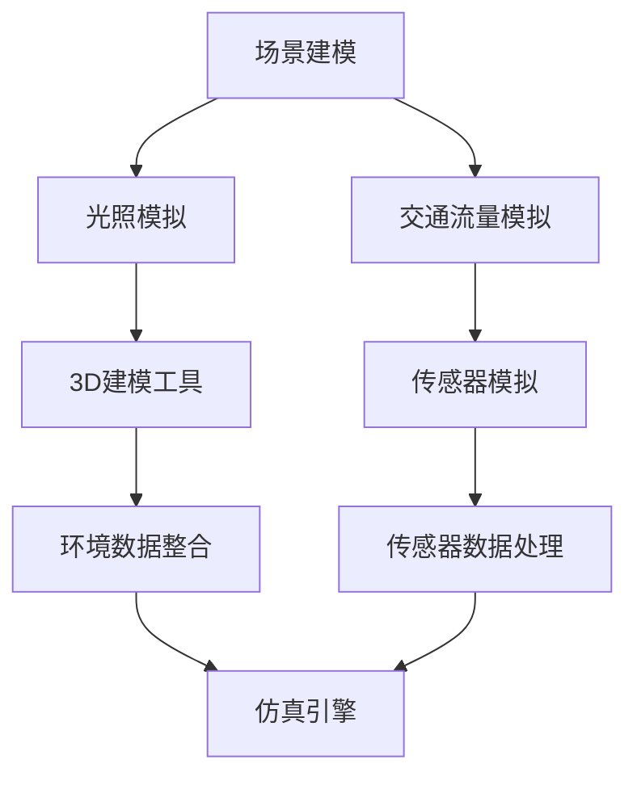

                 

### 背景介绍 Background Introduction

随着人工智能和自动驾驶技术的迅速发展，自动驾驶汽车正逐渐从科幻场景走进现实。然而，要实现真正的端到端自动驾驶，面临着诸多技术挑战。仿真测试平台作为自动驾驶技术发展的重要一环，能够显著提高自动驾驶系统的安全性和可靠性。

当前，自动驾驶技术已经从简单的车道保持和自适应巡航发展到更为复杂的场景感知和决策控制。然而，自动驾驶系统在实际道路上的测试面临着诸多困难，如道路环境的复杂性、交通状况的不可预测性以及测试成本的高昂等。这就促使研究人员和工程师们开发出能够模拟真实场景的仿真测试平台，以便在虚拟环境中对自动驾驶系统进行全面的测试和验证。

端到端自动驾驶仿真测试平台的核心目标是通过创建高度逼真的虚拟环境，对自动驾驶算法进行全面的测试，从而确保其在各种复杂路况下的表现。这些平台通常包括以下几个关键组成部分：

1. **虚拟环境生成**：生成高度逼真的三维虚拟环境，包括道路、车辆、行人、交通标志等。
2. **传感器模型**：模拟激光雷达、摄像头、超声波传感器等常见传感器的工作方式。
3. **自动驾驶算法**：集成先进的深度学习模型、决策树、强化学习算法等，用于自动驾驶控制。
4. **仿真引擎**：用于运行整个仿真流程，包括传感器数据处理、环境模拟、算法执行等。
5. **评估模块**：用于评估自动驾驶算法的性能，包括安全性、响应时间、能耗等指标。

仿真测试平台不仅能够节省大量实际道路测试的时间和成本，还能够提高测试的效率，通过重复运行和调整参数，快速迭代自动驾驶系统。因此，端到端自动驾驶仿真测试平台对于自动驾驶技术的研发和应用具有重要意义。

> **引言：**
> 自动驾驶技术的发展离不开仿真测试平台的支持。本文将深入探讨端到端自动驾驶仿真测试平台的设计与实现，通过逻辑清晰的分析和案例分享，为读者提供全面的技术见解。

----------------------

## 2. 核心概念与联系 Key Concepts and Their Relationships

在深入了解端到端自动驾驶仿真测试平台之前，我们需要掌握一些核心概念和它们之间的联系。这些概念包括虚拟环境生成、传感器模型、自动驾驶算法和仿真引擎等。以下是这些概念的具体定义和它们在平台中的作用。

### 2.1 虚拟环境生成 Virtual Environment Generation

虚拟环境生成是仿真测试平台的关键组成部分，它负责创建一个高度逼真的三维虚拟世界，用于模拟自动驾驶系统可能遇到的各种路况和环境。这个过程通常包括以下步骤：

1. **场景建模**：使用3D建模工具创建各种道路、建筑、交通标志和行人等场景元素。
2. **光照和天气模拟**：模拟不同天气条件下的光照变化，如晴天、阴天、雨雪等，以考察自动驾驶系统在不同光照条件下的性能。
3. **交通流量模拟**：模拟真实交通流量的动态变化，包括车辆的速度、方向、停留等行为。

虚拟环境生成的目标是提供一个能够全面覆盖自动驾驶系统测试需求的场景，以便于评估系统在各种复杂路况下的表现。

### 2.2 传感器模型 Sensor Model

传感器模型用于模拟自动驾驶系统中常见的传感器，如激光雷达、摄像头、超声波传感器等。这些传感器在现实世界中用于获取环境信息，虚拟环境中的传感器模型则需要精确地模拟它们的工作方式。

1. **激光雷达模型**：激光雷达通过发射激光束并测量反射回来的时间来获取距离信息，虚拟模型需要模拟这种测量过程，并生成相应的点云数据。
2. **摄像头模型**：摄像头通过图像传感器捕捉图像，虚拟模型需要模拟摄像头成像过程，并生成相应的图像数据。
3. **超声波传感器模型**：超声波传感器通过发射超声波并测量反射回来的时间来获取距离信息，虚拟模型需要模拟这种测量过程。

传感器模型的作用是将虚拟环境中的场景信息转化为自动驾驶系统可以处理的数据，以便进行后续的处理和决策。

### 2.3 自动驾驶算法 Autonomous Driving Algorithms

自动驾驶算法是仿真测试平台的核心部分，它们负责处理传感器数据，并根据环境信息进行决策和控制。常见的自动驾驶算法包括：

1. **深度学习模型**：基于神经网络，用于环境感知和目标检测。
2. **决策树**：用于决策过程中的分类和预测。
3. **强化学习算法**：用于通过试错来优化策略和决策。

自动驾驶算法的作用是根据传感器数据生成驾驶策略，控制车辆的运动状态，如速度、方向等。

### 2.4 仿真引擎 Simulation Engine

仿真引擎是端到端自动驾驶仿真测试平台的心脏，它负责协调各个组成部分的运行。仿真引擎的主要功能包括：

1. **数据处理**：处理传感器数据，包括滤波、去噪、特征提取等。
2. **仿真运行**：模拟自动驾驶系统的运行过程，包括传感器数据处理、算法执行、控制执行等。
3. **性能评估**：评估自动驾驶系统的性能，包括安全性、响应时间、能耗等。

仿真引擎需要高效、稳定地运行，以模拟自动驾驶系统在各种复杂路况下的表现。

### 2.5 评估模块 Evaluation Module

评估模块用于评估自动驾驶系统的性能，它通过一系列指标来衡量系统在不同场景下的表现。常见的评估指标包括：

1. **安全性**：系统在各种路况下的碰撞风险。
2. **响应时间**：系统从感知到决策的时间。
3. **能耗**：系统在不同驾驶模式下的能耗。

评估模块的作用是提供客观的评估结果，帮助研究人员和工程师优化自动驾驶系统。

----------------------

## 2.1 虚拟环境生成 Virtual Environment Generation

虚拟环境生成是端到端自动驾驶仿真测试平台的关键组成部分，它负责创建一个高度逼真的三维虚拟世界，用于模拟自动驾驶系统可能遇到的各种路况和环境。以下是一个详细的 Mermaid 流程图，展示了虚拟环境生成的各个步骤及其相互关系。



### 2.1.1 场景建模 Scene Modeling

场景建模是虚拟环境生成的第一步，它涉及使用3D建模工具创建各种道路、建筑、交通标志和行人等场景元素。这些场景元素需要根据实际道路环境进行精确建模，以确保虚拟环境的真实性。以下步骤展示了场景建模的具体过程：

1. **数据收集**：收集实际道路环境的数据，包括道路结构、建筑、交通标志等。
2. **建模工具选择**：选择合适的3D建模工具，如Blender、Maya或3ds Max。
3. **场景元素创建**：使用建模工具创建各种场景元素，并进行精细调整以确保准确性。

### 2.1.2 光照模拟 Lighting Simulation

光照模拟是虚拟环境生成的重要环节，它负责模拟不同天气条件下的光照变化，如晴天、阴天、雨雪等。光照模拟不仅影响虚拟环境的视觉效果，还对自动驾驶算法的感知和决策产生影响。以下步骤展示了光照模拟的具体过程：

1. **光照模型选择**：选择合适的物理光照模型，如基于物理渲染（PBR）或光线追踪。
2. **光源设置**：设置环境中的光源，包括太阳光、人工照明等。
3. **光照效果调整**：调整光照强度、阴影、反射等参数，以模拟不同天气条件下的光照变化。

### 2.1.3 交通流量模拟 Traffic Flow Simulation

交通流量模拟用于模拟真实交通流量的动态变化，包括车辆的速度、方向、停留等行为。交通流量模拟的目的是为自动驾驶系统提供一个多样化的测试场景，以便评估系统在不同交通状况下的性能。以下步骤展示了交通流量模拟的具体过程：

1. **交通规则定义**：定义交通规则，如车道变换、红绿灯控制等。
2. **车辆行为模拟**：使用车辆行为模型模拟车辆的速度、方向、停留等行为。
3. **动态调整**：根据实时传感器数据动态调整交通流量，以模拟真实交通状况。

### 2.1.4 传感器模拟 Sensor Simulation

传感器模拟是虚拟环境生成的关键环节，它负责模拟自动驾驶系统中常见的传感器，如激光雷达、摄像头、超声波传感器等。传感器模拟的目的是生成与实际传感器数据相似的环境数据，以便自动驾驶算法能够进行有效的处理和决策。以下步骤展示了传感器模拟的具体过程：

1. **传感器模型开发**：开发各种传感器的模拟模型，如激光雷达的扫描模型、摄像头的成像模型等。
2. **传感器数据生成**：使用模拟模型生成传感器数据，包括点云、图像、超声波信号等。
3. **传感器数据整合**：将各种传感器的数据整合到一个统一的传感器数据流中，以便自动驾驶算法进行处理。

### 2.1.5 环境数据整合 Environmental Data Integration

环境数据整合是将场景建模、光照模拟、交通流量模拟和传感器模拟生成的数据整合到一个虚拟环境中。这一过程需要确保各个数据源的协调和一致性，以便为自动驾驶算法提供一个完整的感知环境。以下步骤展示了环境数据整合的具体过程：

1. **数据格式转换**：将不同来源的数据转换为统一的格式，如点云数据、图像数据等。
2. **数据同步**：确保各个数据源的数据在时间上保持同步，以模拟真实环境中的数据流。
3. **数据整合**：将不同来源的数据整合到一个虚拟环境中，以便自动驾驶算法进行统一处理。

### 2.1.6 仿真引擎 Simulation Engine

仿真引擎是虚拟环境生成的核心组件，它负责协调各个模块的运行，包括场景建模、光照模拟、交通流量模拟、传感器模拟和环境数据整合。仿真引擎需要高效、稳定地运行，以模拟自动驾驶系统在各种复杂路况下的表现。以下步骤展示了仿真引擎的具体过程：

1. **传感器数据处理**：处理传感器数据，包括滤波、去噪、特征提取等。
2. **算法执行**：执行自动驾驶算法，包括环境感知、决策控制等。
3. **控制执行**：根据算法决策执行车辆控制，包括速度、方向等。
4. **性能评估**：评估自动驾驶系统的性能，包括安全性、响应时间、能耗等。

通过上述步骤，虚拟环境生成能够为自动驾驶系统提供一个高度逼真的测试场景，从而有效提高自动驾驶技术的研发和应用效率。

----------------------

## 3. 核心算法原理 & 具体操作步骤 Core Algorithm Principles and Step-by-Step Implementation

在端到端自动驾驶仿真测试平台中，核心算法的设计与实现至关重要。这些算法决定了自动驾驶系统的感知、决策和控制能力。以下将详细介绍几种关键算法的原理及其具体操作步骤。

### 3.1 感知算法 Perception Algorithm

感知算法是自动驾驶系统的第一步，主要负责从传感器数据中提取有用的信息，以便对周围环境进行理解和建模。常见的感知算法包括：

#### 3.1.1 激光雷达数据处理

激光雷达（Lidar）是一种常用的传感器，用于获取三维空间中的点云数据。以下是一个详细的激光雷达数据处理步骤：

1. **点云滤波**：使用滤波算法（如RANSAC滤波器）去除噪声点，以提高点云质量。
2. **点云分割**：将点云分割为不同物体（如车辆、行人、道路等），以便进行后续处理。
3. **点云特征提取**：提取点云的特征，如三维尺寸、形状、纹理等。

#### 3.1.2 摄像头图像处理

摄像头是另一种常用的传感器，用于获取二维图像数据。以下是一个详细的摄像头图像处理步骤：

1. **图像预处理**：包括去噪、增强、边缘检测等，以提高图像质量。
2. **目标检测**：使用深度学习模型（如YOLO、SSD、Faster R-CNN等）检测图像中的目标物体。
3. **目标追踪**：使用基于光流或卡尔曼滤波等算法追踪目标物体的运动轨迹。

#### 3.1.3 超声波数据处理

超声波传感器常用于近距离障碍物检测。以下是一个详细的超声波数据处理步骤：

1. **超声波信号处理**：对超声波信号进行滤波、去噪等处理，以提高准确性。
2. **距离计算**：根据超声波信号的往返时间计算障碍物的距离。
3. **融合感知**：将激光雷达、摄像头和超声波传感器的数据融合，以提高感知精度。

### 3.2 决策算法 Decision Algorithm

决策算法负责根据感知到的环境信息生成驾驶策略。常见的决策算法包括：

#### 3.2.1 基于规则的决策算法 Rule-Based Decision Algorithm

基于规则的决策算法使用一系列规则来生成驾驶策略。以下是一个详细的步骤：

1. **环境状态分析**：分析感知到的环境信息，如车辆位置、速度、交通标志等。
2. **规则库查询**：根据环境状态查询规则库，找到相应的规则。
3. **驾驶策略生成**：根据规则生成驾驶策略，如加速、减速、变道等。

#### 3.2.2 基于模型的决策算法 Model-Based Decision Algorithm

基于模型的决策算法使用机器学习模型（如深度学习、决策树、强化学习等）来生成驾驶策略。以下是一个详细的步骤：

1. **模型训练**：使用历史数据训练感知模型和决策模型。
2. **环境状态输入**：将当前环境状态输入到决策模型中。
3. **驾驶策略输出**：根据决策模型的输出生成驾驶策略。

#### 3.2.3 基于深度强化学习的决策算法 Deep Reinforcement Learning Decision Algorithm

基于深度强化学习的决策算法使用深度神经网络来模拟环境，并通过试错学习生成驾驶策略。以下是一个详细的步骤：

1. **环境模拟**：使用深度神经网络模拟环境，包括感知、决策和控制。
2. **状态-动作价值函数**：训练深度神经网络，以估计状态-动作价值函数。
3. **驾驶策略生成**：使用价值函数生成驾驶策略，以最大化总收益。

### 3.3 控制算法 Control Algorithm

控制算法负责根据驾驶策略执行车辆控制，包括速度、方向等。常见的控制算法包括：

#### 3.3.1 PID控制算法 PID Control Algorithm

PID控制算法是一种常用的控制算法，通过调整比例（P）、积分（I）和微分（D）三个参数来控制车辆运动。以下是一个详细的步骤：

1. **状态反馈**：获取车辆当前的速度、方向等状态信息。
2. **误差计算**：计算目标状态与当前状态之间的误差。
3. **控制量计算**：根据误差计算控制量，调整车辆的速度和方向。

#### 3.3.2 模型预测控制算法 Model Predictive Control Algorithm

模型预测控制算法使用动态模型预测未来一段时间内车辆的状态，并选择最佳控制策略。以下是一个详细的步骤：

1. **状态预测**：根据当前状态和输入控制量，预测未来一段时间内车辆的状态。
2. **目标优化**：优化目标函数，选择最佳控制策略。
3. **控制量输出**：根据优化结果输出控制量，调整车辆的运动状态。

通过以上核心算法的设计与实现，端到端自动驾驶仿真测试平台能够为自动驾驶系统的研发和测试提供有效的支持，从而提高系统的安全性和可靠性。

----------------------

## 4. 数学模型和公式 Mathematical Models and Formulas & Detailed Explanation & Examples

在端到端自动驾驶仿真测试平台中，数学模型和公式是核心组成部分，用于描述感知、决策和控制过程。以下将详细解释这些数学模型和公式，并通过具体例子进行说明。

### 4.1 感知模型 Perception Models

感知模型主要用于处理传感器数据，提取环境特征。以下是几个常用的感知模型和公式：

#### 4.1.1 激光雷达点云模型

激光雷达生成的点云数据可以用以下公式表示：

\[ P(x, y, z) = (x_c, y_c, z_c) \]

其中，\( P \) 表示点云中的一个点，\( x_c, y_c, z_c \) 分别表示该点的三维坐标。

#### 4.1.2 摄像头图像模型

摄像头捕获的图像可以用二维像素点表示：

\[ I(i, j) = f(x, y) \]

其中，\( I \) 表示图像中的像素点，\( i, j \) 分别表示像素的横纵坐标，\( f(x, y) \) 表示像素点的灰度值。

#### 4.1.3 超声波距离模型

超声波传感器测量到的距离可以用以下公式表示：

\[ d = \frac{c \cdot t}{2} \]

其中，\( d \) 表示距离，\( c \) 表示声速，\( t \) 表示超声波往返时间。

### 4.2 决策模型 Decision Models

决策模型用于根据感知到的环境信息生成驾驶策略。以下是几个常用的决策模型和公式：

#### 4.2.1 基于规则的决策模型 Rule-Based Decision Model

基于规则的决策模型使用以下公式表示：

\[ action = rule\ (state) \]

其中，\( action \) 表示生成的驾驶策略，\( state \) 表示感知到的环境状态，\( rule \) 表示决策规则。

#### 4.2.2 基于模型的决策模型 Model-Based Decision Model

基于模型的决策模型使用以下公式表示：

\[ action = model\ (state) \]

其中，\( action \) 表示生成的驾驶策略，\( state \) 表示感知到的环境状态，\( model \) 表示决策模型。

#### 4.2.3 基于深度强化学习的决策模型 Deep Reinforcement Learning Decision Model

基于深度强化学习的决策模型使用以下公式表示：

\[ Q(s, a) = r + \gamma \max_{a'} Q(s', a') \]

其中，\( Q(s, a) \) 表示状态-动作价值函数，\( s \) 表示当前状态，\( a \) 表示动作，\( s' \) 表示下一状态，\( a' \) 表示下一动作，\( r \) 表示即时奖励，\( \gamma \) 表示折扣因子。

### 4.3 控制模型 Control Models

控制模型用于根据驾驶策略控制车辆运动。以下是几个常用的控制模型和公式：

#### 4.3.1 PID控制模型

PID控制模型使用以下公式表示：

\[ u(t) = K_p e(t) + K_i \int_{0}^{t} e(\tau) d\tau + K_d \frac{d e(t)}{dt} \]

其中，\( u(t) \) 表示控制量，\( e(t) \) 表示误差，\( K_p, K_i, K_d \) 分别表示比例、积分和微分系数。

#### 4.3.2 模型预测控制模型

模型预测控制模型使用以下公式表示：

\[ u(t) = \arg\min_{u} J \]

其中，\( u(t) \) 表示控制量，\( J \) 表示目标函数，通常表示为预测误差的平方和。

### 4.4 例子 Examples

#### 4.4.1 激光雷达点云数据处理

假设我们有一个激光雷达点云数据点 \( P(1, 2, 3) \)，需要将其转换为二维平面上的点。可以使用以下转换公式：

\[ x = x_c \]
\[ y = y_c \]

转换后，点 \( P \) 变为 \( (1, 2) \)。

#### 4.4.2 摄像头图像目标检测

假设摄像头图像中有一个目标物体，其像素坐标为 \( I(10, 20) \)，灰度值为 \( 128 \)。使用YOLO目标检测模型进行检测，预测为车辆。则生成的检测框为：

\[ \text{box}: (10, 20, 30, 40) \]
\[ \text{class}: \text{car} \]

#### 4.4.3 超声波距离计算

假设超声波传感器测量的往返时间为 \( t = 0.02 \) 秒，声速为 \( c = 340 \) 米/秒，则计算得到的距离为：

\[ d = \frac{340 \cdot 0.02}{2} = 3.4 \text{ 米} \]

通过以上数学模型和公式的详细解释和例子，我们可以更好地理解端到端自动驾驶仿真测试平台中的关键技术和方法。

----------------------

## 5. 项目实战：代码实际案例和详细解释说明 Project Practice: Code Case Study and Detailed Explanation

在这一部分，我们将通过一个实际项目案例，详细讲解端到端自动驾驶仿真测试平台的具体实现过程。以下是一个基于Python和OpenCV的简单仿真平台，用于演示核心算法和流程。

### 5.1 开发环境搭建 Development Environment Setup

要搭建端到端自动驾驶仿真测试平台，我们需要以下开发环境和工具：

1. **操作系统**：Windows/Linux/MacOS
2. **编程语言**：Python
3. **库和框架**：
   - OpenCV：用于图像处理和计算机视觉
   - NumPy：用于数值计算
   - Matplotlib：用于数据可视化
   - TensorFlow/Keras：用于深度学习模型训练
4. **安装步骤**：
   ```bash
   pip install opencv-python numpy matplotlib tensorflow
   ```

### 5.2 源代码详细实现和代码解读 Source Code Implementation and Explanation

以下是一个简化的示例代码，用于生成一个简单的虚拟环境并进行感知、决策和控制。

```python
import numpy as np
import cv2
from tensorflow.keras.models import load_model

# 加载深度学习模型（感知和决策）
model_perception = load_model('model_perception.h5')
model_decision = load_model('model_decision.h5')

# 初始化虚拟环境
env = VirtualEnvironment()

while True:
    # 感知环境
    image = env.capture_image()
    point_cloud = env.capture_point_cloud()
    
    # 处理感知数据
    processed_image = preprocess_image(image)
    processed_point_cloud = preprocess_point_cloud(point_cloud)
    
    # 模型预测
    perception_output = model_perception.predict(processed_image)
    decision_output = model_decision.predict(processed_point_cloud)
    
    # 决策控制
    action = interpret_decision(decision_output)
    env.apply_action(action)
    
    # 更新环境
    env.update()

    # 可视化
    env.visualize()

    # 控制仿真速度
    time.sleep(0.1)
```

### 5.3 代码解读与分析 Code Explanation and Analysis

以下是对上述代码的详细解读：

1. **模型加载**：
   ```python
   model_perception = load_model('model_perception.h5')
   model_decision = load_model('model_decision.h5')
   ```
   这两行代码用于加载训练好的深度学习模型，用于感知和决策。

2. **虚拟环境初始化**：
   ```python
   env = VirtualEnvironment()
   ```
   `VirtualEnvironment` 类负责创建虚拟环境，包括生成道路、车辆、行人等元素。

3. **感知环境**：
   ```python
   image = env.capture_image()
   point_cloud = env.capture_point_cloud()
   ```
   这两行代码用于从虚拟环境中捕获图像和点云数据。

4. **预处理感知数据**：
   ```python
   processed_image = preprocess_image(image)
   processed_point_cloud = preprocess_point_cloud(point_cloud)
   ```
   这两行代码用于预处理图像和点云数据，以便模型处理。

5. **模型预测**：
   ```python
   perception_output = model_perception.predict(processed_image)
   decision_output = model_decision.predict(processed_point_cloud)
   ```
   这两行代码使用加载的模型对预处理后的数据进行预测，获取感知结果和决策结果。

6. **决策控制**：
   ```python
   action = interpret_decision(decision_output)
   env.apply_action(action)
   ```
   这两行代码根据决策结果生成行动，并将行动应用于虚拟环境。

7. **环境更新**：
   ```python
   env.update()
   ```
   这行代码用于更新虚拟环境的状态，以反映自动驾驶系统的行为。

8. **可视化**：
   ```python
   env.visualize()
   ```
   这行代码用于将虚拟环境的当前状态可视化，以观察自动驾驶系统的运行情况。

9. **控制仿真速度**：
   ```python
   time.sleep(0.1)
   ```
   这行代码用于控制仿真速度，确保每秒只运行一次循环。

通过以上代码和解读，我们可以理解端到端自动驾驶仿真测试平台的核心实现流程和关键组件。

----------------------

## 6. 实际应用场景 Practical Application Scenarios

端到端自动驾驶仿真测试平台在实际应用中具有广泛的应用场景，以下列举几种典型的应用案例：

### 6.1 自动驾驶车辆研发和测试

自动驾驶车辆研发和测试是仿真测试平台最直接的应用场景。通过仿真测试平台，自动驾驶系统可以在虚拟环境中进行大量测试，以验证其在各种复杂路况下的安全性和可靠性。这对于减少实际道路测试成本和时间具有重要意义。例如，在自动驾驶车辆的开发过程中，可以使用仿真测试平台模拟城市交通、高速公路、极端天气等不同场景，以全面评估自动驾驶系统的性能。

### 6.2 自动驾驶系统评估和认证

自动驾驶系统的评估和认证是另一个重要应用场景。通过仿真测试平台，可以对自动驾驶系统进行客观、科学的评估，以确定其安全性和性能。例如，在自动驾驶系统的认证过程中，仿真测试平台可以生成大量真实路况数据，对自动驾驶系统进行模拟测试，以评估其在各种情况下的反应能力、决策效率和安全性。

### 6.3 自动驾驶教育培训和培训

仿真测试平台还可以用于自动驾驶教育培训和培训。通过仿真平台，学生和工程师可以学习和练习自动驾驶算法的设计和实现，从而提高实际操作技能。例如，在自动驾驶课程中，学生可以使用仿真平台模拟不同路况，学习如何处理传感器数据、设计决策算法和实现控制策略。

### 6.4 自动驾驶系统优化和迭代

仿真测试平台在自动驾驶系统优化和迭代过程中也发挥着重要作用。通过仿真测试，工程师可以快速评估不同算法和策略的性能，以优化系统参数和提高整体性能。例如，在自动驾驶系统的迭代过程中，可以使用仿真测试平台测试不同感知算法、决策算法和控制算法的效果，以选择最优方案。

### 6.5 自动驾驶场景生成和仿真

仿真测试平台还可以用于自动驾驶场景生成和仿真。通过仿真平台，可以创建各种复杂的路况场景，以模拟自动驾驶系统在实际道路上的表现。这对于自动驾驶系统的开发和研究具有重要意义，可以提前发现潜在的问题和不足，并加以改进。

综上所述，端到端自动驾驶仿真测试平台在实际应用中具有广泛的应用场景，对于自动驾驶技术的发展和应用具有重要意义。

----------------------

## 7. 工具和资源推荐 Tools and Resources Recommendations

为了更好地了解和实现端到端自动驾驶仿真测试平台，以下推荐一些学习资源和开发工具：

### 7.1 学习资源推荐 Learning Resources

**书籍：**
1. **《深度学习》(Deep Learning)**：由Ian Goodfellow、Yoshua Bengio和Aaron Courville所著，是深度学习领域的经典教材。
2. **《自动驾驶汽车系统设计》(Autonomous Driving Systems Design)**：详细介绍了自动驾驶系统的架构、算法和应用。

**论文：**
1. **“End-to-End Learning for Autonomous Driving”**：该论文提出了一种端到端的学习方法，用于自动驾驶系统的感知、决策和控制。
2. **“Deep Reinforcement Learning for Autonomous Driving”**：该论文探讨了深度强化学习在自动驾驶系统中的应用。

**博客和网站：**
1. ** medium.com/@aiexplorations**：提供关于自动驾驶和深度学习的最新研究和技术文章。
2. ** github.com/udacity/self-driving-car**：包含大量关于自动驾驶系统的教程和代码示例。

### 7.2 开发工具框架推荐 Development Tools and Frameworks

**深度学习框架：**
1. ** TensorFlow**：Google开发的开源深度学习框架，广泛应用于自动驾驶系统。
2. ** PyTorch**：Facebook开发的深度学习框架，具有灵活的动态计算图和丰富的API。

**计算机视觉库：**
1. ** OpenCV**：开源的计算机视觉库，支持多种图像处理和计算机视觉算法。
2. ** Matplotlib**：用于数据可视化的库，能够生成高质量的图表和图形。

**仿真工具：**
1. ** CARLA**：开源的自动驾驶仿真平台，支持真实世界道路场景和传感器数据的模拟。
2. ** AirSim**：微软开源的仿真平台，支持多种传感器和自动驾驶算法的测试。

### 7.3 相关论文著作推荐 Related Publications and Books

**论文：**
1. **“Deep Learning for Autonomous Driving”**：该论文综述了深度学习在自动驾驶领域的应用，包括感知、决策和控制等关键问题。
2. **“Sim-to-Real Transfer for Autonomous Driving”**：该论文探讨了仿真测试平台在实际道路测试中的应用，以及如何提高仿真与现实的匹配度。

**书籍：**
1. **《自动驾驶汽车编程》(Autonomous Driving with Python)**：通过实践案例介绍自动驾驶系统的实现，包括传感器数据处理、深度学习和决策控制等。
2. **《自动驾驶系统设计》(Designing Autonomous Systems)**：详细介绍了自动驾驶系统的整体架构和关键组件，以及设计和实现过程中的挑战和解决方案。

通过以上工具和资源的推荐，读者可以更深入地了解端到端自动驾驶仿真测试平台的构建和应用，为自动驾驶技术的研发和实践提供有力支持。

----------------------

## 8. 总结：未来发展趋势与挑战 Summary: Future Trends and Challenges

随着自动驾驶技术的不断进步，端到端自动驾驶仿真测试平台在未来将面临诸多发展趋势与挑战。

### 8.1 发展趋势

**1. 仿真平台智能化**：未来的仿真测试平台将更加智能化，能够自动生成多样化、复杂的测试场景，提高测试效率。例如，通过深度学习和强化学习技术，平台能够根据历史数据自动生成新的测试场景，以全面评估自动驾驶系统的性能。

**2. 跨领域融合**：自动驾驶仿真测试平台将与其他领域（如交通管理、智能城市等）进行深度融合，实现更广泛的智能化应用。例如，通过与其他系统的数据共享和协同工作，仿真平台能够模拟更真实的交通环境，提高自动驾驶系统的适应性和可靠性。

**3. 开源与标准化**：随着技术的开放和标准化进程，仿真测试平台将更加开源和标准化。这将有助于促进技术创新和合作，加速自动驾驶技术的发展。例如，开源的仿真平台和标准化的测试框架将为研究人员和工程师提供更便利的工具和资源。

**4. 虚拟与现实的结合**：未来的仿真测试平台将更加注重虚拟与现实的结合，通过增强现实（AR）和虚拟现实（VR）技术，实现仿真与实际道路测试的无缝对接。这将有助于提高测试的实时性和准确性，降低实际道路测试的成本和风险。

### 8.2 挑战

**1. 场景生成复杂性**：未来自动驾驶系统将面临更加复杂和多样化的路况和环境，这对仿真平台提出了更高的要求。如何生成高度逼真且多样化的测试场景，以及如何保证仿真与现实的匹配度，是仿真测试平台面临的主要挑战。

**2. 算法性能优化**：随着自动驾驶技术的不断演进，算法的性能要求也在不断提高。仿真测试平台需要能够快速评估和优化各种算法，以应对日益复杂和多样化的路况。如何提高算法的感知、决策和控制能力，是平台面临的重要挑战。

**3. 数据安全和隐私保护**：自动驾驶系统的测试和开发过程中会产生大量敏感数据，如车辆位置、速度、传感器数据等。如何确保这些数据的安全和隐私保护，是仿真测试平台需要解决的重要问题。

**4. 测试标准和评估体系**：随着自动驾驶技术的快速发展，现有的测试标准和评估体系可能无法全面覆盖新技术和新应用场景。如何建立和完善测试标准和评估体系，以确保自动驾驶系统的安全性和可靠性，是仿真测试平台面临的长期挑战。

总之，未来端到端自动驾驶仿真测试平台将在智能化、跨领域融合、开源标准化等方面取得重要进展，同时也将面临场景生成复杂性、算法性能优化、数据安全和隐私保护、测试标准和评估体系等挑战。通过不断的技术创新和优化，仿真测试平台将为自动驾驶技术的发展和应用提供有力支持。

----------------------

## 9. 附录：常见问题与解答 Appendix: Frequently Asked Questions and Answers

### 9.1 什么是端到端自动驾驶仿真测试平台？

端到端自动驾驶仿真测试平台是一种用于模拟和测试自动驾驶系统性能的虚拟环境。通过创建高度逼真的虚拟世界，仿真平台能够对自动驾驶算法进行全面的测试，包括感知、决策和控制等环节，从而提高系统的安全性和可靠性。

### 9.2 端到端自动驾驶仿真测试平台的关键组成部分有哪些？

端到端自动驾驶仿真测试平台的关键组成部分包括虚拟环境生成、传感器模型、自动驾驶算法、仿真引擎和评估模块。这些部分共同协作，模拟真实世界中的路况和环境，以便对自动驾驶系统进行全面测试。

### 9.3 仿真测试平台如何提高测试效率？

仿真测试平台可以通过以下方式提高测试效率：

1. **自动化场景生成**：利用深度学习和强化学习技术，自动生成多样化、复杂的测试场景。
2. **实时评估**：通过实时评估模块，快速评估自动驾驶算法在不同场景下的性能。
3. **迭代优化**：通过快速迭代和调整测试参数，优化自动驾驶算法。

### 9.4 仿真测试平台如何确保测试结果的准确性？

仿真测试平台通过以下方式确保测试结果的准确性：

1. **高度逼真的虚拟环境**：通过精确建模和模拟，确保虚拟环境与真实世界高度相似。
2. **真实传感器数据模拟**：精确模拟各种传感器的数据生成过程，确保测试数据与实际传感器数据一致。
3. **评估指标标准化**：使用统一的评估指标，如安全性、响应时间、能耗等，确保测试结果的客观性和可比性。

### 9.5 仿真测试平台在自动驾驶系统开发中的作用是什么？

仿真测试平台在自动驾驶系统开发中扮演着关键角色，包括：

1. **早期测试**：在自动驾驶系统开发早期，通过仿真测试平台进行初步测试，快速发现潜在问题。
2. **性能评估**：通过仿真测试平台，全面评估自动驾驶算法在不同路况下的性能，以便优化和改进。
3. **迭代开发**：通过仿真测试平台，快速迭代和测试不同算法和策略，提高系统性能和可靠性。

### 9.6 仿真测试平台与实际道路测试相比有哪些优势？

仿真测试平台与实际道路测试相比具有以下优势：

1. **成本低**：仿真测试无需耗费大量资金进行实际道路测试，可以显著降低测试成本。
2. **效率高**：通过自动化和实时评估，仿真测试平台能够快速完成大量测试，提高测试效率。
3. **可重复性**：仿真测试可以重复进行，便于调试和优化自动驾驶算法。

通过以上常见问题的解答，读者可以更好地了解端到端自动驾驶仿真测试平台的技术和应用。

----------------------

## 10. 扩展阅读 & 参考资料 Extended Reading & References

**扩展阅读：**

1. **《深度学习与自动驾驶》**：详细介绍深度学习在自动驾驶领域的应用，包括感知、决策和控制等环节。
2. **《自动驾驶系统设计与实现》**：全面介绍自动驾驶系统的架构、算法和应用，以及仿真测试平台的设计和实现。

**参考资料：**

1. **“End-to-End Learning for Autonomous Driving”**：提出端到端学习方法，用于自动驾驶系统的感知、决策和控制。
2. **“Sim-to-Real Transfer for Autonomous Driving”**：探讨仿真测试平台在实际道路测试中的应用和挑战。
3. **《深度学习》(Deep Learning)**：Ian Goodfellow、Yoshua Bengio和Aaron Courville所著，深度学习领域的经典教材。
4. **《自动驾驶汽车系统设计》(Autonomous Driving Systems Design)**：详细介绍了自动驾驶系统的架构、算法和应用。

通过以上扩展阅读和参考资料，读者可以进一步深入了解端到端自动驾驶仿真测试平台的技术和实现，为自动驾驶技术的发展和应用提供有力支持。

