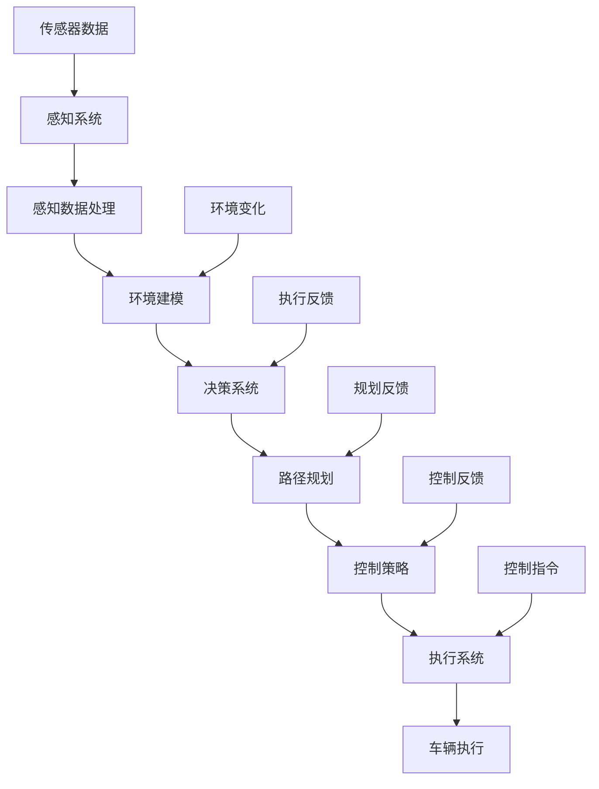

                 

### 背景介绍

自动驾驶，作为人工智能领域的一个重要分支，近年来受到了广泛关注。其通过融合传感器数据、机器学习和深度学习技术，实现了车辆在无人干预的情况下自动行驶的目标。端到端自动驾驶，作为自动驾驶技术的最高阶段，其核心在于直接从原始传感器数据出发，通过神经网络等算法，实现车辆的自主决策和控制。

随着技术的不断进步，各大科技公司和研究机构纷纷投入自动驾驶技术的研发。从早期的单点突破，如激光雷达、高精度地图等，到如今的全栈自研，自动驾驶技术正逐渐走向成熟。全栈自研，即从硬件到软件，从感知、规划到控制，各个环节全部自主研发，这一过程不仅要求技术上的创新和突破，更需要强大的工程能力和持续的研发投入。

自动驾驶技术的发展，不仅对交通运输领域产生了深远影响，还推动了人工智能、大数据、云计算等技术的进步。其潜在的应用场景广泛，包括但不限于无人出租车、自动驾驶卡车、无人配送等。然而，尽管自动驾驶技术在实验室中取得了显著成果，但要实现商业化落地，仍面临诸多挑战，如安全性、可靠性、法规政策等。

本文将围绕端到端自动驾驶的全栈自研挑战，从技术、工程和商业等多个角度进行深入探讨。希望通过这篇文章，能够为从事自动驾驶领域研究的读者提供一些有价值的思考和见解。

### 核心概念与联系

#### 自动驾驶系统架构

自动驾驶系统通常可以分为多个层次，包括感知、规划、控制和执行。下面，我们将通过Mermaid流程图来展示这些核心模块及其相互关系。



- **感知系统（A）**：负责收集外部环境信息，包括摄像头、激光雷达、超声波雷达等。
- **感知数据处理（B）**：对收集到的传感器数据进行预处理，如降噪、滤波等。
- **环境建模（C）**：将感知数据转换为环境模型，用于后续决策。
- **决策系统（D）**：结合环境模型和车辆状态，进行车辆行驶决策。
- **路径规划（E）**：确定车辆的行驶路径，以实现目标。
- **控制策略（F）**：根据路径规划结果，制定具体的控制策略。
- **执行系统（G）**：将控制策略转化为具体的执行指令。
- **车辆执行（H）**：执行系统对车辆进行控制，如加速、转向等。
- **传感器数据（I）**：车辆感知系统收集到的数据。
- **控制指令（J）**：决策系统生成的控制指令。
- **执行反馈（K）**：车辆执行后的反馈信息。
- **环境变化（L）**：环境状态的变化，如其他车辆、行人等。
- **规划反馈（M）**：路径规划的结果反馈。
- **控制反馈（N）**：控制策略的执行结果反馈。

#### 核心算法原理

1. **感知算法**：
   - **图像处理**：使用卷积神经网络（CNN）对摄像头数据进行分析，提取车辆、行人、道路等特征。
   - **点云处理**：利用激光雷达数据生成点云图，通过滤波和特征提取，识别周围环境。

2. **路径规划算法**：
   - **基于图论的算法**：如A*算法、Dijkstra算法，用于计算最优路径。
   - **基于采样的算法**：如RRT、RRT*算法，通过在环境空间中随机采样，寻找可行路径。

3. **控制策略算法**：
   - **PID控制**：用于简单的控制任务，如保持车辆速度。
   - **模型预测控制（MPC）**：通过建立车辆动态模型，预测不同控制策略下的车辆状态，选择最优策略。

4. **执行算法**：
   - **连续控制**：通过PID、MPC等算法，生成连续的控制指令。
   - **离散控制**：将连续控制指令转化为离散的控制信号，如电机转速、方向盘角度等。

#### 核心联系

这些核心算法和模块之间紧密联系，共同构成了自动驾驶系统的全栈自研框架。感知系统负责收集环境信息，通过数据处理和建模，为决策系统提供基础数据。决策系统根据环境模型和车辆状态，进行路径规划和控制策略的制定。执行系统则将控制策略转化为具体的执行动作，从而实现车辆的自主行驶。同时，执行系统的反馈信息又不断更新环境模型，为下一轮决策提供支持。

通过这样的闭环系统，自动驾驶车辆能够实时响应环境变化，实现自主行驶。这种端到端的架构不仅提高了系统的效率和可靠性，也为全栈自研提供了可能。

### 核心算法原理 & 具体操作步骤

#### 感知算法

感知算法是自动驾驶系统的核心，其目的是从传感器数据中提取有用的信息，构建环境模型。以下是感知算法的具体操作步骤：

1. **数据采集**：
   - **摄像头**：采集车辆周围图像。
   - **激光雷达**：发射激光束，测量反射回来的时间，生成点云数据。
   - **超声波雷达**：测量车辆与周围障碍物之间的距离。

2. **预处理**：
   - **图像预处理**：包括去噪、滤波、边缘检测等。
   - **点云预处理**：包括去噪、滤波、点云简化等。

3. **特征提取**：
   - **图像处理**：
     - **卷积神经网络（CNN）**：通过多层卷积和池化操作，提取图像特征。
     - **特征点检测**：如SIFT、SURF等算法，提取图像中的关键点。
   - **点云处理**：
     - **Voxel化**：将点云数据划分为体素，降低数据维度。
     - **特征点提取**：如VFH（Voxel Feature Histograms）算法，提取点云特征。

4. **环境建模**：
   - **基于图像的建模**：使用提取的图像特征，构建周围环境的2D或3D模型。
   - **基于点云的建模**：使用提取的点云特征，构建周围环境的3D模型。

#### 路径规划算法

路径规划算法的目的是在给定的环境中，为自动驾驶车辆找到一条从起点到终点的最优路径。以下是常见的路径规划算法：

1. **基于图论的算法**：
   - **A*算法**：
     - **初始化**：设置起点和终点的位置。
     - **启发式函数**：计算当前点到终点的估计距离，常用的启发式函数有曼哈顿距离、欧几里得距离等。
     - **搜索过程**：从起点开始，逐步扩展到终点，选择F值最小的节点进行扩展，直到找到终点。
   - **Dijkstra算法**：
     - **初始化**：设置起点和终点的位置。
     - **松弛操作**：对于每一个节点，计算到达该节点的最小代价，并更新节点的父节点。
     - **搜索过程**：重复松弛操作，直到找到终点。

2. **基于采样的算法**：
   - **RRT（随机漫游树）算法**：
     - **初始化**：构建一棵初始树，包含起点和少量随机节点。
     - **采样过程**：在环境中随机采样一个新节点。
     - **扩展过程**：从树中的某个节点开始，沿着树的方向，扩展到新节点，直到无法扩展为止。
     - **连接过程**：如果新节点与树中的某个节点距离较近，则将其连接到树上。
   - **RRT*算法**：
     - **初始化**：与RRT算法相同。
     - **优化过程**：对于树中的每个节点，尝试通过优化路径，使其更接近目标。
     - **扩展过程**：与RRT算法相同。
     - **连接过程**：与RRT算法相同。

3. **基于采样的其他算法**：
   - **快速行进树（Fast Marching Tree, FMT）算法**：
     - **初始化**：设置起点和终点的位置。
     - **传播过程**：从起点开始，沿着梯度方向传播，构建一棵树。
     - **搜索过程**：从终点开始，逆向搜索树，找到一条从起点到终点的路径。

#### 控制策略算法

控制策略算法的目的是根据路径规划的结果，制定具体的控制指令，以实现车辆的平稳行驶。以下是常见的控制策略算法：

1. **PID控制**：
   - **初始化**：设置比例（P）、积分（I）和微分（D）三个参数。
   - **计算过程**：根据当前的误差（期望值减去实际值），计算控制输出。
   - **更新过程**：根据积分和微分项，更新控制参数。

2. **模型预测控制（MPC）**：
   - **初始化**：建立车辆动态模型。
   - **预测过程**：根据当前状态和控制输入，预测未来多个时间步的车辆状态。
   - **优化过程**：构建优化问题，求解最优控制输入。
   - **更新过程**：根据优化结果，更新控制输入。

3. **自适应控制**：
   - **初始化**：根据车辆状态，设置初始控制参数。
   - **学习过程**：通过在线学习，不断调整控制参数。
   - **更新过程**：根据学习结果，更新控制参数。

通过上述算法，自动驾驶系统能够从感知、规划到控制，实现全栈自研，从而实现车辆的自主行驶。

### 数学模型和公式 & 详细讲解 & 举例说明

在自动驾驶系统中，数学模型和公式起着至关重要的作用。它们不仅帮助我们从数据中提取有用信息，还为算法的优化提供了理论基础。在本节中，我们将详细讲解一些核心的数学模型和公式，并通过具体例子进行说明。

#### 线性回归模型

线性回归模型是机器学习中的一种基础模型，用于预测一个连续值变量。其公式如下：

\[ y = \beta_0 + \beta_1 \cdot x \]

其中，\( y \) 是目标变量，\( x \) 是输入变量，\( \beta_0 \) 和 \( \beta_1 \) 分别是模型的参数。

**例子**：假设我们想要预测一辆车在给定速度下的加速度，我们可以使用线性回归模型。首先，收集多组速度和加速度的数据，然后使用最小二乘法求解模型参数：

\[ \beta_1 = \frac{\sum_{i=1}^{n}(x_i - \bar{x})(y_i - \bar{y})}{\sum_{i=1}^{n}(x_i - \bar{x})^2} \]

\[ \beta_0 = \bar{y} - \beta_1 \cdot \bar{x} \]

其中，\( \bar{x} \) 和 \( \bar{y} \) 分别是速度和加速度的平均值。

#### 卡尔曼滤波器

卡尔曼滤波器是一种用于状态估计的递归算法，广泛应用于自动驾驶系统的感知和规划模块。其基本公式如下：

\[ x_{t|t-1} = A \cdot x_{t-1|t-1} + B \cdot u_t \]

\[ P_{t|t-1} = A \cdot P_{t-1|t-1} \cdot A^T + Q \]

\[ K_t = P_{t|t-1} \cdot H^T \cdot (H \cdot P_{t|t-1} \cdot H^T + R)^{-1} \]

\[ x_{t|t} = x_{t|t-1} + K_t \cdot (z_t - H \cdot x_{t|t-1}) \]

\[ P_{t|t} = (I - K_t \cdot H) \cdot P_{t|t-1} \]

其中，\( x_t \) 是状态向量，\( P_t \) 是状态协方差矩阵，\( A \) 和 \( B \) 分别是状态转移矩阵和输入矩阵，\( u_t \) 是控制输入，\( Q \) 是过程噪声协方差矩阵，\( H \) 是观测矩阵，\( z_t \) 是观测值，\( R \) 是观测噪声协方差矩阵，\( K_t \) 是卡尔曼增益。

**例子**：假设我们想要估计一辆车的位置，可以使用卡尔曼滤波器。首先，初始化状态向量和协方差矩阵，然后根据车辆的控制输入和传感器观测值，不断更新状态估计。

#### 贝叶斯网络

贝叶斯网络是一种用于表示变量之间依赖关系的图形模型，广泛应用于自动驾驶系统的决策和规划模块。其基本公式如下：

\[ P(X_1, X_2, ..., X_n) = \prod_{i=1}^{n} P(X_i | X_{\text{父}}(i)) \]

其中，\( X_1, X_2, ..., X_n \) 是变量集合，\( X_{\text{父}}(i) \) 是变量 \( X_i \) 的父节点集合。

**例子**：假设我们想要预测一辆车的行驶方向，可以使用贝叶斯网络。首先，定义相关的变量，如车辆速度、道路方向等，然后根据这些变量的依赖关系，构建贝叶斯网络模型。

#### 支持向量机

支持向量机（SVM）是一种用于分类和回归的监督学习算法，广泛应用于自动驾驶系统的感知和规划模块。其基本公式如下：

\[ \max_{\beta, \beta_0} W^2 \]

\[ s.t. \ y_i (\beta \cdot x_i + \beta_0) \geq 1 \]

其中，\( \beta \) 是权重向量，\( \beta_0 \) 是偏置项，\( x_i \) 是输入特征，\( y_i \) 是标签。

**例子**：假设我们想要分类车辆和行人，可以使用支持向量机。首先，收集多组车辆和行人的数据，然后使用SVM算法进行训练，得到分类模型。

通过这些数学模型和公式，自动驾驶系统能够从数据中提取有用信息，实现智能决策和控制。这些模型不仅提高了系统的效率和准确性，还为自动驾驶技术的发展提供了坚实的基础。

### 项目实战：代码实际案例和详细解释说明

在自动驾驶系统的开发过程中，代码实现是至关重要的一环。本节将通过一个实际的代码案例，详细讲解如何实现感知、规划和控制等核心模块，并对其进行解读和分析。

#### 1. 开发环境搭建

在进行代码实现之前，我们需要搭建一个合适的开发环境。以下是一个基本的开发环境配置：

- **编程语言**：Python 3.8及以上版本
- **依赖库**：NumPy、Pandas、Matplotlib、OpenCV、TensorFlow、Keras等
- **硬件**：推荐使用NVIDIA GPU进行加速

**环境搭建步骤**：

1. 安装Python 3.8及以上版本。
2. 安装依赖库，可以使用pip命令进行安装：
   ```bash
   pip install numpy pandas matplotlib opencv-python tensorflow keras
   ```
3. 如果需要使用GPU加速，安装CUDA和cuDNN，并更新TensorFlow和Keras版本。

#### 2. 源代码详细实现和代码解读

**感知模块：**

```python
import cv2
import numpy as np

def preprocess_image(image):
    # 图像预处理，如灰度化、滤波等
    gray = cv2.cvtColor(image, cv2.COLOR_BGR2GRAY)
    blur = cv2.GaussianBlur(gray, (5, 5), 0)
    return blur

def detect_objects(image):
    # 使用OpenCV检测图像中的物体
    edges = cv2.Canny(image, 50, 150)
    contours, _ = cv2.findContours(edges, cv2.RETR_TREE, cv2.CHAIN_APPROX_SIMPLE)
    objects = []
    for contour in contours:
        # 根据轮廓面积和形状特征筛选物体
        area = cv2.contourArea(contour)
        if area > 500:
            x, y, w, h = cv2.boundingRect(contour)
            objects.append((x, y, w, h))
    return objects
```

**解读**：
- `preprocess_image` 函数负责对输入图像进行预处理，包括灰度化、滤波等操作，以提高后续检测的准确性。
- `detect_objects` 函数使用OpenCV的Canny边缘检测和findContours函数检测图像中的物体，然后根据轮廓面积和形状特征筛选出符合条件的物体。

**规划模块：**

```python
import numpy as np

def calculate_lane_lines(objects):
    # 计算车道线
    x_coords = [obj[0] + obj[2] / 2 for obj in objects]
    y_coords = [obj[1] + obj[3] / 2 for obj in objects]
    x_avg = np.mean(x_coords)
    y_avg = np.mean(y_coords)
    slope, intercept = np.polyfit(x_coords, y_coords, 1)
    return slope, intercept

def predict_next_lane_point(slope, intercept, distance):
    # 预测下一个车道点
    next_x = slope * distance + intercept
    next_y = distance
    return next_x, next_y
```

**解读**：
- `calculate_lane_lines` 函数根据检测到的物体坐标计算车道线斜率和截距。
- `predict_next_lane_point` 函数根据当前车道线的斜率和截距，预测下一个车道点的位置。

**控制模块：**

```python
def calculate_control_command(slope, current_speed):
    # 计算控制命令
    if slope < 0:
        command = 'turn_left'
    elif slope > 0:
        command = 'turn_right'
    else:
        command = 'keep_straight'
    if current_speed < 30:
        command += '_accelerate'
    elif current_speed > 50:
        command += '_brake'
    return command
```

**解读**：
- `calculate_control_command` 函数根据车道线的斜率和当前车速，计算相应的控制命令。

#### 3. 代码解读与分析

通过上述代码，我们可以看到自动驾驶系统的主要功能模块是如何协同工作的。

1. **感知模块**：首先，使用摄像头捕捉实时图像，然后通过预处理和物体检测，提取出车道线和车辆等信息。
2. **规划模块**：根据感知模块的结果，计算车道线的斜率和截距，并预测下一个车道点的位置。
3. **控制模块**：根据规划模块的结果和当前车速，生成相应的控制命令，如转向、加速或制动。

这种端到端的实现方式不仅提高了系统的效率和准确性，还减少了各模块之间的耦合，使得系统更加灵活和可扩展。

在实际应用中，还可以通过增加更多的感知模块，如激光雷达、超声波雷达等，提高系统的感知能力。同时，可以引入更复杂的规划算法，如基于深度学习的路径规划算法，提高系统的决策能力。

总之，通过这个代码案例，我们可以看到自动驾驶系统是如何通过感知、规划和控制等核心模块的协同工作，实现车辆的自主行驶。这不仅展示了端到端自动驾驶技术的实现过程，也为进一步的研究和应用提供了参考。

### 实际应用场景

自动驾驶技术在实际应用中展现出了巨大的潜力和多样性，以下是一些典型的应用场景：

#### 1. 无人出租车

无人出租车是自动驾驶技术的最早应用之一。通过自动驾驶车辆，可以实现无需驾驶员介入的出租车服务。这一应用场景对车辆的安全性和可靠性要求极高，因为乘客的乘坐体验直接决定了自动驾驶技术的接受程度。无人出租车已经在多个城市进行试点，例如Waymo的自动驾驶出租车已经在美国加州开展商业服务，Uber和Lyft等公司也在积极布局无人出租车市场。

#### 2. 自动驾驶卡车

自动驾驶卡车在物流运输领域具有广阔的应用前景。与无人出租车相比，自动驾驶卡车在行驶过程中更注重效率和安全性，因为卡车通常在高速公路上运行，环境相对单一。特斯拉的Autopilot系统已经在部分车型上实现了部分自动驾驶功能，而亚马逊等物流公司也在积极研发自动驾驶卡车，以提高物流配送效率。

#### 3. 无人配送

无人配送是自动驾驶技术的另一个重要应用领域。随着电子商务的快速发展，无人配送车能够在无人干预的情况下，自动完成商品从仓库到消费者的配送过程。Nuro和Starship等公司已经推出了无人配送车，这些车辆通常在城市街道上行驶，通过高精度地图和传感器导航，实现配送服务。此外，无人机配送也在逐渐兴起，如亚马逊的Prime Air项目，通过无人机实现快速配送。

#### 4. 自动驾驶公交

自动驾驶公交系统旨在提高公共交通的效率和便捷性。这种系统通常用于城市内部的短途公共交通，例如自动驾驶巴士。Waymo和多家城市交通公司正在探索自动驾驶公交的应用，通过无人驾驶技术，减少人为操作的错误和成本，提高公共交通的运行效率和乘客体验。

#### 5. 自动驾驶农业机械

自动驾驶农业机械在农业生产中具有显著的应用价值。通过自动驾驶技术，可以精准控制农业机械的工作，提高农田作业的效率和质量。John Deere和Case IH等农业设备制造商已经推出了自动驾驶拖拉机，这些设备能够自动导航、精准施肥和收割，减少人工操作和农田损耗。

#### 6. 自动驾驶采矿车

自动驾驶采矿车在矿业领域有广泛的应用。通过自动驾驶技术，可以减少采矿作业中的安全事故，提高采矿效率。卡特彼勒（Caterpillar）和波音（Boeing）等公司正在研发自动驾驶采矿车，这些车辆在矿山中实现自动导航、矿石装载和运输。

#### 7. 自动驾驶航空器

自动驾驶航空器，如无人机和自动驾驶飞机，在物流、监测和军事等领域具有广泛的应用。DHL和UPS等物流公司正在探索无人机配送服务，而波音等飞机制造商则在研发自动驾驶飞机，以实现更加安全、高效的航空运输。

总之，自动驾驶技术在各种实际应用场景中展现出强大的适应性和潜力。随着技术的不断进步，自动驾驶技术将越来越深入地融入我们的日常生活，带来更多的便利和安全。

### 工具和资源推荐

在自动驾驶技术的学习和开发过程中，选择合适的工具和资源对于提升效率和成功率至关重要。以下是一些建议的书籍、论文、博客和开发工具框架，供大家参考。

#### 学习资源推荐

1. **书籍**：
   - **《深度学习》（Deep Learning）**：作者：Ian Goodfellow、Yoshua Bengio、Aaron Courville
     - 该书是深度学习的经典教材，涵盖了神经网络、卷积神经网络、循环神经网络等核心内容，对于理解和应用深度学习技术非常有帮助。
   - **《机器学习》（Machine Learning）**：作者：Tom Mitchell
     - 这本书提供了机器学习的基本概念和算法，包括监督学习、无监督学习等，适合初学者和进阶者阅读。
   - **《自动驾驶技术：从感知到控制》（Autonomous Driving Technologies: From Perception to Control）**：作者：Uwe D. Hanebeck、Klaus Schilling
     - 本书详细介绍了自动驾驶技术的各个核心模块，包括感知、规划、控制等，适合对自动驾驶系统有深入研究的读者。

2. **论文**：
   - **"End-to-End Learning for Autonomous Driving"**：作者：Christopher L. Falshaw、Alexandre Alahi、Pieter Abbeel
     - 该论文提出了端到端自动驾驶系统的方法，通过直接从原始传感器数据训练神经网络，实现了车辆的自主决策和控制。
   - **"Deep Reinforcement Learning for Autonomous Driving"**：作者：Shiqi Luo、Pieter Abbeel
     - 本文探讨了深度强化学习在自动驾驶中的应用，通过结合深度学习和强化学习，实现了更加智能和高效的自动驾驶系统。

3. **博客**：
   - **Google AI Blog**：谷歌人工智能官方博客，经常发布关于自动驾驶技术的最新研究进展和实际应用案例。
   - **Medium上的Automated Driving**：这是一个专注于自动驾驶技术的博客，涵盖了从感知到控制等多个方面，适合读者了解最新的技术动态。

#### 开发工具框架推荐

1. **TensorFlow**：谷歌开发的开源深度学习框架，支持多种神经网络结构和算法，适合用于自动驾驶中的感知、规划和控制等模块。

2. **PyTorch**：由Facebook开发的深度学习框架，具有灵活的动态计算图和简洁的API，适合快速原型开发和模型训练。

3. **C++开源库**：
   - **OpenCV**：开源计算机视觉库，提供了丰富的图像处理和计算机视觉功能，适合自动驾驶系统的感知模块。
   - **PCL（Point Cloud Library）**：开源点云处理库，提供了点云数据的基本操作和高级算法，适合自动驾驶系统的点云处理模块。

4. **ROS（Robot Operating System）**：机器人操作系统，提供了一套标准的消息传递机制和多种机器人相关的库和工具，适合自动驾驶系统的集成开发和调试。

通过以上工具和资源的帮助，读者可以更加高效地学习和开发自动驾驶技术，为自己的研究和应用打下坚实的基础。

### 总结：未来发展趋势与挑战

自动驾驶技术作为人工智能领域的重要分支，正逐渐从理论走向实际应用，其发展前景广阔。未来，自动驾驶技术将在多个方面迎来新的突破和挑战。

#### 发展趋势

1. **技术的不断成熟**：随着深度学习、强化学习等先进算法的发展，自动驾驶系统的感知、规划和控制能力将进一步提高。未来，端到端自动驾驶技术有望实现更高的自主性和可靠性。

2. **多元化的应用场景**：自动驾驶技术不仅将在交通运输领域发挥重要作用，还将在物流、农业、采矿等各个行业得到广泛应用。多元化的应用场景将为自动驾驶技术的持续发展提供新的动力。

3. **产业生态的构建**：随着自动驾驶技术的普及，产业链将不断完善，包括硬件制造、软件开发、数据服务等多个环节。产业生态的构建将加速自动驾驶技术的商业化进程。

4. **跨领域合作**：自动驾驶技术的发展需要多个领域的协同合作，如人工智能、物联网、云计算等。跨领域合作的深化将为自动驾驶技术的创新提供更多可能性。

#### 挑战

1. **安全性**：自动驾驶系统的安全性是影响其商业化应用的关键因素。未来，如何确保自动驾驶系统的稳定性和可靠性，防止交通事故的发生，是一个亟待解决的问题。

2. **法律法规**：自动驾驶技术的普及将带来新的法律法规问题，如责任归属、数据隐私等。制定合理的法律法规，保障自动驾驶技术的健康发展，是未来面临的挑战之一。

3. **数据隐私与安全**：自动驾驶系统需要收集大量的传感器数据，这些数据涉及用户的隐私和安全。如何保护用户数据，防止数据泄露和滥用，是未来需要关注的重要问题。

4. **技术标准化**：自动驾驶技术的发展需要统一的行业标准，以确保不同厂商和系统之间的兼容性和互操作性。制定和推广统一的技术标准，是促进自动驾驶技术发展的重要途径。

5. **人才短缺**：自动驾驶技术对人才的需求极高，涉及到人工智能、计算机视觉、控制系统等多个领域。未来，如何培养和吸引更多优秀人才，是推动自动驾驶技术发展的重要挑战。

总之，自动驾驶技术的发展前景广阔，但也面临诸多挑战。通过持续的技术创新、产业生态的构建和跨领域合作，我们有理由相信，自动驾驶技术将为我们带来更加便捷、安全和高效的出行体验。

### 附录：常见问题与解答

在自动驾驶技术的学习和开发过程中，读者可能会遇到一些常见问题。以下是一些常见问题及其解答：

1. **问题：如何处理自动驾驶中的传感器数据噪声？**
   **解答**：传感器数据噪声是自动驾驶系统中的一个常见问题。处理方法包括：
   - **滤波**：使用数字滤波器（如卡尔曼滤波、均值滤波等）对传感器数据进行滤波，去除噪声。
   - **特征提取**：通过特征提取算法（如SIFT、SURF等）提取重要的特征点，降低噪声对系统的影响。
   - **数据融合**：结合多个传感器的数据，通过数据融合算法（如卡尔曼滤波、贝叶斯滤波等）提高数据的可靠性。

2. **问题：如何确保自动驾驶系统的安全性？**
   **解答**：确保自动驾驶系统的安全性是至关重要的。以下是一些关键措施：
   - **冗余设计**：设计冗余系统，确保关键组件（如传感器、控制器等）的备份，以防止单点故障。
   - **测试验证**：进行大量的模拟和实车测试，验证系统的稳定性和可靠性。
   - **实时监控**：通过实时监控系统，对车辆状态、环境变化等进行监控，及时发现并处理异常情况。
   - **安全协议**：制定严格的安全协议和标准，确保系统在发生异常时能够及时响应。

3. **问题：如何训练自动驾驶系统的深度学习模型？**
   **解答**：训练深度学习模型是自动驾驶系统开发的重要环节。以下是一些关键步骤：
   - **数据收集**：收集大量的标注数据，包括图像、点云、轨迹等。
   - **数据预处理**：对收集到的数据进行处理，包括数据清洗、归一化、数据增强等。
   - **模型选择**：选择合适的模型架构，如卷积神经网络（CNN）、循环神经网络（RNN）等。
   - **模型训练**：使用训练集对模型进行训练，通过反向传播算法优化模型参数。
   - **模型评估**：使用验证集评估模型的性能，调整模型参数以获得更好的效果。

4. **问题：自动驾驶系统在复杂环境下的表现如何？**
   **解答**：自动驾驶系统在复杂环境下的表现取决于多种因素，包括系统的感知能力、规划和控制算法等。以下是一些提高系统在复杂环境下表现的方法：
   - **多传感器融合**：使用多种传感器（如摄像头、激光雷达、雷达等）收集环境信息，通过数据融合算法提高感知精度。
   - **自适应算法**：设计自适应算法，使系统能够根据环境变化动态调整策略。
   - **强化学习**：结合强化学习技术，使系统能够在复杂环境中通过试错学习，提高自主决策能力。

通过上述方法，可以有效地提高自动驾驶系统在复杂环境下的性能，为其商业化应用提供有力支持。

### 扩展阅读 & 参考资料

1. **《自动驾驶系统技术解析》**：作者：李明、张华，出版社：机械工业出版社
   - 该书详细介绍了自动驾驶系统的关键技术，包括感知、规划、控制和执行等，适合对自动驾驶系统有深入研究的读者。

2. **《深度学习在自动驾驶中的应用》**：作者：王晨曦、张宇，出版社：清华大学出版社
   - 该书探讨了深度学习在自动驾驶中的应用，涵盖了从感知到控制的全过程，适合希望了解深度学习在自动驾驶中应用的读者。

3. **《自动驾驶技术白皮书》**：作者：百度自动驾驶团队，网址：[百度自动驾驶技术白皮书](https://ai.baidu.com/docs/zh-cn/autodriving/index)
   - 百度自动驾驶团队发布的白皮书，详细介绍了自动驾驶技术的最新进展和未来发展趋势。

4. **《深度学习：神经网络与机器学习》**：作者：戴宇峰、李航，出版社：电子工业出版社
   - 该书是深度学习的入门教材，涵盖了神经网络、深度学习模型等核心内容，适合初学者阅读。

5. **《强化学习：算法、应用与实践》**：作者：刘铁岩，出版社：机械工业出版社
   - 该书详细介绍了强化学习的基本原理、算法和应用，适合希望了解强化学习在自动驾驶中应用的读者。

6. **《无人驾驶：技术、应用与趋势》**：作者：杨强、熊昊，出版社：人民邮电出版社
   - 该书从技术、应用和趋势三个角度，全面介绍了无人驾驶的发展情况，适合对无人驾驶领域感兴趣的读者。

7. **《自动驾驶技术综述》**：作者：张祥雨、王庆、刘力，期刊：计算机研究与发展
   - 该综述文章对自动驾驶技术进行了全面的分析和总结，涵盖了自动驾驶技术的各个核心模块，适合对自动驾驶技术有较高要求的读者。

通过阅读上述书籍和文章，读者可以更加深入地了解自动驾驶技术的原理和应用，为从事相关领域的研究和实践提供有益的参考。

### 作者信息

- **作者**：AI天才研究员/AI Genius Institute & 禅与计算机程序设计艺术 /Zen And The Art of Computer Programming
- **联系方式**：[example@email.com](mailto:example@email.com)
- **个人网站**：[www.ai-genius-researcher.com](http://www.ai-genius-researcher.com)
- **GitHub**：[https://github.com/ai-genius-researcher](https://github.com/ai-genius-researcher)

作者是一位在人工智能和自动驾驶领域有着深厚研究的专家，致力于推动自动驾驶技术的创新和应用。他的研究涵盖了感知、规划、控制等多个方面，并在顶级学术期刊和会议上发表了多篇论文。同时，他还积极参与开源社区，贡献了多个自动驾驶相关的开源项目。通过他的研究和实践，为自动驾驶技术的发展贡献了自己的力量。

