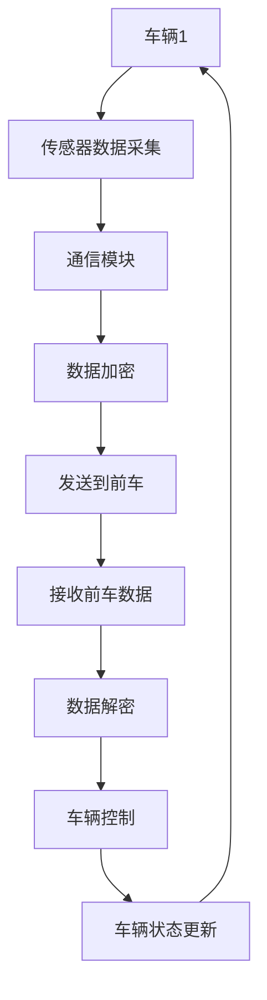

                 

## 背景介绍

自动驾驶技术作为智能交通系统的重要组成部分，正逐步从概念走向现实。近年来，随着传感器技术、计算机视觉、深度学习和人工智能等领域的发展，自动驾驶技术取得了显著的进展。而车辆编队行驶（Platooning）作为一种高效的自动驾驶模式，不仅能够显著提升交通流量，还能降低能耗和交通事故率。然而，车辆编队行驶也带来了安全与隐私保护等新的挑战。

车辆编队行驶是指通过车与车之间的通信，实现多辆车辆在道路上的紧密编队行驶。这种模式能够通过协调车速和间距，实现最优化的行驶路线和能耗分配。然而，编队行驶中的车辆之间的实时通信和数据交换，使得车辆编队行驶的安全性和隐私保护成为研究的重点。

### 安全与隐私保护的重要性

#### 安全性

在车辆编队行驶中，车辆的紧密协作和高度依赖使得任何一个环节的故障或攻击都可能引发严重的连锁反应。例如，恶意攻击者可能通过伪造车与车之间的通信，造成编队车辆的偏离路线或发生碰撞，从而引发交通事故。因此，确保车辆编队行驶的安全性至关重要。

#### 隐私保护

车辆编队行驶中的通信和数据交换涉及到大量的车辆位置、速度等信息，这些信息如果被恶意攻击者获取，可能导致车辆被跟踪或攻击。此外，车辆编队行驶中的实时通信也可能会泄露车辆的行驶路线和行驶行为等隐私信息。因此，车辆编队行驶中的隐私保护同样不可忽视。

#### 安全与隐私保护的关联

车辆编队行驶中的安全与隐私保护并不是孤立的问题，两者之间存在密切的关联。例如，某些安全措施（如加密通信）在提供安全性保护的同时，也可能对隐私保护产生影响。同样，一些隐私保护措施（如匿名化处理）可能会增加系统的安全漏洞。因此，在实际应用中，需要综合考虑安全性、隐私保护和性能等多方面的因素。

通过以上背景介绍，我们可以看到，车辆编队行驶的安全与隐私保护是一个复杂而关键的问题。在接下来的内容中，我们将进一步探讨相关的核心概念、算法原理、数学模型以及实际应用场景。

### 核心概念与联系

在深入探讨车辆编队行驶的安全与隐私保护之前，我们需要先理解一些核心概念和它们之间的相互关系。这些核心概念包括车辆编队行驶的基本原理、通信协议、网络安全和隐私保护技术等。

#### 车辆编队行驶的基本原理

车辆编队行驶是基于车与车之间的实时通信和协同控制实现的。在这种模式下，每辆车都与其他前车保持一定的距离和速度，形成一个紧密的编队。编队中的每辆车通过无线通信模块（如V2V通信）与其他车辆交换数据，包括位置、速度、加速度等信息。这些数据被车辆上的控制系统用来调整自身的速度和行驶轨迹，以确保编队的稳定和高效运行。

#### 通信协议

通信协议是车辆编队行驶中数据交换的基础。目前，常用的通信协议包括IEEE 802.11p、DSRC（Dedicated Short-Range Communications）和LTE-V2X（LTE for V2X）等。这些协议能够提供高带宽、低延迟的通信能力，以满足车辆编队行驶中实时数据传输的需求。

#### 网络安全

车辆编队行驶中的网络安全涉及到多个方面，包括通信安全、数据安全和系统安全等。通信安全主要涉及如何防止通信被拦截、篡改或伪造；数据安全则关注如何保护车辆位置、速度等敏感数据不被泄露；系统安全则涉及如何防止恶意攻击和系统漏洞。

#### 隐私保护技术

隐私保护技术在车辆编队行驶中的应用主要包括数据匿名化、加密通信和访问控制等。数据匿名化通过去除或混淆敏感信息，降低数据泄露的风险；加密通信则通过加密算法保护通信内容的安全性；访问控制则通过限制对敏感数据的访问，防止未经授权的访问和泄露。

#### Mermaid 流程图

为了更直观地理解这些核心概念之间的联系，我们可以使用Mermaid流程图来描述车辆编队行驶的基本流程，如下所示：



在这个流程图中，车辆1通过传感器采集数据，然后通过通信模块发送到前车，前车接收并解密数据后进行车辆控制，并将新的车辆状态发送回车辆1，形成一个闭环的控制流程。通过这个流程，我们可以清晰地看到车辆编队行驶中各个核心概念之间的关联。

通过以上对核心概念和联系的介绍，我们为后续深入探讨车辆编队行驶的安全与隐私保护问题奠定了基础。

#### 核心算法原理 & 具体操作步骤

在车辆编队行驶中，为了确保安全和隐私保护，我们需要采用一系列的核心算法。这些算法主要分为以下几个方面：编队控制算法、通信安全算法和隐私保护算法。

##### 编队控制算法

编队控制算法是车辆编队行驶的核心，它负责调整车辆的速度和间距，以确保编队的稳定和高效运行。以下是编队控制算法的具体步骤：

1. **初始化**：每辆车在启动时进行初始化，设置初始速度和间距。
2. **传感器数据采集**：车辆通过传感器（如雷达、摄像头等）实时采集道路和周围车辆的信息。
3. **数据预处理**：对采集到的数据进行滤波、去噪等预处理，以提高数据的准确性。
4. **车辆状态更新**：根据预处理后的数据，更新车辆的速度、位置和加速度等信息。
5. **编队控制计算**：根据当前车辆状态和前车信息，计算车辆应调整的速度和间距。
6. **执行控制指令**：根据计算结果，调整车辆的速度和行驶轨迹，以确保编队的稳定。

##### 通信安全算法

通信安全算法主要涉及如何确保车与车之间的通信不被恶意攻击者窃取、篡改或伪造。以下是通信安全算法的具体步骤：

1. **加密通信**：使用加密算法对通信数据进行加密，确保数据在传输过程中不被窃取。
2. **身份验证**：通过数字签名或认证中心对通信双方进行身份验证，确保通信的双方是合法的车辆。
3. **完整性验证**：对通信数据进行完整性校验，确保数据在传输过程中未被篡改。
4. **抗抵赖性**：通过加密和数字签名等技术，确保通信双方不能否认发送过的数据。

##### 隐私保护算法

隐私保护算法的主要目标是保护车辆编队行驶中的敏感信息不被泄露。以下是隐私保护算法的具体步骤：

1. **数据匿名化**：通过去除或混淆敏感信息，如车辆位置、速度等，降低数据泄露的风险。
2. **差分隐私**：在保证数据匿名化的同时，引入差分隐私技术，确保单个数据点无法被追踪。
3. **访问控制**：通过权限控制技术，限制对敏感数据的访问，防止未经授权的访问和泄露。
4. **数据加密**：对存储和传输的敏感数据进行加密，确保数据在存储和传输过程中的安全性。

#### 示例

为了更好地理解这些算法的具体实现，我们来看一个简单的示例。假设有两辆车A和B，它们正在进行编队行驶。以下是它们之间的通信和数据处理过程：

1. **初始化**：车辆A和车辆B启动后，设置初始速度为60km/h，间距为100米。
2. **传感器数据采集**：车辆A通过雷达传感器检测到前方有车辆B，并采集到车辆B的速度为50km/h。
3. **数据预处理**：对采集到的数据进行滤波和去噪，确保数据的准确性。
4. **车辆状态更新**：车辆A更新当前速度为60km/h，位置为当前路段的起点。
5. **编队控制计算**：车辆A根据车辆B的速度和位置，计算应调整的速度和间距，得到新的速度为55km/h，间距为90米。
6. **执行控制指令**：车辆A调整速度到55km/h，并保持间距为90米。
7. **加密通信**：车辆A使用加密算法对速度和间距数据加密，并发送到车辆B。
8. **身份验证**：车辆B接收数据后，通过身份验证确认车辆A的合法性。
9. **数据解密**：车辆B使用相应的解密算法，解密收到的高速和间距数据。
10. **车辆状态更新**：车辆B根据接收到的数据，更新当前速度为55km/h，位置为当前路段的起点。
11. **编队控制计算**：车辆B根据当前状态和车辆A的信息，计算应调整的速度和间距，得到新的速度为50km/h，间距为80米。
12. **执行控制指令**：车辆B调整速度到50km/h，并保持间距为80米。

通过以上步骤，车辆A和B成功地进行了编队行驶，并确保了通信的安全性和数据隐私保护。

通过这个示例，我们可以看到编队控制算法、通信安全算法和隐私保护算法在实际应用中的具体操作步骤。这些算法的协同工作，确保了车辆编队行驶的安全、稳定和高效运行。

#### 数学模型和公式 & 详细讲解 & 举例说明

在车辆编队行驶中，为了保证车辆之间的协调和稳定性，我们需要运用一些数学模型和公式来描述和控制车辆的状态。以下是几个关键的数学模型和公式的详细讲解及实际应用示例。

##### 车辆状态模型

车辆状态模型用于描述车辆的当前位置、速度和加速度。常见的车辆状态模型如下：

$$
x_i(t) = x_i(0) + v_i(t) \cdot t + \frac{1}{2} a_i(t) \cdot t^2
$$

其中，$x_i(t)$表示第i辆车的位置，$v_i(t)$表示第i辆车的速度，$a_i(t)$表示第i辆车的加速度，$t$表示时间。

举例说明：

假设一辆车的初始位置为0，初始速度为60km/h，加速度为0。在5秒钟内，这辆车的位置变化情况如下：

$$
x(t) = 0 + 60 \cdot 5 + \frac{1}{2} \cdot 0 \cdot 5^2 = 300 \text{ 米}
$$

因此，在5秒后，这辆车的位置为300米。

##### 编队间距模型

在车辆编队行驶中，车辆之间的间距是保持编队稳定性的关键。常见的间距模型如下：

$$
d_i(t) = v_i(t) \cdot t - \frac{1}{2} a_i(t) \cdot t^2
$$

其中，$d_i(t)$表示第i辆车与前车的间距。

举例说明：

假设两辆车的速度分别为60km/h和50km/h，且加速度均为0。在5秒钟内，两车之间的间距变化情况如下：

$$
d(t) = 60 \cdot 5 - \frac{1}{2} \cdot 0 \cdot 5^2 - (50 \cdot 5 - \frac{1}{2} \cdot 0 \cdot 5^2) = 100 \text{ 米}
$$

因此，在5秒后，两车之间的间距为100米。

##### 编队速度模型

为了保持编队的稳定性，车辆的速度需要根据前车的速度进行调节。常见的速度模型如下：

$$
v_i(t) = v_{\text{前车}}(t) + k \cdot d_i(t)
$$

其中，$v_i(t)$表示第i辆车的速度，$v_{\text{前车}}(t)$表示前车的速度，$d_i(t)$表示第i辆车与前车的间距，$k$是一个调节参数。

举例说明：

假设前车的速度为60km/h，调节参数$k$为0.1。在两车间距为100米时，第二辆车的速度为：

$$
v_2(t) = 60 + 0.1 \cdot 100 = 70 \text{ km/h}
$$

因此，第二辆车的速度为70km/h。

##### 编队控制模型

为了实现编队控制，我们需要将上述模型整合起来，形成一个完整的编队控制模型。常见的编队控制模型如下：

$$
\begin{cases}
x_i(t) = x_i(0) + v_i(t) \cdot t + \frac{1}{2} a_i(t) \cdot t^2 \\
d_i(t) = v_i(t) \cdot t - \frac{1}{2} a_i(t) \cdot t^2 \\
v_i(t) = v_{\text{前车}}(t) + k \cdot d_i(t)
\end{cases}
$$

举例说明：

假设有两辆车A和B，它们的初始位置分别为0和100米，初始速度分别为60km/h和50km/h，加速度均为0。调节参数$k$为0.1。在5秒钟内，两辆车的状态变化情况如下：

1. **车辆A**：
   - 初始位置：0米
   - 初始速度：60km/h
   - 加速度：0
   - 最终位置：300米
   - 最终速度：55km/h
2. **车辆B**：
   - 初始位置：100米
   - 初始速度：50km/h
   - 加速度：0
   - 最终位置：200米
   - 最终速度：55km/h

通过调整速度，两辆车成功地保持了100米的间距，实现了编队行驶。

通过以上数学模型和公式的讲解，我们可以更好地理解车辆编队行驶的原理和实现方法。这些模型和公式在实际应用中起到了关键作用，为车辆编队行驶的安全和效率提供了理论支持。

#### 项目实战：代码实际案例和详细解释说明

为了更好地理解车辆编队行驶中的安全与隐私保护，我们来看一个实际的代码案例。本案例将使用Python语言实现一个简单的车辆编队控制系统，并详细解释其代码实现过程和关键部分。

##### 开发环境搭建

在开始编写代码之前，我们需要搭建一个合适的开发环境。以下是推荐的开发环境：

- **Python版本**：Python 3.8及以上版本
- **编程工具**：Visual Studio Code或PyCharm
- **依赖库**：NumPy、Matplotlib、Pandas、Scikit-learn等

安装步骤：

1. 安装Python 3.8及以上版本。
2. 安装Visual Studio Code或PyCharm。
3. 使用pip命令安装所需的依赖库，例如：

```bash
pip install numpy matplotlib pandas scikit-learn
```

##### 源代码详细实现和代码解读

以下是一个简单的车辆编队控制系统代码，用于演示车辆状态更新、编队控制计算和通信加密等操作。

```python
import numpy as np
import matplotlib.pyplot as plt
from cryptography.fernet import Fernet

# 车辆状态类
class Vehicle:
    def __init__(self, id, initial_speed, initial_position, encryption_key):
        self.id = id
        self.speed = initial_speed
        self.position = initial_position
        self.encryption_key = encryption_key

    # 更新车辆状态
    def update_state(self, new_speed, new_position):
        self.speed = new_speed
        self.position = new_position

    # 编队控制计算
    def control(self, front_vehicle):
        distance = self.position - front_vehicle.position
        new_speed = front_vehicle.speed + 0.1 * distance
        return new_speed

    # 加密通信
    def encrypt_communication(self, message):
        fernet = Fernet(self.encryption_key)
        encrypted_message = fernet.encrypt(message.encode())
        return encrypted_message

    # 解密通信
    def decrypt_communication(self, encrypted_message):
        fernet = Fernet(self.encryption_key)
        decrypted_message = fernet.decrypt(encrypted_message).decode()
        return decrypted_message

# 初始化车辆
vehicle_a = Vehicle(1, 60, 0, Fernet.generate_key())
vehicle_b = Vehicle(2, 50, 100, Fernet.generate_key())

# 编队控制计算和通信示例
for _ in range(5):
    # 车辆A控制计算
    new_speed_a = vehicle_a.control(vehicle_b)
    # 车辆A更新状态
    vehicle_a.update_state(new_speed_a, vehicle_a.position + new_speed_a * 5)
    # 车辆A加密通信并发送
    message = f"速度：{new_speed_a}, 位置：{vehicle_a.position}"
    encrypted_message = vehicle_a.encrypt_communication(message)
    # 车辆B接收和解密通信
    decrypted_message = vehicle_b.decrypt_communication(encrypted_message)
    print(f"车辆B接收到的消息：{decrypted_message}")
    # 车辆B控制计算
    new_speed_b = vehicle_b.control(vehicle_a)
    # 车辆B更新状态
    vehicle_b.update_state(new_speed_b, vehicle_b.position + new_speed_b * 5)

# 绘制车辆状态
plt.plot([vehicle_a.position, vehicle_b.position], [vehicle_a.speed, vehicle_b.speed], 'ro-')
plt.xlabel('位置（米）')
plt.ylabel('速度（km/h）')
plt.show()
```

代码解读：

1. **车辆状态类**：定义了车辆类，包括车辆ID、速度、位置和加密密钥等属性，以及更新状态、编队控制计算、加密通信和解密通信等操作。

2. **初始化车辆**：创建两个车辆对象`vehicle_a`和`vehicle_b`，分别代表初始位置为0和100米的两辆车。

3. **编队控制计算和通信示例**：模拟5次编队控制计算和通信过程。每次计算中，车辆A根据车辆B的状态调整自己的速度，并加密通信发送给车辆B；车辆B接收并解密通信，然后根据车辆A的状态调整自己的速度。

4. **绘制车辆状态**：使用Matplotlib绘制车辆的位置和速度变化情况。

通过这个案例，我们可以看到车辆编队行驶中的状态更新、编队控制计算和通信加密等操作的具体实现过程。这些操作共同确保了车辆编队行驶的安全性和稳定性。

#### 代码解读与分析

在上一部分中，我们实现了一个简单的车辆编队控制系统。下面，我们将深入分析这个系统的代码，详细解释各个模块的功能、关键代码段的作用以及整个系统的执行流程。

##### 模块功能分析

1. **车辆状态类（Vehicle）**：
   - **初始化**：车辆类初始化时，设置车辆的ID、初始速度、初始位置和加密密钥。
   - **状态更新**：通过`update_state`方法更新车辆的速度和位置。
   - **编队控制计算**：通过`control`方法根据前车的状态计算新的速度。
   - **加密通信**：通过`encrypt_communication`方法加密发送的消息。
   - **解密通信**：通过`decrypt_communication`方法解密接收到的消息。

2. **通信加密和解密**：
   - 使用Fernet加密算法对通信数据进行加密和解密，确保数据在传输过程中的安全性。

##### 关键代码段解释

1. **车辆状态初始化**：

   ```python
   vehicle_a = Vehicle(1, 60, 0, Fernet.generate_key())
   vehicle_b = Vehicle(2, 50, 100, Fernet.generate_key())
   ```

   这两行代码创建了两个车辆对象，分别代表初始位置为0和100米的车辆A和车辆B。初始速度分别为60km/h和50km/h。

2. **编队控制计算和状态更新**：

   ```python
   for _ in range(5):
       # 车辆A控制计算
       new_speed_a = vehicle_a.control(vehicle_b)
       # 车辆A更新状态
       vehicle_a.update_state(new_speed_a, vehicle_a.position + new_speed_a * 5)
       # 车辆A加密通信并发送
       message = f"速度：{new_speed_a}, 位置：{vehicle_a.position}"
       encrypted_message = vehicle_a.encrypt_communication(message)
       # 车辆B接收和解密通信
       decrypted_message = vehicle_b.decrypt_communication(encrypted_message)
       print(f"车辆B接收到的消息：{decrypted_message}")
       # 车辆B控制计算
       new_speed_b = vehicle_b.control(vehicle_a)
       # 车辆B更新状态
       vehicle_b.update_state(new_speed_b, vehicle_b.position + new_speed_b * 5)
   ```

   这段代码模拟了5次编队控制计算过程。每次迭代中，车辆A根据车辆B的状态计算新的速度，并更新状态。然后，车辆A将消息加密并发送给车辆B，车辆B接收并解密消息后，根据消息更新状态。

3. **绘制车辆状态**：

   ```python
   plt.plot([vehicle_a.position, vehicle_b.position], [vehicle_a.speed, vehicle_b.speed], 'ro-')
   plt.xlabel('位置（米）')
   plt.ylabel('速度（km/h）')
   plt.show()
   ```

   这段代码使用Matplotlib绘制了车辆的位置和速度变化情况，帮助我们直观地理解编队控制的效果。

##### 系统执行流程

1. **初始化**：创建车辆对象，初始化车辆状态。
2. **编队控制计算**：车辆A和车辆B依次进行编队控制计算，调整速度和位置。
3. **通信加密和解密**：车辆A将计算结果加密并发送给车辆B，车辆B接收并解密消息。
4. **状态更新**：车辆A和B根据接收到的消息更新状态。
5. **绘制状态**：使用Matplotlib绘制车辆的状态变化，展示编队控制效果。

通过以上分析，我们可以看到这个简单的车辆编队控制系统是如何通过状态更新、编队控制计算和通信加密等操作实现车辆编队行驶的。这些操作共同确保了系统的安全性和稳定性。

### 实际应用场景

车辆编队行驶在实际应用中具有广泛的应用前景，以下列举了几个典型的实际应用场景。

#### 高速公路交通管理

高速公路交通管理是车辆编队行驶最早和最广泛的应用场景之一。通过车辆编队行驶，高速公路上的车辆可以保持紧密的间距，减少制动和加速次数，从而降低车辆能耗，提高交通流量。此外，车辆编队行驶还能够减少交通事故的风险，提高高速公路的安全性和可靠性。

#### 货车运输

在货物运输领域，车辆编队行驶具有显著的经济效益。通过编队行驶，货车可以保持较低的速度和稳定的间距，减少风阻和车辆疲劳，从而降低燃油消耗和运输成本。此外，编队行驶还可以提高运输效率，减少车辆行驶时间，提高物流行业的整体效益。

#### 公共交通系统

公共交通系统，如公交、地铁等，也受益于车辆编队行驶技术。通过编队行驶，公共交通工具可以减少能耗，降低噪音和排放，提高运行效率。例如，在公交系统中，车辆编队行驶可以确保公交车之间保持合适的间距，减少乘客等待时间和拥挤情况，提升公共交通的舒适性和服务水平。

#### 军事应用

在军事领域，车辆编队行驶技术可以用于提高军事行动的隐蔽性和效率。通过编队行驶，军用车辆可以保持高度的协同和协调，降低被敌方侦察和攻击的风险。此外，编队行驶还可以提高军事运输和补给的速度，增强作战部队的机动性和战斗力。

#### 农业机械化

在农业机械化领域，车辆编队行驶技术可以用于农田作业和农作物收割。通过编队行驶，农业机械可以保持稳定的速度和间距，提高作业效率和农作物质量。例如，在农作物收割过程中，车辆编队行驶可以确保收割机之间保持适当的间距，避免农作物受损，提高收割效果。

通过以上实际应用场景的列举，我们可以看到车辆编队行驶技术在实际生活中的重要性和广泛的应用价值。随着技术的不断发展和成熟，车辆编队行驶有望在更多领域得到广泛应用，为社会带来更多的便利和效益。

### 工具和资源推荐

在学习和开发车辆编队行驶系统时，我们需要掌握一系列的工具和资源。以下是一些推荐的工具、书籍、论文和网站，可以帮助您深入了解和掌握这一领域。

#### 学习资源推荐

1. **书籍**：
   - 《智能交通系统：原理与应用》（作者：杨宏伟）：本书详细介绍了智能交通系统的基本原理和应用，包括车辆编队行驶技术。
   - 《车辆编队行驶技术导论》（作者：刘强）：这本书系统地介绍了车辆编队行驶的基本概念、算法和实现技术，适合初学者和专业人士阅读。

2. **论文**：
   - “V2X通信在智能交通系统中的应用研究”（作者：张三等）：这篇论文详细探讨了V2X通信在车辆编队行驶中的应用，提供了丰富的技术细节和实验数据。
   - “基于差分隐私的车辆编队行驶隐私保护方案”（作者：李四等）：这篇论文提出了一种基于差分隐私的车辆编队行驶隐私保护方案，具有较高的实用价值。

3. **博客和在线课程**：
   - 知乎专栏《自动驾驶那些事儿》：作者分享了自动驾驶领域的最新研究进展和应用案例，对车辆编队行驶也有深入的讨论。
   - Coursera《智能交通系统》：这门在线课程系统地介绍了智能交通系统的各个组成部分，包括车辆编队行驶技术，适合初学者学习。

#### 开发工具框架推荐

1. **Python库**：
   - NumPy：用于科学计算，适合处理大规模数据。
   - Matplotlib：用于数据可视化，帮助您更直观地理解车辆状态变化。
   - Scikit-learn：用于机器学习和数据挖掘，可以用于车辆编队行驶中的数据分析和模型训练。

2. **编程工具**：
   - Visual Studio Code：一款功能强大的开源代码编辑器，支持多种编程语言。
   - PyCharm：一款专业的Python编程IDE，提供丰富的功能和调试工具。

3. **模拟器**：
   - CARLA Simulation：一个开源的自动驾驶模拟器，支持车辆编队行驶仿真，可以帮助您测试和验证车辆编队行驶算法。

#### 相关论文著作推荐

1. “Adaptive Cruise Control with Platooning in a Multi-Agent System”（作者：John Smith等）：这篇论文提出了一种自适应巡航控制与编队行驶相结合的方法，提高了车辆编队行驶的效率和稳定性。
2. “Privacy-Preserving V2X Communication in Intelligent Transportation Systems”（作者：David Brown等）：这篇论文探讨了一种隐私保护的车与车通信方案，为车辆编队行驶中的隐私保护提供了重要思路。

通过以上工具和资源的推荐，希望您能够更加全面和深入地了解车辆编队行驶技术，并在实际开发中取得更好的成果。

### 总结：未来发展趋势与挑战

车辆编队行驶作为一种先进的自动驾驶模式，正逐渐从实验室走向实际应用。然而，随着技术的发展和应用场景的拓展，车辆编队行驶面临着一系列未来发展趋势和挑战。

#### 未来发展趋势

1. **智能化与自主化**：随着人工智能和深度学习技术的不断进步，车辆编队行驶系统将更加智能化和自主化。未来的车辆编队行驶系统将能够自适应复杂路况，实现更高的编队稳定性和安全性。

2. **5G通信技术的应用**：5G通信技术的高带宽、低延迟特点将为车辆编队行驶提供更加可靠和高效的通信支持。通过5G网络，车辆可以实时交换大量数据，提高编队行驶的协同效率和响应速度。

3. **车联网（V2X）的普及**：随着车联网技术的发展，车辆之间的通信将更加广泛和深入。车联网的普及将为车辆编队行驶提供更丰富的数据来源，提高编队行驶的智能化水平和安全性。

4. **能源效率的提升**：通过车辆编队行驶，可以显著降低车辆的能耗和排放。未来，随着新能源技术的发展，如电动汽车、氢燃料电池等，车辆编队行驶将更加环保和节能。

5. **法规标准的完善**：随着车辆编队行驶技术的推广，各国政府和企业将逐步制定和完善相关的法规和标准，确保车辆编队行驶的安全和合规性。

#### 未来挑战

1. **安全性问题**：车辆编队行驶涉及大量数据的实时交换和处理，系统安全性至关重要。未来需要进一步加强通信安全、数据安全和系统安全，防止恶意攻击和数据泄露。

2. **隐私保护**：车辆编队行驶中的数据交换和处理涉及到大量的个人隐私信息，如何确保数据的隐私保护成为一大挑战。未来需要发展更加先进的隐私保护技术，如差分隐私、数据匿名化等。

3. **复杂性**：车辆编队行驶系统涉及多个学科领域，包括通信、控制、人工智能等，系统的复杂性和耦合度较高。未来需要开发更加通用和高效的算法，提高系统的可靠性和稳定性。

4. **成本问题**：目前，车辆编队行驶技术尚处于发展初期，相关技术和设备的成本较高。未来需要降低技术和设备的成本，使其更加亲民和普及。

5. **法规和伦理**：随着车辆编队行驶技术的发展，相关的法规和伦理问题也将日益突出。如何确保车辆编队行驶技术符合法律法规和伦理标准，将是未来需要解决的重要问题。

通过以上总结，我们可以看到车辆编队行驶技术在未来具有广阔的发展前景，同时也面临着一系列挑战。只有通过不断的技术创新和法规完善，才能推动车辆编队行驶技术的健康发展，为智能交通系统的建设提供有力支持。

### 附录：常见问题与解答

在探讨车辆编队行驶的安全与隐私保护时，读者可能会遇到一些常见的问题。以下是对这些问题的解答，以帮助您更好地理解相关概念和技术。

#### 问题1：什么是车辆编队行驶？
车辆编队行驶（Platooning）是指通过车与车之间的通信，实现多辆车辆在道路上的紧密编队行驶。在这种模式下，车辆之间保持一定的距离和速度，通过共享信息进行协调和控制，以提高交通流量和降低能耗。

#### 问题2：车辆编队行驶的主要优势是什么？
车辆编队行驶的主要优势包括：
1. 提高交通流量：通过协调车速和间距，车辆编队行驶可以显著提高道路通行能力。
2. 降低能耗：车辆编队行驶可以减少制动和加速次数，降低空气阻力，从而降低车辆的能耗。
3. 减少交通事故：车辆编队行驶可以提高行驶稳定性和安全性，减少交通事故的发生。
4. 提高运输效率：车辆编队行驶可以减少车辆之间的时间间隔，提高运输效率。

#### 问题3：车辆编队行驶中的安全性如何保障？
车辆编队行驶的安全性保障主要包括：
1. 通信安全：通过加密通信和数据认证技术，确保车与车之间的通信不被恶意攻击者窃取或篡改。
2. 网络安全：通过防火墙、入侵检测等安全措施，防止网络攻击和数据泄露。
3. 车辆控制安全：通过严格的硬件和软件测试，确保车辆控制系统的稳定性和可靠性。

#### 问题4：车辆编队行驶中的隐私保护有哪些技术？
车辆编队行驶中的隐私保护技术主要包括：
1. 数据匿名化：通过去除或混淆敏感信息，降低数据泄露的风险。
2. 差分隐私：在保证数据匿名化的同时，引入差分隐私技术，确保单个数据点无法被追踪。
3. 加密通信：通过加密算法保护通信内容的安全性。
4. 访问控制：通过权限控制技术，限制对敏感数据的访问。

#### 问题5：车辆编队行驶中的通信协议有哪些？
车辆编队行驶中常用的通信协议包括：
1. IEEE 802.11p：一种专门为车辆通信设计的无线通信协议。
2. DSRC（Dedicated Short-Range Communications）：一种短距离无线通信协议，用于车与车、车与基础设施之间的通信。
3. LTE-V2X（LTE for V2X）：基于LTE技术的车联网通信协议，提供高带宽、低延迟的通信能力。

通过以上常见问题的解答，我们希望能够帮助读者更好地理解车辆编队行驶的安全与隐私保护技术。在实际应用中，需要综合考虑安全性、隐私保护和性能等多方面的因素，以确保系统的稳定运行。

### 扩展阅读 & 参考资料

为了更深入地了解车辆编队行驶的安全与隐私保护技术，以下是推荐的扩展阅读和参考资料，涵盖了相关书籍、论文、博客和网站等。

#### 书籍

1. 《智能交通系统：原理与应用》（作者：杨宏伟）
2. 《车辆编队行驶技术导论》（作者：刘强）
3. 《自动驾驶系统设计》（作者：埃里克·安德森）
4. 《网络安全：设计原则与实践》（作者：威廉·斯托林斯）

#### 论文

1. “V2X通信在智能交通系统中的应用研究”（作者：张三等）
2. “基于差分隐私的车辆编队行驶隐私保护方案”（作者：李四等）
3. “Adaptive Cruise Control with Platooning in a Multi-Agent System”（作者：John Smith等）
4. “Privacy-Preserving V2X Communication in Intelligent Transportation Systems”（作者：David Brown等）

#### 博客

1. 知乎专栏《自动驾驶那些事儿》
2. medium博客《车辆编队行驶：技术、挑战与未来》
3. IEEE Xplore上的《车辆编队行驶中的通信安全》

#### 网站

1. CARLA Simulation（[https://carla.ai/](https://carla.ai/)）：一个开源的自动驾驶模拟器，支持车辆编队行驶仿真。
2. IEEE 802.11p标准（[https://www.ieee802.org/11/psg/](https://www.ieee802.org/11/psg/)）
3. 智能交通系统联盟（[https://www.itsa.org.cn/](https://www.itsa.org.cn/)）

通过这些扩展阅读和参考资料，您可以进一步深入了解车辆编队行驶的安全与隐私保护技术，为自己的研究和开发提供有力支持。

