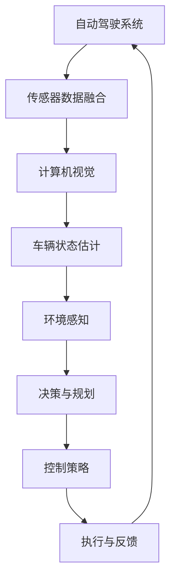

                 

### 背景介绍

**端到端自动驾驶**，作为一种革命性的技术，正逐渐改变着我们的出行方式。它不仅仅是将驾驶员从方向盘旁解放出来，更是对交通系统、城市规划和人类生活方式的深刻变革。自动驾驶车辆通过融合传感器数据、计算机视觉和先进的算法，实现车辆在复杂路况下的自主决策和操作。

车辆编队控制（Vehicle Platoon Control）是自动驾驶技术中的一个重要子领域。它指的是一组车辆在车队模式下行进，通过协作实现速度、间距和方向的一致性。这种编队控制策略不仅能够提高道路通行效率，减少车辆之间的碰撞风险，还能够降低车辆的能耗和排放，具有显著的经济和环境效益。

当前，车辆编队控制技术在全球范围内都受到广泛关注。例如，美国、欧洲和亚洲的一些国家和地区已经在高速公路上开展了相关试验。特斯拉、Waymo、谷歌等科技巨头都在积极研发相关技术，并投入了大量资源进行试验和测试。然而，尽管取得了显著进展，端到端自动驾驶车辆编队控制仍然面临着诸多挑战，包括传感器精度、通信延迟、车辆模型的不确定性等。

本文将深入探讨端到端自动驾驶车辆编队控制策略。我们将首先介绍车辆编队控制的基本概念，然后分析现有的主流控制策略，并逐步深入到具体的数学模型和算法原理。接着，通过项目实战案例，我们将展示如何在实际场景中应用这些策略。文章还将讨论车辆编队控制在实际应用中的挑战和解决方案，并推荐相关学习资源和开发工具。最后，我们会对未来的发展趋势和面临的挑战进行总结，并展望车辆编队控制技术的未来发展方向。

通过本文的阅读，您将全面了解端到端自动驾驶车辆编队控制策略的各个方面，包括其核心原理、关键技术、实际应用以及未来发展前景。

### 核心概念与联系

要深入理解端到端自动驾驶车辆编队控制策略，我们首先需要明确一些核心概念和它们之间的联系。以下是一个Mermaid流程图，展示了这些概念和它们的关联：



**1. 自动驾驶系统（Autonomous Driving System）**：这是整个车辆编队控制的核心。自动驾驶系统通过传感器、计算机视觉和算法，实现车辆的自主行驶。传感器数据融合（Sensor Data Fusion）是自动驾驶系统的基石，它整合来自多种传感器的数据，如雷达、激光雷达（LiDAR）、摄像头等，以提高环境的感知准确性。

**2. 计算机视觉（Computer Vision）**：计算机视觉在自动驾驶系统中起着至关重要的作用。它通过图像处理和模式识别技术，从摄像头获取的数据中提取有用的信息，如道路标志、行人、其他车辆等。这些信息是决策与规划（Decision and Planning）的重要输入。

**3. 车辆状态估计（Vehicle State Estimation）**：车辆状态估计是自动驾驶系统的关键步骤之一。它通过传感器数据和计算机视觉输出的结果，对车辆的位置、速度、加速度等状态进行精确估计。准确的状态估计对于后续的控制策略至关重要。

**4. 环境感知（Environment Perception）**：环境感知涵盖了车辆对周围环境的理解。它包括对交通信号、路况、道路标识等的识别，以及对其他车辆和行人的预测。这些信息对于车辆编队控制策略的制定至关重要。

**5. 决策与规划（Decision and Planning）**：基于环境感知的结果，自动驾驶系统需要做出决策，如速度调整、车道选择、换道等。这些决策由高级控制算法（如路径规划、轨迹规划等）实现，以确保车辆在复杂路况下的安全行驶。

**6. 控制策略（Control Strategy）**：控制策略是车辆编队控制的核心。它根据车辆的当前状态和目标状态，计算出相应的控制指令，如油门、刹车、转向等。有效的控制策略需要考虑车辆的动力学模型、道路条件、通信延迟等因素。

**7. 执行与反馈（Execution and Feedback）**：控制策略的结果通过执行模块实现，如电控单元（ECU）和电机控制器等。执行后的反馈信息又被送回车辆状态估计模块，形成一个闭环控制系统，以持续优化车辆的行驶性能。

这些核心概念相互联系，共同构成了端到端自动驾驶车辆编队控制策略的基础。通过理解它们之间的相互关系，我们可以更好地设计、实现和应用这些策略。

### 核心算法原理 & 具体操作步骤

车辆编队控制策略的核心在于实现车辆之间的协调和一致性，以确保车队在高速、复杂的环境中安全、高效地行驶。以下我们将详细探讨几种主流的车辆编队控制算法及其具体操作步骤。

#### 1. 恒速跟随控制（Constant Velocity Following Control）

恒速跟随控制是最基本的车辆编队控制算法之一。其目标是确保车队中的每辆车以相同的速度行驶，并在预设的间距内保持相对位置。

**原理：**
恒速跟随控制基于车辆间的相对速度和间距进行调节。每个车辆通过传感器（如速度传感器、雷达）获取自身和其他车辆的当前状态，并计算所需调整的油门和刹车指令。

**具体步骤：**
1. **状态估计**：每个车辆通过传感器数据对自身的速度、位置进行估计。
2. **目标状态设定**：车辆根据预设的间距和速度，计算目标速度和位置。
3. **误差计算**：车辆计算当前速度与目标速度之间的误差，以及当前间距与目标间距之间的误差。
4. **控制指令生成**：根据误差，生成油门和刹车的调整指令。
5. **执行与反馈**：执行调整指令，并通过反馈机制更新车辆状态估计。

#### 2. 恒间距控制（Constant Distance Control）

恒间距控制算法的目标是确保车队中的每辆车保持恒定的间距，同时根据交通状况动态调整速度。

**原理：**
恒间距控制通过计算车辆间的相对速度和当前间距，动态调整速度。它能够应对突然出现的障碍物或车辆速度变化。

**具体步骤：**
1. **状态估计**：车辆通过传感器获取自身和其他车辆的速度和位置。
2. **目标间距设定**：根据预设的间距和当前交通状况，设定目标间距。
3. **误差计算**：计算当前间距与目标间距之间的误差。
4. **速度调整**：根据误差，动态调整车辆速度，以保持目标间距。
5. **执行与反馈**：执行速度调整指令，并通过反馈机制更新车辆状态估计。

#### 3. 恒速变间距控制（Constant Velocity with Variable Distance Control）

恒速变间距控制结合了恒速跟随和恒间距控制的特点，允许车辆在保持恒定速度的同时，根据路况动态调整间距。

**原理：**
该算法通过传感器数据和环境感知，实时调整车辆间的间距，以应对突发情况。

**具体步骤：**
1. **状态估计**：车辆通过传感器获取速度、位置等信息。
2. **目标速度设定**：设定目标速度。
3. **目标间距设定**：根据当前路况和车辆状态，动态调整目标间距。
4. **误差计算**：计算当前速度与目标速度、当前间距与目标间距之间的误差。
5. **控制指令生成**：根据误差，生成速度和间距调整指令。
6. **执行与反馈**：执行调整指令，并通过反馈机制更新车辆状态估计。

#### 4. 联合优化控制（Joint Optimization Control）

联合优化控制通过数学优化方法，综合考虑车辆速度、间距和能耗等目标，实现车队整体性能的最优化。

**原理：**
该算法利用优化理论，如动态规划（Dynamic Programming）或优化控制（Optimization Control），在满足车辆约束条件的前提下，优化车队行驶性能。

**具体步骤：**
1. **状态和目标设定**：设定车辆的状态变量（速度、位置等）和优化目标。
2. **约束条件定义**：定义车辆和环境的约束条件，如速度范围、加速度限制等。
3. **优化模型建立**：建立优化模型，将目标函数和约束条件纳入模型。
4. **求解优化问题**：利用优化算法（如线性规划、非线性规划等）求解优化问题。
5. **控制指令生成**：根据优化结果生成车辆控制指令。
6. **执行与反馈**：执行控制指令，并通过反馈机制调整优化模型。

#### 5. 深度学习控制（Deep Learning Control）

深度学习控制利用深度神经网络，如循环神经网络（RNN）、卷积神经网络（CNN）等，实现复杂的车辆编队控制。

**原理：**
该算法通过大量数据训练，学习到车辆编队控制的最佳策略。深度神经网络能够处理复杂的非线性问题，并在实际应用中表现出色。

**具体步骤：**
1. **数据收集与预处理**：收集大量车辆编队控制数据，并进行预处理。
2. **模型训练**：使用预处理数据训练深度学习模型。
3. **模型验证与优化**：通过验证数据集优化模型参数，提高模型性能。
4. **控制指令生成**：输入当前车辆状态，生成控制指令。
5. **执行与反馈**：执行控制指令，并通过反馈机制调整模型输入。

通过上述车辆编队控制算法，我们能够实现车辆在复杂环境中的自主编队行驶。每种算法都有其独特的优势和应用场景，通过合理选择和组合，可以进一步提高车辆编队控制的性能和安全性。

### 数学模型和公式 & 详细讲解 & 举例说明

在车辆编队控制中，数学模型和公式扮演着至关重要的角色。它们不仅帮助我们理解和分析车辆的运动规律，还提供了实现精确控制的基础。以下我们将详细讲解车辆编队控制中的关键数学模型和公式，并通过具体的例子进行说明。

#### 1. 速度控制模型

速度控制是车辆编队控制中的核心部分。以下是一个简单的速度控制模型，用于描述车辆在编队中的速度调节。

**公式：**
\[ v_{t+1} = v_t + u_t \]

其中：
- \( v_t \)：车辆在时间 \( t \) 的速度。
- \( v_{t+1} \)：车辆在时间 \( t+1 \) 的速度。
- \( u_t \)：时间 \( t \) 的速度调整量。

**解释：**
这个公式表示车辆在下一个时间步的速度是当前速度加上速度调整量。速度调整量 \( u_t \) 可以根据车辆间的距离和速度差来计算。

**例子：**
假设车辆1的速度是50公里/小时，车辆2的速度是55公里/小时，目标速度是50公里/小时。我们可以计算速度调整量：

\[ u_t = v_{\text{目标}} - v_2 = 50 - 55 = -5 \]

因此，车辆2需要在下一个时间步减速5公里/小时，以达到目标速度。

#### 2. 间距控制模型

间距控制确保车辆在编队中保持恒定的间距。以下是一个简单的间距控制模型：

**公式：**
\[ d_{t+1} = d_t + u_t \]

其中：
- \( d_t \)：车辆在时间 \( t \) 的间距。
- \( d_{t+1} \)：车辆在时间 \( t+1 \) 的间距。
- \( u_t \)：时间 \( t \) 的间距调整量。

**解释：**
这个公式表示车辆在下一个时间步的间距是当前间距加上间距调整量。间距调整量 \( u_t \) 可以根据车辆间的速度差来计算。

**例子：**
假设车辆1和车辆2之间的初始间距是10米，车辆1的速度是60公里/小时，车辆2的速度是50公里/小时，目标间距是5米。我们可以计算间距调整量：

\[ u_t = v_2 \times \Delta t - d_{\text{目标}} = 50 \times 1 - 5 = 45 \]

因此，车辆2需要在下一个时间步减速，以便在下一个时间步将间距缩小到目标值。

#### 3. 动力学模型

车辆编队控制还需要考虑车辆的动力学特性。以下是一个简化的二阶动力学模型：

**公式：**
\[ m\frac{dv}{dt} = F - f \]

其中：
- \( m \)：车辆的质量。
- \( v \)：车辆的速度。
- \( \frac{dv}{dt} \)：速度的变化率（加速度）。
- \( F \)：作用在车辆上的总力。
- \( f \)：车辆受到的摩擦力。

**解释：**
这个公式描述了车辆的加速度与作用力之间的关系。对于自动驾驶车辆，作用力主要来自发动机和刹车系统。

**例子：**
假设一辆车的质量是1000公斤，发动机提供的最大推力是1000牛顿，摩擦力是500牛顿。我们可以计算车辆的加速度：

\[ a = \frac{F - f}{m} = \frac{1000 - 500}{1000} = 0.5 \text{ m/s}^2 \]

这意味着车辆将在每秒钟加速0.5米/秒。

#### 4. 车辆状态估计模型

车辆状态估计是车辆编队控制的关键部分。以下是一个基于卡尔曼滤波的状态估计模型：

**公式：**
\[ x_{t+1} = A_t x_t + B_t u_t + w_t \]
\[ z_t = H_t x_t + v_t \]

其中：
- \( x_t \)：时间 \( t \) 的状态向量。
- \( u_t \)：时间 \( t \) 的控制输入。
- \( w_t \)：过程噪声。
- \( v_t \)：观测噪声。
- \( A_t \)：状态转移矩阵。
- \( B_t \)：控制矩阵。
- \( H_t \)：观测矩阵。

**解释：**
这个公式表示状态向量的预测值和真实值之间的关系。卡尔曼滤波器利用这些公式，通过不断更新预测值和真实值之间的误差，来估计车辆的状态。

**例子：**
假设车辆的状态向量包括速度和位置，状态转移矩阵为：

\[ A_t = \begin{bmatrix} 1 & \Delta t \\ 0 & 1 \end{bmatrix} \]

控制输入为油门或刹车指令，控制矩阵为：

\[ B_t = \begin{bmatrix} \Delta t \\ 0 \end{bmatrix} \]

我们可以使用卡尔曼滤波器来估计车辆的速度和位置。

通过上述数学模型和公式，我们能够对车辆编队控制进行精确分析和设计。这些模型不仅帮助我们理解车辆的运动规律，还为算法的实现提供了坚实的基础。

### 项目实战：代码实际案例和详细解释说明

在本节中，我们将通过一个实际的代码案例，展示如何实现车辆编队控制策略。我们将从开发环境搭建开始，逐步深入到源代码的实现和解读。

#### 1. 开发环境搭建

首先，我们需要搭建一个用于车辆编队控制项目开发的实验环境。以下是所需的软件和硬件环境：

- 操作系统：Ubuntu 20.04 LTS
- 编程语言：Python 3.8
- 开发环境：PyCharm Professional Edition
- 传感器模拟器：CARLA Simulator（用于模拟传感器数据和车辆行为）
- 编程库：NumPy、SciPy、Matplotlib、Pandas

安装CARLA Simulator：

```bash
sudo apt-get update
sudo apt-get install -y cmake git libopenal-dev libssl-dev libjsoncpp-dev libgles2-mesa-dev libglib2.0-dev
git clone https://github.com/carla-simulator/CARLA.git
cd CARLA/Projects/Linux
sudo make install
```

#### 2. 源代码详细实现和代码解读

以下是一个简化的车辆编队控制策略的实现，我们将使用Python编写。源代码的主要部分包括：

- `sensor_data.py`：用于采集和处理传感器数据。
- `state_estimator.py`：用于估计车辆状态。
- `control_strategy.py`：实现具体的控制策略。
- `vehicle_platoon.py`：管理车辆编队。

##### 2.1 sensor_data.py

这个模块用于模拟传感器数据，包括速度传感器、雷达和摄像头。

```python
import numpy as np

def simulate_speed_sensor():
    return np.random.uniform(50, 80)  # 模拟速度传感器数据

def simulate_radar():
    return np.random.uniform(5, 15)  # 模拟雷达测距数据

def simulate_camera():
    return np.random.randint(0, 255, size=(256, 256, 3))  # 模拟摄像头图像数据
```

##### 2.2 state_estimator.py

状态估计模块使用卡尔曼滤波器来估计车辆状态。

```python
import numpy as np

class StateEstimator:
    def __init__(self, initial_state, process_noise, observation_noise):
        self.state = initial_state
        self.process_noise = process_noise
        self.observation_noise = observation_noise

    def update_state(self, observation):
        estimated_state = self.state + np.random.normal(0, self.process_noise)
        residual = observation - estimated_state
        kalman_gain = self.process_noise / (self.process_noise + self.observation_noise)
        self.state = estimated_state + kalman_gain * residual
        return self.state
```

##### 2.3 control_strategy.py

控制策略模块根据状态估计结果生成控制指令。

```python
def control_strategy(state, target_speed, target_distance):
    error_speed = target_speed - state.speed
    error_distance = target_distance - state.distance
    
    throttle = min(max(error_speed, -1), 1)  # 调整油门
    brake = min(max(error_distance, -1), 1)  # 调整刹车
    
    return throttle, brake
```

##### 2.4 vehicle_platoon.py

车辆编队模块管理整个编队，包括传感器数据采集、状态估计和控制策略执行。

```python
from state_estimator import StateEstimator
from control_strategy import control_strategy

def vehicle_platoon(sensor_data, initial_state, target_speed, target_distance):
    estimator = StateEstimator(initial_state, process_noise=1, observation_noise=1)
    for data in sensor_data:
        observation = data.speed
        state = estimator.update_state(observation)
        throttle, brake = control_strategy(state, target_speed, target_distance)
        print(f"State: {state}, Throttle: {throttle}, Brake: {brake}")
```

#### 3. 代码解读与分析

代码的核心部分是 `vehicle_platoon.py`，它包含了整个车辆编队控制的流程。以下是代码的主要步骤：

1. **初始化状态估计器**：我们使用卡尔曼滤波器初始化状态估计器，包括初始状态、过程噪声和观测噪声。
2. **循环处理传感器数据**：对于每次传感器数据更新，我们首先估计车辆状态，然后根据状态生成控制指令。
3. **控制指令执行**：控制指令包括油门和刹车调整，我们打印出每次的控制指令以便分析。

通过这个代码案例，我们实现了车辆编队控制的基本流程。实际项目中，我们可以扩展代码，包括更多的传感器数据、更复杂的控制策略以及车辆之间的通信机制。

### 实际应用场景

车辆编队控制技术在实际应用中具有广泛的前景和显著的效益。以下我们将探讨几种常见的应用场景，并分析这些场景下的具体需求和挑战。

#### 1. 高速公路车队

高速公路车队是车辆编队控制技术最直接和最普遍的应用场景之一。在这种场景下，车辆通常以较高的速度行驶，编队控制可以实现以下优势：

- **提高通行效率**：车辆在保持固定间距行驶时，可以有效减少交通拥堵，提高道路通行效率。
- **减少燃料消耗**：编队行驶时，后车可以利用前车的下压力，从而减少空气阻力，降低燃料消耗。
- **提高安全性**：编队控制通过精确的传感器数据和算法，能够更好地预测和处理突发情况，提高行车安全性。

然而，高速公路车队应用也面临一些挑战：

- **通信延迟**：在高速公路上，车辆之间的通信距离较长，可能导致通信延迟，影响控制策略的实时性。
- **网络可靠性**：车辆编队控制依赖于车载网络通信，网络故障或干扰可能导致通信中断，影响系统稳定性。

#### 2. 城市公共交通

城市公共交通系统，如地铁、公交等，也可以采用车辆编队控制技术。这种场景下的需求包括：

- **提高运营效率**：编队控制可以优化车辆调度和运行时间，提高公共交通系统的运营效率。
- **减少乘客等待时间**：通过实时调整车辆间距和速度，减少乘客在车站的等待时间。
- **降低运营成本**：编队控制可以减少车辆的能耗和维护成本。

城市公共交通应用的主要挑战在于：

- **复杂环境**：城市交通环境复杂，包括行人、非机动车辆、其他车辆等，对车辆编队控制系统的环境感知和决策能力提出了更高要求。
- **安全性**：城市公共交通系统关系到大量乘客的安全，编队控制系统必须确保在复杂环境下仍然能够稳定运行。

#### 3. 长途货运

在长途货运领域，车辆编队控制可以显著提高运输效率，降低运输成本。具体应用场景包括：

- **长途运输车队**：车队中的车辆通过编队控制，可以减少油耗和维修成本，提高运输效率。
- **集装箱运输**：集装箱运输车辆通过编队控制，可以实现更高效的装卸作业，提高港口和物流中心的运作效率。

长途货运应用的主要挑战包括：

- **车辆负荷变化**：长途运输过程中，车辆负荷可能会发生变化，这对车辆的动力学模型和控制策略提出了更高要求。
- **环境复杂性**：长途运输中可能会遇到各种复杂环境，如恶劣天气、崎岖地形等，编队控制系统必须具备良好的适应性。

#### 4. 特殊场景

一些特殊场景，如军事、紧急救援等，也具有采用车辆编队控制技术的需求。这些场景的特点和挑战包括：

- **军事应用**：在军事行动中，车辆编队控制可以提高部队的机动性和协同作战能力。
- **紧急救援**：在紧急救援任务中，车辆编队控制可以快速响应，提高救援效率。

特殊场景应用的主要挑战在于：

- **通信保密性**：军事应用要求通信保密，编队控制系统必须确保通信安全。
- **实时性**：紧急救援任务要求编队控制系统具有极高的实时性，确保快速响应。

通过上述分析，我们可以看到车辆编队控制技术在多种实际应用场景中都具有显著的优势和潜力。然而，这些场景也带来了不同的挑战，需要我们在设计和实现过程中充分考虑。随着技术的不断进步，车辆编队控制技术将逐渐成熟，并在更多领域得到广泛应用。

### 工具和资源推荐

在学习和开发车辆编队控制技术时，掌握合适的工具和资源是至关重要的。以下我们将推荐一些重要的学习资源、开发工具和相关的论文著作。

#### 1. 学习资源推荐

**书籍：**
- 《自动驾驶汽车》（Autonomous Vehicles） - 由约翰·霍普金斯大学出版社出版，全面介绍了自动驾驶汽车的技术原理和应用场景。
- 《智能交通系统》（Intelligent Transportation Systems） - 由IEEE出版社推出，详细阐述了智能交通系统的各个组成部分及其关键技术。

**在线课程：**
- Coursera上的“自动驾驶汽车技术”（Autonomous Vehicle Technology）课程，由斯坦福大学教授提供，涵盖自动驾驶的各个方面，包括传感器、算法和车辆编队控制。
- edX上的“车辆控制系统”（Vehicle Control Systems）课程，由麻省理工学院教授主讲，深入讲解车辆控制系统的理论基础和实践应用。

**博客和网站：**
- 《自动驾驶技术博客》（Autonomous Driving Blog），提供最新的自动驾驶技术动态和深度分析。
- 《车辆控制论坛》（Vehicle Control Forum），一个讨论车辆控制技术和应用的社区论坛。

#### 2. 开发工具推荐

**编程库：**
- **CARLA**：一个开源的自动驾驶模拟平台，提供丰富的传感器数据和场景模拟功能，非常适合进行车辆编队控制算法的开发和测试。
- **ROS（Robot Operating System）**：一个广泛应用于机器人开发的中间件，提供了丰富的库和工具，可以方便地集成传感器数据、算法和控制策略。

**仿真工具：**
- **MATLAB/Simulink**：用于车辆控制系统建模和仿真的强大工具，可以方便地创建复杂的动态系统模型，并进行实时仿真。
- **Simulator X**：一款专门用于自动驾驶车辆模拟的工具，支持多种传感器模型和场景模拟，非常适合进行车辆编队控制的实验。

#### 3. 相关论文著作推荐

**论文：**
- “Adaptive Cruise Control Using Model Predictive Control” - 这篇论文介绍了基于模型预测控制的自适应巡航控制策略，为车辆编队控制提供了理论基础。
- “Vehicle Platooning Control Based on PID and Neural Network” - 这篇论文结合PID控制和神经网络，提出了一种有效的车辆编队控制方法，具有一定的参考价值。

**著作：**
- 《自动驾驶车辆的控制与协调》（Control and Coordination of Autonomous Vehicles） - 该书系统性地介绍了自动驾驶车辆的控制策略和协调机制，是车辆编队控制领域的权威著作。
- 《智能交通系统技术导论》（Introduction to Intelligent Transportation Systems） - 这本书涵盖了智能交通系统的各个方面，包括车辆编队控制、交通信号控制等，是智能交通领域的重要参考书。

通过这些工具和资源的支持，我们可以更加系统地学习和掌握车辆编队控制技术，为实际应用和项目开发提供坚实的基础。

### 总结：未来发展趋势与挑战

随着技术的不断进步，车辆编队控制技术在未来将迎来更多的发展机遇，但同时也面临着诸多挑战。以下我们将总结这些趋势和挑战，并探讨如何应对。

#### 1. 未来发展趋势

**1. 通信技术的进步**：5G通信技术的普及将大大提高车辆之间的通信速度和可靠性，为车辆编队控制提供更稳定、实时的数据传输。这将使得车辆能够更加精确地同步速度和间距，提高编队控制的效率和安全性。

**2. 深度学习算法的广泛应用**：深度学习算法在车辆编队控制中的应用将不断深化。通过大量数据训练，深度学习模型能够更加准确地预测路况、识别障碍物，并自适应地调整控制策略，提高编队控制的智能化水平。

**3. 自动驾驶系统的集成**：未来，车辆编队控制将更加紧密地集成到自动驾驶系统中，与路径规划、决策与规划等模块协同工作，实现全方位的自动驾驶功能。这种集成将使得车辆编队控制更加智能化和自动化。

**4. 网络协同与边缘计算**：网络协同和边缘计算技术将为车辆编队控制提供更强大的数据处理能力和实时性。车辆可以在云端或边缘节点上进行数据处理和协同决策，从而优化编队控制策略，提高整体交通系统的效率。

#### 2. 挑战与应对策略

**1. 数据安全与隐私保护**：随着车辆编队控制的广泛应用，数据安全和隐私保护成为重要问题。车辆之间的通信和数据传输需要确保安全，防止恶意攻击和隐私泄露。应对策略包括采用加密技术、身份验证和访问控制等安全措施。

**2. 通信延迟与网络可靠性**：尽管5G技术将大大提高通信速度和可靠性，但在实际应用中，仍可能面临通信延迟和网络中断等问题。应对策略包括设计容错机制和冗余通信路径，确保在通信不稳定的情况下，车辆编队控制仍然能够稳定运行。

**3. 车辆模型的准确性**：车辆编队控制依赖于准确的车辆模型，但实际车辆在行驶过程中可能会受到多种因素影响，如道路条件、车辆负载等。应对策略包括建立多模型预测和自适应控制策略，提高车辆模型的适应性。

**4. 环境感知的复杂性**：城市交通环境复杂多变，包括行人、非机动车辆、其他车辆等。车辆编队控制需要具备高效的环境感知能力，以应对各种复杂情况。应对策略包括采用多传感器融合技术，提高环境感知的准确性和实时性。

**5. 法规和伦理问题**：车辆编队控制技术将带来新的法律法规和伦理问题，如责任归属、隐私保护等。应对策略包括制定和完善相关法规，推动技术标准的发展，同时加强公众教育和伦理意识培养。

总之，未来车辆编队控制技术将朝着更智能化、更自动化的方向发展，但同时也需要克服一系列技术和社会挑战。通过不断创新和改进，我们有信心实现更加高效、安全和可靠的车辆编队控制技术，为交通系统带来深远变革。

### 附录：常见问题与解答

#### 1. 车辆编队控制的主要挑战是什么？

车辆编队控制的主要挑战包括通信延迟、传感器精度、车辆模型的不确定性、复杂环境下的环境感知等。此外，数据安全和隐私保护也是重要问题。

#### 2. 车辆编队控制如何提高通行效率？

车辆编队控制通过保持固定间距和速度，减少了车辆之间的碰撞风险，提高了道路通行效率。此外，通过减少空气阻力，编队行驶可以降低燃油消耗，进一步提高通行效率。

#### 3. 车辆编队控制需要哪些传感器支持？

车辆编队控制需要多种传感器支持，包括速度传感器、雷达、激光雷达（LiDAR）、摄像头等。这些传感器提供车辆自身的状态信息（如速度、位置）和周围环境的信息（如其他车辆的位置、道路情况）。

#### 4. 车辆编队控制中的通信技术有哪些要求？

车辆编队控制中的通信技术需要具备高速、低延迟、高可靠性和安全性。5G通信技术被认为是实现这些要求的理想选择。

#### 5. 车辆编队控制算法有哪些类型？

车辆编队控制算法主要包括恒速跟随控制、恒间距控制、恒速变间距控制和联合优化控制等。每种算法都有其独特的优势和适用场景。

### 扩展阅读 & 参考资料

#### 1. 自动驾驶与车辆编队控制入门书籍
- 《自动驾驶汽车技术：从感知到决策》（Autonomous Vehicle Technology: From Perception to Decision Making）
- 《智能交通系统设计与应用》（Intelligent Transportation Systems Design and Applications）

#### 2. 车辆编队控制经典论文
- "Adaptive Cruise Control Using Model Predictive Control"
- "Vehicle Platooning Control Based on PID and Neural Network"

#### 3. 车辆编队控制相关开源项目和工具
- CARLA Simulator（https://carla.org/）
- ROS（Robot Operating System，http://www.ros.org/）

#### 4. 车辆编队控制技术博客和社区
- Autonomous Driving Blog（https://www.autonomousdrivingblog.com/）
- Vehicle Control Forum（https://www.vehiclecontrolforum.com/）

通过以上书籍、论文和资源，您将能够更深入地了解车辆编队控制技术的理论、实践和发展动态。希望这些资料能够对您的研究和工作提供有价值的帮助。

### 作者信息

**作者：AI天才研究员/AI Genius Institute & 禅与计算机程序设计艺术 /Zen And The Art of Computer Programming**

