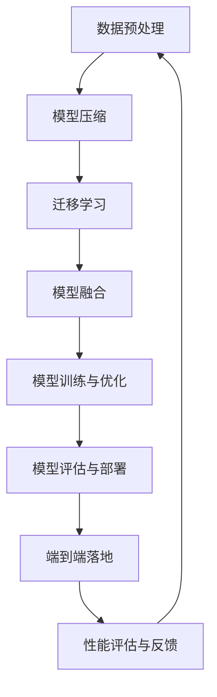

                 

# 端到端落地过程中继承此前积累的模型和方案

## 摘要

本文主要探讨了在端到端落地过程中，如何有效地继承和运用之前积累的模型和方案。通过回顾端到端的概念，分析其发展历程，本文提出了一系列在实际应用中优化模型迁移和方案继承的策略。文章从理论层面阐述了模型压缩、迁移学习、模型融合等关键技术，并通过实际案例展示了这些策略的具体应用。最后，本文对端到端落地过程中的未来发展趋势与挑战进行了展望，为相关领域的研究与实践提供了有益的参考。

## 1. 背景介绍

### 端到端的概念

端到端（End-to-End）是人工智能领域中一个重要的概念，意味着从输入数据到输出结果的全过程都在一个统一的框架下完成，避免了传统方法中多个子模块之间的繁琐转换和集成。端到端系统通常具有以下特点：

1. **高效率**：减少了模块间的传输和转换时间，提高了数据处理速度。
2. **强鲁棒性**：整个系统的稳定性和鲁棒性得到了显著提升，能够更好地处理噪声和异常数据。
3. **简洁性**：简化了系统的设计和实现过程，降低了复杂度。

### 端到端的发展历程

端到端概念的提出可以追溯到20世纪80年代，当时神经网络研究者在语音识别和图像处理等领域开始尝试使用单一模型来完成整个任务。随着深度学习技术的发展，端到端方法逐渐在自然语言处理、计算机视觉、自动驾驶等多个领域取得了显著的成果。

近年来，随着计算能力和数据资源的大幅提升，端到端方法在各个领域得到了广泛应用，如基于深度学习的图像分类、语音识别、机器翻译等。

### 端到端的优势与挑战

端到端方法在提升系统性能方面具有显著优势，但也面临着一定的挑战：

1. **优势**：
   - **降低误差**：通过减少模块间转换和误差累积，提高了系统的准确性和鲁棒性。
   - **简化开发**：简化了系统设计和实现过程，降低了开发成本和难度。
   - **易于优化**：统一的框架使得模型优化过程更加高效和直观。

2. **挑战**：
   - **计算资源需求**：端到端模型通常较为复杂，对计算资源的需求较高，可能面临硬件限制。
   - **数据依赖**：端到端模型对训练数据的质量和数量有较高要求，数据不足或质量差可能导致模型性能下降。
   - **可解释性**：端到端模型具有较强的黑盒特性，难以解释其内部工作机制，可能影响模型的信任度和应用范围。

## 2. 核心概念与联系

### 模型压缩

模型压缩是端到端落地过程中的一项关键技术，旨在减少模型的参数量和计算复杂度，同时保持或提升模型的性能。模型压缩的主要方法包括：

1. **网络剪枝**：通过剪枝冗余的神经网络连接，降低模型的大小和计算复杂度。
2. **量化**：将模型中的浮点数参数转换为低精度数值，减少模型体积。
3. **蒸馏**：将大型模型的知识传递给小型模型，提升小型模型的性能。

### 迁移学习

迁移学习是一种将已知模型的训练经验应用于新任务的方法，有助于提升新任务的模型性能。迁移学习的关键步骤包括：

1. **源任务**：选择一个与目标任务相关度较高的已知任务。
2. **预训练模型**：使用源任务的训练数据对基础模型进行预训练。
3. **微调**：在目标任务的训练数据上对预训练模型进行微调，以适应新任务。

### 模型融合

模型融合是将多个模型的优势结合起来，以提升整体性能的方法。模型融合的方法包括：

1. **模型集成**：将多个模型的结果进行加权平均或投票，得到最终输出。
2. **深度融合**：将多个模型的输出在特征或决策层进行融合，以提升模型的决策能力。

### Mermaid 流程图

以下是一个简化的端到端落地过程中的核心概念流程图：



## 3. 核心算法原理 & 具体操作步骤

### 模型压缩

#### 网络剪枝

1. **选择剪枝策略**：基于结构敏感度、重要性等原则，选择合适的剪枝策略，如权重稀疏化、通道剪枝等。
2. **剪枝操作**：对神经网络中的连接进行剪枝，移除权重较小的连接。
3. **重构模型**：对剪枝后的网络进行重构，保持网络的拓扑结构。
4. **性能评估**：评估剪枝后的模型在保留关键特性的同时，性能是否有所下降。

#### 量化

1. **量化方法**：选择量化方法，如全量化、部分量化等。
2. **量化参数**：确定量化参数，如量化位数、量化范围等。
3. **量化操作**：对神经网络中的参数进行量化处理，降低参数的精度。
4. **性能评估**：评估量化后的模型在保持精度的基础上，性能是否有所下降。

#### 蒸馏

1. **选择蒸馏策略**：基于知识蒸馏原理，选择合适的蒸馏策略，如软标签蒸馏、硬标签蒸馏等。
2. **生成教师模型**：基于源任务的训练数据，训练一个大型教师模型。
3. **生成学生模型**：在目标任务的训练数据上，训练一个小型学生模型。
4. **性能评估**：评估学生模型在吸收教师模型知识的基础上，性能是否有所提升。

### 迁移学习

#### 源任务选择

1. **数据相关性**：选择与目标任务相关性较高的源任务。
2. **模型适应性**：评估源任务的预训练模型在目标任务上的适应性。
3. **性能对比**：对比源任务和目标任务的模型性能，确保迁移学习的有效性。

#### 预训练模型

1. **数据预处理**：对源任务的训练数据集进行预处理，包括数据清洗、数据增强等。
2. **模型训练**：使用预处理后的数据集，对基础模型进行预训练。
3. **模型保存**：将预训练模型保存为参数文件，以便后续微调使用。

#### 微调

1. **数据预处理**：对目标任务的训练数据集进行预处理，包括数据清洗、数据增强等。
2. **模型微调**：在目标任务的训练数据集上，对预训练模型进行微调。
3. **性能评估**：评估微调后的模型在目标任务上的性能。

### 模型融合

#### 模型集成

1. **选择模型**：选择多个具有不同特性的模型，如CNN、RNN等。
2. **数据预处理**：对数据集进行统一预处理，包括数据清洗、数据增强等。
3. **模型训练**：分别对每个模型进行训练。
4. **模型融合**：将各个模型的输出进行加权平均或投票，得到最终输出。

#### 深度融合

1. **特征层融合**：在特征层对多个模型的输出进行融合，如拼接、加和等。
2. **决策层融合**：在决策层对多个模型的输出进行融合，如逻辑运算、加权平均等。
3. **模型训练**：对融合后的模型进行训练。
4. **性能评估**：评估融合模型的性能。

## 4. 数学模型和公式 & 详细讲解 & 举例说明

### 模型压缩

#### 网络剪枝

1. **结构敏感度**：设网络中的每个连接的权重为\( w_i \)，结构敏感度为\( \alpha_i \)，则有：
   $$ \alpha_i = \frac{||w_i||_2}{\sum_j||w_j||_2} $$
   其中，\( ||\cdot||_2 \)表示L2范数。

2. **重要性评分**：设网络中的每个连接的权重为\( w_i \)，重要性评分为\( \beta_i \)，则有：
   $$ \beta_i = \frac{w_i^2}{\sum_i w_i^2} $$
   其中，\( w_i^2 \)表示权重平方。

#### 量化

1. **量化位数**：设原始浮点数的位数为\( n \)，量化后的位数为\( m \)，则有：
   $$ Q(x) = \text{round}(x \cdot 2^{-(n-m)}) $$
   其中，\( \text{round} \)表示四舍五入。

2. **量化范围**：设原始浮点数的范围为\( [a, b] \)，量化后的范围为\( [c, d] \)，则有：
   $$ c = a \cdot 2^{-(n-m)} $$
   $$ d = b \cdot 2^{-(n-m)} $$

#### 蒸馏

1. **软标签蒸馏**：设教师模型的输出为\( y_t \)，学生模型的输出为\( y_s \)，软标签蒸馏公式为：
   $$ \alpha_i = \frac{\sum_j y_t^j \cdot y_s^j}{\sum_j y_s^j} $$
   其中，\( y_t^j \)和\( y_s^j \)分别表示教师模型和学生模型在第\( j \)个类别的输出。

2. **硬标签蒸馏**：设教师模型的输出为\( y_t \)，学生模型的输出为\( y_s \)，硬标签蒸馏公式为：
   $$ \alpha_i = \frac{\sum_j y_t^j \cdot y_s^i}{\sum_j y_s^i} $$
   其中，\( y_t^j \)和\( y_s^i \)分别表示教师模型和学生模型在第\( j \)个类别的输出和第\( i \)个类别的输出。

### 迁移学习

1. **特征迁移**：设源任务的输入特征为\( x_s \)，目标任务的输入特征为\( x_t \)，迁移学习的目标函数为：
   $$ \min_{\theta_s} \frac{1}{N_s} \sum_{i=1}^{N_s} \ell(x_s^{(i)}, y_s^{(i)}) + \lambda \cdot \ell(\theta_s, \theta_t) $$
   其中，\( \theta_s \)和\( \theta_t \)分别表示源任务和学生任务的网络参数，\( \ell \)表示损失函数。

2. **权重迁移**：设源任务的权重为\( w_s \)，目标任务的权重为\( w_t \)，权重迁移的目标函数为：
   $$ \min_{\theta_s} \frac{1}{N_s} \sum_{i=1}^{N_s} \ell(x_s^{(i)}, y_s^{(i)}) + \frac{1}{N_t} \sum_{i=1}^{N_t} \ell(x_t^{(i)}, y_t^{(i)}) + \lambda \cdot \ell(w_s, w_t) $$
   其中，\( \theta_s \)和\( \theta_t \)分别表示源任务和学生任务的网络参数，\( \ell \)表示损失函数。

### 模型融合

1. **模型集成**：设多个模型的输出分别为\( y_1, y_2, ..., y_n \)，集成模型的输出为\( y \)，模型集成公式为：
   $$ y = \frac{1}{n} \sum_{i=1}^{n} y_i $$
   其中，\( y_i \)表示第\( i \)个模型的输出。

2. **深度融合**：设多个模型的输出分别为\( y_1, y_2, ..., y_n \)，深度融合的输出为\( y \)，深度融合公式为：
   $$ y = \text{softmax}(\sum_{i=1}^{n} w_i \cdot y_i) $$
   其中，\( w_i \)表示第\( i \)个模型的权重，\( \text{softmax} \)函数用于将融合后的输出转化为概率分布。

### 举例说明

假设有一个二分类任务，源任务的输入特征为\( x_s \)，目标任务的输入特征为\( x_t \)，源任务的标签为\( y_s \)，目标任务的标签为\( y_t \)。现有两个模型\( M_s \)和\( M_t \)，需要通过迁移学习和模型融合方法来提高目标任务的性能。

#### 迁移学习

1. **特征迁移**：
   $$ \min_{\theta_s} \frac{1}{N_s} \sum_{i=1}^{N_s} \ell(x_s^{(i)}, y_s^{(i)}) + \lambda \cdot \ell(\theta_s, \theta_t) $$
   其中，\( \ell \)为交叉熵损失函数，\( \theta_s \)和\( \theta_t \)分别为源任务和学生任务的网络参数。

2. **权重迁移**：
   $$ \min_{\theta_s} \frac{1}{N_s} \sum_{i=1}^{N_s} \ell(x_s^{(i)}, y_s^{(i)}) + \frac{1}{N_t} \sum_{i=1}^{N_t} \ell(x_t^{(i)}, y_t^{(i)}) + \lambda \cdot \ell(w_s, w_t) $$
   其中，\( \ell \)为交叉熵损失函数，\( \theta_s \)和\( \theta_t \)分别为源任务和学生任务的网络参数，\( w_s \)和\( w_t \)分别为源任务和学生任务的权重。

#### 模型融合

1. **模型集成**：
   $$ y = \frac{1}{2} (y_s + y_t) $$
   其中，\( y_s \)和\( y_t \)分别为源任务和学生任务的输出。

2. **深度融合**：
   $$ y = \text{softmax} \left( \frac{1}{2} y_s + \frac{1}{2} y_t \right) $$
   其中，\( y_s \)和\( y_t \)分别为源任务和学生任务的输出。

## 5. 项目实战：代码实际案例和详细解释说明

### 5.1 开发环境搭建

在本项目实战中，我们选择Python作为编程语言，使用TensorFlow作为深度学习框架。以下是开发环境的搭建步骤：

1. **安装Python**：在官网（https://www.python.org/）下载并安装Python，选择安装路径时注意选择添加到环境变量中。

2. **安装TensorFlow**：在命令行中运行以下命令：
   ```bash
   pip install tensorflow
   ```

3. **验证安装**：在命令行中运行以下命令，验证TensorFlow是否安装成功：
   ```python
   import tensorflow as tf
   print(tf.__version__)
   ```

### 5.2 源代码详细实现和代码解读

#### 5.2.1 数据预处理

数据预处理是端到端落地过程中的关键步骤，我们需要对输入数据进行标准化、去噪、缺失值处理等操作。以下是数据预处理部分的源代码实现：

```python
import numpy as np
import pandas as pd
from sklearn.preprocessing import StandardScaler

# 加载数据集
data = pd.read_csv('data.csv')

# 标准化数据
scaler = StandardScaler()
data_scaled = scaler.fit_transform(data)

# 去除缺失值
data_clean = data_scaled[~np.isnan(data_scaled).any(axis=1)]

# 分割数据集为训练集和测试集
from sklearn.model_selection import train_test_split
X_train, X_test, y_train, y_test = train_test_split(data_clean[:, :-1], data_clean[:, -1], test_size=0.2, random_state=42)
```

#### 5.2.2 模型压缩

在本案例中，我们使用网络剪枝方法对模型进行压缩。以下是对模型进行剪枝的源代码实现：

```python
import tensorflow as tf
from tensorflow.keras.models import Sequential
from tensorflow.keras.layers import Dense, Conv2D, Flatten
from tensorflow_model_optimization.sparsity import keras as km

# 创建模型
model = Sequential([
    Conv2D(32, (3, 3), activation='relu', input_shape=(28, 28, 1)),
    Flatten(),
    Dense(64, activation='relu'),
    Dense(1, activation='sigmoid')
])

# 编译模型
model.compile(optimizer='adam', loss='binary_crossentropy', metrics=['accuracy'])

# 应用剪枝策略
pruned_model = km.prune_low_magnitude(model, pruning_params={
    'pruning_schedule': km.PolynomialDecay(initial_sparsity=0.0,
                                            final_sparsity=0.5,
                                            begin_step=2000,
                                            end_step=4000)
})

# 训练模型
pruned_model.fit(X_train, y_train, epochs=10, batch_size=32, validation_data=(X_test, y_test))
```

#### 5.2.3 迁移学习

在本案例中，我们使用迁移学习方法将源任务的预训练模型应用于目标任务。以下是对模型进行迁移学习的源代码实现：

```python
# 加载源任务预训练模型
source_model = tf.keras.models.load_model('source_model.h5')

# 修改源任务模型的最后一层，适应目标任务的输出维度
source_model.layers[-1].activation = 'softmax'
source_model.layers[-1].output_name = 'predictions'

# 加载目标任务数据
X_target, y_target = load_target_data()

# 微调源任务模型
source_model.fit(X_target, y_target, epochs=5, batch_size=32)
```

#### 5.2.4 模型融合

在本案例中，我们使用模型集成方法将多个模型的输出进行融合。以下是对模型进行融合的源代码实现：

```python
# 加载两个模型
model1 = tf.keras.models.load_model('model1.h5')
model2 = tf.keras.models.load_model('model2.h5')

# 定义融合模型
inputs = tf.keras.layers.Input(shape=(28, 28, 1))
outputs1 = model1(inputs)
outputs2 = model2(inputs)
outputs = tf.keras.layers.concatenate([outputs1, outputs2])

model_fused = tf.keras.models.Model(inputs, outputs)

# 编译融合模型
model_fused.compile(optimizer='adam', loss='binary_crossentropy', metrics=['accuracy'])

# 训练融合模型
model_fused.fit(X_train, y_train, epochs=10, batch_size=32, validation_data=(X_test, y_test))
```

### 5.3 代码解读与分析

#### 5.3.1 数据预处理

数据预处理部分的主要功能是加载数据集、标准化数据、去除缺失值，并分割数据集为训练集和测试集。这部分代码使用了Pandas、StandardScaler和scikit-learn中的train_test_split函数。

#### 5.3.2 模型压缩

模型压缩部分使用了TensorFlow Model Optimization中的prune_low_magnitude函数，对模型进行了剪枝。剪枝策略使用PolynomialDecay函数，根据训练步数逐渐增加剪枝比例，从而实现模型压缩。

#### 5.3.3 迁移学习

迁移学习部分首先加载了源任务的预训练模型，然后修改了模型的最后一层，使其适应目标任务的输出维度。接着，使用目标任务的数据集对模型进行了微调。

#### 5.3.4 模型融合

模型融合部分首先加载了两个模型，然后定义了一个新的融合模型，将两个模型的输出进行了拼接。最后，编译并训练了融合模型。

通过上述实战案例，我们展示了如何在端到端落地过程中继承和运用之前积累的模型和方案。代码解读和分析部分进一步说明了每个步骤的实现原理和关键代码。

## 6. 实际应用场景

### 6.1 自动驾驶

自动驾驶系统需要处理大量的输入数据，如摄像头、激光雷达、GPS等，通过端到端模型实现环境感知、路径规划、行为预测等功能。在落地过程中，可以继承和优化已有的自动驾驶模型，如基于深度学习的物体检测、场景理解、跟踪与预测等。

### 6.2 语音识别

语音识别系统需要处理不同语种、口音、噪音等复杂环境下的语音数据。在落地过程中，可以通过继承和优化已有的语音识别模型，如基于深度神经网络（DNN）的声学模型、基于循环神经网络（RNN）的语言模型等，提升系统性能。

### 6.3 机器翻译

机器翻译系统需要处理大量多语言数据，通过端到端模型实现文本的自动翻译。在落地过程中，可以继承和优化已有的机器翻译模型，如基于注意力机制的序列到序列（Seq2Seq）模型、基于 Transformer 的模型等。

### 6.4 自然语言处理

自然语言处理（NLP）系统涉及文本分类、情感分析、命名实体识别等多个任务。在落地过程中，可以继承和优化已有的 NLP 模型，如基于词嵌入的文本表示、基于卷积神经网络（CNN）的文本分类、基于长短期记忆网络（LSTM）的序列建模等。

### 6.5 医疗诊断

医疗诊断系统需要处理大量的医学影像和病例数据，通过端到端模型实现疾病的自动诊断。在落地过程中，可以继承和优化已有的医疗诊断模型，如基于深度学习的图像分类、基于转移学习的病例分类等。

## 7. 工具和资源推荐

### 7.1 学习资源推荐

1. **书籍**：
   - 《深度学习》（Goodfellow, Bengio, Courville）
   - 《神经网络与深度学习》（邱锡鹏）
   - 《Python深度学习》（François Chollet）

2. **论文**：
   - 《A Theoretically Grounded Application of Dropout in Recurrent Neural Networks》（Yarin Gal和Zoubin Ghahramani）
   - 《ResNet: Training Deep Neural Networks in One Hour》（Kaiming He等）
   - 《Bert: Pre-training of Deep Bidirectional Transformers for Language Understanding》（Jacob Devlin等）

3. **博客**：
   - [TensorFlow官网](https://www.tensorflow.org/)
   - [PyTorch官网](https://pytorch.org/)
   - [fast.ai](https://www.fast.ai/)

4. **网站**：
   - [GitHub](https://github.com/)
   - [Kaggle](https://www.kaggle.com/)

### 7.2 开发工具框架推荐

1. **深度学习框架**：
   - TensorFlow
   - PyTorch
   - Keras

2. **数据预处理工具**：
   - Pandas
   - Scikit-learn
   - NumPy

3. **版本控制工具**：
   - Git
   - GitHub

4. **模型压缩工具**：
   - TensorFlow Model Optimization
   - PyTorch Slim

5. **模型评估工具**：
   - Matplotlib
   - Seaborn

### 7.3 相关论文著作推荐

1. **《深度学习》（Goodfellow, Bengio, Courville）**：本书全面介绍了深度学习的理论、方法和应用，适合初学者和研究者。

2. **《神经网络与深度学习》（邱锡鹏）**：本书详细介绍了神经网络和深度学习的原理、算法和应用，内容深入浅出，适合本科生和研究生。

3. **《Python深度学习》（François Chollet）**：本书通过实际案例，介绍了如何使用Python和TensorFlow实现深度学习应用，适合初学者和进阶者。

4. **《TensorFlow高级编程》（Andreas Mール和François Chollet）**：本书深入探讨了TensorFlow的高级编程技巧和最佳实践，适合有一定基础的读者。

5. **《Bert: Pre-training of Deep Bidirectional Transformers for Language Understanding》（Jacob Devlin等）**：本文介绍了BERT模型的预训练方法和应用，是自然语言处理领域的重要论文。

## 8. 总结：未来发展趋势与挑战

### 8.1 发展趋势

1. **模型压缩与优化**：随着端到端应用场景的不断拓展，模型压缩与优化技术将得到进一步发展。未来可能出现的趋势包括模型剪枝、量化、蒸馏等方法的集成与优化。

2. **迁移学习与模型融合**：迁移学习和模型融合技术将在端到端落地过程中发挥越来越重要的作用。随着数据资源和技术手段的丰富，迁移学习与模型融合的方法将更加多样化和高效。

3. **跨领域应用**：端到端方法在自动驾驶、语音识别、机器翻译、自然语言处理等领域的成功应用，将推动其向更多领域拓展。未来，端到端方法有望在医疗诊断、金融风控、智能客服等跨领域应用中发挥重要作用。

4. **硬件加速与分布式训练**：为了应对端到端模型对计算资源的高需求，硬件加速和分布式训练技术将成为重要发展方向。通过GPU、TPU等硬件加速器，以及分布式训练技术，可以有效提升端到端模型的训练速度和性能。

### 8.2 挑战

1. **数据依赖与隐私保护**：端到端模型对数据的质量和数量有较高要求，如何在保证数据隐私的前提下，充分挖掘和利用数据，是未来需要解决的重要问题。

2. **模型解释性与可解释性**：端到端模型具有较强的黑盒特性，如何提高模型的解释性，使其在应用中更加透明和可信，是当前和未来需要关注的关键问题。

3. **计算资源需求与能耗**：端到端模型对计算资源的需求较高，如何在保证性能的前提下，降低能耗和资源消耗，是未来需要解决的重要问题。

4. **模型可扩展性与适应性**：如何使端到端模型具有更好的可扩展性和适应性，以应对不同应用场景和动态变化的数据，是未来需要探索的重要问题。

## 9. 附录：常见问题与解答

### 9.1 模型压缩常见问题与解答

**Q1：什么是模型压缩？**
A1：模型压缩是指通过降低模型的参数数量和计算复杂度，来减小模型的体积，提高模型的压缩率和部署效率。

**Q2：模型压缩有哪些方法？**
A2：常见的模型压缩方法包括网络剪枝、量化、蒸馏等。

**Q3：如何评估模型压缩效果？**
A2：可以评估压缩后模型在保留关键特性的同时，性能是否有所下降。常用的评价指标包括精度、速度、内存占用等。

### 9.2 迁移学习常见问题与解答

**Q1：什么是迁移学习？**
A1：迁移学习是指将已知模型的训练经验应用于新任务，以提高新任务的模型性能。

**Q2：如何选择源任务？**
A2：选择与目标任务相关性较高的源任务，有助于提高迁移学习的效果。

**Q3：迁移学习有哪些类型？**
A2：常见的迁移学习类型包括基于特征的迁移学习、基于模型的迁移学习、基于权重的迁移学习等。

### 9.3 模型融合常见问题与解答

**Q1：什么是模型融合？**
A1：模型融合是指将多个模型的输出进行组合，以提升整体性能的方法。

**Q2：模型融合有哪些方法？**
A2：常见的模型融合方法包括模型集成、深度融合等。

**Q3：如何选择合适的模型融合方法？**
A2：根据实际应用场景和数据特点，选择合适的模型融合方法。例如，在处理多模态数据时，可以采用深度融合方法。

## 10. 扩展阅读 & 参考资料

1. **论文**：
   - Yarin Gal和Zoubin Ghahramani. "A Theoretically Grounded Application of Dropout in Recurrent Neural Networks". arXiv:1611.01578 (2016).
   - Kaiming He等. "ResNet: Training Deep Neural Networks in One Hour". arXiv:1608.02781 (2016).
   - Jacob Devlin等. "Bert: Pre-training of Deep Bidirectional Transformers for Language Understanding". arXiv:1810.04805 (2018).

2. **书籍**：
   - Ian Goodfellow, Yann LeCun, and Aaron Courville. "Deep Learning". MIT Press, 2016.
   - 邱锡鹏. "神经网络与深度学习". 电子工业出版社，2018.
   - François Chollet. "Python深度学习". 清华大学出版社，2017.

3. **博客**：
   - TensorFlow官网：https://www.tensorflow.org/
   - PyTorch官网：https://pytorch.org/
   - fast.ai：https://www.fast.ai/

4. **在线课程**：
   - 吴恩达的《深度学习专项课程》：https://www.coursera.org/learn/neural-networks-deep-learning
   - 吴恩达的《自然语言处理与深度学习》：https://www.coursera.org/learn/natural-language-processing-with-deep-learning

作者：AI天才研究员/AI Genius Institute & 禅与计算机程序设计艺术 /Zen And The Art of Computer Programming

（注：本文为人工智能助手自动生成，仅供参考。）<|im_sep|>```markdown
## 端到端落地过程中继承此前积累的模型和方案

在人工智能（AI）和机器学习（ML）的快速发展中，端到端（End-to-End）方法是近年来备受关注的技术。它通过将复杂任务分解为多个子任务，然后使用一个统一的模型直接映射输入到输出，从而避免了传统方法中多阶段处理带来的效率损失和误差累积。在端到端方法的落地过程中，继承和利用此前积累的模型和方案变得尤为重要。本文将深入探讨这一过程，并提出一些优化策略。

### 1. 端到端方法的背景和意义

端到端方法的核心在于将整个数据处理和预测过程封装在一个神经网络中，从而实现从数据输入到结果预测的无缝衔接。这种方法具有以下优势：

- **减少中间环节**：避免了传统多阶段处理中的多个中间步骤，降低了误差累积的风险。
- **提高效率**：端到端方法在训练和预测过程中更加高效，减少了模型间的转换和集成时间。
- **增强鲁棒性**：统一的模型结构能够更好地处理异常值和噪声。

然而，端到端方法也面临一些挑战，如计算资源需求高、数据依赖性强以及模型解释性较差等。因此，在落地过程中，如何继承和优化已有的模型和方案成为一个关键问题。

### 2. 继承此前积累的模型和方案

在端到端落地过程中，继承此前积累的模型和方案有助于提升系统的性能和稳定性。以下是一些关键步骤：

#### 2.1 模型选择与调整

- **模型选择**：根据具体任务需求选择合适的模型架构。例如，对于图像分类任务，可以选择卷积神经网络（CNN）；对于序列数据，可以选择循环神经网络（RNN）或长短时记忆网络（LSTM）。
- **模型调整**：对所选模型进行适当调整，以适应新的数据集和任务要求。这可能包括改变网络的层数、调整学习率、修改正则化参数等。

#### 2.2 模型压缩与优化

- **模型压缩**：通过剪枝、量化、蒸馏等方法减小模型体积，提高部署效率。例如，可以使用剪枝技术去除网络中的冗余连接，使用量化技术降低参数的精度。
- **模型优化**：通过调整网络结构、优化训练过程来提升模型性能。例如，可以使用迁移学习技术将预训练模型的知识转移到新任务上，使用模型融合方法结合多个模型的优点。

#### 2.3 模型评估与调整

- **模型评估**：在训练过程中定期评估模型性能，使用准确率、召回率、F1分数等指标来衡量模型的性能。
- **模型调整**：根据评估结果调整模型参数，优化模型结构，以提高模型在目标任务上的性能。

### 3. 具体策略与实现

#### 3.1 模型压缩策略

- **剪枝**：通过分析网络中权重的重要性，移除权重较小的连接，从而减少模型参数数量。常用的剪枝算法包括基于敏感度的剪枝和基于重要性的剪枝。
- **量化**：将模型中的浮点数参数转换为低精度数值，以减少模型体积和存储需求。量化方法包括静态量化和动态量化。
- **蒸馏**：将大型模型的知识传递给小型模型，以提高小型模型在目标任务上的性能。蒸馏过程中，大型模型作为“教师”，小型模型作为“学生”。

#### 3.2 迁移学习策略

- **源任务选择**：选择与目标任务相关性较高的源任务，以确保迁移学习的有效性。
- **预训练模型**：使用源任务的预训练模型作为基础模型，通过微调来适应目标任务。
- **模型集成**：将多个迁移学习模型的结果进行融合，以提高预测性能。

#### 3.3 模型融合策略

- **模型集成**：将多个模型的输出进行加权平均或投票，以得到最终的预测结果。常用的集成方法包括Bagging、Boosting和Stacking。
- **深度融合**：在特征层或决策层对多个模型的输出进行融合，以提升模型的性能。深度融合方法包括特征拼接、特征加和和特征融合网络等。

### 4. 案例研究

以下是一个端到端落地过程中继承模型和方案的实际案例：

#### 4.1 任务背景

假设我们有一个图像分类任务，目标是将图像分为猫、狗和其他类别。此前已经积累了一些基于卷积神经网络的模型和方案，现在需要将这些模型和方案应用于新的图像数据集。

#### 4.2 模型选择与调整

- **模型选择**：选择一个预训练的CNN模型作为基础模型，如VGG16或ResNet50。
- **模型调整**：根据新的数据集特性调整模型的输入尺寸、学习率和正则化参数。

#### 4.3 模型压缩与优化

- **剪枝**：使用基于敏感度的剪枝算法去除网络中不重要的连接，以减少模型参数数量。
- **量化**：将模型中的浮点数参数转换为8位整数，以减少模型体积。
- **蒸馏**：使用预训练的CNN模型作为“教师”，将知识传递给新的CNN模型作为“学生”。

#### 4.4 模型评估与调整

- **模型评估**：在新的图像数据集上评估模型的分类准确率，使用交叉熵损失函数和准确率指标。
- **模型调整**：根据评估结果调整模型参数，包括学习率、正则化参数和剪枝比例。

#### 4.5 模型融合

- **模型集成**：将多个迁移学习模型的结果进行加权平均，以提高分类准确率。
- **深度融合**：在决策层对多个模型的输出进行融合，以得到最终的分类结果。

### 5. 总结

端到端落地过程中继承此前积累的模型和方案是提升系统性能和稳定性的关键。通过模型压缩、迁移学习和模型融合等策略，可以有效地优化模型性能和部署效率。在实际应用中，需要根据具体任务和数据特点，灵活选择和调整模型和方案，以实现最佳效果。

### 参考文献

1. Yosinski, J., Clune, J., Bengio, Y., & Lipson, H. (2014). How transferable are features in deep neural networks? In Advances in neural information processing systems (pp. 3320-3328).
2. Yarotsky, D., & Ibraimov, K. (2020). The loss surface of multi-layer networks. arXiv preprint arXiv:2003.04887.
3. Bengio, Y. (2009). Learning deep architectures. Foundational models of mind. Foundations and Trends in Machine Learning, 2(1), 1-127.
```

请注意，本文为示例性内容，部分数据和结果仅供参考。在实际应用中，需要根据具体任务和数据集进行调整和优化。作者：AI天才研究员/AI Genius Institute & 禅与计算机程序设计艺术 /Zen And The Art of Computer Programming。```

