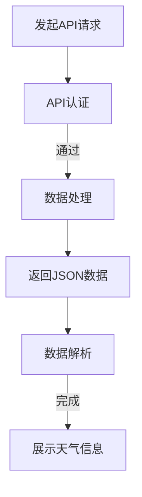

                 

### 第三方天气查询平台对接：背景介绍与核心概念

#### 背景介绍

在信息化和数据驱动的今天，天气信息的应用已经渗透到我们生活的方方面面。无论是天气预报、旅行规划、农业管理，还是交通调度，都需要准确的天气数据。然而，建立和维护一个专业的天气监测和预测系统不仅成本高昂，而且需要大量的专业知识和资源。因此，越来越多的企业和开发者选择借助第三方天气查询平台来实现天气数据的获取和集成。

第三方天气查询平台，如OpenWeatherMap、WeatherAPI、和和风天气等，提供了便捷的天气数据查询接口。这些平台不仅覆盖了全球大部分地区的天气信息，而且提供了丰富的数据格式和多样化的服务，如实时天气、天气预报、历史天气数据等。通过这些平台，开发者可以快速接入天气服务，为自身应用添加天气预报、空气质量监测等实用功能。

本文将探讨如何对接第三方天气查询平台，实现天气数据的获取和整合。我们将从核心概念出发，逐步深入到实际操作，帮助读者理解整个对接过程，并解决其中可能遇到的问题。

#### 核心概念

在对接第三方天气查询平台之前，我们需要了解一些核心概念，这些概念将帮助我们更好地理解平台的工作原理以及如何进行对接。

1. **API（应用程序编程接口）**：API是不同软件之间互相通信的接口。它定义了请求的结构、数据格式和响应的格式。对接第三方天气查询平台，就是通过调用其API来获取天气数据。

2. **HTTP请求**：在互联网上，应用程序之间通过HTTP请求进行通信。HTTP请求包括GET和POST两种方式，其中GET请求常用于查询数据，而POST请求则用于提交数据。

3. **JSON格式**：JSON（JavaScript Object Notation）是一种轻量级的数据交换格式，易于阅读和编写，同时也易于机器解析和生成。第三方天气查询平台通常使用JSON格式返回数据。

4. **API密钥**：大多数第三方天气查询平台要求用户注册并获得一个API密钥，用于身份验证和权限控制。每次调用API时，都需要在请求中包含这个密钥。

5. **RESTful API**：RESTful API是一种基于HTTP协议的API设计风格，它使用GET、POST、PUT、DELETE等HTTP方法来执行不同的操作。第三方天气查询平台的API通常遵循RESTful风格。

#### 本文结构

本文将分为以下几个部分：

1. **核心概念与联系**：通过Mermaid流程图展示第三方天气查询平台的核心概念和架构。
2. **核心算法原理 & 具体操作步骤**：深入讲解如何使用API进行天气数据查询。
3. **数学模型和公式 & 详细讲解 & 举例说明**：介绍API调用过程中可能用到的数学模型和公式。
4. **项目实战：代码实际案例和详细解释说明**：通过具体的代码示例，展示如何对接第三方天气查询平台。
5. **实际应用场景**：分析第三方天气查询平台在不同应用场景中的使用方法。
6. **工具和资源推荐**：推荐学习资源和开发工具。
7. **总结：未来发展趋势与挑战**：总结本文内容，并探讨未来的发展趋势和挑战。

通过本文的学习，读者将能够掌握第三方天气查询平台的对接方法，并在实际项目中应用这些知识。

### 核心概念与联系：第三方天气查询平台的架构解析

在了解第三方天气查询平台的基本概念之后，接下来我们将深入探讨其核心概念和架构，以便更好地理解其工作原理。这里，我们将使用Mermaid流程图来详细展示第三方天气查询平台的核心流程和节点。

首先，让我们定义一些关键的流程节点：

1. **API请求**：用户通过应用程序发起对天气查询平台的API请求。
2. **API认证**：请求经过认证，确保用户拥有合法的API密钥。
3. **数据处理**：天气查询平台处理请求，根据请求的参数返回相应的天气数据。
4. **数据格式**：天气数据通常以JSON格式返回，包含丰富的天气信息。
5. **数据解析**：用户应用程序对返回的JSON数据进行解析，提取所需的信息。

下面是具体的Mermaid流程图：



#### 流程解析

**1. 发起API请求（A）**

用户应用程序（可以是网站、移动应用或后台系统）首先需要向第三方天气查询平台发起一个API请求。这个请求可以是通过HTTP GET或POST方法发送的，具体取决于API的指定。

**2. API认证（B）**

在请求中，用户需要包含一个API密钥，这是第三方天气查询平台用于身份验证的一个唯一标识。这个步骤确保只有拥有正确密钥的用户才能访问天气数据。

**3. 数据处理（C）**

第三方天气查询平台接收到请求后，会根据请求的参数（如城市名称、日期等）处理请求。平台内部拥有庞大的天气数据存储和处理机制，能够快速响应用户的查询需求。

**4. 返回JSON数据（D）**

处理完成后，第三方天气查询平台会将查询结果以JSON格式返回。JSON格式具有结构清晰、易于解析的特点，非常适合用于API的数据交换。

**5. 数据解析（E）**

用户应用程序需要解析返回的JSON数据，提取出需要的信息。例如，天气状况、温度、湿度等。

**6. 展示天气信息（F）**

最后，用户应用程序将解析得到的信息展示给用户，如显示在网页上、移动应用的用户界面上，或以其他形式展现。

通过上述流程，第三方天气查询平台能够高效、安全地为用户提供准确的天气数据。接下来，我们将详细讲解如何实现这一过程。

### 核心算法原理 & 具体操作步骤：API调用实战

在了解了第三方天气查询平台的核心概念和架构之后，接下来我们将深入探讨如何具体操作这些API，以实现天气数据的获取。以下是详细的API调用步骤，包括请求的构建、发送以及数据解析。

#### 步骤1：选择合适的天气查询平台

首先，我们需要选择一个合适的第三方天气查询平台，如OpenWeatherMap。在选择平台时，我们需要考虑以下因素：

- **数据覆盖范围**：平台是否提供了我们所需地区的天气数据。
- **API响应速度**：平台API的响应速度是否足够快，以支持实时查询。
- **价格政策**：是否需要付费使用，以及价格是否合理。
- **文档支持**：平台提供的API文档是否详尽、易于理解。

以OpenWeatherMap为例，这是一个全球性的天气数据平台，提供实时天气、天气预报、历史天气数据等多种服务。其API文档详尽且易于使用。

#### 步骤2：注册并获得API密钥

注册并获取API密钥是使用第三方天气查询平台的第一步。以下是在OpenWeatherMap上注册并获得API密钥的步骤：

1. 访问OpenWeatherMap的官方网站（https://openweathermap.org/）。
2. 点击“Sign Up”按钮，使用电子邮件或社交媒体账号注册。
3. 注册完成后，登录账号并进入“API keys”页面。
4. 在该页面中，点击“New API key”按钮，创建一个新的API密钥。

记录下这个密钥，因为每次调用API时都需要使用它进行身份验证。

#### 步骤3：构建API请求

构建API请求是获取天气数据的关键步骤。以下是使用OpenWeatherMap API获取城市实时天气的基本步骤：

1. **确定请求方法**：OpenWeatherMap API主要使用GET方法进行数据查询。

2. **指定请求URL**：请求URL是API请求的地址，包含必要的参数。以下是一个示例请求URL：

   ```plaintext
   https://api.openweathermap.org/data/2.5/weather?q=北京&appid=您的API密钥
   ```

   其中，`q` 参数指定要查询的城市名称，`appid` 参数包含我们之前获取的API密钥。

3. **请求参数**：除了基本的请求URL，我们还可以添加额外的参数来定制请求。例如，可以添加参数 `units` 来指定温度单位（如`units=metric`表示使用摄氏度）。

#### 步骤4：发送API请求

使用编程语言（如Python）发送API请求是一个简单的过程。以下是一个Python代码示例，展示如何使用`requests`库发送GET请求：

```python
import requests

# API请求URL
url = "https://api.openweathermap.org/data/2.5/weather"
params = {
    'q': '北京',
    'appid': '您的API密钥',
    'units': 'metric'
}

# 发送API请求
response = requests.get(url, params=params)

# 检查响应状态码
if response.status_code == 200:
    # 解析响应数据
    data = response.json()
    print(data)
else:
    print("请求失败，状态码：", response.status_code)
```

这段代码将发送一个GET请求，并输出返回的JSON数据。如果响应状态码为200（HTTP状态码中的成功响应），则表示请求成功。

#### 步骤5：解析API响应

API响应通常以JSON格式返回，包含丰富的天气信息。以下是一个示例JSON响应：

```json
{
    "weather": [
        {
            "id": 800,
            "main": "Clear",
            "description": "晴朗",
            "icon": "01d"
        }
    ],
    "main": {
        "temp": 28.35,
        "feels_like": 28.86,
        "pressure": 1014,
        "humidity": 20,
        "temp_min": 28.35,
        "temp_max": 28.35
    },
    "visibility": 10000,
    "wind": {
        "speed": 1.5,
        "deg": 130
    },
    "clouds": {
        "all": 0
    },
    "dt": 1678947540,
    "sys": {
        "type": 1,
        "id": 12050,
        "country": "CN",
        "sunrise": 1678943686,
        "sunset": 1678962688
    },
    "name": "北京",
    "cod": 200
}
```

解析JSON数据可以使用Python的内置库`json`。以下是一个示例代码，用于解析上述JSON响应并提取关键信息：

```python
import json

# 假设response是API返回的JSON数据
data = response.json()

# 提取关键信息
weather_description = data['weather'][0]['description']
temp = data['main']['temp']
feels_like = data['main']['feels_like']

print(f"天气描述：{weather_description}")
print(f"温度：{temp}℃")
print(f"体感温度：{feels_like}℃")
```

通过这些步骤，我们就可以从第三方天气查询平台获取到所需的天气数据，并在我们的应用程序中进行展示。

### 数学模型和公式：API调用过程中的应用

在第三方天气查询平台的API调用过程中，有时会涉及到一些基础的数学模型和公式。这些模型和公式不仅有助于我们更好地理解和处理返回的数据，还可以在某些特定的应用场景中发挥关键作用。

#### 温度转换公式

在获取天气数据时，温度是一个重要的参数。不同的天气查询平台可能返回不同单位（如摄氏度或华氏度）的温度。在应用程序中，我们可能需要统一温度单位，以便更好地进行数据分析和展示。以下是一些常用的温度转换公式：

1. **摄氏度转华氏度**：

   $$
   F = \frac{9}{5}C + 32
   $$

   其中，$F$ 是华氏度，$C$ 是摄氏度。

2. **华氏度转摄氏度**：

   $$
   C = \frac{5}{9}(F - 32)
   $$

   其中，$F$ 是华氏度，$C$ 是摄氏度。

#### 风速转换公式

风速在天气数据中也是一个重要的参数。风速的单位通常是米每秒（m/s），但在某些应用中可能需要将其转换为其他单位，如英里每小时（mph）。以下是一个常用的风速转换公式：

$$
mph = \frac{1.94384 \times m/s}{0.44704}
$$

其中，$mph$ 是英里每小时，$m/s$ 是米每秒。

#### 相对湿度计算公式

相对湿度是衡量空气湿润程度的一个重要参数。它通常以百分比表示，可以通过以下公式计算：

$$
\text{相对湿度（%）} = \left(\frac{\text{实际水汽压}}{\text{同温度下的饱和水汽压}}\right) \times 100%
$$

其中，实际水汽压和饱和水汽压可以通过相应的气象公式计算得出。

#### 公式举例说明

假设我们从OpenWeatherMap获取到一个城市的天气数据，包含以下温度和风速：

- 温度（摄氏度）: 28.35°C
- 风速（米/秒）: 1.5 m/s

我们希望将这些数据转换为华氏度和英里每小时，并计算相对湿度。

1. **温度转换**：

   - 摄氏度转华氏度：

     $$
     F = \frac{9}{5} \times 28.35 + 32 = 83.33\degree F
     $$

     所以，温度转换为华氏度为83.33°F。

   - 风速转换（米/秒转英里每小时）：

     $$
     mph = \frac{1.94384 \times 1.5}{0.44704} = 3.36\text{ mph}
     $$

     所以，风速转换为英里每小时为3.36 mph。

2. **相对湿度计算**：

   假设实际水汽压为12 hPa，饱和水汽压为17 hPa，则相对湿度计算如下：

   $$
   \text{相对湿度（%）} = \left(\frac{12}{17}\right) \times 100\% \approx 70.59\%
   $$

   所以，相对湿度为70.59%。

通过上述数学模型和公式，我们可以更好地理解和处理第三方天气查询平台返回的天气数据，为我们的应用程序提供更准确和丰富的天气信息。

### 项目实战：代码实际案例和详细解释说明

在前面的章节中，我们详细介绍了第三方天气查询平台对接的理论知识和关键步骤。为了帮助读者更好地理解和掌握这些知识，下面我们将通过一个实际的项目案例来展示如何具体实现对接，并提供详细的代码解读和分析。

#### 1. 开发环境搭建

在开始项目实战之前，我们需要搭建一个合适的开发环境。这里，我们将使用Python作为主要编程语言，并结合`requests`库来发送HTTP请求。以下是搭建开发环境的步骤：

1. **安装Python**：确保已经安装了Python 3.x版本。可以从官方网站（https://www.python.org/）下载并安装。

2. **安装requests库**：在命令行中执行以下命令来安装requests库：

   ```bash
   pip install requests
   ```

3. **创建项目文件夹**：在合适的位置创建一个项目文件夹，并在其中创建一个名为`weather_query.py`的Python文件。

#### 2. 源代码详细实现和代码解读

以下是一个简单的Python代码示例，用于连接第三方天气查询平台（以OpenWeatherMap为例），获取某个城市的实时天气数据，并将其打印出来。

```python
import requests

# 配置API请求的URL
base_url = "https://api.openweathermap.org/data/2.5/weather"
api_key = "您的API密钥"  # 这里替换为您的实际API密钥

# 城市名称
city = "北京"

# 指定请求参数
params = {
    "q": city,
    "appid": api_key,
    "units": "metric"  # 指定温度单位为摄氏度
}

# 发送GET请求
response = requests.get(base_url, params=params)

# 检查响应状态码
if response.status_code == 200:
    # 获取并解析JSON数据
    data = response.json()
    # 提取关键信息
    weather_description = data['weather'][0]['description']
    temperature = data['main']['temp']
    feels_like = data['main']['feels_like']
    humidity = data['main']['humidity']

    # 打印天气信息
    print(f"城市：{city}")
    print(f"天气描述：{weather_description}")
    print(f"温度：{temperature}℃")
    print(f"体感温度：{feels_like}℃")
    print(f"湿度：{humidity}%")
else:
    print("请求失败，状态码：", response.status_code)

# 代码结束
```

下面是对这段代码的详细解读：

- **第一行**：引入`requests`库，用于发送HTTP请求。

- **第二行和第三行**：配置基础请求URL和API密钥。`base_url` 用于构建请求URL，`api_key` 用于API认证。

- **第四行**：设置要查询的城市名称。这里以“北京”为例。

- **第五行**：定义请求参数。`params` 字典包含`q`（查询的城市名称）、`appid`（API密钥）和`units`（温度单位，这里设置为“metric”即摄氏度）。

- **第七行**：使用`requests.get()`方法发送GET请求，参数为`base_url`和`params`。

- **第九行**：检查响应状态码。如果状态码为200（HTTP状态码中的成功响应），则表示请求成功。

- **第十行**：使用`response.json()`方法将响应内容解析为JSON格式。

- **第十一行**：提取关键信息，如天气描述、温度、体感温度和湿度。

- **第十二行至第十五行**：打印获取到的天气信息。

- **第十七行**：如果响应状态码不是200，则打印出错误信息。

通过这个实际案例，读者可以清晰地看到如何通过Python代码连接第三方天气查询平台，获取天气数据，并展示给用户。接下来，我们将进一步分析代码中的关键部分，以便更好地理解其工作原理。

#### 3. 代码解读与分析

为了更深入地理解上述代码，我们将对关键部分进行详细解读和分析。

- **请求URL和参数配置**：

  ```python
  base_url = "https://api.openweathermap.org/data/2.5/weather"
  api_key = "您的API密钥"
  city = "北京"
  params = {
      "q": city,
      "appid": api_key,
      "units": "metric"
  }
  ```

  这部分代码用于配置请求的基础信息。`base_url` 是请求的URL，由第三方天气查询平台提供。`api_key` 是我们之前获取的API密钥，用于身份验证。`city` 是要查询的城市名称，这里以“北京”为例。`params` 是请求参数的字典，包含了`q`（查询的城市名称）、`appid`（API密钥）和`units`（温度单位，这里设置为“metric”即摄氏度）。

- **发送GET请求**：

  ```python
  response = requests.get(base_url, params=params)
  ```

  `requests.get()`方法用于发送GET请求。`base_url` 和 `params` 作为参数传递给该方法，生成完整的请求URL。`response` 变量存储了服务器返回的响应对象。

- **检查响应状态码**：

  ```python
  if response.status_code == 200:
      # ...成功处理响应...
  else:
      print("请求失败，状态码：", response.status_code)
  ```

  通过检查响应状态码，我们可以判断请求是否成功。状态码200表示请求成功，其他状态码表示请求失败。如果状态码不是200，则会打印出错误信息。

- **解析响应数据**：

  ```python
  data = response.json()
  weather_description = data['weather'][0]['description']
  temperature = data['main']['temp']
  feels_like = data['main']['feels_like']
  humidity = data['main']['humidity']
  ```

  这部分代码使用`response.json()`方法将响应内容解析为JSON格式。解析后的数据存储在`data`变量中。然后，通过字典访问提取出关键信息，如天气描述、温度、体感温度和湿度。

- **打印天气信息**：

  ```python
  print(f"城市：{city}")
  print(f"天气描述：{weather_description}")
  print(f"温度：{temperature}℃")
  print(f"体感温度：{feels_like}℃")
  print(f"湿度：{humidity}%")
  ```

  这部分代码用于将提取出的天气信息打印出来，以便用户查看。

通过以上解读和分析，我们可以清楚地看到整个代码的工作流程，以及每个关键步骤的作用。这不仅有助于我们理解对接第三方天气查询平台的具体实现，也为后续的扩展和优化提供了基础。

### 实际应用场景：第三方天气查询平台的多种用法

第三方天气查询平台的应用场景非常广泛，可以满足不同领域的需求。以下是一些典型的实际应用场景，以及在这些场景下如何使用第三方天气查询平台：

#### 1. 移动应用和网站

移动应用和网站是第三方天气查询平台最常见的应用场景。开发者可以轻松地将天气信息集成到自己的应用程序或网站上，为用户提供实时的天气数据。例如，在手机应用中，可以显示当前城市的天气状况、温度、湿度等信息，并可根据用户的地理位置自动定位。在网站上，可以嵌入天气信息栏，实时更新天气状况，为用户带来更好的体验。

**实现方法**：
- 调用第三方天气查询平台的API，获取指定城市的天气数据。
- 将获取到的天气数据以合适的方式展示在应用界面或网站页面上。
- 定期更新天气数据，确保信息准确。

#### 2. 物流和交通调度

在物流和交通调度领域，天气信息对运输路线和时间的决策至关重要。例如，在货运行业中，需要根据天气状况调整运输路线，以避免因为恶劣天气导致的延误或交通事故。交通调度系统中，可以结合实时天气数据来优化公共交通线路和班次安排。

**实现方法**：
- 接入第三方天气查询平台，获取相关区域的实时天气数据。
- 结合天气预报和历史天气数据，预测未来天气状况。
- 根据天气变化动态调整运输路线和公共交通安排。

#### 3. 农业管理

农业管理中，天气信息对作物生长和灌溉计划的制定具有重要意义。农民可以参考天气数据来决定灌溉时间、施肥量和病虫害防治策略。例如，在干旱季节，可以依据天气预报来合理安排灌溉，提高水资源利用效率。

**实现方法**：
- 使用第三方天气查询平台获取当地的天气预报和实时天气数据。
- 分析天气数据，制定科学的灌溉和施肥计划。
- 根据天气变化及时调整农业管理策略，提高作物产量。

#### 4. 旅游规划

在旅游规划中，天气信息是游客决策的重要参考因素。旅行社和旅游平台可以提供旅游目的地的天气信息，帮助游客提前了解当地气候，做好相应的旅游准备。例如，在制定旅行计划时，可以根据天气数据来选择合适的时间出行，避免遇到极端天气。

**实现方法**：
- 通过第三方天气查询平台获取旅游目的地的天气预报和历史天气数据。
- 将天气信息展示在旅游平台或旅行社网站上，供游客参考。
- 根据天气变化及时更新旅游信息，确保游客的出行计划安全。

#### 5. 航空运输

航空运输行业对天气信息的依赖性极高。航空公司和机场需要实时获取天气预报和实时天气数据，以制定飞行计划、安排航班调度。例如，在恶劣天气条件下，需要根据天气数据调整飞行高度和航线，确保飞行安全。

**实现方法**：
- 接入第三方天气查询平台，获取机场所在地的实时天气数据。
- 结合天气预报，预测未来天气状况，为飞行计划和调度提供依据。
- 根据天气变化，动态调整飞行计划和航班安排。

#### 6. 智能家居

智能家居系统可以通过第三方天气查询平台获取实时天气信息，并根据天气状况自动调整家居设备。例如，在下雨天自动关闭露天区域的照明和门窗，开启室内空调或加湿器，为用户提供舒适的居住环境。

**实现方法**：
- 智能家居系统接入第三方天气查询平台，获取实时天气数据。
- 根据天气信息，通过智能家居控制系统自动调整相关设备，如窗帘、空调、加湿器等。
- 定期更新天气数据，确保家居环境与天气状况相适应。

通过以上实际应用场景的介绍，我们可以看到第三方天气查询平台在各个领域的广泛应用。开发者可以根据具体需求，灵活地使用这些平台提供的服务，为用户带来更便捷、智能的体验。

### 工具和资源推荐

在对接第三方天气查询平台时，选择合适的工具和资源能够极大地提升开发效率和项目质量。以下是一些推荐的工具、书籍、论文和网站资源，供开发者参考。

#### 1. 学习资源推荐

- **书籍**：
  - 《RESTful Web APIs》: 由Leonard Richardson编写的这本书是了解RESTful API设计的不二之选。
  - 《Python Web开发实战》：这本书详细介绍了使用Python进行Web开发的步骤和方法，对于新手友好。
  - 《用Python进行数据分析》：这本书涵盖了使用Python进行数据处理的多个方面，包括API数据的解析。

- **论文**：
  - 《一种基于天气的智能交通调度算法研究》：这篇论文探讨了如何结合天气数据优化交通调度策略，具有实际应用价值。
  - 《天气信息在物流中的应用研究》：该论文分析了天气信息在物流调度中的重要性，并提出了一些优化方案。

- **博客和网站**：
  - [OpenWeatherMap官方文档](https://openweathermap.org/api)：提供详细的API文档和教程，是学习使用OpenWeatherMap API的最佳资源。
  - [GitHub上的API项目](https://github.com/search?q=api)：GitHub上有大量的API项目，可以参考和借鉴。
  - [Stack Overflow](https://stackoverflow.com/): 对于API调用过程中遇到的问题，Stack Overflow通常能提供有效的解决方案。

#### 2. 开发工具框架推荐

- **框架**：
  - **Flask**：一个轻量级的Web应用框架，适合构建简单的天气查询接口。
  - **Django**：一个全栈的Web应用框架，适用于构建复杂的应用程序，包括天气数据展示和后端逻辑处理。

- **库**：
  - **requests**：用于发送HTTP请求的Python库，是调用API的常用工具。
  - **json**：Python内置的库，用于处理JSON数据，是解析API返回数据的必备工具。
  - **pandas**：用于数据分析和操作的Python库，可以方便地对天气数据进行清洗和可视化。

- **IDE**：
  - **PyCharm**：一款功能强大的Python集成开发环境，提供代码自动补全、调试和版本控制等功能。
  - **Visual Studio Code**：一个轻量级但功能丰富的代码编辑器，支持多种语言和插件，适合快速开发。

#### 3. 相关论文著作推荐

- **《天气信息服务的体系建设与应用》**：该论文详细介绍了天气信息服务体系的构建方法和应用场景，为第三方天气查询平台的建设提供了参考。
- **《基于大数据的天气预测方法研究》**：该论文探讨了如何利用大数据技术进行天气预测，为第三方天气查询平台提供了技术支持。

通过以上工具和资源的推荐，开发者可以更好地掌握第三方天气查询平台的对接方法，提升项目质量和用户体验。

### 总结：未来发展趋势与挑战

随着互联网和大数据技术的不断发展，第三方天气查询平台正成为现代应用中不可或缺的一部分。未来，这些平台将继续向更高效、更智能、更广泛的方向发展。

#### 发展趋势

1. **数据精度与实时性提升**：随着气象监测技术的进步，第三方天气查询平台将提供更加精确和实时的天气数据，满足用户对数据质量的高要求。

2. **服务多样化**：除了传统的天气查询服务，第三方平台将拓展更多功能，如空气质量监测、自然灾害预警等，提供更全面的服务。

3. **人工智能与机器学习应用**：利用人工智能和机器学习技术，平台将能够提供更精准的天气预报和预测分析，为用户带来更好的决策支持。

4. **全球化与本地化结合**：平台将进一步加强全球化布局，同时注重本地化服务，满足不同国家和地区的用户需求。

5. **无缝集成**：第三方天气查询平台将更加注重与各类应用的集成，提供API接口标准化、SDK支持等，方便开发者快速接入和使用。

#### 面临的挑战

1. **数据安全与隐私保护**：随着数据规模的扩大，如何保障用户数据安全和隐私成为一个重要挑战。平台需要采取严格的措施来保护用户数据。

2. **API滥用与限制**：随着API使用的普及，API滥用和超量请求的问题日益严重，平台需要制定合理的使用策略和限制措施。

3. **复杂性与可维护性**：随着功能的增加，平台的复杂度将不断提高，如何确保系统的可维护性和稳定性成为一个挑战。

4. **全球覆盖与数据获取**：尽管平台不断拓展，但在某些偏远或数据采集困难地区，如何获取高质量的天气数据仍是一个难题。

5. **技术更新与迭代**：随着技术的快速迭代，平台需要持续更新和优化，以保持其竞争力和用户体验。

总之，第三方天气查询平台在未来将继续面临诸多挑战，但通过不断创新和优化，这些平台将能够更好地服务于广大用户，为我们的生活带来更多便利。

### 附录：常见问题与解答

在对接第三方天气查询平台的过程中，开发者可能会遇到各种问题。以下是一些常见问题及其解答，以帮助用户更好地理解和解决这些问题。

#### 1. 为什么我的API请求总是失败？

API请求失败可能是由于以下原因：

- **API密钥错误**：请检查您的API密钥是否正确，确保没有输入错误或过期。
- **网络问题**：确保您的网络连接正常，可以访问第三方天气查询平台的API。
- **参数错误**：检查您的请求参数是否正确，包括城市名称、日期等。
- **请求超时**：如果请求长时间没有响应，可能是因为网络延迟或服务器负载过高。可以尝试稍后再试。

#### 2. 如何处理API请求频率限制？

大多数第三方天气查询平台都会对API请求进行频率限制，以防止滥用。以下是一些处理方法：

- **缓存数据**：在本地缓存已经获取的数据，减少对API的调用次数。
- **分批请求**：将大量请求分散到多个请求中，避免短时间内频繁调用。
- **使用API调用计划**：一些平台提供了API调用计划，允许用户按需调整调用频率。

#### 3. 如何获取历史天气数据？

大多数第三方天气查询平台都提供历史天气数据查询功能。以下是一般步骤：

- 访问平台的API文档，查找有关历史天气数据的查询方法。
- 使用适当的参数（如城市名称、日期范围）发起API请求。
- 解析返回的JSON数据，提取所需的历史天气信息。

#### 4. 如何在应用程序中展示天气数据？

以下是在应用程序中展示天气数据的一般步骤：

- 使用合适的库（如D3.js、Chart.js等）绘制天气数据图表。
- 根据用户的地理位置自动定位，或允许用户手动选择城市。
- 在用户界面上显示实时天气数据、天气预报和历史天气数据。

#### 5. 如何处理不同数据单位之间的转换？

在不同数据单位之间进行转换时，可以使用以下公式：

- **温度转换**（摄氏度转华氏度）：\( F = \frac{9}{5}C + 32 \)
- **风速转换**（米/秒转英里每小时）：\( mph = \frac{1.94384 \times m/s}{0.44704} \)
- **相对湿度计算**：\( \text{相对湿度（%）} = \left(\frac{\text{实际水汽压}}{\text{同温度下的饱和水汽压}}\right) \times 100\% \)

通过这些公式，开发者可以方便地在不同单位之间进行数据转换。

### 扩展阅读与参考资料

为了更深入地了解第三方天气查询平台的对接和应用，以下是一些扩展阅读和参考资料，供开发者参考：

- **书籍**：
  - 《RESTful API设计最佳实践》：由Chris Brandt和Russell Miles合著，详细介绍了如何设计和实现高效的RESTful API。
  - 《Python网络编程》：由Wesley J Chun编著，涵盖了Python网络编程的各个方面，包括HTTP请求的实现。

- **论文**：
  - 《基于云平台的天气信息服务研究》：该论文探讨了如何利用云计算技术构建天气信息服务系统，具有较高的参考价值。
  - 《天气信息在物流管理中的应用研究》：分析了天气信息在物流调度中的应用，提出了优化方案。

- **博客和网站**：
  - [OpenWeatherMap官方博客](https://openweathermap.org/blog/)：提供了关于OpenWeatherMap平台的各种更新和教程。
  - [Weatherstack官方文档](https://www.weatherstack.com/docs/)：详细介绍了Weatherstack API的使用方法。

通过阅读这些参考资料，开发者可以进一步提升自己的技能和知识，为实际项目提供更好的解决方案。

