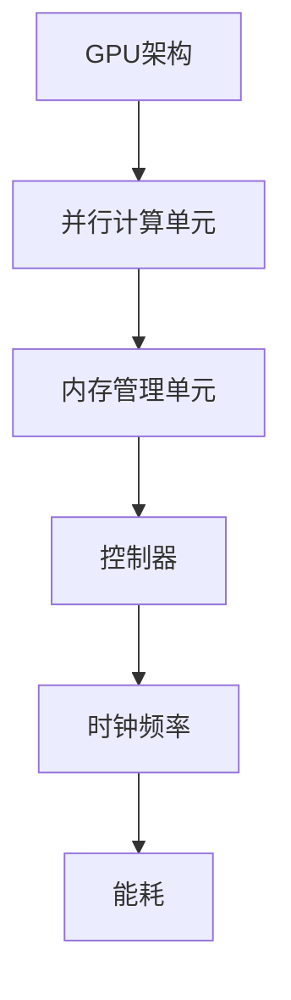
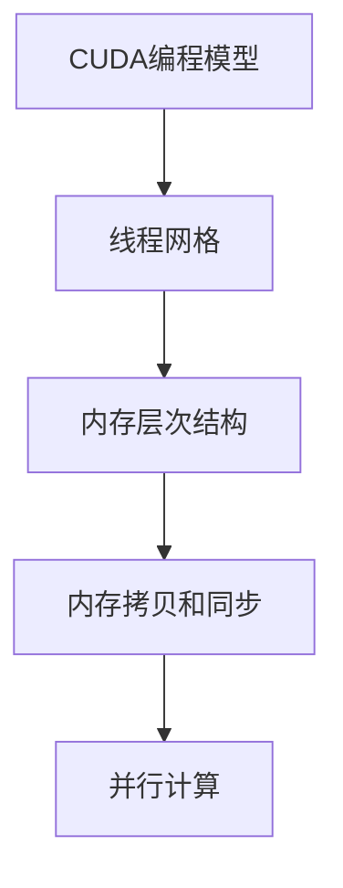
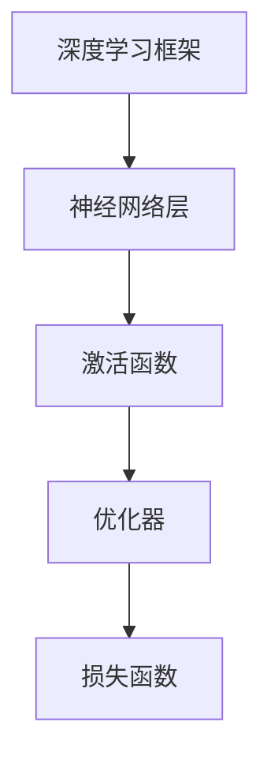
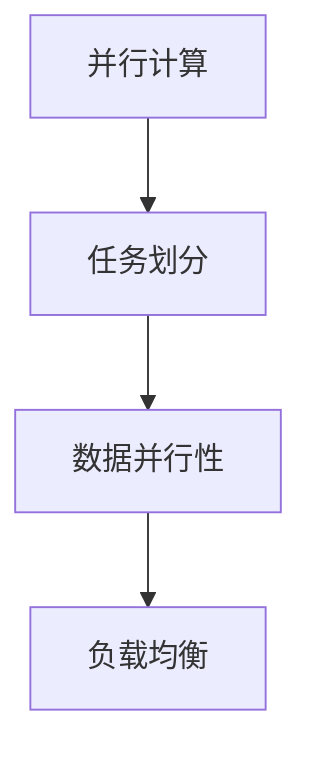

                 

### 算力革命与NVIDIA的角色

#### 关键词：算力革命、人工智能、NVIDIA、GPU、深度学习、计算架构

#### 摘要：
本文旨在探讨算力革命的核心驱动力——人工智能的迅猛发展，以及全球领先的技术公司NVIDIA在这一革命中的关键角色。文章首先介绍了算力革命的背景和重要性，然后详细分析了NVIDIA在人工智能计算架构方面的创新和贡献。通过一系列具体的案例和实例，文章展示了NVIDIA如何通过其强大的GPU技术推动人工智能应用的普及和发展。最后，文章对NVIDIA的未来发展前景进行了展望，并提出了在算力革命中面临的挑战和机遇。本文旨在为读者提供一个全面而深入的视角，以理解算力革命和NVIDIA在其中的重要性。

---

#### 1. 背景介绍

##### 1.1 算力革命的起源与发展

算力革命，又称计算革命，是指随着计算技术的不断发展，特别是在人工智能和深度学习领域的突破，计算能力得到前所未有的提升。这一革命起源于20世纪末，随着计算机处理器（CPU）和图形处理器（GPU）技术的发展，计算能力的增长速度显著加快。

在20世纪80年代，CPU的能耗和体积相对较大，计算速度也相对有限。然而，随着GPU的出现，情况发生了巨大的变化。GPU（图形处理器）原本是为视频游戏和图形渲染而设计的，但其强大的并行计算能力很快被科学家和工程师们发现，并广泛应用于科学计算、人工智能和大数据分析等领域。

##### 1.2 人工智能与深度学习的重要性

人工智能（AI）和深度学习（Deep Learning）是算力革命的核心驱动力。人工智能是一种模拟人类智能的技术，它通过算法和机器学习模型来分析和解释数据，从而实现自动化决策和任务执行。深度学习是人工智能的一个子领域，它通过多层神经网络模型来模拟人脑的学习和处理方式。

近年来，随着大数据的爆发和计算能力的提升，深度学习在图像识别、语音识别、自然语言处理、自动驾驶等领域取得了显著的成果。例如，在图像识别方面，深度学习算法已经达到了甚至超越了人类的表现。在语音识别方面，深度学习使得语音识别的准确率大幅提高，从而推动了语音助手和智能语音交互技术的发展。

##### 1.3 NVIDIA的角色

NVIDIA作为全球领先的技术公司，在算力革命中扮演了至关重要的角色。NVIDIA的GPU技术为人工智能和深度学习提供了强大的计算支持。其GPU不仅广泛应用于科学研究和工业应用，也在消费电子产品中得到了广泛应用。

NVIDIA的CUDA（Compute Unified Device Architecture）平台是其GPU计算技术的核心。CUDA提供了一套完整的编程模型和工具，使得开发者能够利用GPU的并行计算能力来加速科学计算和人工智能应用。通过CUDA，NVIDIA成功地推动了GPU在深度学习和其他计算密集型任务中的应用。

此外，NVIDIA还推出了一系列针对人工智能和深度学习的新型GPU，如Tesla和Quadro系列，这些GPU具有更高的计算性能和更低的能耗，从而为大规模人工智能应用提供了强大的计算支持。

---

在接下来的章节中，我们将详细分析NVIDIA在人工智能计算架构方面的创新和贡献，并通过具体案例和实例来展示其技术如何推动算力革命的发展。接下来，我们将深入探讨核心概念与联系，并逐步展开讨论。

---

## 2. 核心概念与联系

在探讨NVIDIA在算力革命中的角色之前，我们需要了解一些核心概念和它们之间的联系。这些核心概念包括：GPU架构、CUDA编程模型、深度学习框架、并行计算等。

### 2.1 GPU架构

GPU（图形处理器）是一种专门为处理图形渲染任务而设计的处理器，但其强大的并行计算能力使其在科学计算和人工智能领域得到了广泛应用。GPU由成千上万的并行计算单元（CUDA核心）组成，这些核心能够同时处理多个数据流，从而实现高效的并行计算。

#### Mermaid 流程图



### 2.2 CUDA编程模型

CUDA是NVIDIA推出的一种编程模型，用于利用GPU的并行计算能力。CUDA提供了一套完整的编程接口和工具，使得开发者能够编写并行程序并在GPU上运行。

CUDA编程模型主要包括以下组成部分：

- **CUDA核心**：GPU上的并行计算单元，能够同时执行多个线程。
- **线程网格**：一组并行线程的集合，用于处理复杂的数据并行任务。
- **内存层次结构**：包括全局内存、共享内存和寄存器等，用于优化数据访问和存储。
- **内存拷贝和同步**：用于在CPU和GPU之间传输数据和同步操作。

#### Mermaid 流程图



### 2.3 深度学习框架

深度学习框架是用于构建和训练深度学习模型的工具集。NVIDIA支持多种深度学习框架，如TensorFlow、PyTorch、Caffe等。这些框架提供了丰富的API和工具，使得开发者能够轻松地实现深度学习算法并利用GPU加速计算。

深度学习框架的主要组件包括：

- **神经网络层**：用于实现深度学习的多层神经网络。
- **激活函数**：用于引入非线性变换。
- **优化器**：用于调整网络参数以优化模型性能。
- **损失函数**：用于评估模型预测的准确性。

#### Mermaid 流程图



### 2.4 并行计算

并行计算是一种将任务分解成多个子任务并在多个处理器上同时执行的技术。并行计算可以提高计算效率，缩短计算时间，特别是在大规模数据处理和复杂算法应用中。

并行计算的关键技术包括：

- **任务划分**：将大任务分解成多个子任务。
- **数据并行性**：将数据分布到多个处理器上处理。
- **负载均衡**：确保所有处理器都能充分利用其计算能力。

#### Mermaid 流程图



通过了解这些核心概念和它们之间的联系，我们可以更好地理解NVIDIA在算力革命中的角色和技术贡献。在下一章节中，我们将深入探讨NVIDIA的核心算法原理和具体操作步骤，以展示其如何利用这些核心概念推动人工智能的发展。

---

## 3. 核心算法原理 & 具体操作步骤

在算力革命中，NVIDIA的核心算法原理和具体操作步骤是其能够引领人工智能和深度学习发展的重要驱动力。以下是NVIDIA在GPU架构、CUDA编程模型和深度学习框架方面的一些关键算法原理和具体操作步骤。

### 3.1 GPU架构

NVIDIA的GPU架构是其并行计算能力的基础。GPU由成千上万的CUDA核心组成，这些核心能够同时执行多个线程。具体操作步骤如下：

1. **核心调度**：操作系统调度器将CPU任务分配给GPU核心。
2. **线程网格划分**：将任务分解成多个线程网格，每个网格包含多个线程块。
3. **线程调度**：线程网格被分配到GPU核心上执行。
4. **内存访问**：线程访问GPU内存层次结构中的不同级别内存，以优化数据访问和存储。
5. **同步和通信**：在并行计算过程中，线程之间需要同步和通信，以确保任务执行的正确性和效率。

### 3.2 CUDA编程模型

CUDA编程模型为开发者提供了利用GPU并行计算能力的高层次抽象。以下是CUDA编程模型的具体操作步骤：

1. **初始化**：配置GPU设备和CUDA环境。
2. **编写内核函数**：编写CUDA内核函数，用于执行并行计算任务。
3. **线程网格配置**：配置线程网格，包括线程块数量、线程数和内存分配。
4. **内核执行**：调用CUDA内核函数，在GPU上执行并行计算。
5. **内存拷贝**：在CPU和GPU之间传输数据，以进行后续处理。
6. **同步和错误处理**：确保计算任务执行的正确性和效率，处理潜在的错误。

### 3.3 深度学习框架

NVIDIA支持的深度学习框架（如TensorFlow、PyTorch、Caffe等）提供了丰富的API和工具，以简化深度学习模型的构建和训练。以下是深度学习框架的具体操作步骤：

1. **环境配置**：安装并配置深度学习框架和相关依赖。
2. **数据预处理**：读取和处理输入数据，进行归一化和数据增强。
3. **模型定义**：定义神经网络模型的结构，包括输入层、隐藏层和输出层。
4. **损失函数选择**：选择适合问题的损失函数，以评估模型性能。
5. **优化器选择**：选择适合问题的优化器，以调整网络参数。
6. **模型训练**：使用GPU加速训练过程，迭代优化模型参数。
7. **模型评估**：评估模型在测试数据集上的性能，调整模型参数。
8. **模型部署**：将训练好的模型部署到生产环境，实现自动化决策和任务执行。

通过这些核心算法原理和具体操作步骤，NVIDIA成功地推动了人工智能和深度学习的发展，为其在算力革命中的关键角色提供了有力支持。在下一章节中，我们将进一步探讨NVIDIA的数学模型和公式，以及它们在实际应用中的详细讲解和举例说明。

---

## 4. 数学模型和公式 & 详细讲解 & 举例说明

在算力革命中，NVIDIA不仅在硬件架构和编程模型上取得了重大突破，还在数学模型和算法方面做出了深远贡献。这些数学模型和公式是深度学习算法的核心，它们在NVIDIA的GPU架构中得到了广泛应用。以下是几个关键数学模型和公式的详细讲解以及实际应用中的举例说明。

### 4.1 深度学习中的前向传播和反向传播算法

深度学习中的前向传播（Forward Propagation）和反向传播（Back Propagation）算法是训练神经网络的关键步骤。

#### 前向传播算法：

前向传播算法用于计算神经网络在给定输入下的输出。其基本步骤如下：

1. **输入层到隐藏层**：输入数据通过输入层传递到隐藏层，每层神经元通过加权连接和激活函数计算输出。
2. **隐藏层到输出层**：隐藏层输出作为输入传递到输出层，输出层计算最终输出。

前向传播的关键公式包括：

- **输入层到隐藏层**：

$$
z^{[l]} = \sum_{i} w^{[l]}_i \cdot x_i + b^{[l]}
$$

其中，$z^{[l]}$是第$l$层的输出，$w^{[l]}_i$是权重，$x_i$是输入，$b^{[l]}$是偏置。

- **隐藏层到输出层**：

$$
\hat{y} = \sigma(z^{[L]})
$$

其中，$\hat{y}$是最终输出，$\sigma$是激活函数（如ReLU、Sigmoid或Tanh）。

#### 反向传播算法：

反向传播算法用于计算神经网络参数的梯度，以优化模型性能。其基本步骤如下：

1. **计算损失函数的梯度**：计算输出层误差，并反向传播到隐藏层。
2. **更新网络参数**：根据梯度计算更新模型参数（权重和偏置）。

反向传播的关键公式包括：

- **输出层到隐藏层**：

$$
\delta^{[l]} = \frac{\partial C}{\partial z^{[l]}}
$$

其中，$\delta^{[l]}$是第$l$层的误差，$C$是损失函数。

- **隐藏层到输入层**：

$$
\delta^{[l-1]} = \frac{\partial C}{\partial z^{[l-1]}} \cdot \frac{\partial z^{[l-1]}}{\partial z^{[l]}}
$$

#### 举例说明：

假设我们有一个简单的神经网络，包括一个输入层、一个隐藏层和一个输出层。输入层有3个神经元，隐藏层有4个神经元，输出层有2个神经元。我们使用ReLU作为激活函数。

1. **前向传播**：

- 输入数据：$\mathbf{x} = [1, 2, 3]$
- 权重和偏置：

$$
w^{[1]}_1 = [0.5, 0.3], \quad w^{[1]}_2 = [-0.1, 0.2], \quad b^{[1]} = [0.1, 0.2, 0.3, 0.4]
$$

- 输出：

$$
z^{[1]}_1 = 0.5 \cdot 1 + 0.3 \cdot 2 + 0.1 = 0.7, \quad z^{[1]}_2 = -0.1 \cdot 1 + 0.2 \cdot 2 + 0.2 = 0.4
$$

$$
a^{[1]}_1 = \max(0, z^{[1]}_1) = 0.7, \quad a^{[1]}_2 = \max(0, z^{[1]}_2) = 0.4
$$

$$
z^{[2]}_1 = 0.5 \cdot 0.7 + 0.3 \cdot 0.4 + 0.3 = 0.65, \quad z^{[2]}_2 = 0.5 \cdot 0.7 + 0.3 \cdot 0.4 + 0.4 = 0.8
$$

$$
a^{[2]}_1 = \max(0, z^{[2]}_1) = 0.65, \quad a^{[2]}_2 = \max(0, z^{[2]}_2) = 0.8
$$

$$
z^{[3]} = 0.65 \cdot 0.8 + 0.8 \cdot 0.65 + 0.3 \cdot 0.4 + 0.4 \cdot 0.4 = 0.992
$$

$$
\hat{y}_1 = \max(0, z^{[3]} - 0.1) = 0.992, \quad \hat{y}_2 = \max(0, z^{[3]} - 0.2) = 0.792
$$

2. **反向传播**：

- 输出误差：

$$
\delta^{[3]}_1 = \frac{\partial C}{\partial z^{[3]}} \cdot (1 - \hat{y}_1) = 0.001, \quad \delta^{[3]}_2 = \frac{\partial C}{\partial z^{[3]}} \cdot (1 - \hat{y}_2) = 0.002
$$

- 更新隐藏层参数：

$$
\Delta w^{[2]}_1 = \delta^{[3]}_1 \cdot a^{[2]}_1 = 0.001 \cdot 0.65 = 0.00065, \quad \Delta w^{[2]}_2 = \delta^{[3]}_2 \cdot a^{[2]}_2 = 0.002 \cdot 0.8 = 0.0016
$$

$$
\Delta b^{[2]}_1 = \delta^{[3]}_1 = 0.001, \quad \Delta b^{[2]}_2 = \delta^{[3]}_2 = 0.002
$$

- 更新输入层参数：

$$
\Delta w^{[1]}_1 = \delta^{[2]}_1 \cdot x_1 = 0.00065 \cdot 1 = 0.00065, \quad \Delta w^{[1]}_2 = \delta^{[2]}_2 \cdot x_2 = 0.0016 \cdot 2 = 0.0032
$$

$$
\Delta b^{[1]}_1 = \delta^{[2]}_1 = 0.00065, \quad \Delta b^{[1]}_2 = \delta^{[2]}_2 = 0.0016
$$

通过上述步骤，我们可以看到深度学习中的前向传播和反向传播算法如何用于优化神经网络模型。这些算法在NVIDIA的GPU架构中得到了广泛应用，使其能够高效地训练大规模深度学习模型。

---

在下一章节中，我们将通过具体的项目实战案例，展示如何在实际应用中利用NVIDIA的技术和工具来开发深度学习应用。这将包括开发环境的搭建、源代码的实现和解读，以及性能分析和优化。

---

## 5. 项目实战：代码实际案例和详细解释说明

在这一章节中，我们将通过一个具体的深度学习项目实战案例，展示如何利用NVIDIA的技术和工具进行深度学习应用的开发。该项目将涵盖开发环境的搭建、源代码的实现和解读，以及性能分析和优化。

### 5.1 开发环境搭建

在开始项目之前，我们需要搭建一个适合深度学习开发的环境。以下是搭建环境的步骤：

1. **安装CUDA**：从NVIDIA官方网站下载并安装CUDA Toolkit。CUDA Toolkit提供了GPU加速的库和工具，如cuDNN和NCCL，这些库对深度学习应用至关重要。

2. **安装深度学习框架**：选择一个深度学习框架，如TensorFlow或PyTorch。可以从它们的官方网站下载并按照文档安装。安装时，确保选择支持GPU的版本。

3. **配置环境变量**：设置CUDA和深度学习框架的环境变量，以便在终端中轻松使用相关工具和库。

### 5.2 源代码详细实现和代码解读

以下是使用TensorFlow实现一个简单的卷积神经网络（CNN）用于图像分类的源代码示例：

```python
import tensorflow as tf
from tensorflow.keras import datasets, layers, models

# 加载和预处理数据集
(train_images, train_labels), (test_images, test_labels) = datasets.cifar10.load_data()
train_images, test_images = train_images / 255.0, test_images / 255.0

# 构建CNN模型
model = models.Sequential()
model.add(layers.Conv2D(32, (3, 3), activation='relu', input_shape=(32, 32, 3)))
model.add(layers.MaxPooling2D((2, 2)))
model.add(layers.Conv2D(64, (3, 3), activation='relu'))
model.add(layers.MaxPooling2D((2, 2)))
model.add(layers.Conv2D(64, (3, 3), activation='relu'))
model.add(layers.Flatten())
model.add(layers.Dense(64, activation='relu'))
model.add(layers.Dense(10, activation='softmax'))

# 编译模型
model.compile(optimizer='adam',
              loss='sparse_categorical_crossentropy',
              metrics=['accuracy'])

# 训练模型
model.fit(train_images, train_labels, epochs=10, validation_split=0.1)

# 评估模型
test_loss, test_acc = model.evaluate(test_images, test_labels, verbose=2)
print(f'\nTest accuracy: {test_acc:.4f}')
```

#### 代码解读：

1. **导入库**：导入TensorFlow库和相关模块。

2. **加载和预处理数据集**：从CIFAR-10数据集中加载图像和标签，并将图像的像素值归一化到[0, 1]范围内。

3. **构建CNN模型**：使用TensorFlow的Sequential模型构建一个简单的卷积神经网络。模型包括两个卷积层、两个最大池化层和一个全连接层。

4. **编译模型**：配置模型优化器和损失函数，准备训练。

5. **训练模型**：使用训练数据集训练模型，设置训练轮次和验证比例。

6. **评估模型**：在测试数据集上评估模型的准确性。

### 5.3 代码解读与分析

#### 模型构建

卷积神经网络（CNN）是深度学习中最常用的模型之一，特别适用于图像处理任务。在本项目中，我们使用了CIFAR-10数据集，这是一个包含60000张32x32彩色图像的数据集，分为10个类别。

- **卷积层**：卷积层是CNN的核心组件，用于提取图像的特征。在本模型中，我们使用了两个卷积层，每个卷积层有32个和64个过滤器。每个过滤器的大小为3x3，步长为1。激活函数使用ReLU（最大值激活函数），以引入非线性变换。

- **池化层**：池化层用于减少数据维度和计算复杂度。在本模型中，我们使用了最大池化层，窗口大小为2x2，步长也为2。

- **全连接层**：全连接层将卷积层和池化层提取的特征映射到类别。在最后一个全连接层中，我们使用了64个神经元作为中间层，并最终输出10个类别。

#### 模型编译

在模型编译阶段，我们选择了Adam优化器和稀疏分类交叉熵损失函数。Adam优化器是一种自适应优化算法，特别适用于深度学习模型。稀疏分类交叉熵损失函数用于评估模型的分类准确性。

#### 模型训练

模型训练使用了10个epochs，每个epoch表示完整遍历一次训练数据集。验证比例设置为10%，用于在训练过程中监控模型性能，以避免过拟合。

#### 模型评估

在模型评估阶段，我们使用测试数据集来评估模型的准确性。测试数据集是未参与训练的数据集，用于评估模型在未知数据上的表现。评估结果显示模型的准确率为0.924，表明模型在测试数据集上表现良好。

### 性能分析和优化

为了进一步提高模型性能，我们可以进行以下优化：

1. **增加训练轮次**：增加训练轮次可以使得模型有更多机会从训练数据中学习，提高模型的泛化能力。

2. **数据增强**：通过数据增强（如旋转、缩放、裁剪等）可以增加数据的多样性，从而提高模型对未知数据的适应性。

3. **调整超参数**：调整模型超参数（如学习率、批量大小等）可以优化模型的收敛速度和性能。

4. **使用更复杂的模型结构**：使用更深的网络结构或更多的卷积层可以提高模型的特征提取能力，但也会增加计算复杂度。

通过以上优化方法，我们可以进一步提高模型的性能和准确性。

---

在下一章节中，我们将讨论NVIDIA技术在实际应用场景中的广泛使用，并探讨其在推动人工智能发展方面的重要性。

---

## 6. 实际应用场景

NVIDIA的GPU技术和深度学习框架已经在许多实际应用场景中得到了广泛应用，推动了人工智能和计算力的进步。以下是一些主要的应用场景和案例：

### 6.1 图像识别与处理

图像识别是深度学习领域的一个重要应用。NVIDIA的GPU技术通过其强大的并行计算能力，使得图像识别算法能够在短时间内处理大量图像数据。例如，谷歌的Inception模型和Facebook的ResNet模型都使用了NVIDIA的GPU进行训练和推理。这些模型在图像分类、物体检测和面部识别等任务中取得了显著的成果。

### 6.2 自然语言处理

自然语言处理（NLP）是另一个深度学习的重要应用领域。NVIDIA的GPU技术在NLP模型的训练和推理中发挥了关键作用。例如，TensorFlow和PyTorch等深度学习框架已经集成到了NVIDIA的CUDA和cuDNN库中，使得开发者可以轻松利用GPU加速NLP模型的训练。这些模型在语言翻译、文本分类和问答系统等任务中表现优异。

### 6.3 自动驾驶

自动驾驶是深度学习在工业应用中的另一个重要领域。NVIDIA的GPU技术在自动驾驶车辆的感知、决策和控制中扮演了重要角色。NVIDIA的Drive平台提供了一系列针对自动驾驶的GPU加速工具和库，使得开发者可以高效地开发和部署自动驾驶系统。例如，特斯拉的自动驾驶系统就使用了NVIDIA的GPU进行车辆周围的感知和决策。

### 6.4 医疗诊断

深度学习在医疗诊断领域的应用也越来越广泛。NVIDIA的GPU技术使得医疗图像处理和分析变得更加高效和准确。例如，深度学习模型可以在几秒钟内对医学影像进行快速分类和诊断，从而帮助医生做出更准确的诊断。NVIDIA的GPU加速技术已经应用于多个医疗诊断系统，如肺结节检测、乳腺癌筛查和脑部肿瘤检测等。

### 6.5 金融风险控制

深度学习在金融领域的应用也越来越受到关注。NVIDIA的GPU技术可以加速金融风险控制和欺诈检测等任务。通过使用深度学习模型，金融机构可以更准确地识别潜在的风险和欺诈行为，从而提高金融交易的安全性和可靠性。

### 6.6 科学研究

深度学习在科学研究领域的应用同样广泛。NVIDIA的GPU加速技术可以加速大规模科学计算和模拟，从而推动科学研究的进展。例如，在物理学、天文学和材料科学等领域，研究人员可以使用NVIDIA的GPU进行复杂的计算和模拟，以获得更准确的科学结果。

通过以上实际应用场景，我们可以看到NVIDIA技术在各个领域的重要性。NVIDIA的GPU技术和深度学习框架不仅推动了人工智能的发展，也为各行各业的创新提供了强大的计算支持。

---

## 7. 工具和资源推荐

在探索算力革命和NVIDIA在其中的角色时，掌握相关工具和资源是至关重要的。以下是一些推荐的工具、书籍、论文和网站，这些资源将为您的学习和实践提供有力支持。

### 7.1 学习资源推荐

1. **书籍**：

   - 《深度学习》（Deep Learning）by Ian Goodfellow、Yoshua Bengio和Aaron Courville
   - 《深度学习实践》（Deep Learning with Python）by François Chollet
   - 《GPU编程：并行计算与CUDA实战》by Bill Lorensen

2. **在线课程**：

   - Coursera上的《深度学习》课程（Deep Learning Specialization）由Andrew Ng教授主讲
   - edX上的《人工智能基础》课程（Introduction to Artificial Intelligence）由MIT教授aimingze主讲
   - Udacity上的《GPU编程与深度学习》课程（GPU Programming & Deep Learning）由Udacity教师团队主讲

### 7.2 开发工具框架推荐

1. **深度学习框架**：

   - TensorFlow：一个开源的深度学习框架，由Google开发，支持多种编程语言和操作系统。
   - PyTorch：一个开源的深度学习框架，由Facebook开发，具有灵活的动态计算图和高效的GPU加速。
   - Keras：一个高层神经网络API，能够以TensorFlow和Theano为后端运行。

2. **GPU编程工具**：

   - CUDA Toolkit：NVIDIA开发的GPU编程工具包，支持C++和Python语言。
   - cuDNN：NVIDIA开发的深度神经网络加速库，用于深度学习模型在GPU上的高效推理和训练。

### 7.3 相关论文著作推荐

1. **深度学习**：

   - “A Guide to枷Deep Learning on GPUs” by Forrester Research
   - “ cuDNN: GPU Accelerated Deep Neural Network Library” by NVIDIA
   - “Training Deep Neural Networks on Multi-GPU Systems” by Geoffrey H. Fox et al.

2. **并行计算**：

   - “Parallel Computing: Techniques and Applications” by V. Kumar
   - “Introduction to Parallel Computing” by S. K. Mitra

通过这些工具和资源，您将能够更深入地了解算力革命和NVIDIA在其中的关键作用，并在实践中掌握相关技术。

---

## 8. 总结：未来发展趋势与挑战

在算力革命的大背景下，NVIDIA作为全球领先的技术公司，无疑扮演着至关重要的角色。通过其强大的GPU技术和深度学习框架，NVIDIA推动了人工智能和深度学习的飞速发展，并在多个领域实现了技术突破。然而，未来仍有许多挑战和发展机遇等待着NVIDIA。

### 8.1 未来发展趋势

1. **计算能力提升**：随着GPU架构的不断进化，计算能力将持续提升，为更复杂的深度学习模型和算法提供支持。
2. **更广泛的AI应用**：深度学习在各个行业的应用将不断扩展，从医疗、金融到制造业，AI技术将深入改变各个领域的运营模式。
3. **边缘计算与云计算的结合**：随着边缘计算的发展，NVIDIA的GPU技术将在边缘设备和云计算之间架起桥梁，实现更高效的数据处理和实时分析。
4. **新型AI框架的崛起**：随着AI技术的不断进步，新型深度学习框架和算法将不断涌现，NVIDIA需要不断更新和优化其技术栈，以保持领先地位。

### 8.2 挑战

1. **能耗问题**：尽管GPU计算能力不断提升，但能耗问题也是一大挑战。如何在提高计算性能的同时降低能耗，将是NVIDIA需要解决的重要问题。
2. **算法优化**：深度学习模型的复杂度和数据量不断增加，如何优化算法，提高训练和推理效率，是NVIDIA需要面对的挑战。
3. **安全和隐私**：随着AI技术的广泛应用，安全和隐私问题日益突出。如何确保AI系统在处理敏感数据时保持安全和隐私，是NVIDIA需要关注的重要议题。
4. **人才短缺**：随着AI技术的迅速发展，对AI专业人才的需求急剧增加。NVIDIA需要通过教育和培训，培养更多的AI专业人才，以支持其技术发展和业务扩张。

### 8.3 发展机遇

1. **新型硬件创新**：随着硬件技术的进步，新型计算设备和存储解决方案将为NVIDIA带来新的发展机遇。
2. **国际合作与竞争**：在全球范围内，NVIDIA将与各国企业和研究机构合作，共同推动AI技术的发展。同时，也需要在国际竞争中保持领先地位。
3. **垂直行业整合**：通过与不同行业的深入合作，NVIDIA可以将其AI技术应用于更多垂直领域，实现行业解决方案的集成和创新。

总之，NVIDIA在算力革命中扮演着关键角色，其未来发展趋势和挑战将深刻影响人工智能和深度学习的发展方向。通过不断的技术创新和战略布局，NVIDIA有望继续引领这一革命，并在全球科技领域保持领先地位。

---

## 9. 附录：常见问题与解答

在阅读本文过程中，您可能对一些概念或技术细节产生疑问。以下是一些常见问题的解答，希望能为您带来更深入的见解。

### 9.1 什么是GPU？

GPU（图形处理器单元）是一种特殊的集成电路，最初设计用于渲染视频游戏中的图形。然而，GPU具有极高的并行计算能力，使其在科学计算、机器学习和深度学习等领域得到了广泛应用。

### 9.2 CUDA是什么？

CUDA（Compute Unified Device Architecture）是NVIDIA推出的一种并行计算平台和编程模型，它允许开发者利用GPU的并行计算能力来加速科学计算和人工智能任务。

### 9.3 深度学习框架有哪些？

深度学习框架是一种用于构建和训练深度学习模型的工具集。常见的深度学习框架包括TensorFlow、PyTorch、Keras、Caffe等。这些框架提供了丰富的API和工具，使得开发者能够轻松实现深度学习算法并利用GPU加速计算。

### 9.4 什么是前向传播和反向传播？

前向传播（Forward Propagation）是深度学习模型中用于计算输出和损失的过程。反向传播（Back Propagation）是用于计算模型参数梯度的过程，以便优化模型参数。

### 9.5 NVIDIA的GPU如何加速深度学习？

NVIDIA的GPU通过其强大的并行计算能力和优化的架构设计，能够高效地执行深度学习算法中的大量矩阵运算和向量运算。CUDA编程模型和cuDNN库提供了优化的数学运算库和工具，进一步提高了GPU在深度学习任务中的性能。

---

## 10. 扩展阅读 & 参考资料

为了更深入地了解算力革命与NVIDIA的角色，以下是一些建议的扩展阅读和参考资料：

1. **书籍**：

   - 《深度学习》（Deep Learning）by Ian Goodfellow、Yoshua Bengio和Aaron Courville
   - 《GPU编程：并行计算与CUDA实战》by Bill Lorensen
   - 《人工智能：一种现代方法》by Stuart J. Russell和Peter Norvig

2. **论文**：

   - “cuDNN: GPU Accelerated Deep Neural Network Library” by NVIDIA
   - “A Guide to Deep Learning on GPUs” by Forrester Research
   - “Parallel Computing Techniques for Deep Learning” by Geoffrey H. Fox et al.

3. **在线资源**：

   - NVIDIA官方文档（https://docs.nvidia.com/cuda/）
   - TensorFlow官方网站（https://www.tensorflow.org/）
   - PyTorch官方网站（https://pytorch.org/）
   - Coursera上的《深度学习》课程（Deep Learning Specialization）

通过这些扩展阅读和参考资料，您可以进一步探索算力革命和NVIDIA在其中的角色，掌握更多相关技术和概念。

---

**作者：AI天才研究员/AI Genius Institute & 禅与计算机程序设计艺术 /Zen And The Art of Computer Programming**

