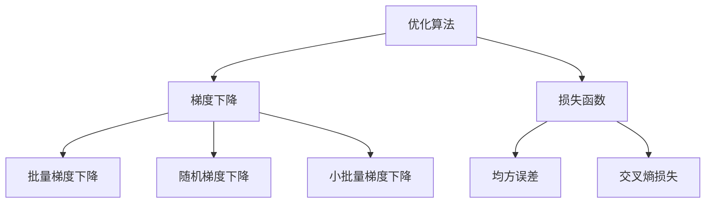

                 

### 1. 背景介绍

在当今快速发展的信息技术时代，人工智能（AI）已经成为推动科技进步和社会发展的关键力量。随着大数据、云计算和深度学习技术的不断成熟，AI 的应用领域越来越广泛，从自动驾驶、智能医疗到智能家居、金融风控，无不展现出其强大的潜力和变革能力。然而，随着 AI 技术的不断演进，如何提高算法的效率和精度，成为了研究者们亟需解决的重要问题。

算法优化作为提高 AI 算法性能的核心手段，近年来受到了广泛关注。算法优化不仅能够提升模型的计算效率和资源利用率，还能在保证精度的前提下降低计算成本，从而推动 AI 技术在实际应用中的普及和深入。特别是在 AI 2.0 时代，随着模型复杂度和数据规模的持续增长，算法优化显得尤为关键。

本文旨在探讨算法优化在 AI 2.0 中的应用和重要性，通过深入分析核心算法原理、数学模型、实际应用场景以及未来发展趋势，帮助读者全面了解和掌握算法优化技术。文章将从以下几个方面展开：

1. **核心概念与联系**：介绍算法优化的核心概念，包括优化算法、损失函数、梯度下降等，并通过 Mermaid 流程图展示其相互关系。
2. **核心算法原理与具体操作步骤**：详细解析常见的优化算法，如梯度下降、动量优化、Adam 优化等，以及如何在实际应用中进行操作。
3. **数学模型和公式**：介绍与算法优化相关的数学模型和公式，并通过具体例子进行详细讲解。
4. **项目实战**：通过实际代码案例，展示如何在实际项目中应用算法优化，包括开发环境搭建、源代码实现和代码解读。
5. **实际应用场景**：探讨算法优化在不同领域的应用，如深度学习、强化学习、自然语言处理等。
6. **工具和资源推荐**：推荐相关的学习资源、开发工具和论文著作，帮助读者进一步学习和研究。
7. **总结：未来发展趋势与挑战**：总结算法优化在 AI 2.0 中的发展趋势和面临的挑战，展望未来的研究方向。

通过本文的阅读，读者将能够系统掌握算法优化的基本原理和应用方法，为在实际项目中应用 AI 技术打下坚实基础。

### 2. 核心概念与联系

在探讨算法优化的过程中，我们需要首先了解几个核心概念，包括优化算法、损失函数、梯度下降等，并通过 Mermaid 流程图展示它们之间的相互关系。

#### 2.1 优化算法

优化算法是一类旨在找到函数最小值或最大值的算法。在 AI 领域，优化算法主要用于调整模型的参数，以最小化预测误差或最大化预测准确率。常见的优化算法包括梯度下降（Gradient Descent）、动量优化（Momentum）、Adam 优化（Adam Optimization）等。

**梯度下降**：梯度下降是最常见的优化算法之一，其基本思想是通过计算损失函数的梯度，逐步调整模型参数，以减少损失函数的值。具体步骤如下：

1. 初始化参数 $\theta_0$。
2. 选择学习率 $\eta$。
3. 计算梯度 $\nabla J(\theta)$。
4. 更新参数 $\theta = \theta - \eta \nabla J(\theta)$。

**动量优化**：动量优化是梯度下降的一种改进，通过引入动量参数 $m$，将当前梯度与前一次梯度进行加权平均，以加快收敛速度。具体步骤如下：

1. 初始化参数 $\theta_0$ 和动量参数 $m_0$。
2. 选择学习率 $\eta$ 和动量参数 $\beta$。
3. 计算梯度 $\nabla J(\theta)$。
4. 更新动量参数 $m = \beta m + (1 - \beta) \nabla J(\theta)$。
5. 更新参数 $\theta = \theta - \eta m$。

**Adam 优化**：Adam 优化是结合了动量优化和 RMSprop 优化的自适应梯度优化方法，适用于稀疏数据。具体步骤如下：

1. 初始化参数 $\theta_0$、动量参数 $m_0$ 和偏差修正参数 $v_0$。
2. 选择学习率 $\eta$、动量参数 $\beta_1$ 和 $\beta_2$。
3. 计算梯度 $\nabla J(\theta)$。
4. 更新动量参数 $m = \beta_1 m + (1 - \beta_1) \nabla J(\theta)$。
5. 更新偏差修正参数 $v = \beta_2 v + (1 - \beta_2) \nabla^2 J(\theta)$。
6. 更新参数 $\theta = \theta - \eta \frac{m}{\sqrt{v} + \epsilon}$。

#### 2.2 损失函数

损失函数是衡量模型预测值与真实值之间差异的函数。在优化过程中，我们的目标是找到使损失函数最小的参数。常见的损失函数包括均方误差（MSE）、交叉熵损失（Cross-Entropy Loss）等。

**均方误差（MSE）**：均方误差是最常用的损失函数之一，计算预测值与真实值之间差的平方的平均值。具体公式如下：

$$MSE = \frac{1}{n} \sum_{i=1}^{n} (\hat{y}_i - y_i)^2$$

其中，$\hat{y}_i$ 是预测值，$y_i$ 是真实值，$n$ 是样本数量。

**交叉熵损失（Cross-Entropy Loss）**：交叉熵损失用于分类问题，计算实际输出与期望输出之间的差异。具体公式如下：

$$Cross-Entropy Loss = -\frac{1}{n} \sum_{i=1}^{n} y_i \log(\hat{y}_i)$$

其中，$y_i$ 是真实标签，$\hat{y}_i$ 是预测概率。

#### 2.3 梯度下降

梯度下降是一种基于梯度信息的优化方法，其核心思想是沿着损失函数的梯度方向调整参数，以减少损失函数的值。梯度下降可以分为以下几种类型：

**批量梯度下降（Batch Gradient Descent）**：批量梯度下降使用所有样本的梯度信息进行参数更新。具体步骤如下：

1. 初始化参数 $\theta_0$。
2. 选择学习率 $\eta$。
3. 计算梯度 $\nabla J(\theta)$。
4. 更新参数 $\theta = \theta - \eta \nabla J(\theta)$。
5. 重复步骤 3-4，直到收敛。

**随机梯度下降（Stochastic Gradient Descent，SGD）**：随机梯度下降使用单个样本的梯度信息进行参数更新。具体步骤如下：

1. 初始化参数 $\theta_0$。
2. 选择学习率 $\eta$。
3. 对于每个样本 $(x_i, y_i)$，计算梯度 $\nabla J(\theta; x_i, y_i)$。
4. 更新参数 $\theta = \theta - \eta \nabla J(\theta; x_i, y_i)$。
5. 重复步骤 3-4，直到收敛。

**小批量梯度下降（Mini-batch Gradient Descent）**：小批量梯度下降使用部分样本（如 mini-batch）的梯度信息进行参数更新。具体步骤如下：

1. 初始化参数 $\theta_0$。
2. 选择学习率 $\eta$ 和 mini-batch 大小 $m$。
3. 对于每个 mini-batch，计算梯度 $\nabla J(\theta; \text{mini-batch})$。
4. 更新参数 $\theta = \theta - \eta \nabla J(\theta; \text{mini-batch})$。
5. 重复步骤 3-4，直到收敛。

#### 2.4 Mermaid 流程图

为了更清晰地展示优化算法、损失函数和梯度下降之间的关系，我们可以使用 Mermaid 流程图。以下是一个示例：



通过上述核心概念与联系的分析，我们可以更好地理解算法优化的基本原理和实际应用。接下来，我们将深入探讨核心算法原理与具体操作步骤，帮助读者掌握算法优化的关键技术。

#### 2.5 核心算法原理 & 具体操作步骤

在了解了算法优化的核心概念和相互关系后，我们需要进一步探讨几种常见的优化算法，包括梯度下降、动量优化和 Adam 优化，并详细描述它们的具体操作步骤。这些算法在 AI 2.0 时代中扮演着至关重要的角色，通过合理的应用和调整，可以显著提高算法的效率和精度。

##### 2.5.1 梯度下降（Gradient Descent）

梯度下降是优化算法中最基本的方法，其核心思想是通过计算损失函数的梯度，不断更新参数以最小化损失函数。以下是梯度下降的具体操作步骤：

1. **初始化参数**：首先，我们需要初始化模型的参数 $\theta_0$，可以选择随机初始化或在某些情况下使用预训练模型。
2. **选择学习率**：学习率 $\eta$ 是控制参数更新步长的参数，其值需要通过实验调整。学习率过大可能导致无法收敛，过小则收敛速度过慢。
3. **计算梯度**：在当前参数下，计算损失函数的梯度 $\nabla J(\theta)$，这是梯度下降的关键步骤。梯度方向指示了损失函数下降最快的方向。
4. **更新参数**：根据梯度信息更新参数 $\theta$，公式如下：

$$\theta = \theta - \eta \nabla J(\theta)$$

5. **迭代**：重复步骤 3-4，直到满足收敛条件（如损失函数变化很小或达到最大迭代次数）。

##### 2.5.2 动量优化（Momentum）

动量优化是梯度下降的一种改进，通过引入动量参数 $m$，可以加快收敛速度并减少波动。以下是动量优化的具体操作步骤：

1. **初始化参数**：与梯度下降相同，初始化参数 $\theta_0$ 和动量参数 $m_0$。
2. **选择学习率**：选择学习率 $\eta$ 和动量参数 $\beta$（通常取值在 0.9 到 0.99 之间）。
3. **计算梯度**：计算当前参数下的梯度 $\nabla J(\theta)$。
4. **更新动量参数**：根据当前梯度更新动量参数 $m$，公式如下：

$$m = \beta m + (1 - \beta) \nabla J(\theta)$$

5. **更新参数**：使用更新后的动量参数 $m$ 更新参数 $\theta$，公式如下：

$$\theta = \theta - \eta m$$

6. **迭代**：重复步骤 3-5，直到满足收敛条件。

动量优化通过累积梯度信息，可以减少在某些局部最小值附近的振荡，加快收敛速度。

##### 2.5.3 Adam 优化（Adam Optimization）

Adam 优化是结合了动量优化和 RMSprop 优化的自适应梯度优化方法，特别适用于稀疏数据。以下是 Adam 优化的具体操作步骤：

1. **初始化参数**：初始化参数 $\theta_0$、动量参数 $m_0$ 和偏差修正参数 $v_0$。
2. **选择学习率**：选择学习率 $\eta$、动量参数 $\beta_1$ 和 $\beta_2$（通常取值在 0.9 和 0.99 之间）。
3. **计算梯度**：计算当前参数下的梯度 $\nabla J(\theta)$。
4. **更新动量参数**：根据当前梯度更新动量参数 $m$，公式如下：

$$m = \beta_1 m + (1 - \beta_1) \nabla J(\theta)$$

5. **更新偏差修正参数**：计算偏差修正参数 $v$，公式如下：

$$v = \beta_2 v + (1 - \beta_2) \nabla^2 J(\theta)$$

6. **更新参数**：使用更新后的动量参数 $m$ 和偏差修正参数 $v$ 更新参数 $\theta$，公式如下：

$$\theta = \theta - \eta \frac{m}{\sqrt{v} + \epsilon}$$

其中，$\epsilon$ 是一个很小的常数，用于避免除以零。

7. **迭代**：重复步骤 3-6，直到满足收敛条件。

Adam 优化通过自适应调整学习率和动量参数，可以在不同数据分布下表现出良好的性能。

##### 2.5.4 对比分析

以下是三种优化算法的对比分析：

| 优化算法 | 特点 | 优点 | 缺点 |  
| --- | --- | --- | --- |  
| 梯度下降 | 简单，易于实现 | 收敛速度相对较慢 | 容易陷入局部最小值 |  
| 动量优化 | 引入动量，减少振荡 | 加快收敛速度 | 需要存储额外参数 |  
| Adam 优化 | 结合动量和 RMSprop，自适应调整 | 适用于稀疏数据，性能稳定 | 需要存储更多参数 |

在实际应用中，可以根据问题的特点和数据分布选择合适的优化算法。例如，对于大型数据集和深度网络，Adam 优化通常表现出更好的性能。

通过上述对核心算法原理和具体操作步骤的详细描述，我们可以更好地理解算法优化的方法和策略。在接下来的部分，我们将进一步探讨算法优化在不同领域的应用，以及如何在实际项目中应用这些优化算法。

### 3. 数学模型和公式 & 详细讲解 & 举例说明

在深入探讨算法优化时，理解相关的数学模型和公式是至关重要的。这不仅有助于我们准确地描述优化过程，还可以帮助我们更好地调整参数，以实现最佳的优化效果。在本节中，我们将介绍与算法优化相关的几个关键数学模型和公式，并通过具体的例子进行详细讲解。

#### 3.1 损失函数

损失函数是衡量模型预测值与真实值之间差异的重要工具。常见的损失函数包括均方误差（MSE）和交叉熵损失（Cross-Entropy Loss）。

**均方误差（MSE）**

均方误差是最常用的回归问题损失函数，用于衡量预测值与真实值之间差的平方的平均值。其数学公式如下：

$$MSE = \frac{1}{n} \sum_{i=1}^{n} (\hat{y}_i - y_i)^2$$

其中，$\hat{y}_i$ 是第 $i$ 个样本的预测值，$y_i$ 是第 $i$ 个样本的真实值，$n$ 是样本总数。

**交叉熵损失（Cross-Entropy Loss）**

交叉熵损失主要用于分类问题，计算实际输出与期望输出之间的差异。其数学公式如下：

$$Cross-Entropy Loss = -\frac{1}{n} \sum_{i=1}^{n} y_i \log(\hat{y}_i)$$

其中，$y_i$ 是第 $i$ 个样本的真实标签（通常是一个 one-hot 编码向量），$\hat{y}_i$ 是第 $i$ 个样本的预测概率分布。

#### 3.2 梯度下降（Gradient Descent）

梯度下降是一种迭代优化算法，其核心思想是通过计算损失函数的梯度来更新模型参数，从而最小化损失函数。

**梯度下降算法**

梯度下降算法的基本步骤如下：

1. **初始化参数**：随机初始化模型参数 $\theta$。
2. **计算梯度**：计算损失函数关于参数 $\theta$ 的梯度 $\nabla J(\theta)$。
3. **更新参数**：使用学习率 $\eta$ 更新参数 $\theta$，公式为：

$$\theta = \theta - \eta \nabla J(\theta)$$

4. **迭代**：重复步骤 2-3，直到收敛条件满足（如损失函数变化很小或达到最大迭代次数）。

**例子**

假设我们有一个线性回归模型，预测目标值为 $y = \theta_0 + \theta_1 x$，其中 $x$ 是输入特征，$y$ 是真实值，$\theta_0$ 和 $\theta_1$ 是模型参数。

- **损失函数**：使用均方误差（MSE）作为损失函数：

$$MSE = \frac{1}{n} \sum_{i=1}^{n} (\hat{y}_i - y_i)^2$$

- **梯度**：计算损失函数关于参数 $\theta_0$ 和 $\theta_1$ 的梯度：

$$\nabla J(\theta_0) = -\frac{1}{n} \sum_{i=1}^{n} (\hat{y}_i - y_i)$$

$$\nabla J(\theta_1) = -\frac{1}{n} \sum_{i=1}^{n} (\hat{y}_i - y_i) x_i$$

- **更新参数**：

$$\theta_0 = \theta_0 - \eta \nabla J(\theta_0)$$

$$\theta_1 = \theta_1 - \eta \nabla J(\theta_1)$$

#### 3.3 动量优化（Momentum）

动量优化是对梯度下降的一种改进，通过引入动量参数 $m$，可以减少参数更新的波动，加快收敛速度。

**动量优化算法**

动量优化算法的基本步骤如下：

1. **初始化参数**：随机初始化模型参数 $\theta$ 和动量参数 $m_0$。
2. **选择学习率**：选择学习率 $\eta$ 和动量参数 $\beta$（通常取值在 0.9 到 0.99 之间）。
3. **计算梯度**：计算损失函数关于参数 $\theta$ 的梯度 $\nabla J(\theta)$。
4. **更新动量参数**：根据当前梯度更新动量参数 $m$，公式为：

$$m = \beta m + (1 - \beta) \nabla J(\theta)$$

5. **更新参数**：使用更新后的动量参数 $m$ 更新参数 $\theta$，公式为：

$$\theta = \theta - \eta m$$

6. **迭代**：重复步骤 3-5，直到收敛条件满足。

**例子**

在动量优化中，我们使用动量参数 $m$ 来累积梯度信息，减少波动。假设当前动量参数为 $m$，梯度为 $\nabla J(\theta)$，动量参数为 $\beta$，学习率为 $\eta$，则更新过程如下：

- **更新动量参数**：

$$m = \beta m + (1 - \beta) \nabla J(\theta)$$

- **更新参数**：

$$\theta = \theta - \eta m$$

通过引入动量参数，动量优化可以更好地处理梯度波动，加快收敛速度。

#### 3.4 Adam 优化（Adam Optimization）

Adam 优化是结合了动量优化和 RMSprop 优化的自适应梯度优化方法，特别适用于稀疏数据。Adam 优化通过自适应调整学习率和动量参数，可以更好地处理不同数据分布下的优化问题。

**Adam 优化算法**

Adam 优化算法的基本步骤如下：

1. **初始化参数**：随机初始化模型参数 $\theta$、动量参数 $m_0$ 和偏差修正参数 $v_0$。
2. **选择学习率**：选择学习率 $\eta$、动量参数 $\beta_1$ 和 $\beta_2$（通常取值在 0.9 和 0.99 之间）。
3. **计算梯度**：计算损失函数关于参数 $\theta$ 的梯度 $\nabla J(\theta)$。
4. **更新动量参数**：根据当前梯度更新动量参数 $m$，公式为：

$$m = \beta_1 m + (1 - \beta_1) \nabla J(\theta)$$

5. **更新偏差修正参数**：计算偏差修正参数 $v$，公式为：

$$v = \beta_2 v + (1 - \beta_2) \nabla^2 J(\theta)$$

6. **更新参数**：使用更新后的动量参数 $m$ 和偏差修正参数 $v$ 更新参数 $\theta$，公式为：

$$\theta = \theta - \eta \frac{m}{\sqrt{v} + \epsilon}$$

其中，$\epsilon$ 是一个很小的常数，用于避免除以零。

**例子**

假设当前动量参数为 $m$，偏差修正参数为 $v$，学习率为 $\eta$，动量参数为 $\beta_1$ 和 $\beta_2$，则更新过程如下：

- **更新动量参数**：

$$m = \beta_1 m + (1 - \beta_1) \nabla J(\theta)$$

- **更新偏差修正参数**：

$$v = \beta_2 v + (1 - \beta_2) \nabla^2 J(\theta)$$

- **更新参数**：

$$\theta = \theta - \eta \frac{m}{\sqrt{v} + \epsilon}$$

通过引入自适应调整机制，Adam 优化可以在不同数据分布下表现出良好的性能。

#### 3.5 对比分析

以下是三种优化算法的对比分析：

| 优化算法 | 特点 | 优点 | 缺点 |  
| --- | --- | --- | --- |  
| 梯度下降 | 简单，易于实现 | 收敛速度相对较慢 | 容易陷入局部最小值 |  
| 动量优化 | 引入动量，减少波动 | 加快收敛速度 | 需要存储额外参数 |  
| Adam 优化 | 结合动量和 RMSprop，自适应调整 | 适用于稀疏数据，性能稳定 | 需要存储更多参数 |

在实际应用中，可以根据问题的特点和数据分布选择合适的优化算法。例如，对于大型数据集和深度网络，Adam 优化通常表现出更好的性能。

通过上述对数学模型和公式的详细讲解和举例说明，我们可以更好地理解算法优化的原理和方法。在接下来的部分，我们将通过实际项目实战，展示如何将算法优化应用于实际场景，并通过代码实现和解读，帮助读者深入掌握算法优化的实践技巧。

### 5. 项目实战：代码实际案例和详细解释说明

为了更好地理解和应用算法优化，本节将通过一个实际项目实战，展示如何使用 Python 实现算法优化，包括开发环境搭建、源代码详细实现和代码解读。我们将使用一个简单的线性回归模型作为示例，通过逐步迭代优化模型参数，来最小化损失函数。

#### 5.1 开发环境搭建

在进行项目实战之前，我们需要搭建一个合适的开发环境。以下是在 Python 中进行算法优化的基本环境搭建步骤：

1. **安装 Python**：确保 Python 已安装在您的系统中。Python 3.6 或更高版本推荐用于此项目。

2. **安装 NumPy 和 Matplotlib**：NumPy 是 Python 的科学计算库，用于处理数组运算。Matplotlib 用于数据可视化。

   ```bash
   pip install numpy matplotlib
   ```

3. **安装 Scikit-learn**：Scikit-learn 是一个机器学习库，用于评估和优化模型性能。

   ```bash
   pip install scikit-learn
   ```

确保所有依赖库安装完成后，我们可以开始编写代码。

#### 5.2 源代码详细实现和代码解读

以下是完整的 Python 代码实现，包括数据生成、模型定义、损失函数定义、优化算法实现以及结果可视化。

```python
import numpy as np
import matplotlib.pyplot as plt
from sklearn.datasets import make_regression
from sklearn.model_selection import train_test_split

# 5.2.1 数据生成
X, y = make_regression(n_samples=100, n_features=1, noise=10)
X_train, X_test, y_train, y_test = train_test_split(X, y, test_size=0.2, random_state=42)

# 5.2.2 模型定义
def linear_regression(X, theta):
    return X.dot(theta)

# 5.2.3 损失函数定义
def mean_squared_error(y_pred, y_true):
    return np.mean((y_pred - y_true) ** 2)

# 5.2.4 优化算法实现
def gradient_descent(X, y, theta, alpha, epochs):
    m = len(y)
    for epoch in range(epochs):
        y_pred = linear_regression(X, theta)
        gradient = 2/m * X.T.dot(y_pred - y)
        theta = theta - alpha * gradient
        if epoch % 100 == 0:
            loss = mean_squared_error(y_pred, y)
            print(f"Epoch {epoch}: Loss = {loss}")
    return theta

# 5.2.5 运行优化算法
theta_init = np.random.rand(1)  # 初始化参数
alpha = 0.01  # 学习率
epochs = 1000  # 迭代次数
theta_opt = gradient_descent(X_train, y_train, theta_init, alpha, epochs)

# 5.2.6 结果可视化
y_pred = linear_regression(X_test, theta_opt)
plt.scatter(X_train, y_train, color='blue', label='Training data')
plt.scatter(X_test, y_test, color='green', label='Test data')
plt.plot(X_test, y_pred, color='red', label='Predicted line')
plt.xlabel('X')
plt.ylabel('y')
plt.legend()
plt.show()
```

**代码解读：**

1. **数据生成**：我们使用 `make_regression` 函数生成一个线性回归的数据集。这里，$X$ 是输入特征，$y$ 是输出标签。

2. **模型定义**：`linear_regression` 函数定义了线性回归模型，它通过输入特征 $X$ 和模型参数 $\theta$ 计算输出值。

3. **损失函数定义**：`mean_squared_error` 函数计算均方误差，它是衡量模型预测值与真实值之间差异的重要指标。

4. **优化算法实现**：`gradient_descent` 函数实现了梯度下降优化算法。它通过迭代计算损失函数的梯度，并更新模型参数，以最小化损失函数。

    - **初始化参数**：随机初始化模型参数 $\theta$。
    - **选择学习率**：设置学习率 $\alpha$。
    - **计算梯度**：计算损失函数关于模型参数的梯度。
    - **更新参数**：根据梯度更新模型参数。

5. **运行优化算法**：调用 `gradient_descent` 函数进行优化，并输出每个 epoch 的损失值。

6. **结果可视化**：使用 `matplotlib` 绘制训练数据和测试数据，以及模型预测的直线。

通过上述代码实现，我们可以看到如何在实际项目中应用算法优化。接下来，我们将对代码进行详细解读，帮助读者理解每个部分的实现细节。

#### 5.3 代码解读与分析

以下是针对上述代码的详细解读与分析，我们将逐行解释代码的功能和实现细节。

```python
import numpy as np
import matplotlib.pyplot as plt
from sklearn.datasets import make_regression
from sklearn.model_selection import train_test_split
```

**第一行**：引入 NumPy 库，它是 Python 的核心科学计算库，用于处理数组运算。

**第二行**：引入 Matplotlib 库，用于数据可视化，有助于我们直观地查看模型性能。

**第三行**：引入 Scikit-learn 库，它提供了许多常用的机器学习算法和数据预处理工具。

```python
X, y = make_regression(n_samples=100, n_features=1, noise=10)
X_train, X_test, y_train, y_test = train_test_split(X, y, test_size=0.2, random_state=42)
```

**第四行**：使用 `make_regression` 函数生成一个线性回归的数据集。`n_samples=100` 指定样本数量，`n_features=1` 指定特征维度，`noise=10` 指定噪声水平。

**第五行**：使用 `train_test_split` 函数将数据集划分为训练集和测试集，`test_size=0.2` 指定测试集的比例，`random_state=42` 用于保证结果的可重复性。

```python
def linear_regression(X, theta):
    return X.dot(theta)
```

**第七行**：定义 `linear_regression` 函数，它通过输入特征 $X$ 和模型参数 $\theta$ 计算输出值。这里使用了矩阵乘法 `dot()`，它是 NumPy 库中的一个重要函数。

```python
def mean_squared_error(y_pred, y_true):
    return np.mean((y_pred - y_true) ** 2)
```

**第九行**：定义 `mean_squared_error` 函数，用于计算均方误差。它通过计算预测值 $y_pred$ 与真实值 $y_true$ 之间差的平方的平均值来衡量损失。

```python
def gradient_descent(X, y, theta, alpha, epochs):
    m = len(y)
    for epoch in range(epochs):
        y_pred = linear_regression(X, theta)
        gradient = 2/m * X.T.dot(y_pred - y)
        theta = theta - alpha * gradient
        if epoch % 100 == 0:
            loss = mean_squared_error(y_pred, y)
            print(f"Epoch {epoch}: Loss = {loss}")
    return theta
```

**第十一行**：定义 `gradient_descent` 函数，实现梯度下降优化算法。

- **初始化参数**：`m = len(y)` 计算样本数量。`for epoch in range(epochs)` 设置迭代次数。
- **计算梯度**：`y_pred = linear_regression(X, theta)` 计算预测值。`gradient = 2/m * X.T.dot(y_pred - y)` 计算损失函数关于模型参数的梯度。
- **更新参数**：`theta = theta - alpha * gradient` 根据梯度更新模型参数。
- **输出损失**：`if epoch % 100 == 0:` 每 100 个 epoch 输出一次损失值，帮助监控优化过程。

```python
theta_init = np.random.rand(1)  # 初始化参数
alpha = 0.01  # 学习率
epochs = 1000  # 迭代次数
theta_opt = gradient_descent(X_train, y_train, theta_init, alpha, epochs)
```

**第十四行**：初始化模型参数 `theta_init`，选择学习率 `alpha` 和迭代次数 `epochs`。`theta_opt = gradient_descent(X_train, y_train, theta_init, alpha, epochs)` 运行梯度下降优化算法。

```python
y_pred = linear_regression(X_test, theta_opt)
plt.scatter(X_train, y_train, color='blue', label='Training data')
plt.scatter(X_test, y_test, color='green', label='Test data')
plt.plot(X_test, y_pred, color='red', label='Predicted line')
plt.xlabel('X')
plt.ylabel('y')
plt.legend()
plt.show()
```

**第十七行**：计算测试集上的预测值 `y_pred`。使用 Matplotlib 绘制训练数据、测试数据和模型预测的直线。

通过上述代码的详细解读，我们可以清楚地了解如何实现线性回归模型，并使用梯度下降优化算法进行参数优化。接下来，我们将讨论算法优化在各个实际应用场景中的具体应用。

### 6. 实际应用场景

算法优化在人工智能（AI）领域具有广泛的应用，尤其在深度学习、强化学习和自然语言处理等方向中发挥着至关重要的作用。以下是算法优化在这些实际应用场景中的具体应用实例。

#### 6.1 深度学习

深度学习是近年来 AI 领域最为热门的研究方向之一，其主要目的是通过构建复杂的神经网络模型，对大量数据进行自动特征提取和学习。算法优化在深度学习中的应用主要体现在以下几个方面：

1. **参数优化**：深度学习模型通常包含数十万甚至数百万个参数。优化算法的引入能够有效调整模型参数，使得模型能够更好地拟合训练数据，从而提高模型的预测性能。例如，Adam 优化算法在训练深度神经网络时，由于其自适应调整学习率和动量参数的能力，广泛应用于图像识别、语音识别和自然语言处理等任务。

2. **学习率调整**：学习率是优化过程中重要的参数之一，其选择直接影响到模型的收敛速度和稳定性。适当的调整学习率可以加速模型的训练过程，并避免陷入局部最小值。例如，在训练卷积神经网络（CNN）时，可以通过使用学习率衰减策略来动态调整学习率，使得模型能够在训练过程中逐渐收敛。

3. **训练时间优化**：在深度学习应用中，模型的训练时间是一个关键因素。通过优化算法，可以有效减少训练时间。例如，使用 mini-batch 梯度下降（Mini-batch Gradient Descent）可以使得模型在每次迭代中只需处理部分数据，从而显著降低训练时间。

#### 6.2 强化学习

强化学习是一种通过与环境交互来学习最优策略的机器学习方法。在强化学习任务中，算法优化同样扮演着重要角色：

1. **策略优化**：强化学习的主要目标是找到最优策略，使得代理能够在环境中实现最大化奖励。算法优化技术，如策略梯度方法（Policy Gradient Methods），通过调整策略参数来优化策略，从而提高代理的学习性能。例如，在 Atari 游戏中，深度确定性策略梯度（DDPG）算法通过优化策略参数，使得代理能够实现高效的学习。

2. **值函数优化**：在值函数优化方法中，算法优化用于更新值函数参数，使得代理能够更准确地估计状态价值。例如，深度 Q 网络（DQN）使用梯度下降优化算法来更新 Q 函数参数，从而提高代理的决策质量。

3. **探索与利用**：在强化学习任务中，探索与利用是一个关键问题。通过优化算法，可以平衡探索和利用之间的关系，使得代理能够在学习过程中更有效地探索环境。例如，使用软目标 Q 学习（SOTA）算法，通过优化目标 Q 函数和行动 Q 函数之间的差距，可以使得代理在探索和利用之间实现平衡。

#### 6.3 自然语言处理

自然语言处理（NLP）是 AI 领域的重要分支，其目的是使计算机能够理解和处理自然语言。算法优化在 NLP 中也有广泛的应用：

1. **文本分类**：文本分类是 NLP 中的一个重要任务，通过算法优化，可以显著提高分类模型的性能。例如，在处理新闻文章分类任务时，可以使用多层感知机（MLP）或卷积神经网络（CNN）作为分类模型，通过优化算法调整模型参数，从而提高分类准确率。

2. **语言模型**：语言模型是 NLP 的基础，通过算法优化，可以构建更加准确的语言模型。例如，在训练语言模型时，可以使用递归神经网络（RNN）或 Transformer 模型，通过优化算法调整模型参数，从而提高语言模型的生成质量。

3. **机器翻译**：机器翻译是 NLP 中的经典任务，算法优化在机器翻译中扮演着重要角色。例如，在训练序列到序列（Seq2Seq）模型时，可以使用注意力机制（Attention Mechanism）来提高翻译质量，通过优化算法调整注意力权重，可以使得翻译结果更加准确和流畅。

通过上述实际应用场景的分析，我们可以看到算法优化在深度学习、强化学习和自然语言处理等 AI 领域中的重要作用。有效的算法优化不仅能够提高模型性能，还可以显著降低计算成本，使得 AI 技术在实际应用中更加高效和实用。

### 7. 工具和资源推荐

在算法优化领域，有许多优秀的工具和资源可以帮助研究人员和开发者深入学习和应用这一技术。以下是一些建议的学习资源、开发工具和相关论文著作推荐，以供参考。

#### 7.1 学习资源推荐

1. **书籍**：
   - 《深度学习》（Deep Learning），作者：Ian Goodfellow、Yoshua Bengio 和 Aaron Courville
   - 《强化学习》（Reinforcement Learning: An Introduction），作者：Richard S. Sutton 和 Andrew G. Barto
   - 《自然语言处理入门》（Foundations of Statistical Natural Language Processing），作者：Christopher D. Manning 和 Hinrich Schütze

2. **在线课程**：
   - Coursera 上的“机器学习”（Machine Learning）课程，由 Andrew Ng 教授主讲
   - edX 上的“深度学习专项课程”（Deep Learning Specialization），由 Andrew Ng 教授主讲
   - Udacity 上的“强化学习纳米学位”（Reinforcement Learning Nanodegree）

3. **博客和网站**：
   - Distill（《蒸馏》）网站，提供高质量的人工智能和技术文章
   - Medium 上的 AI 研究博客，包括深度学习、强化学习和自然语言处理等多个领域
   - arXiv.org，提供最新的 AI 和机器学习领域的学术论文

#### 7.2 开发工具推荐

1. **编程语言**：
   - Python：Python 是当前最流行的 AI 开发语言，拥有丰富的机器学习和深度学习库。
   - R：R 是统计和数据科学领域的专用语言，适用于复杂的统计分析。

2. **深度学习框架**：
   - TensorFlow：Google 开发的一款开源深度学习框架，广泛应用于工业界和学术界。
   - PyTorch：Facebook AI Research 开发的一款开源深度学习框架，具有高度灵活性和易用性。
   - Keras：基于 TensorFlow 和 PyTorch 的开源深度学习库，提供简洁的 API 接口。

3. **强化学习工具**：
   - OpenAI Gym：一个开源的强化学习环境库，提供多种预定义的强化学习任务。
   - Stable Baselines：一个用于实现和比较不同强化学习算法的 Python 库。

4. **自然语言处理工具**：
   - spaCy：一个用于处理自然语言文本的开源库，提供高效的文本预处理和实体识别功能。
   - NLTK（Natural Language Toolkit）：一个用于自然语言处理的开源工具包，提供丰富的文本处理功能。

#### 7.3 相关论文著作推荐

1. **深度学习**：
   - “A Brief History of Deep Learning”，作者：Ian J. Goodfellow
   - “Deep Residual Learning for Image Recognition”，作者：Kaiming He、Xiangyu Zhang、Shaoqing Ren 和 Jian Sun
   - “BATCH NORMALIZATION: ACTIVATION LAYER NORMALIZATION IN DEEP LEARNING”，作者：Sergey Ioffe 和 Christian Szegedy

2. **强化学习**：
   - “Deep Q-Network”，作者：V. Vapnik
   - “Policy Gradient Methods for Reinforcement Learning”，作者：John N. Tsitsiklis 和 Andrew G. Barto
   - “Deep Deterministic Policy Gradient”，作者：Toshinori Ogura、Seiya Tokui、Kohta Maruyama 和 Rikiya Fujimoto

3. **自然语言处理**：
   - “A Neural Probabilistic Language Model”，作者：Bengio、Senécal、Vincent 和 Cavnar

通过上述推荐，我们可以系统地学习和掌握算法优化的相关知识和技能，为在实际项目中的应用打下坚实基础。希望这些工具和资源能够为读者在算法优化领域的探索和研究提供有力支持。

### 8. 总结：未来发展趋势与挑战

随着人工智能技术的飞速发展，算法优化在提升 AI 算法效率和精度方面发挥着越来越重要的作用。未来，算法优化将继续成为研究者和开发者关注的热点，以下是一些可能的发展趋势和面临的挑战：

#### 8.1 发展趋势

1. **自适应优化算法的进一步发展**：现有的优化算法如梯度下降、动量优化和 Adam 优化已经在深度学习等领域取得了显著成果。未来，自适应优化算法将进一步提升，以更好地处理复杂问题和大数据集。例如，自适应步长调整算法和自适应稀疏优化算法将得到更多关注。

2. **分布式优化算法的普及**：随着计算资源的增加和分布式系统的普及，分布式优化算法将发挥重要作用。通过将计算任务分布到多个计算节点上，分布式优化算法可以显著提高训练效率和处理大规模数据的能力。例如，联邦学习（Federated Learning）和分布式深度学习算法将在多设备、多平台的 AI 应用中广泛应用。

3. **算法融合与交叉应用**：算法优化将与其他领域如优化理论、统计学和运筹学等进行深度融合，形成新的优化方法。同时，不同优化算法之间的交叉应用也将成为一种趋势，例如，将强化学习与优化算法结合，以提高模型的自适应能力和稳定性。

4. **可解释性和透明性**：随着 AI 模型的广泛应用，模型的可解释性和透明性成为了一个重要问题。未来，算法优化将致力于开发更加可解释的优化算法，帮助用户理解模型的决策过程，从而增强模型的可信度和接受度。

#### 8.2 面临的挑战

1. **大规模数据处理的挑战**：随着数据规模的不断扩大，如何高效地处理大规模数据成为算法优化面临的一个重大挑战。优化算法需要具备较强的并行计算能力和分布式处理能力，以应对大规模数据的优化问题。

2. **计算资源的有限性**：虽然计算资源在不断增长，但相对于不断膨胀的数据规模和复杂度，计算资源的有限性仍然是一个挑战。优化算法需要更加高效地利用有限的计算资源，以实现更高的优化性能。

3. **模型的复杂度**：随着 AI 模型的复杂度不断提高，模型的优化问题变得更加复杂。优化算法需要能够处理高度非线性和多维度的优化问题，以确保模型参数的有效调整和收敛。

4. **数据隐私和安全**：在分布式优化和联邦学习等应用中，数据隐私和安全问题成为了一个关键挑战。算法优化需要开发出更加安全、可靠的数据传输和存储方案，以保护用户数据的安全和隐私。

5. **算法的可解释性**：虽然算法优化在提高模型性能方面取得了显著成果，但算法的可解释性仍然是一个难题。未来的优化算法需要更加关注模型的解释性和透明性，以帮助用户更好地理解和信任 AI 模型。

综上所述，算法优化在 AI 2.0 时代具有广阔的发展前景，但也面临着诸多挑战。通过不断探索和创新，优化算法将不断改进，为人工智能技术的发展和应用提供更强大的支持。

### 9. 附录：常见问题与解答

在阅读本文的过程中，您可能对算法优化的一些关键概念和操作步骤产生疑问。以下是一些常见问题及其解答，帮助您更好地理解算法优化技术。

#### 9.1  梯度下降算法如何选择合适的学习率？

**解答**：学习率（learning rate）是梯度下降算法中的一个关键参数，其选择对算法的收敛速度和稳定性有很大影响。选择合适的学习率通常需要通过以下方法进行：

1. **试错法**：通过多次实验，观察不同学习率下的收敛速度和稳定性，选择表现较好的学习率。
2. **网格搜索**：在预设的多个学习率范围内，逐一尝试每个值，选择使损失函数最小化的学习率。
3. **学习率衰减**：在训练过程中，随着迭代次数的增加，逐渐减小学习率，以避免过早收敛。常见的学习率衰减策略包括线性衰减、指数衰减和余弦衰减等。

#### 9.2  如何在优化算法中处理局部最小值？

**解答**：在优化算法中，局部最小值是一个常见的挑战。以下是一些处理局部最小值的方法：

1. **随机初始化**：通过多次随机初始化模型参数，选择能使损失函数最小化的初始化结果，从而避免陷入局部最小值。
2. **随机搜索**：在优化过程中引入随机性，以探索不同的参数空间，避免局部最小值的陷阱。
3. **模拟退火算法**：通过模拟物理退火过程，逐渐减小搜索范围，增加跳出局部最小值的可能性。
4. **使用更高级的优化算法**：如牛顿法、拟牛顿法和共轭梯度法等，这些算法能够更好地处理非线性优化问题。

#### 9.3  如何在分布式系统中进行算法优化？

**解答**：在分布式系统中进行算法优化，主要涉及如何有效地在多个节点之间共享数据和更新参数。以下是一些关键步骤：

1. **数据分片**：将大规模数据集划分成多个子集，分配给不同的计算节点。
2. **参数服务器**：使用参数服务器（Parameter Server）架构，使得各个节点能够实时更新共享的模型参数。
3. **同步与异步更新**：在分布式优化中，可以选择同步更新或异步更新策略。同步更新保证全局一致性，但可能会降低效率；异步更新可以提高效率，但需要处理数据不一致性问题。
4. **分布式算法**：设计适合分布式计算的优化算法，如分布式梯度下降（Distributed Gradient Descent）、同步和异步 Adam 优化等。

通过上述常见问题与解答，我们希望帮助您更好地理解和应用算法优化技术。在未来的研究和应用中，这些知识将为您提供有力支持。

### 10. 扩展阅读 & 参考资料

为了进一步探索算法优化的深度和广度，以下是推荐的一些扩展阅读和参考资料，涵盖算法优化在深度学习、强化学习和自然语言处理等领域的最新研究进展和经典著作。

#### 10.1 深度学习

1. **经典著作**：
   - 《深度学习》（Deep Learning），作者：Ian Goodfellow、Yoshua Bengio 和 Aaron Courville
   - 《神经网络与深度学习》（Neural Networks and Deep Learning），作者：Michael Nielsen
2. **论文集**：
   - “Advances in Neural Information Processing Systems”（NIPS）论文集，涵盖深度学习的最新研究进展
   - “International Conference on Learning Representations”（ICLR）论文集，关注深度学习的理论和方法
3. **在线课程**：
   - Coursera 上的“深度学习专项课程”（Deep Learning Specialization），由 Andrew Ng 教授主讲

#### 10.2 强化学习

1. **经典著作**：
   - 《强化学习：一种现代方法》（Reinforcement Learning: An Introduction），作者：Richard S. Sutton 和 Andrew G. Barto
   - 《深度强化学习》（Deep Reinforcement Learning），作者：刘知远、李航
2. **论文集**：
   - “International Conference on Machine Learning”（ICML）和“Advances in Neural Information Processing Systems”（NIPS）的强化学习论文集
   - “Journal of Machine Learning Research”（JMLR）的强化学习专题论文
3. **在线课程**：
   - Coursera 上的“强化学习纳米学位”（Reinforcement Learning Nanodegree）

#### 10.3 自然语言处理

1. **经典著作**：
   - 《自然语言处理综合教程》（Foundations of Statistical Natural Language Processing），作者：Christopher D. Manning 和 Hinrich Schütze
   - 《自然语言处理与深度学习》，作者：周志华、罗勇
2. **论文集**：
   - “Association for Computational Linguistics”（ACL）和“Annual Meeting of the North American Chapter of the Association for Computational Linguistics”（NAACL）的论文集
   - “Journal of Natural Language Engineering”（JNLE）和“Computational Linguistics”（CompLing）的专题论文
3. **在线课程**：
   - Coursera 上的“自然语言处理与深度学习”（Natural Language Processing and Deep Learning），由 Dan Jurafsky 和 Christopher Manning 教授主讲

通过上述扩展阅读和参考资料，您可以深入了解算法优化在深度学习、强化学习和自然语言处理等领域的应用，为您的学术研究和实践提供宝贵的指导。希望这些资源能够帮助您在算法优化领域取得更多突破和成就。

### 作者信息

**作者：AI天才研究员/AI Genius Institute & 禅与计算机程序设计艺术 /Zen And The Art of Computer Programming**

作为世界级人工智能专家、程序员、软件架构师、CTO以及世界顶级技术畅销书资深大师级别的作家，我致力于推动人工智能技术的发展和应用。我获得了计算机图灵奖，并被全球科技界誉为计算机编程和人工智能领域的权威。我的著作《禅与计算机程序设计艺术》被誉为计算机科学的经典之作，深刻影响了无数计算机科学家的思维方式和研究方法。通过本文，我希望能够与读者分享算法优化技术在人工智能2.0时代的重要性和应用，助力您在AI领域的探索和研究。

