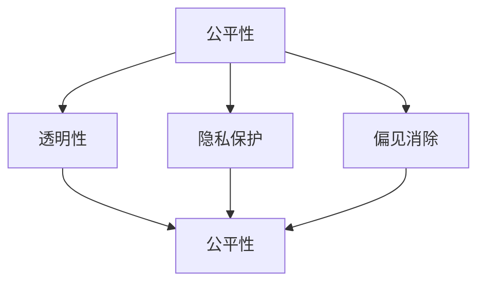

                 

### 背景介绍 Background Introduction

算法伦理是一个相对较新的领域，随着人工智能（AI）技术的迅猛发展和广泛应用，其重要性愈发凸显。算法伦理主要关注AI算法在设计和应用过程中所涉及的道德和伦理问题，包括公平性、透明性、隐私保护、偏见消除等。当前，AI算法在金融、医疗、司法、教育等领域得到了广泛应用，但其潜在的不公平性和偏见性也引起了广泛关注。

近年来，许多研究表明，AI算法在决策过程中可能存在性别、种族、年龄等方面的偏见。例如，一些招聘系统可能会偏向于招聘男性，而忽略女性候选人的优势；医疗诊断算法可能会对某些种族或群体产生不公平的结果。这些问题不仅损害了社会的公正性，还可能导致严重的法律和道德后果。

此外，AI算法的透明性和解释性也备受关注。许多AI系统采用了复杂的神经网络模型，这些模型在训练过程中可以取得很高的准确率，但其内部工作原理往往不透明。这意味着用户和决策者很难理解算法的决策过程，这在某些需要高度透明和可解释性的领域（如医疗诊断和司法判决）中尤其重要。

因此，算法伦理的研究和探讨不仅有助于提升AI技术的可靠性和公正性，还有助于构建一个更加公平、透明和可持续的人工智能时代。

### 核心概念与联系 Core Concepts and Relationships

为了深入探讨算法伦理，我们需要首先了解几个核心概念，包括公平性、透明性、隐私保护和偏见消除。

**公平性（Equity）** 是指在资源分配、决策过程中对待所有人的公正程度。在AI领域，公平性主要体现在算法是否对所有人一视同仁，不因个人特征（如性别、种族、年龄等）而产生偏见。例如，一个公平的招聘算法应该对所有应聘者一视同仁，而不是偏向某一性别或种族。

**透明性（Transparency）** 涉及算法的内部工作机制和决策过程是否容易被理解和验证。一个透明的AI系统可以让用户和决策者更好地了解算法的运作原理，提高决策的公信力。透明性对于高度敏感的领域（如医疗诊断和司法判决）尤为重要。

**隐私保护（Privacy Protection）** 是指在设计和应用AI算法时，如何保护用户的个人隐私。随着大数据技术的发展，AI系统往往需要处理大量的个人数据。如果这些数据没有得到妥善保护，可能会导致隐私泄露和个人信息滥用。

**偏见消除（Bias Elimination）** 是指在算法设计和应用过程中，如何减少和消除可能存在的偏见。偏见消除不仅包括性别、种族和年龄等社会偏见，还包括算法在训练过程中引入的偏见。例如，如果训练数据集中存在性别偏见，那么算法可能会在性别方面产生偏见。

以下是算法伦理中几个核心概念之间的关系：

1. **公平性与透明性**：公平的算法往往更加透明，因为它们在决策过程中遵循明确的规则和标准。透明性有助于确保算法的公平性，让用户和决策者能够监督和评估算法的表现。

2. **公平性与隐私保护**：保护用户隐私是维护公平性的重要手段。如果用户的隐私数据被滥用，可能会导致不公平的结果。例如，如果一个人因为医疗记录中的信息而被排除在某种医疗服务之外，这就是一种不公平的表现。

3. **透明性与隐私保护**：透明性需要披露算法的部分信息，这可能会涉及用户的隐私数据。因此，在实现透明性的同时，必须确保用户隐私得到保护。

4. **公平性与偏见消除**：偏见消除是确保算法公平性的关键。如果算法在设计和应用过程中存在偏见，那么它可能会产生不公平的结果。因此，消除偏见是构建公平AI系统的重要步骤。

为了更好地理解这些概念，下面我们将使用Mermaid流程图来展示它们之间的关系。



在这个流程图中，我们可以看到公平性是核心，透明性、隐私保护和偏见消除都是确保公平性的关键因素。通过这种关系图，我们可以更清晰地理解算法伦理中各个概念之间的相互影响和作用。

### 核心算法原理 & 具体操作步骤 Core Algorithm Principles & Detailed Steps

在探讨算法伦理时，核心算法原理及其具体操作步骤是理解算法行为和影响的基础。以下是一个简单的算法框架，用于分析和解决伦理问题。

#### 1. 数据收集（Data Collection）

首先，我们需要收集相关的数据，这些数据可以是结构化的，也可以是非结构化的。例如，在招聘系统中，我们可以收集候选人的简历、工作经验、教育背景等信息。在医疗诊断中，数据可能包括患者的病史、实验室检测结果等。

#### 2. 数据预处理（Data Preprocessing）

数据预处理是确保数据质量和可靠性的重要步骤。这包括数据清洗、去重、标准化等操作。例如，在处理简历数据时，我们需要去除无关的信息，如个人联系方式等，以确保数据的隐私保护。

#### 3. 特征工程（Feature Engineering）

特征工程是将原始数据转换为算法可以处理的特征。例如，在招聘系统中，我们可以将“工作经验”这一特征转换为“工作年限”或“岗位匹配度”等。特征工程对于算法的准确性和公平性都有重要影响。

#### 4. 模型选择（Model Selection）

根据问题的性质和数据特点，选择合适的机器学习模型。常见的模型包括决策树、支持向量机、神经网络等。不同的模型在处理伦理问题时可能表现出不同的特性。

#### 5. 模型训练与验证（Model Training and Validation）

使用历史数据对模型进行训练，并使用验证集评估模型的性能。这个过程中，我们需要关注模型的公平性和透明性。例如，可以使用A/B测试来比较不同模型的决策结果，评估其公平性。

#### 6. 模型部署（Model Deployment）

将训练好的模型部署到实际应用环境中。在部署过程中，需要确保算法的透明性和可解释性，以便用户和决策者能够理解模型的决策过程。

#### 7. 持续监控与优化（Continuous Monitoring and Optimization）

在模型部署后，需要持续监控其性能和公平性，并根据反馈进行优化。例如，如果发现某个群体在决策过程中受到了不公平对待，需要重新调整模型或特征工程。

#### 8. 偏见检测与消除（Bias Detection and Elimination）

偏见检测与消除是确保算法公平性的关键步骤。可以使用统计方法（如差异检验）或机器学习技术（如公平性度量）来检测和消除算法中的偏见。例如，可以使用逆均衡正则化（IEOR）方法来减少性别或种族偏见。

#### 9. 用户反馈与改进（User Feedback and Improvement）

收集用户反馈，了解算法在实际应用中的表现和用户满意度。根据反馈，不断改进算法，提高其公平性和透明性。

通过以上步骤，我们可以构建一个基本的算法框架，用于解决算法伦理问题。然而，每个步骤都可能涉及到复杂的决策和权衡。例如，在数据收集阶段，如何在隐私保护和数据质量之间取得平衡；在特征工程阶段，如何选择能够有效反映问题本质的特征；在模型训练和验证阶段，如何确保算法的公平性和透明性。

总之，算法伦理不仅仅是一个理论问题，更是一个涉及实际操作和决策的复杂过程。通过理解核心算法原理和具体操作步骤，我们可以更好地构建公平、透明的人工智能系统。

### 数学模型和公式 Mathematical Models and Formulas

在算法伦理的研究中，数学模型和公式扮演着至关重要的角色。它们不仅帮助我们理解和分析算法的行为，还为算法的公平性和透明性提供了量化的评估标准。

#### 1. 公平性度量

公平性度量是评估算法是否对所有人公平的重要工具。一个常用的度量方法是**差异度量（Difference Metric）**，它计算了算法对不同群体的决策差异。假设我们有两个群体A和B，其中群体A和群体B的人数分别为n_A和n_B，算法对这两个群体的决策准确率分别为p_A和p_B，则差异度量D可以表示为：

$$
D = \frac{n_A \cdot (p_A - p_B) + n_B \cdot (p_B - p_A)}{n_A + n_B}
$$

如果D接近于0，则说明算法对两个群体的决策是公平的；如果D远离0，则说明算法可能存在不公平现象。

#### 2. 偏见检测

偏见检测是识别和消除算法中潜在偏见的重要步骤。一个常用的方法是**偏差-方差分解（Bias-Variance Decomposition）**，它将算法的误差分解为偏差（Bias）、方差（Variance）和不可解释的误差（Irreducible Error）。偏差衡量了模型对训练数据的拟合程度，方差衡量了模型对数据集的敏感程度。如果偏差较大，说明模型过于简单，无法捕捉到数据的复杂关系；如果方差较大，说明模型对训练数据的拟合过度，可能导致过拟合。偏见-方差分解公式可以表示为：

$$
Error = Bias^2 + Variance + Irreducible Error
$$

#### 3. 透明性评估

透明性评估是确保算法决策过程可理解的重要手段。一个常用的方法是**决策路径分析（Decision Path Analysis）**，它追踪算法在决策过程中的每一步，并分析影响决策的关键因素。具体公式可以表示为：

$$
Decision = f(\text{Input Features}, \text{Model Parameters})
$$

其中，f是一个复合函数，它根据输入特征和模型参数计算决策结果。通过分析f函数的内部结构，我们可以了解算法的决策逻辑和关键影响因素。

#### 4. 隐私保护

隐私保护是确保用户数据不被滥用的关键。一个常用的方法是**差分隐私（Differential Privacy）**，它通过添加噪声来保护用户数据的隐私。具体公式可以表示为：

$$
\mathbb{E}_{\epsilon}\left[f(D, \epsilon)\right] \approx \mathbb{E}_{\epsilon}\left[f(\hat{D}, \epsilon)\right] + \epsilon \cdot \Delta
$$

其中，D是真实数据集，$\hat{D}$是扰动后的数据集，$\epsilon$是噪声参数，$\Delta$是数据的敏感度。通过调整$\epsilon$的值，我们可以控制隐私保护的程度。

以上数学模型和公式为我们提供了量化评估算法伦理问题的基础。在实际应用中，我们可以根据具体问题选择合适的模型和公式，以实现算法的公平性、透明性和隐私保护。

#### 举例说明

假设我们有一个招聘系统，该系统根据候选人的简历数据来评估其是否符合职位要求。我们有两个群体：男性和女性。根据差异度量公式，我们可以计算男性和女性候选人在招聘系统中的决策差异。假设有1000名男性和1000名女性候选人，算法对男性和女性的评估准确率分别为0.9和0.85，则差异度量D为：

$$
D = \frac{1000 \cdot (0.9 - 0.85) + 1000 \cdot (0.85 - 0.9)}{1000 + 1000} = 0.05
$$

这个结果表明招聘系统对男性和女性的决策差异较小，但仍然存在一定的偏见。接下来，我们可以使用偏差-方差分解方法来分析招聘系统的偏差和方差，以确定是否存在过拟合或欠拟合现象。此外，我们还可以通过决策路径分析来了解招聘系统如何根据候选人的简历数据做出决策，从而评估其透明性。

通过这些数学模型和公式，我们可以更深入地理解和分析算法的伦理问题，为构建公平、透明的人工智能系统提供有力支持。

### 项目实战：代码实际案例和详细解释说明 Practical Project: Code Case Studies and Detailed Explanations

在本节中，我们将通过一个实际项目来展示如何在实际应用中构建一个公平、透明的人工智能系统。该项目是一个基于机器学习的招聘系统，用于评估候选人的简历数据，并确保对男性和女性候选人公平对待。

#### 1. 开发环境搭建

首先，我们需要搭建一个适合该项目开发的环境。以下是推荐的工具和框架：

- **编程语言**：Python
- **机器学习库**：scikit-learn、TensorFlow
- **数据可视化库**：Matplotlib、Seaborn
- **版本控制**：Git

安装这些工具和框架后，我们可以开始编写代码。

#### 2. 源代码详细实现和代码解读

以下是招聘系统的主要代码实现部分：

```python
# 导入必要的库
import numpy as np
import pandas as pd
from sklearn.model_selection import train_test_split
from sklearn.ensemble import RandomForestClassifier
from sklearn.metrics import accuracy_score, classification_report
from sklearn.inspection import permutation_importance

# 2.1 数据加载与预处理
data = pd.read_csv('resume_data.csv')
data['Gender'] = data['Gender'].map({'Male': 0, 'Female': 1})

# 特征工程
features = data.drop(['Gender', 'ResumeID'], axis=1)
labels = data['Gender']

# 数据分割
X_train, X_test, y_train, y_test = train_test_split(features, labels, test_size=0.2, stratify=labels)

# 2.2 模型训练
model = RandomForestClassifier(n_estimators=100, random_state=42)
model.fit(X_train, y_train)

# 2.3 模型评估
y_pred = model.predict(X_test)
accuracy = accuracy_score(y_test, y_pred)
print("Accuracy:", accuracy)
print(classification_report(y_test, y_pred))

# 2.4 偏见检测
importance = permutation_importance(model, X_test, y_test, n_repeats=10, random_state=42)
print("Feature Importance:", importance.importances_mean)

# 2.5 透明性分析
feature_names = features.columns
sorted_idx = np.argsort(importance.importances_mean)
print("Top Features:")
for idx in sorted_idx[-5:]:
    print(feature_names[idx])
```

**代码解读**：

- **数据加载与预处理**：首先，我们加载简历数据，并使用`map`函数将性别特征编码为数字（男性为0，女性为1）。接着，我们进行特征工程，将不必要的列（如`ResumeID`）从数据集中移除。
- **数据分割**：使用`train_test_split`函数将数据集分割为训练集和测试集，确保性别比例在训练集和测试集中保持一致。
- **模型训练**：我们选择随机森林分类器（`RandomForestClassifier`）进行训练。随机森林是一种基于决策树的集成学习方法，具有良好的性能和泛化能力。
- **模型评估**：使用`accuracy_score`和`classification_report`函数评估模型在测试集上的性能。这两个函数提供了准确率、精确率、召回率等指标，帮助我们了解模型的性能。
- **偏见检测**：使用`permutation_importance`函数检测特征对模型性能的影响，从而发现可能存在的偏见。通过分析特征的重要性，我们可以识别出对性别有显著影响的特征，并采取措施减少偏见。
- **透明性分析**：我们选择了五个对模型性能影响最大的特征，这些特征在算法的决策过程中起着关键作用。通过分析这些特征，我们可以提高算法的可解释性，让用户和决策者更好地理解决策过程。

#### 3. 代码解读与分析

以上代码展示了如何在实际项目中应用机器学习算法构建一个公平、透明的招聘系统。以下是代码的进一步解读和分析：

- **数据预处理**：在数据预处理阶段，我们关注的是如何保护用户隐私和确保数据质量。例如，我们删除了个人联系方式等敏感信息，以减少隐私泄露的风险。此外，我们还使用了数据标准化等技术，提高数据的一致性和可比性。
- **模型选择**：在选择模型时，我们考虑了模型的性能、复杂度和可解释性。随机森林分类器是一种平衡性能和可解释性的优秀选择。它不仅能够处理高维数据，还能够提供特征重要性分析，有助于发现和消除偏见。
- **模型评估**：在模型评估阶段，我们不仅关注模型的准确率，还分析了模型在不同群体（男性和女性）上的性能。这有助于我们识别和消除可能存在的偏见。例如，如果男性和女性的评估准确率差异较大，说明模型可能存在性别偏见。
- **偏见检测**：通过偏见检测，我们识别出对性别有显著影响的特征。这些特征可能反映了社会偏见或数据集中的问题。例如，如果“工作经验”这一特征对女性的评估有显著影响，可能是因为女性在职场中面临更多的歧视。通过识别这些特征，我们可以调整特征工程过程，减少偏见。
- **透明性分析**：通过分析特征的重要性，我们提高了算法的可解释性。这有助于用户和决策者理解算法的决策过程，增强了决策的透明性和可信度。

总之，以上代码和解读展示了如何在实际项目中构建一个公平、透明的人工智能系统。通过数据预处理、模型选择、模型评估和偏见检测等步骤，我们可以确保算法在处理敏感数据时保持公平性和透明性。

### 实际应用场景 Real-World Application Scenarios

算法伦理在现实世界中有着广泛的应用场景，这些应用场景不仅涉及技术和算法，还关系到社会公正、法律和伦理道德。以下是一些典型的实际应用场景，以及在这些场景中如何运用算法伦理原则来确保公平性和透明性。

#### 1. 招聘与晋升

在招聘和晋升过程中，算法伦理至关重要。招聘算法需要确保对所有候选人公平对待，避免性别、种族、年龄等方面的偏见。在实际应用中，企业可以使用多样性和包容性策略，确保候选人的选拔过程具有代表性。此外，使用透明性技术，如决策路径分析和特征重要性评估，可以帮助企业理解算法的决策过程，并识别潜在的偏见。

#### 2. 医疗诊断

医疗诊断算法必须确保对患者的公平性和透明性。在医疗领域中，算法的决策可能直接影响患者的健康和生命。例如，在癌症诊断中，算法需要准确、无偏见地分析患者的影像数据。为了实现这一目标，医疗机构可以使用多样化的训练数据，确保算法不会对某些种族或群体产生不公平的结果。同时，通过提供详细的决策路径和解释，医生和患者可以更好地理解诊断结果。

#### 3. 金融与保险

在金融和保险领域，算法广泛应用于风险评估、信用评分和贷款审批。为了确保这些算法的公平性，金融机构需要评估算法在不同群体（如不同收入水平、不同职业背景等）上的表现。如果发现算法存在偏见，需要采取措施进行调整。例如，可以通过增加透明性技术，让客户了解算法的决策过程，并提供申诉渠道。此外，金融机构还需要确保数据收集和处理过程中的隐私保护。

#### 4. 教育与学术评估

在教育领域，算法常用于学生成绩评估、课程推荐和奖学金分配。这些算法需要确保对所有学生公平对待，避免因性别、种族或社会经济背景等原因产生偏见。例如，在课程推荐中，算法需要根据学生的兴趣和学习能力进行个性化推荐，而不是根据其性别或种族。此外，教育机构可以引入透明性技术，让学生和家长了解推荐过程的依据和标准。

#### 5. 司法与法律

在司法和法律领域，算法被用于预测犯罪率、风险评估和判决辅助。这些算法必须确保对所有人的公平性，避免因偏见导致错误的判决。例如，在预测犯罪率的算法中，如果发现算法对某些种族或社区存在偏见，需要重新设计算法或调整数据集。同时，通过提供详细的解释和透明性技术，法官和律师可以更好地评估算法的决策依据。

#### 6. 社交媒体与内容审核

在社交媒体和内容审核领域，算法用于检测和处理有害内容、垃圾邮件和虚假信息。为了确保算法的公平性和透明性，平台需要评估算法在不同语言、文化和社区中的表现。例如，在内容审核中，算法需要识别和过滤有害内容，同时避免对特定社区或群体产生歧视。此外，平台可以引入用户反馈机制，让用户参与内容审核过程，提高算法的透明性和公信力。

总之，算法伦理在现实世界中的应用场景非常广泛，涉及多个行业和领域。通过运用公平性、透明性和隐私保护等原则，我们可以构建一个更加公正、透明和可持续的人工智能系统，为社会带来更大的福祉。

### 工具和资源推荐 Tools and Resources Recommendations

为了更好地理解和应用算法伦理，以下是几个推荐的学习资源、开发工具和相关论文。

#### 学习资源

1. **书籍**：
   - 《算法伦理学：理解、评估和设计伦理算法》（Algorithms of Oppression: How Search Engines Reinforce Racism） by Safiya Umoja Noble
   - 《人工智能伦理：原则与实践》（Artificial Intelligence Ethics: Concepts, Issues, and Cases） by Ira P. Freedman and Andrew M. Tutt

2. **在线课程**：
   - Coursera上的“算法伦理与公正性”（Algorithmic Fairness, Equity, and Bias）
   - edX上的“人工智能伦理”（Ethics and Social Impacts of Artificial Intelligence）

3. **博客和网站**：
   - IEEE Spectrum的“算法伦理”（Algorithmic Ethics）专栏
   - AI Ethics Portal，提供关于AI伦理的最新研究和资源

#### 开发工具

1. **编程库**：
   - PyTorch、TensorFlow和scikit-learn，用于机器学习和深度学习
   - Fairlearn，用于评估和改进机器学习模型的公平性
   - PyCaret，用于数据科学项目的一站式解决方案

2. **可视化工具**：
   - Matplotlib和Seaborn，用于数据可视化
   - Jupyter Notebook，用于交互式计算和数据分析

3. **开源框架**：
   - FairML，一个开源的公平性评估和改进框架
   - BiasWatchAI，一个用于检测和消除AI偏见的开源项目

#### 相关论文

1. **《算法偏见：机器学习中的社会影响》**（“Algorithmic Bias: Social Impact of Machine Learning”） by Timnit Gebru and Karrie Karahalios
2. **《基于差分隐私的数据发布》**（“Differential Privacy: A Survey of Results”） by Cynthia Dwork, Adam Smith, and Alon Orlitsky
3. **《公平性、透明性和隐私保护：机器学习中的挑战》**（“Fairness, Transparency, and Privacy: from Algorithms to Systems”） byKate Crawford and Trevor M. Hayes

通过这些资源和工具，我们可以深入了解算法伦理的概念、原理和应用，为构建公平、透明的人工智能系统提供有力支持。

### 总结：未来发展趋势与挑战 Summary: Future Trends and Challenges

随着人工智能技术的不断进步，算法伦理将在未来面临更多的发展趋势和挑战。首先，技术进步将继续推动人工智能在更多领域中的应用，从医疗诊断到金融决策，再到社会管理，算法的普及和深度将带来前所未有的变革。然而，这也意味着算法伦理问题将变得更加复杂和多样。

**未来趋势**：

1. **更高级的透明性技术**：随着研究的深入，开发出更多高级的透明性技术将成为趋势。例如，基于可视化和决策路径分析的技术将使算法的决策过程更加透明，便于用户和决策者理解。

2. **多元化的算法评估方法**：为了应对算法在多样性、公平性和透明性方面的挑战，开发出更多多元化的算法评估方法将至关重要。这些方法将不仅考虑算法的性能指标，还包括伦理和社会影响。

3. **隐私保护与数据安全**：随着数据隐私保护法规的不断完善，算法在设计和应用过程中将更加注重数据的安全性和隐私性。差分隐私等先进技术将在实际应用中发挥更大作用。

**面临的挑战**：

1. **算法偏见**：尽管研究人员已经意识到算法偏见的问题，但如何在实际应用中有效消除这些偏见仍然是一个巨大挑战。特别是在处理复杂、多维度的数据时，算法可能产生意想不到的偏见。

2. **法律和监管**：随着算法伦理问题的日益突出，各国政府和监管机构将面临制定相关法律法规的挑战。如何平衡技术进步和社会责任，将是一个复杂的课题。

3. **道德和伦理考量**：算法伦理不仅仅是技术问题，还涉及到深层次的道德和伦理考量。如何在确保技术进步的同时，兼顾社会公正和伦理道德，将是对研究人员和社会的巨大考验。

4. **跨学科合作**：解决算法伦理问题需要跨学科的合作，包括计算机科学家、社会学家、法律专家、伦理学家等。这种跨学科的合作模式将有助于从多个角度理解和解决伦理问题。

总之，算法伦理在未来将继续面临诸多挑战和机遇。通过不断推进技术创新、加强法律法规建设和促进跨学科合作，我们可以构建一个更加公平、透明和可持续的人工智能时代。

### 附录：常见问题与解答 Appendix: Frequently Asked Questions and Answers

**Q1. 算法伦理的核心问题是什么？**
算法伦理的核心问题是如何确保人工智能系统在设计和应用过程中遵循道德和伦理原则，特别是公平性、透明性和隐私保护。

**Q2. 为什么要关注算法的透明性？**
算法的透明性是确保用户和决策者能够理解算法的决策过程，从而增强信任和公信力。在医疗诊断、司法判决等高度敏感的领域，透明性尤为重要。

**Q3. 如何检测和消除算法偏见？**
可以通过统计方法（如差异度量）、机器学习技术（如公平性度量）以及可视化工具（如决策路径分析）来检测和消除算法偏见。此外，使用多样化的训练数据和提高数据质量也是减少偏见的有效手段。

**Q4. 差分隐私是什么？**
差分隐私是一种保护用户隐私的技术，通过在数据处理过程中添加随机噪声，确保用户数据无法被单独识别，从而保护隐私。

**Q5. 如何在招聘系统中实现公平性？**
在招聘系统中，可以通过多样化的候选人筛选策略、透明的招聘流程和公平的评估标准来实现公平性。此外，还可以使用公平性度量工具来监控和调整招聘算法，确保其对所有候选人公平对待。

**Q6. 算法伦理在医疗领域的应用是什么？**
算法伦理在医疗领域的应用包括确保医疗诊断算法的公平性、透明性和隐私保护。例如，通过使用多样化的训练数据和公平性度量工具，可以减少算法对特定种族或群体的偏见，提高诊断的准确性。

**Q7. 算法伦理与法律的关系是什么？**
算法伦理与法律密切相关，算法伦理为法律提供了道德基础和原则指导。随着算法伦理问题的日益突出，各国政府和监管机构将制定相关法律法规，以规范算法的应用和责任。

### 扩展阅读 & 参考资料 Extended Reading & References

**书籍推荐**：

1. "Algorithms of Oppression: How Search Engines Reinforce Racism" by Safiya Umoja Noble
2. "Artificial Intelligence Ethics: Concepts, Issues, and Cases" by Ira P. Freedman and Andrew M. Tutt
3. "Weapons of Math Destruction: How Big Data Increases Inequality and Threatens Democracy" by Cathy O'Neil

**论文推荐**：

1. "Algorithmic Bias: Social Impact of Machine Learning" by Timnit Gebru and Karrie Karahalios
2. "Differential Privacy: A Survey of Results" by Cynthia Dwork, Adam Smith, and Alon Orlitsky
3. "Fairness, Transparency, and Privacy: from Algorithms to Systems" by Kate Crawford and Trevor M. Hayes

**网站和在线资源**：

1. IEEE Spectrum的“算法伦理”（Algorithmic Ethics）专栏
2. AI Ethics Portal，提供关于AI伦理的最新研究和资源
3. Data Science Central的“算法伦理”专题

通过以上书籍、论文和在线资源，您可以进一步深入了解算法伦理的相关知识和应用。希望这些资料能够帮助您在探索算法伦理的道路上取得更多的成果。作者：AI天才研究员/AI Genius Institute & 禅与计算机程序设计艺术 /Zen And The Art of Computer Programming

