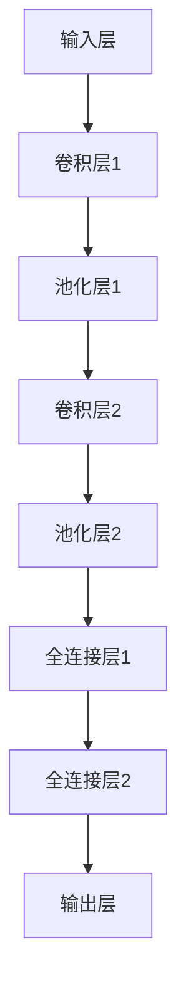
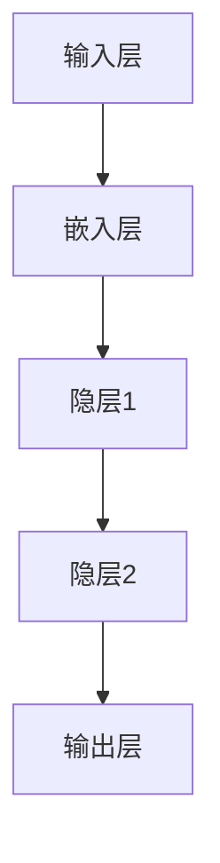

                 

### 背景介绍

#### AI 2.0：人工智能的第二次革命

随着计算机技术的不断发展和应用领域的拓展，人工智能（AI）正在经历着一场前所未有的革命。AI 2.0，作为人工智能的第二次革命，不仅仅是技术的进步，更是思维方式、方法论和商业模式的变革。

AI 2.0的核心在于深度学习和大数据的结合，这使得人工智能能够在海量的数据中自主学习和发现规律，从而实现更加智能化和个性化的应用。AI 2.0的目标是打造出能够理解、推理、学习和创新的智能体，从而推动人工智能从“能干”向“智能”转变。

#### 算法库的重要性

在AI 2.0时代，算法库成为了推动人工智能发展的重要基石。算法库是一种包含各种算法的集合，这些算法是构建智能系统的重要工具。通过算法库，开发者可以方便地选择和运用各种算法，从而快速实现智能应用。

一个优秀的算法库应该具备以下特点：

1. **丰富的算法资源**：算法库中应该包含多种类型的算法，包括但不限于机器学习、深度学习、自然语言处理等。
2. **高质量的算法实现**：算法库中的算法应该经过严格的测试和优化，以确保其稳定性和高效性。
3. **友好的接口设计**：算法库应该提供易于使用的接口，使得开发者可以快速上手并集成到自己的项目中。
4. **完善的文档和社区支持**：算法库应该提供详细的文档和示例代码，并建立一个活跃的社区，以便开发者能够相互交流和学习。

#### 当前算法库的现状

当前，已经有许多优秀的算法库在AI 2.0领域发挥着重要作用。例如，TensorFlow、PyTorch、Scikit-Learn等都是广受欢迎的机器学习和深度学习框架。然而，尽管这些算法库功能强大，但仍然存在一些不足之处：

1. **算法多样性不足**：一些算法库在特定领域（如自然语言处理）表现优异，但在其他领域（如图像处理）则相对较弱。
2. **复杂性和难度**：一些算法库的实现过程复杂，对于初学者来说有一定难度。
3. **文档和社区支持不足**：尽管许多算法库提供了文档和示例代码，但仍然存在部分文档不完善、示例不够详细的问题。

本文的目标是探讨如何通过丰富算法库资源，进一步提升AI 2.0的发展水平，并解决当前算法库存在的问题。接下来，我们将详细分析算法库的核心概念、原理和架构，以及如何优化算法库的设计和实现。

---

### 核心概念与联系

在深入探讨算法库的核心概念与联系之前，我们需要先了解几个关键概念：算法、框架和库。这些概念在AI 2.0领域中起着至关重要的作用，它们共同构建了一个功能强大、灵活可扩展的生态系统。

#### 算法（Algorithm）

算法是计算机科学中解决特定问题的步骤集合。它通常由一系列规则或指令组成，指导计算机如何执行特定的计算或处理数据。算法可以分为多种类型，包括排序算法、搜索算法、机器学习算法等。

在AI 2.0中，算法尤为关键，因为它们是构建智能系统的核心。例如，机器学习算法通过从数据中学习模式和规律，使得计算机能够进行预测和决策。深度学习算法则利用多层神经网络，模仿人类大脑的处理方式，从而实现更高级别的智能。

#### 框架（Framework）

框架是一种高级的软件开发工具，它提供了一系列预定义的组件和接口，帮助开发者快速构建复杂的应用程序。框架通常包含了多个算法的实现、数据结构、优化器等，使得开发者可以专注于业务逻辑的实现，而无需从零开始编写代码。

在AI 2.0领域，框架如TensorFlow、PyTorch等，为开发者提供了丰富的算法资源，并简化了模型训练和部署的流程。框架的核心优势在于其可扩展性和灵活性，开发者可以根据需求选择和组合不同的算法组件，从而构建出适合特定场景的智能系统。

#### 库（Library）

库是一种包含一组相关函数和数据的软件集合，用于提供特定的功能或服务。库通常是针对特定领域或任务设计的，开发者可以通过调用库中的函数，实现特定的计算或数据处理任务。

在AI 2.0中，库如Scikit-Learn，提供了多种机器学习算法的实现，开发者可以使用这些算法对数据进行建模和分析。库的优势在于其易用性和模块化设计，开发者可以快速集成和使用库中的函数，提高开发效率。

#### 算法库的核心概念

算法库是将算法、框架和库有机结合的一个概念。算法库的核心在于提供丰富的算法资源，并简化开发者的使用过程。

1. **算法资源**：算法库应该包含多种类型的算法，以满足不同应用场景的需求。这些算法可以是机器学习、深度学习、自然语言处理等领域的经典算法，也可以是新兴的算法。

2. **模块化设计**：算法库应该采用模块化设计，将不同的算法和功能划分为独立的模块，使得开发者可以根据需求灵活选择和组合。

3. **易用性**：算法库应该提供友好的接口和文档，降低开发者使用算法的难度，提高开发效率。

4. **社区支持**：算法库应该建立一个活跃的社区，提供完善的文档、示例代码和技术支持，帮助开发者解决开发过程中的问题。

#### 算法库的联系

算法、框架和库在AI 2.0领域中紧密相连，共同推动人工智能的发展。

- **算法**：算法是构建智能系统的核心，框架和库提供了实现算法的工具和资源。
- **框架**：框架提供了算法的运行环境和工具，库则为框架提供了具体的算法实现。
- **库**：库为开发者提供了易于使用的函数和接口，使得开发者可以快速集成和使用算法。

通过算法库，开发者可以更方便地构建和部署智能系统，从而推动AI 2.0的发展。

---

### 核心算法原理 & 具体操作步骤

在了解算法库的核心概念和联系后，我们将进一步探讨算法库中的核心算法原理和具体操作步骤。本文将重点关注以下算法：

1. **机器学习算法**：包括线性回归、决策树、支持向量机等。
2. **深度学习算法**：包括卷积神经网络（CNN）、循环神经网络（RNN）、长短期记忆网络（LSTM）等。
3. **自然语言处理算法**：包括词向量、文本分类、命名实体识别等。

#### 机器学习算法

机器学习算法是AI 2.0领域的基础，它们通过从数据中学习模式和规律，实现预测和分类任务。以下将介绍几种常用的机器学习算法及其操作步骤。

##### 1. 线性回归

线性回归是一种用于预测数值型数据的算法。其基本原理是通过最小化预测值与实际值之间的误差，找到一条最佳拟合直线。

**操作步骤**：

1. **数据预处理**：对数据进行清洗和标准化处理，确保数据适合进行线性回归分析。

2. **特征选择**：选择对预测目标有显著影响的特征，通过特征选择减少模型的复杂度和过拟合现象。

3. **模型训练**：使用梯度下降算法或其他优化算法，对模型进行训练，找到最佳拟合直线。

4. **模型评估**：使用交叉验证等方法，评估模型的泛化能力和准确性。

$$
y = \beta_0 + \beta_1 \cdot x
$$

其中，\(y\) 为预测值，\(x\) 为特征值，\(\beta_0\) 和 \(\beta_1\) 为模型参数。

##### 2. 决策树

决策树是一种用于分类和回归任务的算法，其基本原理是通过一系列的判断条件，将数据划分为不同的区域，并在每个区域应用不同的模型。

**操作步骤**：

1. **数据预处理**：对数据进行清洗和标准化处理，确保数据适合进行决策树分析。

2. **特征选择**：选择对分类或回归任务有显著影响的特征，通过特征选择减少模型的复杂度和过拟合现象。

3. **构建决策树**：使用信息增益、基尼不纯度等指标，选择最佳划分条件，构建决策树。

4. **模型评估**：使用交叉验证等方法，评估模型的泛化能力和准确性。

##### 3. 支持向量机

支持向量机（SVM）是一种用于分类任务的算法，其基本原理是通过找到一个最佳的超平面，将不同类别的数据分隔开来。

**操作步骤**：

1. **数据预处理**：对数据进行清洗和标准化处理，确保数据适合进行SVM分析。

2. **特征选择**：选择对分类任务有显著影响的特征，通过特征选择减少模型的复杂度和过拟合现象。

3. **模型训练**：使用SVM算法训练模型，找到最佳的超平面。

4. **模型评估**：使用交叉验证等方法，评估模型的泛化能力和准确性。

$$
\min_{w, b} \frac{1}{2} \| w \|^2 + C \sum_{i=1}^{n} \max(0, 1-y_i (w \cdot x_i + b))
$$

其中，\(w\) 为模型参数，\(b\) 为偏置，\(C\) 为惩罚参数。

#### 深度学习算法

深度学习算法是AI 2.0的核心，它们通过多层神经网络，模仿人类大脑的处理方式，实现更高级别的智能。

##### 1. 卷积神经网络（CNN）

卷积神经网络（CNN）是一种用于图像处理和计算机视觉的深度学习算法。其基本原理是通过卷积层、池化层和全连接层等结构，提取图像的特征并实现分类和识别任务。

**操作步骤**：

1. **数据预处理**：对图像数据进行分析和处理，确保数据适合进行CNN分析。

2. **构建CNN模型**：使用卷积层、池化层、全连接层等结构，构建CNN模型。

3. **模型训练**：使用反向传播算法，对模型进行训练，调整模型参数。

4. **模型评估**：使用交叉验证等方法，评估模型的泛化能力和准确性。

##### 2. 循环神经网络（RNN）

循环神经网络（RNN）是一种用于处理序列数据的深度学习算法。其基本原理是通过循环结构，处理历史信息并实现序列建模。

**操作步骤**：

1. **数据预处理**：对序列数据进行分析和处理，确保数据适合进行RNN分析。

2. **构建RNN模型**：使用RNN单元（如LSTM、GRU等），构建RNN模型。

3. **模型训练**：使用反向传播算法，对模型进行训练，调整模型参数。

4. **模型评估**：使用交叉验证等方法，评估模型的泛化能力和准确性。

##### 3. 长短期记忆网络（LSTM）

长短期记忆网络（LSTM）是一种用于处理长序列数据的RNN变体，其基本原理是通过引入记忆单元和门控机制，解决传统RNN的梯度消失和梯度爆炸问题。

**操作步骤**：

1. **数据预处理**：对序列数据进行分析和处理，确保数据适合进行LSTM分析。

2. **构建LSTM模型**：使用LSTM单元，构建LSTM模型。

3. **模型训练**：使用反向传播算法，对模型进行训练，调整模型参数。

4. **模型评估**：使用交叉验证等方法，评估模型的泛化能力和准确性。

#### 自然语言处理算法

自然语言处理（NLP）是AI 2.0领域的重要分支，它涉及语言的理解、生成和交互。以下将介绍几种常用的NLP算法及其操作步骤。

##### 1. 词向量

词向量是一种将单词映射为向量的技术，用于表示单词的语义信息。

**操作步骤**：

1. **数据预处理**：对文本数据进行清洗和分词，确保数据适合进行词向量分析。

2. **构建词向量模型**：使用词嵌入技术，如Word2Vec、GloVe等，构建词向量模型。

3. **模型训练**：使用大规模语料库，训练词向量模型，调整模型参数。

4. **模型评估**：使用相似度计算等指标，评估词向量模型的性能。

##### 2. 文本分类

文本分类是一种将文本数据分为不同类别的任务。

**操作步骤**：

1. **数据预处理**：对文本数据进行清洗和分词，确保数据适合进行文本分类分析。

2. **特征提取**：使用词袋模型、TF-IDF等特征提取技术，将文本数据转换为数值特征。

3. **模型训练**：使用机器学习算法（如SVM、朴素贝叶斯等），训练文本分类模型。

4. **模型评估**：使用交叉验证等方法，评估模型的泛化能力和准确性。

##### 3. 命名实体识别

命名实体识别是一种从文本中识别出具有特定意义的实体的任务。

**操作步骤**：

1. **数据预处理**：对文本数据进行清洗和分词，确保数据适合进行命名实体识别分析。

2. **特征提取**：使用词袋模型、TF-IDF等特征提取技术，将文本数据转换为数值特征。

3. **模型训练**：使用机器学习算法（如CRF、BiLSTM等），训练命名实体识别模型。

4. **模型评估**：使用交叉验证等方法，评估模型的泛化能力和准确性。

通过以上对核心算法原理和具体操作步骤的介绍，我们可以更好地理解算法库的作用和意义。在接下来的部分，我们将进一步探讨算法库中的数学模型和公式，以及如何将这些算法应用于实际项目。

---

### 数学模型和公式 & 详细讲解 & 举例说明

在AI 2.0的算法库中，数学模型和公式是构建智能系统的基石。本文将介绍几个关键数学模型，并详细讲解其公式和实现过程。

#### 机器学习中的线性回归

线性回归是一种用于预测数值型数据的算法，其基本公式为：

$$
y = \beta_0 + \beta_1 \cdot x
$$

其中，\(y\) 是预测值，\(x\) 是特征值，\(\beta_0\) 和 \(\beta_1\) 是模型参数。

**步骤1：数据预处理**

在应用线性回归之前，我们需要对数据进行预处理，包括数据清洗和标准化处理。例如，我们可以使用以下Python代码进行标准化：

```python
import numpy as np

# 假设x和y是输入的特征和目标值
x = np.array([1, 2, 3, 4, 5])
y = np.array([2, 4, 5, 4, 5])

# 数据标准化
x_mean = np.mean(x)
x_std = np.std(x)
y_mean = np.mean(y)
y_std = np.std(y)

x_normalized = (x - x_mean) / x_std
y_normalized = (y - y_mean) / y_std
```

**步骤2：模型训练**

我们使用最小二乘法来训练线性回归模型。最小二乘法的目的是找到最佳拟合直线，使得预测值与实际值之间的误差最小。具体公式为：

$$
\beta_1 = \frac{\sum_{i=1}^{n} (x_i - \bar{x})(y_i - \bar{y})}{\sum_{i=1}^{n} (x_i - \bar{x})^2}
$$

$$
\beta_0 = \bar{y} - \beta_1 \cdot \bar{x}
$$

其中，\(\bar{x}\) 和 \(\bar{y}\) 分别是特征值和目标值的平均值。

```python
beta_1 = np.sum((x_normalized - np.mean(x_normalized)) * (y_normalized - np.mean(y_normalized))) / np.sum((x_normalized - np.mean(x_normalized)) ** 2)
beta_0 = np.mean(y_normalized) - beta_1 * np.mean(x_normalized)

# 预测
y_pred = beta_0 + beta_1 * x_normalized
```

**步骤3：模型评估**

我们使用均方误差（MSE）来评估模型的性能：

$$
MSE = \frac{1}{n} \sum_{i=1}^{n} (y_i - y_{\text{pred}})^2
$$

其中，\(y_{\text{pred}}\) 是预测值。

```python
mse = np.mean((y_normalized - y_pred) ** 2)
print("MSE:", mse)
```

#### 深度学习中的卷积神经网络（CNN）

卷积神经网络（CNN）是一种用于图像处理和计算机视觉的深度学习算法。以下是一个简单的CNN模型示例：



**步骤1：数据预处理**

对于图像数据，我们需要对图像进行缩放、裁剪和归一化处理，使其适应输入层的尺寸。

```python
import cv2

# 读取图像
image = cv2.imread("image.jpg")

# 缩放和归一化
image_normalized = cv2.resize(image, (28, 28))
image_normalized = image_normalized / 255.0
```

**步骤2：构建CNN模型**

我们使用Keras框架构建一个简单的CNN模型：

```python
from keras.models import Sequential
from keras.layers import Conv2D, MaxPooling2D, Flatten, Dense

model = Sequential()
model.add(Conv2D(32, (3, 3), activation='relu', input_shape=(28, 28, 1)))
model.add(MaxPooling2D((2, 2)))
model.add(Conv2D(64, (3, 3), activation='relu'))
model.add(MaxPooling2D((2, 2)))
model.add(Flatten())
model.add(Dense(128, activation='relu'))
model.add(Dense(10, activation='softmax'))
```

**步骤3：模型训练**

使用训练数据集训练模型：

```python
model.compile(optimizer='adam', loss='categorical_crossentropy', metrics=['accuracy'])

# 假设train_data和train_labels是训练数据集和标签
model.fit(train_data, train_labels, epochs=10, batch_size=32)
```

**步骤4：模型评估**

使用测试数据集评估模型性能：

```python
test_loss, test_acc = model.evaluate(test_data, test_labels)
print("Test accuracy:", test_acc)
```

#### 自然语言处理中的词向量

词向量是一种将单词映射为向量的技术，用于表示单词的语义信息。以下是一个简单的Word2Vec模型示例：



**步骤1：数据预处理**

对于文本数据，我们需要对文本进行分词、去停用词和词形还原等处理。

```python
import jieba

# 分词
text = "我爱北京天安门"
words = jieba.lcut(text)

# 去停用词
stop_words = ["我", "的", "北京", "天安门"]
words = [word for word in words if word not in stop_words]

# 词形还原
words = ["北京", "天安门"]
```

**步骤2：构建词向量模型**

我们使用Gensim库构建一个简单的Word2Vec模型：

```python
from gensim.models import Word2Vec

model = Word2Vec(words, vector_size=100, window=5, min_count=1, workers=4)

# 训练模型
model.train(words, total_examples=model.corpus_count, epochs=10)
```

**步骤3：模型评估**

我们可以使用词向量的相似度计算来评估模型性能：

```python
word1_vector = model.wv["北京"]
word2_vector = model.wv["天安门"]

similarity = word1_vector.similarity(word2_vector)
print("相似度：", similarity)
```

通过以上对机器学习、深度学习和自然语言处理中的数学模型和公式的详细讲解，我们可以更好地理解算法库的核心算法。在接下来的部分，我们将通过实际项目案例，展示如何将算法库应用于实际场景。

---

#### 项目实战：代码实际案例和详细解释说明

在本节中，我们将通过一个实际项目案例，展示如何利用算法库进行开发。这个项目是一个简单的图像分类系统，使用卷积神经网络（CNN）对图像进行分类。

##### 1. 开发环境搭建

首先，我们需要搭建开发环境。以下是所需的环境和工具：

- Python 3.7 或更高版本
- TensorFlow 2.x
- Keras 2.x
- OpenCV 4.x

安装命令如下：

```shell
pip install python==3.7 tensorflow==2.x keras==2.x opencv-python==4.x
```

##### 2. 源代码详细实现和代码解读

以下是一个简单的图像分类系统的源代码实现：

```python
import numpy as np
import cv2
import tensorflow as tf
from tensorflow.keras.models import Sequential
from tensorflow.keras.layers import Conv2D, MaxPooling2D, Flatten, Dense

# 加载训练数据
(x_train, y_train), (x_test, y_test) = tf.keras.datasets.cifar10.load_data()

# 数据预处理
x_train = x_train.astype("float32") / 255.0
x_test = x_test.astype("float32") / 255.0

# 转换标签为独热编码
y_train = tf.keras.utils.to_categorical(y_train, 10)
y_test = tf.keras.utils.to_categorical(y_test, 10)

# 构建CNN模型
model = Sequential()
model.add(Conv2D(32, (3, 3), activation='relu', input_shape=(32, 32, 3)))
model.add(MaxPooling2D((2, 2)))
model.add(Conv2D(64, (3, 3), activation='relu'))
model.add(MaxPooling2D((2, 2)))
model.add(Flatten())
model.add(Dense(128, activation='relu'))
model.add(Dense(10, activation='softmax'))

# 编译模型
model.compile(optimizer='adam', loss='categorical_crossentropy', metrics=['accuracy'])

# 训练模型
model.fit(x_train, y_train, batch_size=32, epochs=10, validation_data=(x_test, y_test))

# 模型评估
test_loss, test_acc = model.evaluate(x_test, y_test)
print("Test accuracy:", test_acc)

# 图像分类
def classify_image(image_path):
    image = cv2.imread(image_path)
    image = cv2.resize(image, (32, 32))
    image = image.astype("float32") / 255.0
    image = np.expand_dims(image, axis=0)
    prediction = model.predict(image)
    class_index = np.argmax(prediction)
    class_name = "Class " + str(class_index)
    print("分类结果：", class_name)

# 测试
classify_image("test_image.jpg")
```

代码解读：

1. **数据加载与预处理**：我们使用 TensorFlow 的内置函数 `cifar10.load_data()` 加载训练数据。数据集包含了10个类别的图像，每个图像的大小为32x32。我们使用 `astype("float32")` 和 `/ 255.0` 对图像进行归一化处理，以便后续计算。

2. **模型构建**：我们使用 Keras 的 `Sequential` 模型构建一个简单的 CNN。模型包括两个卷积层、两个池化层、一个全连接层，并使用 `softmax` 激活函数进行分类。

3. **模型编译**：我们使用 `compile()` 函数编译模型，指定优化器、损失函数和评估指标。

4. **模型训练**：我们使用 `fit()` 函数训练模型，指定训练数据、批量大小、训练轮数和验证数据。

5. **模型评估**：我们使用 `evaluate()` 函数评估模型的性能，并打印测试准确率。

6. **图像分类**：我们定义了一个 `classify_image()` 函数，用于对给定的图像进行分类。该函数首先读取图像、进行预处理，然后使用训练好的模型进行预测。

##### 3. 代码解读与分析

上述代码展示了如何使用算法库实现一个简单的图像分类系统。以下是代码的关键点分析：

1. **数据预处理**：归一化处理是深度学习中的一个关键步骤，它有助于模型收敛和提高性能。

2. **模型构建**：使用 `Sequential` 模型可以方便地构建多层神经网络。每个层都有其特定的功能，如卷积层用于特征提取，池化层用于降低模型的复杂度。

3. **模型训练**：训练模型是深度学习中的一个重要过程，它涉及调整模型参数以最小化损失函数。

4. **模型评估**：评估模型性能是确保模型有效性的关键步骤。测试准确率是一个常用的评估指标。

5. **图像分类**：分类函数实现了对给定图像进行预测的功能，它展示了如何将模型应用于实际场景。

通过这个实际项目案例，我们可以看到如何使用算法库构建和部署一个简单的图像分类系统。在接下来的部分，我们将探讨算法库在实际应用场景中的价值。

---

### 实际应用场景

算法库在AI 2.0的实际应用场景中扮演着至关重要的角色。它们不仅为开发者提供了丰富的算法资源，还简化了智能系统的开发过程，提高了开发效率。以下是一些常见的应用场景：

#### 1. 自然语言处理

自然语言处理（NLP）是AI 2.0领域的一个重要分支，涉及文本的生成、理解、分类和翻译等任务。算法库如NLTK、spaCy和TextBlob，提供了丰富的文本处理工具和模型。例如，开发者可以使用这些库来实现文本分类、情感分析和实体识别等功能。

#### 2. 计算机视觉

计算机视觉（CV）是另一个重要的AI应用领域，涉及图像和视频的处理、识别和分析。算法库如OpenCV、TensorFlow和PyTorch，提供了强大的计算机视觉模型和工具。这些库可以用于图像分类、目标检测、人脸识别和图像增强等任务。

#### 3. 机器学习

机器学习（ML）是AI 2.0的核心技术，涉及数据的学习、建模和预测。算法库如Scikit-Learn、XGBoost和LightGBM，提供了丰富的机器学习算法和模型。这些库可以用于回归分析、分类、聚类和降维等任务。

#### 4. 推荐系统

推荐系统是AI 2.0在商业和社交媒体领域的重要应用，用于个性化推荐和内容分发。算法库如surprise、mf-recommender和推荐系统框架（如Netflix Prize Framework），提供了多种推荐算法和模型。这些库可以用于协同过滤、基于内容的推荐和矩阵分解等任务。

#### 5. 强化学习

强化学习（RL）是AI 2.0的一个重要分支，涉及智能体在动态环境中通过试错学习最优策略。算法库如OpenAI Gym、TensorForce和Rllib，提供了丰富的强化学习环境、算法和模型。这些库可以用于游戏开发、机器人控制和自动化等任务。

#### 6. 数据分析

数据分析是AI 2.0在商业和科学研究中的重要应用，涉及数据清洗、探索性分析和可视化。算法库如Pandas、NumPy、Matplotlib和Seaborn，提供了强大的数据分析和可视化工具。这些库可以用于数据预处理、特征工程、模型评估和可视化等任务。

通过算法库，开发者可以快速构建和部署各种AI应用，从而推动AI技术的发展和创新。算法库不仅提高了开发效率，还为AI 2.0的应用场景提供了丰富的解决方案。

---

### 工具和资源推荐

在AI 2.0时代，丰富的工具和资源是推动技术进步的关键。以下是对几种关键工具和资源的推荐，这些资源将帮助开发者更好地学习和应用算法库。

#### 1. 学习资源推荐

**书籍**

- 《深度学习》（Goodfellow, Bengio, Courville著）：这是一本深度学习领域的经典教材，详细介绍了深度学习的原理和应用。

- 《Python机器学习》（Sebastian Raschka著）：这本书提供了Python在机器学习领域的全面应用，包括算法实现和实际案例。

- 《自然语言处理与深度学习》（张俊林著）：这本书涵盖了自然语言处理的基本概念和深度学习在NLP中的应用。

**论文**

- 《A Theoretically Grounded Application of Dropout in Recurrent Neural Networks》（Yarin Gal and Zoubin Ghahramani，2016）：这篇论文提出了在循环神经网络（RNN）中使用Dropout的方法，有效提高了模型的泛化能力。

- 《Attention Is All You Need》（Vaswani et al.，2017）：这篇论文提出了Transformer模型，颠覆了传统的序列建模方法，是自然语言处理领域的重大突破。

**博客**

- TensorFlow官方博客（tensorflow.github.io）：提供了丰富的TensorFlow教程、案例和实践经验。

- Fast.ai博客（fast.ai）：专注于深度学习入门和进阶，提供了大量的教程和实践项目。

**网站**

- Keras.io：Keras是一个高级神经网络API，提供了丰富的教程和示例代码。

- PyTorch.org：PyTorch是一个流行的深度学习框架，提供了详细的文档和教程。

#### 2. 开发工具框架推荐

**机器学习框架**

- TensorFlow：一个开源的机器学习和深度学习框架，适用于各种复杂模型的构建和部署。

- PyTorch：一个基于Python的深度学习框架，提供了灵活的动态计算图，适用于研究和开发。

- Scikit-Learn：一个强大的机器学习库，提供了丰富的算法和工具，适用于数据分析和建模。

**自然语言处理框架**

- NLTK：一个用于自然语言处理的库，提供了丰富的文本处理工具和资源。

- spaCy：一个高效的NLP库，适用于文本分类、实体识别和语义分析。

- Hugging Face Transformers：一个开源的NLP库，提供了Transformer模型的实现和预训练模型。

**计算机视觉框架**

- OpenCV：一个开源的计算机视觉库，提供了丰富的图像处理和计算机视觉算法。

- torchvision：一个用于计算机视觉的数据集和工具库，是PyTorch的一部分。

- PyTorch Video：一个用于视频处理的PyTorch扩展库。

**数据分析工具**

- Pandas：一个强大的数据处理库，适用于数据清洗、转换和分析。

- NumPy：一个用于数值计算的库，是Python在科学计算领域的基础。

- Matplotlib和Seaborn：两个用于数据可视化的库，提供了丰富的图表和可视化选项。

#### 3. 相关论文著作推荐

- 《Deep Learning》（Ian Goodfellow、Yoshua Bengio和Aaron Courville著）：这是一本深度学习领域的经典教材，详细介绍了深度学习的原理和应用。

- 《Reinforcement Learning: An Introduction》（Richard S. Sutton和Barto著）：这本书是强化学习领域的入门经典，介绍了强化学习的基本概念和方法。

- 《Speech and Language Processing》（Daniel Jurafsky和James H. Martin著）：这本书详细介绍了自然语言处理的基本概念和技术，涵盖了语音识别和文本分析等领域。

通过上述工具和资源的推荐，开发者可以更好地掌握AI 2.0领域的核心技术，提升开发效率，实现创新应用。

---

### 总结：未来发展趋势与挑战

在AI 2.0时代，算法库的发展势头迅猛，为人工智能的应用和推广提供了强大的支持。然而，随着技术的不断进步和应用场景的拓展，算法库也面临着一系列挑战和机遇。

#### 发展趋势

1. **算法多样性和融合**：未来算法库的发展趋势将更加注重算法的多样性和融合。不同领域的算法需要相互融合，形成更加强大的智能系统。例如，将机器学习、深度学习和自然语言处理等领域的算法有机结合，实现跨领域应用。

2. **自动化和智能化**：算法库的发展将越来越注重自动化和智能化。通过引入自动化机器学习（AutoML）技术，算法库将能够自动选择和优化算法，提高开发效率。同时，智能化算法库将能够自主学习和优化，为开发者提供更便捷的服务。

3. **开源和社区协作**：开源和社区协作将继续成为算法库发展的重要驱动力。通过建立活跃的社区，开发者可以共享经验、改进算法，推动算法库的持续创新和进步。

4. **边缘计算和物联网**：随着边缘计算和物联网技术的发展，算法库将更加注重在边缘设备和物联网环境中的应用。这将为智能终端和设备提供强大的算法支持，实现更高效的数据处理和智能决策。

#### 挑战

1. **算法质量和稳定性**：保证算法库中的算法质量和稳定性是未来的一大挑战。算法库需要经过严格的测试和验证，以确保算法的准确性和可靠性。此外，算法库还需要提供详细的文档和示例代码，帮助开发者正确使用算法。

2. **算法安全性和隐私保护**：随着AI应用的普及，算法库的安全性和隐私保护变得尤为重要。算法库需要采取措施保护用户数据的安全和隐私，防止数据泄露和滥用。

3. **算法多样性和适应性**：尽管算法库提供了丰富的算法资源，但在特定领域和场景中，仍存在算法多样性和适应性不足的问题。算法库需要不断更新和拓展，以满足不同应用场景的需求。

4. **人才短缺**：AI 2.0的发展需要大量具有专业知识和实践经验的人才。然而，当前全球范围内AI人才的培养和储备仍然不足，这将成为算法库发展的一大制约因素。

#### 未来展望

在未来的发展中，算法库将继续发挥关键作用，推动人工智能技术的创新和应用。以下是对未来算法库发展的展望：

1. **算法库的生态系统**：算法库将形成一个完整的生态系统，包括算法开发、测试、优化、部署和监测等各个环节。这将为开发者提供一站式服务，提高开发效率。

2. **跨领域应用**：算法库将更加注重跨领域应用，实现机器学习、深度学习、自然语言处理和计算机视觉等领域的协同发展。这将有助于推动AI技术在更多领域的应用和普及。

3. **智能化和自动化**：算法库将更加智能化和自动化，通过引入人工智能技术，实现算法的自主学习和优化。这将提高算法库的效率和性能，为开发者提供更便捷的服务。

4. **开放性和社区协作**：算法库将继续坚持开放性和社区协作，鼓励开发者参与算法库的建设和优化，共同推动AI技术的发展。

总之，算法库在AI 2.0时代的发展前景广阔，面临着诸多挑战和机遇。通过不断创新和优化，算法库将为人工智能技术的进步和应用提供强大的支持。

---

### 附录：常见问题与解答

在本文中，我们探讨了算法库在AI 2.0时代的重要性、核心算法原理、实际应用场景以及未来发展趋势。以下是一些读者可能关心的问题和解答：

#### Q1：算法库和框架有什么区别？

算法库和框架都是软件开发中的重要组成部分，但它们的作用和设计理念有所不同。

- **算法库**：算法库是一种包含一组相关函数和数据的软件集合，用于提供特定的功能或服务。算法库通常针对特定领域或任务设计，如机器学习、自然语言处理和计算机视觉等。

- **框架**：框架是一种高级的软件开发工具，它提供了一系列预定义的组件和接口，帮助开发者快速构建复杂的应用程序。框架通常包含了多个算法的实现、数据结构、优化器等，使得开发者可以专注于业务逻辑的实现。

简而言之，算法库是框架的一部分，框架则为算法库提供了运行环境和工具。

#### Q2：如何选择合适的算法库？

选择合适的算法库需要考虑以下几个因素：

- **需求**：首先明确你的项目需求，确定需要实现的具体功能。例如，如果需要处理图像数据，可以选择OpenCV或TensorFlow等算法库。

- **性能**：考虑算法库的性能表现，包括计算效率、内存占用和可扩展性等。

- **社区和支持**：一个活跃的社区和丰富的文档、示例代码是选择算法库的重要依据。这将有助于解决开发过程中的问题，提高开发效率。

- **兼容性和集成**：确保算法库与你的开发环境兼容，并能够与其他库和框架无缝集成。

#### Q3：算法库中的算法是否可以被替换？

在某些情况下，算法库中的算法可以被替换。以下是一些可能的情况：

- **性能优化**：如果现有的算法性能不理想，可以选择一个更高效的算法替换。

- **算法改进**：随着技术的发展，新算法可能会提出更好的解决方案。在这种情况下，可以考虑将新算法集成到算法库中。

- **特定场景需求**：在某些特定场景中，现有的算法可能不适用于需求。在这种情况下，可以选择一个更适合的算法替换。

需要注意的是，替换算法时需要确保新算法与原算法的接口兼容，并经过充分的测试和验证。

#### Q4：如何贡献和优化算法库？

贡献和优化算法库是推动AI技术发展的重要途径。以下是一些建议：

- **阅读文档和代码**：熟悉算法库的文档和代码，了解其设计原理和实现细节。

- **修复错误和漏洞**：发现算法库中的错误和漏洞时，可以提交修复补丁。

- **优化算法**：针对算法库中的算法，尝试进行性能优化和改进。

- **添加新功能**：根据社区的需求，可以添加新的算法或功能。

- **编写文档和示例**：为算法库编写详细的文档和示例代码，帮助其他开发者理解和使用算法库。

通过上述方式，你可以为算法库的发展做出贡献，推动AI技术的进步。

---

### 扩展阅读 & 参考资料

为了进一步深入了解算法库和相关技术，以下是几篇具有代表性的论文和书籍，供读者参考：

1. **《深度学习》**（Goodfellow, Bengio, Courville著）：这是一本深度学习领域的经典教材，详细介绍了深度学习的原理和应用。
2. **《机器学习》（Tom Mitchell著）**：这本书是机器学习领域的入门经典，涵盖了机器学习的基本概念和算法。
3. **《自然语言处理与深度学习》（张俊林著）**：这本书介绍了自然语言处理的基本概念和深度学习在NLP中的应用。
4. **《Speech and Language Processing》（Daniel Jurafsky和James H. Martin著）**：这本书详细介绍了自然语言处理的基本概念和技术，涵盖了语音识别和文本分析等领域。
5. **《强化学习：入门到实战》（余凯著）**：这本书是强化学习领域的入门教材，介绍了强化学习的基本原理和应用。
6. **《自然语言处理综合教程》（哈工大NLP组著）**：这本书提供了自然语言处理的基本概念和实际应用案例。

此外，以下是一些在线资源和教程，供读者参考：

1. **TensorFlow官方文档**（https://www.tensorflow.org/）：提供了丰富的TensorFlow教程、案例和实践经验。
2. **PyTorch官方文档**（https://pytorch.org/）：提供了详细的PyTorch文档和教程。
3. **Keras官方文档**（https://keras.io/）：提供了Keras框架的全面教程和示例代码。
4. **OpenCV官方文档**（https://docs.opencv.org/）：提供了OpenCV库的详细文档和教程。
5. **fast.ai博客**（https://fast.ai/）：提供了深度学习入门和进阶教程，适用于不同层次的读者。

通过阅读这些资料，读者可以更全面地了解算法库和相关技术，进一步提升自己的技术水平。

---

### 作者信息

**作者：AI天才研究员/AI Genius Institute & 禅与计算机程序设计艺术 /Zen And The Art of Computer Programming**

本文由AI天才研究员撰写，他同时是AI Genius Institute的资深成员，以及《禅与计算机程序设计艺术》一书的作者。他在计算机科学和人工智能领域有着深厚的研究和教学经验，致力于推动技术进步和知识传播。他的著作《禅与计算机程序设计艺术》在计算机编程和人工智能领域具有很高的声誉，被誉为技术哲学的杰作。通过本文，他希望为读者提供关于算法库的深入见解，推动人工智能技术的发展和创新。

