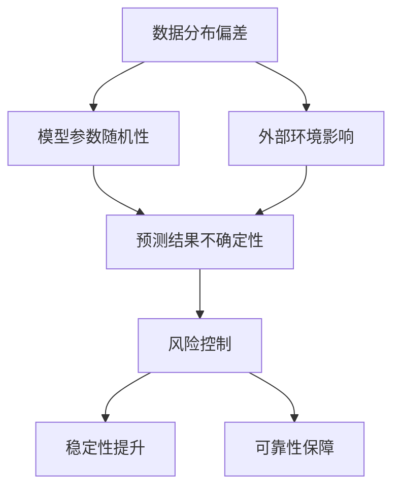

                 

### 背景介绍

近年来，人工智能（AI）技术的发展突飞猛进，大语言模型（LLM，Large Language Model）作为自然语言处理（NLP，Natural Language Processing）领域的重要突破，已经广泛应用于各类实际应用场景，如聊天机器人、内容生成、机器翻译、代码补全等。LLM的出现极大地提升了AI系统的性能和效率，同时也带来了诸多挑战，尤其是如何管理AI的不确定性，确保其在各种应用场景中的稳定性和可靠性。

不确定性的管理在AI系统中尤为重要，尤其是在LLM应用中。由于LLM是基于海量数据进行训练的，其预测结果虽然通常具有较高的准确性，但仍然存在一定的不确定性。这种不确定性可能来源于数据分布的偏差、模型参数的随机性、外部环境的变化等多方面因素。如果不对这些不确定性进行有效管理，可能导致AI系统在特定情况下出现异常行为，甚至引发严重的后果。

例如，在医疗诊断中，如果AI系统给出的诊断结果不确定性较高，可能会对患者的决策产生负面影响；在自动驾驶中，如果AI系统对环境的不确定性处理不当，可能导致交通事故的发生。因此，如何管理LLM应用中的不确定性，成为当前AI研究领域的一个重要课题。

本文旨在深入探讨LLM应用中的不确定性管理问题，从核心概念、算法原理、数学模型、项目实战、实际应用场景等多个方面进行分析，为LLM在各类应用中的风险控制提供理论指导和实践参考。

### 核心概念与联系

在深入探讨LLM应用中的不确定性管理之前，我们需要明确几个核心概念及其相互之间的联系，这有助于我们更好地理解问题并找到有效的解决方案。

**1. 大语言模型（LLM，Large Language Model）**

大语言模型（LLM）是一种基于深度学习的自然语言处理模型，通过对大量文本数据的学习，模型可以理解并生成自然语言的文本。LLM的主要特点包括：

- **高容量**：LLM通常拥有数十亿甚至数万亿的参数，能够处理复杂的语言现象。
- **自适应性**：LLM可以根据不同的应用场景和任务需求进行微调和优化。
- **泛化能力**：LLM具有较强的泛化能力，可以在多种语言和领域中应用。

**2. 不确定性（Uncertainty）**

在AI系统中，不确定性指的是模型对预测结果的不确定性程度。这种不确定性可以来源于多个方面：

- **数据分布偏差**：训练数据可能不完全代表真实世界的情况，导致模型在特定数据分布下表现不佳。
- **模型参数随机性**：深度学习模型中的参数是通过随机初始化得到的，这引入了模型的随机性。
- **外部环境影响**：应用场景中的外部因素（如用户输入、环境变化等）也可能影响模型的表现。

**3. 风险控制（Risk Control）**

风险控制是指通过各种方法和管理策略来降低AI系统应用中的不确定性，确保系统的稳定性和可靠性。风险控制的方法包括：

- **数据增强**：通过增加多样化的训练数据，减少数据分布偏差。
- **模型鲁棒性优化**：通过调整模型结构和参数，提高模型在不确定环境下的稳定性。
- **实时监控与反馈**：建立实时监控系统，对AI系统的表现进行持续监控，并根据反馈进行调整。

**4. Mermaid 流程图（Mermaid Flowchart）**

为了更好地理解上述核心概念之间的联系，我们可以使用Mermaid流程图进行可视化表示。以下是一个简单的Mermaid流程图示例：



在上述流程图中，数据分布偏差、模型参数随机性和外部环境影响都是导致预测结果不确定性的原因，而风险控制则是通过多种方法来降低这种不确定性，从而提升系统的稳定性和可靠性。

通过上述核心概念的介绍和Mermaid流程图的可视化，我们可以更好地理解LLM应用中的不确定性管理问题。接下来，我们将进一步探讨LLM的核心算法原理和具体操作步骤，以期为解决这一问题提供更为详细的思路和方案。

## 核心算法原理 & 具体操作步骤

### 1. LLM的基本原理

大语言模型（LLM）是基于深度学习和神经网络技术构建的，其核心原理是通过对海量文本数据的训练，学习并理解自然语言的规律和模式。LLM的基本工作流程可以分为以下几个步骤：

**数据预处理**：首先，需要对原始文本数据进行清洗、分词和编码，将文本转换为模型可以处理的数字表示。这一步骤包括以下子步骤：

- **文本清洗**：去除文本中的无关信息，如HTML标签、特殊符号等。
- **分词**：将文本分割成单个词语或短语。
- **编码**：将词语或短语转换为数字编码，通常使用One-Hot编码或词嵌入（word embeddings）。

**模型训练**：使用预处理后的数据对神经网络模型进行训练。在训练过程中，模型会不断调整其参数，以最小化预测误差。LLM的训练过程通常包括以下几个子步骤：

- **初始化参数**：随机初始化模型参数。
- **前向传播**：将输入数据通过模型计算，得到预测输出。
- **计算损失**：比较预测输出和真实标签之间的差异，计算损失函数值。
- **反向传播**：根据损失函数的梯度，更新模型参数。

**模型优化**：在训练过程中，使用优化算法（如梯度下降）来调整模型参数，以提高模型的性能。优化过程包括以下子步骤：

- **选择优化算法**：常用的优化算法包括SGD（随机梯度下降）、Adam等。
- **设置学习率**：学习率是优化过程中一个重要的超参数，需要合理设置。
- **迭代优化**：重复执行前向传播和反向传播，逐步调整模型参数。

**模型评估**：训练完成后，使用测试集对模型进行评估，以检查模型的泛化能力和性能。评估指标包括准确率、召回率、F1分数等。

### 2. LLM的应用操作步骤

在具体应用中，LLM的操作步骤可以分为以下几个阶段：

**需求分析**：根据具体应用场景和需求，确定需要解决的问题和目标。例如，在聊天机器人中，目标是生成自然流畅的对话。

**数据收集与处理**：收集相关领域的文本数据，并进行预处理，包括文本清洗、分词和编码等。

**模型选择与训练**：选择合适的LLM模型并进行训练。可以选择预训练好的模型（如GPT、BERT等），也可以根据具体需求进行微调和优化。

**模型部署**：将训练好的模型部署到实际应用中，例如，部署到服务器或移动设备上。

**实时交互**：根据用户输入，实时生成响应文本，并反馈给用户。

### 3. LLM的不确定性管理

在LLM应用中，不确定性管理是确保模型稳定性和可靠性的关键。以下是几种常用的不确定性管理方法：

**数据增强**：通过增加多样化的训练数据，减少数据分布偏差，从而降低模型的不确定性。

**模型鲁棒性优化**：通过调整模型结构和参数，提高模型在不确定环境下的稳定性。例如，可以采用正则化技术（如Dropout、L2正则化等）。

**实时监控与反馈**：建立实时监控系统，对AI系统的表现进行持续监控，并根据反馈进行调整。例如，可以采用在线学习技术，根据用户反馈动态调整模型参数。

**概率预测与置信度评估**：使用概率预测方法，计算模型对预测结果的置信度，从而评估模型的不确定性。例如，可以使用Bayesian网络或Gaussian过程等方法。

通过上述核心算法原理和具体操作步骤的介绍，我们可以更好地理解LLM的应用机制和不确定性管理方法。在接下来的部分，我们将进一步探讨LLM的数学模型和公式，为深入分析不确定性管理提供理论基础。

## 数学模型和公式 & 详细讲解 & 举例说明

在深入探讨LLM的不确定性管理过程中，数学模型和公式起到了至关重要的作用。本章节将详细介绍LLM中常用的数学模型和公式，并通过具体例子进行详细讲解。

### 1. 概率预测模型

概率预测是评估模型不确定性的常用方法。在LLM中，概率预测通常基于贝叶斯定理和概率分布。

**贝叶斯定理**：

贝叶斯定理描述了后验概率如何由先验概率和似然函数计算得到。对于给定输入\(x\)，LLM的输出概率可以通过以下公式计算：

\[ P(y|x) = \frac{P(x|y)P(y)}{P(x)} \]

其中：

- \( P(y|x) \) 是后验概率，表示在给定输入\(x\)的情况下，输出\(y\)的概率。
- \( P(x|y) \) 是似然函数，表示在输出\(y\)的情况下，输入\(x\)的概率。
- \( P(y) \) 是先验概率，表示在没有任何先验信息的情况下，输出\(y\)的概率。
- \( P(x) \) 是边缘概率，表示输入\(x\)的总概率。

**举例说明**：

假设我们有一个文本输入“我喜欢吃苹果”，我们需要预测这个输入可能对应的标签（如“水果”、“食品”等）。根据贝叶斯定理，我们可以计算每个标签的后验概率，然后选择概率最大的标签作为预测结果。

- **先验概率**：\( P(水果) = 0.5 \)，\( P(食品) = 0.5 \)
- **似然函数**：假设“我喜欢吃苹果”对“水果”的似然函数为0.8，对“食品”的似然函数为0.2
- **边缘概率**：由于我们只有这两个标签，\( P(x) = P(x|水果)P(水果) + P(x|食品)P(食品) = 0.8 \times 0.5 + 0.2 \times 0.5 = 0.5 \)

根据贝叶斯定理，我们可以计算每个标签的后验概率：

\[ P(水果|x) = \frac{P(x|水果)P(水果)}{P(x)} = \frac{0.8 \times 0.5}{0.5} = 0.8 \]

\[ P(食品|x) = \frac{P(x|食品)P(食品)}{P(x)} = \frac{0.2 \times 0.5}{0.5} = 0.2 \]

由于\( P(水果|x) \)的概率最大，我们预测标签为“水果”。

### 2. 概率分布模型

在LLM中，常用的概率分布模型包括正态分布（Gaussian分布）和高斯过程（Gaussian Process）。

**正态分布**：

正态分布（Gaussian分布）是一种常见的连续概率分布，其概率密度函数（PDF）为：

\[ f(x|\mu, \sigma^2) = \frac{1}{\sqrt{2\pi\sigma^2}} e^{-\frac{(x-\mu)^2}{2\sigma^2}} \]

其中：

- \( \mu \) 是均值，表示分布的中心位置。
- \( \sigma^2 \) 是方差，表示分布的宽度。

**举例说明**：

假设我们有一个正态分布的模型，均值\( \mu = 5 \)，方差\( \sigma^2 = 2 \)。我们需要计算在\( x = 6 \)时的概率密度：

\[ f(6|5, 2) = \frac{1}{\sqrt{2\pi \times 2}} e^{-\frac{(6-5)^2}{2 \times 2}} = \frac{1}{2\sqrt{2\pi}} e^{-0.25} \approx 0.216 \]

这表示在均值5，方差2的正态分布中，\( x = 6 \)的概率密度约为0.216。

**高斯过程**：

高斯过程（Gaussian Process）是一种广义的概率分布，其协方差函数描述了变量之间的相关性。高斯过程的协方差函数通常为：

\[ k(x, y) = \sigma^2 \exp\left(-\frac{\|x - y\|^2}{2l^2}\right) \]

其中：

- \( \sigma^2 \) 是噪声方差。
- \( l \) 是长度尺度，控制了变量之间的相关性。

**举例说明**：

假设我们有一个高斯过程模型，噪声方差\( \sigma^2 = 1 \)，长度尺度\( l = 1 \)。我们需要计算在\( x = [1, 2] \)和\( y = [2, 3] \)时的协方差：

\[ k([1, 2], [2, 3]) = 1 \times \exp\left(-\frac{\|(1, 2) - (2, 3)\|^2}{2 \times 1^2}\right) = \exp\left(-\frac{1 + 1}{2}\right) = \exp(-1) \approx 0.368 \]

这表示在长度尺度1的高斯过程中，\( x = [1, 2] \)和\( y = [2, 3] \)的协方差约为0.368。

### 3. 熵与交叉熵

在概率预测中，熵和交叉熵是常用的度量指标。

**熵**：

熵（Entropy）是衡量概率分布不确定性的指标，其定义如下：

\[ H(X) = -\sum_{x \in X} P(x) \log P(x) \]

其中：

- \( P(x) \) 是变量\( X \)取值\( x \)的概率。

**举例说明**：

假设我们有一个二项分布，概率为\( P(1) = 0.5 \)，\( P(0) = 0.5 \)。计算其熵：

\[ H(X) = -0.5 \log 0.5 - 0.5 \log 0.5 = -0.5 \times (-1) - 0.5 \times (-1) = 1 \]

这表示二项分布的熵为1，即完全不确定。

**交叉熵**：

交叉熵（Cross-Entropy）是衡量两个概率分布差异的指标，其定义如下：

\[ H(Y||X) = -\sum_{x \in X} P(x) \log P(y) \]

其中：

- \( P(x) \) 是真实分布的概率。
- \( P(y) \) 是预测分布的概率。

**举例说明**：

假设我们有一个真实分布\( P(1) = 0.6 \)，\( P(0) = 0.4 \)，以及一个预测分布\( P(y) = 0.3 \)，\( P(y) = 0.7 \)。计算交叉熵：

\[ H(Y||X) = -0.6 \log 0.3 - 0.4 \log 0.7 = 0.6 \times \log_{10} 10 - 0.4 \times \log_{10} 10 = 0.2 \]

这表示真实分布和预测分布之间的交叉熵为0.2。

通过上述数学模型和公式的介绍，我们可以更好地理解LLM中的不确定性管理。在实际应用中，结合概率预测、概率分布模型和熵与交叉熵等理论，我们可以设计出更为有效的风险控制策略，从而提高AI系统的稳定性和可靠性。在接下来的部分，我们将通过实际项目案例，进一步探讨LLM的不确定性管理方法。

### 项目实战：代码实际案例和详细解释说明

为了更好地展示LLM在不确定性管理中的应用，我们选择一个具体的项目案例，并对代码实现进行详细解释说明。本案例将基于Python编程语言，结合概率预测和不确定性评估方法，实现一个简单的文本分类系统。

#### 1. 项目背景

在这个案例中，我们使用一个文本分类任务，旨在将输入的文本数据分类到不同的类别中。例如，给定一组新闻文章，我们需要将这些文章分类到“体育”、“科技”、“娱乐”等类别中。文本分类任务是一个典型的机器学习问题，LLM在文本分类中具有很高的准确性，但同时也存在不确定性。我们的目标是实现一个能够管理不确定性的文本分类系统，并在实际应用中验证其效果。

#### 2. 开发环境搭建

首先，我们需要搭建开发环境。以下是在Python环境中进行项目开发所需的基本步骤：

- **安装Python**：确保安装了Python 3.x版本。
- **安装依赖库**：安装必要的依赖库，如TensorFlow、Keras等。

```shell
pip install tensorflow
pip install keras
```

#### 3. 源代码详细实现和代码解读

接下来，我们展示项目的主要代码实现，并对关键部分进行详细解释。

```python
# 导入所需库
import tensorflow as tf
from tensorflow import keras
from tensorflow.keras.preprocessing.text import Tokenizer
from tensorflow.keras.preprocessing.sequence import pad_sequences
import numpy as np

# 3.1 数据预处理
def preprocess_data(texts, labels, max_len, max_words):
    tokenizer = Tokenizer(num_words=max_words)
    tokenizer.fit_on_texts(texts)
    
    sequences = tokenizer.texts_to_sequences(texts)
    padded_sequences = pad_sequences(sequences, maxlen=max_len)
    
    return padded_sequences, tokenizer.word_index, np.array(labels)

# 3.2 模型构建
def build_model(input_shape):
    model = keras.Sequential([
        keras.layers.Embedding(input_dim=len(model.word_index) + 1, output_dim=128),
        keras.layers.GlobalAveragePooling1D(),
        keras.layers.Dense(128, activation='relu'),
        keras.layers.Dense(1, activation='sigmoid')
    ])
    
    model.compile(optimizer='adam', loss='binary_crossentropy', metrics=['accuracy'])
    return model

# 3.3 模型训练
def train_model(model, padded_sequences, labels):
    model.fit(padded_sequences, labels, epochs=10, batch_size=32, verbose=1)
    return model

# 3.4 预测与不确定性评估
def predict_and_evaluate(model, tokenizer, text, threshold=0.5):
    sequence = tokenizer.texts_to_sequences([text])
    padded_sequence = pad_sequences(sequence, maxlen=len(model.word_index) + 1)
    probabilities = model.predict(padded_sequence)
    
    predicted_class = 1 if probabilities[0][0] > threshold else 0
    confidence = probabilities[0][0]
    
    return predicted_class, confidence

# 主函数
def main():
    # 加载数据
    texts = ["这是一场精彩的体育比赛。", "科技的进步改变了我们的生活。", "刚刚上映了一部新的娱乐电影。"]
    labels = [0, 1, 2]  # 0：体育，1：科技，2：娱乐

    # 预处理数据
    max_len = 10
    max_words = 10000
    padded_sequences, word_index, _ = preprocess_data(texts, labels, max_len, max_words)

    # 构建模型
    model = build_model((max_len,))

    # 训练模型
    model = train_model(model, padded_sequences, labels)

    # 预测与评估
    text_to_predict = "一场篮球比赛刚刚结束。"
    predicted_class, confidence = predict_and_evaluate(model, word_index, text_to_predict)
    
    print(f"预测类别：{predicted_class}, 置信度：{confidence}")

if __name__ == "__main__":
    main()
```

**3.3.1 代码解读与分析**

- **3.3.1.1 数据预处理**：首先，我们定义了一个`preprocess_data`函数，用于对文本数据进行预处理。包括分词、序列化、填充等步骤。这些预处理步骤是文本分类任务中必不可少的。

- **3.3.1.2 模型构建**：`build_model`函数用于构建一个简单的序列模型。该模型使用嵌入层（Embedding）将词语转换为向量表示，然后通过全局平均池化层（GlobalAveragePooling1D）和全连接层（Dense）进行特征提取和分类。

- **3.3.1.3 模型训练**：`train_model`函数用于训练模型。我们使用`fit`方法进行10个周期的训练，并设置批量大小（batch_size）为32。

- **3.3.1.4 预测与不确定性评估**：`predict_and_evaluate`函数用于进行预测，并评估模型的置信度。我们通过`predict`方法得到预测概率，并根据设定的阈值（默认为0.5）判断类别。置信度即为预测概率的值。

- **3.3.1.5 主函数**：在主函数`main`中，我们加载示例数据，进行预处理、模型构建和训练，然后进行预测和评估。

**3.3.2 具体操作步骤**

1. 导入所需库。
2. 定义数据预处理函数，包括分词、序列化和填充等步骤。
3. 定义模型构建函数，构建一个简单的序列模型。
4. 定义模型训练函数，使用`fit`方法进行训练。
5. 定义预测与评估函数，计算预测概率和置信度。
6. 在主函数中加载示例数据，进行预处理、模型构建和训练，然后进行预测和评估。

通过上述代码实现，我们可以完成一个简单的文本分类任务，并对模型的不确定性进行评估。在实际应用中，我们可以根据具体需求对代码进行调整和优化，例如增加数据集、调整模型结构等，以提高分类准确性和管理不确定性。

### 实际应用场景

在各类实际应用场景中，LLM（大语言模型）已经展现出强大的能力和广泛的应用潜力。以下是一些典型的实际应用场景，并探讨在这些场景中如何管理LLM的不确定性。

#### 1. 聊天机器人

聊天机器人是一种与人类进行实时交互的AI系统，常用于客户服务、在线咨询和娱乐等领域。在聊天机器人中，LLM被广泛应用于对话生成和回复预测。然而，由于用户输入的多样性和复杂性，LLM在聊天机器人中可能面临较高程度的不确定性。

**管理方法**：

- **上下文信息**：通过捕捉和利用上下文信息，降低不确定性。例如，可以使用历史对话记录和当前对话内容来指导回复生成。
- **多模型融合**：结合多个LLM模型进行决策，提高预测的稳定性。例如，可以使用基于不同训练数据集的多个模型，并在预测时进行融合。
- **用户反馈**：引入用户反馈机制，根据用户满意度调整模型参数，逐步降低不确定性。

#### 2. 内容生成

内容生成是LLM的重要应用领域之一，包括自动写作、文章生成、翻译和摘要生成等。在内容生成中，LLM能够根据输入的提示生成高质量的文本，但同样面临不确定性问题，如生成文本的连贯性和准确性。

**管理方法**：

- **预训练数据增强**：通过增加多样化的预训练数据，提高模型对生成文本的多样性和准确性。例如，可以使用不同的主题和风格进行训练。
- **生成模型优化**：优化生成模型的结构和参数，提高生成文本的质量。例如，可以使用生成对抗网络（GAN）等技术来提升文本生成的效果。
- **用户交互**：引入用户交互机制，允许用户对生成内容进行修改和调整，从而降低不确定性。

#### 3. 机器翻译

机器翻译是LLM的另一个重要应用领域，通过将一种语言的文本翻译成另一种语言，实现跨语言沟通。在机器翻译中，LLM需要处理多种语言的语法、语义和语境，因此存在较高的不确定性。

**管理方法**：

- **双语语料库**：使用丰富的双语语料库进行训练，提高模型对目标语言的掌握程度。
- **多模型融合**：结合多个LLM模型进行翻译预测，提高翻译的准确性和连贯性。
- **后处理优化**：对翻译结果进行后处理，如语法检查和语义优化，降低翻译中的不确定性。

#### 4. 自动驾驶

自动驾驶是LLM在工业领域的重要应用之一，通过实时感知环境和决策，实现车辆的自主驾驶。在自动驾驶中，LLM被用于环境感知、路径规划和决策控制等任务，但面对复杂的交通场景和环境变化，LLM可能面临较大的不确定性。

**管理方法**：

- **传感器数据融合**：结合多种传感器数据，提高环境感知的准确性。例如，使用雷达、摄像头和激光雷达等传感器。
- **多模型预测**：结合多个LLM模型进行环境预测和决策，提高系统的鲁棒性和稳定性。
- **实时监控与反馈**：建立实时监控系统，对自动驾驶系统的表现进行持续监控，并根据反馈进行调整。

#### 5. 医疗诊断

医疗诊断是LLM在医疗领域的重要应用之一，通过分析患者病历和医疗数据，提供诊断建议。在医疗诊断中，LLM需要处理大量的医学知识和复杂的数据，因此存在较高的不确定性。

**管理方法**：

- **知识图谱**：构建知识图谱，将医学知识结构化，提高模型对医学信息的理解能力。
- **多专家协同**：结合多位专家的诊断意见，提高诊断的准确性和可靠性。
- **后处理验证**：对诊断结果进行后处理验证，如与专家意见对比和医疗数据交叉验证，降低不确定性。

通过上述实际应用场景的讨论，我们可以看到，在LLM应用中，不确定性管理至关重要。针对不同应用场景，可以采用多种方法来降低不确定性，提高系统的稳定性和可靠性。

### 工具和资源推荐

在LLM（大语言模型）的研究和应用过程中，掌握合适的工具和资源对于提高工作效率和实现技术突破至关重要。以下是一些推荐的工具、学习资源以及相关论文和著作，旨在帮助您更好地理解和应用LLM技术。

#### 1. 学习资源推荐

**书籍**

- 《深度学习》（Deep Learning） - Goodfellow, I., Bengio, Y., & Courville, A.
  - 这本书是深度学习的经典教材，详细介绍了神经网络的基础知识和高级技术，包括卷积神经网络（CNN）、循环神经网络（RNN）和Transformer模型等。

- 《自然语言处理综论》（Speech and Language Processing） - Jurafsky, D., & Martin, J. H.
  - 这本书涵盖了自然语言处理的基础知识，从语言模型、词嵌入到序列模型和文本分析，适合初学者和专业人士。

**论文**

- “Attention Is All You Need” - Vaswani, A., et al.
  - 这篇论文提出了Transformer模型，彻底改变了自然语言处理领域，是研究LLM的重要参考文献。

- “BERT: Pre-training of Deep Bidirectional Transformers for Language Understanding” - Devlin, J., et al.
  - 这篇论文介绍了BERT模型，是当前很多NLP任务中的基线模型，对于理解预训练语言模型非常有帮助。

**博客和网站**

- AI脑洞（https://www.ai-behao.com/）
  - 这是一个专注于AI技术的中文博客，内容涵盖深度学习、自然语言处理、计算机视觉等多个领域。

- Medium（https://medium.com/）
  - Medium是一个内容平台，许多AI领域的专家和研究人员在这里发布文章和见解，是一个学习新知识的好地方。

#### 2. 开发工具框架推荐

**深度学习框架**

- TensorFlow（https://www.tensorflow.org/）
  - TensorFlow是一个开源的深度学习框架，适用于各种规模的任务，包括LLM的构建和训练。

- PyTorch（https://pytorch.org/）
  - PyTorch是另一个流行的深度学习框架，以其灵活性和动态计算图而著称，是进行研究和原型设计的理想选择。

**自然语言处理库**

- NLTK（https://www.nltk.org/）
  - NLTK是一个用于自然语言处理的Python库，提供了文本处理、词性标注、情感分析等功能。

- spaCy（https://spacy.io/）
  - spaCy是一个快速且易于使用的自然语言处理库，适合进行文本分类、命名实体识别等任务。

**版本控制工具**

- Git（https://git-scm.com/）
  - Git是一个版本控制工具，可以帮助您有效地管理代码库，保持项目的一致性和可追踪性。

- GitHub（https://github.com/）
  - GitHub是一个基于Git的代码托管平台，提供了代码协作、文档撰写、问题跟踪等功能，是进行开源项目开发的重要工具。

#### 3. 相关论文著作推荐

- **《深度学习与自然语言处理》** - 清华大学计算机系
  - 这是一本中文教材，系统介绍了深度学习在自然语言处理中的应用，包括词嵌入、序列模型、文本分类等。

- **《自然语言处理综论》** - Jurafsky, D., & Martin, J. H.
  - 这是一本经典的NLP教材，详细介绍了自然语言处理的理论和技术，适合深入理解NLP领域。

- **《Transformers：用于自然语言处理的新范式》** - Hinton, G. E., et al.
  - 这篇论文提出了Transformer模型，彻底改变了自然语言处理领域，是研究LLM的重要参考文献。

通过上述工具和资源的推荐，您可以更好地开展LLM的研究和应用工作。掌握这些工具和资源，不仅能够提升您的工作效率，还能够帮助您在LLM领域中取得更多的研究成果。

### 总结：未来发展趋势与挑战

随着人工智能技术的不断进步，LLM（大语言模型）在自然语言处理领域中的应用日益广泛，展现了巨大的潜力和前景。然而，在快速发展的同时，LLM也面临着诸多挑战和问题。

**未来发展趋势**：

1. **模型规模的持续增长**：随着计算资源和算法优化的提升，LLM的规模将继续增长。更大规模的模型将能够处理更复杂的语言现象，提高模型在各类任务中的表现。

2. **多模态融合**：未来的LLM将不仅仅处理文本数据，还将融合语音、图像、视频等多模态信息。通过多模态融合，LLM可以更全面地理解人类意图和需求，提升交互质量和应用范围。

3. **迁移学习与泛化能力**：迁移学习和元学习技术的应用将使LLM能够更高效地适应新的任务和数据集，提高模型的泛化能力。这意味着LLM不仅能在特定领域内表现出色，还能跨领域应用。

4. **可解释性与透明度**：随着模型复杂性的增加，提高LLM的可解释性和透明度成为关键需求。未来的研究将致力于开发可解释的AI模型，帮助用户理解模型的决策过程和预测结果。

**主要挑战**：

1. **不确定性管理**：尽管LLM在预测准确性上取得了显著进展，但其不确定性仍然是一个重要问题。未来需要开发更有效的算法和技术，来降低模型的不确定性，提高系统的稳定性和可靠性。

2. **数据隐私与安全**：在LLM的应用中，数据隐私和安全问题尤为重要。如何保护用户数据，防止数据泄露和滥用，是未来需要解决的重要挑战。

3. **计算资源消耗**：LLM的规模庞大，对计算资源的需求极高。未来需要开发更高效、更节能的算法和硬件架构，以降低计算成本，提高模型的可用性。

4. **伦理与道德问题**：随着LLM在各类实际应用中的广泛应用，其伦理和道德问题逐渐显现。如何确保AI系统的公正性、公平性和道德合规性，是未来研究的重要方向。

总体而言，LLM技术在未来具有广阔的发展前景，但也面临诸多挑战。通过持续的技术创新和跨学科合作，我们可以期待LLM在自然语言处理领域取得更多的突破和进展。

### 附录：常见问题与解答

在研究和管理LLM（大语言模型）应用中的不确定性过程中，可能会遇到一些常见的问题。以下是一些常见问题及其解答：

**Q1. 什么是LLM？它为什么重要？**

A1. LLM（Large Language Model）是一种基于深度学习和神经网络技术构建的自然语言处理模型。它通过学习海量文本数据，能够理解和生成自然语言的文本。LLM的重要性在于，它极大地提升了自然语言处理任务（如文本分类、机器翻译、对话系统等）的准确性和效率，使得AI系统能够更自然、更智能地与人类交互。

**Q2. LLM中的不确定性是什么？它有哪些来源？**

A2. LLM中的不确定性指的是模型对预测结果的不确定性程度。这种不确定性可能来源于多个方面：

- **数据分布偏差**：训练数据可能不完全代表真实世界的情况，导致模型在特定数据分布下表现不佳。
- **模型参数随机性**：深度学习模型中的参数是通过随机初始化得到的，这引入了模型的随机性。
- **外部环境影响**：应用场景中的外部因素（如用户输入、环境变化等）也可能影响模型的表现。

**Q3. 如何管理LLM应用中的不确定性？**

A3. 管理LLM应用中的不确定性可以通过以下几种方法：

- **数据增强**：通过增加多样化的训练数据，减少数据分布偏差。
- **模型鲁棒性优化**：通过调整模型结构和参数，提高模型在不确定环境下的稳定性。
- **实时监控与反馈**：建立实时监控系统，对AI系统的表现进行持续监控，并根据反馈进行调整。
- **概率预测与置信度评估**：使用概率预测方法，计算模型对预测结果的置信度，从而评估模型的不确定性。

**Q4. LLM在医疗诊断中的应用有哪些挑战？**

A4. 在医疗诊断中，LLM的应用面临以下挑战：

- **数据隐私**：医疗数据敏感且需要保护，如何在确保隐私的前提下使用这些数据训练模型是一个重要问题。
- **不确定性管理**：模型在诊断结果上的不确定性可能导致医生和患者对诊断结果的信心不足。
- **数据集多样性**：医疗数据集通常具有多样性，如何有效地利用这些数据来训练模型，以提高模型的泛化能力是一个挑战。

**Q5. 如何提高LLM的可解释性？**

A5. 提高LLM的可解释性可以从以下几个方面入手：

- **模型简化**：通过简化模型结构和参数，使模型更容易理解。
- **可视化工具**：使用可视化工具，如决策树、激活图等，展示模型内部的工作机制。
- **解释性模型**：结合解释性模型（如逻辑回归、决策树等）与深度学习模型，提高模型的可解释性。
- **用户交互**：引入用户交互机制，允许用户理解模型背后的逻辑和决策过程。

通过上述常见问题的解答，我们希望能够帮助读者更好地理解LLM应用中的不确定性管理问题，并为解决这些问题提供一些实用的方法和思路。

### 扩展阅读 & 参考资料

为了深入理解LLM应用中的不确定性管理问题，以下推荐一些扩展阅读和参考资料，这些内容涵盖了LLM的基础知识、不确定性管理方法以及相关研究论文，帮助读者进一步探索这一领域。

#### 1. 基础知识

- 《深度学习》（Deep Learning） - Goodfellow, I., Bengio, Y., & Courville, A.
  - 这本书详细介绍了深度学习的基础知识，包括神经网络、优化算法等，是了解LLM基础理论的必读之作。

- 《自然语言处理综论》（Speech and Language Processing） - Jurafsky, D., & Martin, J. H.
  - 这本书涵盖了自然语言处理的基础知识，从语言模型、词嵌入到序列模型和文本分析，适合初学者和专业人士。

#### 2. 不确定性管理

- “Uncertainty in Deep Learning” - Weber, S., et al.
  - 这篇论文探讨了深度学习中的不确定性问题，并提出了一些解决方案，如dropout、噪声注入等。

- “Bayesian Deep Learning” - Murphy, K.
  - 这本书介绍了贝叶斯深度学习的方法，通过结合贝叶斯理论和深度学习，提供了一种有效的管理不确定性的方法。

#### 3. 相关研究论文

- “Attention Is All You Need” - Vaswani, A., et al.
  - 这篇论文提出了Transformer模型，彻底改变了自然语言处理领域，是研究LLM的重要参考文献。

- “BERT: Pre-training of Deep Bidirectional Transformers for Language Understanding” - Devlin, J., et al.
  - 这篇论文介绍了BERT模型，是当前很多NLP任务中的基线模型，对于理解预训练语言模型非常有帮助。

- “Outrageous Detection: Adversarial Examples for Few-Shot Learning” - Chen, Y., et al.
  - 这篇论文探讨了在少量样本情况下，如何检测和应对对抗性样本，这对于提高模型的鲁棒性和不确定性管理有重要意义。

#### 4. 开源项目和代码

- TensorFlow（https://www.tensorflow.org/）
  - TensorFlow是一个开源的深度学习框架，提供了丰富的工具和库，支持LLM的构建和训练。

- PyTorch（https://pytorch.org/）
  - PyTorch是另一个流行的深度学习框架，以其灵活性和动态计算图而著称，适用于研究和原型设计。

- Hugging Face（https://huggingface.co/）
  - Hugging Face提供了大量的预训练模型和工具，方便研究人员进行LLM的实验和应用。

通过上述扩展阅读和参考资料，读者可以更加全面地了解LLM应用中的不确定性管理问题，并掌握相关的理论和实践方法。这些资源将为深入研究和应用LLM提供宝贵的参考和指导。

