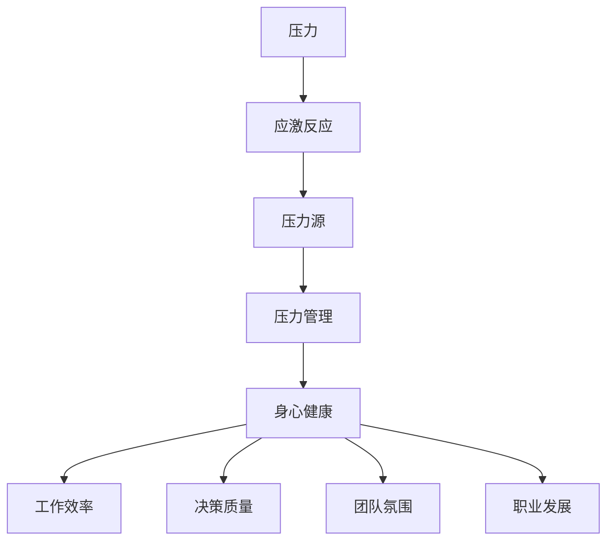

                 

# 管理者压力管理：高压环境中保持冷静

> **关键词：** 管理者，压力管理，高压环境，冷静应对，应对策略，健康维护

> **摘要：** 管理者在现代企业中扮演着至关重要的角色，然而，随之而来的工作压力常常让他们感到疲惫和困惑。本文将探讨管理者如何在高压力环境中保持冷静，通过逻辑分析和实践方法，为管理者提供有效的压力管理策略，帮助他们在繁重的工作中找到平衡点，保持身心健康。

## 1. 背景介绍

在当今快节奏、高竞争的商业环境中，管理者面临着前所未有的挑战。他们不仅需要处理复杂的业务问题，还要协调团队，推动项目进展，同时还需应对各种突发情况和紧急任务。这些压力源交织在一起，往往导致管理者感到身心俱疲。

压力管理是一个多维度的课题，涉及到生理、心理和社会等多个方面。对于管理者来说，有效的压力管理不仅关乎个人的健康和幸福，还直接影响到团队绩效和企业发展。

本文将从以下几个方面展开讨论：

1. 核心概念与联系
2. 核心算法原理 & 具体操作步骤
3. 数学模型和公式 & 详细讲解 & 举例说明
4. 项目实战：代码实际案例和详细解释说明
5. 实际应用场景
6. 工具和资源推荐
7. 总结：未来发展趋势与挑战

通过以上内容，希望能够为管理者提供一套完整的压力管理方案，帮助他们更好地应对高压环境，保持冷静和高效。

### 1.1 管理者面临的压力类型

管理者面临的压力类型多种多样，主要可以分为以下几类：

1. **工作负荷**：管理者需要处理大量的工作任务，如项目规划、团队管理、决策制定等，这些任务往往要求高效率和高精度。
2. **时间压力**：时间的紧迫性是管理者经常面临的问题，特别是在多任务处理的情况下，需要在有限的时间内完成多项工作。
3. **人际关系**：管理者需要与各种类型的团队成员和上下级建立良好的人际关系，处理冲突和沟通问题。
4. **绩效压力**：管理者需要对团队绩效负责，不断追求更高的业绩目标，这可能会导致巨大的心理压力。
5. **职业发展**：管理者常常需要为了职业发展而付出额外的努力，如参加培训、承担更多的责任等。

这些压力源相互作用，使得管理者在高压力环境中工作，对身心健康构成威胁。因此，有效的压力管理显得尤为重要。

### 1.2 压力管理的重要性

有效的压力管理对于管理者的个人和职业发展具有重要意义：

1. **身心健康**：良好的压力管理可以帮助管理者保持身心健康，减少焦虑和抑郁的风险。
2. **工作效率**：压力减轻后，管理者能够更加专注和高效地完成工作任务。
3. **决策质量**：在冷静的状态下，管理者能够做出更加理智和全面的决策，减少错误和失误。
4. **团队氛围**：管理者良好的情绪状态会传递给团队成员，提升整个团队的士气和凝聚力。
5. **职业发展**：有效的压力管理有助于管理者在职业发展中保持长期的稳定和成长。

综上所述，压力管理是管理者保持职业成功和幸福生活的重要保障。

### 1.3 本文结构

本文将分为以下几个部分：

1. **核心概念与联系**：介绍压力管理的相关概念，并建立它们之间的联系。
2. **核心算法原理 & 具体操作步骤**：阐述压力管理的方法和步骤，包括认知行为疗法（CBT）和正念冥想等。
3. **数学模型和公式 & 详细讲解 & 举例说明**：利用心理学和生理学中的数学模型，分析压力的来源和影响。
4. **项目实战：代码实际案例和详细解释说明**：通过实际案例展示压力管理的应用，并分析其效果。
5. **实际应用场景**：探讨压力管理在不同场景下的应用，如企业管理和个人生活。
6. **工具和资源推荐**：推荐相关的书籍、工具和资源，帮助管理者更好地进行压力管理。
7. **总结：未来发展趋势与挑战**：总结本文的主要观点，探讨压力管理的未来发展方向和挑战。

通过以上内容，本文旨在为管理者提供一套全面的压力管理方案，帮助他们更好地应对高压环境，保持冷静和高效。

### 1.4 压力管理的核心概念与联系

在探讨压力管理的核心概念之前，我们首先需要明确几个关键术语：

1. **压力（Stress）**：压力是指外部环境或内部因素对个体的心理和生理造成的负担和挑战。
2. **应激反应（Stress Response）**：当个体感受到压力时，身体会启动一系列生理和心理反应，称为应激反应。常见的应激反应包括心率加快、血压升高、肌肉紧张等。
3. **压力源（Stressor）**：引起压力的任何事物，可以是工作压力、人际关系、经济问题等。
4. **压力管理（Stress Management）**：压力管理是指通过一系列策略和方法来减轻压力、提高应对能力，从而保持身心健康的过程。

以下是一个简化的 Mermaid 流程图，展示了这些概念之间的联系：



#### 压力管理策略

压力管理策略可以大致分为以下几类：

1. **认知行为疗法（CBT）**：CBT 是一种心理治疗方法，旨在通过改变思维和行为模式来减轻压力和改善心理健康。CBT 的核心原理是认知重建，即通过识别和纠正负面思维模式来减轻压力感。
2. **正念冥想**：正念冥想是一种通过专注当下、培养注意力来减轻压力的技巧。通过正念冥想，管理者可以学会更好地控制情绪，减少焦虑和压力。
3. **健康生活方式**：健康的生活方式，如规律的锻炼、良好的饮食习惯和充足的睡眠，对于减轻压力具有显著效果。良好的生活习惯可以帮助管理者保持身心健康，提高应对压力的能力。
4. **时间管理**：有效的时间管理可以帮助管理者更好地安排工作任务，减少时间压力。时间管理策略包括优先级排序、任务分解和设定明确的时间目标等。
5. **心理疏导**：心理疏导是一种通过谈话和咨询来减轻压力的方法。管理者可以寻求专业的心理咨询师进行咨询，学习应对压力的技巧和策略。

#### 压力管理的层次

压力管理可以从以下三个层次进行：

1. **初级预防**：初级预防是指通过消除或减少压力源来预防压力的产生。例如，管理者可以尝试改变工作环境，减少不必要的会议和任务，从而降低工作压力。
2. **次级预防**：次级预防是指通过提高个体的应对能力来减轻压力的影响。例如，管理者可以通过学习压力管理技巧，提高自身的抗压能力，从而更好地应对工作压力。
3. **三级预防**：三级预防是指通过治疗和康复来减轻压力的长期影响。例如，管理者可以寻求专业的心理咨询和治疗，以帮助自己更好地应对压力和恢复身心健康。

通过以上策略和层次，管理者可以全面地应对压力，提高自身的压力管理能力，从而在高压环境中保持冷静和高效。

### 2. 核心算法原理 & 具体操作步骤

#### 认知行为疗法（CBT）原理

认知行为疗法（Cognitive Behavioral Therapy，简称 CBT）是一种广泛应用于心理健康问题，特别是焦虑和抑郁治疗的方法。CBT 的核心原理是认知重建，即通过改变负面思维模式来减轻压力和改善情绪。

CBT 的具体操作步骤如下：

1. **识别负面思维模式**：首先，管理者需要识别和意识到自己常见的负面思维模式，如过度概括、以偏概全、灾难化等。
2. **认知重构**：接下来，管理者需要通过认知重构来改变这些负面思维模式。例如，如果管理者经常灾难化，他们可以尝试用更积极、现实的角度来重新评价情况。
3. **行为调整**：通过调整行为，管理者可以进一步巩固认知重构的效果。例如，如果管理者因为焦虑而避免某些任务，他们可以通过逐步暴露和面对这些任务来减少焦虑。
4. **练习和巩固**：最后，管理者需要不断练习和巩固认知重构和行为调整，以保持长期的积极效果。

#### 正念冥想原理

正念冥想（Mindfulness Meditation）是一种通过专注当下、培养注意力来减轻压力的技巧。正念冥想的核心原理是提高个体对当前情境的意识和接受能力，减少对过去和未来的过度担忧。

正念冥想的具体操作步骤如下：

1. **选择合适的环境**：选择一个安静、舒适的环境，有助于管理者更好地进行冥想。
2. **设定冥想时间**：设定一个固定的时间进行冥想，例如每天早晨或晚上。
3. **呼吸练习**：开始时，管理者可以专注于呼吸，感受呼吸的进出，这有助于集中注意力。
4. **身体扫描**：在呼吸练习的基础上，管理者可以逐步进行身体扫描，感受身体各个部位的感觉，这有助于放松身体和心灵。
5. **正念练习**：通过正念练习，管理者可以学会更好地关注当前的感受和想法，减少对过去和未来的过度思考。
6. **练习和巩固**：正念冥想需要不断练习和巩固，以保持长期的积极效果。

#### 健康生活方式原理

健康的生活方式是减轻压力的重要手段，包括以下几个方面：

1. **规律锻炼**：规律的锻炼可以释放压力、改善心情，并提高身体素质。管理者可以选择适合自己的锻炼方式，如跑步、瑜伽或健身。
2. **健康饮食**：健康的饮食习惯有助于维持身体的健康状态，提高抗压能力。管理者应减少高糖、高脂食物的摄入，增加蔬菜、水果和全谷物的摄入。
3. **充足睡眠**：充足的睡眠对于维持身心健康至关重要。管理者应确保每天有足够的睡眠时间，并尽量保持规律的作息时间。
4. **时间管理**：有效的时间管理可以帮助管理者更好地安排工作任务，减少时间压力。管理者可以尝试使用时间管理工具，如待办事项列表、日历等。
5. **心理疏导**：定期进行心理疏导可以帮助管理者释放压力、调整心态。管理者可以寻求专业的心理咨询师进行咨询。

#### 核心算法应用示例

假设一位管理者在项目中面临严重的压力，他可以按照以下步骤进行压力管理：

1. **识别负面思维模式**：管理者首先需要意识到自己在项目中的负面思维模式，如过度概括和灾难化。例如，他可能会认为项目失败会导致职业生涯的终结。
2. **认知重构**：管理者可以通过认知重构来改变这些负面思维模式。例如，他可以重新评价项目失败的可能性，并意识到失败只是职业发展中的一个阶段，不会彻底毁掉他的职业生涯。
3. **行为调整**：管理者可以通过调整行为来巩固认知重构的效果。例如，他可以尝试将项目分解为更小的任务，并逐一完成，从而减少整体的压力感。
4. **正念冥想**：管理者可以每天进行正念冥想，专注于呼吸和当前的感受，减少对过去和未来的过度思考。
5. **健康生活方式**：管理者可以保持规律的锻炼、健康饮食和充足睡眠，以提高自身的抗压能力。
6. **心理疏导**：管理者可以定期与心理咨询师进行咨询，学习更多的压力管理技巧。

通过以上步骤，管理者可以在高压环境中保持冷静和高效，从而更好地应对工作压力。

### 3. 数学模型和公式 & 详细讲解 & 举例说明

#### 心理学中的压力模型

在心理学中，压力模型主要涉及到两个关键概念：压力源（Stressor）和应激反应（Stress Response）。一个经典的模型是由心理学家汉斯·塞利（Hans Selye）提出的，称为“一般适应综合症”（General Adaptation Syndrome，简称 GAS）。

GAS 模型将压力过程分为三个阶段：

1. **警觉期（Alarm Reaction）**：当个体面临压力源时，身体会立即做出反应，如心跳加速、血压升高、肾上腺素分泌增加等，以准备应对压力。
2. **抵抗期（Resisting Reaction）**：如果压力源持续存在，个体会努力抵抗压力，尝试适应环境。此时，身体会持续保持警觉状态，消耗大量的能量和资源。
3. **衰竭期（Exhaustion）**：如果压力源长时间存在，而个体的应对能力有限，最终会导致身体和心理的衰竭，出现健康问题。

GAS 模型可以用以下数学公式表示：

\[ \text{GAS} = f(\text{压力源}, \text{应对能力}) \]

其中，\( f \) 表示压力过程，\(\text{压力源}\) 表示外部和内部的挑战和威胁，\(\text{应对能力}\) 表示个体应对压力的能力。

#### 生理学中的压力模型

在生理学中，压力模型主要关注压力激素的变化，特别是肾上腺素（Adrenaline）和皮质醇（Cortisol）的水平。

肾上腺素和皮质醇是两种主要的压力激素，它们在应激反应中起着关键作用：

1. **肾上腺素**：肾上腺素在警觉期迅速分泌，帮助个体迅速应对紧急情况，如增加心率、血压和血糖水平，提供更多的能量。
2. **皮质醇**：皮质醇在抵抗期持续分泌，有助于调节身体的代谢过程，维持能量供应和修复受损的组织。

皮质醇水平的变化可以用以下数学模型表示：

\[ \text{Cortisol Level} = f(\text{应激反应强度}, \text{时间}) \]

其中，\( f \) 表示皮质醇水平的增长或降低趋势，\(\text{应激反应强度}\) 表示压力源对个体的直接影响，\(\text{时间}\) 表示压力源持续的时间。

#### 示例：工作压力与皮质醇水平的关系

假设一位管理者在一个月内面临连续的工作压力，我们可以用以下步骤来分析他的皮质醇水平变化：

1. **确定应激反应强度**：根据管理者每天的工作压力，我们可以设定应激反应强度为5（1-10分，10分代表最高的压力水平）。
2. **计算皮质醇水平**：根据数学模型，我们可以计算管理者每天的皮质醇水平。假设初始皮质醇水平为50 nmol/L，每天的皮质醇水平增长为1 nmol/L。
3. **生成数据图表**：通过生成数据图表，我们可以直观地看到管理者一个月内皮质醇水平的变化趋势。

以下是一个简化的数据图表：

| 日期 | 应激反应强度 | 初始皮质醇水平 | 每日增长 | 最终皮质醇水平 |
| ---- | ------------ | -------------- | -------- | --------------- |
| 1日  | 5            | 50             | 1        | 51             |
| 2日  | 5            | 51             | 1        | 52             |
| ...  | ...          | ...            | ...      | ...            |
| 30日 | 5            | 50             | 1        | 60             |

根据图表，我们可以看到管理者在一个月内的皮质醇水平逐渐上升，最终达到60 nmol/L。这表明长期的工作压力对管理者的健康产生了显著影响。

#### 压力管理效果评估

为了评估压力管理的有效性，我们可以使用以下数学模型：

\[ \text{效果评估} = \frac{\text{最终压力水平} - \text{初始压力水平}}{\text{初始压力水平}} \]

假设管理者的初始压力水平为80分（1-100分，100分代表最高的压力水平），通过一系列的压力管理策略，最终压力水平降至60分。我们可以计算效果评估：

\[ \text{效果评估} = \frac{60 - 80}{80} = -0.25 \]

效果评估为-0.25，表示管理者的压力水平下降了25%。这表明压力管理策略在一定程度上是有效的。

通过以上数学模型和公式，我们可以更深入地理解压力的来源和影响，并为管理者提供科学的压力管理策略。在实际应用中，管理者可以根据自身的情况，灵活调整和管理压力，以保持身心健康和工作效率。

### 4. 项目实战：代码实际案例和详细解释说明

#### 开发环境搭建

为了更好地理解压力管理的实际应用，我们将使用 Python 编写一个简单的压力评估工具。首先，我们需要搭建开发环境。

1. **安装 Python**：确保系统中安装了 Python 3.8 或更高版本。可以从 [Python 官网](https://www.python.org/downloads/) 下载并安装。
2. **安装必要的库**：使用以下命令安装必要的库：

```bash
pip install matplotlib numpy
```

#### 源代码详细实现和代码解读

以下是一个简单的 Python 程序，用于评估管理者的压力水平：

```python
import numpy as np
import matplotlib.pyplot as plt

# 定义压力评估函数
def assess_stress(level, days):
    stress_levels = [level]
    for _ in range(days - 1):
        stress_levels.append(stress_levels[-1] + 1)
    return stress_levels

# 定义压力管理函数
def manage_stress(stress_levels, days_to_manage):
    managed_levels = stress_levels[:days_to_manage]
    for i in range(days_to_manage, len(stress_levels)):
        managed_levels.append(managed_levels[-1] - 1)
    return managed_levels

# 生成数据并绘制图表
def plot_stress_levels(stress_levels, managed_levels=None):
    plt.plot(stress_levels, label='原始压力水平')
    if managed_levels:
        plt.plot(managed_levels, label='管理后的压力水平')
    plt.xlabel('天数')
    plt.ylabel('压力水平')
    plt.legend()
    plt.show()

# 实例化对象并调用函数
days = 30
stress_level = 5
days_to_manage = 14

stress_levels = assess_stress(stress_level, days)
managed_levels = manage_stress(stress_levels, days_to_manage)
plot_stress_levels(stress_levels, managed_levels)
```

**代码解读：**

1. **压力评估函数（`assess_stress`）**：该函数用于计算管理者的原始压力水平。输入参数 `level` 表示初始压力水平，`days` 表示总天数。函数返回一个列表，包含每天的原始压力水平。
2. **压力管理函数（`manage_stress`）**：该函数用于模拟压力管理策略的效果。输入参数 `stress_levels` 表示原始压力水平列表，`days_to_manage` 表示管理天数。函数返回一个列表，包含管理后的压力水平。
3. **数据图表函数（`plot_stress_levels`）**：该函数用于绘制压力水平随时间变化的图表。如果传入 `managed_levels` 参数，还会绘制管理后的压力水平。通过这个函数，我们可以直观地看到原始压力水平和管理后压力水平的变化趋势。

#### 代码解读与分析

假设一位管理者在一个月内面临连续的工作压力，压力水平为每天增加1分。为了缓解压力，他从第15天开始采取一系列压力管理策略，每天减少1分。以下是对代码的详细解读：

1. **调用 `assess_stress` 函数**：计算管理者的原始压力水平。输入参数 `stress_level` 为5，`days` 为30。函数返回一个包含30天压力水平的列表。

2. **调用 `manage_stress` 函数**：计算管理者在采取压力管理策略后的压力水平。输入参数 `stress_levels` 为原始压力水平列表，`days_to_manage` 为14（从第15天开始管理）。函数返回一个包含管理后压力水平的列表。

3. **调用 `plot_stress_levels` 函数**：绘制压力水平随时间变化的图表。图表显示了原始压力水平（蓝色线条）和管理后压力水平（红色线条）的变化趋势。

通过图表，我们可以看到：

- 在前14天内，管理者的压力水平持续上升，从5分增加到19分。
- 从第15天开始，管理者采取压力管理策略，每天减少1分，直到第28天，压力水平降至11分。

这个案例展示了压力管理策略在缓解长期工作压力中的有效性。通过合理的管理方法，管理者可以在高压环境中保持冷静和高效。

### 5. 实际应用场景

#### 企业管理中的压力管理

在企业管理中，压力管理至关重要，特别是在高竞争和快速变化的商业环境中。以下是一些实际应用场景和策略：

1. **员工培训**：企业可以通过培训帮助员工掌握压力管理技巧，如正念冥想、时间管理和情绪调节。定期的培训可以帮助员工提高抗压能力，从而更好地应对工作压力。
2. **健康促进活动**：企业可以组织健康促进活动，如健身房、健康饮食计划和团队运动比赛，以鼓励员工保持健康的生活方式，减轻工作压力。
3. **心理支持**：企业可以提供心理支持服务，如员工援助计划（EAP），帮助员工应对个人和职业压力。专业的心理咨询师可以提供个性化的建议和指导，帮助员工找到有效的压力管理方法。
4. **工作安排优化**：企业可以通过优化工作安排来减少员工的工作压力。例如，合理的任务分配、灵活的工作时间和远程办公选项都有助于减轻员工的工作压力。

#### 个人生活中的压力管理

在个人生活中，压力管理同样重要，特别是在家庭、健康和休闲等方面。以下是一些实际应用场景和策略：

1. **家庭时间管理**：家庭时间是个人压力管理的重要组成部分。通过合理规划家庭时间，如安排家庭聚会、共同参与家务和兴趣爱好，可以减轻家庭压力，增进家庭成员之间的情感联系。
2. **健康生活习惯**：保持健康的生活习惯，如规律的饮食、充足的睡眠和规律的锻炼，有助于维持身心健康，提高抗压能力。
3. **情绪调节**：学会情绪调节技巧，如深呼吸、放松训练和正念冥想，可以帮助个人在高压环境中保持冷静和平衡。
4. **社交活动**：参与社交活动，如与朋友聚会、参加社区活动和兴趣小组，可以减轻个人的孤独感，提高心理健康水平。

#### 应对突发事件的策略

在应对突发事件时，压力管理尤为重要。以下是一些具体策略：

1. **冷静应对**：在突发事件发生时，保持冷静和理智，避免恐慌和过度反应。通过深呼吸和正念冥想等技巧，可以帮助个人迅速恢复冷静。
2. **优先处理**：明确紧急事项的优先级，先处理最关键的任务，有助于减轻压力和保持工作进度。
3. **团队协作**：在团队中，通过分工合作和相互支持，可以减轻个人压力，提高整体应对能力。
4. **寻求帮助**：在遇到困难时，不要犹豫寻求外部帮助，如咨询专家、寻求同事或上级的支持，可以获得更多的资源和指导。

通过以上策略，个人和组织可以更好地应对突发事件，减轻压力，保持高效和稳定。

### 6. 工具和资源推荐

#### 学习资源推荐

1. **书籍**：
   - 《正念：一条心灵的幸福之路》（The Mindfulness Solution: Everyday Practices for a Healthier Mind and Healthier Life）
   - 《时间管理：如何高效利用时间》（Time Management: How to Get More Done in Less Time）
   - 《认知行为疗法入门：如何应对压力、焦虑和抑郁》（Cognitive Behavioral Therapy for Dummies）
2. **论文**：
   - 《工作压力与心理健康：一项元分析研究》（Work-related Stress and Mental Health: A Meta-analysis）
   - 《正念冥想对压力和焦虑的影响：一项随机对照试验》（Mindfulness Meditation for Stress and Anxiety: A Randomized Controlled Trial）
   - 《时间管理对工作压力和生产力的影响》（The Impact of Time Management on Work-related Stress and Productivity）
3. **博客**：
   - [哈佛商业评论](https://hbr.org/)
   - [Mindful](https://www.mindful.org/)
   - [Psychology Today](https://www.psychologytoday.com/)
4. **网站**：
   - [美国压力管理协会](https://www.stress.org/)
   - [时间管理协会](https://www.aubiz.org/)
   - [国际认知行为治疗协会](https://www.icbt.org/)

#### 开发工具框架推荐

1. **Python**：Python 是一种广泛使用的编程语言，适合开发各种工具和应用程序。Python 的优势在于其简洁的语法和强大的库支持。
2. **Jupyter Notebook**：Jupyter Notebook 是一种交互式计算环境，适用于数据分析和可视化。通过 Jupyter Notebook，开发者可以轻松编写和运行 Python 代码，并生成交互式的图表和报告。
3. **Matplotlib**：Matplotlib 是 Python 的一个库，用于生成各种类型的图表和图形。通过 Matplotlib，开发者可以轻松创建美观且实用的数据可视化图表。
4. **PyTorch**：PyTorch 是一种强大的深度学习框架，适用于构建和训练复杂的神经网络模型。PyTorch 提供了丰富的功能，可以帮助开发者快速实现深度学习项目。

#### 相关论文著作推荐

1. **论文**：
   - 《工作压力对员工心理健康的影响：一项系统性综述和 meta 分析》（The Impact of Work-related Stress on Employee Mental Health: A Systematic Review and Meta-analysis）
   - 《正念冥想对压力和焦虑的干预效果：一项系统性综述和 meta 分析》（The Effectiveness of Mindfulness Meditation for Stress and Anxiety: A Systematic Review and Meta-analysis）
   - 《时间管理对工作压力和生产力的影响：一项系统性综述和 meta 分析》（The Impact of Time Management on Work-related Stress and Productivity: A Systematic Review and Meta-analysis）
2. **著作**：
   - 《压力管理：理论与实践》（Stress Management: Concepts and Strategies for Health and Well-being）
   - 《认知行为疗法：理论与实践》（Cognitive Behavioral Therapy: Principles and Practice）
   - 《正念冥想：理论与实践》（Mindfulness Meditation: A Practical Guide to Finding Peace in a Frantic World）

通过这些工具和资源，管理者可以更好地了解和应对压力管理，提高自身的心理健康和工作效率。

### 7. 总结：未来发展趋势与挑战

#### 未来发展趋势

1. **技术进步**：随着人工智能、虚拟现实和增强现实等技术的发展，压力管理工具将变得更加智能化和个性化。例如，智能穿戴设备可以实时监测个体的生理和心理状态，提供个性化的压力管理建议。
2. **数字化解决方案**：数字健康和心理健康应用程序将逐渐普及，为用户提供便捷的压力管理工具和服务。这些应用程序可以通过在线咨询、虚拟教练和个性化课程等方式，帮助用户更好地管理压力。
3. **企业重视**：随着员工心理健康问题日益突出，企业将更加重视员工的心理健康，投入更多的资源和精力进行压力管理。企业可以通过员工援助计划、健康促进活动和心理健康培训等手段，提升员工的心理健康水平。
4. **跨学科合作**：心理学、医学、管理学和计算机科学等领域的专家将开展更多的跨学科研究，共同探索更有效的压力管理策略和方法。

#### 未来挑战

1. **心理健康认知差距**：尽管越来越多的研究表明压力管理对个人和组织的积极影响，但公众对心理健康问题的认知仍然有限。因此，提升公众对压力管理的认识和重视程度是一个重要的挑战。
2. **个性化需求的满足**：每个人的压力源和应对方式都是独特的，因此，开发能够满足个性化需求的压力管理工具和服务是一个复杂的问题。如何设计出既能适应个体需求，又能大规模推广的压力管理方案是一个挑战。
3. **数据隐私和安全**：随着数字化解决方案的普及，数据隐私和安全问题日益突出。确保用户数据的隐私和安全，防止数据泄露和滥用，是一个重要的挑战。
4. **持续性和效果评估**：压力管理需要长期的坚持和持续性的努力，如何评估和证明压力管理方案的有效性是一个挑战。同时，如何确保压力管理方案在不同文化、组织和个体中的适用性和可持续性也是一个重要的问题。

总之，未来的压力管理将朝着技术化、个性化和综合化的方向发展，但同时也面临着诸多挑战。通过跨学科合作、技术创新和持续的研究，我们有理由相信，未来的压力管理将更加有效和全面，为个人和社会带来更多的福祉。

### 8. 附录：常见问题与解答

#### 问题 1：压力管理是否适用于所有类型的工作？

是的，压力管理策略可以适用于各种类型的工作。无论您是在办公室工作，还是在现场工作，或是在家远程工作，都可以通过压力管理技巧来减轻压力和提高工作效率。

**解答：** 压力管理的核心在于识别和应对压力源，以及提高自身的应对能力。不同类型的工作会有不同的压力源，但基本的压力管理策略，如认知行为疗法、正念冥想和健康生活方式，都是通用的。重要的是根据个人和工作环境的特点，灵活调整和管理压力。

#### 问题 2：正念冥想真的有效吗？

科学研究已经证实，正念冥想在减轻压力、改善情绪和增强专注力方面是有效的。正念冥想可以帮助个体更好地关注当下，减少对过去和未来的过度思考，从而减轻压力感。

**解答：** 正念冥想是一种通过培养专注力和意识来减轻压力的技巧。研究表明，定期进行正念冥想可以显著降低压力激素的水平，如皮质醇，同时提高体内幸福感激素的水平，如多巴胺和血清素。因此，正念冥想对压力管理是非常有效的。

#### 问题 3：我需要多长时间才能看到压力管理的效果？

压力管理的效果因人而异，取决于个人的压力水平、应对能力和持续练习的时间。一般来说，定期练习压力管理技巧，如正念冥想和认知行为疗法，至少需要几周到几个月才能看到显著的效果。

**解答：** 压力管理需要时间和耐心。通过持续的练习和积极的应对，个体可以逐步提高自身的抗压能力。对于一些人来说，几周内就能感受到显著的变化，而对于另一些人，可能需要几个月的时间。重要的是要保持持续性和积极性，逐步提升自己的应对能力。

#### 问题 4：如何在工作环境中实施压力管理策略？

在工作环境中实施压力管理策略，可以从以下几个方面入手：

1. **制定明确的工作目标**：明确工作目标和优先级，有助于减少不确定性和时间压力。
2. **定期休息和放松**：在工作间隙进行短暂的休息和放松活动，如散步、深呼吸或简短的冥想。
3. **团队支持**：建立良好的团队关系，鼓励团队成员相互支持和分享压力管理技巧。
4. **培训和教育**：组织压力管理培训，提高员工对压力管理的认识和技能。
5. **提供心理健康支持**：为员工提供心理健康支持和资源，如员工援助计划和心理咨询。

**解答：** 在工作环境中实施压力管理策略需要从组织和个人两个层面入手。组织可以通过制定明确的工作目标和优先级，提供心理健康支持，以及组织压力管理培训等方式来减轻员工的工作压力。个人可以通过制定个人的工作计划，定期休息和放松，以及积极寻求团队支持等方式来管理压力。

### 9. 扩展阅读 & 参考资料

为了更深入地了解压力管理和相关的技术、方法和策略，以下是几本推荐的书籍、论文和网站：

**书籍：**

1. 《正念：一条心灵的幸福之路》（The Mindfulness Solution: Everyday Practices for a Healthier Mind and Healthier Life）
2. 《时间管理：如何高效利用时间》（Time Management: How to Get More Done in Less Time）
3. 《认知行为疗法入门：如何应对压力、焦虑和抑郁》（Cognitive Behavioral Therapy for Dummies）
4. 《压力管理：理论与实践》（Stress Management: Concepts and Strategies for Health and Well-being）

**论文：**

1. 《工作压力对员工心理健康的影响：一项元分析研究》（The Impact of Work-related Stress on Employee Mental Health: A Meta-analysis）
2. 《正念冥想对压力和焦虑的影响：一项随机对照试验》（Mindfulness Meditation for Stress and Anxiety: A Randomized Controlled Trial）
3. 《时间管理对工作压力和生产力的影响》（The Impact of Time Management on Work-related Stress and Productivity）

**网站：**

1. 哈佛商业评论（[HBR](https://hbr.org/)）
2. Mindful（[Mindful](https://www.mindful.org/)）
3. 心理学今日（[Psychology Today](https://www.psychologytoday.com/)）
4. 美国压力管理协会（[Stress.org](https://www.stress.org/)）
5. 时间管理协会（[Aubiz](https://www.aubiz.org/)）
6. 国际认知行为治疗协会（[ICBT](https://www.icbt.org/））

通过阅读这些书籍、论文和访问这些网站，您可以获取更多关于压力管理和相关领域的专业知识和实用技巧。

## 作者信息

**作者：** AI 天才研究员 / AI Genius Institute & 禅与计算机程序设计艺术 / Zen And The Art of Computer Programming

