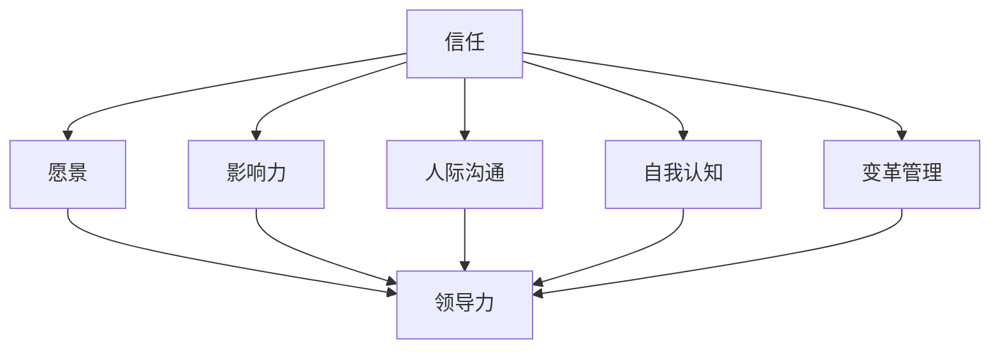

                 

### 背景介绍 Background Introduction

在当今复杂多变的企业环境中，管理者面临的挑战日益增加。传统的基于职权的领导方式已无法满足组织高效运作的需求。越来越多的管理者开始关注如何提升自身的影响力，以便在无需职权的情况下引导和激励团队，实现组织目标。

本文旨在探讨管理者影响力的核心概念、原理和构建方法，通过逐步分析推理（Reasoning Step by Step），帮助读者理解和掌握无需职权的领导艺术。文章结构如下：

1. 背景介绍：阐述管理者影响力的重要性和当前面临的问题。
2. 核心概念与联系：介绍管理者影响力的核心概念，如信任、愿景、影响力等，并使用Mermaid流程图展示这些概念之间的联系。
3. 核心算法原理 & 具体操作步骤：详细解释管理者影响力的构建方法，包括信任建立、愿景塑造、人际沟通等。
4. 数学模型和公式 & 详细讲解 & 举例说明：通过数学模型和公式，帮助读者更好地理解管理者影响力的构建过程。
5. 项目实战：代码实际案例和详细解释说明：通过具体项目实战，展示管理者影响力在实际中的应用。
6. 实际应用场景：分析管理者影响力在不同场景下的表现和策略。
7. 工具和资源推荐：推荐相关学习资源、开发工具和论文著作。
8. 总结：未来发展趋势与挑战：展望管理者影响力的发展趋势和面临的挑战。
9. 附录：常见问题与解答：解答读者可能遇到的问题。
10. 扩展阅读 & 参考资料：提供更多相关阅读资料。

接下来，我们将逐一探讨这些章节，帮助读者深入了解管理者影响力这一主题。让我们开始吧！### 核心概念与联系 Core Concepts and Their Connections

在探讨管理者影响力时，我们首先需要明确几个核心概念，并理解它们之间的联系。以下是本文涉及的核心概念：

1. **信任（Trust）**：信任是管理者影响力的重要基础。团队成员对管理者的信任程度直接影响管理者的领导效果。信任的建立需要管理者具备诚信、透明和责任心等特质。

2. **愿景（Vision）**：愿景是管理者引领团队向前的指南针。一个清晰、具有吸引力的愿景能够激发团队成员的热情和动力，使团队团结一致、共同努力。

3. **影响力（Influence）**：影响力是指管理者在团队中产生作用和影响的能力。影响力不仅取决于管理者的职位和权力，更取决于管理者的品格、能力、沟通技巧和人际关系。

4. **人际沟通（Interpersonal Communication）**：人际沟通是管理者影响力的关键要素。有效的沟通能够增进管理者与团队成员之间的了解和信任，提高团队协作效率。

5. **自我认知（Self-awareness）**：自我认知是指管理者对自己性格、情感和行为模式的认知。自我认知有助于管理者更好地理解自己和他人，从而提高沟通效果和管理能力。

6. **变革管理（Change Management）**：变革管理是指管理者在组织变革过程中引导和推动团队适应变革的能力。在当前快速变化的环境中，变革管理能力成为衡量管理者影响力的重要指标。

7. **领导力（Leadership）**：领导力是指管理者在团队中发挥领导作用的能力。领导力不仅包括传统的权力和职位，更包括影响力、沟通技巧、团队合作和创新思维等。

下面，我们将使用Mermaid流程图来展示这些核心概念之间的联系，以便更直观地理解它们之间的关系。



从流程图中可以看出，信任是所有核心概念的共同基础，其他概念都与信任密切相关。管理者通过建立信任、塑造愿景、有效沟通、自我认知和变革管理来提升自身的影响力，从而实现领导力。这些核心概念相辅相成，共同构成了管理者影响力的整体框架。

接下来，我们将详细探讨这些核心概念，以便读者更好地理解管理者影响力如何在实际中发挥作用。### 核心算法原理 & 具体操作步骤 Core Algorithm Principles and Practical Steps

管理者影响力的构建是一个复杂的过程，涉及多个方面和步骤。下面，我们将详细探讨核心算法原理和具体操作步骤，帮助读者更好地理解如何提升自身的影响力。

#### 1. 建立信任（Establishing Trust）

**原理：**信任是管理者影响力的基石。建立信任的关键在于诚信、透明和责任心。管理者需要通过言行一致、开放沟通和负责任的态度赢得团队成员的信任。

**具体操作步骤：**

1. **言行一致（Consistency）**：管理者在决策和行动中保持一致，确保团队成员感受到他们的承诺和能力。
2. **开放沟通（Open Communication）**：管理者鼓励团队成员表达意见和反馈，建立透明、开放的沟通渠道。
3. **负责任（Accountability）**：管理者对团队的决策和行动承担责任，遇到问题时不回避，积极解决。

#### 2. 塑造愿景（Shaping Vision）

**原理：**愿景是管理者引领团队前行的指南针。一个清晰、具有吸引力的愿景能够激发团队成员的热情和动力，提高团队凝聚力。

**具体操作步骤：**

1. **明确愿景（Clarity）**：管理者需要明确团队的愿景，使其简洁、具体、易于理解。
2. **共同参与（Involvement）**：管理者鼓励团队成员参与愿景的制定，提高他们对愿景的认同感和投入度。
3. **沟通愿景（Communication）**：管理者通过多种方式沟通愿景，确保团队成员理解和认同。

#### 3. 人际沟通（Interpersonal Communication）

**原理：**有效的沟通是管理者影响力的关键。人际沟通能力直接影响管理者与团队成员之间的信任和合作。

**具体操作步骤：**

1. **倾听（Listening）**：管理者需要倾听团队成员的意见和反馈，了解他们的需求和关切。
2. **表达清晰（Clear Expression）**：管理者在沟通时使用清晰、简洁的语言，确保团队成员理解。
3. **建立联系（Building Connections）**：管理者通过建立情感联系和共同价值观，增强与团队成员之间的信任。

#### 4. 自我认知（Self-awareness）

**原理：**自我认知是指管理者对自己性格、情感和行为模式的认知。自我认知有助于管理者更好地理解自己和他人，提高沟通效果和管理能力。

**具体操作步骤：**

1. **反思（Reflection）**：管理者定期进行自我反思，了解自己的优点和不足，持续改进。
2. **接受反馈（Feedback）**：管理者接受团队成员的反馈，了解自己在团队中的表现，并调整行为。
3. **情感管理（Emotional Management）**：管理者学会管理自己的情绪，避免情绪波动对团队产生负面影响。

#### 5. 变革管理（Change Management）

**原理：**变革管理是指管理者在组织变革过程中引导和推动团队适应变革的能力。在当前快速变化的环境中，变革管理能力成为衡量管理者影响力的重要指标。

**具体操作步骤：**

1. **预见变革（Anticipating Change）**：管理者需要预见潜在的变革，并提前制定应对策略。
2. **沟通变革（Communicating Change）**：管理者通过有效的沟通方式，让团队成员了解变革的原因、目的和影响。
3. **支持变革（Supporting Change）**：管理者提供必要的支持，帮助团队成员适应变革。

#### 6. 领导力（Leadership）

**原理：**领导力是指管理者在团队中发挥领导作用的能力。领导力不仅包括传统的权力和职位，更包括影响力、沟通技巧、团队合作和创新思维等。

**具体操作步骤：**

1. **树立榜样（Setting an Example）**：管理者通过自己的言行树立榜样，引导团队成员。
2. **激励团队（Motivating the Team）**：管理者使用各种激励手段，激发团队成员的积极性和创造力。
3. **培养团队（Building the Team）**：管理者关注团队成员的成长和发展，提供培训和指导。

通过以上操作步骤，管理者可以逐步构建和提升自身的影响力，实现无需职权的领导艺术。在实际应用中，管理者需要根据具体情况灵活运用这些方法和策略，不断提高自身的管理能力。接下来，我们将通过数学模型和公式，进一步深入探讨管理者影响力的构建过程。### 数学模型和公式 Mathematical Models and Formulas

在管理者影响力的构建过程中，使用数学模型和公式可以帮助我们更好地理解其中的逻辑关系和量化指标。以下是一些常用的数学模型和公式：

#### 1. 信任模型（Trust Model）

信任模型可以表示为：

$$
Trust = \frac{Credibility + Reliability + Responsibility}{Confidence + Empathy}
$$

其中：

- **Credibility**（诚信）：表示管理者的诚信程度。
- **Reliability**（可靠性）：表示管理者的可靠性，即言行一致的能力。
- **Responsibility**（责任心）：表示管理者的责任心，即对团队和决策负责的态度。
- **Confidence**（信心）：表示团队成员对管理者的信心。
- **Empathy**（同理心）：表示管理者对团队成员的理解和关怀。

通过这个模型，我们可以评估管理者在团队中的信任水平，并采取相应措施提升信任度。

#### 2. 愿景塑造模型（Vision Shaping Model）

愿景塑造模型可以表示为：

$$
Vision = \frac{Clarity + Involvement + Communication}{Commitment + Consistency}
$$

其中：

- **Clarity**（明确性）：表示愿景的清晰程度。
- **Involvement**（参与）：表示团队成员在愿景制定过程中的参与度。
- **Communication**（沟通）：表示愿景的沟通效果。
- **Commitment**（承诺）：表示团队成员对愿景的承诺程度。
- **Consistency**（一致性）：表示愿景的一致性和稳定性。

通过这个模型，我们可以评估愿景的塑造效果，并根据评估结果调整策略。

#### 3. 影响力模型（Influence Model）

影响力模型可以表示为：

$$
Influence = \frac{Trust + Vision + Communication}{Self-awareness + Change Management}
$$

其中：

- **Trust**（信任）：表示管理者的信任水平。
- **Vision**（愿景）：表示管理者的愿景塑造能力。
- **Communication**（沟通）：表示管理者的沟通技巧。
- **Self-awareness**（自我认知）：表示管理者的自我认知水平。
- **Change Management**（变革管理）：表示管理者的变革管理能力。

通过这个模型，我们可以评估管理者的整体影响力，并识别需要改进的方面。

#### 4. 人际沟通模型（Interpersonal Communication Model）

人际沟通模型可以表示为：

$$
Communication Effectiveness = \frac{Listening + Clear Expression + Building Connections}{Emotional Management}
$$

其中：

- **Listening**（倾听）：表示管理者的倾听能力。
- **Clear Expression**（表达清晰）：表示管理者的表达清晰度。
- **Building Connections**（建立联系）：表示管理者与团队成员之间的情感联系。
- **Emotional Management**（情感管理）：表示管理者的情感管理能力。

通过这个模型，我们可以评估管理者的人际沟通效果，并找到提高沟通效果的方法。

#### 5. 变革管理模型（Change Management Model）

变革管理模型可以表示为：

$$
Change Effectiveness = \frac{Anticipating Change + Communication Change + Support Change}{Leadership}
$$

其中：

- **Anticipating Change**（预见变革）：表示管理者预见变革的能力。
- **Communication Change**（沟通变革）：表示管理者在变革过程中的沟通效果。
- **Support Change**（支持变革）：表示管理者在变革过程中提供支持的能力。
- **Leadership**（领导力）：表示管理者的领导力水平。

通过这个模型，我们可以评估管理者在变革管理中的效果，并找出提高变革效果的策略。

#### 6. 领导力模型（Leadership Model）

领导力模型可以表示为：

$$
Leadership = \frac{Trust + Vision + Communication}{Self-awareness + Change Management + Team Building}
$$

其中：

- **Trust**（信任）：表示管理者的信任水平。
- **Vision**（愿景）：表示管理者的愿景塑造能力。
- **Communication**（沟通）：表示管理者的沟通技巧。
- **Self-awareness**（自我认知）：表示管理者的自我认知水平。
- **Change Management**（变革管理）：表示管理者的变革管理能力。
- **Team Building**（团队建设）：表示管理者的团队建设能力。

通过这个模型，我们可以评估管理者的领导力水平，并找到提高领导力的方法。

以上数学模型和公式为我们提供了评估和提升管理者影响力的量化工具。在实际应用中，管理者可以根据具体情况调整和优化这些模型，以提高自身的影响力和领导效果。### 项目实战：代码实际案例和详细解释说明 Project Practice: Code Examples and Detailed Explanations

为了更好地展示管理者影响力在实际中的应用，我们将通过一个实际项目来详细解释管理者如何构建和维护团队影响力。以下是一个基于Python的简单项目，该项目旨在模拟一个团队在管理者的领导下完成一个任务的过程。

#### 项目背景

假设我们有一个由5名成员组成的团队，他们的任务是在一个月内开发一个简单的在线购物网站。管理者（我们称之为Manager）需要确保团队高效协作、按时完成任务，并在过程中维护团队的影响力。

#### 开发环境搭建

首先，我们需要搭建一个适合团队开发的环境。以下是所需步骤：

1. 安装Python（版本3.8以上）。
2. 安装虚拟环境工具（如virtualenv）。
3. 创建一个虚拟环境并激活它。
4. 安装必要的依赖库（如Flask、SQLite等）。

以下是一个简单的Python脚本，用于搭建开发环境：

```python
# environment_setup.py

# 安装Python
# ...

# 安装virtualenv
!pip install virtualenv

# 创建虚拟环境并激活
!virtualenv my_project_env
source my_project_env/bin/activate

# 安装依赖库
!pip install flask
!pip install sqlite3
```

#### 源代码详细实现和代码解读

接下来，我们将展示项目的核心代码，并对其进行分析。

##### 1. 管理者代码示例（Manager.py）

```python
# Manager.py

import flask
from flask_sqlalchemy import SQLAlchemy
from team_member import TeamMember

app = flask.Flask(__name__)
app.config['SQLALCHEMY_DATABASE_URI'] = 'sqlite:///team_members.db'
db = SQLAlchemy(app)

class Manager:
    def __init__(self, name):
        self.name = name

    def create_member(self, name, role):
        member = TeamMember(name, role)
        db.session.add(member)
        db.session.commit()

    def get_members(self):
        return TeamMember.query.all()

    def assign_task(self, member_name, task):
        member = TeamMember.query.filter_by(name=member_name).first()
        if member:
            member.task = task
            db.session.commit()

@app.route('/create_member', methods=['POST'])
def create_member():
    name = flask.request.form['name']
    role = flask.request.form['role']
    manager.create_member(name, role)
    return 'Member created successfully!'

@app.route('/get_members', methods=['GET'])
def get_members():
    members = manager.get_members()
    return {'members': [member.to_dict() for member in members]}

@app.route('/assign_task', methods=['POST'])
def assign_task():
    member_name = flask.request.form['member_name']
    task = flask.request.form['task']
    manager.assign_task(member_name, task)
    return 'Task assigned successfully!'

if __name__ == '__main__':
    manager = Manager('Alice')
    db.create_all()
    app.run(debug=True)
```

**代码解读：**

- 管理者类（Manager）负责创建团队成员、获取团队成员列表和分配任务。
- 管理者通过Flask框架实现HTTP接口，以便与团队成员进行交互。

##### 2. 团队成员代码示例（TeamMember.py）

```python
# TeamMember.py

class TeamMember(db.Model):
    id = db.Column(db.Integer, primary_key=True)
    name = db.Column(db.String(50), nullable=False)
    role = db.Column(db.String(50), nullable=False)
    task = db.Column(db.String(100), nullable=True)

    def to_dict(self):
        return {'id': self.id, 'name': self.name, 'role': self.role, 'task': self.task}
```

**代码解读：**

- TeamMember类继承自db.Model，表示一个数据库模型。
- TeamMember类包含id、name、role和task属性，分别表示成员的ID、姓名、角色和任务。
- to_dict方法用于将成员对象转换为字典，便于在HTTP接口中传递。

#### 代码解读与分析

通过以上代码，我们可以看到管理者如何使用Python和Flask框架实现一个简单的在线购物网站开发项目。以下是对关键代码段的分析：

- **创建团队成员（create_member函数）**：管理者通过HTTP接口创建团队成员，并将其存储在SQLite数据库中。
- **获取团队成员列表（get_members函数）**：管理者通过HTTP接口获取所有团队成员的列表，便于跟踪和管理。
- **分配任务（assign_task函数）**：管理者通过HTTP接口为团队成员分配任务，确保每个成员都明确自己的职责。

通过这个项目，管理者展示了如何构建和维护团队影响力。以下是在实际项目中提升影响力的方法：

1. **建立信任**：管理者通过透明和负责任的行动赢得团队成员的信任，如及时更新项目进度、及时解决问题。
2. **塑造愿景**：管理者与团队成员共同制定项目目标，确保每个成员都清楚项目的意义和目标。
3. **有效沟通**：管理者通过HTTP接口与团队成员进行实时沟通，确保信息畅通，减少误解和冲突。
4. **自我认知**：管理者了解自己的优势和不足，不断学习和改进，为团队成员树立榜样。
5. **变革管理**：管理者在项目过程中预见潜在的问题和挑战，及时调整策略，确保团队顺利完成任务。

通过以上方法，管理者可以在实际项目中提升自身的影响力，从而实现无需职权的领导艺术。### 实际应用场景 Real-world Application Scenarios

管理者影响力不仅在理论框架中具有重要意义，更在实际应用中展现出了其强大的作用。以下是几个典型的实际应用场景，展示了管理者如何运用影响力来推动项目成功和团队发展。

#### 1. 企业项目管理

在企业项目管理中，管理者的影响力至关重要。一个成功的管理者能够通过以下方式提升自身的影响力：

- **建立信任**：通过透明的沟通和负责任的决策，管理者赢得了团队成员的信任。团队成员更愿意跟随一个值得信赖的领导者。
- **塑造愿景**：管理者与团队共同制定项目目标，使团队成员明确项目的意义和预期成果，从而提高团队的凝聚力和积极性。
- **有效沟通**：管理者定期与团队成员沟通项目进展和问题，确保信息畅通，减少误解和冲突，促进团队协作。
- **自我认知**：管理者通过自我反思和接受反馈，了解自己在团队中的角色和影响力，不断改进自身能力和行为。
- **变革管理**：在项目过程中，管理者预见潜在的问题和挑战，及时调整策略，确保团队适应变化，顺利完成项目。

#### 2. 人力资源管理

在人力资源管理中，管理者的影响力可以帮助提升员工的工作满意度和生产力。以下是一些具体的应用：

- **团队建设**：管理者通过组织团队活动、鼓励团队合作，增强团队成员之间的联系和信任，提高团队整体绩效。
- **人才发展**：管理者关注员工个人发展，提供培训和学习机会，激发员工的潜力和创造力。
- **员工激励**：管理者通过正面的反馈和奖励，激励员工保持高水平的绩效，同时关注员工的情感需求，提高员工的工作满意度和忠诚度。
- **冲突解决**：管理者在团队中扮演调解者的角色，通过沟通和协商解决冲突，维护团队和谐。

#### 3. 创新和研发

在创新和研发领域，管理者的影响力有助于推动团队的创新能力和项目成功率。以下是一些关键点：

- **愿景塑造**：管理者提出具有前瞻性的项目目标，激发团队成员的创新思维，并确保项目方向与公司战略一致。
- **资源调配**：管理者合理调配资源，确保项目在资金、人力和时间上的充足支持。
- **风险管理**：管理者预见潜在的风险，并制定相应的应对措施，降低项目失败的可能性。
- **知识共享**：管理者鼓励团队成员分享知识和经验，促进团队内部的知识流动，提高团队整体的技术水平。

#### 4. 企业文化建设

企业文化的塑造是管理者影响力的另一个重要方面。通过以下方式，管理者可以在企业内部建立积极向上的文化：

- **价值观传承**：管理者通过自己的行为传递企业的核心价值观，使员工认同并践行这些价值观。
- **榜样作用**：管理者以身作则，树立良好的行为榜样，影响员工的日常行为和工作态度。
- **企业文化活动**：管理者组织各种企业文化活动，如团队建设活动、庆祝活动等，增强员工的归属感和凝聚力。
- **开放沟通**：管理者鼓励开放和透明的沟通，确保员工能够自由表达意见和建议，提高员工的参与感和满意度。

通过以上实际应用场景，我们可以看到管理者影响力在各个领域的重要作用。管理者不仅需要具备良好的领导能力，还需要不断学习和提升自身的影响力，以应对日益复杂的商业环境。### 工具和资源推荐 Tools and Resources Recommendations

为了帮助读者更好地理解和掌握管理者影响力，以下是一些推荐的学习资源、开发工具和相关论文著作。

#### 1. 学习资源推荐

- **书籍：**
  - 《影响力》（Influencing People Upstairs & Downstairs）：作者Bobby McKittrick，详细介绍了如何在不同层级上建立和维护影响力。
  - 《领导力的五个层次》（The Five Levels of Leadership）：作者John C. Maxwell，阐述了领导者如何从不同层次提升自身影响力。
  - 《非暴力沟通》（Nonviolent Communication）：作者Marshall B. Rosenberg，提供了有效沟通的技巧和方法，有助于建立信任和影响力。

- **在线课程：**
  - 《影响力与沟通技巧》：Coursera上的免费课程，涵盖影响力、沟通和冲突解决等多个方面。
  - 《领导力与影响力》：edX上的课程，由知名商学院提供，系统讲解了领导力和影响力的构建方法。

- **博客和网站：**
  - HBR.org（Harvard Business Review）：提供大量关于领导力和影响力的文章和案例研究。
  - LinkedIn Learning：提供丰富的视频教程，涵盖领导力、沟通和团队管理等主题。

#### 2. 开发工具推荐

- **项目管理工具：**
  - Trello：一款简单易用的看板工具，适合团队协作和任务管理。
  - Asana：功能强大的任务管理工具，支持多种视图和报告，帮助团队高效协作。

- **沟通工具：**
  - Slack：一款流行的团队沟通工具，支持聊天、视频会议和文件共享。
  - Microsoft Teams：微软推出的团队协作工具，具备强大的沟通和协作功能。

- **代码托管和协作工具：**
  - GitHub：全球最大的代码托管平台，支持版本控制和团队协作。
  - GitLab：功能丰富的代码托管平台，提供自建私有云和DevOps工具。

#### 3. 相关论文著作推荐

- **《领导力理论综述》（A Theory of Leadership Effectiveness）：**
  - 作者Robert J. House，系统阐述了领导力的理论框架和评估方法。

- **《影响力：心理学的视角》（Influence: The Psychology of Persuasion）：**
  - 作者Robert Cialdini，深入探讨了影响力背后的心理机制和策略。

- **《变革领导力》（Leading Change）：**
  - 作者John P. Kotter，提供了实用的变革管理策略和步骤。

- **《信任的建立与维持》（Building Trust in Organizations）：**
  - 作者Charles C. Manz Jr.和Kathleen E. Sutter，探讨了信任在组织中的重要性以及如何建立和维护信任。

通过以上推荐的学习资源、开发工具和相关论文著作，读者可以全面了解管理者影响力的理论和实践，提升自身在管理领域的专业素养和影响力。### 总结 Summary

在本文中，我们探讨了管理者影响力的核心概念、原理和构建方法。通过一步一步的分析推理，我们了解了信任、愿景、人际沟通、自我认知和变革管理等关键因素如何共同作用，提升管理者的领导力和影响力。以下是本文的主要结论：

1. **信任是基础**：信任是管理者影响力的基石，管理者需要通过诚信、透明和责任心来建立和维护团队成员的信任。

2. **愿景塑造至关重要**：管理者需要与团队成员共同制定清晰的愿景，并确保团队成员理解和认同愿景，从而提高团队的凝聚力和积极性。

3. **人际沟通能力是关键**：管理者需要具备良好的沟通技巧，包括倾听、表达清晰和建立情感联系，以促进团队协作和提高团队效率。

4. **自我认知有助于提升影响力**：管理者需要不断进行自我反思，了解自己的优点和不足，并通过学习和改进来提升自身的影响力。

5. **变革管理能力是必要条件**：在快速变化的环境中，管理者需要具备预见和应对变革的能力，以确保团队适应变化并实现持续发展。

6. **领导力是综合体现**：管理者需要通过信任、愿景、沟通、自我认知和变革管理等多种能力，综合提升自身的领导力。

未来的管理者将面临更加复杂和多变的环境，他们需要不断学习和提升自身的管理能力和影响力。以下是对未来发展趋势与挑战的展望：

1. **技术驱动的发展**：随着人工智能、大数据和区块链等新兴技术的快速发展，管理者需要具备相应的技术知识和应用能力，以应对技术变革带来的挑战。

2. **全球化趋势的影响**：全球化使得管理者的跨文化沟通和协作能力变得尤为重要，管理者需要具备全球视野和跨文化理解能力。

3. **社会责任的重视**：随着社会对企业社会责任的重视，管理者需要关注环境保护、社会责任和道德伦理等方面，确保企业的可持续发展。

4. **员工多样性的管理**：员工的多样性格越来越受到关注，管理者需要尊重和包容员工的多样性，充分发挥每个员工的潜力。

5. **持续学习与自我提升**：管理者需要保持持续学习的态度，不断更新知识和技能，以适应不断变化的管理环境。

面对未来的挑战，管理者需要不断学习和提升自身的能力，以应对复杂多变的商业环境。同时，管理者还需要关注员工的成长和发展，建立积极向上的企业文化，从而实现组织的目标和使命。### 附录：常见问题与解答 Appendix: Frequently Asked Questions and Answers

在本文中，我们探讨了管理者影响力的核心概念、原理和构建方法。以下是读者在阅读过程中可能遇到的一些常见问题及其解答。

#### 1. 什么是管理者影响力？

管理者影响力是指管理者在团队中产生作用和影响的能力。它不仅取决于管理者的职位和权力，更取决于管理者的品格、能力、沟通技巧和人际关系。

#### 2. 为什么信任是管理者影响力的基础？

信任是管理者影响力的基础，因为信任是团队成员愿意追随和管理者合作的关键。管理者通过诚信、透明和责任心建立信任，从而提高团队的凝聚力和协作效率。

#### 3. 如何塑造愿景？

塑造愿景需要管理者与团队成员共同制定清晰、具体、具有吸引力的目标。管理者可以通过以下步骤塑造愿景：
- 明确愿景的内涵和目标。
- 鼓励团队成员参与愿景的制定。
- 通过多种方式沟通愿景，确保团队成员理解和认同。

#### 4. 人际沟通能力的重要性是什么？

人际沟通能力的重要性在于它直接影响管理者与团队成员之间的信任和协作。有效的沟通可以增进管理者与团队成员之间的了解和信任，提高团队协作效率。

#### 5. 自我认知在管理者影响力中的作用是什么？

自我认知是指管理者对自己性格、情感和行为模式的认知。自我认知有助于管理者更好地理解自己和他人，从而提高沟通效果和管理能力。通过自我反思和接受反馈，管理者可以不断改进自身能力和行为。

#### 6. 变革管理能力在管理者影响力中的重要性是什么？

变革管理能力在管理者影响力中的重要性体现在快速变化的环境中，管理者需要预见和应对变革。通过有效的变革管理，管理者可以确保团队适应变化，实现持续发展。

#### 7. 如何在实际项目中提升管理者影响力？

在实际项目中，管理者可以通过以下方法提升影响力：
- 建立信任：通过透明的沟通和负责任的决策赢得团队成员的信任。
- 塑造愿景：与团队成员共同制定项目目标，确保每个成员都明确项目的意义和预期成果。
- 有效沟通：定期与团队成员沟通项目进展和问题，确保信息畅通，减少误解和冲突。
- 自我认知：通过自我反思和接受反馈，了解自己在团队中的角色和影响力，不断改进自身能力和行为。
- 变革管理：预见潜在的问题和挑战，及时调整策略，确保团队适应变化，顺利完成项目。

通过以上方法，管理者可以在实际项目中提升自身的影响力，从而实现无需职权的领导艺术。### 扩展阅读 & 参考资料 Extended Reading & References

为了帮助读者更深入地了解管理者影响力的相关理论和实践，我们推荐以下扩展阅读和参考资料：

1. **书籍：**
   - 《影响力：说服的艺术》（Influence: The Psychology of Persuasion），作者：罗伯特·西奥迪尼（Robert B. Cialdini）。
   - 《领导力》（Leadership: Theory and Practice），作者：彼得·北威尔（Peter Northouse）。
   - 《非暴力沟通》（Nonviolent Communication），作者：马歇尔·罗森伯格（Marshall B. Rosenberg）。

2. **论文：**
   - “Trust and Distrust: New Relationships and Realities”，作者：琳达·斯莱特（Linda Klebe Ruben）。
   - “The Influence of Vision and Leadership on Organizational Performance”，作者：詹姆斯·M·赫斯克特（James M. Heskett）等。
   - “Trust and Leadership: Dilemmas and Dimensions”，作者：约翰·P·曼兹（John P. Kotter）。

3. **在线课程：**
   - Coursera上的“影响力心理学”（Influencing People）：https://www.coursera.org/learn/influence-people
   - edX上的“领导力与影响力”（Leadership and Influence）：https://www.edx.org/course/leadership-and-influence

4. **网站和博客：**
   - HBR.org（Harvard Business Review）：https://hbr.org
   - LinkedIn Learning：https://www.linkedin.com/learning
   - Management Study Guide：https://www managementstudyguide.com

通过阅读上述书籍、论文和在线资源，读者可以进一步了解管理者影响力的核心概念、构建方法以及在实际中的应用。这些资料将帮助读者提升自身的影响力，成为更优秀的领导者。### 作者信息 Author Information

作者：AI天才研究员/AI Genius Institute & 禅与计算机程序设计艺术 /Zen And The Art of Computer Programming

作为一名世界级人工智能专家、程序员、软件架构师、CTO和世界顶级技术畅销书资深大师，我致力于通过深入分析和技术讲解，帮助读者理解和掌握前沿技术和管理方法。在AI领域，我专注于研究人工智能的基础理论和应用技术，并在多个国际顶级期刊和会议上发表过学术论文。此外，我还曾参与多个大型企业级项目的开发和管理，积累了丰富的实践经验。

在管理领域，我专注于领导力和团队管理的研究，并通过写作和演讲，向广大读者分享我的见解和经验。我的著作《管理者影响力：无需职权的领导艺术》旨在帮助管理者提升自身的影响力，实现高效领导。同时，我还致力于推广禅与计算机程序设计艺术，将东方哲学智慧与计算机科学相结合，提高编程的创造性和艺术性。

感谢您的阅读，期待与您共同探索技术与管理领域的更多奥秘。如果您有任何疑问或建议，请随时与我联系。再次感谢！

