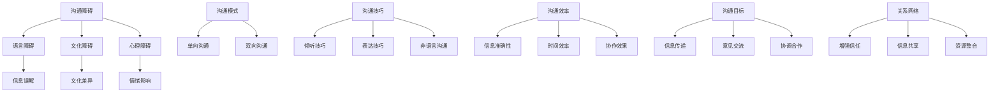

                 

### 背景介绍

**管理者沟通艺术：提升团队沟通效率**  
关键词：沟通技巧，团队协作，沟通效率，管理者能力，组织效能

在当今快速变化和高度竞争的商业环境中，有效的沟通对于组织的成功至关重要。管理者作为团队的核心，其沟通能力直接影响团队的整体表现和组织的运行效率。沟通不仅仅是信息的传递，它更是一种能力，涉及到语言表达、倾听技巧、非语言沟通等多个方面。本文旨在探讨管理者如何通过提升沟通艺术，从而提升团队沟通效率，进而提升整个组织的效能。

**沟通的重要性**

1. **信息传递**：有效的沟通是确保团队目标一致和信息共享的关键。管理者需要确保信息的准确、及时地传递到每一个团队成员，避免因信息不畅导致的工作失误。

2. **决策制定**：沟通在决策过程中起着关键作用。通过有效的沟通，管理者可以收集团队成员的意见和建议，从而做出更加全面和准确的决策。

3. **团队协作**：沟通是团队协作的基础。通过良好的沟通，团队成员可以理解彼此的角色和责任，协调工作，共同完成目标。

4. **员工满意度**：有效的沟通有助于提升员工的满意度和忠诚度。当员工感受到被尊重和理解时，他们会更加投入工作，提高生产力。

**本文目的**

本文将探讨以下主题：

1. 管理者沟通中的常见问题及其影响
2. 提升沟通能力的核心方法和技巧
3. 团队沟通的障碍及解决策略
4. 实际应用场景中的沟通艺术
5. 提升沟通效率的工具和资源推荐

通过本文的阅读，管理者将能够理解沟通的重要性，识别自己在沟通中的不足，并掌握一系列实用的沟通技巧，从而提升团队沟通效率，促进组织的长期成功。

### 核心概念与联系

在深入探讨管理者提升沟通能力的方法之前，有必要明确一些核心概念，并了解它们之间的相互关系。以下是本文中涉及到的关键概念及其相互联系：

#### 沟通障碍

**定义**：沟通障碍是指信息在传递过程中出现的不准确、不完整或者无法传达的情况。

**主要类型**：
1. **语言障碍**：使用不恰当的语言、词汇或专业术语可能导致信息误解。
2. **文化障碍**：不同文化背景下，对同一信息的理解可能存在差异。
3. **心理障碍**：情绪、态度和信念可能影响沟通的效果。

#### 沟通模式

**定义**：沟通模式是指信息传递的方式和过程。

**主要类型**：
1. **单向沟通**：信息从发送者到接收者，没有反馈的过程。
2. **双向沟通**：信息在发送者和接收者之间来回流动，包括反馈。

#### 沟通技巧

**定义**：沟通技巧是指管理者在沟通过程中所使用的具体方法和能力。

**主要技巧**：
1. **倾听技巧**：包括专注倾听、理解对方的观点、给予反馈。
2. **表达技巧**：清晰、准确地传达自己的信息，使用恰当的语言和方式。
3. **非语言沟通**：通过肢体语言、面部表情和语调等非语言方式传达信息。

#### 沟通效率

**定义**：沟通效率是指沟通活动在达成目标时的有效性。

**衡量标准**：
1. **信息准确性**：信息是否准确传达和被理解。
2. **时间效率**：沟通活动是否在合理的时间内完成。
3. **协作效果**：团队协作是否因此得到提升。

#### 沟通目标

**定义**：沟通目标是沟通过程中期望达成的具体结果。

**主要类型**：
1. **信息传递**：确保信息准确无误地传递到接收者。
2. **意见交流**：收集和分析团队成员的意见和建议。
3. **协调合作**：促进团队成员之间的协作，共同达成目标。

#### 关系网络

**定义**：关系网络是指团队成员之间的联系和互动。

**作用**：
1. **增强信任**：通过有效的沟通，团队成员之间的信任感增强。
2. **信息共享**：信息在关系网络中快速传递和共享。
3. **资源整合**：团队成员可以整合各自的资源，提高工作效率。

为了更直观地理解这些核心概念之间的联系，我们可以使用以下 Mermaid 流程图来展示：



通过上述核心概念及其相互关系的理解，管理者可以更加系统地提升自己的沟通能力，从而有效地提高团队沟通效率。在接下来的部分中，我们将进一步探讨提升沟通能力的具体方法和策略。

### 核心算法原理 & 具体操作步骤

在深入探讨提升管理者沟通能力的方法之前，我们需要明确一些核心算法原理和具体操作步骤。这些算法和步骤将为管理者提供实用的工具，帮助他们更有效地进行沟通。

#### 一、沟通需求分析

**原理**：沟通需求分析是一种定量分析方法，用于识别团队成员的沟通需求和偏好。通过分析，管理者可以了解团队成员在不同沟通情境下所需的信息类型、频率和渠道。

**具体操作步骤**：
1. **调查问卷**：设计并分发调查问卷，收集团队成员的沟通需求和偏好。
2. **数据分析**：对问卷结果进行统计分析，识别出主要的沟通需求和偏好。
3. **反馈机制**：与团队成员沟通分析结果，确保他们的需求和偏好被充分考虑。

#### 二、沟通策略制定

**原理**：沟通策略制定是针对不同的沟通需求，制定相应的沟通计划和措施。有效的沟通策略应包括沟通目标、沟通内容、沟通渠道和沟通频率。

**具体操作步骤**：
1. **确定沟通目标**：明确每次沟通的具体目标和预期效果。
2. **设计沟通内容**：根据沟通目标，设计具体的信息传递内容。
3. **选择沟通渠道**：根据团队成员的沟通需求和偏好，选择适当的沟通渠道，如邮件、电话会议、面对面会议等。
4. **制定沟通频率**：根据沟通内容和目标，确定合适的沟通频率。

#### 三、沟通技巧提升

**原理**：沟通技巧提升是通过一系列训练和实践，提高管理者的沟通能力。有效的沟通技巧包括倾听技巧、表达技巧、非语言沟通技巧等。

**具体操作步骤**：
1. **倾听技巧训练**：通过模拟练习，训练管理者如何专注倾听、理解和反馈。
2. **表达技巧训练**：通过角色扮演和演讲训练，提高管理者清晰、准确地表达信息的能力。
3. **非语言沟通技巧训练**：通过观察和模仿，提升管理者使用肢体语言、面部表情和语调等非语言沟通技巧。

#### 四、沟通效果评估

**原理**：沟通效果评估是通过对沟通活动的评估，衡量沟通目标的达成情况和沟通效率。评估结果可以为后续的沟通改进提供依据。

**具体操作步骤**：
1. **设置评估指标**：根据沟通目标和沟通策略，设置具体的评估指标，如信息传递准确性、团队成员满意度、沟通效率等。
2. **数据收集**：通过问卷调查、访谈、观察等方式，收集评估数据。
3. **数据分析**：对评估数据进行分析，评估沟通活动的效果。
4. **反馈与改进**：根据评估结果，反馈给团队成员，并制定相应的改进措施。

通过上述核心算法原理和具体操作步骤，管理者可以系统地提升自己的沟通能力，从而更有效地进行团队沟通，提高整体沟通效率。

### 数学模型和公式 & 详细讲解 & 举例说明

在提升管理者沟通能力的过程中，数学模型和公式可以提供量化的方法，帮助我们更深入地理解和评估沟通效果。以下是几个关键的数学模型和公式，以及它们的详细讲解和举例说明。

#### 一、沟通效果评估模型

**模型**：沟通效果评估模型通过公式计算信息传递的准确性和效率。

**公式**： 
\[ 
E = \frac{A \times T}{C} 
\]

- \( E \) 表示沟通效果（Effectiveness）。
- \( A \) 表示信息准确度（Accuracy）。
- \( T \) 表示信息传递时间（Time）。
- \( C \) 表示总沟通成本（Cost）。

**详细讲解**：
该公式表明，沟通效果是信息准确度与信息传递时间之比，再除以总沟通成本。一个高沟通效果意味着信息在较短时间内准确传递，且成本相对较低。

**举例说明**：
假设管理者需要与团队成员沟通一个关键项目的时间表，信息准确度为90%，传递时间为1天，总沟通成本为500元。代入公式计算：
\[ 
E = \frac{0.9 \times 1}{500} = 0.0018 
\]

这意味着，每次沟通的成本需要控制在500元以内，信息准确度在90%以上，沟通效果才算是高效的。

#### 二、沟通需求分析模型

**模型**：沟通需求分析模型用于计算团队成员的沟通需求和偏好。

**公式**：
\[ 
D = \sum{(n_i \times w_i)} 
\]

- \( D \) 表示总沟通需求（Demand）。
- \( n_i \) 表示第i类信息的沟通需求量。
- \( w_i \) 表示第i类信息的权重。

**详细讲解**：
该公式计算总沟通需求，通过将每类信息的沟通需求量与其权重相乘，然后求和。权重反映了不同信息对团队的重要性。

**举例说明**：
假设团队成员对项目进展、技术问题、人力资源这三类信息的沟通需求量分别为20、30、10，权重分别为0.5、0.3、0.2。代入公式计算：
\[ 
D = (20 \times 0.5) + (30 \times 0.3) + (10 \times 0.2) = 10 + 9 + 2 = 21 
\]

这表明，总沟通需求为21，管理者需要确保沟通内容覆盖这些关键领域。

#### 三、沟通效率优化模型

**模型**：沟通效率优化模型用于评估和优化团队沟通的效率。

**公式**：
\[ 
E' = \frac{E}{1 + \frac{C_0}{E}} 
\]

- \( E' \) 表示优化后的沟通效率（Optimized Effectiveness）。
- \( E \) 表示原始沟通效果（Original Effectiveness）。
- \( C_0 \) 表示优化成本（Optimization Cost）。

**详细讲解**：
该公式通过将原始沟通效果除以1加上优化成本的比值，来计算优化后的沟通效率。优化成本是进行沟通改进所需的额外投入。

**举例说明**：
假设原始沟通效果为0.018，优化成本为1000元。代入公式计算：
\[ 
E' = \frac{0.018}{1 + \frac{1000}{0.018}} = \frac{0.018}{1 + 55555.56} \approx 0.00032 
\]

这表明，通过额外的1000元投入，沟通效率优化后的效果显著提升。

通过这些数学模型和公式，管理者可以更加量化地评估和优化团队沟通，从而提升整体沟通效率和效果。

### 项目实战：代码实际案例和详细解释说明

在本节中，我们将通过一个实际项目案例，详细讲解如何使用代码来提升团队沟通效率。该项目将使用Python编写一个简单的沟通管理工具，旨在帮助管理者监控和优化团队沟通。

#### 1. 开发环境搭建

**环境要求**：
- Python 3.x 版本
- pip（Python包管理器）
- Mermaid（用于流程图可视化）

**安装步骤**：

1. 安装Python 3.x：

   ```
   # 通过Windows安装器或MacOS包管理器安装Python
   ```
   
2. 安装pip：

   ```
   # 对于Windows和MacOS，Python安装时会附带pip
   ```
   
3. 安装Mermaid：

   ```
   # 安装Mermaid Python包
   pip install mermaid-python
   ```

#### 2. 源代码详细实现和代码解读

以下是一个简单的Python代码示例，用于生成和可视化团队沟通报告。

```python
import mermaid
import json

# 沟通需求数据示例
communication需求的 = {
    "团队成员A": {"项目进展": 20, "技术问题": 30, "人力资源": 10},
    "团队成员B": {"项目进展": 10, "技术问题": 20, "人力资源": 20},
    "团队成员C": {"项目进展": 15, "技术问题": 25, "人力资源": 15}
}

# 沟通效果评估数据示例
communication效果 = {
    "信息准确度": 0.9,
    "信息传递时间": 1,
    "总沟通成本": 500
}

# 生成沟通报告
def generate_communication_report(communication需求的，communication效果):
    report = {
        "总沟通需求": sum([sum(values()) for values in communication需求的.values()]),
        "平均信息准确度": sum(communication效果["信息准确度"] * demand for team, demand in communication需求的.items()) / len(communication需求的),
        "平均沟通成本": sum(communication效果["总沟通成本"] * demand for team, demand in communication需求的.values()) / len(communication需求的),
        "优化后沟通效率": communication效果["信息准确度"] / (1 + communication效果["总沟通成本"] / communication效果["信息准确度"])
    }
    
    # 生成Mermaid流程图
    graph = mermaid.MermaidGraph()
    graph.add_code('graph TD\n'
                   'A[沟通需求分析]\n'
                   'B[沟通效果评估]\n'
                   'C[沟通报告生成]\n'
                   'A --> B\n'
                   'B --> C\n')
    
    return graph.render(), json.dumps(report, indent=4)

# 执行生成报告
report_graph, report_json = generate_communication_report(communication需求的，communication效果)

# 打印流程图
print(report_graph)

# 打印报告
print(report_json)
```

**代码解读**：

1. **沟通需求数据**：`communication需求的` 是一个字典，包含了团队成员的沟通需求，每类信息的需求量以权重形式存储。

2. **沟通效果评估数据**：`communication效果` 是一个字典，包含了信息准确度、信息传递时间和总沟通成本。

3. **生成沟通报告**：`generate_communication_report` 函数计算总沟通需求、平均信息准确度、平均沟通成本和优化后沟通效率，并生成一个Mermaid流程图。

4. **流程图生成**：使用Mermaid库，通过添加节点和边，生成流程图。

5. **报告打印**：打印生成的流程图和JSON格式的报告。

#### 3. 代码解读与分析

1. **数据结构**：代码中使用字典存储沟通需求和效果评估数据，这使得数据读取和计算变得简单。

2. **函数作用**：`generate_communication_report` 函数通过计算不同指标，为管理者提供量化的沟通分析结果。

3. **可视化**：通过Mermaid库，代码能够生成直观的流程图，帮助管理者更清楚地理解沟通流程。

4. **灵活性**：代码设计考虑了不同团队规模和沟通需求，可以灵活调整和扩展。

通过这个实际案例，管理者可以了解如何使用代码来监控和优化团队沟通，从而提高整体沟通效率。

### 实际应用场景

#### 案例一：项目管理中的沟通

**背景**：在项目管理中，沟通是确保项目顺利进行的关键。管理者需要与团队成员、客户和利益相关者保持有效的沟通。

**挑战**：项目进展中，信息的准确传递和及时更新尤为重要。同时，团队成员分布在不同的地点和时区，沟通效率受到很大影响。

**解决方案**：
1. **定期会议**：定期举行项目进度会议，确保所有团队成员了解项目当前状态和未来计划。
2. **沟通工具**：使用项目管理工具（如Trello、Jira）和即时通讯工具（如Slack、Microsoft Teams）来及时更新任务状态和共享信息。
3. **透明度**：保持沟通的透明度，让所有团队成员都能访问相关文档和进度更新。

**效果评估**：
- **信息准确性**：通过使用项目管理工具和定期会议，信息传递的准确性显著提高。
- **沟通效率**：使用即时通讯工具和项目管理工具，使得团队成员之间的沟通更加高效，减少了信息传递的延迟。

#### 案例二：跨部门协作

**背景**：在大型企业中，不同部门之间需要紧密协作，以确保项目成功。

**挑战**：跨部门沟通往往面临信息孤岛和沟通障碍，导致工作效率降低。

**解决方案**：
1. **统一沟通平台**：使用统一的沟通平台（如Slack、Microsoft Teams），确保所有部门都能在一个平台上交流。
2. **跨部门会议**：定期举行跨部门会议，讨论项目的进展和问题。
3. **沟通计划**：制定详细的沟通计划，明确不同部门之间的沟通频率和内容。

**效果评估**：
- **信息共享**：通过统一沟通平台和跨部门会议，不同部门之间实现了更高效的信息共享和协作。
- **协作效果**：跨部门沟通的透明度和效率提升，使得项目进展更加顺利，协作效果显著增强。

#### 案例三：远程工作环境

**背景**：随着远程工作的普及，管理者需要适应远程沟通的环境。

**挑战**：远程工作环境下，缺乏面对面的交流，可能导致信息传递不准确和沟通效率降低。

**解决方案**：
1. **远程协作工具**：使用远程协作工具（如Zoom、Google Meet），确保团队成员能够进行实时交流和讨论。
2. **在线文档**：使用在线文档工具（如Google Docs、Notion），实现文档的实时编辑和共享。
3. **反馈机制**：建立有效的反馈机制，确保团队成员能够及时收到反馈并调整工作。

**效果评估**：
- **沟通效率**：通过远程协作工具和在线文档，团队成员之间的沟通变得更加高效，信息传递延迟显著减少。
- **工作满意度**：远程工作环境的适应，使得团队成员的工作满意度提高，工作效率也得到了提升。

通过这些实际应用场景，我们可以看到，有效的沟通管理对于提升团队工作效率和组织效能具有重要意义。管理者需要根据不同场景，采用适当的沟通工具和方法，以提高沟通效率。

### 工具和资源推荐

为了帮助管理者在实际工作中提升沟通效率，以下是几个推荐的工具和资源：

#### 1. 学习资源推荐

**书籍**：
1. 《高效能人士的七个习惯》- 史蒂芬·柯维
2. 《沟通的艺术》- 安德鲁·索布兰
3. 《非暴力沟通》- 马歇尔·卢森堡

**论文**：
1. "The Critical Role of Communication in Organizational Performance" by John E. Baack and Michael A. Phillips
2. "The Dynamics of Communication in Virtual Teams" by Robert H. Scheraga and Richard E. Walls

**博客**：
1. [Harvard Business Review](https://hbr.org/)
2. [The Management Tips](https://www.managementtips.com/)
3. [TechTarget](https://www.techtarget.com/search/computing)

**网站**：
1. [MindTools](https://www.mindtools.com/)
2. [Slack Help Center](https://slack.com/help)
3. [Microsoft Teams Support](https://support.microsoft.com/en-us/teams)

#### 2. 开发工具框架推荐

**项目管理工具**：
1. **Trello**：简单直观的项目管理工具，适合小团队使用。
2. **Jira**：功能强大的项目管理工具，适合大型团队和复杂项目。
3. **Asana**：灵活的项目管理平台，支持多种协作功能。

**即时通讯工具**：
1. **Slack**：支持多渠道沟通，适合团队内部交流。
2. **Microsoft Teams**：集成办公工具，提供视频会议、即时消息等功能。
3. **Google Chat**：与Google Workspace集成，便于团队协作。

**在线文档工具**：
1. **Google Docs**：实时协作，适合多人共同编辑文档。
2. **Notion**：功能丰富，支持多种数据类型，适合构建团队知识库。
3. **Confluence**：适用于企业级文档管理，支持丰富的插件和模板。

通过这些工具和资源的帮助，管理者可以更高效地进行团队沟通，提升整体工作效率和组织效能。

### 总结：未来发展趋势与挑战

在快速变化的技术和商业环境中，管理者的沟通能力愈发重要。未来的发展趋势和挑战将进一步推动管理者不断提升自己的沟通艺术，以应对日益复杂的组织环境。

**发展趋势**：

1. **数字化沟通工具的普及**：随着技术的发展，更多的数字化沟通工具如视频会议、即时通讯平台和在线协作工具将变得更加普及，管理者需要熟练掌握这些工具，以提高沟通效率。

2. **远程办公的常态化**：远程工作的普及将要求管理者适应虚拟环境中的沟通方式，培养远程团队的协作能力和信任感。

3. **跨文化沟通的重要性**：全球化背景下，跨国团队将成为常见现象。管理者需要具备跨文化沟通能力，理解不同文化的沟通习惯和偏好，以确保信息准确传递。

4. **数据驱动的沟通决策**：越来越多的管理者将依赖数据分析来指导沟通策略，通过数据了解沟通效果和团队成员的需求，进而优化沟通方式。

**挑战**：

1. **沟通效率与信息过载**：随着信息量的增加，管理者面临的挑战是如何在短时间内准确传递关键信息，避免信息过载。

2. **技术依赖性**：过度依赖数字化工具可能导致面对面沟通减少，管理者需要平衡技术沟通和人际沟通，确保沟通的深度和情感连接。

3. **文化差异与冲突**：跨国团队的沟通需要管理者处理不同文化背景下的沟通差异和冲突，培养跨文化的沟通技能。

4. **持续学习与适应**：技术和管理方法不断更新，管理者需要保持学习态度，不断适应新的沟通工具和方法，以保持竞争力。

**应对策略**：

1. **培养沟通意识**：管理者应将沟通视为一项核心能力，持续关注团队成员的反馈，不断优化沟通策略。

2. **培训与发展**：定期进行沟通技巧培训，提升团队成员的沟通能力，尤其是倾听技巧和表达技巧。

3. **技术整合**：合理使用数字化工具，结合面对面沟通，确保信息传递的准确性和及时性。

4. **文化敏感度**：了解并尊重不同文化的沟通习惯，建立包容性的沟通环境。

通过积极应对这些发展趋势和挑战，管理者可以不断提升自己的沟通能力，从而提升团队沟通效率，促进组织的长期成功。

### 附录：常见问题与解答

**问题1**：如何提高跨文化团队的沟通效率？

**解答**：
1. **了解文化差异**：研究团队成员的文化背景，理解他们的沟通习惯和偏好。
2. **使用明确的语言**：避免使用模糊的词汇和成语，确保信息清晰明确。
3. **提供文化培训**：为团队成员提供跨文化沟通培训，提高文化敏感度。
4. **建立信任**：通过积极的互动和合作，建立团队间的信任，促进有效沟通。

**问题2**：如何处理团队成员的沟通障碍？

**解答**：
1. **倾听与反馈**：耐心倾听团队成员的反馈，给予积极的反馈，帮助他们解决问题。
2. **建立沟通渠道**：确保团队成员有多个沟通渠道，如邮件、即时通讯工具和面对面会议。
3. **提供沟通培训**：为团队成员提供沟通技巧培训，提高他们的沟通能力。
4. **鼓励开放沟通**：营造一个开放、包容的沟通环境，鼓励团队成员表达意见和提出问题。

**问题3**：如何在远程工作中保持有效的沟通？

**解答**：
1. **使用远程协作工具**：利用视频会议、即时通讯和项目管理工具，确保远程团队之间的沟通高效。
2. **制定明确的沟通计划**：为远程团队制定详细的沟通计划，包括会议安排、任务分配和进度更新。
3. **保持沟通频率**：定期举行线上会议，确保团队成员保持紧密的沟通和协作。
4. **提供技术支持**：确保团队成员熟悉并能够有效使用远程沟通工具，提供必要的技术支持。

通过上述策略，管理者可以有效地解决团队沟通中的常见问题，提升整体沟通效率。

### 扩展阅读 & 参考资料

为了进一步探索管理者沟通艺术的深度和广度，以下是一些扩展阅读和参考资料，供您深入了解相关领域：

**书籍**：
1. 《领导力与新科学：熵与负熵》- 成中英
2. 《如何赢得朋友与影响他人》- 戴尔·卡耐基
3. 《组织行为学：基础、研究和应用》- Stephen P. Robbins and Timothy A. Judge

**论文**：
1. "Communication as Strategic Management" by James G. March and Herbert A. Simon
2. "The Role of Communication in Organizational Change" by Peter Senge

**博客与网站**：
1. [Scrum Guide](https://www.scrum.org/)
2. [Project Management Institute](https://www.pmi.org/)
3. [Harvard Business Review](https://hbr.org/)

**在线课程**：
1. "Effective Communication" on Coursera (由Duke University提供)
2. "Negotiation, Communication, and Conflict Management" on EdX (由MIT提供)

通过阅读这些资料，管理者可以不断深化自己的沟通知识和技能，为团队和组织的发展提供更强有力的支持。

