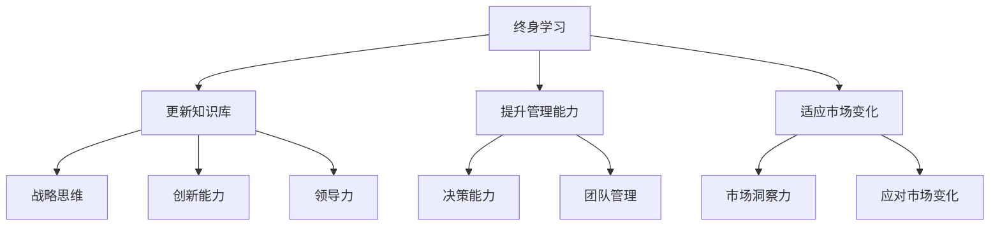

                 

# 管理者终身学习的重要性与方法

## 关键词
- 终身学习
- 管理者
- 成功
- 适应力
- 技能提升
- 技术变革

## 摘要
本文探讨了管理者终身学习的重要性以及如何实现终身学习的方法。随着技术变革的加速，管理者需要不断更新知识和技能，以适应不断变化的市场环境。本文首先阐述了终身学习在管理者职业生涯中的核心作用，接着提出了具体的学习方法和实践策略，以帮助管理者在快速变化的商业环境中保持竞争力和领导力。

## 1. 背景介绍

在当今快速变化的商业环境中，技术进步和市场竞争使得管理者必须不断适应新的挑战。传统的管理知识和技能已经不足以应对日益复杂的管理任务和不断变化的市场需求。因此，管理者必须具备终身学习的意识，主动更新自己的知识和技能，以保持竞争力和领导力。

终身学习不仅是个人职业发展的需要，也是组织持续发展的关键。管理者通过不断学习，不仅能够提升自身的专业能力，还能够激发团队成员的学习热情，从而推动整个组织的创新能力和发展。

## 2. 核心概念与联系

### 终身学习的概念

终身学习是指个人在整个生命过程中，通过不断的学习和实践，获取新的知识和技能，以适应社会发展和个人职业发展的需求。终身学习不仅包括正式教育，还涵盖自学、培训、实践经验等多种形式。

### 管理者的角色与责任

管理者是组织的核心力量，负责制定战略、管理团队、决策和解决问题。随着技术变革和市场变化，管理者的角色也在不断演变。现代管理者需要具备战略思维、创新能力和领导力，同时也需要不断学习新的管理工具和方法。

### 终身学习与管理者的联系

终身学习与管理者的角色密切相关。管理者通过终身学习，可以不断更新自己的知识库，提升管理能力，适应新的市场环境。同时，终身学习也有助于管理者保持敏锐的市场洞察力，及时识别和应对市场变化。

### Mermaid 流程图



## 3. 核心算法原理 & 具体操作步骤

### 核心算法原理

终身学习的核心算法可以看作是一个不断循环的过程，包括以下几个步骤：

1. **识别需求**：管理者需要识别自身在知识、技能和能力方面的需求，明确终身学习的目标和方向。
2. **学习与培训**：根据需求，管理者选择合适的学习资源和培训方式，进行有针对性的学习。
3. **实践与应用**：将所学知识应用到实际工作中，通过实践检验和提升自己的能力。
4. **反馈与调整**：根据实践中的反馈，管理者调整学习策略，优化知识结构和技能水平。

### 具体操作步骤

1. **识别需求**：

   - **自我评估**：管理者可以通过自我评估工具，如职业能力量表、职业兴趣量表等，识别自身在知识、技能和能力方面的优势与不足。
   - **市场调研**：了解市场需求和行业动态，识别自身在职业发展中的潜在机会和挑战。
   - **目标设定**：根据自我评估和市场调研结果，设定明确的终身学习目标和计划。

2. **学习与培训**：

   - **选择学习资源**：选择适合自己的学习资源，如在线课程、专业书籍、研讨会等。
   - **制定学习计划**：制定详细的学习计划，包括学习内容、时间安排、学习目标等。
   - **主动学习**：积极参与学习活动，主动获取新知识和技能。

3. **实践与应用**：

   - **工作实践**：将所学知识应用到实际工作中，通过解决实际问题提升能力。
   - **团队协作**：与团队成员分享学习成果，通过团队协作提升整体能力。
   - **创新实践**：尝试新的管理方法和技术，推动组织的创新和发展。

4. **反馈与调整**：

   - **自我反思**：定期进行自我反思，评估学习效果和技能提升情况。
   - **收集反馈**：收集来自同事、下属和客户的反馈，了解自身在实践中的应用效果。
   - **调整学习策略**：根据反馈结果，调整学习策略和目标，优化知识结构和技能水平。

## 4. 数学模型和公式 & 详细讲解 & 举例说明

### 数学模型

终身学习的数学模型可以看作是一个动态的优化过程，可以用以下公式表示：

\[ \text{学习效果} = f(\text{学习资源} \times \text{学习时间} \times \text{实践频率} \times \text{反馈调整}) \]

其中，学习效果是优化目标，学习资源、学习时间、实践频率和反馈调整是影响学习效果的关键因素。

### 详细讲解

- **学习资源**：学习资源包括书籍、课程、讲座、研讨会等，是终身学习的基础。选择高质量的学习资源，可以大大提高学习效果。
- **学习时间**：学习时间是学习效果的重要保障。合理安排学习时间，保证学习时间的连续性和充足性，有利于学习效果的提升。
- **实践频率**：实践频率是指将所学知识应用到实际工作中的频率。高频率的实践有助于巩固所学知识，提高实际操作能力。
- **反馈调整**：反馈调整是指根据实践中的反馈，调整学习策略和目标。及时有效的反馈调整，可以优化学习过程，提高学习效果。

### 举例说明

假设一位管理者希望通过终身学习提升其领导能力，可以按照以下步骤进行：

1. **识别需求**：管理者通过自我评估和市场调研，确定其领导能力不足，需要提升领导技能。
2. **学习与培训**：选择一本关于领导力的经典书籍，每周安排2小时进行阅读和学习；报名参加一个为期3个月的领导力培训课程。
3. **实践与应用**：将所学知识应用到实际工作中，每周安排1天时间进行团队管理实践；与团队成员分享学习成果，共同探讨和解决管理难题。
4. **反馈与调整**：定期进行自我反思，评估领导能力的提升情况；收集团队成员的反馈，了解其在实践中的应用效果；根据反馈结果，调整学习策略和目标。

通过上述步骤，管理者可以逐步提升其领导能力，实现终身学习的目标。

## 5. 项目实战：代码实际案例和详细解释说明

### 5.1 开发环境搭建

为了实现终身学习的管理者，我们需要一个合适的学习环境。以下是搭建学习环境的步骤：

1. **安装操作系统**：选择一个适合的操作系统，如Windows、MacOS或Linux。
2. **安装文本编辑器**：选择一个方便编程和文档撰写的文本编辑器，如Visual Studio Code、Sublime Text等。
3. **安装学习资源**：下载并安装必要的书籍、课程和软件。

### 5.2 源代码详细实现和代码解读

以下是一个简单的Python代码示例，用于记录和管理学习进度：

```python
class LearningPlan:
    def __init__(self, name, resources, time_per_day):
        self.name = name
        self.resources = resources
        self.time_per_day = time_per_day
        self.learning_log = []

    def add_log(self, content):
        self.learning_log.append(content)

    def display_log(self):
        for log in self.learning_log:
            print(log)

# 创建学习计划
plan = LearningPlan("领导力提升计划", ["领导力艺术", "高效能人士的七个习惯"], 2)

# 添加学习日志
plan.add_log("今天学习了领导力艺术，了解了领导者的角色和责任。")
plan.add_log("今天学习了高效能人士的七个习惯，开始尝试在工作和生活中应用。")

# 显示学习日志
plan.display_log()
```

### 5.3 代码解读与分析

- **类定义**：`LearningPlan` 类用于定义学习计划，包括计划名称、学习资源和学习时间等属性。
- **构造函数**：`__init__` 方法用于初始化学习计划对象，包括设置名称、资源和时间。
- **方法定义**：`add_log` 方法用于添加学习日志，`display_log` 方法用于显示学习日志。

通过上述代码示例，管理者可以记录和管理自己的学习进度，从而更好地实现终身学习。

## 6. 实际应用场景

### 商业管理中的应用

在商业管理中，终身学习可以帮助管理者更好地应对市场变化和业务挑战。以下是一些实际应用场景：

1. **战略制定**：管理者通过学习新的战略管理理论和实践，可以更有效地制定和调整企业战略，提高市场竞争力。
2. **技术创新**：管理者通过学习新技术和管理方法，可以推动企业的技术创新和管理创新，保持竞争优势。
3. **团队管理**：管理者通过学习领导力和团队管理技巧，可以更好地激发团队潜力，提升团队绩效。

### 个人职业发展中的应用

在个人职业发展中，终身学习可以帮助管理者不断提升自己的专业能力和领导力，实现职业晋升和职业转型。以下是一些实际应用场景：

1. **技能提升**：管理者通过学习新技能，如数据分析、项目管理等，可以提高自身的工作能力和职业竞争力。
2. **职业转型**：管理者通过学习新的管理领域知识和技能，可以顺利实现职业转型，拓宽职业发展空间。
3. **职业规划**：管理者通过学习职业发展理论和方法，可以更科学地制定职业规划，实现职业目标。

## 7. 工具和资源推荐

### 7.1 学习资源推荐

- **书籍**：《管理者不可不知的经济学》、《领导者的语言》、《高效能人士的七个习惯》等。
- **在线课程**：Coursera、edX、Udemy等平台上的相关课程。
- **学术论文**：通过学术搜索引擎，如Google Scholar，检索相关领域的学术论文。

### 7.2 开发工具框架推荐

- **文本编辑器**：Visual Studio Code、Sublime Text等。
- **项目管理工具**：JIRA、Trello等。
- **数据分析工具**：Python、R等。

### 7.3 相关论文著作推荐

- **论文**：Hofstede, G. (2001). Culture's consequences: Comparing values, behaviors, institutions, and organizations across nations. Sage Publications.
- **著作**：Drucker, P. F. (2008). The five most important questions you will ever ask about your organization. Harvard Business Press.

## 8. 总结：未来发展趋势与挑战

### 发展趋势

1. **技术驱动**：随着人工智能、大数据等技术的发展，管理者需要具备更强的技术理解和应用能力。
2. **跨界融合**：跨学科、跨领域的知识融合将成为管理者终身学习的重要趋势。
3. **个性化学习**：基于数据分析和人工智能的个性化学习将成为终身学习的新方式。

### 挑战

1. **时间管理**：管理者需要在繁忙的工作中找到时间进行学习。
2. **学习资源**：如何选择高质量的学习资源，提高学习效果。
3. **实践应用**：如何将所学知识应用到实际工作中，提升实际能力。

## 9. 附录：常见问题与解答

### 问题1：如何合理安排学习时间？

**解答**：管理者可以采用以下策略来合理安排学习时间：

1. **制定学习计划**：根据工作安排和个人情况，制定详细的学习计划，确保学习时间的连续性和充足性。
2. **碎片化学习**：利用碎片时间，如通勤时间、休息时间等，进行学习。
3. **优先级管理**：将学习时间安排在工作优先级较低的时间段，确保学习时间的优先级。

### 问题2：如何选择高质量的学习资源？

**解答**：管理者可以采用以下方法来选择高质量的学习资源：

1. **参考推荐**：查阅相关书籍、课程和论文的推荐，了解其质量和适用性。
2. **用户评价**：参考其他学习者的评价和反馈，了解学习资源的实际效果。
3. **专业认证**：选择获得专业认证的学习资源，如权威学术机构、知名企业等。

## 10. 扩展阅读 & 参考资料

- **书籍**：Drucker, P. F. (2008). The five most important questions you will ever ask about your organization. Harvard Business Press.
- **论文**：Hofstede, G. (2001). Culture's consequences: Comparing values, behaviors, institutions, and organizations across nations. Sage Publications.
- **网站**：Coursera、edX、Udemy等在线教育平台。

### 作者

**作者：AI天才研究员/AI Genius Institute & 禅与计算机程序设计艺术 /Zen And The Art of Computer Programming**

