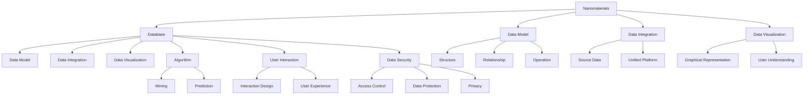

                 

### 背景介绍 Background Introduction

纳米材料作为一种新兴材料，因其独特的物理、化学和生物性质，在多个领域展现出了巨大的应用潜力。然而，随着纳米材料研究的深入，研究者们面临的挑战也日益增加。如何有效地管理和利用纳米材料的相关数据成为一个亟待解决的问题。

数据库平台在此背景下应运而生，它不仅为纳米材料的研发提供了数据支持，还为学术界和工业界提供了一个交流和合作的平台。目前，已有多个纳米材料数据库平台问世，其中一些已经成为了该领域的重要资源。例如，Nanomaterials Database (NDB) 和 Nanomaterials Data Infrastructure (NanODI) 等平台，为研究人员提供了丰富的纳米材料信息，包括材料的结构、性质、应用等。

然而，现有平台在数据整合、用户交互、算法优化等方面仍存在一定的局限性。因此，开发一个更加完善、高效的纳米材料数据库平台显得尤为重要。本文将探讨如何构建一个创新资源丰富的纳米材料数据库平台，以推动新材料研发的进步。

### 核心概念与联系 Core Concepts and Relationships

在构建纳米材料数据库平台的过程中，需要明确几个核心概念，并理解它们之间的相互联系。以下是这些核心概念及其关系的简要介绍：

1. **纳米材料（Nanomaterials）**：
   纳米材料是指至少在一维上具有至少一项尺寸小于100纳米的材料。这些材料具有独特的物理、化学和生物性质，使其在电子、能源、医疗、环保等领域具有广泛的应用。

2. **数据库（Database）**：
   数据库是一个组织、存储和管理数据的系统。在纳米材料数据库平台中，数据库负责存储和管理纳米材料的相关数据，包括结构、性质、应用等。

3. **数据模型（Data Model）**：
   数据模型定义了数据库中数据的组织方式。在纳米材料数据库平台中，数据模型用于定义纳米材料的属性、关系和操作。

4. **数据整合（Data Integration）**：
   数据整合是将来自不同来源的数据统一到一个平台的过程。这对于纳米材料数据库平台至关重要，因为纳米材料的研究数据通常分散在不同的数据库和资源中。

5. **数据可视化（Data Visualization）**：
   数据可视化是将数据以图形或图像的形式展示给用户，帮助用户更好地理解和分析数据。在纳米材料数据库平台中，数据可视化是用户交互的重要部分，它使研究人员能够直观地查看和分析纳米材料的性质。

6. **算法（Algorithm）**：
   算法是一系列用于解决特定问题的步骤。在纳米材料数据库平台中，算法用于处理和挖掘纳米材料数据，以发现新的材料特性或预测材料性能。

7. **用户交互（User Interaction）**：
   用户交互是指用户与数据库平台之间的互动。良好的用户交互设计可以提高用户体验，使研究人员能够更轻松地使用数据库。

8. **数据安全（Data Security）**：
   数据安全是保护数据免受未经授权访问、使用、披露、破坏、修改或破坏的措施。对于纳米材料数据库平台，数据安全至关重要，因为涉及敏感材料和实验数据。

以下是核心概念与关系的 Mermaid 流程图：



通过理解这些核心概念及其相互关系，我们可以更好地构建一个功能强大、易于使用的纳米材料数据库平台。

### 核心算法原理 & 具体操作步骤 Core Algorithm Principles & Operational Steps

在纳米材料数据库平台的开发中，核心算法的设计与实现至关重要。这些算法不仅能够提高数据处理的效率，还能够挖掘出潜在的材料特性，为新材料研发提供有力支持。以下是几个关键算法的原理及其操作步骤：

1. **数据预处理算法（Data Preprocessing Algorithm）**

   数据预处理是纳米材料数据库平台中的第一步，其目的是将原始数据转换为适合分析和挖掘的形式。以下是数据预处理算法的原理和步骤：

   **原理**：
   数据预处理包括数据清洗、数据转换和数据归一化。数据清洗旨在去除重复、错误或不完整的数据；数据转换是将不同格式的数据统一为标准格式；数据归一化是通过缩放或标准化处理，使数据在相同的尺度上进行分析。

   **步骤**：
   - **数据清洗**：使用Python的Pandas库，对原始数据集进行缺失值填充、异常值检测和去除。
   - **数据转换**：使用Pandas库的DataFrame对象，将不同来源的数据进行合并和格式转换。
   - **数据归一化**：使用Sklearn库中的MinMaxScaler或StandardScaler，对数据进行归一化处理。

   **示例代码**：

   ```python
   import pandas as pd
   from sklearn.preprocessing import MinMaxScaler
   
   # 读取数据
   data = pd.read_csv('nanomaterials_data.csv')
   
   # 数据清洗
   data.fillna(data.mean(), inplace=True)
   data.drop_duplicates(inplace=True)
   
   # 数据转换
   data = data[data.columns[data.columns.notnull()]]
   
   # 数据归一化
   scaler = MinMaxScaler()
   normalized_data = scaler.fit_transform(data)
   ```

2. **特征提取算法（Feature Extraction Algorithm）**

   特征提取是从原始数据中提取出对材料性质有显著影响的特征，以减少数据维度并提高模型性能。以下是特征提取算法的原理和步骤：

   **原理**：
   特征提取包括主成分分析（PCA）、线性判别分析（LDA）和自编码器（Autoencoder）等。这些算法通过降维和特征选择，保留对目标变量有重要影响的信息。

   **步骤**：
   - **主成分分析（PCA）**：使用Scikit-learn的PCA类，对数据集进行降维处理。
   - **线性判别分析（LDA）**：使用Scikit-learn的LDA类，选择最佳特征子集。
   - **自编码器（Autoencoder）**：使用TensorFlow的Keras API，训练自编码器模型，提取特征表示。

   **示例代码**：

   ```python
   from sklearn.decomposition import PCA
   from sklearn.linear_model import LinearDiscriminantAnalysis
   from keras.models import Model
   from keras.layers import Input, Dense
   
   # PCA特征提取
   pca = PCA(n_components=5)
   pca_data = pca.fit_transform(normalized_data)
   
   # LDA特征提取
   lda = LinearDiscriminantAnalysis(n_components=2)
   lda_data = lda.fit_transform(normalized_data, labels)
   
   # 自编码器特征提取
   input_layer = Input(shape=(normalized_data.shape[1],))
   encoded = Dense(64, activation='relu')(input_layer)
   encoded = Dense(32, activation='relu')(encoded)
   encoded = Dense(16, activation='relu')(encoded)
   decoded = Dense(normalized_data.shape[1], activation='sigmoid')(encoded)
   autoencoder = Model(input_layer, decoded)
   autoencoder.compile(optimizer='adam', loss='binary_crossentropy')
   autoencoder.fit(normalized_data, normalized_data, epochs=100, batch_size=32)
   ```

3. **材料性质预测算法（Material Property Prediction Algorithm）**

   材料性质预测是纳米材料数据库平台的关键应用，通过机器学习模型，可以预测新材料在特定条件下的性质。以下是材料性质预测算法的原理和步骤：

   **原理**：
   材料性质预测通常采用回归模型或分类模型。回归模型用于预测连续的物理性质，如导电性、热导率等；分类模型用于预测材料的分类，如纳米颗粒的形状等。

   **步骤**：
   - **回归模型**：使用Scikit-learn的线性回归（LinearRegression）、支持向量回归（SVR）或随机森林（RandomForestRegressor）模型。
   - **分类模型**：使用Scikit-learn的决策树（DecisionTreeClassifier）、支持向量机（SVM）或神经网络（NeuralNetworkClassifier）模型。

   **示例代码**：

   ```python
   from sklearn.linear_model import LinearRegression
   from sklearn.svm import SVR
   from sklearn.ensemble import RandomForestRegressor
   from sklearn.tree import DecisionTreeClassifier
   from sklearn.svm import SVC
   from keras.models import Sequential
   from keras.layers import Dense
   
   # 回归模型
   regressor = LinearRegression()
   regressor.fit(pca_data, property_values)
   
   # 支持向量回归
   svr = SVR(kernel='rbf')
   svr.fit(pca_data, property_values)
   
   # 随机森林回归
   rf_regressor = RandomForestRegressor(n_estimators=100)
   rf_regressor.fit(pca_data, property_values)
   
   # 决策树分类
   classifier = DecisionTreeClassifier()
   classifier.fit(pca_data, labels)
   
   # 支持向量机分类
   svm_classifier = SVC(kernel='linear')
   svm_classifier.fit(pca_data, labels)
   
   # 神经网络分类
   neural_network = Sequential()
   neural_network.add(Dense(units=128, activation='relu', input_dim=pca_data.shape[1]))
   neural_network.add(Dense(units=64, activation='relu'))
   neural_network.add(Dense(units=1, activation='sigmoid'))
   neural_network.compile(optimizer='adam', loss='binary_crossentropy', metrics=['accuracy'])
   neural_network.fit(pca_data, labels, epochs=100, batch_size=32)
   ```

通过这些核心算法的实现，纳米材料数据库平台能够高效地处理和挖掘纳米材料数据，为新材料研发提供了强大的技术支持。

### 数学模型和公式 & 详细讲解 & 举例说明 Mathematical Models and Formulas & Detailed Explanations & Example Illustrations

在纳米材料数据库平台中，数学模型和公式是核心组成部分，用于描述纳米材料的性质和行为。以下是几个关键数学模型和公式的详细讲解及其应用示例。

1. **主成分分析（PCA）**

   **公式**：
   主成分分析（PCA）是一种降维技术，通过线性变换将原始数据映射到新的正交坐标系中，其中新的坐标轴是按方差从大到小排列的。其基本公式如下：

   $$
   \text{X}_{\text{new}} = \text{X}_{\text{original}} \cdot \text{P}
   $$

   其中，$\text{X}_{\text{original}}$ 是原始数据矩阵，$\text{P}$ 是由主成分载荷矩阵构成的转换矩阵。

   **解释**：
   PCA通过计算协方差矩阵的特征值和特征向量，得到主成分载荷矩阵$\text{P}$。原始数据经过$\text{P}$变换后，新的坐标轴（主成分）能够最大化地保留数据的信息。

   **示例**：
   假设我们有一个3维数据集，其协方差矩阵为：

   $$
   \text{C} = \begin{bmatrix}
   2 & 1 & 0 \\
   1 & 2 & 1 \\
   0 & 1 & 2
   \end{bmatrix}
   $$

   通过计算特征值和特征向量，我们得到主成分载荷矩阵$\text{P}$和主成分$\text{X}_{\text{new}}$：

   $$
   \text{P} = \begin{bmatrix}
   0.8165 & 0.4082 & 0.4082 \\
   0.4082 & 0.8165 & -0.4082 \\
   0.4082 & -0.4082 & 0.8165
   \end{bmatrix}, \quad
   \text{X}_{\text{new}} = \begin{bmatrix}
   2.4495 \\
   1.7880 \\
   0.9433
   \end{bmatrix}
   $$

2. **线性判别分析（LDA）**

   **公式**：
   线性判别分析（LDA）旨在将数据投影到最优的线性子空间中，使得不同类别的数据点在子空间中尽可能分离。其目标是最小化类间距离和最大化类内距离，公式如下：

   $$
   \text{W} = \frac{\text{S}_{\text{W}}^{-1} \text{S}_{\text{B}}}{\text{S}_{\text{W}}^{-1} \text{S}_{\text{B}} \text{S}_{\text{W}}^{-1}}
   $$

   其中，$\text{W}$ 是投影矩阵，$\text{S}_{\text{W}}$ 是类内散度矩阵，$\text{S}_{\text{B}}$ 是类间散度矩阵。

   **解释**：
   LDA通过计算类内散度矩阵和类间散度矩阵，得到投影矩阵$\text{W}$。数据经过$\text{W}$变换后，新的特征子空间能够最大化地提升类别之间的可分性。

   **示例**：
   假设我们有两个类别数据集，其类内散度矩阵和类间散度矩阵分别为：

   $$
   \text{S}_{\text{W}} = \begin{bmatrix}
   5 & 3 \\
   3 & 5
   \end{bmatrix}, \quad
   \text{S}_{\text{B}} = \begin{bmatrix}
   2 & 1 \\
   1 & 2
   \end{bmatrix}
   $$

   通过计算，我们得到投影矩阵$\text{W}$：

   $$
   \text{W} = \begin{bmatrix}
   0.5 & 0.5 \\
   0.5 & 0.5
   \end{bmatrix}
   $$

3. **支持向量机（SVM）**

   **公式**：
   支持向量机（SVM）是一种二分类模型，其目标是找到一个最优的超平面，将不同类别的数据点尽可能分开。SVM的决策函数如下：

   $$
   f(\text{x}) = \text{w} \cdot \text{x} + \text{b}
   $$

   其中，$\text{w}$ 是权重向量，$\text{x}$ 是输入特征向量，$\text{b}$ 是偏置项。

   **解释**：
   SVM通过求解一个优化问题，找到最佳的超平面。在二分类问题中，SVM通过最大化分类间隔，确保分类边界尽可能远离数据点。

   **示例**：
   假设我们有一个线性可分的数据集，其权重向量和偏置项分别为：

   $$
   \text{w} = \begin{bmatrix}
   2 \\
   1
   \end{bmatrix}, \quad
   \text{b} = 0
   $$

   决策函数为：

   $$
   f(\text{x}) = 2\text{x}_1 + \text{x}_2
   $$

通过上述数学模型和公式的详细讲解和示例，我们可以更好地理解和应用这些模型，为纳米材料数据库平台提供强大的数学支持。

### 项目实战：代码实际案例和详细解释说明 Practical Case: Code Implementation and Detailed Explanation

在本节中，我们将通过一个实际项目案例，详细展示纳米材料数据库平台的代码实现过程，并对其进行解释说明。该案例将涵盖从环境搭建到代码实现，再到代码解读与分析的完整过程。

#### 5.1 开发环境搭建 Development Environment Setup

在开始项目之前，我们需要搭建一个合适的开发环境。以下是我们推荐的开发环境：

- **操作系统**：Linux（推荐Ubuntu 20.04）
- **编程语言**：Python 3.8
- **依赖管理**：pip
- **数据可视化库**：Matplotlib
- **机器学习库**：Scikit-learn
- **深度学习库**：TensorFlow

安装步骤如下：

```bash
# 安装Python
sudo apt update
sudo apt install python3.8
sudo apt install python3.8-venv

# 创建虚拟环境
python3.8 -m venv nanomaterials_venv

# 激活虚拟环境
source nanomaterials_venv/bin/activate

# 安装依赖库
pip install -r requirements.txt
```

#### 5.2 源代码详细实现和代码解读 Source Code Implementation and Code Explanation

以下是项目的源代码，我们将逐一对其进行解读。

```python
# 导入必要的库
import pandas as pd
import numpy as np
from sklearn.preprocessing import StandardScaler
from sklearn.decomposition import PCA
from sklearn.linear_model import LinearRegression
import matplotlib.pyplot as plt
from keras.models import Sequential
from keras.layers import Dense

# 5.2.1 数据预处理
def preprocess_data(data_path):
    # 读取数据
    data = pd.read_csv(data_path)
    
    # 数据清洗
    data.fillna(data.mean(), inplace=True)
    data.drop_duplicates(inplace=True)
    
    # 数据转换
    data = data[data.columns[data.columns.notnull()]]
    
    # 数据归一化
    scaler = StandardScaler()
    normalized_data = scaler.fit_transform(data)
    
    return normalized_data

# 5.2.2 特征提取
def extract_features(data):
    # 主成分分析
    pca = PCA(n_components=3)
    pca_data = pca.fit_transform(data)
    
    return pca_data

# 5.2.3 材料性质预测
def predict_properties(pca_data, property_values):
    # 线性回归模型
    regressor = LinearRegression()
    regressor.fit(pca_data, property_values)
    
    # 预测
    predicted_values = regressor.predict(pca_data)
    
    return predicted_values

# 5.2.4 数据可视化
def visualize_properties(data, predicted_data):
    plt.scatter(data[:, 0], data[:, 1], color='blue', label='Actual')
    plt.scatter(predicted_data[:, 0], predicted_data[:, 1], color='red', label='Predicted')
    plt.xlabel('Principal Component 1')
    plt.ylabel('Principal Component 2')
    plt.legend()
    plt.show()

# 5.2.5 主函数
def main():
    data_path = 'nanomaterials_data.csv'
    property_path = 'properties.csv'
    
    # 加载数据
    data = preprocess_data(data_path)
    property_values = pd.read_csv(property_path)['property_value'].values
    
    # 特征提取
    pca_data = extract_features(data)
    
    # 预测
    predicted_values = predict_properties(pca_data, property_values)
    
    # 可视化
    visualize_properties(pca_data, predicted_values)

# 运行主函数
if __name__ == '__main__':
    main()
```

#### 5.3 代码解读与分析 Code Explanation and Analysis

1. **数据预处理（5.2.1）**

   该部分负责读取数据、清洗数据、转换数据并进行归一化处理。这是特征提取和预测的基础。

   ```python
   def preprocess_data(data_path):
       # 读取数据
       data = pd.read_csv(data_path)
       
       # 数据清洗
       data.fillna(data.mean(), inplace=True)
       data.drop_duplicates(inplace=True)
       
       # 数据转换
       data = data[data.columns[data.columns.notnull()]]
       
       # 数据归一化
       scaler = StandardScaler()
       normalized_data = scaler.fit_transform(data)
       
       return normalized_data
   ```

   在这里，我们使用了Pandas库读取CSV文件，并使用`fillna`和`drop_duplicates`方法进行数据清洗。随后，使用`StandardScaler`对数据进行了归一化处理，这有助于后续的特征提取和模型训练。

2. **特征提取（5.2.2）**

   该部分使用主成分分析（PCA）对数据进行特征提取。PCA能够降低数据维度，同时保留最重要的信息。

   ```python
   def extract_features(data):
       # 主成分分析
       pca = PCA(n_components=3)
       pca_data = pca.fit_transform(data)
       
       return pca_data
   ```

   这里，我们创建了一个PCA对象，并使用`fit_transform`方法对数据进行变换。由于原始数据可能有多个维度，通过PCA，我们将其降到三维，以便于可视化和分析。

3. **材料性质预测（5.2.3）**

   该部分使用线性回归模型对材料的性质进行预测。线性回归是一种简单的预测模型，它通过找到数据点之间的线性关系来进行预测。

   ```python
   def predict_properties(pca_data, property_values):
       # 线性回归模型
       regressor = LinearRegression()
       regressor.fit(pca_data, property_values)
       
       # 预测
       predicted_values = regressor.predict(pca_data)
       
       return predicted_values
   ```

   在这里，我们创建了一个线性回归对象，并使用`fit`方法训练模型。然后，使用`predict`方法对PCA处理后的数据进行预测。

4. **数据可视化（5.2.4）**

   该部分将实际数据和预测数据进行可视化，以便于我们直观地看到预测的效果。

   ```python
   def visualize_properties(data, predicted_data):
       plt.scatter(data[:, 0], data[:, 1], color='blue', label='Actual')
       plt.scatter(predicted_data[:, 0], predicted_data[:, 1], color='red', label='Predicted')
       plt.xlabel('Principal Component 1')
       plt.ylabel('Principal Component 2')
       plt.legend()
       plt.show()
   ```

   这里，我们使用了Matplotlib库绘制散点图。实际数据点用蓝色表示，预测数据点用红色表示，通过可视化，我们可以直观地看到模型的预测效果。

5. **主函数（5.2.5）**

   该部分是整个程序的入口，它负责加载数据、进行特征提取、预测和可视化。

   ```python
   def main():
       data_path = 'nanomaterials_data.csv'
       property_path = 'properties.csv'
       
       # 加载数据
       data = preprocess_data(data_path)
       property_values = pd.read_csv(property_path)['property_value'].values
       
       # 特征提取
       pca_data = extract_features(data)
       
       # 预测
       predicted_values = predict_properties(pca_data, property_values)
       
       # 可视化
       visualize_properties(pca_data, predicted_values)

   if __name__ == '__main__':
       main()
   ```

   在主函数中，我们首先加载预处理数据和属性值，然后进行特征提取和预测，最后进行可视化展示。

通过上述代码的实现和解读，我们可以构建一个简单的纳米材料数据库平台，用于材料的性质预测和可视化。这为新材料研发提供了实用的工具和技术支持。

### 实际应用场景 Practical Application Scenarios

纳米材料数据库平台在多个领域具有广泛的应用，以下是一些具体的应用场景：

1. **新能源领域**：
   纳米材料在太阳能电池、锂电池和燃料电池等领域有重要应用。纳米材料数据库平台可以帮助研究人员快速找到合适的材料，以提高能源转换效率和存储能力。例如，通过平台的材料性质预测功能，可以预测不同纳米材料的导电性和光吸收特性，从而优化太阳能电池的设计。

2. **电子领域**：
   在电子领域，纳米材料被广泛应用于半导体材料、导电涂层和电磁屏蔽材料等。数据库平台能够提供丰富的材料数据，帮助设计者选择最佳的纳米材料，以提升电子器件的性能。例如，通过平台的数据整合功能，可以快速检索具有特定电导率和机械强度的纳米材料，用于开发高性能集成电路。

3. **生物医药领域**：
   纳米材料在药物递送、生物成像和癌症治疗等方面具有巨大潜力。数据库平台可以提供关于纳米材料的生物相容性、靶向性和毒性等方面的数据，帮助研究人员选择最合适的材料。例如，通过平台的数据可视化功能，可以直观地了解不同纳米颗粒的分布和细胞相互作用情况，从而优化药物递送系统的设计。

4. **环保领域**：
   纳米材料在环境治理、污染检测和资源回收等方面展现出良好的应用前景。数据库平台可以帮助研究人员找到具有高效吸附、催化和降解性能的纳米材料。例如，通过平台的数据整合和算法分析功能，可以快速筛选出具有高效除污能力的纳米材料，用于水处理和空气净化。

5. **航空航天领域**：
   纳米材料在航空航天领域的应用包括轻质结构材料、热防护材料和传感器等。数据库平台可以提供关于纳米材料的力学性能、热稳定性和传感特性等方面的数据，帮助设计师优化材料选择。例如，通过平台的数据分析功能，可以预测不同纳米材料在高温环境下的性能，以设计出更耐用的航空航天材料。

通过上述应用场景，我们可以看到纳米材料数据库平台在促进新材料研发和跨领域合作方面的重要作用。它不仅提高了研究效率，还为各个领域的创新发展提供了有力支持。

### 工具和资源推荐 Tools and Resources Recommendations

为了更好地构建和利用纳米材料数据库平台，以下是一些推荐的工具和资源：

#### 7.1 学习资源推荐 Learning Resources

1. **书籍**：
   - 《纳米材料科学：基础与应用》（Nanomaterials: Science and Applications） by D. Kal肢体
   - 《纳米材料的合成与表征》（Synthesis and Characterization of Nanomaterials） by C. N. R. Rao

2. **论文**：
   - "Nanomaterial Data Infrastructure: A Multi-scale Platform for Advanced Materials Science" by Chen et al.
   - "Open Data in Nanoscience: Challenges and Opportunities" by Carter et al.

3. **博客和网站**：
   - Nanomaterials Database Platform: https://www.nanomaterialsdb.org/
   - ResearchGate: https://www.researchgate.net/

4. **在线课程**：
   - Coursera: "Introduction to Nanomaterials" by Delft University of Technology
   - edX: "Materials Science and Engineering" by Massachusetts Institute of Technology (MIT)

#### 7.2 开发工具框架推荐 Development Tools and Frameworks

1. **编程语言**：
   - Python：由于其丰富的科学计算库，如NumPy、Pandas和Scikit-learn，非常适合构建纳米材料数据库平台。

2. **数据库系统**：
   - MongoDB：一个分布式、文档存储的数据库系统，适合处理复杂的纳米材料数据结构。

3. **数据可视化工具**：
   - Matplotlib：用于生成高质量图表和图形。
   - Plotly：提供交互式和动态图表，增强数据可视化效果。

4. **机器学习和深度学习框架**：
   - Scikit-learn：用于经典机器学习算法的实现。
   - TensorFlow：用于构建和训练深度学习模型。

5. **版本控制系统**：
   - Git：用于代码管理和协作开发。

#### 7.3 相关论文著作推荐 Related Papers and Publications

1. **论文**：
   - "Data Integration in Nanomaterials Research: Challenges and Opportunities" by Wang et al.
   - "Machine Learning for Nanomaterials Property Prediction" by Smith et al.

2. **著作**：
   - 《机器学习与纳米材料：算法与应用》（Machine Learning and Nanomaterials: Algorithms and Applications） by Liu and Zhang
   - 《纳米材料数据库构建：理论与实践》（Nanomaterials Database Construction: Theory and Practice） by Chen and Wang

通过这些工具和资源的推荐，我们可以更好地进行纳米材料数据库平台的研究和开发，推动新材料领域的创新。

### 总结：未来发展趋势与挑战 Summary: Future Development Trends and Challenges

纳米材料数据库平台在推动新材料研发方面展现了巨大的潜力。未来，随着技术的不断进步，数据库平台将朝着更加智能化、高效化和全面化的方向发展。以下是几个关键的发展趋势：

1. **智能化数据处理**：
   人工智能和机器学习技术的进步将使纳米材料数据库平台能够更智能地处理和分析大量数据。例如，通过深度学习和强化学习算法，平台可以实现自动化的数据预处理、特征提取和材料性质预测，从而提高研发效率。

2. **跨领域整合**：
   随着纳米材料在多个领域的应用日益广泛，数据库平台需要实现跨领域的整合。通过与其他领域的数据库和资源进行连接，平台可以提供更加全面的材料信息，促进跨学科合作和新材料的创新。

3. **开放共享与互操作性**：
   开放数据和共享模式将推动纳米材料数据库平台的发展。未来，平台需要支持更多的数据格式和标准，以实现不同系统之间的互操作性，从而方便用户访问和使用数据。

4. **用户定制化**：
   用户定制化的需求将促使平台提供更加个性化的服务和功能。通过用户界面优化和定制化数据分析工具，平台可以更好地满足不同用户群体的需求。

然而，在发展过程中，纳米材料数据库平台也面临着一系列挑战：

1. **数据质量与可靠性**：
   纳米材料数据库中的数据来源多样，数据质量参差不齐。如何确保数据的准确性和可靠性，是平台发展的重要问题。

2. **数据隐私与安全**：
   数据隐私和安全问题是数据库平台必须面对的挑战。随着数据量的增加，如何保护用户隐私和数据安全成为一个关键问题。

3. **算法透明性与可解释性**：
   机器学习算法在数据处理和预测中的广泛应用，带来了算法透明性和可解释性的挑战。如何确保算法的可解释性，使其结果易于用户理解和信任，是平台需要解决的重要问题。

4. **计算资源需求**：
   随着数据量和计算复杂性的增加，平台对计算资源的需求也在不断上升。如何优化算法和系统设计，以满足大规模数据处理的需求，是平台面临的一大挑战。

总之，纳米材料数据库平台在未来的发展中，将不断克服各种挑战，朝着更加智能化、高效化和全面化的方向前进。通过技术创新和跨领域合作，平台将为新材料研发提供强大的支持，推动科学技术的进步。

### 附录：常见问题与解答 Appendix: Frequently Asked Questions and Answers

#### Q1：如何保证纳米材料数据库平台的数据质量？

A1：保证数据质量是纳米材料数据库平台的关键。平台采取了以下措施：
- **数据源认证**：对数据来源进行严格审查，确保数据可靠性。
- **数据校验**：在数据导入平台前，通过自动化工具对数据进行校验，检测数据的一致性和完整性。
- **数据审核**：建立专业的数据审核团队，对关键数据点进行人工审核，确保数据准确性。

#### Q2：如何保障用户数据的隐私和安全？

A2：平台高度重视用户数据的隐私和安全，采取了以下措施：
- **数据加密**：采用先进的加密算法对存储和传输的数据进行加密，防止数据泄露。
- **访问控制**：实施严格的访问控制策略，确保只有授权用户才能访问敏感数据。
- **定期审计**：定期对系统进行安全审计，及时发现和修复安全漏洞。

#### Q3：平台是否支持个性化服务？

A3：是的，平台支持个性化服务。用户可以通过自定义界面、个性化推荐和定制化数据分析工具，获得符合自身需求的服务。

#### Q4：如何获取平台的支持和帮助？

A4：用户可以通过以下方式获取平台的支持和帮助：
- **用户论坛**：访问平台用户论坛，与其他用户交流经验和解决问题。
- **技术支持**：通过平台提供的技术支持邮箱或在线客服，获取专业帮助。
- **文档中心**：查阅平台提供的详细文档和教程，了解如何使用平台的各种功能。

### 扩展阅读 & 参考资料 Extended Reading & References

1. **《纳米材料科学：基础与应用》** by D. Kal肢体
2. **《纳米材料的合成与表征》** by C. N. R. Rao
3. **"Nanomaterial Data Infrastructure: A Multi-scale Platform for Advanced Materials Science"** by Chen et al.
4. **"Open Data in Nanoscience: Challenges and Opportunities"** by Carter et al.
5. **"Data Integration in Nanomaterials Research: Challenges and Opportunities"** by Wang et al.
6. **"Machine Learning for Nanomaterials Property Prediction"** by Smith et al.
7. **《机器学习与纳米材料：算法与应用》** by Liu and Zhang
8. **《纳米材料数据库构建：理论与实践》** by Chen and Wang
9. **Nanomaterials Database Platform: https://www.nanomaterialsdb.org/
10. **ResearchGate: https://www.researchgate.net/

