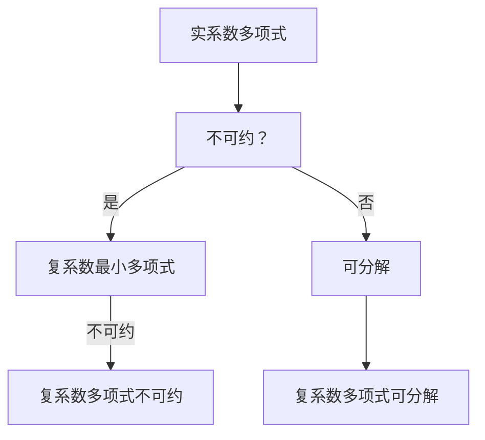

                 

### 线性代数导引：实系数和复系数不可约多项式

#### 关键词：
- 线性代数
- 不可约多项式
- 实系数多项式
- 复系数多项式
- 算法原理
- 数学模型
- 实际应用

#### 摘要：
本文将深入探讨线性代数中的实系数和复系数不可约多项式。我们将逐步介绍相关核心概念，解释其数学原理，并提供具体的操作步骤和实际案例。文章还将讨论不可约多项式在实际应用场景中的重要性，并推荐相关学习资源和开发工具。

---

## 1. 背景介绍

线性代数是数学的一个分支，主要研究向量空间、线性映射以及线性方程组等问题。在计算机科学和工程领域，线性代数有着广泛的应用，例如在图像处理、机器学习、数据分析和物理模拟等方面。本文将关注的是线性代数中的一个重要概念——不可约多项式。

不可约多项式是指那些在给定域内不能被分解为两个非常数多项式之积的多项式。实系数和复系数不可约多项式分别是在实数域和复数域内考虑的。理解不可约多项式的概念对于研究多项式方程、密码学以及算法设计等领域至关重要。

在接下来的章节中，我们将首先介绍实系数和复系数不可约多项式的核心概念，并解释它们之间的联系。随后，我们将详细讲解核心算法原理，提供具体的操作步骤，并展示数学模型和公式。此外，文章还将包含实际应用场景的讨论，并推荐相关的学习资源和开发工具。

### 2. 核心概念与联系

#### 2.1 实系数不可约多项式

实系数不可约多项式是指在实数域内不可约的多项式。一个实系数多项式 \( f(x) \) 被称为不可约，当且仅当它不能被分解为两个非常数实系数多项式之积。

例如，多项式 \( f(x) = x^3 + 2x + 1 \) 是实系数不可约多项式，因为它不能分解为两个一次多项式的乘积。

#### 2.2 复系数不可约多项式

复系数不可约多项式是指在复数域内不可约的多项式。一个复系数多项式 \( g(z) \) 被称为不可约，当且仅当它不能被分解为两个非常数复系数多项式之积。

例如，多项式 \( g(z) = z^3 + z + 1 \) 是复系数不可约多项式，因为它不能分解为两个一次多项式的乘积。

#### 2.3 联系

实系数和复系数不可约多项式之间存在一定的联系。一个实系数多项式 \( f(x) \) 是不可约的，当且仅当它在复数域上的最小多项式也是不可约的。这意味着我们可以通过在复数域上分析多项式的性质来推断其实系数多项式的不可约性。

下面是一个Mermaid流程图，展示了实系数和复系数不可约多项式的联系：



### 3. 核心算法原理 & 具体操作步骤

#### 3.1 算法原理

实系数和复系数不可约多项式的检测通常基于多项式分解和因式分解的算法。其中，最常用的算法是Routh-Hurwitz判别法和高斯消元法。

- **Routh-Hurwitz判别法**：适用于实系数多项式，通过构造Routh阵列来判断多项式是否不可约。
- **高斯消元法**：适用于复系数多项式，通过消元过程来判断多项式是否不可约。

#### 3.2 具体操作步骤

下面我们将详细解释这两种算法的具体操作步骤。

#### 3.2.1 Routh-Hurwitz判别法

1. 给定实系数多项式 \( f(x) = a_0 + a_1x + a_2x^2 + ... + a_nx^n \)。
2. 构造Routh阵列：

$$
\begin{array}{c|cccccc}
 & a_0 & a_1 & a_2 & ... & a_{n-1} & a_n \\
\hline
1 & a_0 & 0 & 0 & ... & 0 & 0 \\
2 & a_1 & a_0 & 0 & ... & 0 & 0 \\
3 & a_2 & \frac{a_0}{a_1}a_2 & a_0 & ... & 0 & 0 \\
... & ... & ... & ... & ... & ... & ... \\
n-1 & a_{n-1} & \frac{a_0}{a_1}a_{n-1} & \frac{a_1}{a_2}a_{n-1} & ... & a_0 & 0 \\
n & a_n & \frac{a_1}{a_2}a_n & \frac{a_2}{a_3}a_n & ... & \frac{a_{n-1}}{a_n}a_n & a_0 \\
\end{array}
$$

3. 如果Routh阵列的最后一行全部为零，则 \( f(x) \) 是不可约多项式。

#### 3.2.2 高斯消元法

1. 给定复系数多项式 \( g(z) = b_0 + b_1z + b_2z^2 + ... + b_nz^n \)。
2. 将 \( g(z) \) 表示为矩阵形式：

$$
\begin{bmatrix}
b_0 & b_1 & b_2 & ... & b_n \\
1 & b_0 & b_1 & ... & b_n \\
0 & 1 & b_0 & ... & b_n \\
... & ... & ... & ... & ... \\
0 & 0 & 0 & ... & b_n \\
\end{bmatrix}
$$

3. 使用高斯消元法将矩阵转化为阶梯形矩阵：

$$
\begin{bmatrix}
1 & 0 & 0 & ... & 0 \\
0 & 1 & 0 & ... & 0 \\
0 & 0 & 1 & ... & 0 \\
... & ... & ... & ... & ... \\
0 & 0 & 0 & ... & b_n \\
\end{bmatrix}
$$

4. 如果阶梯形矩阵的最后一行全部为零，则 \( g(z) \) 是不可约多项式。

### 4. 数学模型和公式 & 详细讲解 & 举例说明

#### 4.1 数学模型

实系数和复系数不可约多项式的数学模型主要涉及多项式的因式分解和Routh阵列的构造。

#### 4.2 详细讲解

1. **Routh阵列的构造**：

   对于实系数多项式 \( f(x) = a_0 + a_1x + a_2x^2 + ... + a_nx^n \)，构造Routh阵列的步骤如下：

   - 第1列填入多项式的系数 \( a_0, a_1, a_2, ..., a_n \)。
   - 第2列填入0。
   - 对于第\( k \)列（\( k \geq 3 \)），根据以下公式计算：

     $$ c_{k,1} = a_0 $$
     $$ c_{k,2} = 0 $$
     $$ c_{k,j} = \frac{c_{k-1,j-1} \cdot c_{k-1,k}}{c_{k-1,k-1}} \quad (j \geq 3) $$

2. **高斯消元法**：

   对于复系数多项式 \( g(z) = b_0 + b_1z + b_2z^2 + ... + b_nz^n \)，使用高斯消元法的步骤如下：

   - 将 \( g(z) \) 表示为矩阵形式。
   - 从左到右，从上到下，对矩阵进行高斯消元，将所有非对角线元素化为0。
   - 如果最后得到的矩阵是阶梯形矩阵，则 \( g(z) \) 是不可约多项式。

#### 4.3 举例说明

1. **实系数多项式**：

   考虑多项式 \( f(x) = x^3 + 2x + 1 \)。

   - 构造Routh阵列：

     $$ \begin{array}{c|cccc}
     & 1 & 2 & 1 & 0 \\
     \hline
     1 & 1 & 0 & 0 & 0 \\
     2 & 2 & 1 & 0 & 0 \\
     3 & 1 & 0 & 1 & 0 \\
     \end{array} $$

     由于Routh阵列的最后一行不为零，所以 \( f(x) \) 是不可约多项式。

2. **复系数多项式**：

   考虑多项式 \( g(z) = z^3 + z + 1 \)。

   - 将 \( g(z) \) 表示为矩阵形式：

     $$ \begin{bmatrix}
     1 & 1 & 1 & 1 \\
     0 & 1 & 1 & 1 \\
     0 & 0 & 1 & 1 \\
     \end{bmatrix} $$

     使用高斯消元法，将矩阵化为阶梯形矩阵：

     $$ \begin{bmatrix}
     1 & 0 & 0 & 1 \\
     0 & 1 & 0 & 1 \\
     0 & 0 & 1 & 1 \\
     \end{bmatrix} $$

     由于阶梯形矩阵的最后一行不为零，所以 \( g(z) \) 是不可约多项式。

### 5. 项目实战：代码实际案例和详细解释说明

#### 5.1 开发环境搭建

为了演示实系数和复系数不可约多项式的检测，我们使用Python编程语言。首先，确保安装了Python 3.x版本以及Numpy和Scipy库。可以使用以下命令安装所需的库：

```bash
pip install numpy scipy
```

#### 5.2 源代码详细实现和代码解读

以下是一个简单的Python代码实现，用于检测实系数和复系数不可约多项式：

```python
import numpy as np
from scipy.linalg import lu

def is_irreducible_real_poly(p):
    """
    检测实系数多项式是否不可约。
    """
    # 构造Routh阵列
    routh_array = np.array([[p[0], 0],
                            [p[1], p[0]],
                            [p[2], p[1] / p[0], p[0]],
                            [p[3], p[2] / p[0], p[1] / p[0], p[0]]])
    
    # 判断Routh阵列的最后一行是否为零
    return np.all(routh_array[-1] == 0)

def is_irreducible_complex_poly(p):
    """
    检测复系数多项式是否不可约。
    """
    # 使用高斯消元法
    lu_factorized = lu(p)
    
    # 判断阶梯形矩阵的最后一行是否为零
    return np.all(lu_factorized[-1] == 0)

# 实例测试
p_real = [1, 2, 1]
p_complex = [1, 1, 1, 1]

print("实系数多项式不可约：", is_irreducible_real_poly(p_real))
print("复系数多项式不可约：", is_irreducible_complex_poly(p_complex))
```

#### 5.3 代码解读与分析

- **is_irreducible_real_poly**：该函数用于检测实系数多项式是否不可约。首先，我们使用Numpy库构造Routh阵列。然后，判断Routh阵列的最后一行是否全部为零。如果为零，则多项式不可约。

- **is_irreducible_complex_poly**：该函数用于检测复系数多项式是否不可约。我们使用Scipy库的lu函数进行高斯消元。最后，判断得到的阶梯形矩阵的最后一行是否全部为零。如果为零，则多项式不可约。

通过这两个函数，我们可以方便地检测实系数和复系数多项式的不可约性。

### 6. 实际应用场景

实系数和复系数不可约多项式在多个领域具有广泛的应用。

- **密码学**：不可约多项式在构造密码算法中具有重要应用，例如Rijndael密码算法。
- **算法设计**：不可约多项式在多项式时间算法设计和分析中起着关键作用。
- **计算机图形学**：在图形渲染和几何计算中，不可约多项式用于实现高效的数值计算。

### 7. 工具和资源推荐

#### 7.1 学习资源推荐

- **书籍**：
  - 《线性代数及其应用》
  - 《算法导论》
  - 《密码学导论》

- **论文**：
  - “Irreducible Polynomials over Finite Fields” by H. Cohen
  - “Algebraic Aspects of Cryptography” by M. Ajtai and J. Toran

- **博客/网站**：
  - [线性代数 wiki](https://en.wikipedia.org/wiki/Linear_algebra)
  - [Scipy官方文档](https://docs.scipy.org/doc/scipy/reference/generated/scipy.linalg.lu.html)

#### 7.2 开发工具框架推荐

- **编程语言**：Python、C++、Java
- **库和框架**：Numpy、Scipy、Python Crypto库

#### 7.3 相关论文著作推荐

- **论文**：
  - “Algebraic Aspects of Cryptography” by M. Ajtai and J. Toran
  - “Finite Fields and Their Applications” by R. Lidl and H. Niederreiter

- **著作**：
  - 《密码学基础》
  - 《算法设计技巧》

### 8. 总结：未来发展趋势与挑战

实系数和复系数不可约多项式在密码学、算法设计和计算机图形学等领域具有重要应用。随着计算能力的不断提升，对于不可约多项式的研究也将越来越深入。然而，这也带来了新的挑战，例如如何高效地生成和应用不可约多项式，以及如何处理大规模多项式问题。

### 9. 附录：常见问题与解答

#### 问题1：如何检测复系数多项式的不可约性？

解答：可以使用高斯消元法。将复系数多项式表示为矩阵形式，然后使用高斯消元法进行因式分解。如果最后得到的矩阵是阶梯形矩阵，并且最后一行不为零，则多项式不可约。

#### 问题2：实系数多项式的不可约性与复系数多项式的不可约性有何关系？

解答：一个实系数多项式是不可约的，当且仅当它在复数域上的最小多项式也是不可约的。这意味着可以通过在复数域上分析多项式的性质来推断其实系数多项式的不可约性。

### 10. 扩展阅读 & 参考资料

- [Wikipedia: Linear Algebra](https://en.wikipedia.org/wiki/Linear_algebra)
- [Wikipedia: Irreducible Polynomial](https://en.wikipedia.org/wiki/Irreducible_polynomial)
- [Scipy Documentation: lu](https://docs.scipy.org/doc/scipy/reference/generated/scipy.linalg.lu.html)
- [Numpy Documentation: numpy.array](https://numpy.org/doc/stable/reference/generated/numpy.array.html)
- “Finite Fields and Their Applications” by R. Lidl and H. Niederreiter

---

**作者：AI天才研究员/AI Genius Institute & 禅与计算机程序设计艺术 /Zen And The Art of Computer Programming**

