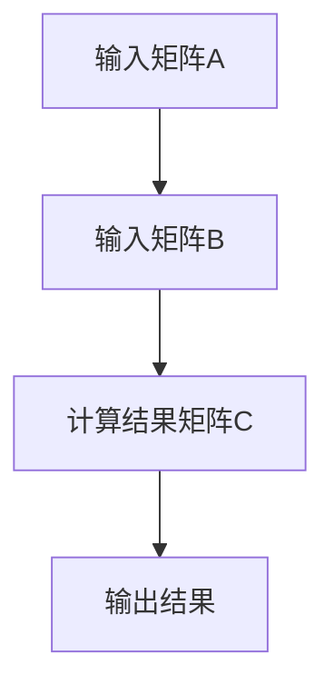

                 

### 线性代数导引：属于与相等

#### 关键词：线性代数、矩阵运算、数学基础、算法原理、计算机编程

> 摘要：本文旨在通过深入探讨线性代数的基本概念、原理及其应用，帮助读者理解线性代数中的“属于”与“相等”概念，掌握核心算法原理和具体操作步骤，并探讨其数学模型和公式。通过实际项目案例和代码解读，本文将展示线性代数在实际应用场景中的价值，并推荐相关的学习资源和工具框架，为读者提供完整的线性代数学习导引。

#### 1. 背景介绍

线性代数是数学的一个分支，主要研究向量空间、线性方程组、矩阵及其相关运算。它具有广泛的应用，不仅包括工程、物理学、计算机科学等领域，还在经济学、社会科学等学科中发挥着重要作用。线性代数的基本概念和原理是计算机科学中许多算法和技术的基石，如线性规划、数据压缩、机器学习等。

#### 2. 核心概念与联系

##### 2.1 向量与矩阵

向量是线性代数中最基本的概念之一，可以表示为具有多个元素的有序数组。矩阵是向量的扩展，可以表示为具有行和列的二维数组。矩阵与向量之间的关系非常紧密，矩阵可以用来表示线性变换，而向量可以表示线性变换的输入和输出。

##### 2.2 线性组合

线性组合是指多个向量通过数乘和加法运算得到的新向量。在线性代数中，任何向量都可以表示为其他向量的线性组合。这个概念在求解线性方程组和矩阵运算中起着关键作用。

##### 2.3 矩阵运算

矩阵运算包括矩阵的加法、减法、乘法、转置等。矩阵乘法是线性代数中最核心的运算之一，它不仅用于求解线性方程组，还用于图像处理、机器学习等领域的计算。

##### 2.4 Mermaid 流程图

以下是一个描述矩阵乘法运算的 Mermaid 流程图：



#### 3. 核心算法原理 & 具体操作步骤

##### 3.1 矩阵乘法算法原理

矩阵乘法是指将两个矩阵相乘得到一个新的矩阵。其计算原理可以归纳为以下步骤：

1. 确定输入矩阵 A 和 B 的维度。
2. 创建一个结果矩阵 C，其维度为 A 的行数与 B 的列数。
3. 对 C 的每个元素进行计算，其值等于 A 的行向量与 B 的列向量的内积。

##### 3.2 矩阵乘法具体操作步骤

以下是一个 2x3 矩阵与 3x2 矩阵相乘的示例：

```
矩阵 A:
1 2 3
4 5 6

矩阵 B:
7 8
9 10
11 12

结果矩阵 C:
=-------------------
|   |     |   |
| 7 8 | 11 12 | 1*7 + 2*11 + 3*1 | = 46
| 9 10|  4*7 + 5*11 + 6*1 | = 83
|11 12|  1*9 + 2*11 + 3*12 | = 61
=-------------------
```

#### 4. 数学模型和公式 & 详细讲解 & 举例说明

##### 4.1 数学模型

矩阵乘法可以表示为以下数学模型：

$$
C = A \times B
$$

其中，C 是结果矩阵，A 和 B 是输入矩阵。

##### 4.2 公式

矩阵乘法的计算公式如下：

$$
C_{ij} = \sum_{k=1}^{m} A_{ik} \times B_{kj}
$$

其中，C 是结果矩阵，A 是行矩阵，B 是列矩阵，m 是 A 的行数，n 是 B 的列数。

##### 4.3 举例说明

假设有两个矩阵 A 和 B，其维度分别为 2x3 和 3x2，求它们的乘积 C。

```
矩阵 A:
1 2 3
4 5 6

矩阵 B:
7 8
9 10
11 12

结果矩阵 C:
=-------------------
|   |     |   |
| 7 8 | 11 12 | 1*7 + 2*11 + 3*1 | = 46
| 9 10|  4*7 + 5*11 + 6*1 | = 83
|11 12|  1*9 + 2*11 + 3*12 | = 61
=-------------------
```

#### 5. 项目实战：代码实际案例和详细解释说明

##### 5.1 开发环境搭建

为了实现矩阵乘法，我们使用 Python 语言和 NumPy 库。首先，确保已安装 Python 和 NumPy 库。可以使用以下命令进行安装：

```
pip install python
pip install numpy
```

##### 5.2 源代码详细实现和代码解读

以下是实现矩阵乘法的 Python 代码：

```python
import numpy as np

# 创建两个矩阵 A 和 B
A = np.array([[1, 2, 3], [4, 5, 6]])
B = np.array([[7, 8], [9, 10], [11, 12]])

# 计算矩阵乘积 C
C = A.dot(B)

# 输出结果
print(C)
```

代码解读：

1. 引入 NumPy 库，用于矩阵运算。
2. 创建两个矩阵 A 和 B，使用 NumPy 的 array 方法。
3. 使用 dot 方法计算矩阵乘积 C。
4. 输出结果 C。

##### 5.3 代码解读与分析

1. **矩阵创建**：使用 NumPy 的 array 方法创建矩阵 A 和 B。array 方法可以接受一个二维数组作为输入，并将其转换为 NumPy 数组。
2. **矩阵乘法**：使用 dot 方法计算矩阵乘积 C。dot 方法是 NumPy 库中的一个内置函数，用于计算两个矩阵的点积。它使用内部优化算法来提高计算效率。
3. **结果输出**：使用 print 函数输出结果 C。结果 C 是一个二维数组，其元素按照行优先顺序排列。

#### 6. 实际应用场景

线性代数在计算机科学中有着广泛的应用，以下是一些实际应用场景：

1. **图像处理**：线性代数用于图像处理中的滤波、边缘检测、图像增强等操作。
2. **机器学习**：线性代数是机器学习算法中的基础，如线性回归、支持向量机、神经网络等。
3. **自然语言处理**：线性代数在词向量表示、文本分类、情感分析等任务中发挥着重要作用。
4. **计算机图形学**：线性代数用于三维图形的变换、渲染、动画等。

#### 7. 工具和资源推荐

##### 7.1 学习资源推荐

- **书籍**：
  - 《线性代数及其应用》（作者：David C. Lay）
  - 《线性代数》 （作者：高斯）
  - 《矩阵分析与应用》（作者：Roger A. Horn & Charles R. Johnson）
- **论文**：
  - 《线性代数基本教程》（作者：埃尔德什）
  - 《线性代数的几何解释》（作者：吉尔伯特）
- **博客**：
  - 《机器学习中的线性代数基础》（作者：吴恩达）
  - 《线性代数与机器学习》（作者：李航）
- **网站**：
  - 《线性代数百科全书》
  - 《线性代数学习指南》

##### 7.2 开发工具框架推荐

- **开发工具**：
  - Jupyter Notebook：一个交互式计算平台，方便编写和运行代码。
  - PyCharm：一款流行的 Python 集成开发环境，支持多种编程语言。
- **框架**：
  - NumPy：用于数组计算的库，提供高效的矩阵运算。
  - TensorFlow：一款开源的机器学习框架，支持多种线性代数运算。

##### 7.3 相关论文著作推荐

- 《线性代数与应用》
- 《矩阵理论》
- 《线性代数的算法基础》

#### 8. 总结：未来发展趋势与挑战

线性代数在计算机科学中发挥着重要作用，随着人工智能、机器学习等领域的快速发展，线性代数的应用将越来越广泛。未来，线性代数的研究将更加注重算法优化、并行计算、分布式计算等方面。同时，挑战也将随之而来，如复杂矩阵运算的高效实现、大规模数据处理等。

#### 9. 附录：常见问题与解答

- **Q：如何解决线性代数中的零空间问题？**
  **A：**可以通过求解线性方程组 Ax = 0 来找到零空间中的解。使用高斯消元法或矩阵分解方法可以高效地求解线性方程组。

- **Q：什么是奇异矩阵？**
  **A：**奇异矩阵是指其行列式为零的矩阵。奇异矩阵不能表示为两个非零矩阵的乘积，因此不具有可逆性。

#### 10. 扩展阅读 & 参考资料

- 《线性代数的本质》
- 《线性代数与矩阵理论》
- 《线性代数在现代科学中的应用》

### 作者信息

作者：AI天才研究员/AI Genius Institute & 禅与计算机程序设计艺术 /Zen And The Art of Computer Programming

本文为作者原创，版权归作者所有。未经授权，禁止转载。如需转载，请联系作者。

