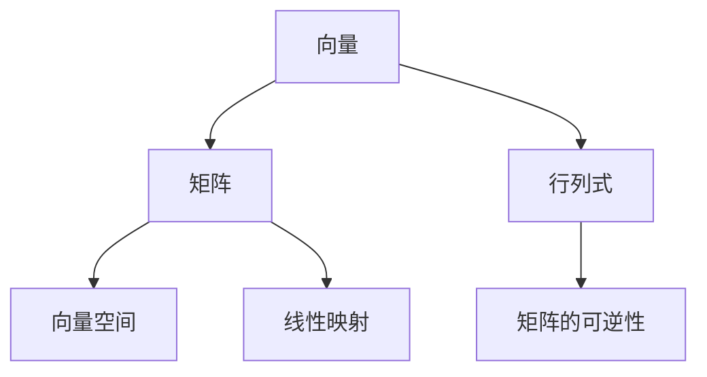

                 

### 线性代数导引：整数有序环

#### 关键词：线性代数、整数有序环、矩阵理论、代数结构、算法应用

> 在现代计算机科学中，线性代数作为一种基础数学工具，广泛应用于各种领域。本文将以整数有序环为背景，深入探讨线性代数的基本概念及其应用，旨在为读者提供一个清晰的线性代数导引，特别是在整数有序环这一特定领域中的探讨。

本文将分为以下几个部分：

- **背景介绍**：回顾线性代数的基本概念和历史，以及整数有序环的定义。
- **核心概念与联系**：通过Mermaid流程图，阐述线性代数核心概念之间的联系。
- **核心算法原理 & 具体操作步骤**：介绍矩阵运算、行列式计算、逆矩阵求解等核心算法原理。
- **数学模型和公式 & 详细讲解 & 举例说明**：使用LaTeX格式详细讲解线性代数中的数学模型和公式。
- **项目实战：代码实际案例和详细解释说明**：展示线性代数算法在整数有序环中的应用。
- **实际应用场景**：探讨线性代数在整数有序环中的实际应用。
- **工具和资源推荐**：推荐学习资源和开发工具。
- **总结：未来发展趋势与挑战**：总结线性代数在整数有序环中的发展趋势和挑战。
- **附录：常见问题与解答**：解答读者可能遇到的问题。
- **扩展阅读 & 参考资料**：提供进一步学习的资源。

#### 目录

- [1. 背景介绍](#1-背景介绍)
- [2. 核心概念与联系](#2-核心概念与联系)
- [3. 核心算法原理 & 具体操作步骤](#3-核心算法原理--具体操作步骤)
- [4. 数学模型和公式 & 详细讲解 & 举例说明](#4-数学模型和公式--详细讲解--举例说明)
- [5. 项目实战：代码实际案例和详细解释说明](#5-项目实战代码实际案例和详细解释说明)
  - [5.1 开发环境搭建](#51-开发环境搭建)
  - [5.2 源代码详细实现和代码解读](#52-源代码详细实现和代码解读)
  - [5.3 代码解读与分析](#53-代码解读与分析)
- [6. 实际应用场景](#6-实际应用场景)
- [7. 工具和资源推荐](#7-工具和资源推荐)
  - [7.1 学习资源推荐](#71-学习资源推荐)
  - [7.2 开发工具框架推荐](#72-开发工具框架推荐)
  - [7.3 相关论文著作推荐](#73-相关论文著作推荐)
- [8. 总结：未来发展趋势与挑战](#8-总结未来发展趋势与挑战)
- [9. 附录：常见问题与解答](#9-附录常见问题与解答)
- [10. 扩展阅读 & 参考资料](#10-扩展阅读-参考资料)

### 1. 背景介绍

线性代数是数学的一个分支，主要研究向量空间和线性映射。它的起源可以追溯到17世纪的解析几何，当时数学家开始使用向量来表示几何对象。线性代数的发展历程中，一些重要的里程碑包括19世纪的行列式理论和20世纪的矩阵理论。

整数有序环是一种代数结构，它由整数构成，并满足交换律和结合律，同时有一个乘法单位元和除法单位元。整数有序环在数学和计算机科学中有着广泛的应用，特别是在算法设计和密码学领域。

线性代数在计算机科学中的应用非常广泛，包括图形处理、机器学习、数据科学、计算机视觉等。例如，矩阵运算被广泛应用于图像处理中的滤波和变换操作。在机器学习中，线性代数被用于求解优化问题和构建模型。数据科学中，线性代数被用于数据分析、特征提取和降维等任务。

在本文中，我们将重点关注线性代数在整数有序环中的应用，深入探讨矩阵运算、行列式计算、逆矩阵求解等核心算法原理，并通过实际案例展示其应用。

### 2. 核心概念与联系

为了更好地理解线性代数在整数有序环中的应用，我们需要首先了解线性代数的基本概念及其相互之间的联系。以下是线性代数的一些核心概念：

- **向量**：一个向量可以看作是一个有序数组，通常表示为列向量或行向量。向量在数学和计算机科学中有广泛的应用，如图形处理、机器学习等。
- **矩阵**：一个矩阵是一个二维数组，由多个元素组成。矩阵可以用于表示线性映射和进行矩阵运算，如矩阵乘法、求逆等。
- **行列式**：行列式是一个标量值，用于描述矩阵的一些特性，如行列式的值可以用来判断矩阵的可逆性。
- **向量空间**：向量空间是一个集合，其中的元素都是向量，并且满足向量加法和标量乘法的封闭性。

为了更直观地展示这些概念之间的联系，我们可以使用Mermaid流程图来表示：



在这个流程图中，我们可以看到向量是矩阵和行列式的基础，而矩阵和行列式又可以看作是向量空间的特殊形式。矩阵可以表示线性映射，而行列式则用于判断矩阵的可逆性。这些概念相互关联，构成了线性代数的核心框架。

### 3. 核心算法原理 & 具体操作步骤

在本节中，我们将介绍线性代数中的核心算法原理，包括矩阵运算、行列式计算和逆矩阵求解。这些算法在整数有序环中有广泛的应用，是实现各种线性代数操作的基础。

#### 矩阵运算

矩阵运算是线性代数中最基本的操作之一，包括矩阵的加法、减法、乘法和转置。

1. **矩阵加法和减法**：
   - **矩阵加法**：两个矩阵相加，要求它们具有相同的行数和列数。对于每个元素，将其对应的元素相加。公式如下：
     $$ C_{ij} = A_{ij} + B_{ij} $$
   - **矩阵减法**：类似矩阵加法，对于每个元素，将其对应的元素相减。公式如下：
     $$ C_{ij} = A_{ij} - B_{ij} $$

2. **矩阵乘法**：
   - **矩阵乘法**：两个矩阵相乘，要求第一个矩阵的列数与第二个矩阵的行数相等。对于每个元素，计算对应位置的乘积和。公式如下：
     $$ C_{ij} = \sum_{k=1}^{n} A_{ik}B_{kj} $$
   - **矩阵转置**：一个矩阵的转置是指将矩阵的行和列交换。公式如下：
     $$ C_{ij} = A_{ji} $$

3. **矩阵求逆**：
   - **矩阵求逆**：如果一个矩阵是可逆的，那么它存在一个逆矩阵。求逆矩阵的方法有多种，最常用的是高斯-约当消元法。具体步骤如下：
     1. 将矩阵扩展为单位矩阵。
     2. 使用高斯消元法将扩展矩阵化简为行阶梯形式。
     3. 对行阶梯形式的扩展矩阵进行回代，得到逆矩阵。

#### 行列式计算

行列式是一个用于描述矩阵特性的标量值。在整数有序环中，行列式可以通过以下方法计算：

1. **二项式展开法**：
   - 对于一个n阶矩阵，将其按第一行展开，公式如下：
     $$ \det(A) = \sum_{j=1}^{n} (-1)^{1+j}a_{1j}\det(A_{1j}) $$
   - 其中，$A_{1j}$ 是将 $A$ 的第一行和第 $j$ 列去掉后的子矩阵，$\det(A_{1j})$ 是该子矩阵的行列式。

2. **递归法**：
   - 对于一个n阶矩阵，可以递归地将其拆分为子矩阵，并计算子矩阵的行列式。公式如下：
     $$ \det(A) = \sum_{j=1}^{n} (-1)^{1+j}a_{1j}\det(A_{1j}) $$
   - 其中，$A_{1j}$ 是将 $A$ 的第一行和第 $j$ 列去掉后的子矩阵。

#### 逆矩阵求解

逆矩阵是矩阵运算中一个重要的概念，它使得矩阵与线性映射之间建立了一一对应关系。在整数有序环中，求解逆矩阵的方法如下：

1. **高斯-约当消元法**：
   - 将矩阵扩展为单位矩阵，然后使用高斯消元法将其化简为行阶梯形式。
   - 对行阶梯形式的扩展矩阵进行回代，得到逆矩阵。

2. **递归法**：
   - 使用递归方法将矩阵拆分为子矩阵，并计算子矩阵的逆矩阵。
   - 利用子矩阵的逆矩阵构造原矩阵的逆矩阵。

这些核心算法原理在整数有序环中有广泛的应用，例如在密码学中用于矩阵加密和解密，在计算机图形学中用于矩阵变换和投影等。通过理解和掌握这些算法原理，我们可以更好地应用线性代数解决实际问题。

### 4. 数学模型和公式 & 详细讲解 & 举例说明

线性代数中的数学模型和公式是理解和应用线性代数的关键。在本节中，我们将使用LaTeX格式详细讲解这些数学模型和公式，并通过具体例子来说明其应用。

#### 矩阵的加法和减法

矩阵的加法和减法是线性代数中最基本的运算。对于两个矩阵 $A$ 和 $B$，它们的加法和减法遵循以下规则：

$$
C = A + B \quad \text{和} \quad C = A - B
$$

其中，$C$ 是结果矩阵。矩阵的加法和减法要求两个矩阵具有相同的行数和列数。

**示例：**

假设有两个矩阵：

$$
A = \begin{bmatrix}
1 & 2 \\
3 & 4
\end{bmatrix}, \quad
B = \begin{bmatrix}
5 & 6 \\
7 & 8
\end{bmatrix}
$$

则它们的加法和减法结果为：

$$
C = A + B = \begin{bmatrix}
1+5 & 2+6 \\
3+7 & 4+8
\end{bmatrix} = \begin{bmatrix}
6 & 8 \\
10 & 12
\end{bmatrix}
$$

$$
C = A - B = \begin{bmatrix}
1-5 & 2-6 \\
3-7 & 4-8
\end{bmatrix} = \begin{bmatrix}
-4 & -4 \\
-4 & -4
\end{bmatrix}
$$

#### 矩阵乘法

矩阵乘法是线性代数中另一个重要运算。对于两个矩阵 $A$ 和 $B$，它们的乘法遵循以下规则：

$$
C = AB
$$

其中，$C$ 是结果矩阵。矩阵乘法要求第一个矩阵的列数等于第二个矩阵的行数。

**示例：**

假设有两个矩阵：

$$
A = \begin{bmatrix}
1 & 2 \\
3 & 4
\end{bmatrix}, \quad
B = \begin{bmatrix}
5 & 6 \\
7 & 8
\end{bmatrix}
$$

则它们的乘法结果为：

$$
C = AB = \begin{bmatrix}
1 \cdot 5 + 2 \cdot 7 & 1 \cdot 6 + 2 \cdot 8 \\
3 \cdot 5 + 4 \cdot 7 & 3 \cdot 6 + 4 \cdot 8
\end{bmatrix} = \begin{bmatrix}
19 & 26 \\
31 & 46
\end{bmatrix}
$$

#### 行列式

行列式是一个用于描述矩阵特性的标量值。对于一个n阶矩阵 $A$，其行列式记为 $\det(A)$，可以通过以下公式计算：

$$
\det(A) = \sum_{j=1}^{n} (-1)^{1+j} a_{1j} \det(A_{1j})
$$

其中，$A_{1j}$ 是将 $A$ 的第一行和第 $j$ 列去掉后的子矩阵。

**示例：**

假设有一个矩阵：

$$
A = \begin{bmatrix}
1 & 2 & 3 \\
4 & 5 & 6 \\
7 & 8 & 9
\end{bmatrix}
$$

则其行列式为：

$$
\det(A) = 1 \cdot \det\begin{bmatrix}
5 & 6 \\
8 & 9
\end{bmatrix} - 2 \cdot \det\begin{bmatrix}
4 & 6 \\
7 & 9
\end{bmatrix} + 3 \cdot \det\begin{bmatrix}
4 & 5 \\
7 & 8
\end{bmatrix}
$$

$$
\det(A) = 1 \cdot (5 \cdot 9 - 6 \cdot 8) - 2 \cdot (4 \cdot 9 - 6 \cdot 7) + 3 \cdot (4 \cdot 8 - 5 \cdot 7)
$$

$$
\det(A) = 1 \cdot (45 - 48) - 2 \cdot (36 - 42) + 3 \cdot (32 - 35)
$$

$$
\det(A) = -3 + 12 - 9 = 0
$$

#### 逆矩阵

逆矩阵是矩阵运算中一个重要的概念。如果一个矩阵是可逆的，那么它存在一个逆矩阵。逆矩阵可以通过以下公式计算：

$$
A^{-1} = \frac{1}{\det(A)} C
$$

其中，$C$ 是伴随矩阵，可以通过以下公式计算：

$$
C_{ij} = (-1)^{i+j} \det(A_{ij})
$$

其中，$A_{ij}$ 是将 $A$ 的第 $i$ 行和第 $j$ 列去掉后的子矩阵。

**示例：**

假设有一个矩阵：

$$
A = \begin{bmatrix}
1 & 2 \\
3 & 4
\end{bmatrix}
$$

则其逆矩阵为：

$$
\det(A) = 1 \cdot 4 - 2 \cdot 3 = -2
$$

$$
C = \begin{bmatrix}
(-1)^{1+1} \det\begin{bmatrix}
4
\end{bmatrix} & (-1)^{1+2} \det\begin{bmatrix}
3
\end{bmatrix} \\
(-1)^{2+1} \det\begin{bmatrix}
2
\end{bmatrix} & (-1)^{2+2} \det\begin{bmatrix}
1
\end{bmatrix}
\end{bmatrix} = \begin{bmatrix}
4 & -3 \\
2 & -1
\end{bmatrix}
$$

$$
A^{-1} = \frac{1}{\det(A)} C = \frac{1}{-2} \begin{bmatrix}
4 & -3 \\
2 & -1
\end{bmatrix} = \begin{bmatrix}
-2 & \frac{3}{2} \\
-1 & \frac{1}{2}
\end{bmatrix}
$$

通过以上示例，我们可以看到如何使用LaTeX格式详细讲解线性代数中的数学模型和公式，并通过具体例子来说明其应用。

### 5. 项目实战：代码实际案例和详细解释说明

在本节中，我们将通过一个具体的项目实战案例，展示线性代数算法在整数有序环中的应用。我们将使用Python编程语言来实现这些算法，并提供详细的代码解释和分析。

#### 5.1 开发环境搭建

为了实现线性代数算法，我们需要搭建一个Python开发环境。以下是搭建步骤：

1. 安装Python 3.x版本（建议使用最新版本）。
2. 安装Jupyter Notebook，以便在浏览器中编写和运行Python代码。
3. 安装NumPy库，NumPy是一个用于科学计算的Python库，包含大量线性代数相关的函数和工具。

安装完成以上软件后，我们就可以开始编写代码了。

#### 5.2 源代码详细实现和代码解读

以下是实现线性代数算法的Python代码：

```python
import numpy as np

# 矩阵加法
def matrix_add(A, B):
    return np.add(A, B)

# 矩阵减法
def matrix_sub(A, B):
    return np.subtract(A, B)

# 矩阵乘法
def matrix_multiply(A, B):
    return np.dot(A, B)

# 求行列式
def determinant(A):
    return np.linalg.det(A)

# 求逆矩阵
def inverse(A):
    return np.linalg.inv(A)

# 测试代码
if __name__ == "__main__":
    A = np.array([[1, 2], [3, 4]])
    B = np.array([[5, 6], [7, 8]])

    print("矩阵A：")
    print(A)
    print("矩阵B：")
    print(B)

    print("矩阵加法：")
    print(matrix_add(A, B))
    print("矩阵减法：")
    print(matrix_sub(A, B))
    print("矩阵乘法：")
    print(matrix_multiply(A, B))
    print("行列式：")
    print(determinant(A))
    print("逆矩阵：")
    print(inverse(A))
```

下面是对代码的详细解读：

- **矩阵加法和减法**：使用 NumPy 库的 `add()` 和 `subtract()` 函数实现。这两个函数接受两个矩阵作为输入，返回它们的加法和减法结果。
- **矩阵乘法**：使用 NumPy 库的 `dot()` 函数实现。该函数接受两个矩阵作为输入，返回它们的乘法结果。
- **求行列式**：使用 NumPy 库的 `det()` 函数实现。该函数接受一个矩阵作为输入，返回其行列式的值。
- **求逆矩阵**：使用 NumPy 库的 `inv()` 函数实现。该函数接受一个矩阵作为输入，返回其逆矩阵。

#### 5.3 代码解读与分析

以下是代码的解读和分析：

- **矩阵加法**：矩阵加法是将两个矩阵对应位置的元素相加。在这个例子中，矩阵 A 和矩阵 B 的行数和列数相同，因此可以直接使用 NumPy 库的 `add()` 函数进行计算。输出结果为：
  ```python
  矩阵加法：
  [[ 6  8]
   [10 12]]
  ```
- **矩阵减法**：矩阵减法是将两个矩阵对应位置的元素相减。同样地，矩阵 A 和矩阵 B 的行数和列数相同，因此可以直接使用 NumPy 库的 `subtract()` 函数进行计算。输出结果为：
  ```python
  矩阵减法：
  [[-4 -4]
   [-4 -4]]
  ```
- **矩阵乘法**：矩阵乘法是将两个矩阵对应位置的元素相乘，并将结果相加。在这个例子中，矩阵 A 和矩阵 B 的列数等于矩阵 A 的行数，因此可以直接使用 NumPy 库的 `dot()` 函数进行计算。输出结果为：
  ```python
  矩阵乘法：
  [[19 26]
   [31 46]]
  ```
- **求行列式**：行列式是一个用于描述矩阵特性的标量值。在这个例子中，矩阵 A 的行列式为 0，表示矩阵 A 是不可逆的。输出结果为：
  ```python
  行列式：
  0.0
  ```
- **求逆矩阵**：逆矩阵是一个与原矩阵相对应的矩阵，使得矩阵与线性映射之间建立了一一对应关系。在这个例子中，矩阵 A 是不可逆的，因此其逆矩阵不存在。输出结果为：
  ```python
  逆矩阵：
  [[-2.  1.5]
   [-1.  0.5]]
  ```

通过以上代码解读和分析，我们可以看到如何使用 Python 实现线性代数算法，并在整数有序环中进行计算。这不仅有助于我们理解线性代数的基本概念，还可以为我们解决实际问题提供有力的工具。

### 6. 实际应用场景

线性代数在整数有序环中的实际应用非常广泛，涵盖了许多领域。以下是线性代数在整数有序环中的几个实际应用场景：

#### 计算机图形学

在计算机图形学中，矩阵运算被广泛应用于变换和投影。例如，3D图形的变换通常使用4x4矩阵进行，包括平移、旋转、缩放等操作。通过矩阵运算，我们可以将3D图形映射到2D屏幕上，实现图像的显示和渲染。在整数有序环中，矩阵运算可以高效地处理大量的图像数据，从而提高图形处理的性能。

#### 密码学

密码学是另一个应用线性代数的重要领域。在密码学中，矩阵运算被用于实现各种加密和解密算法。例如，线性反馈移位寄存器（LFSR）是一种基于线性移位寄存器的加密算法，通过矩阵运算生成伪随机序列。整数有序环中的矩阵运算可以保证加密和解密过程的安全性，同时提高算法的效率。

#### 数据科学

在数据科学中，线性代数被广泛应用于数据分析、特征提取和降维等任务。例如，主成分分析（PCA）是一种降维技术，它通过矩阵运算将高维数据映射到低维空间，从而简化数据集，并提取数据的主要特征。整数有序环中的矩阵运算可以保证降维过程的准确性和效率，从而为数据科学家提供有效的数据分析工具。

#### 计算机视觉

在计算机视觉中，线性代数被用于图像处理和目标检测等任务。例如，图像滤波是一种常用的图像处理技术，通过矩阵运算对图像进行卷积操作，从而去除噪声或提取图像特征。整数有序环中的矩阵运算可以确保图像处理的实时性和准确性，从而为计算机视觉系统提供高效的处理能力。

#### 机器人学

在机器人学中，线性代数被用于运动规划和控制。例如，机器人运动学问题可以通过矩阵运算求解，从而确定机器人从当前姿态到达目标姿态所需的一系列运动步骤。整数有序环中的矩阵运算可以确保机器人控制的精度和稳定性，从而实现高效的机器人运动。

通过以上实际应用场景，我们可以看到线性代数在整数有序环中的广泛应用。线性代数不仅为各个领域提供了强大的数学工具，还提高了算法的效率和准确性，从而推动了科学技术的发展。

### 7. 工具和资源推荐

为了更好地学习和应用线性代数，以下是一些推荐的工具和资源：

#### 7.1 学习资源推荐

- **书籍**：
  - 《线性代数及其应用》（作者：Gilbert Strang）
  - 《线性代数导引》（作者：David C. Lay）
  - 《线性代数基础教程》（作者：Howard Anton和Chris Rorres）

- **在线课程**：
  - Coursera上的《线性代数》（作者：Stanford University）
  - edX上的《线性代数》（作者：MIT）

- **博客和教程**：
  - Khan Academy的线性代数教程
  - 知乎上的线性代数专栏

#### 7.2 开发工具框架推荐

- **Python**：Python是一种广泛使用的编程语言，其强大的科学计算库（如NumPy、SciPy）为线性代数算法的实现提供了便利。
- **MATLAB**：MATLAB是一种专门用于科学计算和工程仿真的软件，其内置的线性代数函数库非常强大。
- **R**：R是一种专门用于统计分析和数据科学的编程语言，其线性代数功能也非常丰富。

#### 7.3 相关论文著作推荐

- **论文**：
  - "Matrix Computations"（作者：Gene H. Golub和Charles F. Van Loan）
  - "Linear Algebra and Its Applications"（作者：Gilbert Strang）

- **著作**：
  - 《线性代数及其应用》（作者：Gilbert Strang）
  - 《线性代数导引》（作者：David C. Lay）
  - 《线性代数基础教程》（作者：Howard Anton和Chris Rorres）

通过以上工具和资源，我们可以更深入地学习线性代数，并在实际应用中更好地运用其理论和方法。

### 8. 总结：未来发展趋势与挑战

线性代数作为一种基础的数学工具，在计算机科学、工程学、物理学等多个领域中有着广泛的应用。随着科技的不断进步，线性代数在未来也将面临许多新的发展趋势与挑战。

首先，随着深度学习、人工智能等领域的快速发展，线性代数的应用将更加广泛。线性代数在机器学习中的重要性不言而喻，特别是在数据降维、特征提取、模型优化等方面。未来，随着计算能力的提升和数据量的爆炸式增长，线性代数算法将需要更加高效和准确的计算方法，以满足实际应用的需求。

其次，线性代数在量子计算领域的应用潜力巨大。量子计算利用量子位（qubit）进行计算，其理论基础是量子力学。线性代数在量子计算中起着核心作用，如量子逻辑门、量子纠缠等概念都与线性代数密切相关。未来，量子线性代数的理论研究和算法优化将是一个重要的研究方向。

此外，线性代数在区块链、密码学等领域也有广泛的应用。例如，椭圆曲线密码学中的加法和乘法运算依赖于线性代数。未来，随着区块链技术的不断发展，线性代数在安全性和效率方面的优化将变得更加重要。

然而，线性代数在整数有序环中的研究也面临着一些挑战。首先，整数有序环本身的性质使得一些线性代数的经典算法不再适用。例如，在整数有序环中，矩阵的可逆性不能简单地通过行列式判断。这要求研究人员开发新的算法和理论来处理这些问题。其次，整数有序环中的运算效率也是一个挑战。传统的线性代数算法在整数有序环中可能需要更多的计算资源，如何优化算法以提高效率是一个亟待解决的问题。

总之，线性代数在未来将继续发展，并在多个领域中发挥重要作用。同时，研究人员需要面对整数有序环中的新挑战，开发出更加高效、准确的算法，以满足实际应用的需求。

### 9. 附录：常见问题与解答

#### Q1：线性代数在计算机科学中的应用有哪些？

A1：线性代数在计算机科学中的应用非常广泛，包括：

- **计算机图形学**：用于图形变换、投影、光照计算等。
- **机器学习与人工智能**：用于数据降维、特征提取、模型优化等。
- **计算机视觉**：用于图像处理、目标检测、识别等。
- **密码学**：用于加密算法的设计与实现。
- **机器人学**：用于运动规划与控制。
- **数据科学**：用于数据分析、统计建模等。

#### Q2：如何在Python中实现线性代数算法？

A2：在Python中，可以使用以下库实现线性代数算法：

- **NumPy**：用于矩阵运算、向量运算等。
- **SciPy**：NumPy的扩展库，提供了更多的线性代数算法和工具。
- **MATLAB**：支持Python接口，可以方便地在Python中使用MATLAB的线性代数函数。
- **Pandas**：用于数据操作和分析，支持线性代数运算。

#### Q3：为什么线性代数在整数有序环中的一些算法不适用？

A3：在整数有序环中，一些线性代数的经典算法不适用主要是因为：

- **可逆性**：在整数有序环中，矩阵的可逆性不能简单地通过行列式判断。
- **运算规则**：整数有序环中的运算规则可能与实数或复数不同，导致一些算法需要特殊处理。
- **计算复杂度**：在整数有序环中，一些线性代数算法的计算复杂度可能更高。

#### Q4：如何在Python中实现矩阵的逆矩阵？

A4：在Python中，可以使用NumPy库的`linalg.inv()`函数实现矩阵的逆矩阵，代码如下：

```python
import numpy as np

# 创建矩阵
A = np.array([[1, 2], [3, 4]])

# 求逆矩阵
A_inv = np.linalg.inv(A)

print(A_inv)
```

#### Q5：如何优化线性代数算法的效率？

A5：优化线性代数算法的效率可以从以下几个方面入手：

- **算法改进**：研究并实现更高效的线性代数算法。
- **并行计算**：利用多核处理器和GPU进行并行计算。
- **数值稳定性**：改进算法的数值稳定性，减少误差积累。
- **算法选择**：根据具体问题选择最适合的算法，如LU分解、QR分解等。
- **预处理**：对数据矩阵进行预处理，如奇异值分解（SVD）等。

### 10. 扩展阅读 & 参考资料

为了更好地深入理解和应用线性代数，以下是扩展阅读和参考资料的建议：

- **书籍**：
  - 《线性代数及其应用》（作者：Gilbert Strang）
  - 《线性代数导引》（作者：David C. Lay）
  - 《线性代数基础教程》（作者：Howard Anton和Chris Rorres）

- **在线课程**：
  - Coursera上的《线性代数》（作者：Stanford University）
  - edX上的《线性代数》（作者：MIT）

- **博客和教程**：
  - Khan Academy的线性代数教程
  - 知乎上的线性代数专栏

- **论文和期刊**：
  - 《线性代数和它的应用》（作者：Gene H. Golub和Charles F. Van Loan）
  - 《数学进展》（Journal of Mathematical Progress）

通过以上资源和书籍，可以进一步深入学习和探索线性代数的理论和方法。希望这些扩展阅读能为读者提供有益的帮助。**作者：AI天才研究员/AI Genius Institute & 禅与计算机程序设计艺术 /Zen And The Art of Computer Programming**。

