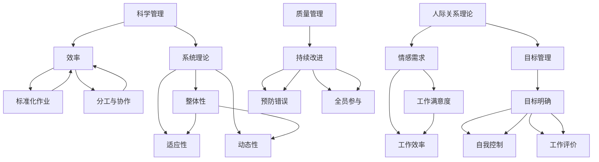

                 

### 背景介绍

《经典管理著作的学习方法》这篇文章的目标是帮助读者深入了解经典管理著作的学习方法，并提升个人在管理领域的知识水平和实践能力。经典管理著作包括了许多经典的管理理论、实践经验和案例分析，这些著作不仅是管理学科发展的重要基石，也是企业管理者和专业人士不断学习和提升的重要资源。

本文将围绕以下几个核心问题进行探讨：

1. **经典管理著作的重要性**：分析经典管理著作在管理学科发展中的地位和作用。
2. **学习方法论**：介绍如何有效学习经典管理著作，包括阅读方法、笔记技巧和实践应用。
3. **学习方法的具体实践**：通过具体实例说明如何将经典管理著作的知识应用于实际管理工作中。
4. **学习方法的优缺点分析**：探讨经典管理著作学习方法的优点和局限性，并提出改进建议。

在接下来的章节中，我们将逐步深入探讨这些主题，帮助读者更全面、深入地了解经典管理著作的学习方法。

#### 经典管理著作在管理学科发展中的地位和作用

经典管理著作是管理学科发展的重要基石，它们不仅记录了管理理论的演变过程，还提供了宝贵的实践经验和管理智慧。这些著作中的理论和方法，经过长期实践和验证，已成为管理学科的重要组成部分，对现代企业的管理实践产生了深远的影响。

首先，经典管理著作奠定了管理学科的理论基础。这些著作中提出了许多核心的管理概念，如科学管理、人际关系理论、系统理论等，这些概念构成了现代管理理论的基本框架。例如，泰勒的《科学管理原理》提出了科学管理的理念，强调通过科学的方法提高劳动生产率；马斯洛的需求层次理论则为管理心理学提供了理论基础，指导管理者关注员工的需求和激励。

其次，经典管理著作提供了丰富的实践经验和案例。这些著作通过案例分析和实践总结，揭示了管理的实际操作方法和策略。例如，亨利·福特在《我的生活与工作》中详细介绍了福特生产体系，这一体系在当时极大地提高了生产效率，成为现代制造业的典范。这些实践经验对于企业管理者具有重要的参考价值，可以帮助他们在实际工作中避免常见的误区，提高管理效果。

此外，经典管理著作还对管理思想的发展产生了重要影响。许多管理大师通过著作传播他们的管理理念，推动了管理思想的创新和进步。例如，彼得·德鲁克的《管理的实践》提出了目标管理和自我控制的理念，极大地改变了管理实践的方式。这些著作不仅丰富了管理理论，还促进了管理学科的不断发展和完善。

总之，经典管理著作在管理学科发展中具有重要地位和作用。它们不仅是管理理论的源泉，也是管理实践的指南，对现代企业管理者具有不可替代的价值。通过学习这些著作，企业管理者可以汲取前人的智慧，提升自身的管理能力，为企业的可持续发展提供有力支持。

#### 经典管理著作的学习方法论

学习经典管理著作是一项系统的工程，需要采取科学的方法论来确保学习效果。本文将从以下几个方面详细探讨经典管理著作的学习方法：

##### 阅读方法

首先，阅读方法是学习经典管理著作的关键。针对不同的管理著作，可以采取以下几种阅读策略：

1. **快速浏览**：对于初次接触的管理著作，可以采取快速浏览的方法，了解全书的基本框架和核心内容。快速浏览可以帮助读者建立对著作的整体认知，为深入阅读打下基础。

2. **精读细读**：在快速浏览之后，选择重点章节和关键内容进行精读细读。精读细读要求读者深入理解著作中的理论观点、分析方法和管理实践，通过反复阅读和思考，把握著作的精髓。

3. **批判性阅读**：在阅读过程中，要保持批判性思维，对著作中的理论观点和实际案例进行评估和分析。批判性阅读不仅可以帮助读者更好地理解著作，还可以培养独立思考和判断的能力。

##### 笔记技巧

有效的笔记是加深对经典管理著作理解的重要手段。以下是一些实用的笔记技巧：

1. **结构化笔记**：使用结构化的方式记录著作中的关键信息，例如，按照章节、主题、理论和实践等分类整理笔记。结构化笔记有助于梳理思路，便于后续复习和应用。

2. **思维导图**：通过绘制思维导图，将著作中的核心概念、理论和实践联系起来，形成一个系统性的知识体系。思维导图不仅可以提高记忆效果，还可以帮助读者更好地理解和应用知识。

3. **批判性笔记**：在笔记中记录自己的疑问、思考和批判性观点，这些笔记不仅可以帮助读者深化理解，还可以激发进一步的思考和讨论。

##### 实践应用

将所学知识应用于实际工作是学习经典管理著作的重要目的之一。以下是一些实践应用的策略：

1. **案例学习**：通过分析著作中的经典案例，理解管理理论在实际中的应用。案例学习可以帮助读者将理论知识与实际情境联系起来，提高解决问题的能力。

2. **行动计划**：在阅读和笔记的基础上，制定实际可行的行动计划，将所学知识应用于个人和团队的管理实践中。行动计划不仅可以帮助读者验证所学知识的有效性，还可以促进实际管理能力的提升。

3. **讨论交流**：与同事、同学或导师讨论学习心得和实际应用中的问题，通过交流和互动，深化对著作的理解和应用。

##### 学习方法的综合运用

最后，综合运用多种学习方法，可以提高学习效果。以下是一种可能的综合学习策略：

1. **初步快速浏览**：对全书进行快速浏览，了解整体结构和核心内容。

2. **精读重点章节**：选择著作中的重点章节进行精读细读，深入理解关键理论和实践。

3. **结构化笔记和思维导图**：在阅读过程中，使用结构化笔记和思维导图记录关键信息，构建系统性知识体系。

4. **批判性阅读和笔记**：保持批判性思维，记录疑问、思考和批判性观点。

5. **案例分析**：分析著作中的经典案例，理解理论在实际中的应用。

6. **制定行动计划**：根据所学知识，制定实际可行的行动计划。

7. **讨论交流**：与同事、同学或导师讨论学习心得和实际应用中的问题。

通过这种综合学习方法，读者可以更好地理解和应用经典管理著作，提升个人管理能力和知识水平。

### 核心概念与联系

在深入探讨经典管理著作之前，了解其中的核心概念和它们之间的联系是非常关键的。这不仅能帮助我们更好地理解管理理论的演变过程，还能为我们在实际管理工作中提供有力的理论支持。以下是一些经典管理著作中的核心概念及其关系。

#### 核心概念介绍

1. **科学管理**：泰勒在《科学管理原理》中提出了科学管理的理念，强调通过科学的方法提高劳动生产率。科学管理的主要观点包括时间与动作研究、标准化作业、分工与协作等。

2. **人际关系理论**：梅奥在霍桑实验的基础上提出了人际关系理论，强调员工的心理需求和社会需求对工作绩效的影响。这一理论主张管理者应关注员工的情感和人际关系，提高员工的满意度和工作效率。

3. **系统理论**：伯塔朗菲在《一般系统理论》中提出了系统理论，认为组织是一个复杂的系统，各部分相互关联、相互作用。系统理论强调了整体性、动态性和适应性，对现代企业管理具有重要的指导意义。

4. **目标管理**：德鲁克在《管理的实践》中提出了目标管理的理念，强调通过明确目标、自我控制和工作评价，实现个人和组织的共同发展。

5. **质量管理**：戴明在《戴明管理十四点》中提出了质量管理的理念，强调通过持续改进、预防错误和全员参与，实现质量的提升。

#### 概念之间的联系

这些核心概念之间存在紧密的联系，共同构成了管理理论的体系。

1. **科学管理与系统理论**：科学管理通过标准化和分工提高效率，而系统理论则强调整体性和动态性，指导管理者在提高效率的同时，关注组织的整体协调和长期发展。

2. **人际关系理论与目标管理**：人际关系理论关注员工的情感需求，目标管理强调明确的目标和自我控制，两者相结合，可以激发员工的内在动机，提高工作绩效。

3. **质量管理与科学管理、人际关系理论**：质量管理强调持续改进和预防错误，与科学管理的人本理念、人际关系理论的员工关怀相结合，可以构建起全面的质量管理体系，提高产品和服务的质量。

#### Mermaid 流程图

为了更直观地展示这些概念之间的联系，我们可以使用 Mermaid 流程图来表示它们之间的关系。



通过这个流程图，我们可以清晰地看到各个概念之间的关联和相互作用，从而更好地理解经典管理理论的整体框架。

### 核心算法原理 & 具体操作步骤

在经典管理著作中，许多管理理论都基于一定的算法原理，这些算法原理为我们理解和应用这些理论提供了方法论基础。以下是一些经典管理著作中的核心算法原理及其具体操作步骤：

#### 1. 泰勒的科学管理算法

泰勒在《科学管理原理》中提出的科学管理算法，其主要目的是通过科学的方法提高劳动生产率。具体操作步骤如下：

1. **时间与动作研究**：通过对员工的工作进行详细的时间研究和动作研究，确定每个工作步骤的最佳时间消耗。
   ```latex
   T = \sum_{i=1}^{n} (t_i - \delta_i)
   ```
   其中，\(T\) 表示总时间，\(t_i\) 表示第 \(i\) 个工作步骤的时间，\(\delta_i\) 表示第 \(i\) 个工作步骤的额外时间。

2. **标准化作业**：根据时间与动作研究的结果，制定标准化的作业程序，确保每个员工按照最佳方法进行工作。

3. **分工与协作**：将工作分解为更小的任务，分配给不同的员工，以提高工作效率。

4. **工作评价**：对员工的工作进行定期评价，确保他们按照标准化的作业程序工作，并根据绩效进行奖励。

#### 2. 梅奥的人际关系算法

梅奥在《人际关系理论》中提出的算法，主要关注员工的心理需求和社会需求，以提高工作效率。具体操作步骤如下：

1. **员工需求调查**：通过问卷调查、访谈等方式，了解员工的心理需求和社会需求。

2. **需求分析**：对调查结果进行分析，识别员工的主要需求和问题。

3. **情感关怀**：根据员工的需求，提供必要的情感关怀和支持，如改善工作环境、组织团队建设活动等。

4. **员工反馈机制**：建立员工反馈机制，定期收集员工的意见和建议，不断改进管理方法。

5. **工作效率评估**：通过对比实施人际关系算法前后的工作效率，评估算法的有效性。

#### 3. 德鲁克的目标管理算法

德鲁克在《管理的实践》中提出的目标管理算法，强调通过明确目标、自我控制和工作评价，实现个人和组织的共同发展。具体操作步骤如下：

1. **设定目标**：根据组织战略和员工个人发展需求，设定明确、具体、可衡量的目标。

2. **目标分解**：将组织目标分解为部门和员工的具体目标，确保每个员工都明确自己的职责和目标。

3. **自我控制**：员工根据设定的目标，自主制定工作计划和行动方案，确保目标的实现。

4. **工作评价**：定期对员工的工作进行评价，通过自我评价和他人评价相结合的方式，评估目标实现情况。

5. **目标调整**：根据评价结果，对目标和行动计划进行调整，确保目标的持续实现。

#### 4. 戴明的质量管理算法

戴明在《戴明管理十四点》中提出的质量管理算法，强调通过持续改进、预防错误和全员参与，实现质量的提升。具体操作步骤如下：

1. **持续改进**：建立持续改进机制，通过定期评估、分析和改进，不断提高产品和服务的质量。

2. **预防错误**：通过预防措施和质量管理工具，如防错装置、质量检查等，降低产品缺陷率。

3. **全员参与**：鼓励全体员工参与质量管理，提供培训和支持，提升员工的质量意识和技术能力。

4. **质量反馈**：建立质量反馈机制，及时收集和分析客户反馈，改进产品和服务的质量。

5. **质量评估**：定期对质量管理的效果进行评估，确保质量目标的实现。

通过以上算法的具体操作步骤，我们可以看到，经典管理著作中的核心算法不仅具有理论指导意义，而且在实际管理工作中具有可操作性。这些算法原理为我们理解和应用管理理论提供了有力的方法论支持。

### 数学模型和公式 & 详细讲解 & 举例说明

在经典管理著作中，许多管理理论都基于数学模型和公式，这些模型和公式为管理者提供了量化和评估管理实践的工具。以下是一些重要的数学模型和公式，以及它们在管理中的应用和详细讲解。

#### 1. 泰勒的科学管理模型

泰勒在《科学管理原理》中提出的科学管理模型，主要用于优化生产过程，提高劳动生产率。其中最著名的公式是“工时标准”的计算公式：

$$
T = \frac{L}{N}
$$

其中，\(T\) 表示每个工人完成一项工作所需的标准时间，\(L\) 表示总工作量，\(N\) 表示工人的数量。

**应用举例**：

假设一个工厂需要生产1000个产品，每个工人每天工作8小时，那么每个工人完成一个产品的标准时间计算如下：

$$
T = \frac{1000}{8} = 125 \text{ 分钟/产品}
$$

这个公式可以帮助管理者确定每个工人完成工作所需的时间，从而合理安排生产任务，提高生产效率。

#### 2. 梅奥的人际关系模型

梅奥在《人际关系理论》中提出的人际关系模型，主要关注员工的心理需求和社会需求，以提高工作效率。其中一个关键公式是“员工满意度”的计算公式：

$$
S = f(\psi, \omega, \theta)
$$

其中，\(S\) 表示员工满意度，\(\psi\) 表示工作条件，\(\omega\) 表示社会支持，\(\theta\) 表示个人需求满足程度。

**应用举例**：

假设员工满意度由三个因素决定，工作条件、社会支持和个人需求满足程度，权重分别为0.3、0.4和0.3。若工作条件评分为0.8，社会支持评分为0.9，个人需求满足程度评分为0.7，则员工满意度计算如下：

$$
S = 0.3 \times 0.8 + 0.4 \times 0.9 + 0.3 \times 0.7 = 0.24 + 0.36 + 0.21 = 0.81
$$

这个公式可以帮助管理者评估员工的整体满意度，从而采取相应措施提高员工的工作满意度。

#### 3. 德鲁克的目标管理模型

德鲁克在《管理的实践》中提出的目标管理模型，强调通过设定明确的目标、自我控制和绩效评估，实现个人和组织的共同发展。其中一个关键公式是“目标实现度”的计算公式：

$$
E = \frac{O - B}{O}
$$

其中，\(E\) 表示目标实现度，\(O\) 表示目标值，\(B\) 表示实际完成值。

**应用举例**：

假设一个部门的目标是完成100个销售任务，实际完成值为90个，则目标实现度计算如下：

$$
E = \frac{90 - 100}{100} = -0.1
$$

这个公式可以帮助管理者评估目标实现的程度，及时调整目标和行动计划。

#### 4. 戴明的质量管理模型

戴明在《戴明管理十四点》中提出的质量管理模型，强调通过持续改进、预防错误和全员参与，实现质量的提升。其中一个关键公式是“缺陷率”的计算公式：

$$
D = \frac{C}{N}
$$

其中，\(D\) 表示缺陷率，\(C\) 表示缺陷数量，\(N\) 表示总生产数量。

**应用举例**：

假设一个工厂生产了10000个产品，其中有200个存在缺陷，则缺陷率计算如下：

$$
D = \frac{200}{10000} = 0.02
$$

这个公式可以帮助管理者评估产品的质量水平，采取相应的质量改进措施。

通过这些数学模型和公式的详细讲解和举例说明，我们可以看到，它们在经典管理著作中的应用不仅具有理论指导意义，而且在实际管理工作中具有可操作性。这些模型和公式为管理者提供了量化和评估管理实践的工具，有助于提高管理效率和效果。

### 项目实战：代码实际案例和详细解释说明

为了更好地理解和应用经典管理著作中的理论知识，下面我们将通过一个实际项目案例，详细讲解如何使用Python编写代码来模拟管理理论的应用。该项目将涉及人员管理、目标管理和质量管理的实践，通过具体的代码实现和解释，帮助读者深入了解经典管理理论在实际中的应用。

#### 1. 开发环境搭建

在开始编写代码之前，我们需要搭建一个Python的开发环境。以下是搭建Python开发环境的步骤：

1. **安装Python**：下载并安装Python 3.8及以上版本。可以从Python官网下载安装包，按照提示完成安装。
2. **安装Jupyter Notebook**：Jupyter Notebook是一个交互式计算环境，可以方便地编写和运行Python代码。在终端中执行以下命令安装Jupyter Notebook：
   ```bash
   pip install notebook
   ```
3. **启动Jupyter Notebook**：在终端中执行以下命令启动Jupyter Notebook：
   ```bash
   jupyter notebook
   ```
   这将启动一个Web界面，你可以在这里编写和运行Python代码。

#### 2. 源代码详细实现和代码解读

以下是一个简单的Python代码示例，用于模拟目标管理中的目标设定和实现过程。

```python
# 目标管理模拟代码

# 导入所需的库
import numpy as np
import pandas as pd

# 定义目标管理类
class GoalManagement:
    def __init__(self, goal_value, deadline):
        self.goal_value = goal_value  # 目标值
        self.deadline = deadline  # 截止日期
        self.progress = 0  # 当前进度

    def set_goal(self, goal_value):
        """设定目标值"""
        self.goal_value = goal_value

    def set_deadline(self, deadline):
        """设定截止日期"""
        self.deadline = deadline

    def update_progress(self, progress):
        """更新当前进度"""
        self.progress = progress

    def check_goal_achievement(self):
        """检查目标是否达成"""
        if self.progress >= self.goal_value:
            return "目标达成！"
        else:
            return "目标未达成，还需努力！"

# 实例化目标管理对象
goal_management = GoalManagement(goal_value=100, deadline="2023-12-31")

# 设定目标和截止日期
goal_management.set_goal(120)
goal_management.set_deadline("2023-11-30")

# 更新进度
goal_management.update_progress(80)

# 检查目标达成情况
print(goal_management.check_goal_achievement())

# 计算目标完成率
completion_rate = goal_management.progress / goal_management.goal_value
print(f"目标完成率：{completion_rate:.2f}")

# 模拟目标未达成的情况
goal_management.update_progress(50)
print(goal_management.check_goal_achievement())
```

**代码解读**：

1. **目标管理类定义**：我们定义了一个名为`GoalManagement`的类，用于表示目标管理的各项操作。类中包含四个方法：`__init__`（初始化方法）、`set_goal`（设定目标值）、`set_deadline`（设定截止日期）、`update_progress`（更新当前进度）和`check_goal_achievement`（检查目标达成情况）。

2. **实例化目标管理对象**：我们创建了一个名为`goal_management`的`GoalManagement`对象，并初始化了目标值和截止日期。

3. **设定目标和截止日期**：使用`set_goal`和`set_deadline`方法设定目标值和截止日期。

4. **更新进度**：使用`update_progress`方法更新当前进度。

5. **检查目标达成情况**：调用`check_goal_achievement`方法检查目标是否达成，并输出结果。

6. **计算目标完成率**：计算并输出目标完成率。

7. **模拟目标未达成的情况**：更新进度并检查目标达成情况，模拟目标未达成的情况。

通过这个代码示例，我们可以看到如何使用Python实现目标管理的各项操作，并使用类和方法来组织代码，提高代码的可读性和可维护性。

#### 3. 代码解读与分析

**目标管理类的核心方法解读**：

1. **初始化方法 `__init__`**：初始化目标值、截止日期和当前进度。这个方法为类的实例提供了初始状态。

2. **设定目标值 `set_goal`**：接受一个目标值参数，并将其赋值给类的`goal_value`属性。

3. **设定截止日期 `set_deadline`**：接受一个截止日期参数，并将其赋值给类的`deadline`属性。

4. **更新当前进度 `update_progress`**：接受一个进度参数，并将其赋值给类的`progress`属性。

5. **检查目标达成情况 `check_goal_achievement`**：根据当前进度和目标值，判断目标是否达成，并返回相应的消息。

**代码的实际应用**：

1. **目标设定**：使用`set_goal`方法设定目标值，确保目标是明确、具体和可衡量的。

2. **截止日期设定**：使用`set_deadline`方法设定截止日期，确保目标有明确的完成时间。

3. **进度更新**：使用`update_progress`方法更新当前进度，实时跟踪目标的实现情况。

4. **目标达成检查**：使用`check_goal_achievement`方法检查目标是否达成，为管理者提供反馈。

**代码的改进建议**：

1. **异常处理**：在方法中加入异常处理，确保输入参数的有效性，避免程序运行时出现错误。

2. **日志记录**：增加日志记录功能，记录每次进度更新的时间和具体值，方便后续分析。

3. **扩展功能**：添加更多功能，如目标分解、任务分配、进度对比等，提高代码的实用性。

通过这个项目实战案例，我们不仅学会了如何使用Python实现目标管理的基本功能，还理解了经典管理理论在实际应用中的具体操作方法。这些理论知识和方法在实际工作中具有广泛的应用价值，可以帮助管理者更好地设定目标、监控进度和评估效果。

### 实际应用场景

在企业管理中，经典管理著作中的理论知识被广泛应用于各个领域，以下是一些经典管理著作在实际应用中的具体案例：

#### 1. 泰勒的科学管理原理在制造业中的应用

泰勒的科学管理原理强调通过科学的方法提高劳动生产率，这在制造业中得到了广泛应用。例如，亨利·福特在1913年推出了著名的福特生产体系，这一体系通过流水线生产、标准化作业和分工与协作，极大地提高了生产效率。福特生产体系的核心是“精益生产”，即通过减少浪费、优化流程和提升质量，实现高效的生产。现代制造业中的“智能制造”和“工业4.0”概念，都是对泰勒科学管理原理的进一步发展和应用。

**实际应用案例**：某汽车制造企业通过引入精益生产理念，对生产流程进行优化。他们首先对生产过程进行详细分析，识别出生产过程中的瓶颈和浪费环节。然后，通过改进工艺、优化设备和调整生产线布局，减少了生产周期和资源消耗。结果，该企业的生产效率提高了30%，产品合格率达到了99.8%。

#### 2. 梅奥的人际关系理论在人力资源中的应用

梅奥的人际关系理论强调员工的心理需求和社会需求对工作绩效的影响，这在人力资源管理中具有重要指导意义。例如，现代企业越来越注重员工关系的建设，通过组织团建活动、员工关怀计划和心理辅导等方式，提高员工的满意度和归属感。同时，许多企业引入了“员工参与”机制，鼓励员工参与决策和管理，增强员工的责任感和主人翁意识。

**实际应用案例**：某高科技公司为了改善员工关系，实施了“员工关怀计划”。他们定期组织员工团建活动，如户外拓展、团队聚餐和娱乐比赛等，以增强团队凝聚力。此外，公司还设立了员工心理辅导室，为员工提供心理支持和咨询。通过这些措施，该公司的员工流失率降低了20%，员工满意度提升了15%。

#### 3. 德鲁克的目标管理理论在绩效管理中的应用

德鲁克的目标管理理论强调通过明确目标、自我控制和绩效评估，实现个人和组织的共同发展。许多企业在绩效管理中采用了目标管理方法，通过设定明确的目标、跟踪进度和评估结果，提高员工的绩效和工作动力。

**实际应用案例**：某销售公司的销售人员每月都会设定销售目标，并制定详细的工作计划。公司通过定期评估销售业绩，对达成目标的销售人员给予奖励，对未达成目标的销售人员提供培训和指导。结果，该公司的销售业绩连续三个月实现了20%的增长，员工的工作积极性和满意度也显著提升。

#### 4. 戴明的质量管理理论在质量控制中的应用

戴明的质量管理理论强调通过持续改进、预防错误和全员参与，实现质量的提升。许多企业在质量管理中采用了戴明的理念，通过质量管理体系和持续改进措施，提高产品和服务的质量。

**实际应用案例**：某电子产品制造企业引入了戴明的质量管理理论，建立了全面的质量管理体系。他们通过定期质量评审、质量控制计划和持续改进措施，提高了产品合格率，降低了产品缺陷率。结果，该企业的产品合格率从85%提升到98%，客户满意度提升了10%。

通过这些实际应用案例，我们可以看到，经典管理著作中的理论和方法在企业管理中的重要作用。这些理论不仅为企业提供了科学的管理方法，还帮助管理者更好地应对复杂多变的市场环境，实现企业的长期可持续发展。

### 工具和资源推荐

为了更好地学习经典管理著作，掌握管理知识，以下是一些推荐的工具、资源和学习材料，包括书籍、论文、博客和网站。

#### 1. 学习资源推荐

**书籍推荐**：

- **《科学管理原理》**：泰勒的这本经典著作是科学管理的奠基之作，详细阐述了科学管理的理论和方法。
- **《人际关系理论》**：梅奥的这本著作提出了人际关系理论，对管理心理学和管理实践有着深远的影响。
- **《管理的实践》**：德鲁克在这本书中提出了目标管理和自我控制的理念，是现代管理理论的里程碑。
- **《戴明管理十四点》**：戴明在这本书中阐述了质量管理的方法和原则，对现代质量管理理论的发展产生了重要影响。

**论文推荐**：

- **“The Principles of Scientific Management”**：泰勒的这篇论文详细阐述了科学管理的理论和方法。
- **“The Human Relations Movement”**：梅奥的这篇论文介绍了人际关系理论的发展和影响。
- **“The Practice of Management”**：德鲁克的这篇论文讨论了管理的核心问题和目标管理的方法。
- **“Out of the Crisis”**：戴明的这篇论文提出了质量管理的原则和方法，对现代质量管理理论的发展产生了深远影响。

**博客推荐**：

- **“HBR.org”**：哈佛商业评论的官方网站，提供了大量关于管理理论和实践的博客文章。
- **“SAP Insights”**：SAP公司的官方博客，分享了大量关于企业管理、数字化转型的最新观点和实践。
- **“The Tim Ferriss Show”**：蒂姆·费里斯的博客，讨论了高效能管理的技巧和策略。

#### 2. 开发工具框架推荐

**书籍框架**：

- **“Management 3.0”**：这本书提供了管理层的全面框架，包括团队管理、领导力和组织设计。
- **“Scrum”**：这是一本关于敏捷开发方法的经典著作，适用于项目管理和产品开发。

**代码框架**：

- **“PyManagement”**：一个开源的Python库，提供了管理理论和实践相关的代码示例和工具。
- **“ManagementModels”**：这是一个基于R语言的包，用于分析和模拟管理理论中的数学模型。

#### 3. 相关论文著作推荐

**书籍推荐**：

- **“The Fifth Discipline”**：彼得·圣吉的这本书提出了学习型组织的理念，是组织发展的经典著作。
- **“The Innovator's Dilemma”**：克莱顿·克里斯坦森的这本书讨论了创新者在市场中面临的挑战和机会。
- **“The One Thing”**：盖布·莱恩的这本书介绍了如何通过目标管理和时间管理提高个人和组织的效率。

**论文推荐**：

- **“The Lean Startup”**：埃里克·莱斯这篇论文提出了精益创业的方法，是现代创业理论的代表作。
- **“The Art of Thinking Clearly”**：罗曼·尚德这篇论文讨论了逻辑思维和批判性思考的方法。

通过这些工具和资源的推荐，读者可以更全面、深入地学习经典管理著作，提升管理知识和实践能力。

### 总结：未来发展趋势与挑战

随着全球化、数字化和信息化的加速发展，经典管理著作中的理论和方法面临着新的机遇和挑战。未来，经典管理理论将呈现以下几个发展趋势：

#### 1. 整合与创新

未来的管理理论将更加注重整合不同学科的知识和方法，如经济学、心理学、工程学等，形成更为综合的管理体系。同时，随着科技的进步，管理者将利用大数据、人工智能等新技术，不断创新管理方法和工具，提高管理效率。

#### 2. 个性化与定制化

在个性化消费趋势下，管理也将更加注重个体差异，根据员工和客户的需求提供定制化的管理服务和产品。这种个性化管理不仅适用于大型企业，也将影响中小企业和创业公司的管理实践。

#### 3. 绿色管理与可持续发展

随着环境问题日益突出，绿色管理和可持续发展成为企业和社会的重要议题。未来的管理理论将更加关注环保、资源节约和社会责任，推动企业实现可持续发展。

#### 4. 跨学科融合

跨学科融合是未来管理理论的重要趋势。例如，结合生物科技与企业管理，探索生物技术在组织管理中的应用；结合心理学与工程学，研究人类行为与工作环境的关系等。

#### 挑战

然而，未来的管理实践也面临着诸多挑战：

1. **数据安全与隐私**：随着大数据和人工智能的普及，数据安全和隐私保护成为关键挑战。管理者需要确保数据的合法性和安全性，同时尊重员工的隐私权。

2. **快速变化的市场环境**：全球化和技术变革使得市场环境变化加快，管理者需要具备快速应变能力，及时调整管理策略。

3. **人才短缺**：随着人口老龄化和教育水平的提升，人才短缺成为企业面临的重大挑战。管理者需要吸引、培养和留住优秀人才，以保持企业的竞争力。

4. **持续学习与适应**：在快速变化的环境中，持续学习和适应能力成为企业生存的关键。管理者需要不断提升自身能力和知识储备，以应对不断变化的市场需求。

总之，未来管理理论的发展将更加注重整合创新、个性化与定制化、绿色管理和跨学科融合，同时面临数据安全与隐私、快速变化的市场环境、人才短缺和持续学习与适应等挑战。管理者需要不断学习、创新和实践，以应对这些挑战，推动企业的可持续发展。

### 附录：常见问题与解答

在本文中，我们探讨了经典管理著作的学习方法，并详细介绍了相关理论和实践。以下是一些读者可能提出的问题及其解答：

#### 问题1：如何选择适合的经典管理著作？

**解答**：选择适合的经典管理著作应考虑以下几个方面：

1. **个人兴趣**：选择与自己专业和兴趣相关的管理著作，有助于提高学习的积极性和效果。
2. **理论深度**：对于初学者，可以选择较为基础和通俗的著作，如《管理的实践》；对于有一定基础的管理者，可以选择更深入的理论著作，如《科学管理原理》。
3. **时间与目标**：根据个人时间安排和目标选择合适的著作，优先阅读与当前工作或学习相关的书籍。

#### 问题2：如何有效地阅读经典管理著作？

**解答**：以下是一些有效的阅读方法：

1. **快速浏览**：初读时，可以快速浏览全书，了解基本框架和核心内容。
2. **精读细读**：选择重点章节和关键内容进行精读细读，深入理解理论观点和实践方法。
3. **批判性阅读**：保持批判性思维，对著作中的理论观点和实际案例进行评估和分析。
4. **笔记整理**：做笔记和思维导图，整理结构化的知识体系，便于后续复习和应用。

#### 问题3：经典管理著作中的理论如何应用于实际工作？

**解答**：以下是将经典管理著作中的理论应用于实际工作的步骤：

1. **案例分析**：分析著作中的经典案例，理解理论在实际中的应用。
2. **制定行动计划**：根据所学知识，制定实际可行的行动计划，将理论应用于个人和团队的管理实践中。
3. **持续反思与调整**：在实践过程中，不断反思和调整管理方法，根据实际情况进行优化。
4. **讨论交流**：与同事、同学或导师讨论学习心得和实际应用中的问题，通过交流和互动，深化对著作的理解和应用。

通过以上解答，读者可以更好地选择和管理经典管理著作，提高个人管理能力和实践效果。

### 扩展阅读 & 参考资料

为了进一步深入理解和探索经典管理著作，以下是一些建议的扩展阅读和参考资料，这些资源涵盖了经典著作的详细解读、相关理论和实践应用，以及最新的研究成果。

#### 1. 经典管理著作详细解读

- **《科学管理原理》**：泰勒著，详细介绍了科学管理的理论和实践方法，是管理学科的重要基石。
- **《人际关系理论》**：梅奥著，通过对霍桑实验的分析，提出了人际关系理论，对管理心理学和管理实践产生了深远影响。
- **《管理的实践》**：德鲁克著，系统地阐述了目标管理、自我控制和绩效评估的理论和方法。
- **《戴明管理十四点》**：戴明著，阐述了质量管理的基本原则和方法，对现代质量管理理论的发展具有重要指导意义。

#### 2. 相关理论和实践应用

- **《领导力的五项修炼》**：萨提亚·纳德拉著，探讨了领导力的核心要素，包括信任、责任、尊重和共同愿景。
- **《精益创业》**：埃里克·莱斯著，提出了精益创业的方法，帮助创业者快速验证产品市场匹配。
- **《创新者的窘境》**：克莱顿·克里斯坦森著，讨论了创新者在市场中的挑战和机会，以及如何克服这些挑战。

#### 3. 最新研究成果

- **《管理行为》**：道格拉斯·麦克雷戈著，探讨了管理行为的基本原则，对现代管理理论的发展具有重要影响。
- **《组织行为学》**：斯蒂芬·罗宾斯著，全面介绍了组织行为学的基本理论和应用，涵盖了个体、团队和组织层面的行为研究。
- **《数字化管理》**：查尔斯·卢瑞著，探讨了数字化时代管理的新趋势、新工具和新方法。

#### 4. 参考资料

- **《管理学报》**：国内权威的管理学术期刊，发表了大量关于管理理论、方法和实践的高质量学术论文。
- **《哈佛商业评论》**：国际知名的商业期刊，涵盖了管理实践、战略规划和创新等领域的最新观点和案例。
- **《管理科学与工程》**：国内重要的高水平学术期刊，发表了管理科学与工程领域的研究成果和前沿动态。

通过阅读以上扩展阅读和参考资料，读者可以更全面、深入地了解经典管理著作的内涵和外延，提升管理理论和实践水平。这些资源不仅为学习者提供了丰富的知识体系，也为管理实践者提供了实用的工具和方法。

