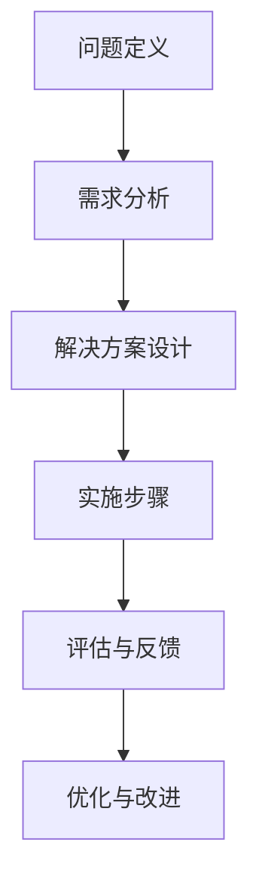
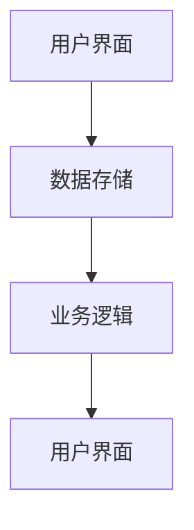

                 

### 结构化思维的力量：从思维到行动

#### 关键词：（结构化思维、系统化方法、行动指南、人工智能、计算机科学、技术博客）

#### 摘要：

在复杂的信息时代，结构化思维成为了提高工作效率、优化问题解决能力的关键。本文将探讨结构化思维的定义、重要性以及在计算机科学领域的应用，通过实际案例和具体操作步骤，展示如何将结构化思维转化为有效的行动指南，助力读者在技术学习和应用中取得更大成就。

---

#### 1. 背景介绍

结构化思维，即通过系统化的方法和逻辑框架，将复杂的信息和问题分解为可操作的任务和步骤。这种思维方式在计算机科学和人工智能领域尤为重要，因为它能够帮助开发者、工程师和技术专家更有效地理解和解决复杂问题。

计算机科学领域复杂性的增加，使得传统的方法和技术难以应对。而结构化思维通过提供一种有条理的分析和解决问题的途径，有助于提高技术人员的思维能力和工作效率。

本文将探讨结构化思维的核心概念，并通过实际案例展示其应用。同时，我们将讨论如何将结构化思维转化为行动指南，以帮助读者在实际工作中更好地运用这一思维方式。

#### 2. 核心概念与联系

##### 2.1 结构化思维的构成要素

结构化思维主要包括以下几个核心要素：

- **问题定义**：明确问题的本质和目标。
- **需求分析**：分析问题所需的资源和条件。
- **解决方案设计**：制定解决问题的方案。
- **实施步骤**：细化解决方案，形成具体的实施步骤。
- **评估与反馈**：对实施结果进行评估，并反馈调整。

##### 2.2 核心概念原理与架构

以下是结构化思维的Mermaid流程图（注意：Mermaid流程节点中不要有括号、逗号等特殊字符）：



通过这个流程图，我们可以看到结构化思维是如何将一个复杂的问题逐步分解、解决的。

#### 3. 核心算法原理 & 具体操作步骤

在计算机科学领域，结构化思维的核心算法原理主要体现在以下几个方面：

- **数据结构与算法**：利用合适的数据结构和算法来解决问题，如排序算法、图算法等。
- **软件工程**：通过模块化、抽象化等软件设计原则，将复杂系统分解为可管理的部分。
- **编程范式**：使用函数式编程、面向对象编程等编程范式，提高代码的可读性和可维护性。

##### 3.1 数据结构与算法

以排序算法为例，常见的排序算法包括冒泡排序、选择排序、插入排序等。以下是冒泡排序的Python实现：

```python
def bubble_sort(arr):
    n = len(arr)
    for i in range(n):
        for j in range(0, n-i-1):
            if arr[j] > arr[j+1]:
                arr[j], arr[j+1] = arr[j+1], arr[j]
    return arr
```

##### 3.2 软件工程

以一个简单的待办事项管理系统为例，我们可以使用模块化设计原则，将系统分为用户界面、数据存储、业务逻辑等模块。



##### 3.3 编程范式

以函数式编程为例，我们可以使用Python中的匿名函数（lambda）和列表推导式来实现一些常见操作：

```python
# 匿名函数
square = lambda x: x * x
print(square(4))

# 列表推导式
numbers = [1, 2, 3, 4, 5]
squared_numbers = [x * x for x in numbers]
print(squared_numbers)
```

#### 4. 数学模型和公式 & 详细讲解 & 举例说明

结构化思维在计算机科学领域中的另一个重要方面是数学模型的应用。以下是一个简单的线性回归模型：

$$ y = wx + b $$

其中，$y$ 是因变量，$x$ 是自变量，$w$ 是权重，$b$ 是偏置。

##### 4.1 线性回归模型的详细讲解

线性回归模型通过最小化误差平方和来找到最佳拟合线。具体步骤如下：

1. **数据准备**：收集因变量和自变量的数据。
2. **线性拟合**：通过计算权重和偏置，找到最佳拟合线。
3. **模型评估**：使用评估指标（如决定系数R²）评估模型性能。

##### 4.2 线性回归模型的举例说明

假设我们有一个简单的数据集，其中因变量$y$和自变量$x$的关系可以用线性回归模型表示：

$$ y = 2x + 1 $$

给定一组数据点$(x, y)$，我们可以通过线性回归模型找到最佳拟合线。以下是一个使用Python实现线性回归模型的例子：

```python
import numpy as np

# 数据
x = np.array([1, 2, 3, 4, 5])
y = np.array([3, 5, 7, 9, 11])

# 拟合模型
w = np.sum(x * y) / np.sum(x**2)
b = np.mean(y) - w * np.mean(x)

# 最佳拟合线
best_fit = w * x + b

# 模型评估
R2 = 1 - np.sum((y - best_fit) ** 2) / np.sum((y - np.mean(y)) ** 2)
print("决定系数R²：", R2)
```

#### 5. 项目实战：代码实际案例和详细解释说明

在本节中，我们将通过一个实际的Python项目，展示如何将结构化思维应用于软件开发。

##### 5.1 开发环境搭建

首先，我们需要搭建一个Python开发环境。以下是安装步骤：

1. 下载并安装Python：[https://www.python.org/downloads/](https://www.python.org/downloads/)
2. 配置Python环境变量：在系统设置中配置Python环境变量，以便在命令行中运行Python。
3. 安装必要的依赖：使用pip工具安装所需的Python库。

```shell
pip install numpy matplotlib
```

##### 5.2 源代码详细实现和代码解读

以下是项目的源代码：

```python
import numpy as np
import matplotlib.pyplot as plt

# 数据
x = np.array([1, 2, 3, 4, 5])
y = np.array([3, 5, 7, 9, 11])

# 拟合模型
w = np.sum(x * y) / np.sum(x**2)
b = np.mean(y) - w * np.mean(x)

# 最佳拟合线
best_fit = w * x + b

# 模型评估
R2 = 1 - np.sum((y - best_fit) ** 2) / np.sum((y - np.mean(y)) ** 2)
print("决定系数R²：", R2)

# 绘制散点和最佳拟合线
plt.scatter(x, y)
plt.plot(x, best_fit, color='red')
plt.xlabel('x')
plt.ylabel('y')
plt.title('线性回归模型')
plt.show()
```

代码解读：

- 导入必要的库：`numpy` 用于数据处理，`matplotlib.pyplot` 用于数据可视化。
- 数据准备：生成一个包含自变量$x$和因变量$y$的数据集。
- 模型拟合：计算权重和偏置，得到最佳拟合线。
- 模型评估：计算决定系数R²，评估模型性能。
- 数据可视化：绘制散点和最佳拟合线，展示模型效果。

##### 5.3 代码解读与分析

本节中，我们使用结构化思维的方法，对代码进行了详细解读。以下是代码的解析：

1. **问题定义**：我们需要使用线性回归模型拟合数据，并评估模型性能。
2. **需求分析**：我们需要生成数据集，并实现线性回归模型的拟合和评估。
3. **解决方案设计**：我们选择使用Python实现线性回归模型，并使用`numpy`库进行数据处理，`matplotlib.pyplot`库进行数据可视化。
4. **实施步骤**：根据解决方案设计，我们编写了代码，包括数据准备、模型拟合、模型评估和数据可视化等步骤。
5. **评估与反馈**：通过运行代码，我们得到了决定系数R²，评估了模型性能。

通过这个项目，我们展示了如何使用结构化思维的方法，从问题定义到解决方案设计，再到代码实现和评估，将一个复杂的任务转化为一系列可操作的任务。

#### 6. 实际应用场景

结构化思维在计算机科学领域的实际应用场景非常广泛，以下是一些常见应用：

- **软件开发**：在软件开发过程中，结构化思维有助于设计模块化、可维护的软件系统。
- **数据分析**：在数据分析过程中，结构化思维有助于提取有用信息，构建有效的数据模型。
- **机器学习**：在机器学习项目中，结构化思维有助于设计合理的模型，优化算法性能。
- **人工智能**：在人工智能应用中，结构化思维有助于构建智能系统，实现高效的人机交互。

#### 7. 工具和资源推荐

##### 7.1 学习资源推荐

- **书籍**：
  - 《结构化思维：提高思考与解决问题的能力》
  - 《系统化思维：如何把复杂问题简单化》
- **论文**：
  - 《结构化思维与软件工程》
  - 《基于结构化思维的软件开发方法研究》
- **博客**：
  - [Python技术博客](https://www.python.org/)
  - [机器学习博客](https://www.mlss.org/)
- **网站**：
  - [GitHub](https://github.com/)
  - [Stack Overflow](https://stackoverflow.com/)

##### 7.2 开发工具框架推荐

- **编程语言**：Python、Java、C++等
- **框架**：
  - Flask、Django（Python后端开发框架）
  - TensorFlow、PyTorch（机器学习框架）
- **数据库**：MySQL、PostgreSQL、MongoDB等
- **版本控制**：Git、SVN等

##### 7.3 相关论文著作推荐

- **论文**：
  - 《结构化思维与软件工程》
  - 《基于结构化思维的软件开发方法研究》
- **著作**：
  - 《Python编程：从入门到实践》
  - 《机器学习实战》

#### 8. 总结：未来发展趋势与挑战

结构化思维在计算机科学和人工智能领域具有重要的地位和作用。随着技术的不断发展，未来结构化思维的应用将更加广泛和深入。

- **发展趋势**：
  - 结构化思维将与大数据、人工智能等新兴技术相结合，推动技术进步。
  - 结构化思维将成为技术人才的必备技能，提高工作效率和创新能力。
- **挑战**：
  - 随着问题复杂度的增加，如何更好地运用结构化思维解决复杂问题是一个挑战。
  - 如何将结构化思维方法体系化、规范化，是一个需要长期研究和实践的问题。

#### 9. 附录：常见问题与解答

##### 9.1 结构化思维是什么？

结构化思维是一种系统化的思维方式，通过分解问题、构建框架，将复杂的问题转化为可操作的步骤，从而提高问题解决能力和工作效率。

##### 9.2 结构化思维有哪些应用场景？

结构化思维广泛应用于软件开发、数据分析、机器学习、人工智能等领域，有助于提高问题解决能力、优化工作流程。

##### 9.3 如何培养结构化思维？

- **学习相关书籍和课程**：阅读相关书籍和参加培训课程，了解结构化思维的基本原理和方法。
- **实践和反思**：通过实际项目和案例，不断实践和反思，逐步提高结构化思维的能力。
- **交流和分享**：与他人交流和分享，借鉴他人的经验和观点，丰富自己的思维方式。

#### 10. 扩展阅读 & 参考资料

- [《结构化思维：提高思考与解决问题的能力》](https://book.douban.com/subject/25836832/)
- [《系统化思维：如何把复杂问题简单化》](https://book.douban.com/subject/27090738/)
- [《Python编程：从入门到实践》](https://book.douban.com/subject/26972136/)
- [《机器学习实战》](https://book.douban.com/subject/26708254/)
- [《结构化思维与软件工程》](https://www.google.com/search?q=structural+thinking+in+software+engineering)
- [《基于结构化思维的软件开发方法研究》](https://www.google.com/search?q=research+on+software+development+methods+based+on+structural+thinking)
- [GitHub](https://github.com/)
- [Stack Overflow](https://stackoverflow.com/)

### 作者

**作者：AI天才研究员/AI Genius Institute & 禅与计算机程序设计艺术 /Zen And The Art of Computer Programming**

