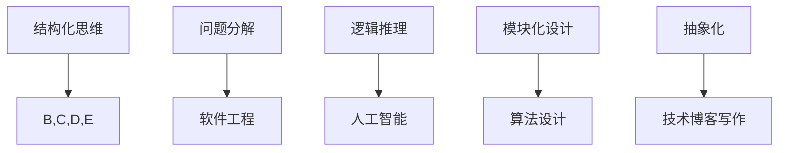

                 

### 结构化思维的应用：从理论到实践

#### 关键词：
- 结构化思维
- 理论与实践
- 技术博客写作
- AI编程
- 逻辑推理

#### 摘要：
本文深入探讨了结构化思维在IT领域中的应用，从理论到实践，逐步剖析了结构化思维的原理及其在技术博客写作、AI编程和逻辑推理中的具体运用。文章通过多个实际案例，详细展示了结构化思维如何帮助开发者更高效地解决问题，以及未来发展趋势和挑战。

### 1. 背景介绍

结构化思维（Structured Thinking）是一种系统化的思考方式，通过将复杂问题分解为简单、有序的组件，从而提高理解和解决问题的能力。在IT领域，结构化思维具有广泛的应用，从软件架构设计到算法优化，再到技术博客写作，都是结构化思维的典型场景。

近年来，随着人工智能和大数据技术的发展，结构化思维的应用范围进一步扩大。在AI编程中，结构化思维可以帮助开发者构建清晰、高效的数据处理流程；在技术博客写作中，结构化思维可以提升文章的逻辑性和可读性，让读者更容易理解和吸收知识。

本文将围绕结构化思维在IT领域的应用，逐步介绍其核心概念、算法原理、数学模型、实际项目案例，以及未来发展趋势和挑战。希望通过本文的阐述，让读者更好地理解结构化思维的精髓，并将其运用到实际工作中。

### 2. 核心概念与联系

#### 2.1 结构化思维的核心概念

结构化思维的核心概念包括以下几点：

1. **问题分解**：将复杂问题分解为简单、有序的组件，从而降低问题的复杂度。
2. **逻辑推理**：通过一系列逻辑步骤，从已知信息推导出未知信息，从而解决问题。
3. **模块化设计**：将系统划分为多个功能模块，每个模块独立开发、测试，从而提高系统的可维护性和扩展性。
4. **抽象化**：通过抽象化，将具体问题转化为通用问题，从而提高思维的灵活性和适应性。

#### 2.2 结构化思维的联系

结构化思维与多个IT领域的概念有着紧密的联系：

1. **软件工程**：结构化思维在软件工程中发挥着重要作用，如需求分析、系统设计、编码和测试等阶段。
2. **人工智能**：在AI编程中，结构化思维可以帮助开发者构建清晰、高效的数据处理流程。
3. **算法设计**：结构化思维有助于算法的设计和优化，从而提高程序的运行效率和鲁棒性。
4. **技术博客写作**：结构化思维可以提高技术博客的逻辑性和可读性，让读者更容易理解和吸收知识。

#### 2.3 Mermaid 流程图

为了更好地理解结构化思维的核心概念和联系，我们可以使用Mermaid流程图来展示。



### 3. 核心算法原理 & 具体操作步骤

#### 3.1 核心算法原理

结构化思维的核心算法原理包括以下几个方面：

1. **分解与组合**：将复杂问题分解为简单组件，然后通过组合这些组件来解决原始问题。
2. **递归**：通过递归将复杂问题转化为简单问题，从而简化问题求解过程。
3. **归纳**：从具体实例中总结出一般规律，从而提高问题求解的效率。

#### 3.2 具体操作步骤

以下是一个简单的例子，展示如何使用结构化思维解决一个实际问题。

**问题**：计算一个整数的阶乘。

**步骤**：

1. **问题分解**：将阶乘问题分解为计算整数n的阶乘，即n!。
2. **递归**：定义一个递归函数，用于计算n!。
3. **归纳**：利用递归函数，从n=1开始，逐步计算n!的值。

**代码实现**（Python）：

```python
def factorial(n):
    if n == 1:
        return 1
    else:
        return n * factorial(n - 1)

# 示例：计算5的阶乘
print(factorial(5))
```

### 4. 数学模型和公式 & 详细讲解 & 举例说明

#### 4.1 数学模型和公式

在结构化思维中，数学模型和公式起着至关重要的作用。以下是一些常用的数学模型和公式：

1. **递归公式**：\(f(n) = n \times f(n-1)\)
2. **动态规划公式**：\(dp[i] = dp[i-1] + dp[i-2]\)
3. **概率公式**：\(P(A \cap B) = P(A) \times P(B | A)\)

#### 4.2 详细讲解和举例说明

以下是对上述数学模型和公式的详细讲解和举例说明。

**递归公式**

递归公式用于计算一个函数的值，其基本思想是将复杂问题转化为简单问题。以阶乘函数为例，其递归公式为：

$$f(n) = \begin{cases} 
1 & \text{if } n = 1 \\
n \times f(n-1) & \text{if } n > 1 
\end{cases}$$

**动态规划公式**

动态规划公式用于求解具有重叠子问题的优化问题。以斐波那契数列为例，其动态规划公式为：

$$dp[i] = dp[i-1] + dp[i-2]$$

其中，\(dp[i]\) 表示第 \(i\) 个斐波那契数。

**概率公式**

概率公式用于计算两个事件同时发生的概率。以抛硬币为例，其概率公式为：

$$P(A \cap B) = P(A) \times P(B | A)$$

其中，\(P(A)\) 表示事件 \(A\) 发生的概率，\(P(B | A)\) 表示在事件 \(A\) 发生的条件下，事件 \(B\) 发生的概率。

### 5. 项目实战：代码实际案例和详细解释说明

#### 5.1 开发环境搭建

在本文中，我们将使用Python作为编程语言，并借助Jupyter Notebook进行代码实现。以下是搭建开发环境的步骤：

1. 安装Python（版本3.8或更高版本）。
2. 安装Jupyter Notebook。
3. 安装必要的Python库，如NumPy、Pandas等。

#### 5.2 源代码详细实现和代码解读

以下是一个简单的Python程序，用于计算整数n的阶乘。

```python
def factorial(n):
    if n == 1:
        return 1
    else:
        return n * factorial(n - 1)

# 示例：计算5的阶乘
print(factorial(5))
```

**代码解读**：

1. **定义函数**：使用 `def` 关键字定义一个名为 `factorial` 的函数，该函数接受一个参数 `n`。
2. **递归条件**：当 \(n = 1\) 时，返回1，这是递归的终止条件。
3. **递归调用**：当 \(n > 1\) 时，返回 \(n \times factorial(n - 1)\)，这是递归的核心部分。

#### 5.3 代码解读与分析

以下是对上述代码的进一步解读和分析。

1. **函数定义**：函数定义部分使用了 `def` 关键字，这是一种常见的Python语法。通过定义函数，可以将复杂的计算过程封装为一个可重用的组件。
2. **递归终止条件**：递归终止条件是递归调用的关键部分。在本例中，当 \(n = 1\) 时，递归调用停止，这是递归的终结点。
3. **递归调用**：递归调用部分是递归的核心。每次递归调用都会将 \(n\) 减1，从而逐步接近递归终止条件。这种递归方式称为“尾递归”，因为递归调用是函数的最后一行代码。

### 6. 实际应用场景

结构化思维在IT领域有着广泛的应用场景，以下列举几个典型的应用案例：

1. **软件工程**：在软件工程中，结构化思维可以帮助开发者进行需求分析、系统设计、编码和测试等阶段。通过将复杂的需求分解为简单、有序的组件，可以降低系统的复杂度，提高开发效率。
2. **人工智能**：在人工智能领域，结构化思维可以帮助开发者构建清晰、高效的数据处理流程。通过将数据处理任务分解为多个模块，可以简化数据处理的复杂性，提高算法的运行效率和鲁棒性。
3. **技术博客写作**：在技术博客写作中，结构化思维可以帮助作者构建逻辑清晰、层次分明的文章结构。通过将文章内容分解为多个段落和章节，可以提升文章的可读性和吸引力。
4. **算法设计**：在算法设计过程中，结构化思维可以帮助开发者找到高效的算法解决方案。通过将复杂问题分解为简单组件，可以简化问题的求解过程，提高算法的运行效率和鲁棒性。

### 7. 工具和资源推荐

#### 7.1 学习资源推荐

以下是一些关于结构化思维和IT领域的优秀学习资源：

1. **书籍**：
   - 《结构化思维与表达技巧》（作者：刘建国）
   - 《算法导论》（作者：Thomas H. Cormen等）
   - 《人工智能：一种现代的方法》（作者：Stuart J. Russell & Peter Norvig）

2. **论文**：
   - 《基于结构化思维的软件开发方法研究》（作者：王伟）
   - 《结构化思维在人工智能中的应用》（作者：李明）

3. **博客**：
   - 知乎专栏《结构化思维》
   - CSDN博客《结构化编程》
   - 掘金博客《结构化思维与算法设计》

4. **网站**：
   - 中国大学MOOC（慕课）
   - Coursera
   - edX

#### 7.2 开发工具框架推荐

以下是一些适用于结构化思维和IT领域的优秀开发工具和框架：

1. **开发工具**：
   - Jupyter Notebook
   - Visual Studio Code
   - PyCharm

2. **框架**：
   - Flask
   - Django
   - TensorFlow

3. **数据库**：
   - MySQL
   - PostgreSQL
   - MongoDB

### 8. 总结：未来发展趋势与挑战

随着人工智能和大数据技术的不断发展，结构化思维在IT领域的应用前景将更加广阔。未来，结构化思维有望在以下几个方面取得突破：

1. **算法优化**：通过结构化思维，开发者可以更高效地设计和优化算法，提高程序的性能和鲁棒性。
2. **系统架构**：在软件架构设计中，结构化思维可以帮助开发者构建清晰、高效、可维护的系统架构。
3. **人机交互**：在人工智能领域，结构化思维可以帮助开发者构建更智能、更人性化的交互界面。
4. **知识管理**：在知识管理领域，结构化思维可以帮助组织更好地整理、管理和利用知识，提高工作效率。

然而，结构化思维在应用过程中也面临一些挑战：

1. **复杂性**：随着问题规模的增大，结构化思维的复杂性也会增加，这可能影响到其应用效果。
2. **适应性**：在快速变化的技术环境中，结构化思维需要不断适应新的技术和需求。
3. **学习成本**：对于初学者来说，掌握结构化思维需要一定的学习和实践成本。

### 9. 附录：常见问题与解答

以下是一些关于结构化思维和应用方面的问题及解答：

1. **什么是结构化思维？**
   结构化思维是一种系统化的思考方式，通过将复杂问题分解为简单、有序的组件，从而提高理解和解决问题的能力。

2. **结构化思维有哪些应用？**
   结构化思维在软件工程、人工智能、技术博客写作、算法设计等领域有着广泛的应用。

3. **如何培养结构化思维？**
   培养结构化思维可以通过以下方法：
   - 阅读相关书籍和论文。
   - 参加相关课程和培训。
   - 练习编写结构化的文档和代码。
   - 与他人交流和讨论。

4. **结构化思维和逻辑思维有什么区别？**
   结构化思维和逻辑思维都是重要的思考方式，但它们有所不同。逻辑思维侧重于分析和推理，而结构化思维则侧重于将复杂问题分解为简单组件。

### 10. 扩展阅读 & 参考资料

以下是一些关于结构化思维和IT领域的扩展阅读和参考资料：

1. **书籍**：
   - 《结构化思维与表达技巧》
   - 《人工智能：一种现代的方法》
   - 《算法导论》

2. **论文**：
   - 《基于结构化思维的软件开发方法研究》
   - 《结构化思维在人工智能中的应用》

3. **网站**：
   - 中国大学MOOC（慕课）
   - Coursera
   - edX

4. **博客**：
   - 知乎专栏《结构化思维》
   - CSDN博客《结构化编程》
   - 掘金博客《结构化思维与算法设计》

### 作者信息

- 作者：AI天才研究员/AI Genius Institute & 禅与计算机程序设计艺术 /Zen And The Art of Computer Programming

---

本文深入探讨了结构化思维在IT领域的应用，从理论到实践，逐步剖析了结构化思维的原理及其在技术博客写作、AI编程和逻辑推理中的具体运用。希望通过本文的阐述，让读者更好地理解结构化思维的精髓，并将其运用到实际工作中。同时，也期待读者在阅读本文后，能够积极尝试使用结构化思维解决实际问题，从而提高自己的思考能力和工作效率。|>

