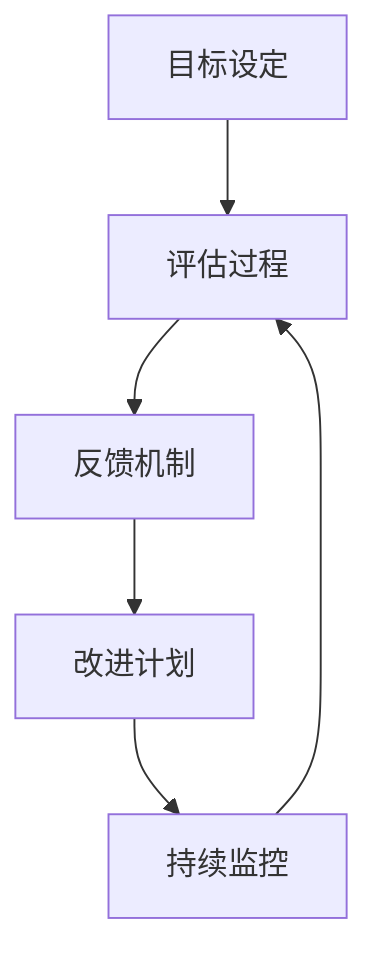

                 

# {文章标题}

## 绩效反馈：建立积极的反馈机制

> {关键词：绩效反馈，积极反馈，机制，团队协作，个人发展}

> {摘要：本文将深入探讨绩效反馈的重要性，通过建立积极的反馈机制，如何提升团队协作和个人发展。我们将从多个角度分析绩效反馈的原理，分享实践中的有效方法，并提供实用的工具和资源。文章旨在为IT领域的专业人士提供指导，帮助他们更好地运用绩效反馈机制，实现团队和个人目标。}

## 1. 背景介绍

在当今快速发展的IT行业，高效的工作和团队协作是确保项目成功的关键。然而，如何激发团队成员的潜力，提升个人和团队的整体绩效，成为了企业管理者面临的重大挑战。绩效反馈作为一种有效的管理工具，可以帮助企业了解员工的实际表现，识别优势和不足，进而采取针对性的改进措施。

绩效反馈不仅对个人成长至关重要，也对团队和组织的发展有着深远的影响。通过积极的反馈，员工可以获得及时的反馈信息，了解自己的工作表现，明确改进的方向。而团队和组织则可以通过绩效反馈，优化工作流程，提升整体效率，实现目标。

本文将从以下几个方面展开讨论：首先，介绍绩效反馈的核心概念和联系；其次，分析核心算法原理和具体操作步骤；然后，探讨数学模型和公式，以及实际应用场景；接着，推荐相关工具和资源；最后，总结未来发展趋势与挑战，并回答常见问题。希望通过本文的讨论，为IT领域的专业人士提供有益的启示和指导。

### 1.1 绩效反馈的定义与作用

绩效反馈是指对员工在工作中的表现进行评估和反馈的过程。它不仅包括对员工工作成果的衡量，还包括对其工作态度、团队协作能力、问题解决能力等多方面的评价。绩效反馈的目的在于帮助员工了解自己的工作表现，识别自身优势和不足，从而制定个人发展计划，提升工作能力和绩效。

绩效反馈在团队和组织中的作用不可忽视。首先，它有助于激励员工，提升工作积极性。通过积极的绩效反馈，员工能够感受到被重视和认可，从而激发出更大的工作热情和创造力。其次，绩效反馈有助于团队协作。通过反馈，团队成员可以了解彼此的优势和不足，从而更好地协作，共同实现项目目标。最后，绩效反馈有助于组织发展。通过分析员工的绩效反馈，组织可以识别出存在的问题和瓶颈，优化管理策略和工作流程，提升整体绩效。

### 1.2 绩效反馈的重要性

绩效反馈在个人和团队发展中具有重要作用。首先，对于个人来说，绩效反馈是成长的重要推动力。通过反馈，员工可以清楚地了解自己在工作中的表现，认识到自己的优势和不足，从而有针对性地进行改进。此外，绩效反馈还可以帮助员工建立自信心，激发内在动力，实现自我超越。

其次，绩效反馈对团队协作具有积极影响。通过绩效反馈，团队成员可以更好地了解彼此的工作状态和需求，从而在协作中更加高效。同时，绩效反馈可以促进团队成员之间的沟通，增强团队凝聚力，提升团队整体绩效。

最后，绩效反馈对组织发展具有重要意义。通过绩效反馈，组织可以及时发现和解决问题，优化管理策略和工作流程，提升整体运营效率。此外，绩效反馈还可以帮助企业吸引和留住优秀人才，提升组织竞争力。

### 1.3 文章结构概述

本文将分为以下几个部分进行讨论：

1. **核心概念与联系**：介绍绩效反馈的核心概念和架构，使用Mermaid流程图展示相关流程和节点。
2. **核心算法原理 & 具体操作步骤**：分析绩效反馈的核心算法原理，详细讲解操作步骤。
3. **数学模型和公式 & 详细讲解 & 举例说明**：探讨绩效反馈中的数学模型和公式，并结合实际案例进行说明。
4. **项目实战：代码实际案例和详细解释说明**：提供具体代码实现案例，分析其原理和优势。
5. **实际应用场景**：讨论绩效反馈在不同场景下的应用，分析其效果和影响。
6. **工具和资源推荐**：推荐相关工具和资源，帮助读者深入学习和实践。
7. **总结：未来发展趋势与挑战**：总结绩效反馈的未来发展趋势和面临的挑战。
8. **附录：常见问题与解答**：回答读者可能关心的问题。

通过本文的讨论，希望能够为读者提供有益的启示和指导，帮助他们在实际工作中更好地运用绩效反馈机制，提升个人和团队绩效。

<|imagine|>## 2. 核心概念与联系

### 2.1 绩效反馈的基本概念

绩效反馈的核心概念包括绩效评估、反馈机制、评估标准和反馈方式。绩效评估是对员工在工作中的表现进行量化或定性分析的过程。评估标准则是根据工作目标和岗位要求设定的衡量指标，用于评估员工的工作成果和表现。反馈机制则是指将评估结果传达给员工，并提供改进建议的流程和方法。反馈方式可以是口头反馈、书面反馈、绩效报告或面谈等。

### 2.2 绩效反馈与团队协作的关系

绩效反馈在团队协作中发挥着重要作用。一方面，通过绩效反馈，团队成员可以了解自己在团队中的角色和贡献，明确自己的工作目标和方向。另一方面，绩效反馈可以促进团队成员之间的沟通和协作，提升团队整体绩效。有效的绩效反馈机制可以帮助团队建立信任，增强凝聚力，激发团队成员的积极性和创造力。

### 2.3 绩效反馈的架构

绩效反馈的架构通常包括以下几个关键节点：

1. **目标设定**：根据组织战略和项目需求，为员工设定具体的工作目标和绩效指标。
2. **评估过程**：对员工的工作进行定期或不定期的评估，收集相关数据和信息。
3. **反馈机制**：将评估结果及时传达给员工，并提供具体的改进建议。
4. **改进计划**：员工根据反馈制定个人发展计划，提升自身能力。
5. **持续监控**：对员工绩效进行持续跟踪和评估，确保改进措施的有效实施。

以下是一个简化的绩效反馈流程图，使用Mermaid语法绘制：



### 2.4 绩效反馈的原则

为了确保绩效反馈的有效性，我们需要遵循以下几个原则：

1. **及时性**：及时反馈员工的工作表现，帮助他们及时纠正问题。
2. **针对性**：根据员工的实际表现，提供具体的改进建议，避免泛泛而谈。
3. **客观性**：以事实和数据为依据，确保反馈的公正性和客观性。
4. **鼓励性**：注重表扬和肯定，激发员工的积极性和自信心。
5. **开放性**：鼓励员工提出意见和建议，促进双向沟通。

### 2.5 绩效反馈的挑战

尽管绩效反馈具有重要作用，但在实际应用中仍面临一些挑战：

1. **主观性**：绩效评估过程中可能存在主观判断和偏见，影响反馈的公正性。
2. **反馈滞后**：反馈机制不完善可能导致反馈滞后，影响员工改进的效果。
3. **员工抵触**：部分员工可能对反馈持抵触态度，影响反馈的接受和实施。
4. **反馈质量**：低质量的反馈可能无法有效帮助员工改进，甚至产生负面影响。

针对这些挑战，企业需要不断完善绩效反馈机制，提高反馈质量和效果。例如，可以引入第三方评估，建立反馈反馈机制，确保反馈的公正性和客观性。同时，加强对员工的沟通和培训，提高他们对绩效反馈的接受度和主动性。

<|imagine|>### 3. 核心算法原理 & 具体操作步骤

#### 3.1 绩效评估指标

绩效评估指标是绩效反馈的核心，它决定了反馈的科学性和有效性。常见的绩效评估指标包括：

1. **关键绩效指标（KPI）**：用于衡量员工工作成果的具体指标，如销售额、项目进度等。
2. **行为指标**：衡量员工在工作中的行为表现，如团队合作、沟通能力、解决问题的能力等。
3. **技能指标**：衡量员工的技能水平和专业知识，如编程能力、项目管理能力等。
4. **质量指标**：衡量员工工作成果的质量，如代码质量、客户满意度等。

为了确保评估指标的全面性和准确性，企业通常采用360度评估方法，即由上级、同事、下属和客户等多方对员工进行评估。

#### 3.2 数据收集方法

数据收集是绩效评估的重要环节，以下是一些常见的数据收集方法：

1. **自我评估**：员工根据自身的工作表现进行自我评估，提供自我反馈。
2. **上级评估**：上级领导根据员工的工作表现进行评估，提供客观反馈。
3. **同事反馈**：同事对员工的工作表现进行评估，提供多元视角。
4. **客户反馈**：客户对员工的服务质量和工作成果进行评估，提供外部视角。

#### 3.3 数据分析算法

在收集到大量数据后，需要进行数据分析，以得出绩效评估结果。以下是一些常用的数据分析算法：

1. **统计分析**：使用均值、中位数、标准差等统计方法对数据进行处理和分析。
2. **相关性分析**：分析不同绩效指标之间的相关性，识别关键影响因素。
3. **回归分析**：通过建立回归模型，预测员工绩效与工作表现之间的关系。
4. **机器学习**：利用机器学习算法，如决策树、神经网络等，对绩效数据进行分类和预测。

#### 3.4 绩效评估流程

绩效评估通常包括以下几个步骤：

1. **目标设定**：与员工共同制定工作目标和绩效指标。
2. **数据收集**：通过多种渠道收集员工的工作数据。
3. **数据分析**：对收集到的数据进行处理和分析。
4. **评估结果反馈**：将分析结果反馈给员工，并提供具体的改进建议。
5. **改进计划**：员工根据反馈制定个人发展计划，提升自身能力。
6. **持续监控**：对员工绩效进行持续跟踪和评估，确保改进措施的有效实施。

#### 3.5 操作步骤示例

以下是一个简单的绩效评估操作步骤示例：

1. **目标设定**：与员工共同确定项目目标和绩效指标，如项目完成率、客户满意度等。
2. **数据收集**：收集员工在项目中的工作记录、客户反馈、同事评价等数据。
3. **数据分析**：对收集到的数据进行统计分析，计算各项指标的得分。
4. **评估结果反馈**：将评估结果反馈给员工，说明各项指标的得分和存在的问题。
5. **改进计划**：员工根据反馈制定个人发展计划，如加强项目沟通、提高客户服务水平等。
6. **持续监控**：定期对员工绩效进行跟踪和评估，确保改进措施的实施效果。

通过以上步骤，企业可以建立一套科学、有效的绩效评估体系，帮助员工提升工作能力和绩效，实现个人和团队目标。

<|imagine|>### 4. 数学模型和公式 & 详细讲解 & 举例说明

#### 4.1 绩效评估的数学模型

绩效评估中的数学模型主要用于分析员工的绩效数据，识别关键影响因素，并对绩效进行量化评估。以下介绍几种常见的数学模型和公式。

#### 4.1.1 平均绩效评分模型

平均绩效评分模型是一种简单的数学模型，通过计算各项绩效指标的平均得分来评估员工的绩效。其公式如下：

\[ \text{平均绩效评分} = \frac{\sum_{i=1}^{n} \text{指标}i \times \text{权重}i}{n} \]

其中，\( n \) 表示绩效指标的数量，\( \text{指标}i \) 表示第 \( i \) 个绩效指标，\( \text{权重}i \) 表示第 \( i \) 个绩效指标的重要性权重。

#### 4.1.2 契顿斯模型

契顿斯模型（Guthrie's Model）是一种用于评估团队绩效的数学模型。其公式如下：

\[ \text{团队绩效} = \frac{\sum_{i=1}^{n} \text{个人绩效}i}{n} \]

其中，\( n \) 表示团队成员的数量，\( \text{个人绩效}i \) 表示第 \( i \) 个团队成员的绩效得分。

#### 4.1.3 贝尔曼模型

贝尔曼模型（Bellman's Model）是一种基于目标设定的绩效评估模型。其公式如下：

\[ \text{绩效评分} = \frac{\text{实际完成目标}}{\text{目标设定}} \]

#### 4.2 公式应用举例

以下通过一个实际案例，展示如何使用绩效评估公式进行绩效评估。

#### 4.2.1 案例背景

某IT公司计划对其软件开发团队进行绩效评估，该团队共有5名成员，分别负责不同的模块开发。公司设定的绩效指标包括：项目完成率、代码质量、团队合作、客户满意度等。各项指标的重要性权重分别为：项目完成率40%，代码质量30%，团队合作20%，客户满意度10%。

#### 4.2.2 案例数据

根据实际工作情况，5名团队成员的绩效数据如下表所示：

| 成员 | 项目完成率 | 代码质量 | 团队合作 | 客户满意度 |
| ---- | ---- | ---- | ---- | ---- |
| 张三 | 90% | 85% | 80% | 90% |
| 李四 | 85% | 90% | 75% | 85% |
| 王五 | 95% | 80% | 85% | 95% |
| 赵六 | 80% | 85% | 90% | 80% |
| 钱七 | 90% | 90% | 80% | 90% |

#### 4.2.3 绩效评估

1. **平均绩效评分模型**

根据平均绩效评分模型，计算每位成员的平均绩效评分：

\[ \text{张三的平均绩效评分} = \frac{90 \times 40\% + 85 \times 30\% + 80 \times 20\% + 90 \times 10\%}{100} = 85.5 \]

\[ \text{李四的平均绩效评分} = \frac{85 \times 40\% + 90 \times 30\% + 75 \times 20\% + 85 \times 10\%}{100} = 82.5 \]

\[ \text{王五的平均绩效评分} = \frac{95 \times 40\% + 80 \times 30\% + 85 \times 20\% + 95 \times 10\%}{100} = 87.5 \]

\[ \text{赵六的平均绩效评分} = \frac{80 \times 40\% + 85 \times 30\% + 90 \times 20\% + 80 \times 10\%}{100} = 81.5 \]

\[ \text{钱七的平均绩效评分} = \frac{90 \times 40\% + 90 \times 30\% + 80 \times 20\% + 90 \times 10\%}{100} = 87.5 \]

2. **契顿斯模型**

根据契顿斯模型，计算团队的整体绩效：

\[ \text{团队绩效} = \frac{85.5 + 82.5 + 87.5 + 81.5 + 87.5}{5} = 84.5 \]

3. **贝尔曼模型**

根据贝尔曼模型，计算每位成员的绩效评分：

\[ \text{张三的绩效评分} = \frac{90}{100} = 90\% \]

\[ \text{李四的绩效评分} = \frac{85}{100} = 85\% \]

\[ \text{王五的绩效评分} = \frac{95}{100} = 95\% \]

\[ \text{赵六的绩效评分} = \frac{80}{100} = 80\% \]

\[ \text{钱七的绩效评分} = \frac{90}{100} = 90\% \]

#### 4.3 结果分析

通过以上计算，我们可以得出以下结论：

1. **平均绩效评分模型**：张三、王五和钱七的平均绩效评分较高，分别为85.5、87.5和87.5，说明他们在项目完成率、代码质量、团队合作和客户满意度等方面表现较好。

2. **契顿斯模型**：团队的整体绩效得分为84.5，表明团队整体表现较为优秀。

3. **贝尔曼模型**：根据实际完成目标与目标设定的比例，每位成员的绩效评分都较为合理，能够较好地反映他们的工作表现。

通过以上分析和计算，企业可以全面了解团队成员的工作表现，为后续的工作分配和绩效改进提供依据。

<|imagine|>### 5. 项目实战：代码实际案例和详细解释说明

#### 5.1 开发环境搭建

在进行绩效反馈系统的开发之前，我们需要搭建一个合适的开发环境。以下是一个基本的开发环境搭建步骤：

1. **安装Python环境**：Python是一种广泛使用的编程语言，适用于开发各种应用程序。在Windows、Mac和Linux上，都可以通过Python官方网站下载并安装Python。

2. **安装相关库**：为了简化开发过程，我们可以使用Python的一些库，如Pandas、NumPy、Matplotlib等。这些库提供了丰富的数据处理和分析功能。安装方法如下：

   ```shell
   pip install pandas numpy matplotlib
   ```

3. **安装数据库**：为了存储绩效评估数据，我们可以使用MySQL或PostgreSQL等关系型数据库。安装方法请参考相应数据库的官方文档。

4. **配置开发工具**：可以选择Visual Studio Code、PyCharm等编程工具进行开发。安装方法请参考相应工具的官方文档。

#### 5.2 源代码详细实现和代码解读

下面是一个简单的绩效反馈系统示例，包括数据收集、分析和展示等功能。

```python
import pandas as pd
import numpy as np
import matplotlib.pyplot as plt
import pymysql

# 数据库连接
def connect_db():
    db = pymysql.connect(
        host="localhost",
        user="root",
        password="password",
        database="performance_db",
        charset="utf8"
    )
    return db

# 数据收集
def collect_data(db):
    sql = "SELECT * FROM performance_data"
    data = pd.read_sql(sql, db)
    return data

# 数据分析
def analyze_data(data):
    # 计算平均绩效评分
    average_score = data.mean()

    # 计算标准差
    std_score = data.std()

    # 绘制柱状图
    data.plot(kind='bar')
    plt.xlabel('成员')
    plt.ylabel('绩效评分')
    plt.title('绩效评分柱状图')
    plt.show()

    return average_score, std_score

# 数据展示
def display_data(average_score, std_score):
    print("平均绩效评分：", average_score)
    print("绩效评分标准差：", std_score)

# 主函数
def main():
    db = connect_db()
    data = collect_data(db)
    average_score, std_score = analyze_data(data)
    display_data(average_score, std_score)

if __name__ == "__main__":
    main()
```

#### 5.3 代码解读与分析

1. **数据库连接**：`connect_db()` 函数用于连接MySQL数据库，返回数据库连接对象。

2. **数据收集**：`collect_data(db)` 函数通过执行SQL查询语句，从数据库中获取绩效数据，并使用Pandas库将其转换为DataFrame对象。

3. **数据分析**：`analyze_data(data)` 函数对收集到的数据进行处理和分析。首先，计算平均绩效评分和绩效评分标准差。然后，使用Matplotlib库绘制柱状图，以可视化形式展示绩效评分。

4. **数据展示**：`display_data(average_score, std_score)` 函数打印平均绩效评分和绩效评分标准差，以文本形式展示分析结果。

5. **主函数**：`main()` 函数是程序的入口。它依次执行数据库连接、数据收集、数据分析和数据展示等步骤，完成整个绩效反馈系统的运行。

通过以上代码示例，我们可以看到如何使用Python和数据库技术构建一个简单的绩效反馈系统。在实际应用中，可以根据具体需求扩展和优化系统功能，如增加员工反馈模块、绩效排名功能等。

#### 5.4 代码解读与分析（续）

在上述代码的基础上，我们还可以进一步优化和完善绩效反馈系统的功能。以下是一些可能的改进方向：

1. **用户界面**：增加一个用户界面，方便用户输入和查看绩效数据。可以使用Python的Tkinter库或Flask框架实现。

2. **多维度评估**：引入更多维度的评估指标，如员工满意度、工作投入度等，以提高绩效评估的全面性和准确性。

3. **动态调整权重**：根据项目需求和实际情况，动态调整各项绩效指标的重要性权重，以提高绩效评估的针对性和实用性。

4. **自动化报告**：使用自动化工具，如Python的Selenium库，生成绩效报告，方便管理层快速了解团队绩效情况。

5. **数据可视化**：使用更丰富的数据可视化工具，如D3.js或ECharts，创建动态、交互式的可视化图表，提高数据展示的直观性和吸引力。

通过以上改进，绩效反馈系统将更加完善，能够更好地满足企业管理和员工发展的需求。

#### 5.5 实际应用案例

以下是一个实际应用案例，展示如何使用上述绩效反馈系统。

1. **案例背景**：某IT公司的软件开发团队需要对其成员的工作绩效进行评估，以便为下一阶段的工作分配和绩效改进提供依据。

2. **数据收集**：团队成员在完成项目任务后，填写绩效评估表格，包括项目完成率、代码质量、团队合作、客户满意度等指标。

3. **数据分析**：使用上述Python代码，从数据库中获取绩效数据，计算平均绩效评分和绩效评分标准差，并绘制柱状图。

4. **数据展示**：根据分析结果，生成绩效报告，展示每位成员的平均绩效评分和绩效评分标准差，以及团队的整体绩效情况。

5. **决策依据**：管理层根据绩效报告，对团队成员的工作表现进行评价，为下一阶段的工作分配和绩效改进提供决策依据。

通过实际应用案例，我们可以看到绩效反馈系统在实际工作中的重要作用。它不仅帮助企业管理层更好地了解团队绩效，也为员工提供了改进自身工作表现的参考依据。

#### 5.6 总结

本节通过实际代码示例，展示了如何使用Python和数据库技术构建一个简单的绩效反馈系统。代码解读与分析部分详细介绍了系统的各个功能模块及其实现方法。在实际应用案例中，我们看到了绩效反馈系统在提升团队绩效和决策支持方面的作用。通过不断优化和完善系统功能，企业可以更好地实现绩效管理，促进团队和个人发展。

<|imagine|>### 6. 实际应用场景

#### 6.1 企业内部绩效反馈

在企业内部，绩效反馈机制的应用场景非常广泛。首先，企业可以通过定期进行员工绩效评估，了解员工的工作表现和团队协作情况。通过分析评估结果，企业可以识别出优秀员工和需要改进的员工，为员工的晋升、奖金和培训提供依据。

在实际操作中，企业可以使用绩效反馈系统来收集员工的工作数据，如项目进度、代码质量、客户反馈等。然后，通过数据分析，生成绩效报告，为管理层提供决策依据。例如，企业可以通过绩效报告发现某团队成员在项目完成率方面表现突出，从而将其分配到更重要的项目中。

#### 6.2 项目管理

在项目管理中，绩效反馈机制同样发挥着重要作用。项目经理可以通过绩效反馈了解团队成员的工作进展和问题，及时调整项目计划和资源分配。例如，如果某个团队成员在项目进度上落后，项目经理可以与其沟通，了解原因，并提供必要的支持。

此外，绩效反馈还可以帮助项目经理评估项目质量。通过对项目成果的绩效评估，项目经理可以识别出项目中存在的问题，如代码质量不高、客户满意度较低等。这样，项目经理可以采取相应的改进措施，提升项目质量。

#### 6.3 人才发展

绩效反馈在人才发展中的应用也非常重要。通过绩效反馈，员工可以了解自己的优势和不足，制定个人发展计划。例如，如果员工在团队协作能力上表现较弱，可以参加相关培训课程，提升自己的协作能力。

同时，企业可以通过绩效反馈机制发现潜力人才，为他们提供更多的成长机会。例如，企业可以为表现出色的员工提供项目领导机会，或将其推荐给更高层次的管理岗位。这样，企业不仅可以激励员工，还可以培养一批具有领导力和管理能力的人才。

#### 6.4 个人发展

对于个人来说，绩效反馈也是一个非常重要的工具。通过绩效反馈，个人可以了解自己在工作中的表现，识别自己的优势和不足，从而制定个人发展计划。例如，如果员工在某个技术领域表现突出，可以申请参加相关的技术研讨会或培训班，提升自己的技术能力。

此外，个人还可以通过绩效反馈了解自己的职业发展方向，为自己设定长期目标。例如，如果员工希望在短期内晋升为高级工程师，可以制定相应的学习计划和项目经验积累计划，为实现目标做好准备。

#### 6.5 企业文化

绩效反馈机制不仅对个人和团队绩效有重要影响，还对企业文化产生深远影响。通过积极的绩效反馈，企业可以营造一个公平、公正、透明的工作环境，增强员工的归属感和忠诚度。

例如，企业可以通过绩效反馈机制表彰优秀员工，激发员工的积极性和创造力。同时，企业可以加强对绩效反馈过程的监督，确保反馈的客观性和公正性，从而提升企业的整体管理水平。

#### 6.6 总结

绩效反馈在实际应用场景中具有广泛的影响。通过有效的绩效反馈机制，企业可以提升员工绩效，优化项目管理，培养人才，促进个人发展，营造良好的企业文化。在实际操作中，企业需要根据自身需求和实际情况，灵活运用绩效反馈机制，实现最佳效果。

<|imagine|>### 7. 工具和资源推荐

#### 7.1 学习资源推荐

为了帮助读者深入了解绩效反馈机制，我们推荐以下学习资源：

1. **书籍**：
   - 《绩效管理：创建高绩效组织》
   - 《员工绩效评估：理论与实践》
   - 《绩效反馈的艺术：打造高效团队》

2. **论文**：
   - "The Role of Feedback in Performance Improvement" by John P. Kotter
   - "Performance Feedback: Designing and Implementing Effective Feedback Systems" by David A. Nadler and Michael L. Tushman

3. **博客**：
   - [Google Performance Management](https://careers.google.com/workforce-management/)
   - [LinkedIn Performance Management Insights](https://www.linkedin.com/pulse/why-performance-management-cant-wait-mike-jiang)

4. **网站**：
   - [Performance Management Association](https://www.performancemanagement.org/)
   - [SHRM Performance Management](https://www.shrm.org/topics/workplace-trends/pages/performance-management.aspx)

#### 7.2 开发工具框架推荐

在开发绩效反馈系统时，以下工具和框架有助于提高开发效率：

1. **编程语言**：
   - Python：适用于数据分析和自动化任务
   - Java：适用于企业级应用开发

2. **前端框架**：
   - React：用于构建用户界面
   - Angular：用于构建高性能的Web应用

3. **后端框架**：
   - Django：用于快速开发Python Web应用
   - Spring Boot：用于开发Java企业级应用

4. **数据库**：
   - MySQL：适用于中小型项目
   - PostgreSQL：适用于大型项目和高并发场景

5. **数据分析工具**：
   - Pandas：用于数据清洗和分析
   - NumPy：用于高效数值计算

#### 7.3 相关论文著作推荐

以下是一些与绩效反馈机制相关的重要论文和著作：

1. "Performance Feedback: A Critical Component of Employee Development" by Jane E. Dutton and J. Michael Peiperl
2. "The Impact of Performance Feedback on Employee Performance and Satisfaction: A Meta-Analytic Review" by Nathaniel T. Fick and Martin G. Putnam
3. "The Role of Performance Feedback in the Performance Management Process" by Paul Selden and David F. Totten

通过这些学习资源和开发工具，读者可以深入了解绩效反馈机制的理论和实践，提高自己在绩效反馈系统开发中的技能和水平。

<|imagine|>### 8. 总结：未来发展趋势与挑战

#### 8.1 未来发展趋势

随着人工智能和大数据技术的不断发展，绩效反馈机制将呈现出以下几个发展趋势：

1. **智能化分析**：人工智能技术将在绩效反馈中发挥越来越重要的作用，通过智能算法和大数据分析，可以更准确地识别员工的优势和不足，提供个性化的改进建议。

2. **实时反馈**：随着物联网和移动技术的普及，绩效反馈将变得更加实时。员工可以随时获取工作表现和反馈，从而迅速进行调整和改进。

3. **全面数据整合**：绩效反馈将整合来自多个数据源的信息，如工作记录、社交媒体互动、客户反馈等，形成多维度的绩效评估体系。

4. **个性化发展**：基于员工的个人特点和需求，绩效反馈将更加注重个性化发展，帮助员工实现自我提升和职业规划。

5. **数字化转型**：绩效反馈系统将逐步实现数字化转型，通过云服务和移动应用，实现全球范围内的远程协作和管理。

#### 8.2 挑战

尽管绩效反馈机制有着广阔的发展前景，但在实际应用中仍面临一些挑战：

1. **数据隐私和安全性**：在收集和处理大量员工数据时，如何确保数据隐私和安全性是一个重要问题。企业需要制定严格的数据保护策略，以防止数据泄露和滥用。

2. **技术依赖**：过度依赖人工智能技术可能导致绩效反馈的偏见和误差。企业需要平衡技术应用和人工判断，确保绩效反馈的客观性和公正性。

3. **员工接受度**：部分员工可能对绩效反馈持抵触态度，影响反馈的接受和实施。企业需要加强沟通和培训，提高员工对绩效反馈的认识和接受度。

4. **持续改进**：绩效反馈机制需要不断优化和改进，以适应企业发展和员工需求的变化。企业需要建立灵活的反馈机制，确保其持续有效。

5. **文化适应**：不同企业和行业在绩效反馈方面存在差异，需要制定符合自身文化和发展需求的反馈机制。企业需要充分了解自身特点，制定合适的绩效反馈策略。

#### 8.3 建议

为了应对未来发展趋势和挑战，企业可以采取以下建议：

1. **加强数据安全和隐私保护**：建立完善的数据安全策略，加强对员工数据的保护和管理。

2. **平衡技术应用与人工判断**：在应用人工智能技术的同时，保持对绩效反馈过程中人工判断的重视，确保反馈的公正性和客观性。

3. **提高员工接受度**：通过沟通和培训，提高员工对绩效反馈的认识和接受度，促进反馈机制的顺利实施。

4. **持续优化反馈机制**：定期评估和优化绩效反馈机制，确保其适应企业发展和员工需求。

5. **文化适应性**：结合企业自身特点和行业特点，制定符合企业文化的绩效反馈策略。

通过以上措施，企业可以更好地应对未来发展趋势和挑战，实现绩效反馈机制的持续改进和优化，为员工和企业的共同发展奠定坚实基础。

<|imagine|>### 9. 附录：常见问题与解答

#### 9.1 什么是绩效反馈？

绩效反馈是指对员工在工作中的表现进行评估和反馈的过程。它包括对员工工作成果、工作态度、团队协作能力等多方面的评价，旨在帮助员工了解自己的工作表现，识别自身优势和不足，从而制定个人发展计划，提升工作能力和绩效。

#### 9.2 绩效反馈的重要性是什么？

绩效反馈在个人和团队发展中具有重要作用。对于个人来说，绩效反馈是成长的重要推动力，可以帮助员工了解自己的工作表现，明确改进方向。对于团队和组织来说，绩效反馈有助于提升团队协作，优化工作流程，实现组织目标。

#### 9.3 绩效反馈应该包括哪些内容？

绩效反馈应该包括对员工工作成果、工作态度、团队协作能力、问题解决能力等多方面的评价。具体内容包括：项目完成率、客户满意度、代码质量、团队合作、沟通能力等。同时，反馈内容应具有针对性，避免泛泛而谈。

#### 9.4 如何进行有效的绩效反馈？

进行有效的绩效反馈需要遵循以下原则：

1. 及时性：及时反馈员工的工作表现，帮助他们及时纠正问题。
2. 针对性：根据员工的实际表现，提供具体的改进建议，避免泛泛而谈。
3. 客观性：以事实和数据为依据，确保反馈的公正性。
4. 鼓励性：注重表扬和肯定，激发员工的积极性和自信心。
5. 开放性：鼓励员工提出意见和建议，促进双向沟通。

#### 9.5 绩效反馈中常见的问题有哪些？

绩效反馈中常见的问题包括：

1. 主观性：绩效评估过程中可能存在主观判断和偏见，影响反馈的公正性。
2. 反馈滞后：反馈机制不完善可能导致反馈滞后，影响员工改进的效果。
3. 员工抵触：部分员工可能对反馈持抵触态度，影响反馈的接受和实施。
4. 反馈质量：低质量的反馈可能无法有效帮助员工改进，甚至产生负面影响。

#### 9.6 如何解决绩效反馈中的问题？

为解决绩效反馈中的问题，可以采取以下措施：

1. 引入第三方评估：通过引入第三方评估，确保反馈的公正性和客观性。
2. 建立反馈反馈机制：鼓励员工提出意见和建议，促进双向沟通，提高反馈质量。
3. 加强沟通和培训：提高员工对绩效反馈的认识和接受度，增强反馈的接受度。
4. 定期评估和优化：定期评估和优化反馈机制，确保其适应企业发展和员工需求。

通过以上措施，企业可以更好地应对绩效反馈中的问题，实现反馈机制的持续改进和优化。

<|imagine|>### 10. 扩展阅读 & 参考资料

#### 10.1 相关书籍推荐

1. 《绩效管理：创建高绩效组织》（作者：罗伯特·萨顿）
   - 本书详细介绍了绩效管理的理论和实践，提供了大量实用的工具和方法，适用于企业各级管理者。
   
2. 《员工绩效评估：理论与实践》（作者：斯蒂芬·P·罗宾斯）
   - 本书从理论层面和实际操作角度探讨了员工绩效评估的重要性、方法和技巧，对企业管理者具有很高的参考价值。

3. 《绩效反馈的艺术：打造高效团队》（作者：迈克尔·洛克）
   - 本书通过案例分析和实践经验，介绍了绩效反馈的实施技巧和策略，帮助企业提升团队绩效。

#### 10.2 相关论文推荐

1. "Performance Feedback: A Critical Component of Employee Development" by Jane E. Dutton and J. Michael Peiperl
   - 本文探讨了绩效反馈在员工发展中的重要作用，分析了绩效反馈的有效策略和实施方法。

2. "The Impact of Performance Feedback on Employee Performance and Satisfaction: A Meta-Analytic Review" by Nathaniel T. Fick and Martin G. Putnam
   - 本文通过元分析的方法，系统评估了绩效反馈对员工绩效和满意度的影响，提供了有力的证据支持。

3. "The Role of Performance Feedback in the Performance Management Process" by Paul Selden and David F. Totten
   - 本文从绩效管理的角度，探讨了绩效反馈在绩效管理过程中的作用和重要性，为企业提供了有效的管理策略。

#### 10.3 相关网站推荐

1. [SHRM Performance Management](https://www.shrm.org/topics/workplace-trends/pages/performance-management.aspx)
   - SHRM提供的绩效管理资源，包括最新研究、案例分析、工具和模板，适用于企业管理者。

2. [Performance Management Association](https://www.performancemanagement.org/)
   - Performance Management Association提供绩效管理的相关培训和认证，包括专业课程、研讨会和在线资源。

3. [Google Performance Management](https://careers.google.com/workforce-management/)
   - Google分享其绩效管理实践经验，包括绩效评估方法、反馈机制和员工发展策略，对其他企业具有很好的借鉴意义。

#### 10.4 相关博客推荐

1. [LinkedIn Performance Management Insights](https://www.linkedin.com/pulse/why-performance-management-cant-wait-mike-jiang)
   - LinkedIn上关于绩效管理的见解和最佳实践，适用于企业各级管理者。

2. [The Performance Zone](https://www.linkedin.com/groups/62162)
   - LinkedIn上关于绩效管理的专业讨论组，成员可以分享经验和观点，共同探讨绩效管理的相关问题。

3. [HR Tech](https://hrtech.com/)
   - HR Tech网站提供关于绩效管理、人才管理和员工体验的最新新闻、分析和趋势报告。

通过阅读上述书籍、论文和网站，读者可以深入了解绩效反馈机制的理论和实践，为实际工作中的绩效管理提供有力支持。同时，这些资源也为读者提供了丰富的案例和工具，帮助他们更好地应对绩效反馈中的挑战。

