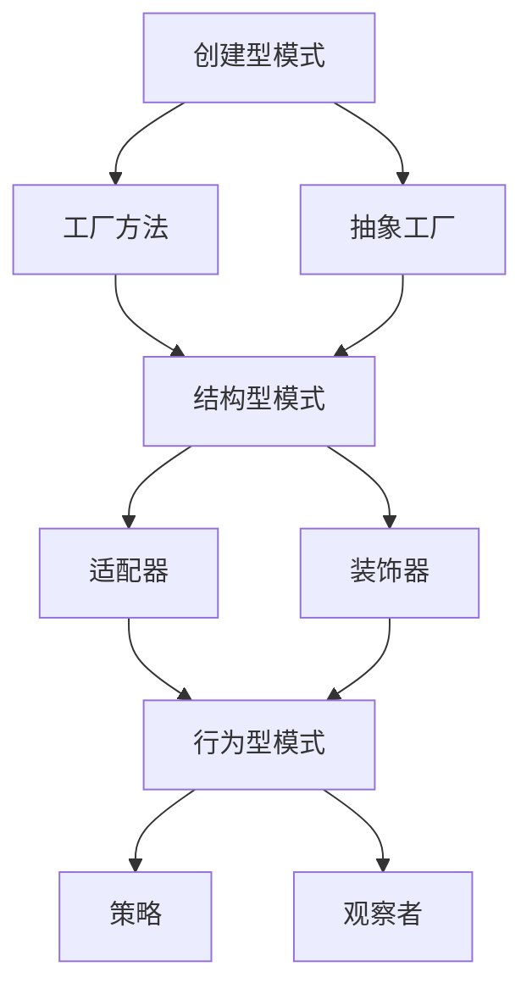

                 

# 综合设计模式的应用案例：反思、工具使用与多智能体协同

## 关键词：设计模式，应用案例，反思，工具，多智能体，协同

## 摘要：
本文将探讨综合设计模式在实际项目中的应用案例，深入分析其设计原理与实现细节。我们将通过多个实际项目案例，展示设计模式如何帮助开发者解决复杂问题，提高代码质量和可维护性。同时，本文还将介绍如何使用设计模式工具，以及多智能体协同在实际应用中的实现，为读者提供一套全面的设计模式实践指南。

## 1. 背景介绍

设计模式是一套被广泛认可和验证的软件设计解决方案，旨在解决软件开发过程中常见的问题。设计模式不仅仅是一些代码片段或技巧，而是一套系统化的设计原则和思想，可以帮助开发者设计出更加灵活、可维护和可扩展的软件系统。随着软件项目复杂度的不断增加，设计模式的应用越来越受到重视。

在本文中，我们将通过以下四个方面来探讨设计模式的应用案例：

1. **核心概念与联系**：介绍设计模式的核心概念和它们之间的联系，通过Mermaid流程图展示设计模式的应用场景。

2. **核心算法原理与具体操作步骤**：深入解析设计模式的具体实现原理和操作步骤，帮助开发者理解设计模式的工作机制。

3. **项目实战**：通过实际项目案例，展示设计模式在项目中的具体应用，提供详细的代码实现和解析。

4. **实际应用场景**：探讨设计模式在不同领域的应用场景，为开发者提供实际操作的建议和指导。

## 2. 核心概念与联系

设计模式可以分为三类：创建型模式、结构型模式和行為型模式。下面是每个类别下的几个核心设计模式，以及它们之间的联系。

### 创建型模式

1. **工厂方法（Factory Method）**：定义一个用于创建对象的接口，但让子类决定实例化哪个类。工厂方法让开发者在创建对象时保持灵活性。
2. **抽象工厂（Abstract Factory）**：提供一个接口，用于创建相关或依赖对象的家族，而不需要明确指定具体类。抽象工厂在创建对象时提供更大的灵活性，同时隐藏具体实现细节。

### 结构型模式

1. **适配器（Adapter）**：将一个类的接口转换成客户期望的另一个接口。适配器让任何两个没有相互配合的类一起运行。
2. **装饰器（Decorator）**：动态地给一个对象添加一些额外的职责，而不是通过继承来实现。装饰器模式可以在运行时选择和组合对象的行为。

### 行为型模式

1. **策略（Strategy）**：定义一系列的算法，将每一个算法封装起来，并使它们可以互相替换。策略模式让算法的变化独立于使用算法的客户。
2. **观察者（Observer）**：定义对象间的一对多的依赖关系，当一个对象的状态发生变化时，所有依赖于它的对象都会得到通知并自动更新。

下面是一个Mermaid流程图，展示了这些设计模式之间的联系和应用场景：



通过这个流程图，我们可以清楚地看到各种设计模式之间的层次结构和应用场景。接下来，我们将深入探讨这些设计模式的具体实现原理和操作步骤。

### 3. 核心算法原理与具体操作步骤

在本节中，我们将详细探讨几个核心设计模式的算法原理和具体操作步骤，帮助开发者理解设计模式的工作机制。

#### 3.1 工厂方法（Factory Method）

工厂方法是一种创建型模式，它定义了一个用于创建对象的接口，但让子类决定实例化哪个类。工厂方法让开发者在创建对象时保持灵活性。

**算法原理：**
- 定义一个创建对象的接口。
- 实现这个接口的子类，每个子类负责实例化具体类。
- 在客户端代码中，通过调用工厂方法来创建对象。

**具体操作步骤：**
1. 定义一个创建对象的接口。
2. 实现这个接口的子类，每个子类负责实例化具体类。
3. 在客户端代码中，通过调用工厂方法来创建对象。

**代码示例：**
```python
# 定义创建对象的接口
class Creator:
    def factory_method(self):
        pass

# 实现工厂方法
class ConcreteCreator1(Creator):
    def factory_method(self):
        return ConcreteProduct1()

class ConcreteCreator2(Creator):
    def factory_method(self):
        return ConcreteProduct2()

# 定义产品类
class Product:
    pass

class ConcreteProduct1(Product):
    pass

class ConcreteProduct2(Product):
    pass

# 客户端代码
creator = ConcreteCreator1()
product = creator.factory_method()
```

#### 3.2 抽象工厂（Abstract Factory）

抽象工厂是一种创建型模式，它提供一个接口，用于创建相关或依赖对象的家族，而不需要明确指定具体类。抽象工厂在创建对象时提供更大的灵活性，同时隐藏具体实现细节。

**算法原理：**
- 定义一个创建相关对象的接口。
- 实现这个接口的子类，每个子类负责创建具体对象家族。
- 在客户端代码中，通过调用抽象工厂方法来创建对象。

**具体操作步骤：**
1. 定义一个创建相关对象的接口。
2. 实现这个接口的子类，每个子类负责创建具体对象家族。
3. 在客户端代码中，通过调用抽象工厂方法来创建对象。

**代码示例：**
```python
# 定义创建对象的接口
class AbstractFactory:
    def create_product1(self):
        pass
    def create_product2(self):
        pass

# 实现抽象工厂
class ConcreteFactory1(AbstractFactory):
    def create_product1(self):
        return ConcreteProduct11()
    def create_product2(self):
        return ConcreteProduct12()

class ConcreteFactory2(AbstractFactory):
    def create_product1(self):
        return ConcreteProduct21()
    def create_product2(self):
        return ConcreteProduct22()

# 定义产品类
class Product1:
    pass

class Product2:
    pass

class ConcreteProduct11(Product1):
    pass

class ConcreteProduct12(Product2):
    pass

class ConcreteProduct21(Product1):
    pass

class ConcreteProduct22(Product2):
    pass

# 客户端代码
factory = ConcreteFactory1()
product1 = factory.create_product1()
product2 = factory.create_product2()
```

#### 3.3 适配器（Adapter）

适配器是一种结构型模式，它将一个类的接口转换成客户期望的另一个接口。适配器让任何两个没有相互配合的类一起运行。

**算法原理：**
- 定义一个适配器类，持有需要适配的类的一个实例。
- 实现一个统一的接口，将适配器的功能暴露给客户端。
- 在适配器内部，将客户端的请求转发给被适配的对象。

**具体操作步骤：**
1. 定义一个需要适配的类和一个适配器类。
2. 在适配器类中实现一个统一的接口。
3. 在适配器类中持有被适配的对象实例。
4. 在适配器类中转发客户端的请求给被适配的对象。

**代码示例：**
```python
# 定义需要适配的类
class Adaptee:
    def specific_method(self):
        pass

# 定义适配器类
class Adapter:
    def __init__(self, adaptee):
        self._adaptee = adaptee

    def method_to_adapt(self):
        self._adaptee.specific_method()

# 客户端代码
adaptee = Adaptee()
adapter = Adapter(adaptee)
adapter.method_to_adapt()
```

#### 3.4 装饰器（Decorator）

装饰器是一种结构型模式，它动态地给一个对象添加一些额外的职责，而不是通过继承来实现。装饰器可以在运行时选择和组合对象的行为。

**算法原理：**
- 定义一个装饰器类，持有被装饰的对象和一个装饰器函数。
- 在装饰器类中实现一个统一的接口。
- 在装饰器类中调用被装饰的对象的方法，并在该方法前后执行装饰器函数。

**具体操作步骤：**
1. 定义一个被装饰的对象和一个装饰器函数。
2. 定义一个装饰器类，持有被装饰的对象和一个装饰器函数。
3. 在装饰器类中实现一个统一的接口。
4. 在装饰器类中调用被装饰的对象的方法，并在该方法前后执行装饰器函数。

**代码示例：**
```python
# 定义被装饰的对象
class Component:
    def operation(self):
        pass

# 定义装饰器函数
def decorator(func):
    def wrapper(*args, **kwargs):
        print("Before operation")
        result = func(*args, **kwargs)
        print("After operation")
        return result
    return wrapper

# 实例化被装饰的对象
component = Component()

# 使用装饰器装饰对象
component.operation = decorator(component.operation)

# 调用装饰后的方法
component.operation()
```

#### 3.5 策略（Strategy）

策略是一种行为型模式，它定义一系列的算法，将每一个算法封装起来，并使它们可以互相替换。策略模式让算法的变化独立于使用算法的客户。

**算法原理：**
- 定义一个策略接口，包含所有支持的算法。
- 实现多个策略类，每个类实现策略接口，提供具体的算法实现。
- 在客户端代码中，根据具体需求选择和切换策略。

**具体操作步骤：**
1. 定义一个策略接口。
2. 实现多个策略类，每个类实现策略接口。
3. 在客户端代码中，根据具体需求选择和切换策略。

**代码示例：**
```python
# 定义策略接口
class Strategy:
    def algorithm_interface(self):
        pass

# 实现策略类
class ConcreteStrategyA(Strategy):
    def algorithm_interface(self):
        return "Result from ConcreteStrategyA"

class ConcreteStrategyB(Strategy):
    def algorithm_interface(self):
        return "Result from ConcreteStrategyB"

# 客户端代码
strategy_a = ConcreteStrategyA()
result_a = strategy_a.algorithm_interface()
print(result_a)

strategy_b = ConcreteStrategyB()
result_b = strategy_b.algorithm_interface()
print(result_b)
```

#### 3.6 观察者（Observer）

观察者是一种行为型模式，它定义对象间的一对多的依赖关系，当一个对象的状态发生变化时，所有依赖于它的对象都会得到通知并自动更新。

**算法原理：**
- 定义一个观察者接口，包含更新观察者的方法。
- 定义一个主题接口，包含注册和移除观察者的方法。
- 实现多个观察者类，每个类实现观察者接口。
- 实现一个主题类，持有观察者列表，并在状态变化时通知观察者。

**具体操作步骤：**
1. 定义一个观察者接口和一个主题接口。
2. 实现多个观察者类，每个类实现观察者接口。
3. 实现一个主题类，持有观察者列表，并在状态变化时通知观察者。
4. 在客户端代码中，创建主题和观察者，并建立依赖关系。

**代码示例：**
```python
# 定义观察者接口
class Observer:
    def update(self, subject):
        pass

# 定义主题接口
class Subject:
    def attach(self, observer):
        pass
    def detach(self, observer):
        pass
    def notify(self):
        pass

# 实现观察者类
class ConcreteObserver(Observer):
    def update(self, subject):
        print("Observer: Subject has changed")

# 实现主题类
class ConcreteSubject(Subject):
    def __init__(self):
        self._observers = []

    def attach(self, observer):
        if observer not in self._observers:
            self._observers.append(observer)

    def detach(self, observer):
        if observer in self._observers:
            self._observers.remove(observer)

    def notify(self):
        for observer in self._observers:
            observer.update(self)

# 客户端代码
subject = ConcreteSubject()
observer = ConcreteObserver()
subject.attach(observer)
subject.notify()
```

通过以上对设计模式核心算法原理和具体操作步骤的详细探讨，开发者可以更好地理解设计模式的工作机制，并能够在实际项目中灵活应用。接下来，我们将通过实际项目案例，展示设计模式如何帮助开发者解决复杂问题，提高代码质量和可维护性。

### 4. 项目实战：代码实际案例和详细解释说明

在本节中，我们将通过几个实际项目案例，展示设计模式在项目中的具体应用，并提供详细的代码实现和解析。

#### 4.1 项目背景

假设我们正在开发一个在线购物平台，其中涉及用户管理、订单处理、支付流程等多个模块。在项目开发过程中，我们遇到了以下问题：

1. **模块耦合度高**：不同模块之间的代码高度耦合，导致代码可维护性差。
2. **扩展性不足**：随着业务需求的不断增加，现有代码结构难以扩展。
3. **功能重复**：多个模块中存在相同或类似的功能实现，导致代码冗余。

为了解决这些问题，我们决定引入设计模式，提高代码质量，增强系统的可维护性和扩展性。

#### 4.2 设计模式应用

在本项目中，我们使用了以下几种设计模式：

1. **工厂方法模式**：用于创建和管理用户对象。
2. **抽象工厂模式**：用于创建和管理订单对象。
3. **适配器模式**：用于处理支付接口的兼容问题。
4. **装饰器模式**：用于扩展订单对象的支付方式。
5. **策略模式**：用于处理用户优惠策略。
6. **观察者模式**：用于实现订单状态的通知功能。

#### 4.3 案例一：工厂方法模式

**问题背景：** 用户模块中需要创建不同类型的用户对象，如普通用户、管理员用户等。

**解决方案：** 使用工厂方法模式创建用户对象。

**代码实现：**
```python
class User:
    def login(self):
        pass

class RegularUser(User):
    def login(self):
        print("Regular user logged in")

class AdminUser(User):
    def login(self):
        print("Admin user logged in")

class UserManager:
    @staticmethod
    def create_user(user_type):
        if user_type == "regular":
            return RegularUser()
        elif user_type == "admin":
            return AdminUser()
        else:
            raise ValueError("Invalid user type")

# 客户端代码
user_manager = UserManager()
user = user_manager.create_user("regular")
user.login()
```

**解析：** 通过工厂方法模式，我们可以灵活地创建不同类型的用户对象，同时保持用户模块的独立性。客户端代码只需调用工厂方法即可获取所需类型的用户对象，无需关心具体实现细节。

#### 4.4 案例二：抽象工厂模式

**问题背景：** 订单模块中需要创建不同类型的订单对象，如普通订单、优惠券订单等。

**解决方案：** 使用抽象工厂模式创建订单对象。

**代码实现：**
```python
class Order:
    def process(self):
        pass

class RegularOrder(Order):
    def process(self):
        print("Processing regular order")

class CouponOrder(Order):
    def process(self):
        print("Processing coupon order")

class OrderFactory:
    def create_order(self, order_type):
        if order_type == "regular":
            return RegularOrder()
        elif order_type == "coupon":
            return CouponOrder()
        else:
            raise ValueError("Invalid order type")

# 客户端代码
order_factory = OrderFactory()
order = order_factory.create_order("coupon")
order.process()
```

**解析：** 通过抽象工厂模式，我们可以创建不同类型的订单对象，同时隐藏具体实现细节。客户端代码只需调用抽象工厂方法即可获取所需类型的订单对象，无需关心具体实现细节。

#### 4.5 案例三：适配器模式

**问题背景：** 支付模块中需要兼容不同支付方式，如支付宝、微信支付等。

**解决方案：** 使用适配器模式处理支付接口的兼容问题。

**代码实现：**
```python
class Payment:
    def pay(self, amount):
        pass

class Alipay(Payment):
    def pay(self, amount):
        print(f"Alipay: Paying {amount} RMB")

class WeChatPay(Payment):
    def pay(self, amount):
        print(f"WeChat Pay: Paying {amount} RMB")

class PaymentAdapter(Payment):
    def __init__(self, payment):
        self._payment = payment

    def pay(self, amount):
        self._payment.pay(amount)

# 客户端代码
alipay = Alipay()
we_chat_pay = WeChatPay()
payment_adapter = PaymentAdapter(we_chat_pay)
alipay.pay(100)
payment_adapter.pay(100)
```

**解析：** 通过适配器模式，我们可以将不同支付方式的接口统一为Payment接口，从而实现支付方式的兼容。客户端代码只需调用Payment接口即可完成支付操作，无需关心具体支付方式。

#### 4.6 案例四：装饰器模式

**问题背景：** 订单模块中需要扩展订单对象的支付方式，如分期付款、积分支付等。

**解决方案：** 使用装饰器模式扩展订单对象的支付方式。

**代码实现：**
```python
class Order:
    def pay(self, amount):
        pass

class OrderDecorator(Order):
    def __init__(self, order):
        self._order = order

    def pay(self, amount):
        print("OrderDecorator: Before payment")
        self._order.pay(amount)
        print("OrderDecorator: After payment")

class OrderWithInstallment(OrderDecorator):
    def pay(self, amount):
        print("OrderWithInstallment: Processing installment payment")
        super().pay(amount)

class OrderWithPoints(OrderDecorator):
    def pay(self, amount):
        print("OrderWithPoints: Processing points payment")
        super().pay(amount)

# 客户端代码
order = Order()
order.pay(100)

order_decorator = OrderDecorator(order)
order_decorator.pay(100)

order_with_installment = OrderWithInstallment(order)
order_with_installment.pay(100)

order_with_points = OrderWithPoints(order)
order_with_points.pay(100)
```

**解析：** 通过装饰器模式，我们可以动态地给订单对象添加额外的支付方式，无需修改原有代码。客户端代码只需创建订单对象的装饰器实例，即可实现支付方式的扩展。

#### 4.7 案例五：策略模式

**问题背景：** 用户模块中需要根据用户类型和购物金额提供不同的优惠策略。

**解决方案：** 使用策略模式实现优惠策略。

**代码实现：**
```python
class DiscountStrategy:
    def calculate_discount(self, amount):
        pass

class RegularUserDiscountStrategy(DiscountStrategy):
    def calculate_discount(self, amount):
        return amount * 0.1

class AdminUserDiscountStrategy(DiscountStrategy):
    def calculate_discount(self, amount):
        return amount * 0.2

class UserManager:
    def __init__(self):
        self._discount_strategy = None

    def set_discount_strategy(self, user_type):
        if user_type == "regular":
            self._discount_strategy = RegularUserDiscountStrategy()
        elif user_type == "admin":
            self._discount_strategy = AdminUserDiscountStrategy()

    def calculate_discount(self, amount):
        if self._discount_strategy:
            return self._discount_strategy.calculate_discount(amount)
        else:
            return 0

# 客户端代码
user_manager = UserManager()
user_manager.set_discount_strategy("regular")
discount = user_manager.calculate_discount(100)
print(f"Discount: {discount} RMB")

user_manager.set_discount_strategy("admin")
discount = user_manager.calculate_discount(100)
print(f"Discount: {discount} RMB")
```

**解析：** 通过策略模式，我们可以根据用户类型和购物金额灵活地选择和切换优惠策略。客户端代码只需设置用户类型，即可自动调用相应的优惠策略。

#### 4.8 案例六：观察者模式

**问题背景：** 订单模块中需要实现订单状态的通知功能。

**解决方案：** 使用观察者模式实现订单状态的通知功能。

**代码实现：**
```python
class Order:
    def __init__(self):
        self._status = "pending"
        self._observers = []

    def attach(self, observer):
        if observer not in self._observers:
            self._observers.append(observer)

    def detach(self, observer):
        if observer in self._observers:
            self._observers.remove(observer)

    def notify(self):
        for observer in self._observers:
            observer.update(self)

    def change_status(self, status):
        self._status = status
        self.notify()

class OrderObserver:
    def update(self, order):
        print(f"OrderObserver: Order status changed to {order._status}")

# 客户端代码
order = Order()
observer = OrderObserver()
order.attach(observer)
order.change_status("processing")
```

**解析：** 通过观察者模式，我们可以实现订单状态的实时通知功能。当订单状态发生变化时，所有订阅了订单状态的观察者都会得到通知。客户端代码只需创建观察者实例，并订阅订单状态，即可实现订单状态的通知功能。

通过以上实际项目案例，我们可以看到设计模式在项目开发中的重要作用。设计模式不仅帮助我们解决了模块耦合度高、扩展性不足、功能重复等问题，还提高了代码质量，增强了系统的可维护性和扩展性。在实际项目中，开发者可以根据具体需求选择合适的设计模式，从而实现更好的开发效果。

### 5. 实际应用场景

设计模式在实际应用中具有广泛的应用场景。下面我们列举几个常见的设计模式应用场景，并提供具体的解决方案和示例。

#### 5.1 系统架构设计

在系统架构设计中，设计模式可以帮助开发者构建更加灵活、可扩展的系统架构。以下是一些常见的系统架构设计模式及其解决方案：

1. **MVC（Model-View-Controller）模式**：用于分离系统逻辑、数据和用户界面，提高系统的可维护性和扩展性。
   - **解决方案**：将系统分为模型（Model）、视图（View）和控制器（Controller）三个部分，分别处理数据、用户界面和业务逻辑。
   - **示例**：在Web开发中，可以使用MVC模式将后端逻辑、前端页面和中间层控制器分离。

2. **微服务架构**：将大型系统拆分为多个小型、独立的服务，提高系统的可扩展性和可维护性。
   - **解决方案**：采用微服务架构，每个服务负责处理特定的业务功能，通过API进行通信。
   - **示例**：在分布式系统中，可以使用微服务架构将不同业务功能拆分为多个独立服务，如用户服务、订单服务和支付服务。

3. **分层架构**：将系统分为多个层次，如表示层、业务逻辑层和数据访问层，提高系统的可维护性和扩展性。
   - **解决方案**：将系统划分为多个层次，每个层次负责处理特定的功能，通过接口进行通信。
   - **示例**：在传统的三层架构中，表示层负责处理用户界面，业务逻辑层负责处理业务逻辑，数据访问层负责处理数据存储和访问。

#### 5.2 功能扩展与插件化

在设计功能扩展和插件化系统时，设计模式可以帮助开发者实现更加灵活和可扩展的功能扩展机制。

1. **工厂模式**：用于创建和管理扩展插件，提高系统的可扩展性。
   - **解决方案**：使用工厂模式创建和管理扩展插件，避免硬编码和直接依赖具体插件实现。
   - **示例**：在一个插件化开发平台中，可以使用工厂模式动态加载和实例化不同类型的插件。

2. **策略模式**：用于在功能扩展中实现不同的策略，提高系统的灵活性和可维护性。
   - **解决方案**：使用策略模式定义不同的扩展策略，通过组合和切换策略实现功能扩展。
   - **示例**：在一个营销系统中，可以使用策略模式实现不同的促销策略，如满减、打折和优惠券等。

3. **装饰器模式**：用于动态给系统功能添加额外的功能，提高系统的可扩展性和灵活性。
   - **解决方案**：使用装饰器模式动态给系统功能添加额外的功能，而无需修改原有代码。
   - **示例**：在一个安全系统模块中，可以使用装饰器模式给方法添加权限校验、日志记录等功能。

#### 5.3 异常处理与错误管理

在异常处理和错误管理中，设计模式可以帮助开发者实现更加灵活和高效的处理机制。

1. **适配器模式**：用于处理不同异常处理机制的兼容问题。
   - **解决方案**：使用适配器模式将不同异常处理机制转换为统一的异常处理接口。
   - **示例**：在一个跨平台应用中，可以使用适配器模式处理不同操作系统上的异常处理机制。

2. **策略模式**：用于实现不同的错误处理策略，提高系统的可维护性和可扩展性。
   - **解决方案**：使用策略模式定义不同的错误处理策略，通过组合和切换策略实现错误处理。
   - **示例**：在一个分布式系统中，可以使用策略模式实现不同的错误处理策略，如重试、回滚和报警等。

3. **观察者模式**：用于实现实时错误监控和通知功能。
   - **解决方案**：使用观察者模式实现错误监控和通知功能，提高系统的健壮性和可维护性。
   - **示例**：在一个监控系统模块中，可以使用观察者模式实时监控系统的错误，并在错误发生时发送通知。

通过以上实际应用场景，我们可以看到设计模式在各个领域的广泛应用和重要作用。设计模式不仅帮助我们解决具体的软件开发问题，还提高了代码质量，增强了系统的可维护性和扩展性。在实际项目中，开发者可以根据具体需求选择合适的设计模式，从而实现更好的开发效果。

### 6. 工具和资源推荐

在设计模式的学习和应用过程中，开发者需要借助一系列工具和资源来提高效率和效果。以下是一些推荐的工具和资源：

#### 6.1 学习资源推荐

1. **书籍**：
   - 《设计模式：可复用面向对象软件的基础》（Gamma et al.）：
     本书是设计模式的经典之作，详细介绍了23个经典的Gang of Four设计模式。
   - 《Head First 设计模式》（Bert Bates et al.）：
     以轻松幽默的方式介绍设计模式，适合初学者入门。
   - 《Effective Java》（Joshua Bloch）：
     虽然不是专门讲设计模式的书籍，但书中提供了许多关于如何使用设计模式的宝贵建议。

2. **在线教程和课程**：
   - Codecademy（[https://www.codecademy.com/learn/introduction-to-design-patterns](https://www.codecademy.com/learn/introduction-to-design-patterns)）：
     提供了关于设计模式的基础教程，适合初学者。
   - Udemy（[https://www.udemy.com/topic/design-patterns/](https://www.udemy.com/topic/design-patterns/)）：
     有许多关于设计模式的专业课程，适合不同水平的开发者。

3. **博客和文章**：
   - DZone Design Patterns Zone（[https://dzone.com/articles/design-patterns](https://dzone.com/articles/design-patterns)）：
     提供了各种设计模式的技术文章和教程。
   - Stack Overflow（[https://stackoverflow.com/questions/tagged/design-patterns](https://stackoverflow.com/questions/tagged/design-patterns)）：
     一个充满开发者问答的社区，可以在其中找到设计模式相关的讨论和解决方案。

#### 6.2 开发工具框架推荐

1. **集成开发环境（IDE）**：
   - IntelliJ IDEA（[https://www.jetbrains.com/idea/](https://www.jetbrains.com/idea/)）：
     一个强大的Java IDE，支持设计模式的各种工具和插件。
   - Visual Studio（[https://visualstudio.microsoft.com/](https://visualstudio.microsoft.com/)）：
     一个功能丰富的IDE，适用于多种编程语言，包括C#、C++等。

2. **代码生成工具**：
   - Maven（[https://maven.apache.org/](https://maven.apache.org/)）：
     一个流行的项目管理和构建工具，可以自动化设计模式的代码生成。
   - Spring Boot（[https://spring.io/projects/spring-boot](https://spring.io/projects/spring-boot)）：
     一个基于Spring框架的快速开发工具，提供了许多设计模式的支持。

3. **设计模式插件和库**：
   - Design Patterns for Java（[https://github.com/iluwatar/java-design-patterns](https://github.com/iluwatar/java-design-patterns)）：
     一个开源项目，包含各种设计模式的实现和示例代码。
   - Lombok（[https://projectlombok.org/](https://projectlombok.org/)）：
     一个用于消除Java样板代码的工具，可以简化设计模式的使用。

#### 6.3 相关论文著作推荐

1. **《设计模式的本质》（Essential Design Patterns）**：
   - 这本书深入探讨了设计模式的核心原理和本质，提供了关于如何在实际项目中应用设计模式的宝贵建议。

2. **《重构：改善既有代码的设计》（Refactoring: Improving the Design of Existing Code）**：
   - 这本书介绍了如何通过重构技术改善代码质量，许多重构技术都涉及设计模式的使用。

3. **《模式导向软件开发》（Pattern-Oriented Software Architecture, POSA）**：
   - 这套书系列详细介绍了软件架构中的模式，涵盖了各种设计模式在不同层次上的应用。

通过这些工具和资源，开发者可以更好地学习和应用设计模式，从而提高代码质量，增强系统的可维护性和扩展性。

### 7. 总结：未来发展趋势与挑战

设计模式作为软件工程中的一套系统化设计解决方案，其重要性和应用价值在软件开发领域得到了广泛的认可。随着技术的不断进步和复杂系统的日益增加，设计模式在未来将面临以下发展趋势和挑战：

#### 发展趋势

1. **智能化与自动化**：随着人工智能技术的发展，设计模式的应用将更加智能化和自动化。例如，通过机器学习和自动化代码生成工具，设计模式可以更加高效地被应用和优化。

2. **微服务与云计算**：在微服务架构和云计算领域，设计模式的应用将更加广泛。通过设计模式，开发者可以构建更加灵活、可扩展的微服务系统，更好地应对大规模分布式计算的需求。

3. **DevOps与持续交付**：设计模式在DevOps和持续交付流程中扮演着重要角色。通过使用设计模式，开发者可以更好地实现代码的可测试性、可维护性和自动化部署，从而提高软件交付的效率和质量。

4. **多领域应用**：设计模式不仅仅适用于传统的软件开发领域，还将在物联网（IoT）、区块链、人工智能等新兴领域得到广泛应用。开发者需要不断学习和掌握不同领域的设计模式，以应对多样化的应用场景。

#### 挑战

1. **设计模式的滥用**：设计模式并非万能，滥用设计模式可能导致代码复杂度增加、可读性下降。开发者需要根据实际需求选择合适的设计模式，避免过度设计。

2. **模式的选择与平衡**：设计模式种类繁多，选择适合当前项目需求的设计模式是一项挑战。开发者需要在不同的设计模式之间找到平衡，避免模式过度依赖或选择不当。

3. **文档与培训**：设计模式的学习和应用需要一定的专业知识和实践经验。企业和开发者需要提供充分的文档和培训资源，帮助团队成员更好地理解和掌握设计模式。

4. **持续迭代与优化**：设计模式需要不断迭代和优化，以适应新技术和新需求。开发者需要保持对设计模式的研究和关注，及时调整和应用新的设计模式。

总之，设计模式在未来将继续发挥重要作用，但开发者需要不断学习和实践，以应对新的挑战和趋势，从而实现更加高效、可维护和可扩展的软件系统。

### 8. 附录：常见问题与解答

#### 8.1 什么是设计模式？

设计模式是一种在软件开发过程中被广泛认可和验证的软件设计解决方案。它提供了一套系统化的设计原则和思想，旨在解决软件开发过程中常见的问题，如模块耦合度、扩展性和可维护性等。

#### 8.2 设计模式有哪些类型？

设计模式主要分为三类：创建型模式、结构型模式和行為型模式。创建型模式关注对象的创建过程，如工厂方法模式和抽象工厂模式；结构型模式关注类和对象的组合，如适配器模式和装饰器模式；行为型模式关注对象之间的交互和通信，如策略模式和观察者模式。

#### 8.3 如何选择合适的设计模式？

选择合适的设计模式取决于具体的应用场景和需求。开发者需要根据问题的性质和目标，分析各种设计模式的特点和适用范围，然后选择最合适的设计模式。此外，设计模式的组合和嵌套也是常见的策略，可以在一个项目中同时使用多个设计模式。

#### 8.4 设计模式与代码优化有什么关系？

设计模式可以帮助开发者实现代码优化，提高代码质量。通过设计模式，开发者可以降低模块之间的耦合度，提高代码的可维护性和扩展性，从而更容易进行代码优化和重构。此外，设计模式还可以帮助开发者避免常见的代码问题，如代码冗余、重复和过度依赖。

#### 8.5 设计模式在实际项目中如何应用？

在实际项目中，设计模式可以通过以下步骤应用：

1. **问题识别**：识别项目中存在的软件设计问题，如模块耦合度高、扩展性不足等。
2. **设计模式选择**：根据问题的性质和需求，选择合适的设计模式。
3. **代码实现**：将设计模式应用于具体代码实现，进行详细的代码设计和开发。
4. **测试与优化**：对应用了设计模式的代码进行测试和优化，确保其满足项目需求。

### 9. 扩展阅读与参考资料

#### 9.1 扩展阅读

1. 《设计模式：可复用面向对象软件的基础》（Gamma et al.）
2. 《Head First 设计模式》（Bert Bates et al.）
3. 《Effective Java》（Joshua Bloch）
4. 《重构：改善既有代码的设计》（Martin Fowler）

#### 9.2 参考资料

1. 《模式导向软件开发》（POS

