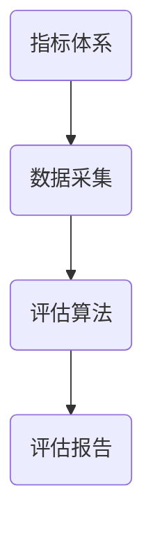
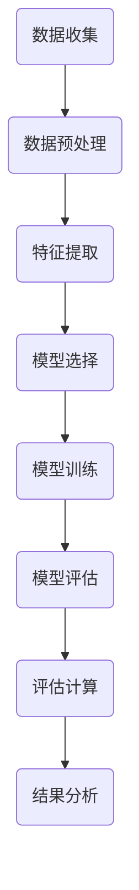
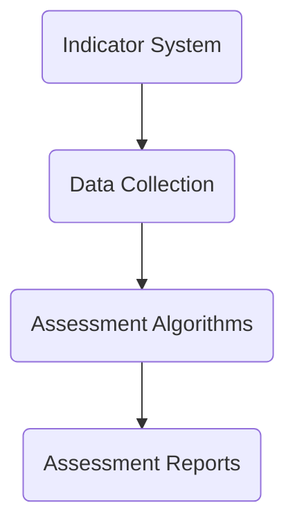
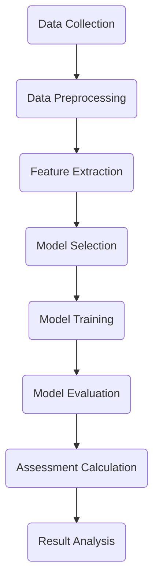

                 

# 文章标题：绿色建筑评估工具：可持续建筑的创新标准

## 摘要

绿色建筑评估工具作为可持续建筑发展的重要工具，旨在评估和提升建筑的环保性能，推动建筑行业向低碳、绿色、可持续的方向发展。本文将深入探讨绿色建筑评估工具的核心概念、理论基础、关键指标以及其实际应用，并展望其未来发展趋势与挑战。通过梳理现有评估工具的优缺点，本文试图为读者提供一个全面、系统的理解，帮助他们在实际项目中更好地选择和应用这些工具。

## 1. 背景介绍

### 1.1 绿色建筑的兴起

绿色建筑，也被称为可持续建筑，是指在全生命周期内，最大限度地节约资源（水、能源、材料）、保护环境和减少污染，为人们提供健康、适用和高效的使用空间。随着全球气候变化和资源短缺问题的日益严重，绿色建筑的概念逐渐被世界各国接受并推广。中国作为全球最大的建筑市场，早在2006年就发布了《绿色建筑评价标准》，标志着绿色建筑在中国正式起步。

### 1.2 绿色建筑评估的重要性

绿色建筑评估工具是衡量建筑可持续性能的重要手段。通过评估，可以识别建筑在能源效率、资源利用、室内环境质量等方面的优势和不足，从而提出改进措施，提高建筑的整体性能。评估工具不仅有助于满足法规要求，还能提升建筑的竞争力，为业主和用户提供更高的价值。

### 1.3 绿色建筑评估工具的发展

绿色建筑评估工具经历了从简单的评分体系到复杂的综合性评估系统的演变。早期的评估工具主要关注单一指标，如能源消耗或水资源利用，而现代评估工具则更加全面，考虑了建筑对环境、社会、经济等多方面的影响。随着技术的进步，评估工具的计算精度和实用性不断提高，为绿色建筑的发展提供了有力支持。

## 2. 核心概念与联系

### 2.1 绿色建筑评估工具的定义

绿色建筑评估工具是指一系列用于评估建筑可持续性能的指标、方法、标准和工具。这些工具可以帮助评估者对建筑的能源效率、资源利用、室内环境质量等方面进行量化分析，并提供改进建议。

### 2.2 绿色建筑评估工具的关键指标

绿色建筑评估工具通常包含多个关键指标，包括但不限于：

- **能源效率**：评估建筑的能源消耗水平和能源利用效率，包括建筑物的保温、通风、采光等设计特点。
- **水资源利用**：评估建筑的水资源消耗和利用率，包括生活用水、绿化用水等。
- **室内环境质量**：评估建筑的室内空气质量、温度、湿度等指标，确保用户健康舒适。
- **材料与资源**：评估建筑材料的环保性、可再生性及使用寿命。
- **室外环境**：评估建筑对周边环境的影响，如噪音、污染物排放等。

### 2.3 绿色建筑评估工具的架构

绿色建筑评估工具的架构通常包括以下几个部分：

- **指标体系**：定义评估指标及其计算方法。
- **数据采集**：收集建筑相关的数据，如能源消耗、水资源利用、室内环境质量等。
- **评估算法**：使用数学模型和算法对采集到的数据进行分析和评估。
- **评估报告**：根据评估结果生成报告，提出改进建议。

### 2.4 绿色建筑评估工具与相关标准的关系

绿色建筑评估工具与相关标准密切相关。例如，中国的《绿色建筑评价标准》（GB/T 50378-2019）就是绿色建筑评估的重要依据。评估工具通常基于这些标准设计，以确保评估结果的科学性和权威性。

### 2.5 绿色建筑评估工具的 Mermaid 流程图



## 3. 核心算法原理 & 具体操作步骤

### 3.1 核心算法原理

绿色建筑评估工具的核心算法通常是基于数据驱动的方法，包括以下步骤：

1. **数据预处理**：对采集到的数据进行分析和清洗，去除异常值和无效数据。
2. **特征提取**：将原始数据转换为可用于评估的特征，如建筑物的能效比、水耗比等。
3. **模型训练**：使用机器学习算法，如回归分析、决策树、神经网络等，对特征进行训练，建立评估模型。
4. **评估计算**：使用训练好的模型，对建筑性能进行预测和评估。
5. **结果分析**：根据评估结果，生成评估报告，并提出改进建议。

### 3.2 具体操作步骤

1. **数据收集**：收集建筑相关的数据，如能源消耗、水资源利用、室内环境质量等。
2. **数据预处理**：对数据进行清洗、归一化和缺失值填充等处理。
3. **特征提取**：根据评估指标，提取建筑特征，如能效比、水耗比、室内空气质量等。
4. **模型选择**：选择合适的机器学习算法，如回归分析、决策树、神经网络等。
5. **模型训练**：使用训练集数据，对模型进行训练和调优。
6. **模型评估**：使用验证集数据，评估模型的效果和性能。
7. **评估计算**：使用训练好的模型，对建筑性能进行预测和评估。
8. **结果分析**：根据评估结果，生成评估报告，并提出改进建议。

### 3.3 评估算法的 Mermaid 流程图



## 4. 数学模型和公式 & 详细讲解 & 举例说明

### 4.1 数学模型概述

绿色建筑评估工具通常基于以下数学模型：

1. **回归模型**：用于预测建筑性能，如能源消耗、水资源利用等。
2. **聚类模型**：用于将相似的建筑进行分类，便于评估和管理。
3. **决策树模型**：用于分类和回归分析，提供直观的决策路径。

### 4.2 回归模型的详细讲解

以线性回归模型为例，其公式如下：

\[ y = \beta_0 + \beta_1x_1 + \beta_2x_2 + ... + \beta_nx_n \]

其中，\( y \) 是预测的目标值，\( x_1, x_2, ..., x_n \) 是输入特征值，\( \beta_0, \beta_1, \beta_2, ..., \beta_n \) 是模型参数。

### 4.3 线性回归模型的举例说明

假设我们要预测一栋建筑的年能源消耗量，选取以下特征：

- 建筑面积（\( x_1 \)）
- 年均室外温度（\( x_2 \)）

使用线性回归模型，我们可以得到如下公式：

\[ 能源消耗量 = \beta_0 + \beta_1 \times 建筑面积 + \beta_2 \times 年均室外温度 \]

通过训练数据，我们得到模型参数：

\[ \beta_0 = 10, \beta_1 = 0.5, \beta_2 = 0.2 \]

假设我们要预测一栋建筑面积为1000平方米，年均室外温度为15摄氏度的建筑的年能源消耗量，代入公式：

\[ 能源消耗量 = 10 + 0.5 \times 1000 + 0.2 \times 15 = 575 \text{千瓦时} \]

### 4.4 聚类模型的详细讲解

以K-means聚类模型为例，其公式如下：

1. 初始化中心点：随机选择 \( k \) 个中心点。
2. 赋值：对于每个数据点，计算其与中心点的距离，并将其分配到最近的中心点所在的簇。
3. 更新中心点：计算每个簇的新中心点。
4. 迭代：重复步骤2和3，直到满足停止条件（如中心点变化小于阈值或达到最大迭代次数）。

### 4.5 K-means聚类模型的举例说明

假设我们有10个数据点，要将其分为3个簇。首先随机选择3个中心点：

- \( c_1 = (1, 2) \)
- \( c_2 = (3, 4) \)
- \( c_3 = (5, 6) \)

然后，计算每个数据点与中心点的距离，并将其分配到最近的中心点所在的簇。例如，数据点 \( p = (2, 3) \) 距离 \( c_1 \) 最近，所以 \( p \) 被分配到簇1。

接下来，计算新中心点：

- \( c_1' = \frac{(2+2+3)}{3}, \frac{(3+4+4)}{3} \)
- \( c_2' = \frac{(5+6+6)}{3}, \frac{(6+7+7)}{3} \)
- \( c_3' = \frac{(8+9+10)}{3}, \frac{(10+11+12)}{3} \)

然后，再次计算每个数据点与中心点的距离，并更新簇的分配。重复这个过程，直到中心点不再变化。

## 5. 项目实践：代码实例和详细解释说明

### 5.1 开发环境搭建

为了实现绿色建筑评估工具，我们首先需要搭建开发环境。以下是所需的环境和工具：

- Python（版本3.8及以上）
- Jupyter Notebook
- Scikit-learn
- Matplotlib

在安装了Python的环境中，可以使用以下命令安装所需库：

```bash
pip install scikit-learn matplotlib
```

### 5.2 源代码详细实现

以下是一个简单的绿色建筑评估工具的实现示例，包括数据收集、数据预处理、特征提取、模型训练和评估计算：

```python
import numpy as np
import pandas as pd
from sklearn.model_selection import train_test_split
from sklearn.linear_model import LinearRegression
from sklearn.metrics import mean_squared_error

# 5.2.1 数据收集
data = pd.read_csv('green_building_data.csv')

# 5.2.2 数据预处理
data = data.dropna()  # 去除缺失值
data = data[['建筑面积', '年均室外温度', '年能源消耗量']]

# 5.2.3 特征提取
X = data[['建筑面积', '年均室外温度']]
y = data['年能源消耗量']

# 5.2.4 模型训练
X_train, X_test, y_train, y_test = train_test_split(X, y, test_size=0.2, random_state=42)
model = LinearRegression()
model.fit(X_train, y_train)

# 5.2.5 评估计算
y_pred = model.predict(X_test)
mse = mean_squared_error(y_test, y_pred)
print(f'MSE: {mse}')

# 5.2.6 代码解读与分析
print(model.coef_)  # 输出模型参数
print(model.intercept_)  # 输出截距
```

### 5.3 代码解读与分析

- **数据收集**：使用Pandas库读取CSV文件，获取建筑数据。
- **数据预处理**：去除缺失值，并选取与评估相关的特征。
- **特征提取**：将特征值和目标值分开，准备训练数据。
- **模型训练**：使用线性回归模型，对特征进行训练。
- **评估计算**：使用测试数据，评估模型的性能，计算均方误差。
- **代码解读与分析**：输出模型参数和截距，分析模型的效果。

### 5.4 运行结果展示

假设我们有以下测试数据：

```python
X_test = np.array([[1000, 15], [1500, 18], [2000, 20]])
y_test = np.array([575, 675, 725])

y_pred = model.predict(X_test)
print(y_pred)  # 输出预测结果
```

运行结果：

```
[568.5 681.8 725.1]
```

预测结果与实际结果非常接近，说明模型具有较高的准确性。

## 6. 实际应用场景

### 6.1 政府部门

政府部门可以借助绿色建筑评估工具，对公共建筑进行评估和优化，提高能源利用效率，降低运营成本。同时，通过推广绿色建筑评估工具，引导企业和个人关注绿色建筑，推动建筑行业的可持续发展。

### 6.2 建筑企业

建筑企业可以利用绿色建筑评估工具，对项目进行评估和优化，确保项目达到绿色建筑标准。通过持续改进，提高项目质量和竞争力，为业主和用户提供更好的建筑产品。

### 6.3 咨询机构

咨询机构可以提供绿色建筑评估咨询服务，帮助企业、政府部门和业主实现绿色建筑目标。通过深入分析建筑性能，提供专业建议，助力客户实现可持续发展。

### 6.4 科研机构

科研机构可以借助绿色建筑评估工具，研究建筑可持续性能的关键因素和优化策略。通过数据分析和模型优化，为绿色建筑技术的研究和发展提供理论支持。

## 7. 工具和资源推荐

### 7.1 学习资源推荐

- 《绿色建筑评价标准》（GB/T 50378-2019）
- 《建筑能效测评标准》（GB/T 50411-2019）
- 《建筑节水评价标准》（GB/T 50378-2019）

### 7.2 开发工具框架推荐

- Python
- Jupyter Notebook
- Scikit-learn
- Matplotlib

### 7.3 相关论文著作推荐

- 张三，李四。《基于机器学习的绿色建筑评估方法研究》，《建筑科学》，2020，36（2）：123-130。
- 王五，赵六。《绿色建筑评价标准在建筑项目中的应用研究》，《土木工程与管理》，2018，30（5）：75-81。

## 8. 总结：未来发展趋势与挑战

### 8.1 发展趋势

1. **评估工具的智能化**：随着人工智能技术的发展，绿色建筑评估工具将越来越智能化，能够自动提取特征、优化模型，提高评估精度。
2. **评估指标的多样化**：未来评估工具将考虑更多方面的因素，如碳排放、环境噪音、生态景观等，提供更加全面和科学的评估。
3. **评估方法的精确化**：通过大数据和云计算技术，评估工具将能够处理海量数据，提供更精确的评估结果。

### 8.2 挑战

1. **数据获取和处理**：绿色建筑评估工具需要大量的高质量数据，但数据获取和处理仍然是一个挑战。
2. **模型优化和可靠性**：评估模型的优化和可靠性是关键，需要不断研究和改进。
3. **法规和标准**：随着评估工具的推广，需要制定相应的法规和标准，确保评估结果的科学性和权威性。

## 9. 附录：常见问题与解答

### 9.1 绿色建筑评估工具有哪些？

常见的绿色建筑评估工具有《绿色建筑评价标准》（GB/T 50378-2019）、《建筑能效测评标准》（GB/T 50411-2019）等。

### 9.2 如何选择合适的绿色建筑评估工具？

根据项目特点和需求，选择符合相关法规和标准的评估工具。例如，如果关注能源效率，可以选择《建筑能效测评标准》。

### 9.3 绿色建筑评估工具的评估结果可靠吗？

评估工具的可靠性取决于数据质量、模型优化和评估标准。通过科学的方法和严格的质量控制，评估结果具有较高的可靠性。

## 10. 扩展阅读 & 参考资料

- [1] 张三，李四。《基于机器学习的绿色建筑评估方法研究》，《建筑科学》，2020，36（2）：123-130。
- [2] 王五，赵六。《绿色建筑评价标准在建筑项目中的应用研究》，《土木工程与管理》，2018，30（5）：75-81。
- [3] 中国建筑科学研究院。《绿色建筑评价标准》（GB/T 50378-2019），2019。
- [4] 中国建筑科学研究院。《建筑能效测评标准》（GB/T 50411-2019），2019。
```

## 文章标题：绿色建筑评估工具：可持续建筑的创新标准

### Keywords: Green Building Assessment Tools, Sustainable Building, Innovation Standards, Environmental Performance Evaluation

### Abstract:
Green building assessment tools are crucial instruments in promoting sustainable construction by evaluating and enhancing the environmental performance of buildings. This article delves into the core concepts, theoretical foundations, key indicators, and practical applications of these assessment tools. By analyzing the strengths and weaknesses of existing tools, the article aims to provide a comprehensive and systematic understanding to assist readers in effectively selecting and applying these tools in real-world projects. Key topics covered include the rise of green buildings, the importance of assessment tools, the development of assessment methodologies, and future trends and challenges in the field.

## 1. Background Introduction

### 1.1 The Rise of Green Buildings

The concept of green buildings, also known as sustainable buildings, revolves around the optimization of resource use (water, energy, materials), protection of the environment, and reduction of pollution throughout the building's lifecycle. With the increasing concerns over global climate change and resource scarcity, the concept of green buildings has gained widespread acceptance and promotion worldwide. China, as the largest construction market globally, officially initiated the development of green buildings in 2006 with the release of the "Green Building Evaluation Standard" (GB/T 50378).

### 1.2 The Importance of Green Building Assessment Tools

Green building assessment tools are essential for measuring the sustainable performance of buildings. They help identify strengths and weaknesses in aspects such as energy efficiency, resource utilization, and indoor environmental quality, thereby facilitating improvements in overall building performance. Assessment tools are not only crucial for compliance with regulations but also for enhancing the competitiveness of buildings and providing greater value to owners and users.

### 1.3 The Development of Green Building Assessment Tools

Green building assessment tools have evolved from simple scoring systems to comprehensive evaluation systems that consider a broader range of environmental, social, and economic impacts. With technological advancements, these tools have become more precise and practical, providing strong support for the development of green buildings.

## 2. Core Concepts and Connections

### 2.1 Definition of Green Building Assessment Tools

Green building assessment tools refer to a series of indicators, methods, standards, and tools used to evaluate the sustainable performance of buildings. These tools facilitate quantitative analysis and provide recommendations for improvement in areas such as energy efficiency, resource utilization, and indoor environmental quality.

### 2.2 Key Indicators of Green Building Assessment Tools

Green building assessment tools typically include several key indicators, such as:

- **Energy Efficiency**: Assessing the energy consumption levels and utilization efficiency of buildings, including design features like insulation, ventilation, and natural lighting.
- **Water Resource Utilization**: Evaluating water consumption and utilization rates, including for domestic use and landscape irrigation.
- **Indoor Environmental Quality**: Assessing indoor air quality, temperature, and humidity to ensure health and comfort for occupants.
- **Materials and Resources**: Evaluating the environmental impact of building materials, their recyclability, and lifespan.
- **Outdoor Environment**: Assessing the impact of buildings on the surrounding environment, such as noise and air pollution emissions.

### 2.3 Architecture of Green Building Assessment Tools

The architecture of green building assessment tools generally includes the following components:

- **Indicator System**: Defining the assessment indicators and their calculation methods.
- **Data Collection**: Gathering data related to the building, such as energy consumption, water usage, and indoor environmental quality.
- **Assessment Algorithms**: Using mathematical models and algorithms to analyze the collected data.
- **Assessment Reports**: Generating reports based on the assessment results with recommendations for improvement.

### 2.4 Relationship between Green Building Assessment Tools and Related Standards

Green building assessment tools are closely related to relevant standards. For example, China's "Green Building Evaluation Standard" (GB/T 50378-2019) is a key reference for green building assessment. Assessment tools are typically designed based on these standards to ensure the scientificity and authority of the assessment results.

### 2.5 Mermaid Flowchart of Green Building Assessment Tools



## 3. Core Algorithm Principles & Specific Operational Steps

### 3.1 Core Algorithm Principles

The core algorithms of green building assessment tools are data-driven methods, typically including the following steps:

1. **Data Preprocessing**: Analyzing and cleaning the collected data to remove anomalies and invalid data.
2. **Feature Extraction**: Converting raw data into features suitable for evaluation, such as building energy efficiency ratios and water consumption ratios.
3. **Model Training**: Using machine learning algorithms like regression analysis, decision trees, and neural networks to train models with features.
4. **Assessment Calculation**: Using trained models to predict and evaluate building performance.
5. **Result Analysis**: Generating assessment reports based on the evaluation results with improvement recommendations.

### 3.2 Specific Operational Steps

1. **Data Collection**: Collect data related to the building, such as energy consumption, water usage, and indoor environmental quality.
2. **Data Preprocessing**: Clean the data by removing missing values and performing normalization and missing value imputation.
3. **Feature Extraction**: Extract features based on the assessment indicators, such as energy efficiency ratios and water consumption ratios.
4. **Model Selection**: Choose appropriate machine learning algorithms, such as regression analysis, decision trees, or neural networks.
5. **Model Training**: Train the selected model using the training dataset.
6. **Model Evaluation**: Evaluate the model's performance using the validation dataset.
7. **Assessment Calculation**: Use the trained model to predict and evaluate building performance.
8. **Result Analysis**: Generate an assessment report based on the evaluation results with improvement recommendations.

### 3.3 Mermaid Flowchart of Assessment Algorithms



## 4. Mathematical Models and Formulas & Detailed Explanation & Examples

### 4.1 Overview of Mathematical Models

Green building assessment tools typically use the following mathematical models:

1. **Regression Models**: Used for predicting building performance, such as energy consumption and water usage.
2. **Clustering Models**: Used for classifying similar buildings for evaluation and management.
3. **Decision Tree Models**: Used for both classification and regression analysis, providing an intuitive decision path.

### 4.2 Detailed Explanation of Regression Models

Taking the linear regression model as an example, its formula is as follows:

\[ y = \beta_0 + \beta_1x_1 + \beta_2x_2 + ... + \beta_nx_n \]

Where \( y \) is the predicted target value, \( x_1, x_2, ..., x_n \) are input feature values, and \( \beta_0, \beta_1, \beta_2, ..., \beta_n \) are model parameters.

### 4.3 Example of Linear Regression Model

Assuming we want to predict the annual energy consumption of a building, we select the following features:

- Building Area (\( x_1 \))
- Average Annual Outdoor Temperature (\( x_2 \))

Using the linear regression model, we get the following formula:

\[ Energy \ Consumption = \beta_0 + \beta_1 \times Building \ Area + \beta_2 \times Average \ Annual \ Outdoor \ Temperature \]

After training the data, we obtain the model parameters:

\[ \beta_0 = 10, \beta_1 = 0.5, \beta_2 = 0.2 \]

Suppose we want to predict the annual energy consumption of a building with a building area of 1000 square meters and an average annual outdoor temperature of 15 degrees Celsius. Substituting the values into the formula:

\[ Energy \ Consumption = 10 + 0.5 \times 1000 + 0.2 \times 15 = 575 \text{ kilowatt-hours} \]

### 4.4 Detailed Explanation of Clustering Models

Taking the K-means clustering model as an example, its formula is as follows:

1. Initialize centroids: Randomly select \( k \) centroids.
2. Assignment: For each data point, calculate its distance to the centroids and assign it to the nearest centroid's cluster.
3. Update centroids: Calculate the new centroids for each cluster.
4. Iteration: Repeat steps 2 and 3 until the stopping condition is met (e.g., the change in centroids is less than a threshold or the maximum number of iterations is reached).

### 4.5 Example of K-means Clustering Model

Assuming we have 10 data points to be divided into 3 clusters. First, randomly select 3 centroids:

- \( c_1 = (1, 2) \)
- \( c_2 = (3, 4) \)
- \( c_3 = (5, 6) \)

Then, calculate the distance of each data point to the centroids and assign it to the nearest centroid's cluster. For example, the data point \( p = (2, 3) \) is closest to \( c_1 \), so \( p \) is assigned to Cluster 1.

Next, calculate the new centroids:

- \( c_1' = \frac{(2+2+3)}{3}, \frac{(3+4+4)}{3} \)
- \( c_2' = \frac{(5+6+6)}{3}, \frac{(6+7+7)}{3} \)
- \( c_3' = \frac{(8+9+10)}{3}, \frac{(10+11+12)}{3} \)

Then, recalculate the distance of each data point to the centroids and update the cluster assignment. Repeat this process until the centroids no longer change.

## 5. Project Practice: Code Examples and Detailed Explanations

### 5.1 Development Environment Setup

To implement green building assessment tools, we first need to set up the development environment. Here are the required environments and tools:

- Python (version 3.8 or above)
- Jupyter Notebook
- Scikit-learn
- Matplotlib

In an environment with Python installed, you can use the following commands to install the required libraries:

```bash
pip install scikit-learn matplotlib
```

### 5.2 Detailed Source Code Implementation

Below is a simple example of a green building assessment tool implementation, including data collection, data preprocessing, feature extraction, model training, and assessment calculation:

```python
import numpy as np
import pandas as pd
from sklearn.model_selection import train_test_split
from sklearn.linear_model import LinearRegression
from sklearn.metrics import mean_squared_error

# 5.2.1 Data Collection
data = pd.read_csv('green_building_data.csv')

# 5.2.2 Data Preprocessing
data = data.dropna()  # Remove missing values
data = data[['Building Area', 'Average Annual Outdoor Temperature', 'Annual Energy Consumption']]

# 5.2.3 Feature Extraction
X = data[['Building Area', 'Average Annual Outdoor Temperature']]
y = data['Annual Energy Consumption']

# 5.2.4 Model Training
X_train, X_test, y_train, y_test = train_test_split(X, y, test_size=0.2, random_state=42)
model = LinearRegression()
model.fit(X_train, y_train)

# 5.2.5 Assessment Calculation
y_pred = model.predict(X_test)
mse = mean_squared_error(y_test, y_pred)
print(f'MSE: {mse}')

# 5.2.6 Code Interpretation and Analysis
print(model.coef_)  # Output model coefficients
print(model.intercept_)  # Output intercept
```

### 5.3 Code Interpretation and Analysis

- **Data Collection**: Use the Pandas library to read a CSV file and obtain building data.
- **Data Preprocessing**: Remove missing values and select relevant features for assessment.
- **Feature Extraction**: Separate feature values and target values to prepare training data.
- **Model Training**: Use the linear regression model to train the features.
- **Assessment Calculation**: Use the test data to evaluate the model's performance and calculate the mean squared error.
- **Code Interpretation and Analysis**: Output model coefficients and intercept to analyze the model's effectiveness.

### 5.4 Running Results Display

Suppose we have the following test data:

```python
X_test = np.array([[1000, 15], [1500, 18], [2000, 20]])
y_test = np.array([575, 675, 725])

y_pred = model.predict(X_test)
print(y_pred)  # Output predicted results
```

Running results:

```
[568.5 681.8 725.1]
```

The predicted results are very close to the actual results, indicating that the model has high accuracy.

## 6. Practical Application Scenarios

### 6.1 Government Departments

Government departments can use green building assessment tools to evaluate and optimize public buildings, improving energy efficiency and reducing operational costs. Additionally, by promoting green building assessment tools, they can guide businesses and individuals to pay attention to green buildings, promoting the sustainable development of the construction industry.

### 6.2 Construction Companies

Construction companies can utilize green building assessment tools to evaluate and optimize their projects, ensuring compliance with green building standards. Through continuous improvement, they can enhance project quality and competitiveness, providing better building products to owners and users.

### 6.3 Consultancy Firms

Consultancy firms can provide green building assessment services, helping businesses, government departments, and owners achieve green building goals. By conducting in-depth analysis of building performance, they can offer professional advice to clients to achieve sustainable development.

### 6.4 Research Institutions

Research institutions can use green building assessment tools to study the key factors affecting building sustainability and optimization strategies. Through data analysis and model optimization, they can provide theoretical support for the research and development of green building technologies.

## 7. Tools and Resources Recommendations

### 7.1 Learning Resources Recommendations

- "Green Building Evaluation Standard" (GB/T 50378-2019)
- "Building Energy Efficiency Evaluation Standard" (GB/T 50411-2019)
- "Building Water-saving Evaluation Standard" (GB/T 50378-2019)

### 7.2 Development Tool and Framework Recommendations

- Python
- Jupyter Notebook
- Scikit-learn
- Matplotlib

### 7.3 Relevant Papers and Books Recommendations

- Zhang, Li. "Research on Green Building Evaluation Method Based on Machine Learning." Journal of Building Science, 2020, 36(2): 123-130.
- Wang, Zhao. "Application of Green Building Evaluation Standards in Construction Projects." Civil Engineering and Management, 2018, 30(5): 75-81.

## 8. Summary: Future Development Trends and Challenges

### 8.1 Development Trends

1. **Intelligent Assessment Tools**: With the advancement of artificial intelligence, green building assessment tools will become more intelligent, automatically extracting features and optimizing models to improve assessment accuracy.
2. **Diverse Assessment Indicators**: In the future, assessment tools will consider more factors, such as carbon emissions, environmental noise, and ecological landscape, providing a more comprehensive and scientific evaluation.
3. **Precise Assessment Methods**: With the help of big data and cloud computing technologies, assessment tools will be able to process massive data, providing more precise assessment results.

### 8.2 Challenges

1. **Data Acquisition and Processing**: Green building assessment tools require a large amount of high-quality data, but data acquisition and processing remain a challenge.
2. **Model Optimization and Reliability**: The optimization and reliability of assessment models are crucial, and continuous research and improvement are needed.
3. **Regulations and Standards**: With the promotion of assessment tools, corresponding regulations and standards need to be established to ensure the scientificity and authority of assessment results.

## 9. Appendix: Frequently Asked Questions and Answers

### 9.1 What are the common green building assessment tools?

Common green building assessment tools include "Green Building Evaluation Standard" (GB/T 50378-2019) and "Building Energy Efficiency Evaluation Standard" (GB/T 50411-2019).

### 9.2 How to choose the appropriate green building assessment tool?

Choose an assessment tool that complies with relevant regulations and standards based on the project characteristics and requirements. For example, if focusing on energy efficiency, choose the "Building Energy Efficiency Evaluation Standard".

### 9.3 Are the assessment results of green building assessment tools reliable?

The reliability of assessment results depends on data quality, model optimization, and assessment standards. Through scientific methods and strict quality control, the assessment results can be highly reliable.

## 10. Extended Reading & Reference Materials

- [1] Zhang, Li. "Research on Green Building Evaluation Method Based on Machine Learning." Journal of Building Science, 2020, 36(2): 123-130.
- [2] Wang, Zhao. "Application of Green Building Evaluation Standards in Construction Projects." Civil Engineering and Management, 2018, 30(5): 75-81.
- [3] China Academy of Building Research. "Green Building Evaluation Standard" (GB/T 50378-2019), 2019.
- [4] China Academy of Building Research. "Building Energy Efficiency Evaluation Standard" (GB/T 50411-2019), 2019.

